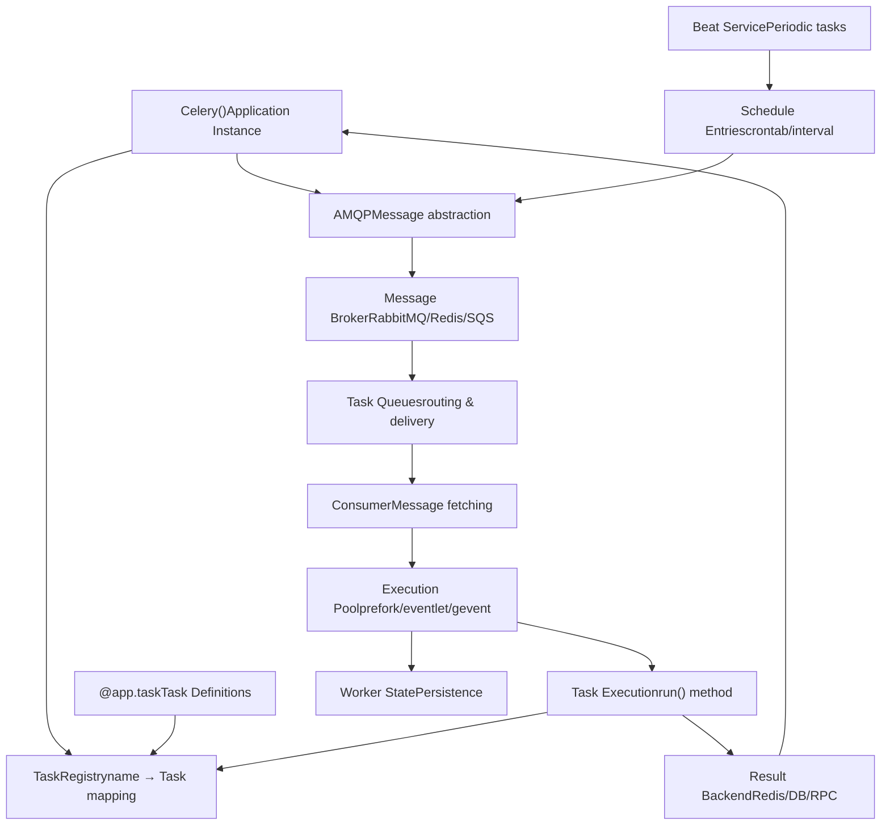
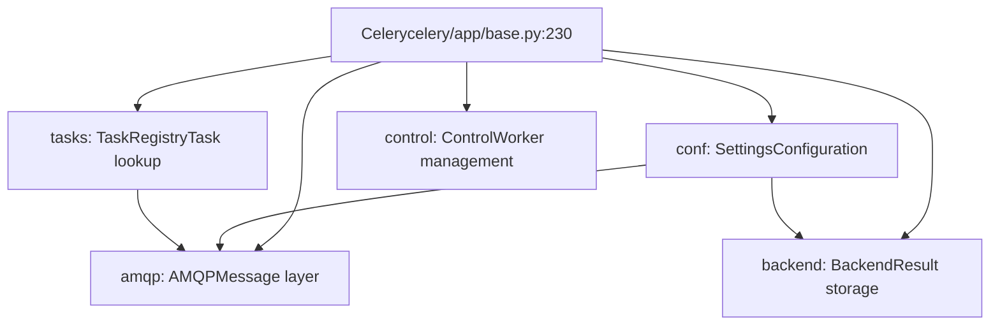
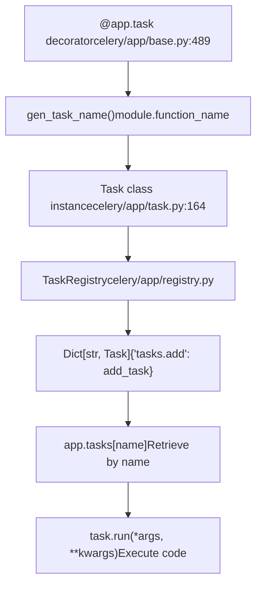
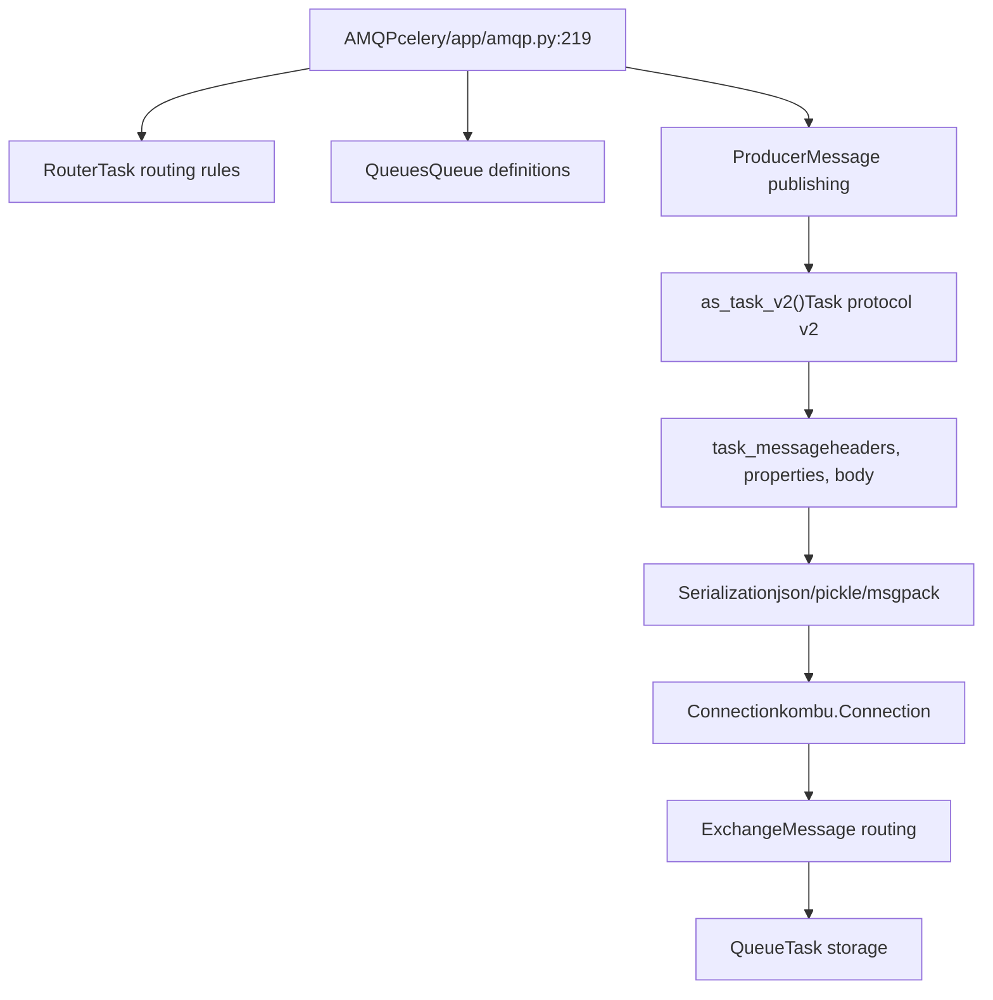
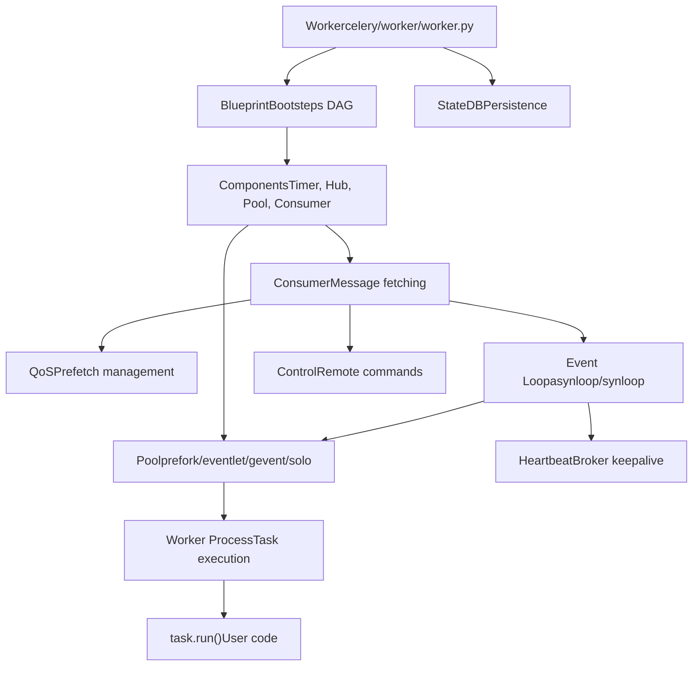
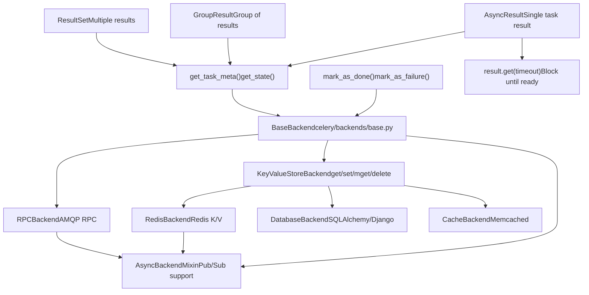
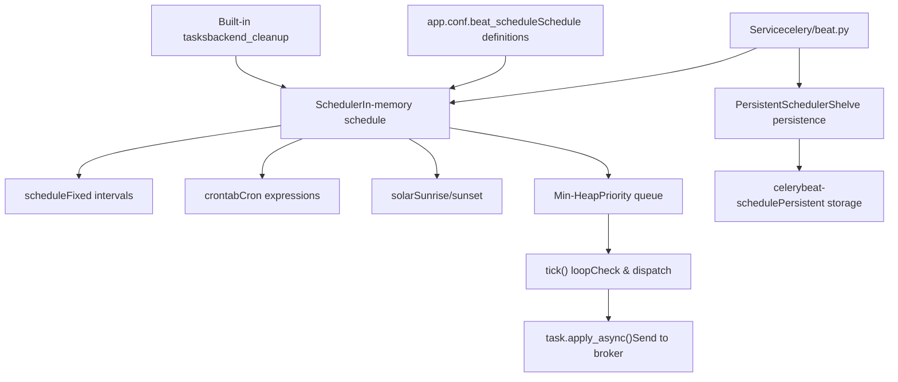
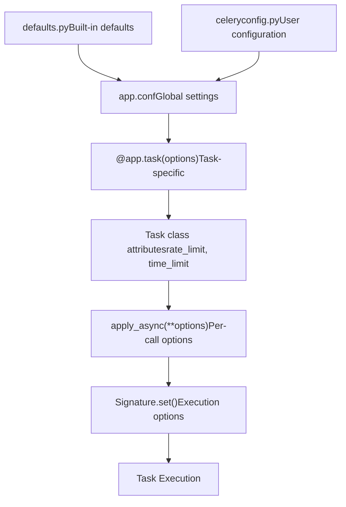

# Core Architecture

Relevant source files

-   [.bumpversion.cfg](https://github.com/celery/celery/blob/4d068b56/.bumpversion.cfg)
-   [Changelog.rst](https://github.com/celery/celery/blob/4d068b56/Changelog.rst)
-   [README.rst](https://github.com/celery/celery/blob/4d068b56/README.rst)
-   [celery/\_\_init\_\_.py](https://github.com/celery/celery/blob/4d068b56/celery/__init__.py)
-   [celery/app/amqp.py](https://github.com/celery/celery/blob/4d068b56/celery/app/amqp.py)
-   [celery/app/base.py](https://github.com/celery/celery/blob/4d068b56/celery/app/base.py)
-   [celery/app/task.py](https://github.com/celery/celery/blob/4d068b56/celery/app/task.py)
-   [celery/canvas.py](https://github.com/celery/celery/blob/4d068b56/celery/canvas.py)
-   [celery/contrib/sphinx.py](https://github.com/celery/celery/blob/4d068b56/celery/contrib/sphinx.py)
-   [celery/utils/\_\_init\_\_.py](https://github.com/celery/celery/blob/4d068b56/celery/utils/__init__.py)
-   [docs/getting-started/introduction.rst](https://github.com/celery/celery/blob/4d068b56/docs/getting-started/introduction.rst)
-   [docs/history/changelog-5.5.rst](https://github.com/celery/celery/blob/4d068b56/docs/history/changelog-5.5.rst)
-   [docs/history/changelog-5.6.rst](https://github.com/celery/celery/blob/4d068b56/docs/history/changelog-5.6.rst)
-   [docs/history/index.rst](https://github.com/celery/celery/blob/4d068b56/docs/history/index.rst)
-   [docs/history/whatsnew-5.5.rst](https://github.com/celery/celery/blob/4d068b56/docs/history/whatsnew-5.5.rst)
-   [docs/history/whatsnew-5.6.rst](https://github.com/celery/celery/blob/4d068b56/docs/history/whatsnew-5.6.rst)
-   [docs/includes/introduction.txt](https://github.com/celery/celery/blob/4d068b56/docs/includes/introduction.txt)
-   [docs/includes/resources.txt](https://github.com/celery/celery/blob/4d068b56/docs/includes/resources.txt)
-   [docs/index.rst](https://github.com/celery/celery/blob/4d068b56/docs/index.rst)
-   [docs/userguide/canvas.rst](https://github.com/celery/celery/blob/4d068b56/docs/userguide/canvas.rst)
-   [t/integration/conftest.py](https://github.com/celery/celery/blob/4d068b56/t/integration/conftest.py)
-   [t/integration/tasks.py](https://github.com/celery/celery/blob/4d068b56/t/integration/tasks.py)
-   [t/integration/test\_canvas.py](https://github.com/celery/celery/blob/4d068b56/t/integration/test_canvas.py)
-   [t/integration/test\_quorum\_queue\_qos\_cluster\_simulation.py](https://github.com/celery/celery/blob/4d068b56/t/integration/test_quorum_queue_qos_cluster_simulation.py)
-   [t/integration/test\_security.py](https://github.com/celery/celery/blob/4d068b56/t/integration/test_security.py)
-   [t/integration/test\_tasks.py](https://github.com/celery/celery/blob/4d068b56/t/integration/test_tasks.py)
-   [t/smoke/tests/test\_canvas.py](https://github.com/celery/celery/blob/4d068b56/t/smoke/tests/test_canvas.py)
-   [t/unit/app/test\_app.py](https://github.com/celery/celery/blob/4d068b56/t/unit/app/test_app.py)
-   [t/unit/tasks/test\_canvas.py](https://github.com/celery/celery/blob/4d068b56/t/unit/tasks/test_canvas.py)
-   [t/unit/tasks/test\_tasks.py](https://github.com/celery/celery/blob/4d068b56/t/unit/tasks/test_tasks.py)

## Purpose and Scope

This page describes the fundamental components of Celery's distributed task queue architecture and how they interact to enable asynchronous task execution. It provides a high-level overview of the system's major subsystems: the application instance, task registry, message brokers, workers, result backends, and the beat scheduler.

For detailed information about specific components, see:

-   Application configuration and initialization: [Application Initialization and Configuration](/celery/celery/2.1-application-initialization-and-configuration)
-   Worker implementation details: [Workers](/celery/celery/5-workers)
-   Result backend implementations: [Result Backends](/celery/celery/6-result-backends)
-   Periodic task scheduling: [Periodic Tasks (Beat)](/celery/celery/7-periodic-tasks-(beat))

---

## System Overview

Celery's architecture follows a distributed message-passing model where clients submit tasks to a broker, workers consume and execute those tasks, and results are stored in a backend. The system is designed for horizontal scalability, high availability, and flexibility.


**Component Interaction Flow:**

1.  Client creates `Celery()` app instance and defines tasks with `@app.task`
2.  Tasks are registered in `TaskRegistry` by name
3.  Client calls `task.apply_async()` which sends message via `AMQP` layer to broker
4.  Worker's `Consumer` fetches messages from broker queues
5.  Worker's execution `Pool` runs task code
6.  Results are stored in `Backend` and can be retrieved via `AsyncResult`
7.  `Beat` scheduler optionally sends periodic tasks to broker

Sources: [celery/\_\_init\_\_.py29-34](https://github.com/celery/celery/blob/4d068b56/celery/__init__.py#L29-L34) [celery/app/base.py230-265](https://github.com/celery/celery/blob/4d068b56/celery/app/base.py#L230-L265) [README.rst94-105](https://github.com/celery/celery/blob/4d068b56/README.rst#L94-L105)

---

## The Celery Application

The `Celery` class is the central entry point for all Celery functionality. It manages configuration, task registration, broker connections, and result backends.


**Key Responsibilities:**

-   **Configuration Management**: Stores settings like `broker_url`, `result_backend`, task routing rules
-   **Task Registry**: Maintains mapping of task names to task classes
-   **Connection Management**: Provides broker connections and producer pools
-   **Result Backend**: Manages result storage backend instance
-   **Worker Control**: Provides API for remote worker management

The application instance is typically created once and imported throughout the codebase:

```
# celery/__init__.py exports
from celery.app.base import Celery
app = Celery('myapp', broker='amqp://guest@localhost//')
```
Sources: [celery/app/base.py230-409](https://github.com/celery/celery/blob/4d068b56/celery/app/base.py#L230-L409) [celery/\_\_init\_\_.py29-34](https://github.com/celery/celery/blob/4d068b56/celery/__init__.py#L29-L34) [README.rst186-196](https://github.com/celery/celery/blob/4d068b56/README.rst#L186-L196)

---

## Task Registry

The `TaskRegistry` is a dictionary-like object that maps task names to task class instances. All tasks must be registered before they can be executed.


**Task Registration Process:**

1.  **Decorator Application**: `@app.task` decorator wraps a function
2.  **Name Generation**: Task name is generated as `module.function_name` via `gen_task_name()`
3.  **Class Creation**: A `Task` subclass is dynamically created
4.  **Registry Insertion**: Task is stored in `app._tasks` (TaskRegistry instance)
5.  **Binding**: Task is bound to the app instance

Task names must be unique across the application. When a worker receives a message, it looks up the task by name in the registry to find the executable code.

```
# Task registration happens automatically with decorator
@app.task
def add(x, y):
    return x + y

# Task is now in registry as 'mymodule.add'
# Worker retrieves it: task = app.tasks['mymodule.add']
```
Sources: [celery/app/base.py489-607](https://github.com/celery/celery/blob/4d068b56/celery/app/base.py#L489-L607) [celery/app/registry.py](https://github.com/celery/celery/blob/4d068b56/celery/app/registry.py) [celery/app/task.py164-320](https://github.com/celery/celery/blob/4d068b56/celery/app/task.py#L164-L320)

---

## Message Infrastructure

Celery uses message brokers to transport task messages between clients and workers. The `AMQP` class provides an abstraction layer over different broker transports.

### Broker Support

| Broker | Transport | Features | Production Ready |
| --- | --- | --- | --- |
| RabbitMQ | `pyamqp://` | Full-featured, routing, priority | ✓ |
| Redis | `redis://` | Fast, simple, pub/sub | ✓ |
| Amazon SQS | `sqs://` | Managed, scalable | ✓ |
| Google Pub/Sub | `gcpubsub://` | Managed, cloud-native | Experimental |


**Message Creation Process:**

The `AMQP` class handles creating task messages through the `as_task_v2()` method:

1.  **Task Information**: Task name, arguments, kwargs
2.  **Execution Options**: ETA, countdown, expires, time limits
3.  **Routing**: Queue name, exchange, routing key
4.  **Serialization**: Message body is serialized (default: JSON)
5.  **Publishing**: Message is sent to broker via producer

**Task Message Structure (v2 protocol):**

```
task_message(
    headers={
        'lang': 'py',
        'task': 'tasks.add',
        'id': task_id,
        'eta': None,
        'expires': None,
        # ... more metadata
    },
    properties={
        'correlation_id': task_id,
        'reply_to': reply_queue,
    },
    body=(args, kwargs, embedded_signatures)
)
```
Sources: [celery/app/amqp.py219-487](https://github.com/celery/celery/blob/4d068b56/celery/app/amqp.py#L219-L487) [celery/app/amqp.py320-412](https://github.com/celery/celery/blob/4d068b56/celery/app/amqp.py#L320-L412) [README.rst144-148](https://github.com/celery/celery/blob/4d068b56/README.rst#L144-L148)

---

## Workers

Workers are long-running processes that consume task messages from brokers and execute the task code. Workers use a sophisticated bootsteps framework to manage their lifecycle.


**Worker Architecture Layers:**

1.  **Bootsteps Framework**: Manages component initialization order (Timer → Hub → Pool → Consumer)
2.  **Consumer**: Fetches messages from broker, manages QoS (prefetch limits)
3.  **Event Loop**: Processes I/O events (asynloop for async, synloop for blocking)
4.  **Execution Pool**: Isolates task execution in separate processes/threads/greenlets
5.  **State Management**: Tracks task state, handles heartbeats, responds to control commands

**Concurrency Models:**

| Pool Type | Isolation | Concurrency | Use Case |
| --- | --- | --- | --- |
| prefork | Process | multiprocessing | CPU-bound tasks |
| eventlet | Greenlet | Cooperative | I/O-bound tasks |
| gevent | Greenlet | Cooperative | I/O-bound tasks |
| solo | None | Single-threaded | Development/testing |
| threads | Thread | Threading | I/O-bound tasks |

Workers are started via the CLI: `celery -A myapp worker -l info`

Sources: [celery/worker/worker.py](https://github.com/celery/celery/blob/4d068b56/celery/worker/worker.py) [celery/worker/consumer/consumer.py](https://github.com/celery/celery/blob/4d068b56/celery/worker/consumer/consumer.py) [README.rst204-209](https://github.com/celery/celery/blob/4d068b56/README.rst#L204-L209)

---

## Result Backends

Result backends store task return values, state, and exceptions. They provide the `AsyncResult` API for retrieving results.


**Backend Architecture:**

1.  **BaseBackend**: Abstract interface defining `store_result()`, `get_task_meta()`, etc.
2.  **KeyValueStoreBackend**: Adds K/V-specific methods with key prefixing
3.  **AsyncBackendMixin**: Enables real-time result consumption via pub/sub

**Result Storage:**

```
# Worker stores result
backend.mark_as_done(task_id, result)

# Client retrieves result
async_result = AsyncResult(task_id)
result = async_result.get(timeout=10)  # Blocks until ready
```
**Backend Selection:**

Backends are configured via `result_backend` setting:

```
app = Celery('myapp',
    broker='amqp://',
    result_backend='redis://localhost:6379/0')
```
**Key Prefixes:**

Backends use prefixed keys to organize data:

-   Task results: `celery-task-meta-{task_id}`
-   Group results: `celery-taskset-meta-{group_id}`
-   Chord results: `celery-chord-{chord_id}`

Sources: [celery/backends/base.py](https://github.com/celery/celery/blob/4d068b56/celery/backends/base.py) [celery/backends/redis.py](https://github.com/celery/celery/blob/4d068b56/celery/backends/redis.py) [celery/result.py](https://github.com/celery/celery/blob/4d068b56/celery/result.py) [README.rst227-234](https://github.com/celery/celery/blob/4d068b56/README.rst#L227-L234)

---

## Beat Scheduler

The Beat scheduler is a separate service that sends periodic tasks to the broker on a schedule. It maintains a priority queue of scheduled entries.


**Beat Operation:**

1.  **Initialization**: Load schedule from `app.conf.beat_schedule` and built-in tasks
2.  **Heap Ordering**: Schedule entries are ordered by next execution time
3.  **Tick Loop**:
    -   Pop next due entry from heap
    -   Check if entry is due using `schedule.is_due()`
    -   Apply task by calling `task.apply_async()`
    -   Calculate next run time
    -   Push entry back onto heap
4.  **Persistence**: `PersistentScheduler` saves state to disk via shelve

**Schedule Definition:**

```
app.conf.beat_schedule = {
    'add-every-30-seconds': {
        'task': 'tasks.add',
        'schedule': 30.0,  # seconds
        'args': (16, 16)
    },
    'add-every-monday-morning': {
        'task': 'tasks.add',
        'schedule': crontab(hour=7, minute=30, day_of_week=1),
        'args': (16, 16),
    },
}
```
Beat is started separately from workers: `celery -A myapp beat`

Sources: [celery/beat.py](https://github.com/celery/celery/blob/4d068b56/celery/beat.py) [celery/schedules.py](https://github.com/celery/celery/blob/4d068b56/celery/schedules.py) [README.rst100-102](https://github.com/celery/celery/blob/4d068b56/README.rst#L100-L102)

---

## Component Interaction

This section describes how all components work together in typical task execution scenarios.

### Task Submission Flow

> **[Mermaid sequence]**
> *(图表结构无法解析)*

**Step-by-Step Execution:**

1.  **Client Submission**:

    -   `task.apply_async()` is called
    -   App looks up task in `TaskRegistry`
    -   AMQP layer creates task message with v2 protocol
2.  **Message Publishing**:

    -   Message is serialized (JSON by default)
    -   Router determines target queue
    -   Producer publishes to broker exchange
3.  **Worker Consumption**:

    -   Consumer fetches message (respecting QoS prefetch)
    -   Message is deserialized and validated
    -   Task is marked as STARTED in backend
4.  **Task Execution**:

    -   Message dispatched to execution pool
    -   Task code runs in isolated worker process/thread
    -   Return value or exception is captured
5.  **Result Storage**:

    -   Backend stores result as SUCCESS or FAILURE
    -   Message is ACKed to broker
    -   Client can retrieve result via `AsyncResult.get()`

### Configuration Hierarchy


Configuration follows a precedence hierarchy where more specific settings override general ones:

1.  **Built-in Defaults**: [celery/app/defaults.py](https://github.com/celery/celery/blob/4d068b56/celery/app/defaults.py)
2.  **App Configuration**: Set via `app.conf` or config module
3.  **Task Definition**: Options in `@app.task()` decorator
4.  **Task Class**: Attributes on Task subclass
5.  **Apply Call**: Options in `apply_async()`
6.  **Signature**: Options set via `.set()`

Sources: [celery/app/base.py377-382](https://github.com/celery/celery/blob/4d068b56/celery/app/base.py#L377-L382) [celery/app/task.py446-563](https://github.com/celery/celery/blob/4d068b56/celery/app/task.py#L446-L563) [celery/app/defaults.py](https://github.com/celery/celery/blob/4d068b56/celery/app/defaults.py)

---

## Summary

Celery's architecture consists of six major components that work together to provide distributed task execution:

| Component | Purpose | Key Classes |
| --- | --- | --- |
| **Application** | Configuration & registry | `Celery`, `Settings` |
| **Task Registry** | Task name → class mapping | `TaskRegistry`, `Task` |
| **Message Infrastructure** | Broker abstraction | `AMQP`, `Producer`, `Queue` |
| **Workers** | Task execution | `Worker`, `Consumer`, `Pool` |
| **Result Backends** | Result storage | `BaseBackend`, `AsyncResult` |
| **Beat Scheduler** | Periodic tasks | `Service`, `Scheduler`, `schedule` |

The system is designed for:

-   **Horizontal Scalability**: Add more workers to handle load
-   **High Availability**: Multiple brokers and workers prevent single points of failure
-   **Flexibility**: Pluggable brokers, backends, and execution pools
-   **Reliability**: Message acknowledgments, retries, and result persistence

For implementation details of each component, refer to the linked subsystem pages.

Sources: [celery/\_\_init\_\_.py1-173](https://github.com/celery/celery/blob/4d068b56/celery/__init__.py#L1-L173) [celery/app/base.py230-265](https://github.com/celery/celery/blob/4d068b56/celery/app/base.py#L230-L265) [README.rst91-151](https://github.com/celery/celery/blob/4d068b56/README.rst#L91-L151)
