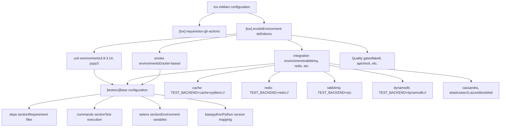
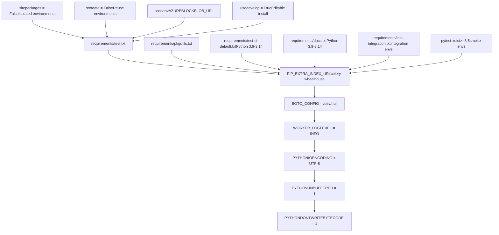
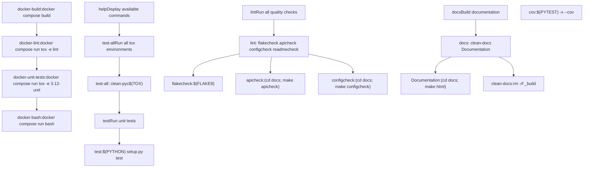
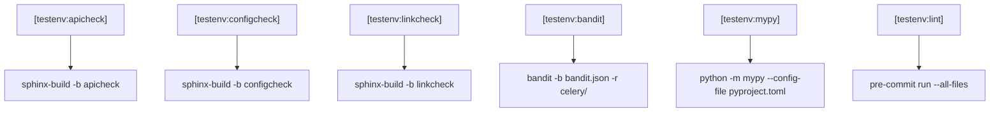
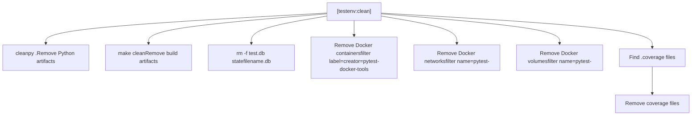
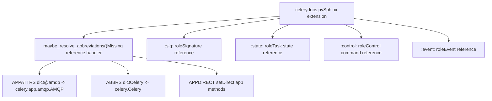
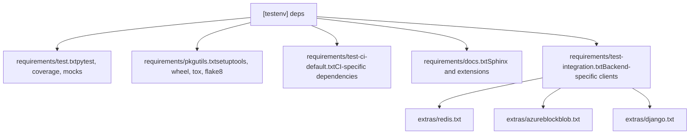

# Testing Infrastructure

Relevant source files

-   [Makefile](https://github.com/celery/celery/blob/4d068b56/Makefile)
-   [celery/app/backends.py](https://github.com/celery/celery/blob/4d068b56/celery/app/backends.py)
-   [docs/Makefile](https://github.com/celery/celery/blob/4d068b56/docs/Makefile)
-   [docs/\_ext/celerydocs.py](https://github.com/celery/celery/blob/4d068b56/docs/_ext/celerydocs.py)
-   [docs/changelog\_formatter.py](https://github.com/celery/celery/blob/4d068b56/docs/changelog_formatter.py)
-   [requirements/docs.txt](https://github.com/celery/celery/blob/4d068b56/requirements/docs.txt)
-   [requirements/pkgutils.txt](https://github.com/celery/celery/blob/4d068b56/requirements/pkgutils.txt)
-   [requirements/test-integration.txt](https://github.com/celery/celery/blob/4d068b56/requirements/test-integration.txt)
-   [tox.ini](https://github.com/celery/celery/blob/4d068b56/tox.ini)

## Purpose and Scope

This document explains Celery's testing infrastructure, focusing on the `tox.ini` configuration and `Makefile` that orchestrate test execution, code quality checks, and documentation validation. For information about the actual test implementations and test matrix configurations, see [Test Matrix and Environments](/celery/celery/10.2-test-matrix-and-environments). For integration testing details, see [Integration and Smoke Tests](/celery/celery/10.3-integration-and-smoke-tests). For documentation quality gates, see [Code Quality and Documentation](/celery/celery/10.4-code-quality-and-documentation).

---

## Overview

Celery's testing infrastructure uses two primary orchestration systems:

-   **tox** ([tox.ini1-137](https://github.com/celery/celery/blob/4d068b56/tox.ini#L1-L137)): Manages test environments across Python versions, test categories, and backend configurations
-   **make** ([Makefile1-205](https://github.com/celery/celery/blob/4d068b56/Makefile#L1-L205)): Provides convenient shorthand commands that invoke tox and other tools

The infrastructure supports three test categories: **unit tests** (fast, no external dependencies), **integration tests** (require external services like Redis, RabbitMQ), and **smoke tests** (full system tests in Docker). It also enforces quality gates including linting, security scanning, and documentation completeness checks.

**Sources:** [tox.ini1-137](https://github.com/celery/celery/blob/4d068b56/tox.ini#L1-L137) [Makefile1-205](https://github.com/celery/celery/blob/4d068b56/Makefile#L1-L205)

---

## Tox Configuration Architecture

The `tox.ini` file defines the complete test orchestration system. It specifies environment definitions, dependencies, commands, and environment variables for all test scenarios.

### Configuration Structure


**Diagram: Tox Configuration Architecture**

**Sources:** [tox.ini1-137](https://github.com/celery/celery/blob/4d068b56/tox.ini#L1-L137)

### Environment List Definition

The `envlist` defines all test environments using a matrix expansion syntax:

```
envlist =
    {3.9,3.10,3.11,3.12,3.13,3.14,pypy3}-unit
    {3.9,3.10,3.11,3.12,3.13,3.14,pypy3}-integration-{rabbitmq_redis,rabbitmq,redis,dynamodb,azureblockblob,cache,cassandra,elasticsearch,docker}
    {3.9,3.10,3.11,3.12,3.13,3.14,pypy3}-smoke
```
This expands to over 100 environment combinations. For example:

-   `3.9-unit`: Run unit tests with Python 3.9
-   `3.12-integration-redis`: Run integration tests with Python 3.12 using Redis backend
-   `pypy3-smoke`: Run smoke tests with PyPy3

**Sources:** [tox.ini4-7](https://github.com/celery/celery/blob/4d068b56/tox.ini#L4-L7)

### GitHub Actions Integration

The `[gh-actions]` section maps GitHub Actions Python versions to tox environments:

| GitHub Python Version | Tox Environment |
| --- | --- |
| 3.9 | 3.9-unit |
| 3.10 | 3.10-unit |
| 3.11 | 3.11-unit |
| 3.12 | 3.12-unit |
| 3.13 | 3.13-unit |
| 3.14 | 3.14-unit |
| pypy-3 | pypy3-unit |

This allows GitHub Actions to automatically select the correct tox environment based on the Python version matrix.

**Sources:** [tox.ini15-23](https://github.com/celery/celery/blob/4d068b56/tox.ini#L15-L23)

---

## Test Environment Configuration

### Base Test Environment

The `[testenv]` section defines common configuration for all test environments:


**Diagram: Base Test Environment Configuration Flow**

**Sources:** [tox.ini25-59](https://github.com/celery/celery/blob/4d068b56/tox.ini#L25-L59)

### Commands by Test Type

The `commands` section defines different test execution strategies:

| Test Type | Command | Purpose |
| --- | --- | --- |
| unit | `coverage run --source=celery -m pytest -vv --maxfail=10` | Run unit tests with coverage |
| unit | `coverage xml` | Generate XML coverage report |
| unit | `coverage report` | Display coverage summary |
| integration | `pytest -xsvv t/integration {posargs}` | Run integration tests with verbose output |
| smoke | `pytest -xsvv t/smoke --dist=loadscope --reruns 5 --reruns-delay 10` | Run smoke tests with retries and parallel execution |

The `{posargs}` placeholder allows passing additional arguments: `tox -e 3.12-unit -- -k test_specific`.

**Sources:** [tox.ini46-51](https://github.com/celery/celery/blob/4d068b56/tox.ini#L46-L51)

### Backend-Specific Configuration

Each backend type sets specific environment variables via the `setenv` section:


**Diagram: Backend Configuration Matrix**

Each backend configuration specifies:

1.  **TEST\_BROKER**: The message broker URL
2.  **TEST\_BACKEND**: The result backend URL
3.  **Additional variables**: Backend-specific credentials or settings

**Sources:** [tox.ini60-87](https://github.com/celery/celery/blob/4d068b56/tox.ini#L60-L87)

---

## Makefile Integration

The `Makefile` provides convenience targets that wrap tox commands and other tools.

### Core Makefile Structure


**Diagram: Makefile Target Dependencies**

**Sources:** [Makefile1-205](https://github.com/celery/celery/blob/4d068b56/Makefile#L1-L205)

### Key Makefile Targets

#### Test Targets

| Target | Command | Purpose |
| --- | --- | --- |
| `test-all` | `$(TOX)` | Run all tox environments defined in envlist |
| `test` | `$(PYTHON) setup.py test` | Run tests with current Python interpreter |
| `cov` | `$(PYTEST) -x --cov="$(PROJ)" --cov-report=html` | Run tests with coverage HTML report |

**Sources:** [Makefile141-148](https://github.com/celery/celery/blob/4d068b56/Makefile#L141-L148)

#### Lint Targets

| Target | Command | Purpose |
| --- | --- | --- |
| `lint` | `flakecheck apicheck configcheck readmecheck` | Run all quality checks |
| `flakecheck` | `$(FLAKE8) "$(PROJ)" "$(TESTDIR)"` | Check code style with flake8 |
| `apicheck` | `(cd "$(SPHINX_DIR)"; $(MAKE) apicheck)` | Verify API documentation completeness |
| `configcheck` | `(cd "$(SPHINX_DIR)"; $(MAKE) configcheck)` | Verify configuration documentation |
| `readmecheck` | `readmecheck-unicode readmecheck-rst` | Validate README.rst encoding and syntax |

**Sources:** [Makefile86-116](https://github.com/celery/celery/blob/4d068b56/Makefile#L86-L116)

#### Documentation Targets

| Target | Command | Purpose |
| --- | --- | --- |
| `docs` | `clean-docs Documentation` | Build HTML documentation |
| `Documentation` | `(cd "$(SPHINX_DIR)"; $(MAKE) html)` | Invoke Sphinx build |
| `clean-docs` | `rm -rf "$(SPHINX_BUILDDIR)" "$(DOCUMENTATION)"` | Remove documentation artifacts |

**Sources:** [Makefile77-84](https://github.com/celery/celery/blob/4d068b56/Makefile#L77-L84)

#### Docker Targets

| Target | Command | Purpose |
| --- | --- | --- |
| `docker-build` | `docker compose -f docker/docker-compose.yml build` | Build Celery Docker container |
| `docker-lint` | `docker compose ... run ... tox -e lint` | Run linting in Docker |
| `docker-unit-tests` | `docker compose ... run ... tox -e 3.12-unit` | Run unit tests in Docker |
| `docker-bash` | `docker compose ... run ... bash` | Get shell in container |
| `docker-docs` | `docker compose up --build -d docs` | Build docs in Docker with live reload |

**Sources:** [Makefile169-201](https://github.com/celery/celery/blob/4d068b56/Makefile#L169-L201)

---

## Quality Gate Environments

Tox defines several specialized environments for quality gates that don't run tests but verify code and documentation quality.

### Quality Gate Configuration


**Diagram: Quality Gate Environments**

**Sources:** [tox.ini101-124](https://github.com/celery/celery/blob/4d068b56/tox.ini#L101-L124)

### Individual Quality Gates

#### mypy Type Checking

The `[testenv:mypy]` environment runs static type checking:

```
[testenv:mypy]
commands = python -m mypy --config-file pyproject.toml
```
This validates type annotations throughout the codebase against `pyproject.toml` configuration.

**Sources:** [tox.ini101-102](https://github.com/celery/celery/blob/4d068b56/tox.ini#L101-L102)

#### apicheck Documentation

The `[testenv:apicheck]` environment verifies API documentation completeness:

```
[testenv:apicheck]
setenv =
    PYTHONHASHSEED = 100
commands =
    sphinx-build -j2 -b apicheck -d {envtmpdir}/doctrees docs docs/_build/apicheck
```
This uses a custom Sphinx builder to ensure all public APIs are documented. The `PYTHONHASHSEED` ensures deterministic output.

**Sources:** [tox.ini104-108](https://github.com/celery/celery/blob/4d068b56/tox.ini#L104-L108)

#### configcheck Documentation

The `[testenv:configcheck]` environment verifies configuration documentation:

```
[testenv:configcheck]
commands =
    sphinx-build -j2 -b configcheck -d {envtmpdir}/doctrees docs docs/_build/configcheck
```
This ensures all configuration options are documented.

**Sources:** [tox.ini110-112](https://github.com/celery/celery/blob/4d068b56/tox.ini#L110-L112)

#### linkcheck External Links

The `[testenv:linkcheck]` environment validates external URLs:

```
[testenv:linkcheck]
commands =
    sphinx-build -j2 -b linkcheck -d {envtmpdir}/doctrees docs docs/_build/linkcheck
```
This checks that all external links in documentation are valid.

**Sources:** [tox.ini114-116](https://github.com/celery/celery/blob/4d068b56/tox.ini#L114-L116)

#### bandit Security Scanning

The `[testenv:bandit]` environment runs security vulnerability scanning:

```
[testenv:bandit]
commands =
    bandit -b bandit.json -r celery/
```
This scans the `celery/` directory for common security issues using rules defined in `bandit.json`.

**Sources:** [tox.ini118-120](https://github.com/celery/celery/blob/4d068b56/tox.ini#L118-L120)

#### lint Pre-commit Hooks

The `[testenv:lint]` environment runs all pre-commit hooks:

```
[testenv:lint]
commands =
    pre-commit {posargs:run --all-files --show-diff-on-failure}
```
This executes linters, formatters, and other checks defined in `.pre-commit-config.yaml`.

**Sources:** [tox.ini122-124](https://github.com/celery/celery/blob/4d068b56/tox.ini#L122-L124)

---

## Cleanup Environment

The `[testenv:clean]` environment provides comprehensive cleanup of test artifacts:


**Diagram: Cleanup Environment Operations**

The cleanup process includes:

1.  **Coverage files**: Removes all `.coverage*` files
2.  **Docker artifacts**: Removes containers, networks, and volumes created by `pytest-docker-tools`
3.  **Python artifacts**: Uses `cleanpy` to remove `.pyc`, `__pycache__`, etc.
4.  **Build artifacts**: Invokes `make clean` to remove build directories
5.  **Database files**: Removes test database files

**Sources:** [tox.ini126-137](https://github.com/celery/celery/blob/4d068b56/tox.ini#L126-L137)

---

## Documentation Infrastructure

### Sphinx Extension System

The `celerydocs.py` custom Sphinx extension provides intelligent cross-referencing for Celery-specific constructs:


**Diagram: Custom Sphinx Extension Architecture**

The extension allows documentation to use shortcuts like `@amqp` which resolve to `celery.app.amqp.AMQP`, and defines custom cross-reference types for Celery-specific constructs.

**Sources:** [docs/\_ext/celerydocs.py1-181](https://github.com/celery/celery/blob/4d068b56/docs/_ext/celerydocs.py#L1-L181)

### Documentation Build Targets

The `docs/Makefile` provides specialized build targets:

| Target | Command | Purpose |
| --- | --- | --- |
| `html` | `sphinx-build -b html` | Build HTML documentation |
| `livehtml` | `sphinx-autobuild --host 0.0.0.0 --port 7000` | Live-reload documentation server |
| `apicheck` | `sphinx-build -b apicheck` | Verify API documentation completeness |
| `configcheck` | `sphinx-build -b configcheck` | Verify configuration documentation |
| `linkcheck` | `sphinx-build -b linkcheck` | Check external links |
| `spelling` | `SPELLCHECK=1 sphinx-build -b spelling` | Spell-check documentation |

**Sources:** [docs/Makefile19-241](https://github.com/celery/celery/blob/4d068b56/docs/Makefile#L19-L241)

---

## Dependency Management

### Requirement Files

The testing infrastructure uses multiple requirement files for different purposes:


**Diagram: Requirement File Dependencies**

**Sources:** [tox.ini31-44](https://github.com/celery/celery/blob/4d068b56/tox.ini#L31-L44) [requirements/docs.txt1-10](https://github.com/celery/celery/blob/4d068b56/requirements/docs.txt#L1-L10) [requirements/test-integration.txt1-8](https://github.com/celery/celery/blob/4d068b56/requirements/test-integration.txt#L1-L8) [requirements/pkgutils.txt1-12](https://github.com/celery/celery/blob/4d068b56/requirements/pkgutils.txt#L1-L12)

### Package Utilities

The `requirements/pkgutils.txt` file specifies tools needed for package development:

| Tool | Version | Purpose |
| --- | --- | --- |
| setuptools | \>=40.8.0 | Package building |
| wheel | \>=0.33.1 | Wheel distribution format |
| flake8 | \>=3.8.3 | Code style checking |
| flake8-docstrings | \>=1.7.0 | Docstring style checking |
| pydocstyle | \==6.3.0 | Docstring convention checking |
| tox | \>=3.8.4 | Test environment management |
| sphinx2rst | \>=1.0 | Sphinx to RST conversion |
| bumpversion | \==0.6.0 | Version number management |

**Sources:** [requirements/pkgutils.txt1-12](https://github.com/celery/celery/blob/4d068b56/requirements/pkgutils.txt#L1-L12)

---

## Execution Flow

### Complete Test Execution Flow

> **[Mermaid sequence]**
> *(图表结构无法解析)*

**Diagram: Test Execution Flow**

**Sources:** [tox.ini46-51](https://github.com/celery/celery/blob/4d068b56/tox.ini#L46-L51) [Makefile141-142](https://github.com/celery/celery/blob/4d068b56/Makefile#L141-L142)

### Individual Test Command Flow

When running a specific test environment:

```
# Direct tox invocation
tox -e 3.12-unit

# With additional pytest arguments
tox -e 3.12-unit -- -k test_task_retry

# Integration test with specific backend
tox -e 3.12-integration-redis

# Quality gate
tox -e apicheck
```
The flow:

1.  Tox reads `[testenv]` and `[testenv:3.12-unit]` configuration
2.  Creates/reuses virtual environment with Python 3.12
3.  Installs dependencies from `deps` section
4.  Sets environment variables from `setenv` section
5.  Executes commands from `commands` section
6.  Reports results to stdout

**Sources:** [tox.ini25-100](https://github.com/celery/celery/blob/4d068b56/tox.ini#L25-L100)

---

## Summary

Celery's testing infrastructure provides:

-   **Multi-Python testing**: Supports Python 3.9-3.14 and PyPy3
-   **Multiple test categories**: Unit (fast), integration (backend-specific), smoke (full system)
-   **Quality gates**: Linting (flake8), type checking (mypy), security (bandit), documentation (apicheck/configcheck)
-   **Flexible execution**: Via tox directly or make shortcuts
-   **Backend matrix**: Tests against 9+ backend configurations
-   **Docker support**: Container-based testing for CI environments
-   **Documentation validation**: Ensures API completeness and link validity

The system orchestrates over 100 test environment combinations while maintaining clear organization through tox's environment definition system and make's convenience targets.

**Sources:** [tox.ini1-137](https://github.com/celery/celery/blob/4d068b56/tox.ini#L1-L137) [Makefile1-205](https://github.com/celery/celery/blob/4d068b56/Makefile#L1-L205)
