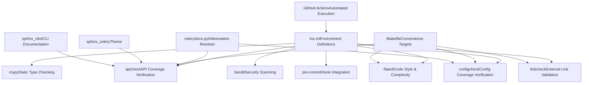
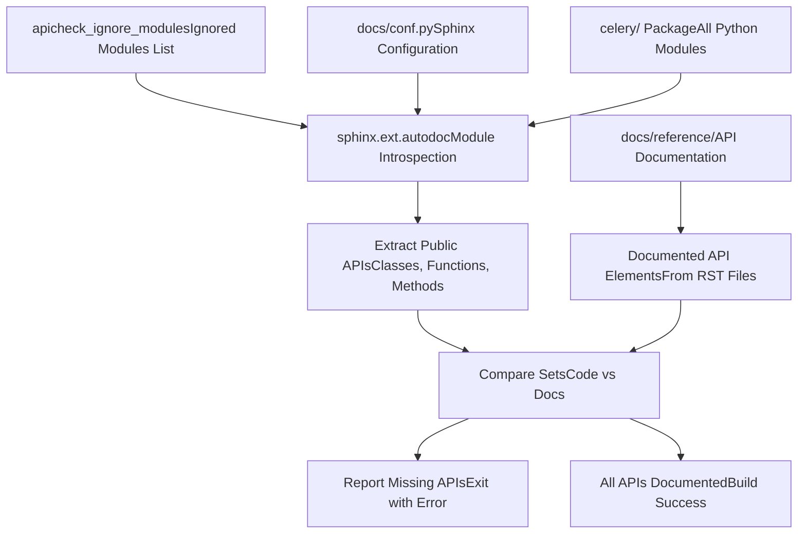
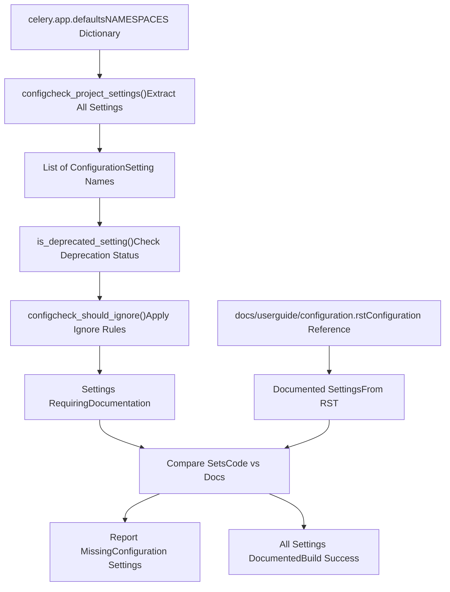
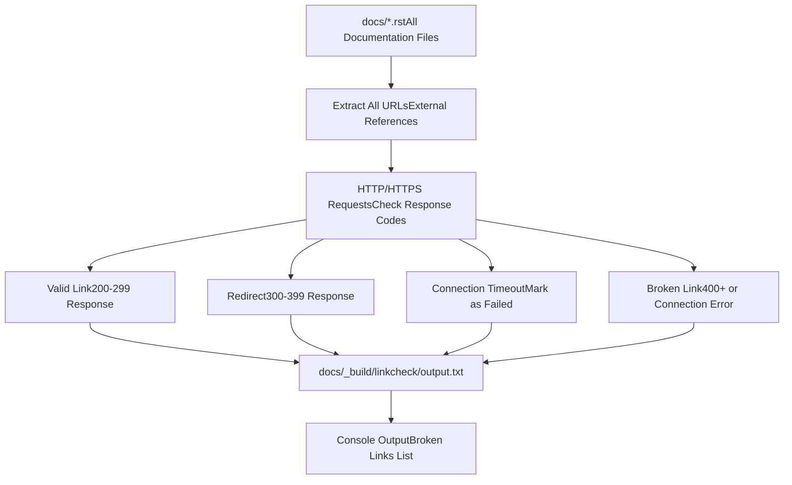
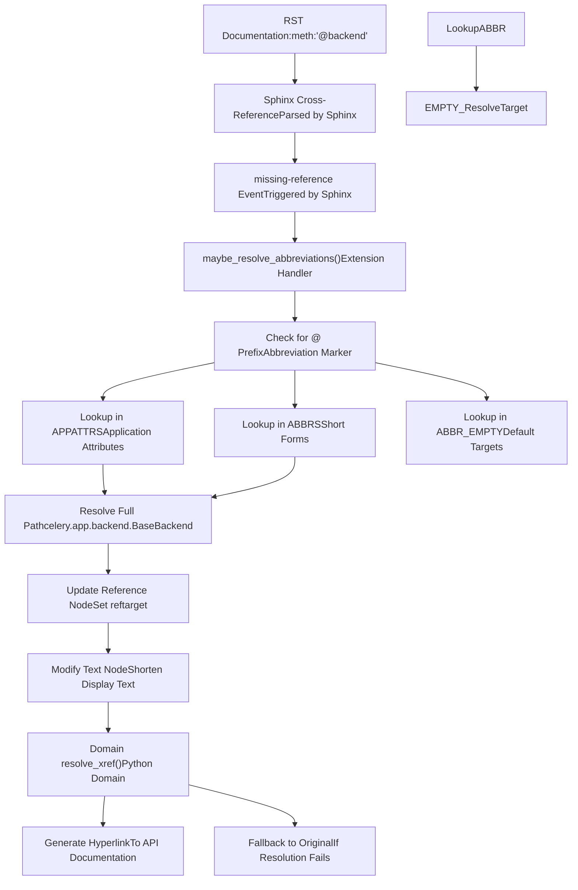
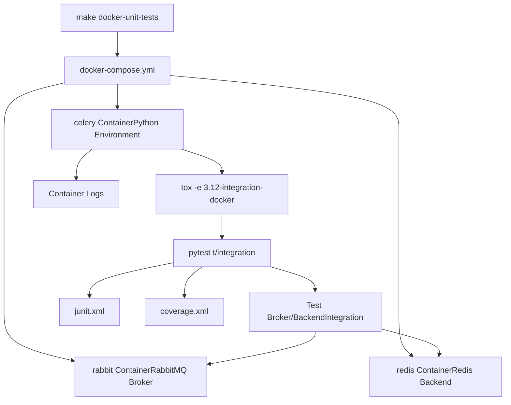
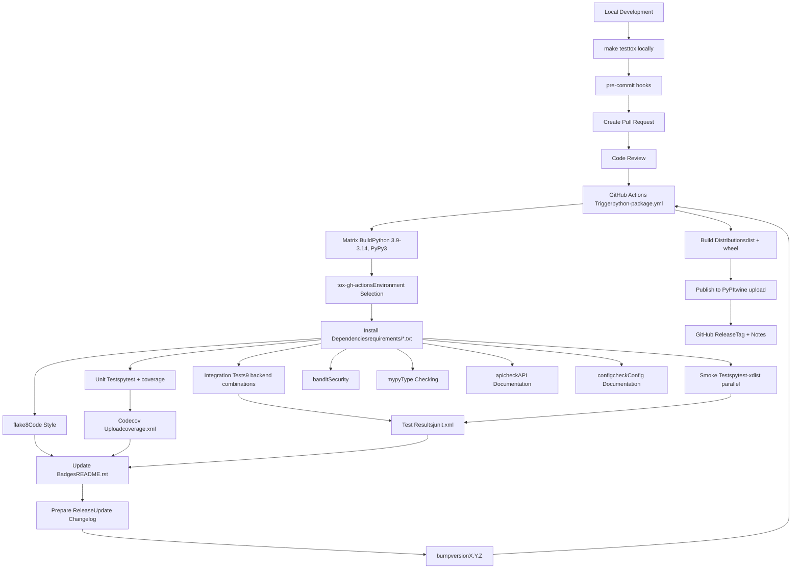
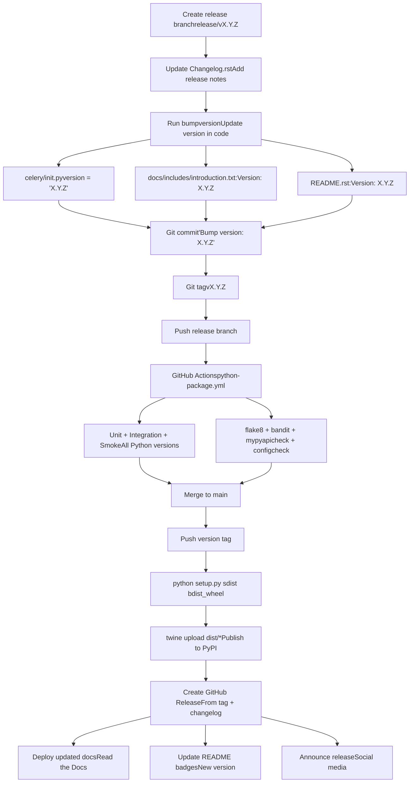

# Code Quality and Documentation

Relevant source files

-   [Makefile](https://github.com/celery/celery/blob/4d068b56/Makefile)
-   [celery/app/backends.py](https://github.com/celery/celery/blob/4d068b56/celery/app/backends.py)
-   [docs/Makefile](https://github.com/celery/celery/blob/4d068b56/docs/Makefile)
-   [docs/\_ext/celerydocs.py](https://github.com/celery/celery/blob/4d068b56/docs/_ext/celerydocs.py)
-   [docs/changelog\_formatter.py](https://github.com/celery/celery/blob/4d068b56/docs/changelog_formatter.py)
-   [requirements/docs.txt](https://github.com/celery/celery/blob/4d068b56/requirements/docs.txt)
-   [requirements/pkgutils.txt](https://github.com/celery/celery/blob/4d068b56/requirements/pkgutils.txt)
-   [requirements/test-integration.txt](https://github.com/celery/celery/blob/4d068b56/requirements/test-integration.txt)
-   [tox.ini](https://github.com/celery/celery/blob/4d068b56/tox.ini)

## Purpose and Scope

This document describes Celery's code quality enforcement and documentation verification systems. It covers static analysis tools (flake8, mypy, bandit), documentation completeness checks (apicheck, configcheck, linkcheck), and the custom `celerydocs.py` Sphinx extension for cross-referencing. For information about the test execution framework, see [Testing Infrastructure](/celery/celery/10.1-testing-infrastructure). For CI/CD integration details, see the testing pages.

Celery enforces quality through multiple validation layers that verify code style, type correctness, security, and documentation completeness before code is merged.

## Quality Gate Architecture

Celery's quality enforcement system consists of multiple independent validation tools, each verifying different aspects of code quality:

**Quality Gate Architecture:**


**Sources:** [tox.ini9-12](https://github.com/celery/celery/blob/4d068b56/tox.ini#L9-L12) [Makefile86](https://github.com/celery/celery/blob/4d068b56/Makefile#L86-L86)

### Quality Gate Environments

The [tox.ini9-12](https://github.com/celery/celery/blob/4d068b56/tox.ini#L9-L12) configuration defines dedicated environments for quality checks:

| Environment | Tool | Python Version | Purpose |
| --- | --- | --- | --- |
| `flake8` | flake8 | 3.13 | Code style and complexity checking |
| `mypy` | mypy | 3.13 | Static type analysis |
| `bandit` | bandit | 3.13 | Security vulnerability scanning |
| `lint` | pre-commit | 3.13 | Runs all pre-commit hooks |
| `apicheck` | sphinx-build | 3.13 | API documentation coverage |
| `configcheck` | sphinx-build | 3.13 | Configuration documentation coverage |
| `linkcheck` | sphinx-build | 3.13 | External link validation |

All quality gates run on Python 3.13 [tox.ini98](https://github.com/celery/celery/blob/4d068b56/tox.ini#L98-L98) to ensure consistent results.

**Sources:** [tox.ini9-12](https://github.com/celery/celery/blob/4d068b56/tox.ini#L9-L12) [tox.ini98](https://github.com/celery/celery/blob/4d068b56/tox.ini#L98-L98)

## Code Style Checking (flake8)

The `flake8` environment validates code style, complexity, and docstring quality across the Celery codebase.

### Flake8 Configuration

**Tool Stack:**

-   `flake8>=3.8.3` - Core linter [requirements/pkgutils.txt3](https://github.com/celery/celery/blob/4d068b56/requirements/pkgutils.txt#L3-L3)
-   `flake8-docstrings>=1.7.0` - Docstring style checker [requirements/pkgutils.txt4](https://github.com/celery/celery/blob/4d068b56/requirements/pkgutils.txt#L4-L4)
-   `pydocstyle==6.3.0` - Docstring conventions enforcer [requirements/pkgutils.txt5](https://github.com/celery/celery/blob/4d068b56/requirements/pkgutils.txt#L5-L5)

**Execution Methods:**

```
# Via Makefile
make flakecheck

# Via tox (implicit environment)
tox -e lint

# Direct execution
flake8 celery t
```
**Makefile Integration** [Makefile94-95](https://github.com/celery/celery/blob/4d068b56/Makefile#L94-L95):

```
flakecheck:
	$(FLAKE8) "$(PROJ)" "$(TESTDIR)"
```
This checks both the `celery/` source directory and `t/` test directory.

**Sources:** [requirements/pkgutils.txt3-5](https://github.com/celery/celery/blob/4d068b56/requirements/pkgutils.txt#L3-L5) [Makefile94-95](https://github.com/celery/celery/blob/4d068b56/Makefile#L94-L95) [Makefile86](https://github.com/celery/celery/blob/4d068b56/Makefile#L86-L86)

### What Flake8 Validates

**Code Style Checks:**

-   PEP 8 compliance (line length, indentation, spacing)
-   Naming conventions (functions, classes, variables)
-   Import ordering and organization
-   Unused imports and variables

**Complexity Checks:**

-   Cyclomatic complexity of functions
-   Function length limits
-   Nesting depth limits

**Docstring Checks:**

-   Presence of module, class, and function docstrings
-   Docstring formatting (PEP 257)
-   Argument documentation completeness

**Sources:** [requirements/pkgutils.txt3-5](https://github.com/celery/celery/blob/4d068b56/requirements/pkgutils.txt#L3-L5)

## Static Type Checking (mypy)

The `mypy` environment [tox.ini101-102](https://github.com/celery/celery/blob/4d068b56/tox.ini#L101-L102) performs static type analysis to catch type-related errors before runtime.

### MyPy Configuration

**Tox Environment Definition:**

```
[testenv:mypy]
commands = python -m mypy --config-file pyproject.toml
```
**Execution:**

```
tox -e mypy
```
Type checking configuration is stored in `pyproject.toml`, which defines:

-   Checked modules and packages
-   Type strictness levels
-   Ignored errors or modules
-   Plugin configurations

**Sources:** [tox.ini101-102](https://github.com/celery/celery/blob/4d068b56/tox.ini#L101-L102)

### Type Checking Scope

MyPy analyzes:

-   Function and method signatures
-   Variable type annotations
-   Return type correctness
-   Type compatibility in assignments
-   Generic type usage

This catches issues like:

-   Passing wrong types to functions
-   Returning incorrect types
-   Accessing undefined attributes
-   Incompatible type operations

**Sources:** [tox.ini101-102](https://github.com/celery/celery/blob/4d068b56/tox.ini#L101-L102)

## Security Scanning (bandit)

The `bandit` environment [tox.ini118-120](https://github.com/celery/celery/blob/4d068b56/tox.ini#L118-L120) scans for common security vulnerabilities in the Celery codebase.

### Bandit Configuration

**Tox Environment Definition:**

```
[testenv:bandit]
commands =
    bandit -b bandit.json -r celery/
```
**Execution:**

```
tox -e bandit
```
The scan uses configuration from `bandit.json` and recursively checks all files in the `celery/` directory.

**Sources:** [tox.ini44](https://github.com/celery/celery/blob/4d068b56/tox.ini#L44-L44) [tox.ini118-120](https://github.com/celery/celery/blob/4d068b56/tox.ini#L118-L120)

### Security Checks Performed

Bandit identifies potential security issues:

-   Hardcoded passwords or secrets
-   SQL injection vulnerabilities
-   Shell injection risks
-   Insecure cryptographic practices
-   Unsafe deserialization
-   Weak random number generation
-   Path traversal vulnerabilities
-   XML external entity (XXE) issues

The `bandit.json` configuration file defines:

-   Severity thresholds
-   Excluded tests
-   Ignored file patterns
-   Custom security profiles

**Sources:** [tox.ini118-120](https://github.com/celery/celery/blob/4d068b56/tox.ini#L118-L120)

## Pre-commit Hook Integration

The `lint` environment [tox.ini122-124](https://github.com/celery/celery/blob/4d068b56/tox.ini#L122-L124) executes pre-commit hooks for comprehensive code validation.

### Pre-commit Configuration

**Tox Environment Definition:**

```
[testenv:lint]
commands =
    pre-commit {posargs:run --all-files --show-diff-on-failure}
```
**Execution:**

```
# Run all hooks on all files
tox -e lint

# Run specific hook
tox -e lint -- run --hook-id flake8

# Run on staged files only (typical pre-commit usage)
pre-commit run
```
**Sources:** [tox.ini43](https://github.com/celery/celery/blob/4d068b56/tox.ini#L43-L43) [tox.ini122-124](https://github.com/celery/celery/blob/4d068b56/tox.ini#L122-L124)

### Pre-commit Hooks

The `.pre-commit-config.yaml` file defines hooks that run automatically:

-   Code formatters (trailing whitespace, EOF fixers)
-   Linters (flake8, potentially others)
-   Security scanners
-   Import sorters
-   YAML/JSON validators

These hooks run:

1.  **Automatically** on `git commit` (if pre-commit is installed)
2.  **In CI** via the lint tox environment
3.  **Manually** via `tox -e lint`

**Sources:** [tox.ini122-124](https://github.com/celery/celery/blob/4d068b56/tox.ini#L122-L124)

## Documentation Quality Verification

Celery uses custom Sphinx builders to ensure documentation completeness and accuracy.

### API Coverage Verification (apicheck)

The `apicheck` builder verifies that all public API elements are documented in the reference documentation.

**API Coverage Check Flow:**


**Execution Methods:**

```
# Via tox
tox -e apicheck

# Via root Makefile
make apicheck

# Via docs Makefile
cd docs && make apicheck

# Direct Sphinx invocation
sphinx-build -b apicheck -d docs/_build/doctrees docs docs/_build/apicheck
```
**Tox Environment** [tox.ini104-108](https://github.com/celery/celery/blob/4d068b56/tox.ini#L104-L108):

```
[testenv:apicheck]
setenv =
    PYTHONHASHSEED = 100
commands =
    sphinx-build -j2 -b apicheck -d {envtmpdir}/doctrees docs docs/_build/apicheck
```
The `PYTHONHASHSEED=100` ensures deterministic output for reproducible builds.

**Sources:** [tox.ini104-108](https://github.com/celery/celery/blob/4d068b56/tox.ini#L104-L108) [Makefile88-89](https://github.com/celery/celery/blob/4d068b56/Makefile#L88-L89) [docs/Makefile215-217](https://github.com/celery/celery/blob/4d068b56/docs/Makefile#L215-L217)

### Configuration Coverage Verification (configcheck)

The `configcheck` builder ensures all configuration settings are documented in the configuration reference.

**Configuration Check Process:**


**Execution Methods:**

```
# Via tox
tox -e configcheck

# Via root Makefile
make configcheck

# Via docs Makefile
cd docs && make configcheck

# Direct Sphinx invocation
sphinx-build -b configcheck -d docs/_build/doctrees docs docs/_build/configcheck
```
**Tox Environment** [tox.ini110-112](https://github.com/celery/celery/blob/4d068b56/tox.ini#L110-L112):

```
[testenv:configcheck]
commands =
    sphinx-build -j2 -b configcheck -d {envtmpdir}/doctrees docs docs/_build/configcheck
```
**Sources:** [tox.ini110-112](https://github.com/celery/celery/blob/4d068b56/tox.ini#L110-L112) [Makefile91-92](https://github.com/celery/celery/blob/4d068b56/Makefile#L91-L92) [docs/Makefile219-221](https://github.com/celery/celery/blob/4d068b56/docs/Makefile#L219-L221)

### Link Validation (linkcheck)

The `linkcheck` builder validates all external hyperlinks in the documentation.

**Link Check Process:**


**Execution Methods:**

```
# Via tox
tox -e linkcheck

# Via docs Makefile
cd docs && make linkcheck

# Direct Sphinx invocation
sphinx-build -b linkcheck -d docs/_build/doctrees docs docs/_build/linkcheck
```
**Tox Environment** [tox.ini114-116](https://github.com/celery/celery/blob/4d068b56/tox.ini#L114-L116):

```
[testenv:linkcheck]
commands =
    sphinx-build -j2 -b linkcheck -d {envtmpdir}/doctrees docs docs/_build/linkcheck
```
The link checker validates:

-   External URLs (GitHub, PyPI, documentation sites)
-   Anchor links within external pages
-   Protocol validity (HTTP/HTTPS)
-   Response status codes
-   Connection timeouts

**Sources:** [tox.ini114-116](https://github.com/celery/celery/blob/4d068b56/tox.ini#L114-L116) [docs/Makefile196-201](https://github.com/celery/celery/blob/4d068b56/docs/Makefile#L196-L201)

## Custom Sphinx Extension (celerydocs)

The `celerydocs.py` extension [docs/\_ext/celerydocs.py1-181](https://github.com/celery/celery/blob/4d068b56/docs/_ext/celerydocs.py#L1-L181) provides an abbreviation system for cross-referencing Celery components.

### Abbreviation Mapping

**Application Attributes** [docs/\_ext/celerydocs.py6-25](https://github.com/celery/celery/blob/4d068b56/docs/_ext/celerydocs.py#L6-L25):

| Abbreviation | Full Path | Description |
| --- | --- | --- |
| `@amqp` | `celery.app.amqp.AMQP` | AMQP layer |
| `@backend` | `celery.backends.base.BaseBackend` | Result backend |
| `@conf` | `celery.app.utils.Settings` | Configuration object |
| `@control` | `celery.app.control.Control` | Worker control |
| `@events` | `celery.events.Events` | Event dispatcher |
| `@loader` | `celery.app.loaders.base.BaseLoader` | Configuration loader |
| `@log` | `celery.app.log.Logging` | Logging setup |
| `@pool` | `kombu.connection.ConnectionPool` | Connection pool |
| `@tasks` | `celery.app.registry.Registry` | Task registry |
| `@AsyncResult` | `celery.result.AsyncResult` | Task result object |
| `@ResultSet` | `celery.result.ResultSet` | Multiple results |
| `@GroupResult` | `celery.result.GroupResult` | Group result |
| `@Worker` | `celery.apps.worker.Worker` | Worker application |
| `@WorkController` | `celery.worker.WorkController` | Worker controller |
| `@Beat` | `celery.apps.beat.Beat` | Beat scheduler |
| `@Task` | `celery.app.task.Task` | Task base class |
| `@signature` | `celery.canvas.Signature` | Task signature |

**Direct Methods** [docs/\_ext/celerydocs.py27-40](https://github.com/celery/celery/blob/4d068b56/docs/_ext/celerydocs.py#L27-L40):

These resolve to `celery.Celery.<method>`:

-   `@task`, `@send_task`, `@connection`, `@connection_or_acquire`
-   `@producer_or_acquire`, `@prepare_config`, `@now`
-   `@select_queues`, `@either`, `@bugreport`, `@create_task_cls`
-   And many more...

**Short Abbreviations** [docs/\_ext/celerydocs.py44-51](https://github.com/celery/celery/blob/4d068b56/docs/_ext/celerydocs.py#L44-L51):

-   `Celery` → `celery.Celery`
-   Empty abbreviations like `:exc:` → `celery.exceptions`

**Sources:** [docs/\_ext/celerydocs.py6-51](https://github.com/celery/celery/blob/4d068b56/docs/_ext/celerydocs.py#L6-L51)

### Abbreviation Resolution

**Resolution Flow:**


**Resolution Functions** [docs/\_ext/celerydocs.py89-148](https://github.com/celery/celery/blob/4d068b56/docs/_ext/celerydocs.py#L89-L148):

-   `resolve(S, type)` - Main resolution function

    -   Handles `@` prefix markers
    -   Looks up in abbreviation dictionaries
    -   Returns full path and source dictionary
-   `get_abbr(pre, rest, type, orig)` - Abbreviation lookup

    -   Checks `APPATTRS` dictionary first
    -   Falls back to `ABBRS` dictionary
    -   Returns default from `ABBR_EMPTY` if not found
-   `maybe_resolve_abbreviations(app, env, node, contnode)` - Sphinx event handler

    -   Connected to `missing-reference` event
    -   Resolves abbreviations when standard resolution fails
    -   Updates reference nodes with full paths
    -   Modifies display text based on `~` prefix

**Sources:** [docs/\_ext/celerydocs.py89-148](https://github.com/celery/celery/blob/4d068b56/docs/_ext/celerydocs.py#L89-L148)

### Text Shortening

The extension provides smart text shortening [docs/\_ext/celerydocs.py60-67](https://github.com/celery/celery/blob/4d068b56/docs/_ext/celerydocs.py#L60-L67) [docs/\_ext/celerydocs.py118-124](https://github.com/celery/celery/blob/4d068b56/docs/_ext/celerydocs.py#L118-L124):

**Without `~` prefix:**

```
:class:`@backend`
→ Displays: app.backend
→ Links to: celery.backends.base.BaseBackend
```
**With `~` prefix:**

```
:class:`~@backend`
→ Displays: BaseBackend
→ Links to: celery.backends.base.BaseBackend
```
**Functions:**

-   `shorten(S, newtarget, src_dict)` - Determines display text

    -   `@-` prefix: Remove prefix completely
    -   `@` prefix: Prepend with `app.` if from `APPATTRS`
    -   Otherwise: Return as-is
-   `basename(module_fqdn)` - Extract final component

-   `typeify(S, type)` - Add `()` for methods/functions


**Sources:** [docs/\_ext/celerydocs.py54-124](https://github.com/celery/celery/blob/4d068b56/docs/_ext/celerydocs.py#L54-L124)

### Extension Registration

**Sphinx Setup** [docs/\_ext/celerydocs.py151-180](https://github.com/celery/celery/blob/4d068b56/docs/_ext/celerydocs.py#L151-L180):

```
def setup(app):
    # Connect abbreviation resolver to missing-reference event
    app.connect('missing-reference', maybe_resolve_abbreviations)

    # Register custom cross-reference types
    app.add_crossref_type(
        directivename='sig',
        rolename='sig',
        indextemplate='pair: %s; sig',
    )
    app.add_crossref_type(
        directivename='state',
        rolename='state',
        indextemplate='pair: %s; state',
    )
    app.add_crossref_type(
        directivename='control',
        rolename='control',
        indextemplate='pair: %s; control',
    )
    app.add_crossref_type(
        directivename='event',
        rolename='event',
        indextemplate='pair: %s; event',
    )

    return {'parallel_read_safe': True}
```
This registers:

-   Custom cross-reference types (`:sig:`, `:state:`, `:control:`, `:event:`)
-   Event handler for missing references
-   Parallel-safe flag for multi-process builds

**Sources:** [docs/\_ext/celerydocs.py151-180](https://github.com/celery/celery/blob/4d068b56/docs/_ext/celerydocs.py#L151-L180)

## Docker-Based Testing

Celery provides Docker-based testing infrastructure for isolated and reproducible test execution.

### Docker Testing Targets

The Makefile [Makefile169-204](https://github.com/celery/celery/blob/4d068b56/Makefile#L169-L204) provides Docker-specific commands:

| Target | Purpose | Command |
| --- | --- | --- |
| `docker-build` | Build Celery container | `docker compose -f docker/docker-compose.yml build` |
| `docker-lint` | Run lint checks | `docker compose ... run celery tox -e lint` |
| `docker-unit-tests` | Run unit tests | `docker compose ... run celery tox -e 3.12-unit` |
| `docker-integration-tests` | Run integration tests | `docker compose ... run celery tox -e 3.12-integration-docker` |
| `docker-bash` | Interactive shell | `docker compose ... run celery bash` |
| `docker-docs` | Build documentation | `docker compose ... up --build -d docs` |

**Sources:** [Makefile169-204](https://github.com/celery/celery/blob/4d068b56/Makefile#L169-L204)

### Docker Test Environment

The `docker` integration environment [tox.ini78-79](https://github.com/celery/celery/blob/4d068b56/tox.ini#L78-L79) configures broker and backend URLs for containerized services:

```
TEST_BROKER=pyamqp://rabbit:5672
TEST_BACKEND=redis://redis
```
These service names (`rabbit`, `redis`) refer to Docker Compose service names defined in `docker/docker-compose.yml`.

**Sources:** [tox.ini78-79](https://github.com/celery/celery/blob/4d068b56/tox.ini#L78-L79) [Makefile169-190](https://github.com/celery/celery/blob/4d068b56/Makefile#L169-L190)

### Docker Testing Flow


**Sources:** [Makefile169-190](https://github.com/celery/celery/blob/4d068b56/Makefile#L169-L190) [tox.ini78-79](https://github.com/celery/celery/blob/4d068b56/tox.ini#L78-L79)

### Documentation Container

The `docker-docs` target [Makefile192-200](https://github.com/celery/celery/blob/4d068b56/Makefile#L192-L200) builds documentation in a container:

```
make docker-docs
```
This:

1.  Starts the `docs` service with `docker compose up --build -d docs`
2.  Waits up to 60 seconds for "build succeeded" in logs
3.  Shows last 50 log lines on failure
4.  Shuts down containers with `docker compose down`

**Sources:** [Makefile192-200](https://github.com/celery/celery/blob/4d068b56/Makefile#L192-L200)

## Makefile Integration

The Makefile [Makefile1-205](https://github.com/celery/celery/blob/4d068b56/Makefile#L1-L205) provides convenience targets for CI/CD operations.

### Key Targets

**Testing:**

-   `test-all` - Run tox for all environments [Makefile141-142](https://github.com/celery/celery/blob/4d068b56/Makefile#L141-L142)
-   `test` - Run tests via setup.py [Makefile144-145](https://github.com/celery/celery/blob/4d068b56/Makefile#L144-L145)
-   `cov` - Run tests with HTML coverage report [Makefile147-148](https://github.com/celery/celery/blob/4d068b56/Makefile#L147-L148)

**Quality Checks:**

-   `lint` - Run all linting (flake8, apicheck, configcheck, readmecheck) [Makefile86](https://github.com/celery/celery/blob/4d068b56/Makefile#L86-L86)
-   `flakecheck` - Run flake8 code style checks [Makefile94-95](https://github.com/celery/celery/blob/4d068b56/Makefile#L94-L95)
-   `apicheck` - Verify API documentation coverage [Makefile88-89](https://github.com/celery/celery/blob/4d068b56/Makefile#L88-L89)
-   `configcheck` - Verify configuration documentation [Makefile91-92](https://github.com/celery/celery/blob/4d068b56/Makefile#L91-L92)

**Documentation:**

-   `docs` - Build HTML documentation [Makefile81](https://github.com/celery/celery/blob/4d068b56/Makefile#L81-L81)
-   `clean-docs` - Remove documentation artifacts [Makefile83-84](https://github.com/celery/celery/blob/4d068b56/Makefile#L83-L84)

**Distribution:**

-   `build` - Build source and wheel distributions [Makefile150-151](https://github.com/celery/celery/blob/4d068b56/Makefile#L150-L151)
-   `distcheck` - Run lint, test, and clean before distribution [Makefile153](https://github.com/celery/celery/blob/4d068b56/Makefile#L153-L153)
-   `dist` - Build distribution with cleaned readme and contrib files [Makefile155](https://github.com/celery/celery/blob/4d068b56/Makefile#L155-L155)

**Cleanup:**

-   `clean` - Remove docs, pyc, and build artifacts [Makefile61](https://github.com/celery/celery/blob/4d068b56/Makefile#L61-L61)
-   `clean-pyc` - Remove Python cache files [Makefile126-128](https://github.com/celery/celery/blob/4d068b56/Makefile#L126-L128)
-   `clean-build` - Remove setup artifacts [Makefile132-133](https://github.com/celery/celery/blob/4d068b56/Makefile#L132-L133)

**Sources:** [Makefile27-155](https://github.com/celery/celery/blob/4d068b56/Makefile#L27-L155)

### Tox Clean Environment

The `clean` environment [tox.ini126-136](https://github.com/celery/celery/blob/4d068b56/tox.ini#L126-L136) performs comprehensive cleanup:

```
tox -e clean
```
Operations:

1.  Remove coverage files (`*.coverage*`)
2.  Remove pytest-docker-tools containers
3.  Remove pytest Docker networks
4.  Remove pytest Docker volumes
5.  Run `cleanpy .` to remove Python artifacts
6.  Run `make clean`
7.  Remove test databases (`test.db`, `statefilename.db`)

**Sources:** [tox.ini126-136](https://github.com/celery/celery/blob/4d068b56/tox.ini#L126-L136)

## CI/CD Pipeline Overview

The complete CI/CD pipeline integrates all components from local development through release:


**Sources:** [tox.ini1-137](https://github.com/celery/celery/blob/4d068b56/tox.ini#L1-L137) [Makefile1-205](https://github.com/celery/celery/blob/4d068b56/Makefile#L1-L205) [.bumpversion.cfg1-14](https://github.com/celery/celery/blob/4d068b56/.bumpversion.cfg#L1-L14) [README.rst566-608](https://github.com/celery/celery/blob/4d068b56/README.rst#L566-L608)

### CI/CD Configuration Files

| File | Purpose | Key Components |
| --- | --- | --- |
| [tox.ini1-137](https://github.com/celery/celery/blob/4d068b56/tox.ini#L1-L137) | Test orchestration | Environment matrix, dependencies, commands |
| [.bumpversion.cfg1-14](https://github.com/celery/celery/blob/4d068b56/.bumpversion.cfg#L1-L14) | Version management | Version pattern, affected files |
| `.github/workflows/python-package.yml` | CI workflow | Matrix strategy, test execution, artifact upload |
| [Makefile1-205](https://github.com/celery/celery/blob/4d068b56/Makefile#L1-L205) | Build automation | Test targets, quality checks, distribution |
| [requirements/test-ci-default.txt](https://github.com/celery/celery/blob/4d068b56/requirements/test-ci-default.txt) | CI dependencies | pytest, coverage, tox plugins |
| [requirements/test-integration.txt1-8](https://github.com/celery/celery/blob/4d068b56/requirements/test-integration.txt#L1-L8) | Integration test deps | Backend clients, pytest-rerunfailures |

**Sources:** [tox.ini1-137](https://github.com/celery/celery/blob/4d068b56/tox.ini#L1-L137) [.bumpversion.cfg1-14](https://github.com/celery/celery/blob/4d068b56/.bumpversion.cfg#L1-L14) [Makefile1-205](https://github.com/celery/celery/blob/4d068b56/Makefile#L1-L205) [requirements/test-integration.txt1-8](https://github.com/celery/celery/blob/4d068b56/requirements/test-integration.txt#L1-L8)

## Release Process

### Version Management

Celery uses `bumpversion` for version management [.bumpversion.cfg1-14](https://github.com/celery/celery/blob/4d068b56/.bumpversion.cfg#L1-L14) Version numbers follow semantic versioning with an optional release level suffix.

**Configuration Structure:**

| Setting | Value | Description |
| --- | --- | --- |
| `current_version` | `5.6.2` | Current project version |
| `commit` | `True` | Automatically commit version changes |
| `tag` | `True` | Create git tag for release |
| `parse` | `(?P<major>\d+)\.(?P<minor>\d+)\.(?P<patch>\d+)(?P<releaselevel>[a-z\d]+)?` | Version regex pattern |
| `serialize` | `{major}.{minor}.{patch}{releaselevel}` or `{major}.{minor}.{patch}` | Version string formats |

**Version Files Updated:**

-   [celery/\_\_init\_\_.py20](https://github.com/celery/celery/blob/4d068b56/celery/__init__.py#L20-L20) - `__version__` variable
-   [docs/includes/introduction.txt1](https://github.com/celery/celery/blob/4d068b56/docs/includes/introduction.txt#L1-L1) - Documentation version
-   [README.rst5](https://github.com/celery/celery/blob/4d068b56/README.rst#L5-L5) - README version header

**Sources:** [.bumpversion.cfg1-14](https://github.com/celery/celery/blob/4d068b56/.bumpversion.cfg#L1-L14) [celery/\_\_init\_\_.py18-20](https://github.com/celery/celery/blob/4d068b56/celery/__init__.py#L18-L20) [README.rst5](https://github.com/celery/celery/blob/4d068b56/README.rst#L5-L5)

### Version Bumping

**Bump Version Commands:**

```
# Patch release (5.6.2 → 5.6.3)
bumpversion patch

# Minor release (5.6.2 → 5.7.0)
bumpversion minor

# Major release (5.6.2 → 6.0.0)
bumpversion major

# Pre-release versions (5.6.2 → 5.6.3rc1)
bumpversion --new-version 5.6.3rc1 releaselevel
```
The version is also maintained in [celery/\_\_init\_\_.py18-48](https://github.com/celery/celery/blob/4d068b56/celery/__init__.py#L18-L48) with additional metadata:

```
SERIES = 'recovery'
__version__ = '5.6.2'
VERSION_BANNER = f'{__version__} ({SERIES})'
```
**Sources:** [.bumpversion.cfg1-14](https://github.com/celery/celery/blob/4d068b56/.bumpversion.cfg#L1-L14) [celery/\_\_init\_\_.py18-48](https://github.com/celery/celery/blob/4d068b56/celery/__init__.py#L18-L48)

### Release Workflow

**Release Process Flow:**


**Sources:** [.bumpversion.cfg1-14](https://github.com/celery/celery/blob/4d068b56/.bumpversion.cfg#L1-L14) [Changelog.rst1-25](https://github.com/celery/celery/blob/4d068b56/Changelog.rst#L1-L25)

### Changelog Management

Celery provides a changelog formatter [docs/changelog\_formatter.py1-131](https://github.com/celery/celery/blob/4d068b56/docs/changelog_formatter.py#L1-L131) to process GitHub-generated release notes:

**Usage:**

```
make -C docs changelog
# Or directly:
python docs/changelog_formatter.py --clipboard
```
**Processing Steps:**

1.  Reads release notes from clipboard [docs/changelog\_formatter.py26-28](https://github.com/celery/celery/blob/4d068b56/docs/changelog_formatter.py#L26-L28)
2.  Filters out `[pre-commit.ci]` lines [docs/changelog\_formatter.py35-36](https://github.com/celery/celery/blob/4d068b56/docs/changelog_formatter.py#L35-L36)
3.  Stops at "## New Contributors" section [docs/changelog\_formatter.py43-44](https://github.com/celery/celery/blob/4d068b56/docs/changelog_formatter.py#L43-L44)
4.  Extracts PR descriptions and numbers using regex pattern [docs/changelog\_formatter.py14](https://github.com/celery/celery/blob/4d068b56/docs/changelog_formatter.py#L14-L14)
5.  Formats output as RST changelog entries [docs/changelog\_formatter.py99-126](https://github.com/celery/celery/blob/4d068b56/docs/changelog_formatter.py#L99-L126)

**Output Format:**

```
.. _version-x.y.z:

x.y.z
=====

:release-date: <YYYY-MM-DD>
:release-by: <FULL NAME>

What's Changed
~~~~~~~~~~~~~~

- Description (#{pr_number})
- ...
```
**Sources:** [docs/changelog\_formatter.py1-131](https://github.com/celery/celery/blob/4d068b56/docs/changelog_formatter.py#L1-L131) [docs/Makefile243-252](https://github.com/celery/celery/blob/4d068b56/docs/Makefile#L243-L252)

### Distribution Building

The Makefile provides targets for building distributions [Makefile150-158](https://github.com/celery/celery/blob/4d068b56/Makefile#L150-L158):

| Target | Purpose | Command |
| --- | --- | --- |
| `build` | Build source and wheel | `python setup.py sdist bdist_wheel` |
| `distcheck` | Pre-distribution validation | `make lint && make test && make clean` |
| `dist` | Build distribution with cleanup | `make readme && make contrib && make build` |

**Pre-Release Validation:**

```
# Run all quality checks before release
make distcheck

# This executes:
# 1. make lint (flake8, apicheck, configcheck)
# 2. make test (full test suite)
# 3. make clean (remove artifacts)
```
**Sources:** [Makefile150-158](https://github.com/celery/celery/blob/4d068b56/Makefile#L150-L158)

### Release Types

Celery follows this release pattern [Changelog.rst11-309](https://github.com/celery/celery/blob/4d068b56/Changelog.rst#L11-L309):

| Release Type | Version Pattern | Example | Purpose |
| --- | --- | --- | --- |
| Major | `X.0.0` | `6.0.0` | Breaking changes, major features |
| Minor | `X.Y.0` | `5.6.0` | New features, backwards compatible |
| Patch | `X.Y.Z` | `5.6.2` | Bug fixes only |
| Beta | `X.Y.ZbN` | `5.6.0b1` | Feature complete, testing phase |
| Release Candidate | `X.Y.ZrcN` | `5.6.0rc1` | Final testing before release |

**Series Naming:** Each major/minor version has a codename based on Jon Hopkins songs [celery/\_\_init\_\_.py18](https://github.com/celery/celery/blob/4d068b56/celery/__init__.py#L18-L18):

-   5.6.x: "recovery"
-   5.5.x: "immunity"

**Sources:** [Changelog.rst1-309](https://github.com/celery/celery/blob/4d068b56/Changelog.rst#L1-L309) [celery/\_\_init\_\_.py18](https://github.com/celery/celery/blob/4d068b56/celery/__init__.py#L18-L18)

## Environment Passthrough

The CI system supports passing environment variables through tox [tox.ini28-29](https://github.com/celery/celery/blob/4d068b56/tox.ini#L28-L29):

```
passenv =
    AZUREBLOCKBLOB_URL
```
This allows integration tests to use external service URLs or credentials provided by the CI environment.

**Sources:** [tox.ini28-29](https://github.com/celery/celery/blob/4d068b56/tox.ini#L28-L29)

## Version-Specific Dependencies

The dependency system varies by Python version [tox.ini35-37](https://github.com/celery/celery/blob/4d068b56/tox.ini#L35-L37):

**CPython 3.9-3.14:**

-   Full CI dependencies: `requirements/test-ci-default.txt`
-   Documentation tools: `requirements/docs.txt`

**PyPy3:**

-   CI dependencies only: `requirements/test-ci-default.txt`
-   No documentation dependencies (documentation building requires CPython)

This optimization reduces PyPy environment setup time since documentation is only built on CPython.

**Sources:** [tox.ini35-37](https://github.com/celery/celery/blob/4d068b56/tox.ini#L35-L37)
