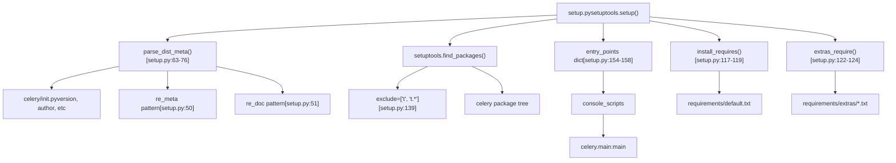
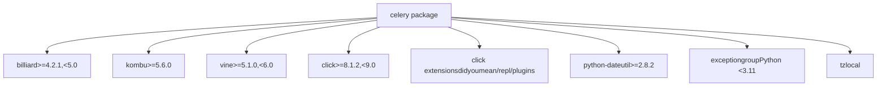
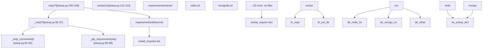

# Packaging and Distribution

Relevant source files

-   [.bumpversion.cfg](https://github.com/celery/celery/blob/4d068b56/.bumpversion.cfg)
-   [Changelog.rst](https://github.com/celery/celery/blob/4d068b56/Changelog.rst)
-   [README.rst](https://github.com/celery/celery/blob/4d068b56/README.rst)
-   [celery/\_\_init\_\_.py](https://github.com/celery/celery/blob/4d068b56/celery/__init__.py)
-   [celery/contrib/sphinx.py](https://github.com/celery/celery/blob/4d068b56/celery/contrib/sphinx.py)
-   [docs/getting-started/introduction.rst](https://github.com/celery/celery/blob/4d068b56/docs/getting-started/introduction.rst)
-   [docs/history/changelog-5.5.rst](https://github.com/celery/celery/blob/4d068b56/docs/history/changelog-5.5.rst)
-   [docs/history/changelog-5.6.rst](https://github.com/celery/celery/blob/4d068b56/docs/history/changelog-5.6.rst)
-   [docs/history/index.rst](https://github.com/celery/celery/blob/4d068b56/docs/history/index.rst)
-   [docs/history/whatsnew-5.5.rst](https://github.com/celery/celery/blob/4d068b56/docs/history/whatsnew-5.5.rst)
-   [docs/history/whatsnew-5.6.rst](https://github.com/celery/celery/blob/4d068b56/docs/history/whatsnew-5.6.rst)
-   [docs/includes/installation.txt](https://github.com/celery/celery/blob/4d068b56/docs/includes/installation.txt)
-   [docs/includes/introduction.txt](https://github.com/celery/celery/blob/4d068b56/docs/includes/introduction.txt)
-   [docs/includes/resources.txt](https://github.com/celery/celery/blob/4d068b56/docs/includes/resources.txt)
-   [docs/index.rst](https://github.com/celery/celery/blob/4d068b56/docs/index.rst)
-   [requirements/default.txt](https://github.com/celery/celery/blob/4d068b56/requirements/default.txt)
-   [setup.cfg](https://github.com/celery/celery/blob/4d068b56/setup.cfg)
-   [setup.py](https://github.com/celery/celery/blob/4d068b56/setup.py)

This document describes how Celery is packaged as a Python distribution, including its setuptools configuration, dependency management system, optional feature bundles (extras), and version management. This covers the structure and mechanisms that enable users to install Celery via `pip install celery` and selectively install optional dependencies like `pip install celery[redis,mongodb]`.

For information about development testing infrastructure, see [Testing Infrastructure](/celery/celery/10.1-testing-infrastructure). For CLI entry points and command structure, see [CLI Architecture](/celery/celery/9.1-cli-architecture).

---

## Overview

Celery uses standard Python packaging tools (`setuptools`) to create distributable packages. The packaging system is defined primarily in [setup.py1-183](https://github.com/celery/celery/blob/4d068b56/setup.py#L1-L183) and supported by configuration files like [setup.cfg1-44](https://github.com/celery/celery/blob/4d068b56/setup.cfg#L1-L44) and requirements files in the `requirements/` directory. The packaging infrastructure handles:

-   **Package discovery**: Automatically finding all Python packages within the `celery/` directory
-   **Dependency declaration**: Specifying core and optional dependencies
-   **Entry point registration**: Creating the `celery` console command
-   **Metadata extraction**: Parsing version, author, and description from source
-   **Extras bundles**: Providing 35+ optional feature combinations

---

## Package Structure and Metadata

### Setup Configuration

The [setup.py137-182](https://github.com/celery/celery/blob/4d068b56/setup.py#L137-L182) file contains the main `setuptools.setup()` call that defines the Celery distribution. The configuration uses a metadata extraction system to avoid hardcoding version and author information.


**Sources**: [setup.py1-183](https://github.com/celery/celery/blob/4d068b56/setup.py#L1-L183) [setup.cfg1-44](https://github.com/celery/celery/blob/4d068b56/setup.cfg#L1-L44)

### Metadata Parsing

The `parse_dist_meta()` function [setup.py63-76](https://github.com/celery/celery/blob/4d068b56/setup.py#L63-L76) extracts metadata from [celery/\_\_init\_\_.py](https://github.com/celery/celery/blob/4d068b56/celery/__init__.py) by parsing special `__variable__` assignments and the module docstring:

| Pattern | Regex | Handler | Purpose |
| --- | --- | --- | --- |
| `__version__` | `re_meta` [setup.py50](https://github.com/celery/celery/blob/4d068b56/setup.py#L50-L50) | `_add_default` | Extract version, author, contact, etc. |
| Docstring | `re_doc` [setup.py51](https://github.com/celery/celery/blob/4d068b56/setup.py#L51-L51) | `_add_doc` | Extract package description |

The parsing stops at the `# -eof meta-` marker to avoid processing the entire file. Extracted metadata includes:

-   `version`: Package version string
-   `doc`: Short description from docstring
-   `author`: Author name
-   `contact`: Contact email
-   `homepage`: Project URL
-   `keywords`: Search keywords

**Sources**: [setup.py50-76](https://github.com/celery/celery/blob/4d068b56/setup.py#L50-L76)

### Package Discovery

The `setuptools.find_packages()` call [setup.py139](https://github.com/celery/celery/blob/4d068b56/setup.py#L139-L139) automatically discovers all packages within the repository, excluding test directories:

```
packages=setuptools.find_packages(exclude=['t', 't.*'])
```
This finds all directories containing `__init__.py` files under the `celery/` namespace, including:

-   `celery.app`
-   `celery.backends`
-   `celery.bin`
-   `celery.worker`
-   `celery.events`
-   And 20+ other subpackages

**Sources**: [setup.py139](https://github.com/celery/celery/blob/4d068b56/setup.py#L139-L139)

### Console Scripts and Entry Points

The [setup.py154-158](https://github.com/celery/celery/blob/4d068b56/setup.py#L154-L158) section defines entry points that create executable console commands when the package is installed:

```
entry_points={
    'console_scripts': [
        'celery = celery.__main__:main',
    ]
}
```
This creates the `celery` command-line executable that invokes the `main()` function in [celery/\_\_main\_\_.py](https://github.com/celery/celery/blob/4d068b56/celery/__main__.py) When users run `celery worker` or other commands, this entry point is invoked.

**Sources**: [setup.py154-158](https://github.com/celery/celery/blob/4d068b56/setup.py#L154-L158)

---

## Dependencies and Extras

### Core Dependencies

The core dependencies required for all Celery installations are defined in [requirements/default.txt1-11](https://github.com/celery/celery/blob/4d068b56/requirements/default.txt#L1-L11) and loaded via the `install_requires()` function [setup.py117-119](https://github.com/celery/celery/blob/4d068b56/setup.py#L117-L119):

| Package | Version Constraint | Purpose |
| --- | --- | --- |
| `billiard` | `>=4.2.1,<5.0` | Multiprocessing pool implementation |
| `kombu` | `>=5.6.0` | Message broker abstraction layer |
| `vine` | `>=5.1.0,<6.0` | Promise/callback utilities |
| `click` | `>=8.1.2,<9.0` | CLI framework |
| `click-didyoumean` | `>=0.3.0` | CLI command suggestions |
| `click-repl` | `>=0.2.0` | Interactive REPL mode |
| `click-plugins` | `>=1.1.1` | CLI plugin system |
| `python-dateutil` | `>=2.8.2` | Date/time utilities |
| `exceptiongroup` | `>=1.3.0` (Python <3.11) | Exception group support |
| `tzlocal` | (no constraint) | Local timezone detection |


**Sources**: [requirements/default.txt1-11](https://github.com/celery/celery/blob/4d068b56/requirements/default.txt#L1-L11) [setup.py117-119](https://github.com/celery/celery/blob/4d068b56/setup.py#L117-L119)

### Extensions System

The `EXTENSIONS` tuple [setup.py12-46](https://github.com/celery/celery/blob/4d068b56/setup.py#L12-L46) defines 35 optional feature bundles that users can install selectively. Each extension corresponds to a file in `requirements/extras/`:

```mermaid
flowchart TD
    ex1["pip install celery[redis]"]
    ex2["pip install celery[redis,mongodb]"]
    ex3["pip install celery[sqs,s3]"]
    brokers["Message Brokerslibrabbitmq, sqs, slmq"]
    backends["Result Backendsredis, mongodb, cassandra,dynamodb, s3, azureblockblob,elasticsearch, couchdb,couchbase, arangodb,cosmosdbsql, gcs"]
    serializers["Serializersmsgpack, yaml, pydantic"]
    compression["Compressionbrotli, zstd"]
    concurrency["Concurrencyeventlet, gevent"]
    storage["Storagesqlalchemy, memcache,pymemcache"]
    scheduling["Schedulingsolar"]
    security["Securityauth, tblib"]
    integrations["Integrationsdjango, pytest, pyro"]
    coordination["Coordinationconsul, zookeeper"]
    EXTENSIONS["EXTENSIONS tuple[setup.py:12-46]"]
    extras_req["extras_require()[setup.py:122-124]"]
    req_files["requirements/extras/*.txt"]

    EXTENSIONS --> extras_req
    extras --> req_req_files
    req --> files_brokers
    req --> files_backends
    req --> files_serializers
    req --> files_compression
    req --> files_concurrency
    req --> files_storage
    req --> files_scheduling
    req --> files_security
    req --> files_integrations
    req --> files_coordination
```


**Sources**: [setup.py12-46](https://github.com/celery/celery/blob/4d068b56/setup.py#L12-L46) [setup.py122-124](https://github.com/celery/celery/blob/4d068b56/setup.py#L122-L124)

### EXTENSIONS Tuple

The complete list of extensions [setup.py12-46](https://github.com/celery/celery/blob/4d068b56/setup.py#L12-L46):

**Backend Extensions:**

-   `arangodb`: ArangoDB backend
-   `azureblockblob`: Azure Block Blob storage backend
-   `cassandra`: Cassandra backend
-   `cosmosdbsql`: Azure Cosmos DB SQL API backend
-   `couchbase`: Couchbase backend
-   `couchdb`: CouchDB backend
-   `dynamodb`: Amazon DynamoDB backend
-   `elasticsearch`: Elasticsearch backend
-   `gcs`: Google Cloud Storage backend
-   `mongodb`: MongoDB backend
-   `redis`: Redis backend and broker
-   `s3`: Amazon S3 backend
-   `sqlalchemy`: SQLAlchemy database backend

**Broker Extensions:**

-   `librabbitmq`: Fast RabbitMQ C client
-   `slmq`: Simple Local Memory Queue
-   `sqs`: Amazon SQS broker

**Serialization Extensions:**

-   `msgpack`: MessagePack serialization
-   `pydantic`: Pydantic model serialization
-   `yaml`: YAML serialization

**Compression Extensions:**

-   `brotli`: Brotli compression
-   `zstd`: Zstandard compression

**Concurrency Extensions:**

-   `eventlet`: Eventlet green thread pool
-   `gevent`: Gevent green thread pool

**Caching Extensions:**

-   `memcache`: Memcached backend (libmemcached)
-   `pymemcache`: Memcached backend (pure Python)

**Scheduling Extensions:**

-   `solar`: Solar event schedules

**Integration Extensions:**

-   `auth`: Authentication/signature verification
-   `consul`: Consul coordination
-   `django`: Django integration
-   `pyro`: Pyro4 integration
-   `pytest`: pytest-celery testing framework
-   `tblib`: Traceback serialization
-   `zookeeper`: ZooKeeper coordination

**Sources**: [setup.py12-46](https://github.com/celery/celery/blob/4d068b56/setup.py#L12-L46)

### Requirements Parsing System

The requirements parsing functions handle loading dependency specifications from files:


**Parsing flow:**

1.  `reqs(*f)` [setup.py100-109](https://github.com/celery/celery/blob/4d068b56/setup.py#L100-L109) opens a file from `requirements/` directory
2.  `_reqs(*f)` [setup.py92-97](https://github.com/celery/celery/blob/4d068b56/setup.py#L92-L97) reads lines and strips comments via `_strip_comments()` [setup.py81-82](https://github.com/celery/celery/blob/4d068b56/setup.py#L81-L82)
3.  `_pip_requirement()` [setup.py85-89](https://github.com/celery/celery/blob/4d068b56/setup.py#L85-L89) handles `-r` includes (recursive requirement files)
4.  `extras(*p)` [setup.py112-114](https://github.com/celery/celery/blob/4d068b56/setup.py#L112-L114) is a convenience wrapper for files in `requirements/extras/`
5.  `install_requires()` [setup.py117-119](https://github.com/celery/celery/blob/4d068b56/setup.py#L117-L119) returns core dependencies
6.  `extras_require()` [setup.py122-124](https://github.com/celery/celery/blob/4d068b56/setup.py#L122-L124) returns a dict mapping extension names to their dependencies

**Sources**: [setup.py81-124](https://github.com/celery/celery/blob/4d068b56/setup.py#L81-L124)

### Extras Installation

Users can install optional dependencies using pip extras syntax:

```
# Install with Redis support
pip install celery[redis]

# Install multiple extras
pip install celery[redis,mongodb,msgpack]

# Install with AWS backends
pip install celery[sqs,dynamodb,s3]

# Install with all async pool support
pip install celery[eventlet,gevent]
```
The `extras_require()` function [setup.py122-124](https://github.com/celery/celery/blob/4d068b56/setup.py#L122-L124) creates a dictionary comprehension that maps each extension name to its requirements:

```
def extras_require():
    """Get map of all extra requirements."""
    return {x: extras(x + '.txt') for x in EXTENSIONS}
```
This generates a dict like:

```
{
    'redis': ['redis>=4.2.0'],
    'mongodb': ['pymongo>=4.0.0'],
    'msgpack': ['msgpack>=1.0.0'],
    # ... 32 more entries
}
```
**Sources**: [setup.py122-124](https://github.com/celery/celery/blob/4d068b56/setup.py#L122-L124)

---

## Distribution Configuration

### Python Version Requirements

Celery requires Python 3.9 or later, specified in [setup.py150](https://github.com/celery/celery/blob/4d068b56/setup.py#L150-L150):

```
python_requires=">=3.9"
```
The package classifiers [setup.py166-181](https://github.com/celery/celery/blob/4d068b56/setup.py#L166-L181) declare support for specific Python versions:

-   Python 3.9
-   Python 3.10
-   Python 3.11
-   Python 3.12
-   Python 3.13

Both CPython and PyPy implementations are supported.

**Sources**: [setup.py150](https://github.com/celery/celery/blob/4d068b56/setup.py#L150-L150) [setup.py166-181](https://github.com/celery/celery/blob/4d068b56/setup.py#L166-L181)

### Platform and License

The package is platform-independent [setup.py148](https://github.com/celery/celery/blob/4d068b56/setup.py#L148-L148) and uses the BSD-3-Clause license [setup.py147](https://github.com/celery/celery/blob/4d068b56/setup.py#L147-L147):

```
license='BSD-3-Clause',
platforms=['any'],
```
**Sources**: [setup.py147-148](https://github.com/celery/celery/blob/4d068b56/setup.py#L147-L148)

### Package Metadata

The [setup.py159-165](https://github.com/celery/celery/blob/4d068b56/setup.py#L159-L165) section defines project URLs displayed on PyPI:

| URL Type | Target |
| --- | --- |
| Documentation | [https://docs.celeryq.dev/en/stable/](https://docs.celeryq.dev/en/stable/) |
| Changelog | [https://docs.celeryq.dev/en/stable/changelog.html](https://docs.celeryq.dev/en/stable/changelog.html) |
| Code | [https://github.com/celery/celery](https://github.com/celery/celery) |
| Tracker | [https://github.com/celery/celery/issues](https://github.com/celery/celery/issues) |
| Funding | [https://opencollective.com/celery](https://opencollective.com/celery) |

**Sources**: [setup.py159-165](https://github.com/celery/celery/blob/4d068b56/setup.py#L159-L165)

### PyPI Classifiers

The [setup.py166-181](https://github.com/celery/celery/blob/4d068b56/setup.py#L166-L181) section defines trove classifiers for PyPI:

**Development Status:**

-   `Development Status :: 5 - Production/Stable`

**Topics:**

-   `Topic :: System :: Distributed Computing`
-   `Topic :: Software Development :: Object Brokering`
-   `Framework :: Celery`

**Programming Language Support:**

-   Python 3 Only
-   Specific versions 3.9-3.13
-   CPython and PyPy implementations

**Operating System:**

-   `Operating System :: OS Independent`

**Sources**: [setup.py166-181](https://github.com/celery/celery/blob/4d068b56/setup.py#L166-L181)

---

## Additional Configuration

### setup.cfg

The [setup.cfg1-44](https://github.com/celery/celery/blob/4d068b56/setup.cfg#L1-L44) file provides additional configuration for various tools:

**Build Configuration:**

-   `[build_sphinx]` [setup.cfg1-4](https://github.com/celery/celery/blob/4d068b56/setup.cfg#L1-L4): Sphinx documentation build settings
-   `[bdist_rpm]` [setup.cfg34-40](https://github.com/celery/celery/blob/4d068b56/setup.cfg#L34-L40): RPM package requirements
-   `[metadata]` [setup.cfg42-43](https://github.com/celery/celery/blob/4d068b56/setup.cfg#L42-L43): License file specification

**Code Quality:**

-   `[flake8]` [setup.cfg6-33](https://github.com/celery/celery/blob/4d068b56/setup.cfg#L6-L33): Linter configuration (see [Code Quality Tools](#10.5))

**Sources**: [setup.cfg1-44](https://github.com/celery/celery/blob/4d068b56/setup.cfg#L1-L44)

### RPM Distribution

For RPM-based Linux distributions, [setup.cfg34-40](https://github.com/celery/celery/blob/4d068b56/setup.cfg#L34-L40) specifies additional runtime requirements:

```
[bdist_rpm]
requires = backports.zoneinfo>=0.2.1;python_version<'3.9'
           tzdata>=2022.7
           tzlocal
           billiard >=4.1.0,<5.0
           kombu >= 5.3.4,<6.0.0
```
Note: These version constraints may differ slightly from the pip requirements in [requirements/default.txt1-11](https://github.com/celery/celery/blob/4d068b56/requirements/default.txt#L1-L11) to accommodate RPM packaging conventions.

**Sources**: [setup.cfg34-40](https://github.com/celery/celery/blob/4d068b56/setup.cfg#L34-L40)

---

## Long Description

The package's long description is loaded from `README.rst` by the `long_description()` function [setup.py129-133](https://github.com/celery/celery/blob/4d068b56/setup.py#L129-L133):

```
def long_description():
    try:
        return codecs.open('README.rst', 'r', 'utf-8').read()
    except OSError:
        return 'Long description error: Missing README.rst file'
```
This description appears on the PyPI package page. The function includes error handling for cases where the README is missing.

**Sources**: [setup.py129-133](https://github.com/celery/celery/blob/4d068b56/setup.py#L129-L133)

---

## Installation Flow

The complete installation and configuration flow:

> **[Mermaid sequence]**
> *(图表结构无法解析)*

**Sources**: [setup.py1-183](https://github.com/celery/celery/blob/4d068b56/setup.py#L1-L183) [requirements/default.txt1-11](https://github.com/celery/celery/blob/4d068b56/requirements/default.txt#L1-L11)

---

## Summary

The Celery packaging system provides:

1.  **Automated metadata extraction** from source files to maintain a single source of truth
2.  **Flexible dependency management** with 35+ optional extras for different use cases
3.  **Console script entry points** that create the `celery` command-line tool
4.  **Platform independence** with support for multiple Python versions (3.9-3.13)
5.  **Structured requirements files** enabling easy dependency auditing and updates
6.  **Standard setuptools integration** following Python packaging best practices

Users can install exactly the features they need:

-   Minimal: `pip install celery` (core dependencies only)
-   With Redis: `pip install celery[redis]`
-   Full-featured: `pip install celery[redis,mongodb,msgpack,eventlet]`

The packaging infrastructure is designed to be maintainable, with requirements split across multiple files and a clear separation between core and optional dependencies.

**Sources**: [setup.py1-183](https://github.com/celery/celery/blob/4d068b56/setup.py#L1-L183) [requirements/default.txt1-11](https://github.com/celery/celery/blob/4d068b56/requirements/default.txt#L1-L11) [setup.cfg1-44](https://github.com/celery/celery/blob/4d068b56/setup.cfg#L1-L44)
