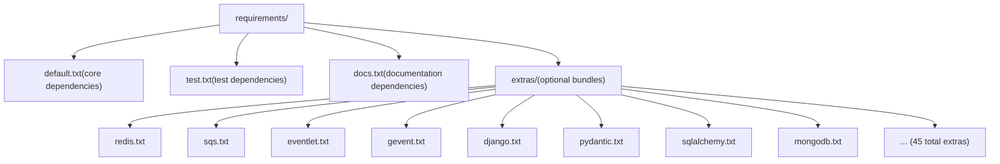
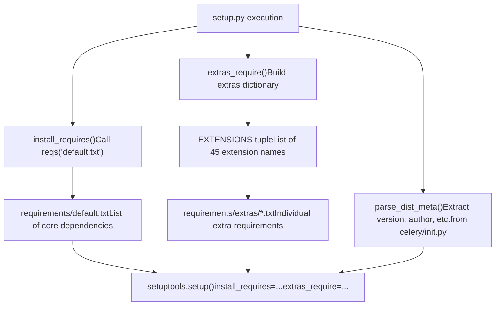

# Dependencies and Extras

Relevant source files

-   [docs/includes/installation.txt](https://github.com/celery/celery/blob/4d068b56/docs/includes/installation.txt)
-   [requirements/default.txt](https://github.com/celery/celery/blob/4d068b56/requirements/default.txt)
-   [setup.cfg](https://github.com/celery/celery/blob/4d068b56/setup.cfg)
-   [setup.py](https://github.com/celery/celery/blob/4d068b56/setup.py)

## Purpose and Scope

This document details Celery's dependency management system, including core dependencies required for all installations and optional extras that enable specific features or integrations. The dependency system is defined in [setup.py](https://github.com/celery/celery/blob/4d068b56/setup.py) and organized through the `requirements/` directory structure.

For information about package structure and distribution, see [Package Structure](/celery/celery/11.1-package-structure). For version management and release processes, see [Version Management and Release](/celery/celery/11.3-version-management-and-release).

## Core Dependencies

Celery requires a minimal set of core dependencies that are always installed. These dependencies are defined in [requirements/default.txt1-10](https://github.com/celery/celery/blob/4d068b56/requirements/default.txt#L1-L10) and installed via the `install_requires` parameter in [setup.py149](https://github.com/celery/celery/blob/4d068b56/setup.py#L149-L149)

### Essential Dependencies

| Dependency | Version Constraint | Purpose |
| --- | --- | --- |
| `kombu` | \>=5.6.0 | Message broker abstraction layer, handles broker connections and message routing |
| `billiard` | \>=4.2.1,<5.0 | Multiprocessing pool implementation for the prefork concurrency model |
| `vine` | \>=5.1.0,<6.0 | Promise and synchronization primitives used internally |
| `click` | \>=8.1.2,<9.0 | Command-line interface framework for the `celery` command |
| `click-didyoumean` | \>=0.3.0 | Provides suggestion feature for misspelled CLI commands |
| `click-repl` | \>=0.2.0 | Interactive REPL mode for the CLI |
| `click-plugins` | \>=1.1.1 | Plugin system for extending the CLI |
| `python-dateutil` | \>=2.8.2 | Date/time parsing and manipulation for schedules |
| `exceptiongroup` | \>=1.3.0 | Exception grouping support for Python <3.11 compatibility |
| `tzlocal` | (no constraint) | Local timezone detection for schedule evaluation |

### Kombu: Message Broker Abstraction

The `kombu` library is the most critical dependency, providing a unified interface to multiple message brokers. Celery's AMQP layer [celery/app/amqp.py](https://github.com/celery/celery/blob/4d068b56/celery/app/amqp.py) uses kombu to abstract broker-specific details, enabling support for RabbitMQ, Redis, Amazon SQS, and other brokers without changing application code.

### Billiard: Process Pool Management

The `billiard` library is a fork of Python's multiprocessing module, providing the prefork worker pool implementation. It is used by [celery/concurrency/prefork.py](https://github.com/celery/celery/blob/4d068b56/celery/concurrency/prefork.py) to manage worker processes with enhanced features for graceful shutdown and process monitoring. Billiard is required even when using other concurrency models, as it provides core synchronization primitives.

### Vine: Promises and Callbacks

The `vine` library provides promise-like objects and callback mechanisms used throughout Celery's asynchronous operations. It is particularly important for canvas workflows [celery/canvas.py](https://github.com/celery/celery/blob/4d068b56/celery/canvas.py) where task chains and groups require coordination of asynchronous results.

### Click: CLI Framework

The `click` framework powers Celery's command-line interface [celery/bin/](https://github.com/celery/celery/blob/4d068b56/celery/bin/) providing argument parsing, help text generation, and command organization. The three click extensions (`click-didyoumean`, `click-repl`, `click-plugins`) enhance usability with spelling suggestions, an interactive shell, and extensibility.

**Sources:** [requirements/default.txt1-10](https://github.com/celery/celery/blob/4d068b56/requirements/default.txt#L1-L10) [setup.py117-119](https://github.com/celery/celery/blob/4d068b56/setup.py#L117-L119)

## Optional Extras System

Celery uses setuptools' `extras_require` mechanism to define optional feature bundles. Each extra corresponds to a requirements file in `requirements/extras/` and can be installed with `pip install celery[extra_name]`.

### Extensions Definition

The `EXTENSIONS` tuple in [setup.py12-46](https://github.com/celery/celery/blob/4d068b56/setup.py#L12-L46) enumerates all available extras:

```
EXTENSIONS = (
    'arangodb', 'auth', 'azureblockblob', 'brotli', 'cassandra',
    'consul', 'cosmosdbsql', 'couchbase', 'couchdb', 'django',
    'dynamodb', 'elasticsearch', 'eventlet', 'gevent', 'gcs',
    'librabbitmq', 'memcache', 'mongodb', 'msgpack', 'pymemcache',
    'pydantic', 'pyro', 'pytest', 'redis', 's3', 'slmq',
    'solar', 'sqlalchemy', 'sqs', 'tblib', 'yaml', 'zookeeper', 'zstd'
)
```
The `extras_require()` function at [setup.py122-124](https://github.com/celery/celery/blob/4d068b56/setup.py#L122-L124) generates a dictionary mapping each extension name to its dependencies by reading the corresponding file in `requirements/extras/{extension}.txt`.

### Dependency Categories


**Sources:** [setup.py12-46](https://github.com/celery/celery/blob/4d068b56/setup.py#L12-L46) [setup.py122-124](https://github.com/celery/celery/blob/4d068b56/setup.py#L122-L124)

### Major Extras Categories

#### Broker and Transport Extras

-   **`redis`**: Enables Redis as a message broker and result backend via the `redis-py` library
-   **`sqs`**: Enables Amazon SQS as a broker via `boto3` and `pycurl` for performance
-   **`librabbitmq`**: Provides a faster C-based AMQP client as an alternative to the pure-Python implementation

#### Result Backend Extras

Celery supports numerous result backend implementations, each requiring specific database drivers:

-   **`sqlalchemy`**: Enables SQL databases (PostgreSQL, MySQL, SQLite) via SQLAlchemy ORM
-   **`mongodb`**: Uses `pymongo` for MongoDB result storage
-   **`redis`**: Also serves as a result backend (same package as broker extra)
-   **`dynamodb`**: AWS DynamoDB via `boto3`
-   **`cassandra`**: Apache Cassandra via `cassandra-driver`
-   **`elasticsearch`**: Elasticsearch via the official Python client
-   **Cloud Storage**: `azureblockblob`, `gcs`, `s3` for object storage backends

#### Concurrency Model Extras

-   **`eventlet`**: Green thread concurrency using the eventlet library, suitable for I/O-bound tasks
-   **`gevent`**: Alternative green thread implementation using gevent and libevent

#### Serialization and Compression Extras

-   **`msgpack`**: Efficient binary serialization via MessagePack
-   **`yaml`**: YAML serialization support
-   **`auth`**: Message signing and encryption via the `cryptography` library
-   **`brotli`** and **`zstd`**: Modern compression algorithms for message compression

#### Framework Integration Extras

-   **`django`**: Django framework integration for settings and database connection management
-   **`pydantic`**: Task argument validation using Pydantic models (v5.5+)
-   **`pytest`**: Testing utilities via `pytest-celery`

#### Scheduling and Monitoring Extras

-   **`solar`**: Solar event schedules (sunrise/sunset) via the `ephem` library
-   **`zookeeper`**: Zookeeper integration via `kazoo` for distributed coordination
-   **`consul`**: Consul integration for service discovery

**Sources:** [setup.py12-46](https://github.com/celery/celery/blob/4d068b56/setup.py#L12-L46)

## Requirements Directory Structure

The `requirements/` directory organizes dependency specifications in a hierarchical structure:


### Requirements File Parsing

The [setup.py81-109](https://github.com/celery/celery/blob/4d068b56/setup.py#L81-L109) module implements a requirements file parser that supports:

1.  **Comment Stripping**: Lines beginning with `#` are ignored via `_strip_comments()` at [setup.py81-82](https://github.com/celery/celery/blob/4d068b56/setup.py#L81-L82)
2.  **Recursive Inclusion**: Files can include other files with `-r path/to/file.txt` syntax, parsed by `_pip_requirement()` at [setup.py85-89](https://github.com/celery/celery/blob/4d068b56/setup.py#L85-L89)
3.  **Nested Paths**: The `reqs()` function at [setup.py100-109](https://github.com/celery/celery/blob/4d068b56/setup.py#L100-L109) accepts variable path components, e.g., `reqs('extras', 'redis.txt')` reads `requirements/extras/redis.txt`

The `extras()` helper function at [setup.py112-114](https://github.com/celery/celery/blob/4d068b56/setup.py#L112-L114) is a convenience wrapper that automatically prepends the `extras/` directory path.

**Sources:** [setup.py78-114](https://github.com/celery/celery/blob/4d068b56/setup.py#L78-L114)

## Installation Patterns

### Basic Installation

Installing Celery without extras provides core functionality:

```
pip install celery
```
This installs only the dependencies from [requirements/default.txt](https://github.com/celery/celery/blob/4d068b56/requirements/default.txt)

### Single Extra Installation

Install with a specific extra to enable a feature:

```
pip install celery[redis]      # Redis broker and backend
pip install celery[eventlet]   # Eventlet concurrency
pip install celery[pydantic]   # Pydantic validation
```
### Multiple Extras Installation

Combine multiple extras with comma separation:

```
pip install celery[redis,eventlet,msgpack]
pip install celery[sqs,sqlalchemy,auth]
```
### Common Installation Profiles

Typical installation combinations for different deployment scenarios:

| Profile | Extras | Use Case |
| --- | --- | --- |
| **Redis Stack** | `redis,msgpack` | Redis broker/backend with efficient serialization |
| **RabbitMQ Stack** | `librabbitmq,msgpack` | High-performance RabbitMQ with C client |
| **AWS Stack** | `sqs,dynamodb,s3` | Full AWS integration (SQS broker, DynamoDB results) |
| **Django Integration** | `django,redis,msgpack` | Django project with Redis |
| **Async I/O** | `redis,gevent` or `redis,eventlet` | I/O-bound workloads with green threads |
| **Type Safety** | `pydantic` | Projects using Pydantic models for validation |

**Sources:** [setup.py122-152](https://github.com/celery/celery/blob/4d068b56/setup.py#L122-L152)

## Dependency Resolution Mechanism

The setup.py file implements a multi-step dependency resolution process:


### Resolution Steps

1.  **Metadata Extraction** ([setup.py63-76](https://github.com/celery/celery/blob/4d068b56/setup.py#L63-L76)): The `parse_dist_meta()` function reads [celery/\_\_init\_\_.py](https://github.com/celery/celery/blob/4d068b56/celery/__init__.py) and extracts package metadata using regex patterns for `__version__`, `__author__`, etc.

2.  **Core Dependencies** ([setup.py117-119](https://github.com/celery/celery/blob/4d068b56/setup.py#L117-L119)): The `install_requires()` function calls `reqs('default.txt')` to load core dependencies from [requirements/default.txt](https://github.com/celery/celery/blob/4d068b56/requirements/default.txt)

3.  **Extras Dictionary Generation** ([setup.py122-124](https://github.com/celery/celery/blob/4d068b56/setup.py#L122-L124)): The `extras_require()` function iterates over the `EXTENSIONS` tuple, calling `extras(x + '.txt')` for each extension to build the extras dictionary.

4.  **File Parsing** ([setup.py92-109](https://github.com/celery/celery/blob/4d068b56/setup.py#L92-L109)): The `_reqs()` function reads requirement files, strips comments, handles recursive includes with `-r`, and returns a flattened list of requirements.

5.  **Setup Invocation** ([setup.py137-182](https://github.com/celery/celery/blob/4d068b56/setup.py#L137-L182)): The `setuptools.setup()` call receives `install_requires` and `extras_require` parameters, which setuptools uses for dependency resolution during `pip install`.


**Sources:** [setup.py63-124](https://github.com/celery/celery/blob/4d068b56/setup.py#L63-L124) [setup.py137-152](https://github.com/celery/celery/blob/4d068b56/setup.py#L137-L152)

## Python Version Constraints

Celery enforces a minimum Python version of 3.9 via the `python_requires` parameter at [setup.py150](https://github.com/celery/celery/blob/4d068b56/setup.py#L150-L150) The package supports:

-   **CPython**: 3.9, 3.10, 3.11, 3.12, 3.13
-   **PyPy**: PyPy3 (equivalent to CPython 3.9+)

This constraint is also reflected in the package classifiers at [setup.py173-179](https://github.com/celery/celery/blob/4d068b56/setup.py#L173-L179) and is tested across the matrix defined in `tox.ini` (see [Test Matrix and Environments](/celery/celery/10.2-test-matrix-and-environments)).

### Platform-Specific Dependencies

The [setup.cfg35-39](https://github.com/celery/celery/blob/4d068b56/setup.cfg#L35-L39) file defines RPM-specific dependencies that include backports for older Python versions:

-   `backports.zoneinfo>=0.2.1` for Python <3.9 (though 3.9+ is now required)
-   `tzdata>=2022.7` for timezone database updates

**Sources:** [setup.py150](https://github.com/celery/celery/blob/4d068b56/setup.py#L150-L150) [setup.py166-181](https://github.com/celery/celery/blob/4d068b56/setup.py#L166-L181) [setup.cfg35-39](https://github.com/celery/celery/blob/4d068b56/setup.cfg#L35-L39)

## Development Dependencies

Development-specific dependencies are separated from production dependencies:

-   **Test Dependencies**: Defined in `requirements/test.txt` and installed via `tests_require` at [setup.py151](https://github.com/celery/celery/blob/4d068b56/setup.py#L151-L151)
-   **Documentation Dependencies**: Defined in `requirements/docs.txt` for Sphinx and related tools

These are not installed with the package but are used in development environments and CI/CD pipelines. See [Testing Infrastructure](/celery/celery/10.1-testing-infrastructure) and [Documentation System](#10.6) for details on their usage.

**Sources:** [setup.py151](https://github.com/celery/celery/blob/4d068b56/setup.py#L151-L151)

## Console Scripts Entry Point

The setup.py file registers a console script entry point at [setup.py154-158](https://github.com/celery/celery/blob/4d068b56/setup.py#L154-L158):

```
entry_points={
    'console_scripts': [
        'celery = celery.__main__:main',
    ]
}
```
This creates the `celery` command-line executable that invokes the `main()` function in [celery/\_\_main\_\_.py](https://github.com/celery/celery/blob/4d068b56/celery/__main__.py) This mechanism allows the CLI to be available system-wide after installation without requiring explicit Python module execution (`python -m celery`).

**Sources:** [setup.py154-158](https://github.com/celery/celery/blob/4d068b56/setup.py#L154-L158)
