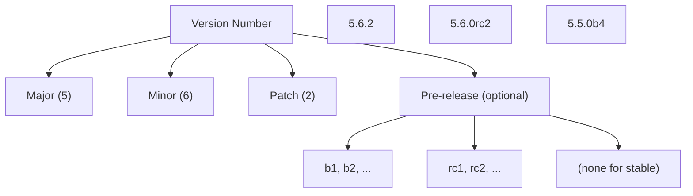
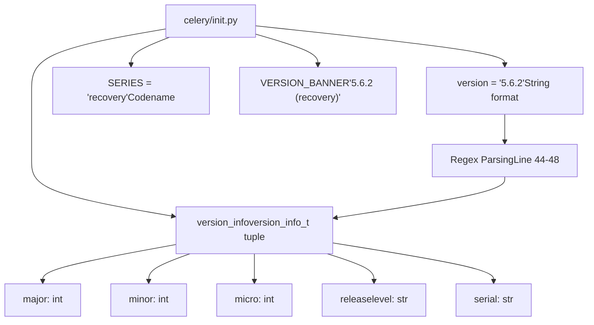
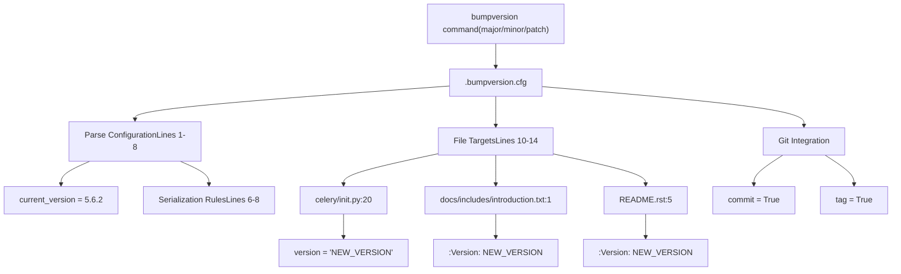
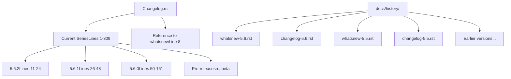
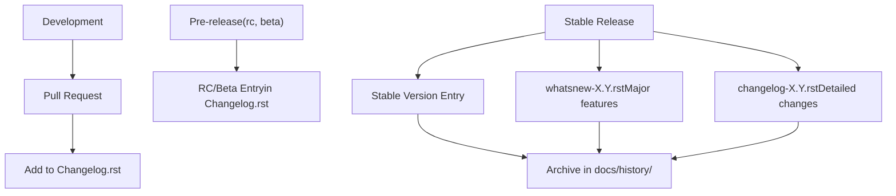
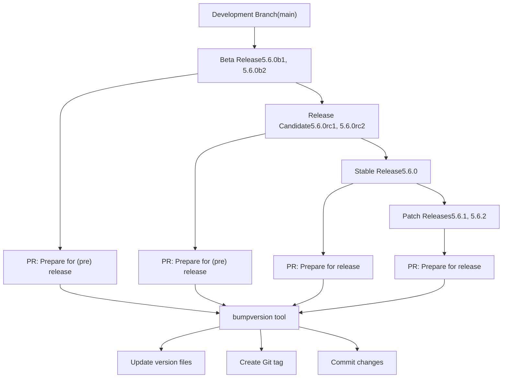
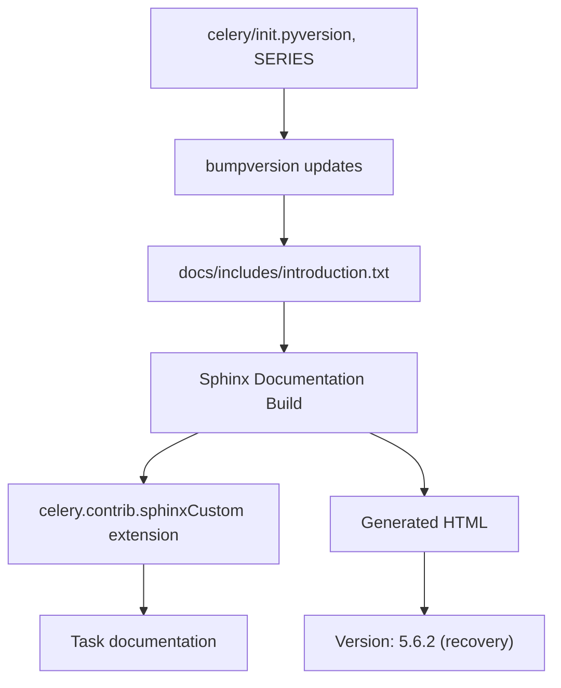

# Version Management and Release

Relevant source files

-   [.bumpversion.cfg](https://github.com/celery/celery/blob/4d068b56/.bumpversion.cfg)
-   [Changelog.rst](https://github.com/celery/celery/blob/4d068b56/Changelog.rst)
-   [README.rst](https://github.com/celery/celery/blob/4d068b56/README.rst)
-   [celery/\_\_init\_\_.py](https://github.com/celery/celery/blob/4d068b56/celery/__init__.py)
-   [celery/contrib/sphinx.py](https://github.com/celery/celery/blob/4d068b56/celery/contrib/sphinx.py)
-   [docs/getting-started/introduction.rst](https://github.com/celery/celery/blob/4d068b56/docs/getting-started/introduction.rst)
-   [docs/history/changelog-5.5.rst](https://github.com/celery/celery/blob/4d068b56/docs/history/changelog-5.5.rst)
-   [docs/history/changelog-5.6.rst](https://github.com/celery/celery/blob/4d068b56/docs/history/changelog-5.6.rst)
-   [docs/history/index.rst](https://github.com/celery/celery/blob/4d068b56/docs/history/index.rst)
-   [docs/history/whatsnew-5.5.rst](https://github.com/celery/celery/blob/4d068b56/docs/history/whatsnew-5.5.rst)
-   [docs/history/whatsnew-5.6.rst](https://github.com/celery/celery/blob/4d068b56/docs/history/whatsnew-5.6.rst)
-   [docs/includes/introduction.txt](https://github.com/celery/celery/blob/4d068b56/docs/includes/introduction.txt)
-   [docs/includes/resources.txt](https://github.com/celery/celery/blob/4d068b56/docs/includes/resources.txt)
-   [docs/index.rst](https://github.com/celery/celery/blob/4d068b56/docs/index.rst)

This document describes how version numbers are managed and coordinated across the Celery codebase, including the tooling for version bumping, changelog structure, and the release process.

For information about package metadata and distribution, see [Package Structure](/celery/celery/11.1-package-structure) and [Dependencies and Extras](/celery/celery/11.2-dependencies-and-extras).

---

## Purpose and Scope

Celery uses a centralized version management system that synchronizes version information across multiple files. The version number is defined in a single location and propagated to documentation, package metadata, and user-facing files through automated tooling. This document covers:

-   The version number schema and semantic versioning practices
-   The `version_info_t` tuple structure used programmatically
-   The `.bumpversion.cfg` configuration for coordinated version updates
-   Changelog organization and naming conventions
-   The release process from pre-releases to stable versions

---

## Version Number Schema

Celery follows semantic versioning with extensions for pre-release identifiers. The version format is:

```
MAJOR.MINOR.PATCH[PRERELEASE]
```
**Diagram: Version Number Format**


**Sources:** [celery/\_\_init\_\_.py20](https://github.com/celery/celery/blob/4d068b56/celery/__init__.py#L20-L20) [.bumpversion.cfg5](https://github.com/celery/celery/blob/4d068b56/.bumpversion.cfg#L5-L5)

### Series Names

Each major.minor version series is assigned a codename after a song by Jon Hopkins. The series name is stored separately from the version number:

| Version Series | Codename |
| --- | --- |
| 5.6.x | recovery |
| 5.5.x | immunity |
| 5.4.x | opalescent |

**Sources:** [celery/\_\_init\_\_.py18](https://github.com/celery/celery/blob/4d068b56/celery/__init__.py#L18-L18) [docs/history/whatsnew-5.6.rst4](https://github.com/celery/celery/blob/4d068b56/docs/history/whatsnew-5.6.rst#L4-L4) [docs/history/whatsnew-5.5.rst4](https://github.com/celery/celery/blob/4d068b56/docs/history/whatsnew-5.5.rst#L4-L4)

---

## Version Information in Code

### Primary Version Definition

The canonical version is defined in `celery/__init__.py` and exposed through multiple formats:

**Diagram: Version Information Structure**


**Sources:** [celery/\_\_init\_\_.py18-48](https://github.com/celery/celery/blob/4d068b56/celery/__init__.py#L18-L48)

### version\_info\_t Named Tuple

The `version_info_t` named tuple provides programmatic access to version components:

```
version_info_t = namedtuple('version_info_t', (
    'major', 'minor', 'micro', 'releaselevel', 'serial',
))
```
The version string is parsed using regex to populate this tuple:

```
_temp = re.match(
    r'(\d+)\.(\d+)\.(\d+)(.+)?', __version__).groups()
VERSION = version_info = version_info_t(
    int(_temp[0]), int(_temp[1]), int(_temp[2]), _temp[3] or '', '')
```
For version `5.6.2`, this produces:

-   `major=5`
-   `minor=6`
-   `micro=2`
-   `releaselevel=''` (empty for stable releases)
-   `serial=''`

For version `5.6.0rc2`, this produces:

-   `major=5`
-   `minor=6`
-   `micro=0`
-   `releaselevel='rc2'`
-   `serial=''`

**Sources:** [celery/\_\_init\_\_.py38-48](https://github.com/celery/celery/blob/4d068b56/celery/__init__.py#L38-L48)

---

## Version Bumping with bumpversion

### Configuration File Structure

The `.bumpversion.cfg` file coordinates version updates across multiple files using the `bumpversion` tool:

**Diagram: Bumpversion Workflow**


**Sources:** [.bumpversion.cfg1-14](https://github.com/celery/celery/blob/4d068b56/.bumpversion.cfg#L1-L14)

### Configuration Details

The configuration file specifies:

1.  **Version parsing pattern** (line 5):

    ```
    parse = (?P<major>\d+)\.(?P<minor>\d+)\.(?P<patch>\d+)(?P<releaselevel>[a-z\d]+)?
    ```

    This regex captures major, minor, patch, and optional releaselevel components.

2.  **Serialization formats** (lines 6-8):

    -   With releaselevel: `{major}.{minor}.{patch}{releaselevel}`
    -   Without releaselevel: `{major}.{minor}.{patch}`
3.  **Files to update** (lines 10-14):

    -   `celery/__init__.py` - The primary version definition
    -   `docs/includes/introduction.txt` - Documentation version
    -   `README.rst` - User-facing version
4.  **Git integration** (lines 3-4):

    -   Automatically commits changes
    -   Creates version tags

**Sources:** [.bumpversion.cfg1-14](https://github.com/celery/celery/blob/4d068b56/.bumpversion.cfg#L1-L14)

### Version Update Locations

**Table: Files Updated by bumpversion**

| File | Line(s) | Format | Example |
| --- | --- | --- | --- |
| `celery/__init__.py` | 20 | `__version__ = 'X.Y.Z'` | `__version__ = '5.6.2'` |
| `docs/includes/introduction.txt` | 1 | `:Version: X.Y.Z (series)` | `:Version: 5.6.2 (recovery)` |
| `README.rst` | 5 | `:Version: X.Y.Z (series)` | `:Version: 5.6.2 (recovery)` |

**Sources:** [celery/\_\_init\_\_.py20](https://github.com/celery/celery/blob/4d068b56/celery/__init__.py#L20-L20) [docs/includes/introduction.txt1](https://github.com/celery/celery/blob/4d068b56/docs/includes/introduction.txt#L1-L1) [README.rst5](https://github.com/celery/celery/blob/4d068b56/README.rst#L5-L5)

---

## Changelog Management

### Changelog File Structure

**Diagram: Changelog Organization**


**Sources:** [Changelog.rst1-309](https://github.com/celery/celery/blob/4d068b56/Changelog.rst#L1-L309) [docs/history/index.rst1-50](https://github.com/celery/celery/blob/4d068b56/docs/history/index.rst#L1-L50)

### Version Entry Format

Each version entry in `Changelog.rst` follows a consistent structure:

```
.. _version-X.Y.Z:

X.Y.Z
=====

:release-date: YYYY-MM-DD
:release-by: Maintainer Name

What's Changed
~~~~~~~~~~~~~~

- Change description (#PR_NUMBER)
- Another change (#PR_NUMBER)
```
**Example from 5.6.2:**

```
.. _version-5.6.2:

5.6.2
=====

:release-date: 2026-01-04
:release-by: Tomer Nosrati

What's Changed
~~~~~~~~~~~~~~

- Fix recursive WorkController instantiation (#10045)
- Bugfix: Revoked tasks now immediately update backend status (#9869)
- Prepare for release: v5.6.2 (#10049)
```
**Sources:** [Changelog.rst11-24](https://github.com/celery/celery/blob/4d068b56/Changelog.rst#L11-L24)

### Pre-release Versions

Pre-release versions use suffixes like `rc1`, `rc2`, `b1`, `b2`:

-   **Release Candidates (rc)**: `5.6.0rc2`, `5.6.0rc1`
-   **Beta Releases (b)**: `5.6.0b2`, `5.6.0b1`

These follow the same changelog format but include warnings encouraging testing:

```
5.6.0rc2
========

:release-date: 2025-11-22
:release-by: Tomer Nosrati

Celery v5.6.0 Release Candidate 2 is now available for testing.
Please help us test this version and report any issues.
```
**Sources:** [Changelog.rst163-182](https://github.com/celery/celery/blob/4d068b56/Changelog.rst#L163-L182)

---

## Documentation Structure for Releases

### History Directory Organization

The `docs/history/` directory contains versioned documentation:

**Table: Documentation Files per Version**

| Version | whatsnew File | changelog File | Purpose |
| --- | --- | --- | --- |
| 5.6.x | `whatsnew-5.6.rst` | `changelog-5.6.rst` | High-level overview vs detailed changes |
| 5.5.x | `whatsnew-5.5.rst` | `changelog-5.5.rst` | High-level overview vs detailed changes |
| 5.4.x | `whatsnew-5.4.rst` | `changelog-5.4.rst` | High-level overview vs detailed changes |

**Sources:** [docs/history/index.rst14-22](https://github.com/celery/celery/blob/4d068b56/docs/history/index.rst#L14-L22)

### whatsnew vs changelog Files

**whatsnew Files** provide narrative documentation:

-   Overview of major features
-   Migration guides
-   Breaking changes
-   Upgrade instructions

**changelog Files** contain granular change lists:

-   Every PR and issue
-   Technical details
-   Complete change history
-   References to contributors

**Diagram: Release Documentation Flow**


**Sources:** [docs/history/index.rst1-50](https://github.com/celery/celery/blob/4d068b56/docs/history/index.rst#L1-L50) [Changelog.rst1-10](https://github.com/celery/celery/blob/4d068b56/Changelog.rst#L1-L10)

---

## Release Process

### Release Stages

**Diagram: Release Lifecycle**


**Sources:** [Changelog.rst24](https://github.com/celery/celery/blob/4d068b56/Changelog.rst#L24-L24) [Changelog.rst182](https://github.com/celery/celery/blob/4d068b56/Changelog.rst#L182-L182) [Changelog.rst309](https://github.com/celery/celery/blob/4d068b56/Changelog.rst#L309-L309)

### Release Preparation PR

Each release is preceded by a "Prepare for release" or "Prepare for (pre) release" PR. These PRs:

1.  Update the version number via bumpversion
2.  Update changelog entries
3.  Update documentation
4.  Create version-specific git tags

**Examples from recent releases:**

-   `#10049`: "Prepare for release: v5.6.2"
-   `#10005`: "Prepare for (pre) release: v5.6.0rc2"
-   `#9890`: "Prepare for (pre) release: v5.6.0b1"

**Sources:** [Changelog.rst24](https://github.com/celery/celery/blob/4d068b56/Changelog.rst#L24-L24) [Changelog.rst182](https://github.com/celery/celery/blob/4d068b56/Changelog.rst#L182-L182) [Changelog.rst308](https://github.com/celery/celery/blob/4d068b56/Changelog.rst#L308-L308)

### Version Increment Rules

**Table: Version Increment Guidelines**

| Change Type | Version Component | Example | When to Use |
| --- | --- | --- | --- |
| Breaking changes, major features | Major | 5.x.x → 6.0.0 | New major release series |
| New features, non-breaking | Minor | 5.5.x → 5.6.0 | Feature releases |
| Bug fixes, patches | Patch | 5.6.1 → 5.6.2 | Maintenance releases |
| Pre-release testing | Pre-release suffix | 5.6.0b1 → 5.6.0b2 | Beta/RC iterations |

**Sources:** [docs/history/whatsnew-5.6.rst1-287](https://github.com/celery/celery/blob/4d068b56/docs/history/whatsnew-5.6.rst#L1-L287) [docs/history/whatsnew-5.5.rst1-361](https://github.com/celery/celery/blob/4d068b56/docs/history/whatsnew-5.5.rst#L1-L361)

---

## Integration with Sphinx Documentation

The Sphinx documentation system automatically generates version information using the custom `celery.contrib.sphinx` extension:

**Sources:** [celery/contrib/sphinx.py1-139](https://github.com/celery/celery/blob/4d068b56/celery/contrib/sphinx.py#L1-L139)

### Documentation Configuration

Version information flows from code to documentation:

1.  `celery/__init__.py` defines `__version__` and `SERIES`
2.  `docs/includes/introduction.txt` uses these values (via bumpversion)
3.  Sphinx reads introduction.txt for rendering
4.  The `celery.contrib.sphinx` extension provides task documentation

**Diagram: Documentation Version Integration**


**Sources:** [celery/contrib/sphinx.py1-139](https://github.com/celery/celery/blob/4d068b56/celery/contrib/sphinx.py#L1-L139) [docs/includes/introduction.txt1](https://github.com/celery/celery/blob/4d068b56/docs/includes/introduction.txt#L1-L1) [celery/\_\_init\_\_.py18-36](https://github.com/celery/celery/blob/4d068b56/celery/__init__.py#L18-L36)

---

## Key Files Summary

**Table: Version Management Files**

| File | Purpose | Updated By |
| --- | --- | --- |
| `celery/__init__.py` | Primary version definition | bumpversion |
| `.bumpversion.cfg` | Version bump configuration | Manual editing |
| `Changelog.rst` | Current series changelog | Manual editing |
| `docs/includes/introduction.txt` | Documentation version | bumpversion |
| `README.rst` | User-facing version | bumpversion |
| `docs/history/whatsnew-X.Y.rst` | Major version overview | Manual editing |
| `docs/history/changelog-X.Y.rst` | Detailed version history | Manual editing |

**Sources:** [celery/\_\_init\_\_.py20](https://github.com/celery/celery/blob/4d068b56/celery/__init__.py#L20-L20) [.bumpversion.cfg1-14](https://github.com/celery/celery/blob/4d068b56/.bumpversion.cfg#L1-L14) [Changelog.rst1-309](https://github.com/celery/celery/blob/4d068b56/Changelog.rst#L1-L309) [docs/history/index.rst1-50](https://github.com/celery/celery/blob/4d068b56/docs/history/index.rst#L1-L50)
