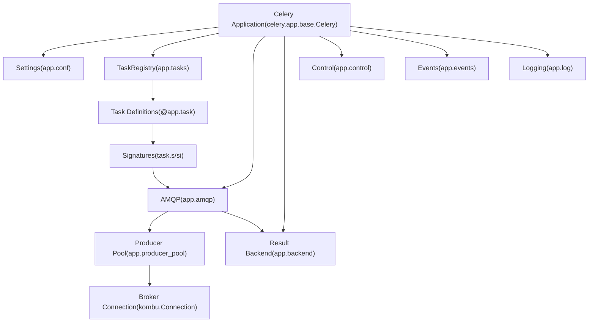
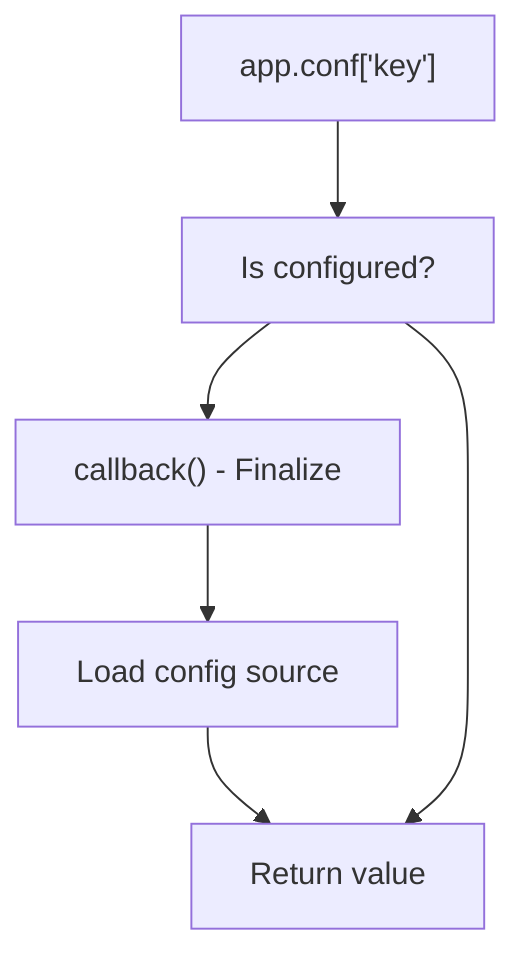
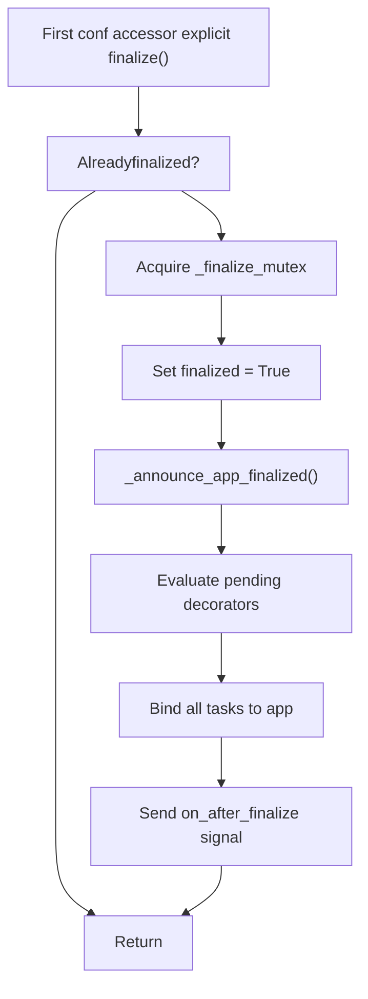
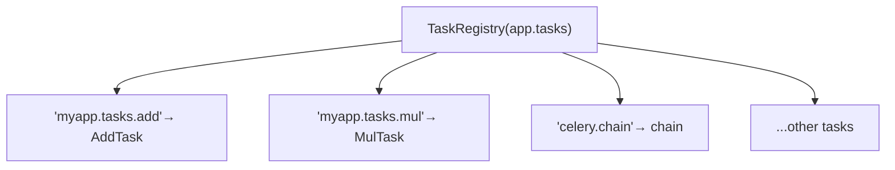
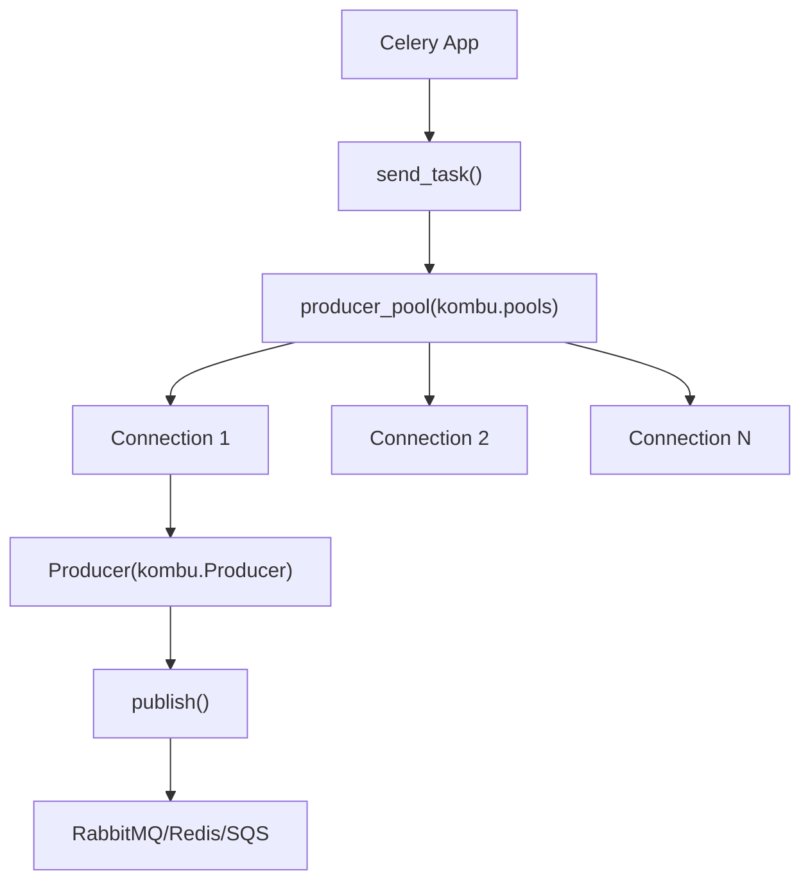
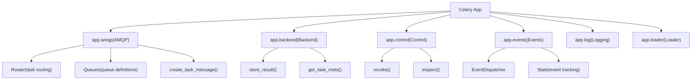
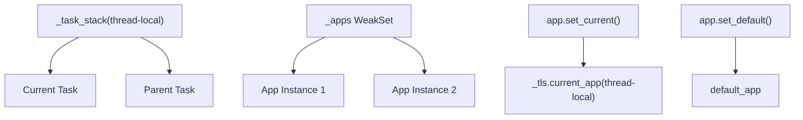

# The Celery Application

Relevant source files

-   [celery/app/amqp.py](https://github.com/celery/celery/blob/4d068b56/celery/app/amqp.py)
-   [celery/app/base.py](https://github.com/celery/celery/blob/4d068b56/celery/app/base.py)
-   [celery/app/task.py](https://github.com/celery/celery/blob/4d068b56/celery/app/task.py)
-   [celery/canvas.py](https://github.com/celery/celery/blob/4d068b56/celery/canvas.py)
-   [celery/utils/\_\_init\_\_.py](https://github.com/celery/celery/blob/4d068b56/celery/utils/__init__.py)
-   [docs/userguide/canvas.rst](https://github.com/celery/celery/blob/4d068b56/docs/userguide/canvas.rst)
-   [t/integration/conftest.py](https://github.com/celery/celery/blob/4d068b56/t/integration/conftest.py)
-   [t/integration/tasks.py](https://github.com/celery/celery/blob/4d068b56/t/integration/tasks.py)
-   [t/integration/test\_canvas.py](https://github.com/celery/celery/blob/4d068b56/t/integration/test_canvas.py)
-   [t/integration/test\_quorum\_queue\_qos\_cluster\_simulation.py](https://github.com/celery/celery/blob/4d068b56/t/integration/test_quorum_queue_qos_cluster_simulation.py)
-   [t/integration/test\_security.py](https://github.com/celery/celery/blob/4d068b56/t/integration/test_security.py)
-   [t/integration/test\_tasks.py](https://github.com/celery/celery/blob/4d068b56/t/integration/test_tasks.py)
-   [t/smoke/tests/test\_canvas.py](https://github.com/celery/celery/blob/4d068b56/t/smoke/tests/test_canvas.py)
-   [t/unit/app/test\_app.py](https://github.com/celery/celery/blob/4d068b56/t/unit/app/test_app.py)
-   [t/unit/tasks/test\_canvas.py](https://github.com/celery/celery/blob/4d068b56/t/unit/tasks/test_canvas.py)
-   [t/unit/tasks/test\_tasks.py](https://github.com/celery/celery/blob/4d068b56/t/unit/tasks/test_tasks.py)

## Purpose and Scope

This document describes the **Celery application class** (`celery.app.base.Celery`), which serves as the central entry point for configuring and managing a Celery deployment. The application instance coordinates all major subsystems including task registration, message broker connections, result backends, and worker management.

For information about:

-   Detailed configuration sources and settings management, see [2.1](/celery/celery/2.1-application-initialization-and-configuration)
-   Task decorator usage and the task registry, see [2.2](/celery/celery/2.2-task-registration)
-   Broker configuration and routing rules, see [2.3](/celery/celery/2.3-message-brokers-and-routing)
-   Message protocol and AMQP integration details, see [2.4](/celery/celery/2.4-amqp-layer-and-message-protocol)
-   Task execution and lifecycle, see [3](/celery/celery/3-tasks)
-   Worker architecture, see [5](/celery/celery/5-workers)

---

## The Celery Class

The `Celery` class defined in [celery/app/base.py230-1288](https://github.com/celery/celery/blob/4d068b56/celery/app/base.py#L230-L1288) is the primary application object. Every Celery deployment instantiates this class to create an application instance that manages configuration, task registration, broker connections, and component coordination.

### Class Definition and Core Attributes

```
class Celery:
    """Celery application.

    Arguments:
        main (str): Name of the main module if running as `__main__`.
        broker (str): URL of the default broker used.
        backend (str): The result store backend class or name.
        autofinalize (bool): If False, raises RuntimeError if task registry
            or tasks are used before the app is finalized.
        set_as_current (bool): Make this the global current app.
    """
```
**Key attributes:**

-   `main`: Module name used for auto-generating task names
-   `conf`: Settings object with configuration key-value pairs
-   `tasks`: Task registry (TaskRegistry instance)
-   `amqp`: AMQP interface for message creation and routing
-   `backend`: Result backend for storing task results
-   `control`: Control interface for worker management
-   `events`: Event monitoring system
-   `loader`: Configuration loader
-   `log`: Logging configuration

Sources: [celery/app/base.py230-348](https://github.com/celery/celery/blob/4d068b56/celery/app/base.py#L230-L348)

---

## Application Architecture

The following diagram shows the high-level architecture of the Celery application and its relationship to other components:


**Component Relationships:**

| Component | Class/Module | Purpose |
| --- | --- | --- |
| Application | `celery.app.base.Celery` | Central coordinator |
| Settings | `celery.app.utils.Settings` | Configuration management |
| Task Registry | `celery.app.registry.TaskRegistry` | Maps task names to task classes |
| AMQP | `celery.app.amqp.AMQP` | Message creation and routing |
| Backend | `celery.backends.base.Backend` | Result storage |
| Control | `celery.app.control.Control` | Worker control commands |
| Events | `celery.app.events.Events` | Event monitoring |

Sources: [celery/app/base.py230-408](https://github.com/celery/celery/blob/4d068b56/celery/app/base.py#L230-L408) [celery/app/amqp.py219-301](https://github.com/celery/celery/blob/4d068b56/celery/app/amqp.py#L219-L301)

---

## Application Initialization

The Celery application follows a multi-stage initialization pattern with lazy configuration and finalization:

> **[Mermaid stateDiagram]**
> *(图表结构无法解析)*

### Constructor Parameters

The `__init__` method accepts the following key parameters:

| Parameter | Type | Default | Description |
| --- | --- | --- | --- |
| `main` | str | None | Main module name for task naming |
| `broker` | str | None | Broker URL |
| `backend` | str | None | Result backend URL or class |
| `loader` | str | None | Configuration loader class |
| `config_source` | obj/str | None | Configuration object or module |
| `task_cls` | str/class | `'celery.app.task:Task'` | Base task class |
| `autofinalize` | bool | True | Auto-finalize on first use |
| `set_as_current` | bool | True | Set as current app |
| `namespace` | str | None | Configuration namespace |

Sources: [celery/app/base.py317-408](https://github.com/celery/celery/blob/4d068b56/celery/app/base.py#L317-L408)

### Initialization Sequence

> **[Mermaid sequence]**
> *(图表结构无法解析)*

The initialization process:

1.  **Thread-local storage** - Creates `threading.local()` for per-thread state
2.  **Clock** - Initializes Lamport clock for distributed event ordering
3.  **Configuration** - Creates `PendingConfiguration` wrapper that defers loading
4.  **Task registry** - Creates or uses provided `TaskRegistry`
5.  **Fixups** - Applies framework integrations (Django, etc.)
6.  **Registration** - Registers app in global `_state` module
7.  **Current app** - Optionally sets as current app for this thread

Sources: [celery/app/base.py317-408](https://github.com/celery/celery/blob/4d068b56/celery/app/base.py#L317-L408)

---

## Configuration System

The Celery application uses a two-tier configuration system: `PendingConfiguration` for lazy loading and `Settings` for finalized configuration.

### PendingConfiguration

The `PendingConfiguration` class implements deferred configuration loading:


**Key characteristics:**

-   Configuration is not loaded until first access
-   Accessing any configuration key triggers finalization
-   Allows pre-configuration values to be set before loading
-   Uses `AttributeDictMixin` for both dict and attribute access

Sources: [celery/app/base.py186-228](https://github.com/celery/celery/blob/4d068b56/celery/app/base.py#L186-L228)

### Configuration Loading Methods

The application provides multiple methods for loading configuration:

| Method | Source Type | Example |
| --- | --- | --- |
| `config_from_object()` | Module/object | `app.config_from_object('celeryconfig')` |
| `config_from_envvar()` | Environment variable | `app.config_from_envvar('CELERY_CONFIG_MODULE')` |
| `config_from_cmdline()` | Command-line args | `app.config_from_cmdline(argv)` |
| Constructor `config_source` | Direct object | `Celery(config_source=obj)` |

**Configuration precedence:**

1.  Keyword arguments passed to constructor (`broker`, `backend`, etc.)
2.  Configuration source (`config_from_object`, etc.)
3.  Default values from `celery.app.defaults`

Sources: [celery/app/base.py677-723](https://github.com/celery/celery/blob/4d068b56/celery/app/base.py#L677-L723)

---

## Application Finalization

Finalization is the process of completing application setup and making it ready for use:


### Finalization Process

The `finalize()` method performs these steps:

1.  **Lock acquisition** - Uses `threading.RLock()` for thread safety
2.  **Pending decorators** - Evaluates `@app.task` decorators that were deferred
3.  **Task binding** - Binds all registered tasks to the application
4.  **Signal emission** - Sends `on_after_finalize` signal

**Auto-finalization:**

-   When `autofinalize=True` (default), finalization happens automatically on first use
-   When `autofinalize=False`, must call `app.finalize()` explicitly
-   Task registry access or configuration access triggers finalization

Sources: [celery/app/base.py631-651](https://github.com/celery/celery/blob/4d068b56/celery/app/base.py#L631-L651)

---

## Task Management

The application manages task registration through the `TaskRegistry` and provides the `@app.task` decorator for defining tasks.

### Task Registration Flow

> **[Mermaid sequence]**
> *(图表结构无法解析)*

### The @app.task Decorator

The `task()` method creates task classes from functions:

**Key features:**

-   **Lazy evaluation** - Returns `PromiseProxy` if app not finalized
-   **Shared tasks** - Can create tasks available to multiple apps via `connect_on_app_finalize`
-   **Custom base class** - Accepts `base` parameter for task inheritance
-   **Binding** - `bind=True` passes task instance as first argument
-   **Task naming** - Auto-generates name from module and function name

**Common decorator parameters:**

| Parameter | Type | Description |
| --- | --- | --- |
| `name` | str | Explicit task name (default: auto-generated) |
| `bind` | bool | Pass task instance as first arg |
| `base` | class | Custom task base class |
| `max_retries` | int | Maximum retry attempts |
| `autoretry_for` | tuple | Exception types to auto-retry |
| `acks_late` | bool | Acknowledge after execution |
| `ignore_result` | bool | Don't store result |

Sources: [celery/app/base.py489-608](https://github.com/celery/celery/blob/4d068b56/celery/app/base.py#L489-L608)

### Task Registry

The `TaskRegistry` maintains a mapping of task names to task classes:


**Registry operations:**

-   `app.tasks[name]` - Get task by name
-   `app.tasks.keys()` - List all task names
-   `app.register_task(task)` - Manually register task
-   Task auto-registration via `@app.task` decorator

Sources: [celery/app/base.py609-626](https://github.com/celery/celery/blob/4d068b56/celery/app/base.py#L609-L626) [celery/app/registry.py](https://github.com/celery/celery/blob/4d068b56/celery/app/registry.py)

---

## Connection and Producer Management

The application manages broker connections through connection pools and producer pools.

### Connection Architecture


### Connection Methods

The application provides several methods for connection management:

| Method | Purpose | Context Manager |
| --- | --- | --- |
| `connection()` | Create new connection | Yes |
| `connection_for_read()` | Connection for consuming | Yes |
| `connection_for_write()` | Connection for publishing | Yes |
| `connection_or_acquire()` | Use existing or create new | No |
| `producer_or_acquire()` | Get producer from pool | No |

**Example usage:**

```
# Using context manager
with app.connection_for_write() as conn:
    with app.Producer(conn) as producer:
        producer.publish(...)

# Using pool
with app.producer_or_acquire() as producer:
    producer.publish(...)
```
Sources: [celery/app/base.py961-1032](https://github.com/celery/celery/blob/4d068b56/celery/app/base.py#L961-L1032)

### Producer Pool

The `producer_pool` is a cached property that creates a connection pool for efficient connection reuse:

```
@cached_property
def producer_pool(self):
    """Producer pool for connection reuse"""
    return pools.producers[self.connection_for_write()]
```
**Benefits:**

-   Avoids connection overhead for each task
-   Automatically manages connection lifecycle
-   Thread-safe connection pooling
-   Configurable via `broker_pool_limit` setting

Sources: [celery/app/base.py1366-1371](https://github.com/celery/celery/blob/4d068b56/celery/app/base.py#L1366-L1371)

---

## Key Application Components

The Celery application coordinates several major subsystems through component objects:

### Component Overview


### Component Classes

| Component | Class | Module | Purpose |
| --- | --- | --- | --- |
| AMQP | `AMQP` | `celery.app.amqp` | Message protocol and routing |
| Backend | `Backend` subclass | `celery.backends.*` | Result storage |
| Control | `Control` | `celery.app.control` | Worker management |
| Events | `Events` | `celery.app.events` | Event system |
| Log | `Logging` | `celery.app.log` | Logging configuration |
| Loader | `Loader` subclass | `celery.loaders.*` | Configuration loading |

Sources: [celery/app/base.py289-296](https://github.com/celery/celery/blob/4d068b56/celery/app/base.py#L289-L296)

### AMQP Component

The `app.amqp` component handles message creation and routing:

**Key methods:**

-   `create_task_message()` - Creates v1 or v2 protocol messages
-   `send_task_message()` - Publishes message to broker
-   `Router()` - Creates router for task routing
-   `Queues()` - Creates queue definitions

Sources: [celery/app/amqp.py219-301](https://github.com/celery/celery/blob/4d068b56/celery/app/amqp.py#L219-L301)

### Backend Component

The `app.backend` provides result storage:

**Key methods:**

-   `store_result()` - Save task result
-   `get_task_meta()` - Retrieve task metadata
-   `mark_as_started()` - Mark task started
-   `mark_as_done()` - Mark task completed
-   `mark_as_failure()` - Mark task failed

The backend is lazily initialized and cached in `_backend_cache`.

Sources: [celery/app/base.py1248-1273](https://github.com/celery/celery/blob/4d068b56/celery/app/base.py#L1248-L1273)

---

## Task Invocation

The application provides the `send_task()` method for invoking tasks by name without requiring the task definition to be imported:

### send\_task() Method

> **[Mermaid sequence]**
> *(图表结构无法解析)*

**Method signature:**

```
def send_task(self, name, args=None, kwargs=None,
              countdown=None, eta=None, task_id=None,
              producer=None, connection=None, router=None,
              result_cls=None, expires=None, link=None,
              link_error=None, **options):
    """Send task by name without importing task definition"""
```
**Key features:**

-   Can invoke tasks without importing them
-   Supports all task options (countdown, eta, expires, etc.)
-   Handles parent/child task relationships
-   Manages root\_id and parent\_id for tracing
-   Supports priority inheritance from parent tasks

Sources: [celery/app/base.py820-959](https://github.com/celery/celery/blob/4d068b56/celery/app/base.py#L820-L959)

---

## Application Context and State

Celery maintains global and thread-local application state:

### Global State Management


### Context Methods

| Method | Scope | Purpose |
| --- | --- | --- |
| `app.set_current()` | Thread | Set as current app for this thread |
| `app.set_default()` | Global | Set as default app for all threads |
| `get_current_app()` | Thread | Get current app from thread-local |
| `current_app` | Thread | Property accessing current app |

**Usage:**

```
app = Celery('myapp', set_as_current=True)  # Auto-set as current

# Or manually
app.set_current()  # For this thread
app.set_default()  # For all threads
```
Sources: [celery/app/base.py426-432](https://github.com/celery/celery/blob/4d068b56/celery/app/base.py#L426-L432) [celery/\_state.py](https://github.com/celery/celery/blob/4d068b56/celery/_state.py)

---

## Advanced Application Features

### Autodiscovery

The application can automatically discover and import task modules:

```
app.autodiscover_tasks(['myapp.tasks', 'myapp.workers'])
```
**How it works:**

1.  Searches for `tasks.py` (or custom name) in each package
2.  Imports modules to trigger `@app.task` decorators
3.  Can be lazy (deferred) or immediate (forced)
4.  Integrates with framework fixups (e.g., Django auto-discovers installed apps)

Sources: [celery/app/base.py756-818](https://github.com/celery/celery/blob/4d068b56/celery/app/base.py#L756-L818)

### Signals

The application emits signals at key lifecycle points:

| Signal | When Emitted | Use Case |
| --- | --- | --- |
| `on_configure` | Configuration loading starts | Pre-configure hooks |
| `on_after_configure` | Configuration loaded | Post-configure validation |
| `on_after_finalize` | App finalized | Component initialization |
| `on_after_fork` | Worker process forked | Reset connections |

```
from celery.signals import on_after_configure

@on_after_configure.connect
def configure_workers(sender, **kwargs):
    # Custom configuration logic
    pass
```
Sources: [celery/app/base.py393-401](https://github.com/celery/celery/blob/4d068b56/celery/app/base.py#L393-L401)

### Fixups

Fixups are plugins that integrate Celery with frameworks:

**Built-in fixups:**

-   `celery.fixups.django:fixup` - Django integration

Fixups can:

-   Modify configuration
-   Hook into lifecycle events
-   Provide framework-specific features
-   Auto-discover tasks from framework components

Sources: [celery/app/base.py385-387](https://github.com/celery/celery/blob/4d068b56/celery/app/base.py#L385-L387)

---

## Application Lifecycle Summary

The complete lifecycle of a Celery application:

> **[Mermaid stateDiagram]**
> *(图表结构无法解析)*

**Typical usage pattern:**

1.  **Create app** - `app = Celery('myapp')`
2.  **Configure** - `app.config_from_object('celeryconfig')`
3.  **Define tasks** - `@app.task` decorators
4.  **Finalize** - Automatic on first use
5.  **Use app** - Send tasks, start workers

Sources: [celery/app/base.py230-1288](https://github.com/celery/celery/blob/4d068b56/celery/app/base.py#L230-L1288)

---

## Summary

The Celery application (`celery.app.base.Celery`) is the central coordinator for all Celery operations:

**Core Responsibilities:**

-   Configuration management via `Settings` and `PendingConfiguration`
-   Task registry management via `TaskRegistry`
-   Connection pooling via `producer_pool`
-   Component coordination (AMQP, backend, control, events)
-   Lifecycle management (initialization, finalization, cleanup)

**Key Design Patterns:**

-   **Lazy initialization** - Configuration and finalization deferred until needed
-   **Component injection** - Pluggable loaders, backends, task classes
-   **Context management** - Thread-local and global app state
-   **Signal-based hooks** - Lifecycle event notifications

**Related Documentation:**

-   For configuration details, see [2.1](/celery/celery/2.1-application-initialization-and-configuration)
-   For task registration mechanics, see [2.2](/celery/celery/2.2-task-registration)
-   For broker and routing configuration, see [2.3](/celery/celery/2.3-message-brokers-and-routing)
-   For message protocol details, see [2.4](/celery/celery/2.4-amqp-layer-and-message-protocol)

Sources: [celery/app/base.py230-1288](https://github.com/celery/celery/blob/4d068b56/celery/app/base.py#L230-L1288) [celery/app/amqp.py219-301](https://github.com/celery/celery/blob/4d068b56/celery/app/amqp.py#L219-L301) [celery/app/utils.py](https://github.com/celery/celery/blob/4d068b56/celery/app/utils.py)
