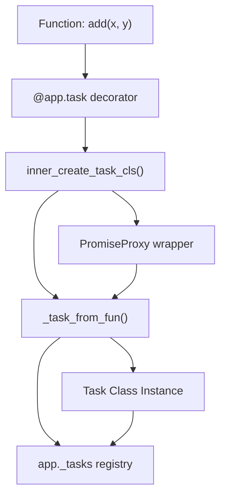
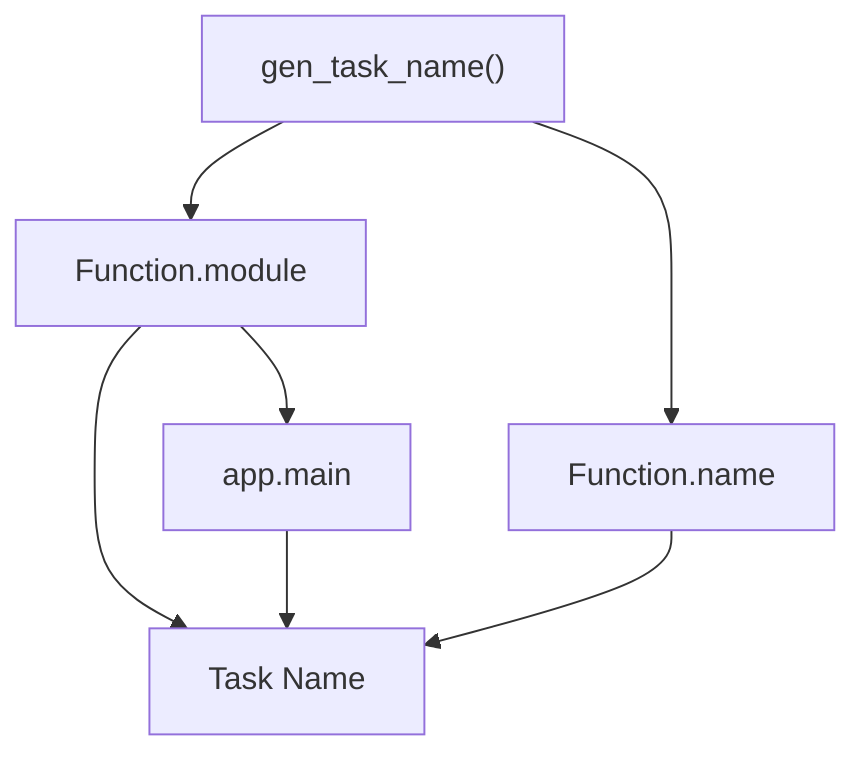
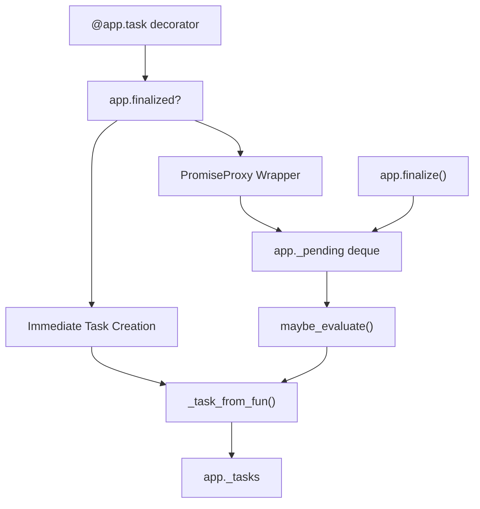
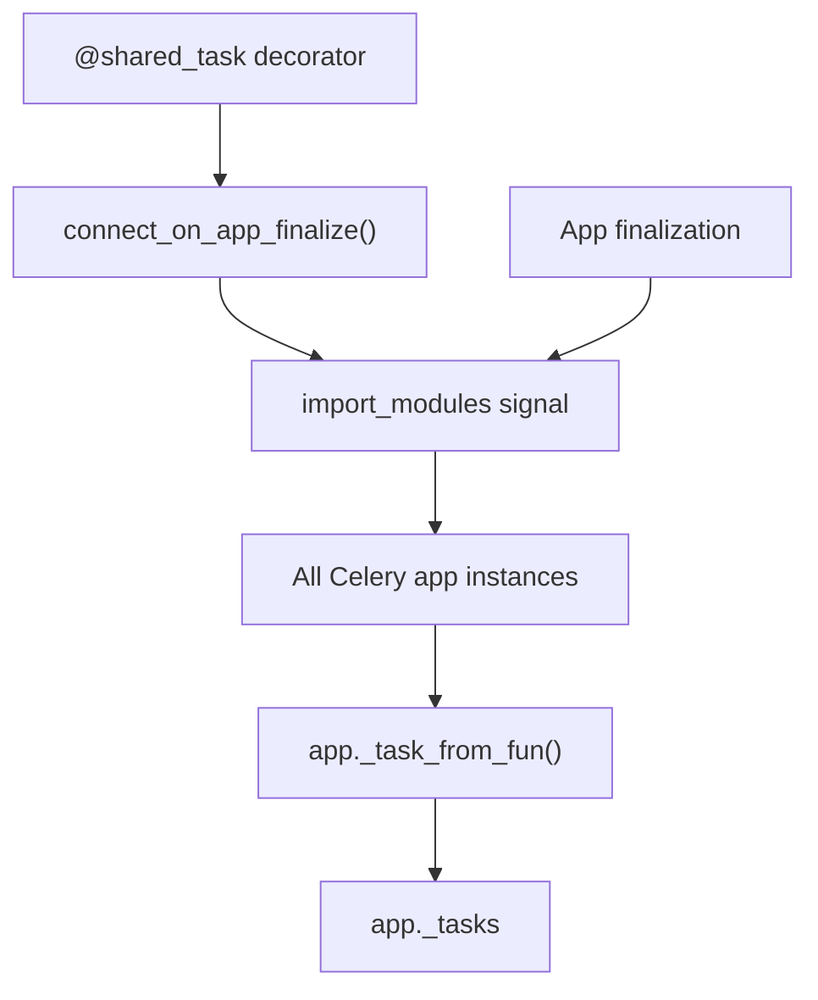
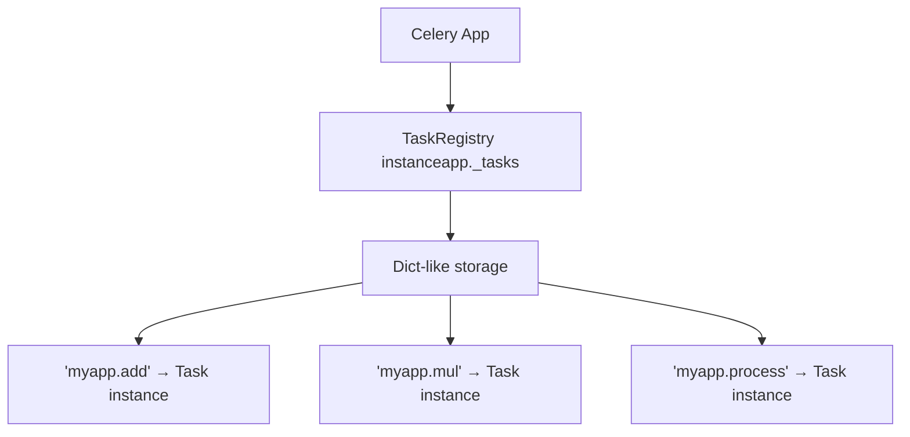
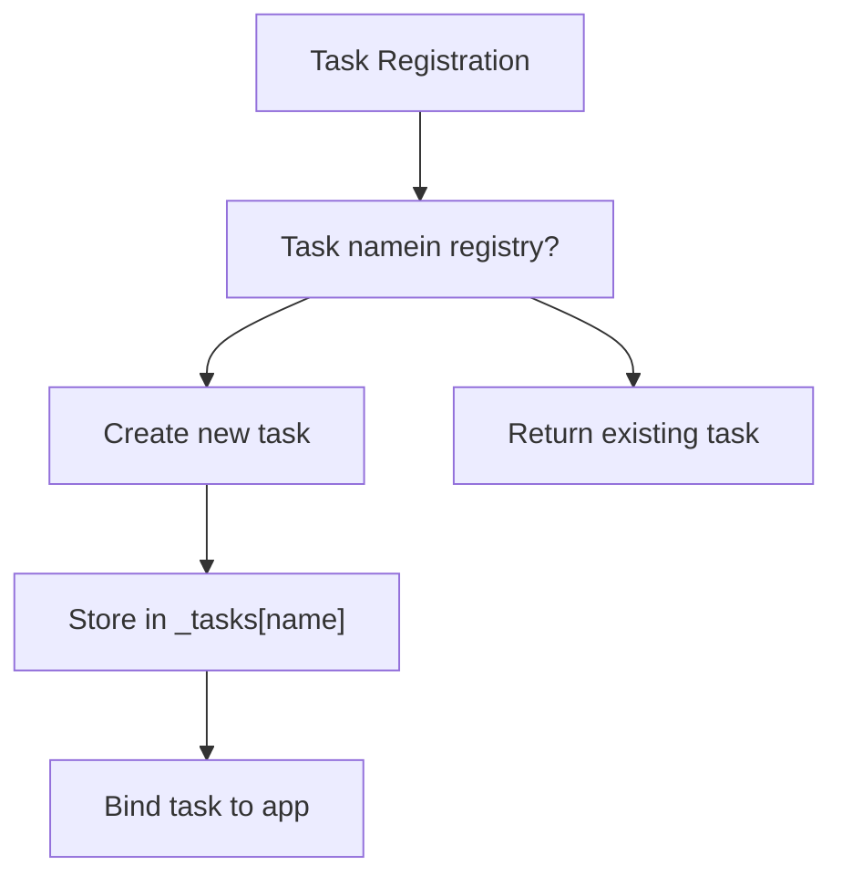
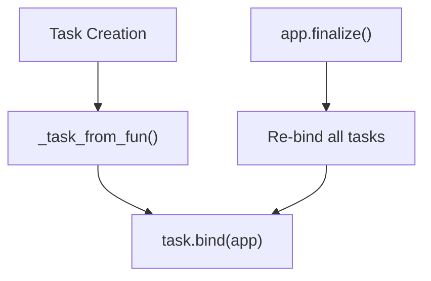

# Task Registration

Relevant source files

-   [celery/app/amqp.py](https://github.com/celery/celery/blob/4d068b56/celery/app/amqp.py)
-   [celery/app/base.py](https://github.com/celery/celery/blob/4d068b56/celery/app/base.py)
-   [celery/app/defaults.py](https://github.com/celery/celery/blob/4d068b56/celery/app/defaults.py)
-   [celery/app/task.py](https://github.com/celery/celery/blob/4d068b56/celery/app/task.py)
-   [celery/canvas.py](https://github.com/celery/celery/blob/4d068b56/celery/canvas.py)
-   [celery/utils/\_\_init\_\_.py](https://github.com/celery/celery/blob/4d068b56/celery/utils/__init__.py)
-   [docs/faq.rst](https://github.com/celery/celery/blob/4d068b56/docs/faq.rst)
-   [docs/getting-started/first-steps-with-celery.rst](https://github.com/celery/celery/blob/4d068b56/docs/getting-started/first-steps-with-celery.rst)
-   [docs/getting-started/next-steps.rst](https://github.com/celery/celery/blob/4d068b56/docs/getting-started/next-steps.rst)
-   [docs/userguide/calling.rst](https://github.com/celery/celery/blob/4d068b56/docs/userguide/calling.rst)
-   [docs/userguide/canvas.rst](https://github.com/celery/celery/blob/4d068b56/docs/userguide/canvas.rst)
-   [docs/userguide/monitoring.rst](https://github.com/celery/celery/blob/4d068b56/docs/userguide/monitoring.rst)
-   [docs/userguide/periodic-tasks.rst](https://github.com/celery/celery/blob/4d068b56/docs/userguide/periodic-tasks.rst)
-   [docs/userguide/routing.rst](https://github.com/celery/celery/blob/4d068b56/docs/userguide/routing.rst)
-   [docs/userguide/tasks.rst](https://github.com/celery/celery/blob/4d068b56/docs/userguide/tasks.rst)
-   [docs/userguide/workers.rst](https://github.com/celery/celery/blob/4d068b56/docs/userguide/workers.rst)
-   [t/integration/conftest.py](https://github.com/celery/celery/blob/4d068b56/t/integration/conftest.py)
-   [t/integration/tasks.py](https://github.com/celery/celery/blob/4d068b56/t/integration/tasks.py)
-   [t/integration/test\_canvas.py](https://github.com/celery/celery/blob/4d068b56/t/integration/test_canvas.py)
-   [t/integration/test\_quorum\_queue\_qos\_cluster\_simulation.py](https://github.com/celery/celery/blob/4d068b56/t/integration/test_quorum_queue_qos_cluster_simulation.py)
-   [t/integration/test\_security.py](https://github.com/celery/celery/blob/4d068b56/t/integration/test_security.py)
-   [t/integration/test\_tasks.py](https://github.com/celery/celery/blob/4d068b56/t/integration/test_tasks.py)
-   [t/smoke/tests/test\_canvas.py](https://github.com/celery/celery/blob/4d068b56/t/smoke/tests/test_canvas.py)
-   [t/unit/app/test\_app.py](https://github.com/celery/celery/blob/4d068b56/t/unit/app/test_app.py)
-   [t/unit/tasks/test\_canvas.py](https://github.com/celery/celery/blob/4d068b56/t/unit/tasks/test_canvas.py)
-   [t/unit/tasks/test\_tasks.py](https://github.com/celery/celery/blob/4d068b56/t/unit/tasks/test_tasks.py)

Task registration is the process by which callable functions are transformed into Celery task instances and associated with a Celery application. This page documents the `@app.task` decorator, the task registry, lazy evaluation mechanics, and shared task patterns.

For information about task execution and lifecycle, see [Task Lifecycle and States](/celery/celery/3.2-task-lifecycle-and-states). For details on invoking tasks, see [Task Definition and Invocation](/celery/celery/3.1-task-definition-and-invocation).

## Overview

Tasks are registered with a Celery application instance through the `@app.task` decorator. The registration process:

1.  Wraps the function in a Task class
2.  Generates or assigns a unique name
3.  Stores the task in the application's task registry
4.  Binds the task to the application

The registry serves as a central lookup table mapping task names to task instances, enabling workers to locate and execute tasks when messages arrive.

**Sources:** [celery/app/base.py489-608](https://github.com/celery/celery/blob/4d068b56/celery/app/base.py#L489-L608) [docs/userguide/tasks.rst89-147](https://github.com/celery/celery/blob/4d068b56/docs/userguide/tasks.rst#L89-L147)

## The Task Decorator

### Basic Usage

The `@app.task` decorator converts a regular Python function into a Celery task:

```
@app.task
def add(x, y):
    return x + y
```
This creates a task instance with an automatically generated name (e.g., `"module.add"`) and registers it with the application.

**Sources:** [celery/app/base.py489-559](https://github.com/celery/celery/blob/4d068b56/celery/app/base.py#L489-L559) [docs/getting-started/first-steps-with-celery.rst130-150](https://github.com/celery/celery/blob/4d068b56/docs/getting-started/first-steps-with-celery.rst#L130-L150)

### Decorator Mechanics


**Decorator Execution Flow**

The decorator implementation follows this path:

1.  **Decorator invocation** [celery/app/base.py489](https://github.com/celery/celery/blob/4d068b56/celery/app/base.py#L489-L489) - `app.task()` is called with optional parameters
2.  **Inner function creation** [celery/app/base.py528-549](https://github.com/celery/celery/blob/4d068b56/celery/app/base.py#L528-L549) - `inner_create_task_cls()` defines the actual decoration logic
3.  **Lazy vs immediate evaluation** [celery/app/base.py538-544](https://github.com/celery/celery/blob/4d068b56/celery/app/base.py#L538-L544):
    -   If `lazy=True` and app not finalized: returns `PromiseProxy`
    -   If `lazy=False` or app finalized: calls `_task_from_fun()` immediately
4.  **Task creation** [celery/app/base.py564-607](https://github.com/celery/celery/blob/4d068b56/celery/app/base.py#L564-L607) - `_task_from_fun()` constructs the task class
5.  **Registry storage** [celery/app/base.py602](https://github.com/celery/celery/blob/4d068b56/celery/app/base.py#L602-L602) - Task stored in `app._tasks[task.name]`

**Sources:** [celery/app/base.py489-607](https://github.com/celery/celery/blob/4d068b56/celery/app/base.py#L489-L607)

### Decorator Options

The decorator accepts numerous options that configure task behavior:

| Option | Purpose | Example |
| --- | --- | --- |
| `name` | Explicit task name | `@app.task(name='myapp.add')` |
| `bind` | Bind task instance as first arg | `@app.task(bind=True)` |
| `base` | Custom base class | `@app.task(base=MyTask)` |
| `pydantic` | Enable Pydantic validation | `@app.task(pydantic=True)` |
| `shared` | Register as shared task | `@app.task(shared=True)` |
| `lazy` | Enable lazy evaluation | `@app.task(lazy=True)` |

All keyword arguments become attributes on the resulting task class [celery/app/base.py586-595](https://github.com/celery/celery/blob/4d068b56/celery/app/base.py#L586-L595)

**Sources:** [celery/app/base.py489-559](https://github.com/celery/celery/blob/4d068b56/celery/app/base.py#L489-L559) [docs/userguide/tasks.rst106-114](https://github.com/celery/celery/blob/4d068b56/docs/userguide/tasks.rst#L106-L114)

## Task Naming

### Automatic Name Generation

When no explicit `name` is provided, Celery generates a name using the pattern:

```
<module_name>.<function_name>
```
The generation occurs in `gen_task_name()`:


The name generation logic \[celery/utils/imports.py\] (referenced in [celery/app/base.py628-629](https://github.com/celery/celery/blob/4d068b56/celery/app/base.py#L628-L629)):

1.  Uses `fun.__module__` as namespace
2.  If module is `"__main__"`, substitutes `app.main` value
3.  Appends function name: `f"{module}.{name}"`

**Example:**

```
# In file myapp/tasks.py
@app.task
def process_data(data):
    pass

# Generated name: "myapp.tasks.process_data"
```
**Sources:** [celery/app/base.py628-629](https://github.com/celery/celery/blob/4d068b56/celery/app/base.py#L628-L629) [celery/utils/imports.py](https://github.com/celery/celery/blob/4d068b56/celery/utils/imports.py) [docs/userguide/tasks.rst187-240](https://github.com/celery/celery/blob/4d068b56/docs/userguide/tasks.rst#L187-L240)

### Explicit Naming

Tasks can specify custom names:

```
@app.task(name='custom.task.name')
def my_function():
    pass
```
The explicit name bypasses generation and is used directly [celery/app/base.py578](https://github.com/celery/celery/blob/4d068b56/celery/app/base.py#L578-L578)

**Best Practice:** Use module-qualified names to avoid collisions:

```
@app.task(name='myapp.tasks.process')
```
**Sources:** [docs/userguide/tasks.rst196-216](https://github.com/celery/celery/blob/4d068b56/docs/userguide/tasks.rst#L196-L216)

### Custom Name Generation

Applications can override `gen_task_name()` to customize naming:

```
class MyCelery(Celery):
    def gen_task_name(self, name, module):
        if module.endswith('.tasks'):
            module = module[:-6]  # Remove .tasks suffix
        return super().gen_task_name(name, module)
```
This allows project-wide naming conventions [docs/userguide/tasks.rst250-295](https://github.com/celery/celery/blob/4d068b56/docs/userguide/tasks.rst#L250-L295)

**Sources:** [docs/userguide/tasks.rst250-295](https://github.com/celery/celery/blob/4d068b56/docs/userguide/tasks.rst#L250-L295)

## Lazy Evaluation and Finalization

### The Lazy Registration Pattern

Celery uses lazy evaluation to defer task creation until the application is fully configured. This solves circular dependency issues and enables configuration after task definition.


**Implementation Details**

The lazy evaluation mechanism uses three components:

1.  **PromiseProxy** \[celery/local.py\] - A proxy object that delays evaluation
2.  **\_pending deque** [celery/app/base.py356](https://github.com/celery/celery/blob/4d068b56/celery/app/base.py#L356-L356) - Stores pending task proxies
3.  **finalize() method** [celery/app/base.py631-651](https://github.com/celery/celery/blob/4d068b56/celery/app/base.py#L631-L651) - Evaluates all pending tasks

**When lazy evaluation is enabled:**

```
@app.task  # lazy=True by default
def my_task():
    pass

# At this point, my_task is a PromiseProxy
# The actual Task instance is created when:
# 1. The task is called/accessed, OR
# 2. app.finalize() is called
```
**Sources:** [celery/app/base.py538-544](https://github.com/celery/celery/blob/4d068b56/celery/app/base.py#L538-L544) [celery/app/base.py631-651](https://github.com/celery/celery/blob/4d068b56/celery/app/base.py#L631-L651)

### Finalization Process

The finalization process [celery/app/base.py631-651](https://github.com/celery/celery/blob/4d068b56/celery/app/base.py#L631-L651) occurs when:

-   The application is explicitly finalized: `app.finalize()`
-   Auto-finalization is enabled (default) and a finalization trigger occurs
-   A task or registry is accessed and `autofinalize=True`

**Finalization steps:**

1.  Acquire finalization mutex [celery/app/base.py637](https://github.com/celery/celery/blob/4d068b56/celery/app/base.py#L637-L637)
2.  Mark app as finalized [celery/app/base.py641](https://github.com/celery/celery/blob/4d068b56/celery/app/base.py#L641-L641)
3.  Announce finalization via signal [celery/app/base.py642](https://github.com/celery/celery/blob/4d068b56/celery/app/base.py#L642-L642)
4.  Evaluate all pending proxies [celery/app/base.py644-646](https://github.com/celery/celery/blob/4d068b56/celery/app/base.py#L644-L646)
5.  Bind all tasks to app [celery/app/base.py648-649](https://github.com/celery/celery/blob/4d068b56/celery/app/base.py#L648-L649)
6.  Send `on_after_finalize` signal [celery/app/base.py651](https://github.com/celery/celery/blob/4d068b56/celery/app/base.py#L651-L651)

**Sources:** [celery/app/base.py631-651](https://github.com/celery/celery/blob/4d068b56/celery/app/base.py#L631-L651)

### Disabling Lazy Evaluation

For immediate task creation:

```
@app.task(lazy=False)
def immediate_task():
    pass

# Task is created immediately, even if app not finalized
```
This is useful when:

-   The task needs immediate access to its attributes
-   Circular dependencies are not a concern
-   Working with certain testing frameworks

**Sources:** [celery/app/base.py538](https://github.com/celery/celery/blob/4d068b56/celery/app/base.py#L538-L538)

## Shared Tasks

### Purpose and Usage

Shared tasks allow libraries and reusable modules to define tasks without coupling to a specific application instance:

```
from celery import shared_task

@shared_task
def library_task(x):
    return x * 2
```
The task is registered with whatever application is currently active \[celery/\_state.py\].

**Sources:** [docs/userguide/tasks.rst122-131](https://github.com/celery/celery/blob/4d068b56/docs/userguide/tasks.rst#L122-L131)

### Shared Task Implementation


Shared tasks use the `connect_on_app_finalize` mechanism \[celery/\_state.py\]:

1.  Decorator creates a callback function that will register the task
2.  Callback is connected to app finalization signal
3.  When any app finalizes, it receives the callback
4.  The task is registered with that app

**Key implementation** [celery/app/base.py532-537](https://github.com/celery/celery/blob/4d068b56/celery/app/base.py#L532-L537):

```
if shared:
    def cons(app):
        return app._task_from_fun(fun, **opts)
    cons.__name__ = fun.__name__
    connect_on_app_finalize(cons)
```
This allows a single task definition to be registered with multiple application instances.

**Sources:** [celery/app/base.py532-537](https://github.com/celery/celery/blob/4d068b56/celery/app/base.py#L532-L537) [celery/\_state.py](https://github.com/celery/celery/blob/4d068b56/celery/_state.py)

### Shared Task Pattern for Libraries

When building reusable Celery libraries:

```
# mylib/tasks.py
from celery import shared_task

@shared_task(name='mylib.process')
def process_data(data):
    """Library task callable from any app."""
    return transform(data)

# User's app
from celery import Celery
from mylib import tasks  # Automatically registers with this app

app = Celery('myapp')
# tasks.process_data is now registered with 'myapp'
```
**Sources:** [docs/userguide/tasks.rst122-131](https://github.com/celery/celery/blob/4d068b56/docs/userguide/tasks.rst#L122-L131)

## The Task Registry

### Registry Structure

The task registry is a `TaskRegistry` instance stored in `app._tasks` [celery/app/base.py357-359](https://github.com/celery/celery/blob/4d068b56/celery/app/base.py#L357-L359):


The registry class is configurable via `registry_cls` [celery/app/base.py296](https://github.com/celery/celery/blob/4d068b56/celery/app/base.py#L296-L296)

**Sources:** [celery/app/base.py296](https://github.com/celery/celery/blob/4d068b56/celery/app/base.py#L296-L296) [celery/app/base.py342](https://github.com/celery/celery/blob/4d068b56/celery/app/base.py#L342-L342) [celery/app/base.py357-359](https://github.com/celery/celery/blob/4d068b56/celery/app/base.py#L357-L359)

### Accessing Registered Tasks

Tasks can be accessed from the registry by name:

```
# Direct registry access
task = app.tasks['myapp.tasks.add']

# Via send_task (doesn't require local task instance)
result = app.send_task('myapp.tasks.add', args=[2, 3])
```
The registry provides:

-   **Task lookup by name** - Map task names to task instances
-   **Task discovery** - List all registered tasks
-   **Dynamic task invocation** - Call tasks by name without importing

**Sources:** [celery/app/base.py602](https://github.com/celery/celery/blob/4d068b56/celery/app/base.py#L602-L602) [celery/app/base.py820-959](https://github.com/celery/celery/blob/4d068b56/celery/app/base.py#L820-L959)

### Registry Operations


**Registration logic** [celery/app/base.py581-607](https://github.com/celery/celery/blob/4d068b56/celery/app/base.py#L581-L607):

1.  Check if task name exists in registry [celery/app/base.py581](https://github.com/celery/celery/blob/4d068b56/celery/app/base.py#L581-L581)
2.  If new:
    -   Wrap function with pydantic if enabled [celery/app/base.py582-583](https://github.com/celery/celery/blob/4d068b56/celery/app/base.py#L582-L583)
    -   Create task class dynamically [celery/app/base.py586-595](https://github.com/celery/celery/blob/4d068b56/celery/app/base.py#L586-L595)
    -   Store in registry [celery/app/base.py602](https://github.com/celery/celery/blob/4d068b56/celery/app/base.py#L602-L602)
    -   Bind to app [celery/app/base.py603](https://github.com/celery/celery/blob/4d068b56/celery/app/base.py#L603-L603)
    -   Apply autoretry behavior [celery/app/base.py604](https://github.com/celery/celery/blob/4d068b56/celery/app/base.py#L604-L604)
3.  If exists: return existing task [celery/app/base.py606](https://github.com/celery/celery/blob/4d068b56/celery/app/base.py#L606-L606)

**Sources:** [celery/app/base.py581-607](https://github.com/celery/celery/blob/4d068b56/celery/app/base.py#L581-L607)

### Manual Task Registration

For class-based tasks (legacy Celery 1.0 style):

```
from celery import Task

class MyTask(Task):
    name = 'myapp.legacy_task'

    def run(self, x, y):
        return x + y

# Register manually
app.register_task(MyTask())
```
The `register_task()` method [celery/app/base.py609-626](https://github.com/celery/celery/blob/4d068b56/celery/app/base.py#L609-L626):

1.  Instantiates the task if it's a class
2.  Generates a name if not provided
3.  Adds to registry
4.  Binds to app

**Modern approach:** Use `@app.task` decorator instead.

**Sources:** [celery/app/base.py609-626](https://github.com/celery/celery/blob/4d068b56/celery/app/base.py#L609-L626) [docs/userguide/tasks.rst167-183](https://github.com/celery/celery/blob/4d068b56/docs/userguide/tasks.rst#L167-L183)

## Task Binding

### What is Binding?

Task binding establishes the relationship between a task instance and its Celery application. Binding provides the task with:

-   **Application reference** - Access to `task.app`
-   **Configuration** - Task can read from `app.conf`
-   **Backend access** - Task can store results
-   **Request context** - Task gets execution metadata

**Sources:** [celery/app/base.py603](https://github.com/celery/celery/blob/4d068b56/celery/app/base.py#L603-L603) [celery/app/base.py625](https://github.com/celery/celery/blob/4d068b56/celery/app/base.py#L625-L625)

### When Binding Occurs

Binding happens at multiple points:


**Binding points:**

1.  **During task creation** [celery/app/base.py603](https://github.com/celery/celery/blob/4d068b56/celery/app/base.py#L603-L603) - When `_task_from_fun()` creates the task
2.  **During finalization** [celery/app/base.py648-649](https://github.com/celery/celery/blob/4d068b56/celery/app/base.py#L648-L649) - All tasks re-bound to ensure consistency
3.  **Manual registration** [celery/app/base.py625](https://github.com/celery/celery/blob/4d068b56/celery/app/base.py#L625-L625) - When using `register_task()`

**Binding implementation:**

```
task.bind(app)  # Sets task._app = app
```
This ensures the task always has access to its application's configuration and resources.

**Sources:** [celery/app/base.py603](https://github.com/celery/celery/blob/4d068b56/celery/app/base.py#L603-L603) [celery/app/base.py625](https://github.com/celery/celery/blob/4d068b56/celery/app/base.py#L625-L625) [celery/app/base.py648-649](https://github.com/celery/celery/blob/4d068b56/celery/app/base.py#L648-L649)

## Registration Lifecycle Diagram

> **[Mermaid stateDiagram]**
> *(图表结构无法解析)*

**Complete registration flow:**

1.  **Decoration** - `@app.task` applied to function
2.  **Evaluation mode** - Lazy (PromiseProxy) or immediate
3.  **Name assignment** - Automatic or explicit naming
4.  **Task creation** - Dynamic class construction
5.  **Registry storage** - Added to `app._tasks[name]`
6.  **Binding** - Task linked to application
7.  **Ready** - Task can be invoked

**Sources:** [celery/app/base.py489-651](https://github.com/celery/celery/blob/4d068b56/celery/app/base.py#L489-L651)

## Key Configuration Options

Task registration behavior is controlled by application settings:

| Setting | Description | Default |
| --- | --- | --- |
| `task_cls` | Base task class for `@app.task` | `'celery.app.task:Task'` |
| `registry_cls` | Registry class to use | `'celery.app.registry:TaskRegistry'` |
| `autofinalize` | Auto-finalize on first use | `True` |
| `strict_typing` | Enable argument checking | `True` |

Set in application configuration:

```
app = Celery(
    'myapp',
    task_cls='myapp.MyTask',
    autofinalize=False
)
```
**Sources:** [celery/app/base.py295-347](https://github.com/celery/celery/blob/4d068b56/celery/app/base.py#L295-L347) [celery/app/defaults.py](https://github.com/celery/celery/blob/4d068b56/celery/app/defaults.py)

## Common Patterns

### Factory Pattern

Creating tasks dynamically:

```
def create_task(operation):
    @app.task(name=f'myapp.{operation}')
    def task_function(x, y):
        return getattr(operator, operation)(x, y)
    return task_function

add_task = create_task('add')
mul_task = create_task('mul')
```
**Sources:** [celery/app/base.py489-607](https://github.com/celery/celery/blob/4d068b56/celery/app/base.py#L489-L607)

### Conditional Registration

Register tasks based on configuration:

```
if app.conf.enable_feature_x:
    @app.task
    def feature_x_task():
        pass
```
**Sources:** [celery/app/base.py489-559](https://github.com/celery/celery/blob/4d068b56/celery/app/base.py#L489-L559)

### Multiple Applications

Register same task with multiple apps:

```
# Using shared_task
@shared_task
def universal_task():
    pass

# Or explicitly
def my_function():
    pass

app1.task(my_function, name='app1.task')
app2.task(my_function, name='app2.task')
```
**Sources:** [celery/app/base.py532-537](https://github.com/celery/celery/blob/4d068b56/celery/app/base.py#L532-L537) [docs/userguide/tasks.rst122-131](https://github.com/celery/celery/blob/4d068b56/docs/userguide/tasks.rst#L122-L131)
