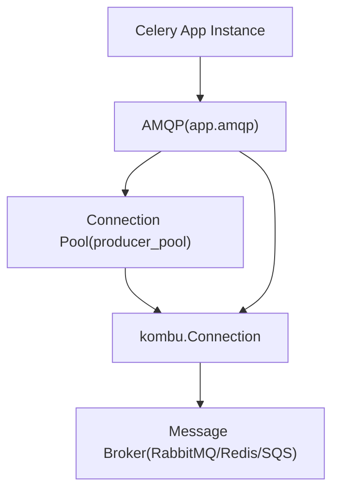
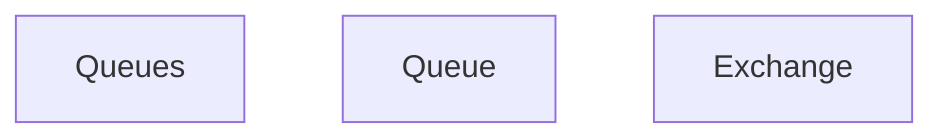
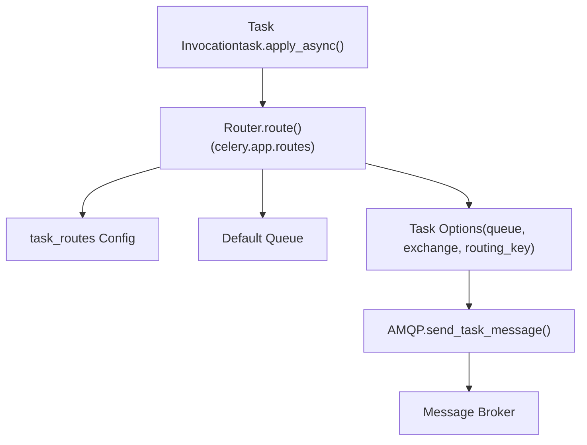
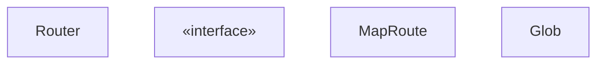

# Message Brokers and Routing

Relevant source files

-   [celery/app/amqp.py](https://github.com/celery/celery/blob/4d068b56/celery/app/amqp.py)
-   [celery/app/base.py](https://github.com/celery/celery/blob/4d068b56/celery/app/base.py)
-   [celery/app/defaults.py](https://github.com/celery/celery/blob/4d068b56/celery/app/defaults.py)
-   [celery/app/task.py](https://github.com/celery/celery/blob/4d068b56/celery/app/task.py)
-   [celery/canvas.py](https://github.com/celery/celery/blob/4d068b56/celery/canvas.py)
-   [celery/utils/\_\_init\_\_.py](https://github.com/celery/celery/blob/4d068b56/celery/utils/__init__.py)
-   [docs/faq.rst](https://github.com/celery/celery/blob/4d068b56/docs/faq.rst)
-   [docs/getting-started/first-steps-with-celery.rst](https://github.com/celery/celery/blob/4d068b56/docs/getting-started/first-steps-with-celery.rst)
-   [docs/getting-started/next-steps.rst](https://github.com/celery/celery/blob/4d068b56/docs/getting-started/next-steps.rst)
-   [docs/userguide/calling.rst](https://github.com/celery/celery/blob/4d068b56/docs/userguide/calling.rst)
-   [docs/userguide/canvas.rst](https://github.com/celery/celery/blob/4d068b56/docs/userguide/canvas.rst)
-   [docs/userguide/monitoring.rst](https://github.com/celery/celery/blob/4d068b56/docs/userguide/monitoring.rst)
-   [docs/userguide/periodic-tasks.rst](https://github.com/celery/celery/blob/4d068b56/docs/userguide/periodic-tasks.rst)
-   [docs/userguide/routing.rst](https://github.com/celery/celery/blob/4d068b56/docs/userguide/routing.rst)
-   [docs/userguide/tasks.rst](https://github.com/celery/celery/blob/4d068b56/docs/userguide/tasks.rst)
-   [docs/userguide/workers.rst](https://github.com/celery/celery/blob/4d068b56/docs/userguide/workers.rst)
-   [t/integration/conftest.py](https://github.com/celery/celery/blob/4d068b56/t/integration/conftest.py)
-   [t/integration/tasks.py](https://github.com/celery/celery/blob/4d068b56/t/integration/tasks.py)
-   [t/integration/test\_canvas.py](https://github.com/celery/celery/blob/4d068b56/t/integration/test_canvas.py)
-   [t/integration/test\_quorum\_queue\_qos\_cluster\_simulation.py](https://github.com/celery/celery/blob/4d068b56/t/integration/test_quorum_queue_qos_cluster_simulation.py)
-   [t/integration/test\_security.py](https://github.com/celery/celery/blob/4d068b56/t/integration/test_security.py)
-   [t/integration/test\_tasks.py](https://github.com/celery/celery/blob/4d068b56/t/integration/test_tasks.py)
-   [t/smoke/tests/test\_canvas.py](https://github.com/celery/celery/blob/4d068b56/t/smoke/tests/test_canvas.py)
-   [t/unit/app/test\_app.py](https://github.com/celery/celery/blob/4d068b56/t/unit/app/test_app.py)
-   [t/unit/tasks/test\_canvas.py](https://github.com/celery/celery/blob/4d068b56/t/unit/tasks/test_canvas.py)
-   [t/unit/tasks/test\_tasks.py](https://github.com/celery/celery/blob/4d068b56/t/unit/tasks/test_tasks.py)

This document describes Celery's message broker support and task routing system. It covers the supported message broker types, queue configuration through the `Queues` class, and the routing mechanisms that determine which queue receives a given task message.

For information about the low-level AMQP protocol implementation, message creation, and serialization, see [AMQP Layer and Message Protocol](/celery/celery/2.4-amqp-layer-and-message-protocol). For task definition and execution, see [Tasks](/celery/celery/3-tasks).

---

## Message Broker Support

Celery uses a message broker to send and receive task messages. The broker acts as an intermediary that queues messages for workers to consume. Multiple broker types are supported, each with different characteristics.

### Supported Brokers

The primary supported message brokers include:

| Broker | Production Ready | Transport Type | Configuration Key |
| --- | --- | --- | --- |
| RabbitMQ | Yes | AMQP | `broker_url='amqp://...'` |
| Redis | Yes | Redis protocol | `broker_url='redis://...'` |
| Amazon SQS | Yes | HTTP/SQS API | `broker_url='sqs://...'` |
| Pyro | Experimental | RPC | `broker_url='pyro://...'` |

**Sources:** [docs/getting-started/first-steps-with-celery.rst38-101](https://github.com/celery/celery/blob/4d068b56/docs/getting-started/first-steps-with-celery.rst#L38-L101) [celery/app/defaults.py83-107](https://github.com/celery/celery/blob/4d068b56/celery/app/defaults.py#L83-L107)

### Broker Configuration

The broker connection is configured through the `broker_url` setting in the Celery application:

```
app = Celery('myapp', broker='redis://localhost:6379/0')
```
Additional broker settings are available through the `broker` namespace:

-   `broker_connection_timeout` - connection timeout in seconds (default: 4)
-   `broker_connection_retry` - automatically retry connections (default: True)
-   `broker_connection_max_retries` - max connection retry attempts (default: 100)
-   `broker_heartbeat` - heartbeat interval for AMQP brokers (default: 120)
-   `broker_pool_limit` - connection pool size (default: 10)
-   `broker_transport_options` - additional transport-specific options

**Sources:** [celery/app/defaults.py83-107](https://github.com/celery/celery/blob/4d068b56/celery/app/defaults.py#L83-L107) [celery/app/base.py961-976](https://github.com/celery/celery/blob/4d068b56/celery/app/base.py#L961-L976)

### Connection Management

The `AMQP` class provides broker connection management through the `Connection` class (aliased from Kombu):


**Diagram: Broker Connection Architecture**

The application maintains a pool of broker connections for task publishing. The `producer_pool` attribute on the `AMQP` instance provides access to this pool.

**Sources:** [celery/app/amqp.py219-250](https://github.com/celery/celery/blob/4d068b56/celery/app/amqp.py#L219-L250) [celery/app/base.py961-1000](https://github.com/celery/celery/blob/4d068b56/celery/app/base.py#L961-L1000)

---

## Queue Configuration

Queues define where task messages are stored before workers consume them. Celery provides both automatic and manual queue configuration approaches.

### The Queues Class

The `celery.app.amqp.Queues` class manages queue definitions and provides a dictionary-like interface for queue access:


**Diagram: Queues Class Structure**

**Sources:** [celery/app/amqp.py41-217](https://github.com/celery/celery/blob/4d068b56/celery/app/amqp.py#L41-L217)

### Automatic Queue Creation

When `task_create_missing_queues` is enabled (default: `True`), Celery automatically creates queues that don't exist. The `Queues.__missing__` method handles this:

```
def __missing__(self, name):
    if self.create_missing:
        return self.add(self.new_missing(name))
    raise KeyError(name)
```
The `new_missing` method creates a queue with automatic defaults:

-   Exchange name matches the queue name
-   Exchange type determined by `create_missing_queue_exchange_type`
-   Queue type determined by `create_missing_queue_type` ('classic' or 'quorum')

**Sources:** [celery/app/amqp.py97-210](https://github.com/celery/celery/blob/4d068b56/celery/app/amqp.py#L97-L210) [celery/app/defaults.py266-268](https://github.com/celery/celery/blob/4d068b56/celery/app/defaults.py#L266-L268)

### Manual Queue Definition

For production systems, explicit queue definition provides more control. Queues are defined through the `task_queues` configuration:

```
from kombu import Queue, Exchange

app.conf.task_queues = (
    Queue('default', Exchange('default'), routing_key='task.#'),
    Queue('priority', Exchange('priority'), routing_key='priority.#'),
    Queue('feeds', Exchange('feeds', type='topic'), routing_key='feed.#'),
)
```
**Configuration Options:**

| Setting | Type | Description |
| --- | --- | --- |
| `task_default_queue` | str | Default queue name (default: 'celery') |
| `task_default_exchange` | str | Default exchange name |
| `task_default_exchange_type` | str | Exchange type: 'direct', 'topic', 'fanout' |
| `task_default_routing_key` | str | Default routing key |
| `task_create_missing_queues` | bool | Auto-create missing queues |
| `task_create_missing_queue_type` | str | Type for auto-created queues ('classic'/'quorum') |
| `task_queue_max_priority` | int | Max priority for queues |

**Sources:** [celery/app/defaults.py259-312](https://github.com/celery/celery/blob/4d068b56/celery/app/defaults.py#L259-L312) [celery/app/amqp.py267-300](https://github.com/celery/celery/blob/4d068b56/celery/app/amqp.py#L267-L300) [docs/userguide/routing.rst117-136](https://github.com/celery/celery/blob/4d068b56/docs/userguide/routing.rst#L117-L136)

### Queue Selection and Consumption

Workers can consume from a subset of queues using the `-Q` option:

```
celery -A proj worker -Q default,priority,feeds
```
The `Queues.select()` and `Queues.deselect()` methods manage which queues are actively consumed:

```
queues.select(['default', 'priority'])  # Only consume these
queues.deselect(['feeds'])  # Exclude this queue
```
The `consume_from` property returns the active queue set.

**Sources:** [celery/app/amqp.py168-216](https://github.com/celery/celery/blob/4d068b56/celery/app/amqp.py#L168-L216) [docs/userguide/workers.rst36-43](https://github.com/celery/celery/blob/4d068b56/docs/userguide/workers.rst#L36-L43)

---

## Task Routing

Task routing determines which queue receives a task message. Celery supports multiple routing mechanisms with varying levels of control.

### Routing Flow


**Diagram: Task Routing Flow**

**Sources:** [celery/app/base.py820-959](https://github.com/celery/celery/blob/4d068b56/celery/app/base.py#L820-L959) [celery/app/routes.py](https://github.com/celery/celery/blob/4d068b56/celery/app/routes.py)

### The Router Class

The `celery.app.routes.Router` class implements the routing logic:


**Diagram: Router Class Hierarchy**

The `Router.route()` method processes routing in this order:

1.  Check task-specific options (`queue`, `exchange`, `routing_key`)
2.  Look up `task_routes` configuration
3.  Apply default queue if nothing matched
4.  Expand queue name to full routing options

**Sources:** [celery/app/routes.py](https://github.com/celery/celery/blob/4d068b56/celery/app/routes.py)

### Automatic Routing with task\_routes

The `task_routes` configuration provides pattern-based routing without modifying task code:

**Dictionary format:**

```
app.conf.task_routes = {
    'myapp.tasks.add': {'queue': 'math'},
    'myapp.tasks.fetch': {'queue': 'io'},
}
```
**Glob patterns:**

```
app.conf.task_routes = {
    'myapp.tasks.*': {'queue': 'myapp'},
    'feed.tasks.*': {'queue': 'feeds'},
}
```
**List format (with precedence):**

```
app.conf.task_routes = ([
    ('feed.tasks.*', {'queue': 'feeds'}),
    ('web.tasks.*', {'queue': 'web'}),
    (re.compile(r'(video|image)\.tasks\..*'), {'queue': 'media'}),
],)
```
**Router function:**

```
def route_task(name, args, kwargs, options, task=None, **kw):
    if name.startswith('feed.'):
        return {'queue': 'feeds', 'priority': 9}
    return None

app.conf.task_routes = (route_task,)
```
**Sources:** [docs/userguide/routing.rst36-61](https://github.com/celery/celery/blob/4d068b56/docs/userguide/routing.rst#L36-L61) [celery/app/defaults.py298](https://github.com/celery/celery/blob/4d068b56/celery/app/defaults.py#L298-L298)

### Direct Routing in Task Code

Tasks can specify routing directly through the `apply_async()` options:

```
# Route to specific queue
task.apply_async(args=[x, y], queue='priority')

# Full routing specification
task.apply_async(
    args=[x, y],
    exchange='custom',
    routing_key='custom.route',
    priority=5
)
```
The routing resolution order in `send_task()` is:

1.  Explicit options passed to `apply_async()`
2.  Routes from `Router.route()` (checking `task_routes`)
3.  Task class defaults (if any)
4.  Global defaults from configuration

**Sources:** [celery/app/base.py820-959](https://github.com/celery/celery/blob/4d068b56/celery/app/base.py#L820-L959) [celery/app/task.py446-613](https://github.com/celery/celery/blob/4d068b56/celery/app/task.py#L446-L613)

---

## Exchanges and Routing Keys

For AMQP brokers (like RabbitMQ), tasks are routed through exchanges using routing keys.

### Exchange Types

| Type | Description | Use Case |
| --- | --- | --- |
| `direct` | Exact routing key match | Simple queue routing, default behavior |
| `topic` | Pattern matching with wildcards | Flexible routing patterns (e.g., 'task.#') |
| `fanout` | Broadcast to all bound queues | Broadcasting messages |
| `headers` | Route by message headers | Complex routing logic |

**Sources:** [docs/userguide/routing.rst1-11](https://github.com/celery/celery/blob/4d068b56/docs/userguide/routing.rst#L1-L11) [celery/app/amqp.py285-289](https://github.com/celery/celery/blob/4d068b56/celery/app/amqp.py#L285-L289)

### Default Exchange Configuration

The default exchange configuration creates a direct exchange matching the queue name:

```
app.conf.task_default_queue = 'celery'
app.conf.task_default_exchange = 'celery'
app.conf.task_default_exchange_type = 'direct'
app.conf.task_default_routing_key = 'celery'
```
This means tasks route to the 'celery' queue by default using direct routing.

**Sources:** [celery/app/defaults.py271-275](https://github.com/celery/celery/blob/4d068b56/celery/app/defaults.py#L271-L275) [celery/app/amqp.py281-300](https://github.com/celery/celery/blob/4d068b56/celery/app/amqp.py#L281-L300)

### Routing Key Patterns

For topic exchanges, routing keys support wildcards:

-   `*` matches exactly one word
-   `#` matches zero or more words

Example configuration:

```
Queue('tasks', Exchange('tasks', type='topic'), routing_key='task.#')
Queue('priority', Exchange('tasks', type='topic'), routing_key='task.priority.*')
```
Tasks with routing key `'task.priority.high'` would match the second queue.

**Sources:** [docs/userguide/routing.rst99-114](https://github.com/celery/celery/blob/4d068b56/docs/userguide/routing.rst#L99-L114)

### The AMQP.Queues() Factory

The `AMQP.Queues()` method creates a `Queues` instance with configuration defaults:

```
def Queues(self, queues, create_missing=None, create_missing_queue_type=None,
           create_missing_queue_exchange_type=None, autoexchange=None,
           max_priority=None):
    conf = self.app.conf
    default_routing_key = conf.task_default_routing_key
    if create_missing is None:
        create_missing = conf.task_create_missing_queues
    # ... additional defaults from conf

    return self.queues_cls(
        queues,
        default_exchange=self.default_exchange,
        create_missing=create_missing,
        # ... other options
    )
```
This ensures queue definitions inherit application-wide defaults.

**Sources:** [celery/app/amqp.py267-300](https://github.com/celery/celery/blob/4d068b56/celery/app/amqp.py#L267-L300)

---

## Integration with send\_task()

The complete routing process happens in the `Celery.send_task()` method:

> **[Mermaid sequence]**
> *(图表结构无法解析)*

**Diagram: send\_task() Routing Integration**

The key steps:

1.  `Router.route()` determines routing options from configuration
2.  Options are merged with explicit parameters (explicit options win)
3.  `AMQP.send_task_message()` publishes to the determined destination

**Sources:** [celery/app/base.py820-959](https://github.com/celery/celery/blob/4d068b56/celery/app/base.py#L820-L959) [celery/app/amqp.py401-473](https://github.com/celery/celery/blob/4d068b56/celery/app/amqp.py#L401-L473)

---

## Configuration Reference

### Broker Settings

```
# Core broker settings
broker_url = 'redis://localhost:6379/0'
broker_connection_timeout = 4
broker_connection_retry = True
broker_connection_max_retries = 100
broker_heartbeat = 120
broker_pool_limit = 10
broker_transport_options = {'visibility_timeout': 3600}
```
**Sources:** [celery/app/defaults.py83-107](https://github.com/celery/celery/blob/4d068b56/celery/app/defaults.py#L83-L107)

### Queue Settings

```
# Default queue configuration
task_default_queue = 'celery'
task_default_exchange = 'celery'
task_default_exchange_type = 'direct'
task_default_routing_key = 'celery'

# Queue creation
task_create_missing_queues = True
task_create_missing_queue_type = 'classic'  # or 'quorum'
task_queue_max_priority = 10
```
**Sources:** [celery/app/defaults.py259-295](https://github.com/celery/celery/blob/4d068b56/celery/app/defaults.py#L259-L295)

### Routing Settings

```
# Route definitions
task_routes = {
    'myapp.tasks.*': {'queue': 'myapp', 'priority': 5},
}

# Manual queue definitions
from kombu import Queue, Exchange

task_queues = (
    Queue('default', Exchange('default'), routing_key='default'),
    Queue('priority', Exchange('priority', type='topic'), routing_key='pri.#'),
)
```
**Sources:** [celery/app/defaults.py298](https://github.com/celery/celery/blob/4d068b56/celery/app/defaults.py#L298-L298) [docs/userguide/routing.rst117-136](https://github.com/celery/celery/blob/4d068b56/docs/userguide/routing.rst#L117-L136)
