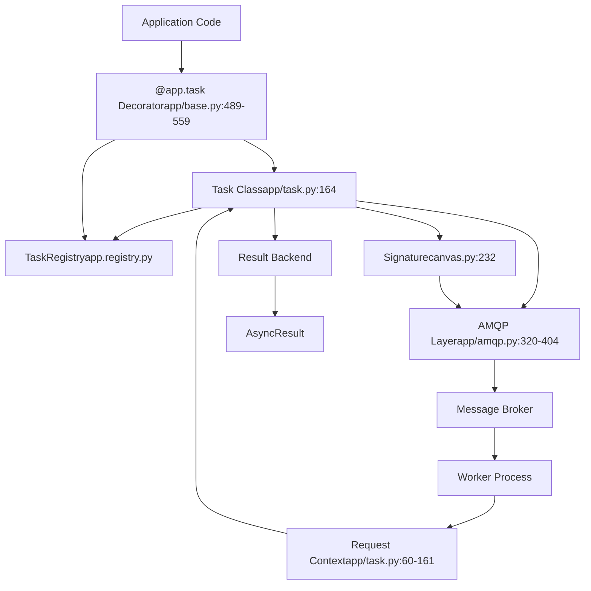
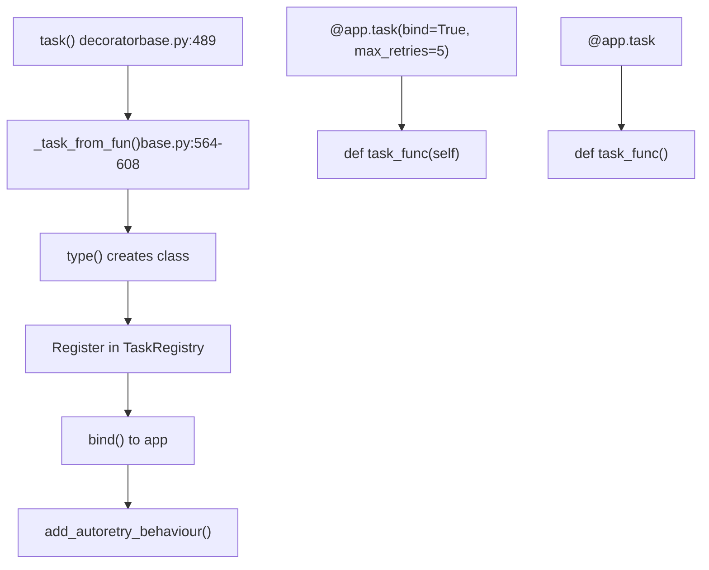
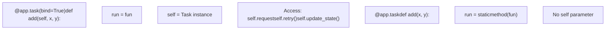
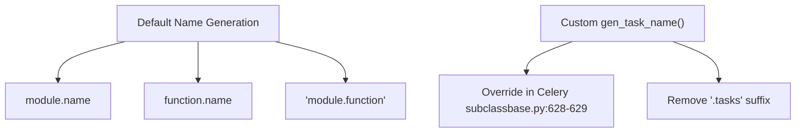
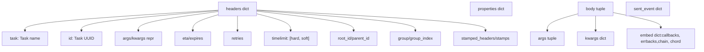
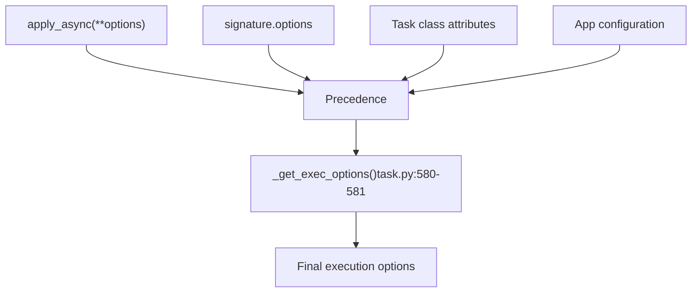
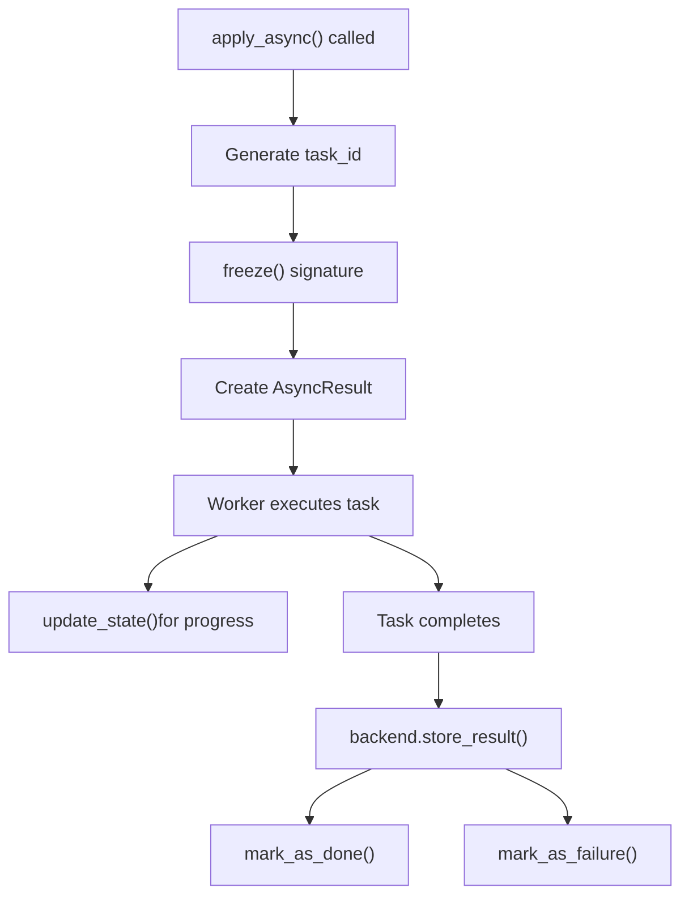
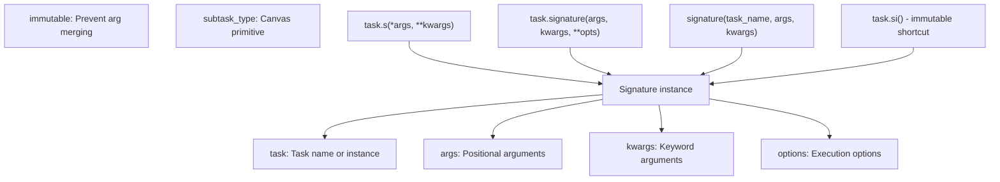
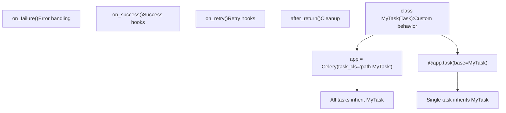

# Tasks

Relevant source files

-   [celery/app/amqp.py](https://github.com/celery/celery/blob/4d068b56/celery/app/amqp.py)
-   [celery/app/base.py](https://github.com/celery/celery/blob/4d068b56/celery/app/base.py)
-   [celery/app/defaults.py](https://github.com/celery/celery/blob/4d068b56/celery/app/defaults.py)
-   [celery/app/task.py](https://github.com/celery/celery/blob/4d068b56/celery/app/task.py)
-   [celery/canvas.py](https://github.com/celery/celery/blob/4d068b56/celery/canvas.py)
-   [celery/utils/\_\_init\_\_.py](https://github.com/celery/celery/blob/4d068b56/celery/utils/__init__.py)
-   [docs/faq.rst](https://github.com/celery/celery/blob/4d068b56/docs/faq.rst)
-   [docs/getting-started/first-steps-with-celery.rst](https://github.com/celery/celery/blob/4d068b56/docs/getting-started/first-steps-with-celery.rst)
-   [docs/getting-started/next-steps.rst](https://github.com/celery/celery/blob/4d068b56/docs/getting-started/next-steps.rst)
-   [docs/userguide/calling.rst](https://github.com/celery/celery/blob/4d068b56/docs/userguide/calling.rst)
-   [docs/userguide/canvas.rst](https://github.com/celery/celery/blob/4d068b56/docs/userguide/canvas.rst)
-   [docs/userguide/monitoring.rst](https://github.com/celery/celery/blob/4d068b56/docs/userguide/monitoring.rst)
-   [docs/userguide/periodic-tasks.rst](https://github.com/celery/celery/blob/4d068b56/docs/userguide/periodic-tasks.rst)
-   [docs/userguide/routing.rst](https://github.com/celery/celery/blob/4d068b56/docs/userguide/routing.rst)
-   [docs/userguide/tasks.rst](https://github.com/celery/celery/blob/4d068b56/docs/userguide/tasks.rst)
-   [docs/userguide/workers.rst](https://github.com/celery/celery/blob/4d068b56/docs/userguide/workers.rst)
-   [t/integration/conftest.py](https://github.com/celery/celery/blob/4d068b56/t/integration/conftest.py)
-   [t/integration/tasks.py](https://github.com/celery/celery/blob/4d068b56/t/integration/tasks.py)
-   [t/integration/test\_canvas.py](https://github.com/celery/celery/blob/4d068b56/t/integration/test_canvas.py)
-   [t/integration/test\_quorum\_queue\_qos\_cluster\_simulation.py](https://github.com/celery/celery/blob/4d068b56/t/integration/test_quorum_queue_qos_cluster_simulation.py)
-   [t/integration/test\_security.py](https://github.com/celery/celery/blob/4d068b56/t/integration/test_security.py)
-   [t/integration/test\_tasks.py](https://github.com/celery/celery/blob/4d068b56/t/integration/test_tasks.py)
-   [t/smoke/tests/test\_canvas.py](https://github.com/celery/celery/blob/4d068b56/t/smoke/tests/test_canvas.py)
-   [t/unit/app/test\_app.py](https://github.com/celery/celery/blob/4d068b56/t/unit/app/test_app.py)
-   [t/unit/tasks/test\_canvas.py](https://github.com/celery/celery/blob/4d068b56/t/unit/tasks/test_canvas.py)
-   [t/unit/tasks/test\_tasks.py](https://github.com/celery/celery/blob/4d068b56/t/unit/tasks/test_tasks.py)

Tasks are the fundamental unit of work in Celery. A task is a callable that can be executed asynchronously by workers, providing the core abstraction for distributing work across a cluster. Tasks define both what happens when the task is called (sends a message to the broker) and what happens when a worker receives that message (executes the task function).

**Scope**: This page covers the task system architecture, task class structure, definition patterns, and the task registry. For detailed information on specific aspects:

-   Task invocation and execution options: see [Task Definition and Invocation](/celery/celery/3.1-task-definition-and-invocation)
-   Task state transitions and lifecycle: see [Task Lifecycle and States](/celery/celery/3.2-task-lifecycle-and-states)
-   Retry mechanisms and error handling: see [Error Handling and Retry](/celery/celery/3.3-error-handling-and-retry)
-   Task workflow composition: see [Canvas Workflows](/celery/celery/4-canvas-workflows)

## Task Architecture

The following diagram shows how tasks fit into the Celery architecture and their relationship to other core components:

**Sources**: [celery/app/base.py489-608](https://github.com/celery/celery/blob/4d068b56/celery/app/base.py#L489-L608) [celery/app/task.py164-425](https://github.com/celery/celery/blob/4d068b56/celery/app/task.py#L164-L425) [celery/canvas.py232-287](https://github.com/celery/celery/blob/4d068b56/celery/canvas.py#L232-L287)

## Task Class

The `Task` base class at [celery/app/task.py164](https://github.com/celery/celery/blob/4d068b56/celery/app/task.py#L164-L164) provides the foundation for all tasks. When you use the `@app.task` decorator, it creates a new class that inherits from this base.

### Core Task Attributes

| Attribute | Type | Default | Description |
| --- | --- | --- | --- |
| `name` | str | Auto-generated | Unique task name used for routing |
| `max_retries` | int | 3 | Maximum retry attempts |
| `default_retry_delay` | int | 180 | Seconds before retry (3 minutes) |
| `rate_limit` | str | None | Rate limit (e.g., '100/m', '100/h') |
| `time_limit` | float | None | Hard time limit in seconds |
| `soft_time_limit` | float | None | Soft time limit in seconds |
| `ignore_result` | bool | None | Don't store task results |
| `track_started` | bool | None | Report 'STARTED' state |
| `acks_late` | bool | None | Acknowledge after execution |
| `acks_on_failure_or_timeout` | bool | None | Acknowledge even on failure |
| `reject_on_worker_lost` | bool | None | Requeue if worker crashes |

**Sources**: [celery/app/task.py189-310](https://github.com/celery/celery/blob/4d068b56/celery/app/task.py#L189-L310)

### Task Request Context

The `Context` class at [celery/app/task.py60-161](https://github.com/celery/celery/blob/4d068b56/celery/app/task.py#L60-L161) holds information about the currently executing task:

```mermaid
flowchart TD
    ReqId["idTask UUID"]
    ReqArgs["args/kwargsTask arguments"]
    ReqRetries["retriesRetry count"]
    ReqETA["eta/expiresScheduling"]
    ReqHeaders["headersCustom metadata"]
    ReqParent["parent_id/root_idWorkflow tracking"]
    ReqGroup["group/group_indexGroup membership"]
    ReqChain["chain/chordWorkflow context"]
    ReqCallbacks["callbacks/errbacksLinked tasks"]
```

**Sources**: [celery/app/task.py60-161](https://github.com/celery/celery/blob/4d068b56/celery/app/task.py#L60-L161)

## Task Definition

Tasks are created using the `@app.task` decorator implemented at [celery/app/base.py489-559](https://github.com/celery/celery/blob/4d068b56/celery/app/base.py#L489-L559) The decorator supports two calling patterns:

### Decorator Patterns

**Sources**: [celery/app/base.py489-608](https://github.com/celery/celery/blob/4d068b56/celery/app/base.py#L489-L608)

### Task Creation Process

The `_task_from_fun()` method at [celery/app/base.py564-608](https://github.com/celery/celery/blob/4d068b56/celery/app/base.py#L564-L608) performs the following steps:

1.  **Name Generation**: If no explicit name is provided, generates one using [celery/utils/imports.py](https://github.com/celery/celery/blob/4d068b56/celery/utils/imports.py#LNaN-LNaN)
2.  **Class Creation**: Uses Python's `type()` to create a new task class with:
    -   `app`: Reference to the Celery application
    -   `name`: Unique task identifier
    -   `run`: The actual task function (bound or static)
    -   `_decorated`: Marker indicating decorator-created task
    -   Task-specific options from decorator arguments
3.  **Registration**: Adds the task to `app._tasks` registry
4.  **Binding**: Calls `task.bind(app)` to configure from app settings
5.  **Autoretry Setup**: Configures automatic retry behavior if specified

**Sources**: [celery/app/base.py564-608](https://github.com/celery/celery/blob/4d068b56/celery/app/base.py#L564-L608) [celery/app/autoretry.py](https://github.com/celery/celery/blob/4d068b56/celery/app/autoretry.py)

### Bound vs Unbound Tasks

**Sources**: [celery/app/base.py585-595](https://github.com/celery/celery/blob/4d068b56/celery/app/base.py#L585-L595)

## Task Registry

The `TaskRegistry` at [celery/app/registry.py](https://github.com/celery/celery/blob/4d068b56/celery/app/registry.py) maintains a mapping of task names to task instances. Tasks can be registered in three ways:

### Registration Mechanisms

| Method | Location | Description |
| --- | --- | --- |
| `@app.task` decorator | [celery/app/base.py602](https://github.com/celery/celery/blob/4d068b56/celery/app/base.py#L602-L602) | Automatic registration during decoration |
| `app.register_task()` | [celery/app/base.py609-626](https://github.com/celery/celery/blob/4d068b56/celery/app/base.py#L609-L626) | Manual registration of task instances |
| Task class instantiation | [celery/app/task.py344-367](https://github.com/celery/celery/blob/4d068b56/celery/app/task.py#L344-L367) | Registration when task is bound to app |

### Task Naming

Task names follow the pattern `module.function_name` by default. The name generation logic at [celery/utils/imports.py](https://github.com/celery/celery/blob/4d068b56/celery/utils/imports.py#LNaN-LNaN) can be customized by overriding `Celery.gen_task_name()`:

**Sources**: [celery/utils/imports.py](https://github.com/celery/celery/blob/4d068b56/celery/utils/imports.py#LNaN-LNaN) [celery/app/base.py628-629](https://github.com/celery/celery/blob/4d068b56/celery/app/base.py#L628-L629) [docs/userguide/tasks.rst248-295](https://github.com/celery/celery/blob/4d068b56/docs/userguide/tasks.rst#L248-L295)

## Task Invocation

Tasks support three invocation methods, all part of the "Calling API":

### Invocation Methods Comparison

| Method | Signature | Execution | Returns | Use Case |
| --- | --- | --- | --- | --- |
| `__call__()` | `task(args, kwargs)` | Synchronous, current process | Return value | Testing, eager mode |
| `delay()` | `task.delay(*args, **kwargs)` | Asynchronous via worker | `AsyncResult` | Simple async calls |
| `apply_async()` | `task.apply_async(args, kwargs, **opts)` | Asynchronous via worker | `AsyncResult` | Full control with options |

**Sources**: [celery/app/task.py407-414](https://github.com/celery/celery/blob/4d068b56/celery/app/task.py#L407-L414) [celery/app/task.py433-444](https://github.com/celery/celery/blob/4d068b56/celery/app/task.py#L433-L444) [celery/app/task.py446-613](https://github.com/celery/celery/blob/4d068b56/celery/app/task.py#L446-L613)

### Message Flow During Task Invocation

> **[Mermaid sequence]**
> *(图表结构无法解析)*

**Sources**: [celery/app/task.py446-613](https://github.com/celery/celery/blob/4d068b56/celery/app/task.py#L446-L613) [celery/app/base.py820-959](https://github.com/celery/celery/blob/4d068b56/celery/app/base.py#L820-L959) [celery/app/amqp.py320-404](https://github.com/celery/celery/blob/4d068b56/celery/app/amqp.py#L320-L404)

## Task Message Protocol

Celery uses protocol version 2 by default (configurable via `task_protocol` setting). The message structure created by [celery/app/amqp.py320-404](https://github.com/celery/celery/blob/4d068b56/celery/app/amqp.py#L320-L404):

### Message Components

**Sources**: [celery/app/amqp.py320-404](https://github.com/celery/celery/blob/4d068b56/celery/app/amqp.py#L320-L404)

## Task Execution Options

Task execution options can be set in multiple ways, with the following precedence (highest to lowest):

### Option Precedence

The method `_get_exec_options()` at [celery/app/task.py849-878](https://github.com/celery/celery/blob/4d068b56/celery/app/task.py#L849-L878) extracts execution options from the task instance using the `extract_exec_options` attribute getter.

**Sources**: [celery/app/task.py580-581](https://github.com/celery/celery/blob/4d068b56/celery/app/task.py#L580-L581) [celery/app/task.py849-878](https://github.com/celery/celery/blob/4d068b56/celery/app/task.py#L849-L878) [celery/app/task.py27-32](https://github.com/celery/celery/blob/4d068b56/celery/app/task.py#L27-L32)

## Task State and Results

Tasks interact with the result backend to store state and return values:

### Result Storage Flow

**Sources**: [celery/app/task.py472-519](https://github.com/celery/celery/blob/4d068b56/celery/app/task.py#L472-L519) [celery/backends/base.py](https://github.com/celery/celery/blob/4d068b56/celery/backends/base.py)

## Task Signatures

Tasks can be converted to signatures (also called subtasks) for use in Canvas workflows. The `Signature` class at [celery/canvas.py232-287](https://github.com/celery/celery/blob/4d068b56/celery/canvas.py#L232-L287) wraps task invocation details:

### Signature Structure

**Sources**: [celery/canvas.py232-344](https://github.com/celery/celery/blob/4d068b56/celery/canvas.py#L232-L344) [celery/app/task.py](https://github.com/celery/celery/blob/4d068b56/celery/app/task.py)

## Pydantic Integration

Celery supports automatic Pydantic model validation and serialization when `pydantic=True` is set on the task decorator. The wrapper at [celery/app/base.py105-183](https://github.com/celery/celery/blob/4d068b56/celery/app/base.py#L105-L183) handles:

1.  **Argument Validation**: Validates task arguments against Pydantic model type hints
2.  **Return Serialization**: Automatically serializes Pydantic model return values to JSON-compatible dicts

**Sources**: [celery/app/base.py105-183](https://github.com/celery/celery/blob/4d068b56/celery/app/base.py#L105-L183) [celery/app/base.py582-583](https://github.com/celery/celery/blob/4d068b56/celery/app/base.py#L582-L583)

## Task Class Customization

Custom task base classes can be created by subclassing `Task` and specifying with the `base` argument or `task_cls` application setting:

### Custom Task Class Pattern

**Sources**: [celery/app/task.py164-425](https://github.com/celery/celery/blob/4d068b56/celery/app/task.py#L164-L425) [celery/app/base.py569-579](https://github.com/celery/celery/blob/4d068b56/celery/app/base.py#L569-L579) [docs/userguide/tasks.rst167-184](https://github.com/celery/celery/blob/4d068b56/docs/userguide/tasks.rst#L167-L184)

## Task Lifecycle Hooks

The `Task` class provides several hooks that can be overridden for custom behavior:

| Hook | Signature | When Called | Use Case |
| --- | --- | --- | --- |
| `on_bound(app)` | `@classmethod` | Task bound to app | Initialize per-app resources |
| `before_start(task_id, args, kwargs)` | Instance method | Before task execution | Setup |
| `on_success(retval, task_id, args, kwargs)` | Instance method | Task succeeded | Success logging |
| `on_failure(exc, task_id, args, kwargs, einfo)` | Instance method | Task failed | Error handling |
| `on_retry(exc, task_id, args, kwargs, einfo)` | Instance method | Task retrying | Retry logging |
| `after_return(status, retval, task_id, args, kwargs, einfo)` | Instance method | After task completes | Cleanup |

**Sources**: [celery/app/task.py369-376](https://github.com/celery/celery/blob/4d068b56/celery/app/task.py#L369-L376) [celery/worker/request.py](https://github.com/celery/celery/blob/4d068b56/celery/worker/request.py)
