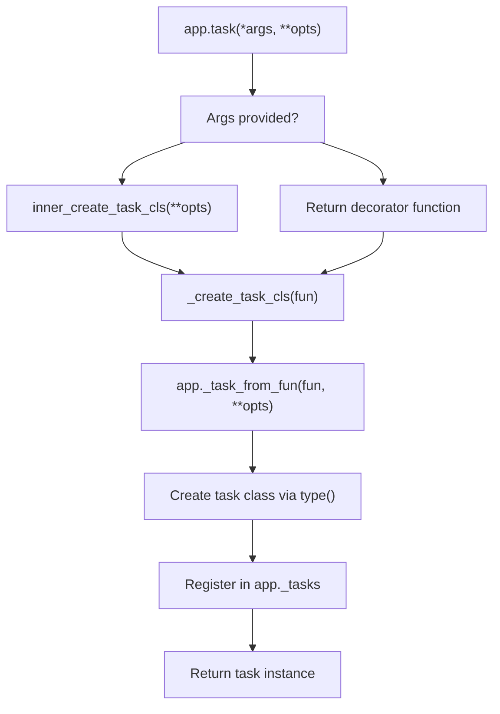
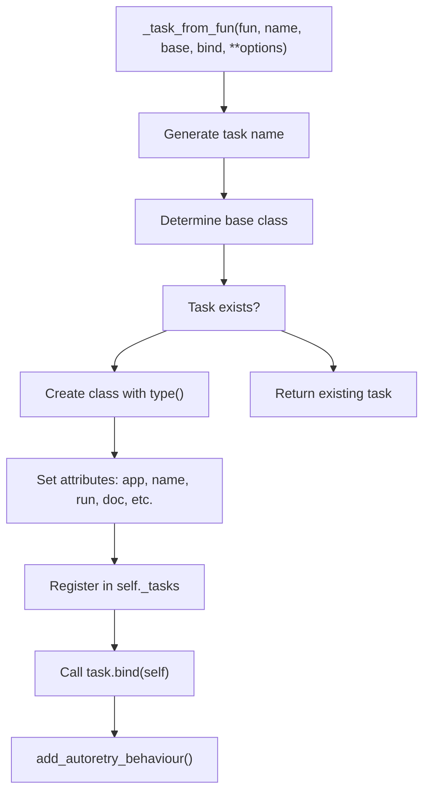
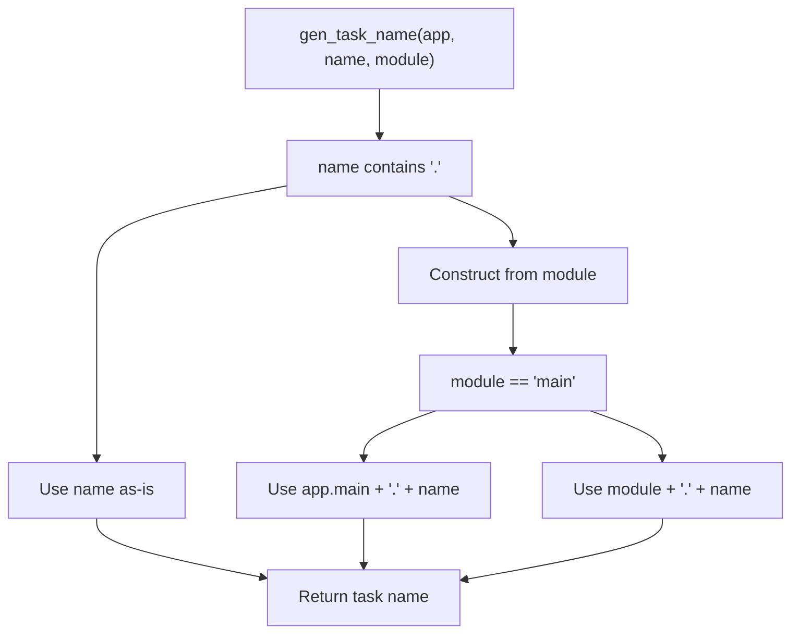
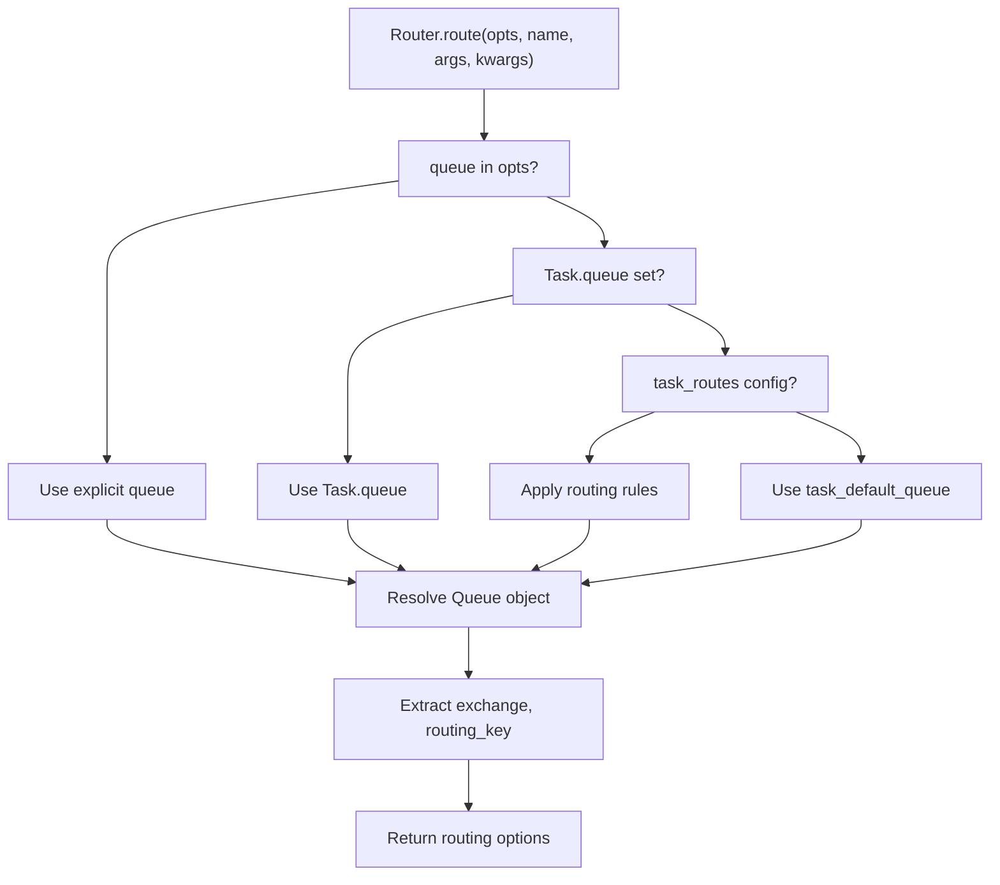
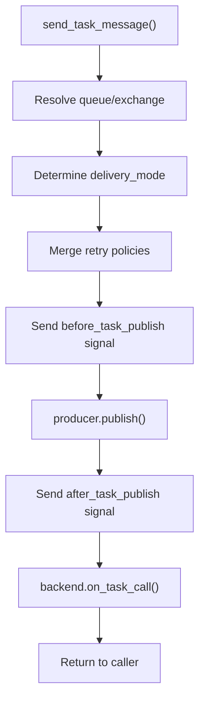
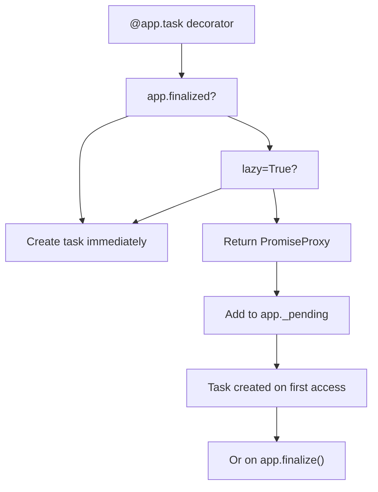
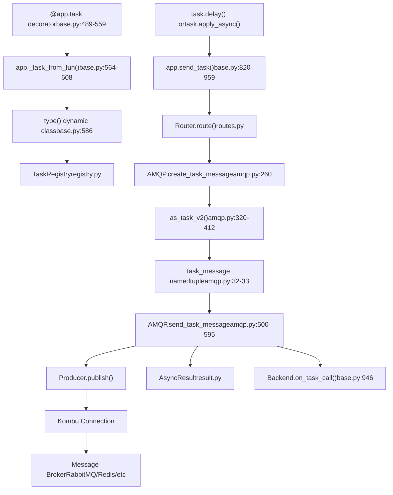

# Task Definition and Invocation

Relevant source files

-   [celery/app/amqp.py](https://github.com/celery/celery/blob/4d068b56/celery/app/amqp.py)
-   [celery/app/base.py](https://github.com/celery/celery/blob/4d068b56/celery/app/base.py)
-   [celery/app/defaults.py](https://github.com/celery/celery/blob/4d068b56/celery/app/defaults.py)
-   [celery/app/task.py](https://github.com/celery/celery/blob/4d068b56/celery/app/task.py)
-   [celery/canvas.py](https://github.com/celery/celery/blob/4d068b56/celery/canvas.py)
-   [celery/utils/\_\_init\_\_.py](https://github.com/celery/celery/blob/4d068b56/celery/utils/__init__.py)
-   [docs/faq.rst](https://github.com/celery/celery/blob/4d068b56/docs/faq.rst)
-   [docs/getting-started/first-steps-with-celery.rst](https://github.com/celery/celery/blob/4d068b56/docs/getting-started/first-steps-with-celery.rst)
-   [docs/getting-started/next-steps.rst](https://github.com/celery/celery/blob/4d068b56/docs/getting-started/next-steps.rst)
-   [docs/userguide/calling.rst](https://github.com/celery/celery/blob/4d068b56/docs/userguide/calling.rst)
-   [docs/userguide/canvas.rst](https://github.com/celery/celery/blob/4d068b56/docs/userguide/canvas.rst)
-   [docs/userguide/monitoring.rst](https://github.com/celery/celery/blob/4d068b56/docs/userguide/monitoring.rst)
-   [docs/userguide/periodic-tasks.rst](https://github.com/celery/celery/blob/4d068b56/docs/userguide/periodic-tasks.rst)
-   [docs/userguide/routing.rst](https://github.com/celery/celery/blob/4d068b56/docs/userguide/routing.rst)
-   [docs/userguide/tasks.rst](https://github.com/celery/celery/blob/4d068b56/docs/userguide/tasks.rst)
-   [docs/userguide/workers.rst](https://github.com/celery/celery/blob/4d068b56/docs/userguide/workers.rst)
-   [t/integration/conftest.py](https://github.com/celery/celery/blob/4d068b56/t/integration/conftest.py)
-   [t/integration/tasks.py](https://github.com/celery/celery/blob/4d068b56/t/integration/tasks.py)
-   [t/integration/test\_canvas.py](https://github.com/celery/celery/blob/4d068b56/t/integration/test_canvas.py)
-   [t/integration/test\_quorum\_queue\_qos\_cluster\_simulation.py](https://github.com/celery/celery/blob/4d068b56/t/integration/test_quorum_queue_qos_cluster_simulation.py)
-   [t/integration/test\_security.py](https://github.com/celery/celery/blob/4d068b56/t/integration/test_security.py)
-   [t/integration/test\_tasks.py](https://github.com/celery/celery/blob/4d068b56/t/integration/test_tasks.py)
-   [t/smoke/tests/test\_canvas.py](https://github.com/celery/celery/blob/4d068b56/t/smoke/tests/test_canvas.py)
-   [t/unit/app/test\_app.py](https://github.com/celery/celery/blob/4d068b56/t/unit/app/test_app.py)
-   [t/unit/tasks/test\_canvas.py](https://github.com/celery/celery/blob/4d068b56/t/unit/tasks/test_canvas.py)
-   [t/unit/tasks/test\_tasks.py](https://github.com/celery/celery/blob/4d068b56/t/unit/tasks/test_tasks.py)

This document covers how tasks are defined using the `@app.task` decorator and how they are invoked using methods like `delay()` and `apply_async()`. It focuses on the mechanics of task creation, registration, and message publishing.

For information about task execution and state management, see [Task Lifecycle and States](/celery/celery/3.2-task-lifecycle-and-states). For error handling and retry mechanisms, see [Error Handling and Retry](/celery/celery/3.3-error-handling-and-retry). For workflow composition using tasks, see [Canvas Workflows](/celery/celery/4-canvas-workflows).

---

## Task Definition

### The @app.task Decorator

Tasks are created by decorating a callable with `@app.task`. The decorator converts a regular Python function into a task class that can be executed asynchronously by workers.

**Basic Example:**

```
@app.task
def add(x, y):
    return x + y
```
The `app.task()` method in [celery/app/base.py489-559](https://github.com/celery/celery/blob/4d068b56/celery/app/base.py#L489-L559) is the entry point for task creation. It returns a decorator function that processes the callable and creates a task class.

**Decorator Flow:**


Sources: [celery/app/base.py489-559](https://github.com/celery/celery/blob/4d068b56/celery/app/base.py#L489-L559) [celery/app/base.py564-608](https://github.com/celery/celery/blob/4d068b56/celery/app/base.py#L564-L608)

### Task Registration with \_task\_from\_fun

The `_task_from_fun()` method [celery/app/base.py564-608](https://github.com/celery/celery/blob/4d068b56/celery/app/base.py#L564-L608) is the core mechanism that converts a function into a task class:


**Key Steps:**

1.  **Name Generation**: If no explicit name is provided, `gen_task_name()` creates one from the function's module and name [celery/app/base.py578](https://github.com/celery/celery/blob/4d068b56/celery/app/base.py#L578-L578)
2.  **Base Class**: Uses `self.Task` or the provided `base` parameter [celery/app/base.py579](https://github.com/celery/celery/blob/4d068b56/celery/app/base.py#L579-L579)
3.  **Class Creation**: Uses Python's `type()` to dynamically create a new class [celery/app/base.py586-595](https://github.com/celery/celery/blob/4d068b56/celery/app/base.py#L586-L595)
4.  **Registration**: Stores the task in `app._tasks` dictionary [celery/app/base.py602](https://github.com/celery/celery/blob/4d068b56/celery/app/base.py#L602-L602)

Sources: [celery/app/base.py564-608](https://github.com/celery/celery/blob/4d068b56/celery/app/base.py#L564-L608) [celery/utils/imports.py](https://github.com/celery/celery/blob/4d068b56/celery/utils/imports.py)

### Task Options

The `@task` decorator accepts numerous options that control task behavior:

| Option | Type | Description |
| --- | --- | --- |
| `name` | str | Explicit task name (overrides auto-generation) |
| `bind` | bool | Makes task instance (`self`) the first argument |
| `base` | class | Base task class to inherit from |
| `serializer` | str | Serialization format (json, pickle, yaml, msgpack) |
| `queue` | str | Default queue for routing |
| `exchange` | str | Default exchange for routing |
| `routing_key` | str | Default routing key |
| `ignore_result` | bool | Don't store task results |
| `time_limit` | float | Hard time limit in seconds |
| `soft_time_limit` | float | Soft time limit in seconds |
| `rate_limit` | str | Rate limit (e.g., '10/m', '100/h') |
| `max_retries` | int | Maximum retry attempts |
| `autoretry_for` | tuple | Exception classes to auto-retry |
| `retry_backoff` | bool/int | Enable exponential backoff |
| `typing` | bool | Enable argument validation |
| `pydantic` | bool | Enable Pydantic validation |

Sources: [docs/userguide/tasks.rst106-114](https://github.com/celery/celery/blob/4d068b56/docs/userguide/tasks.rst#L106-L114) [celery/app/defaults.py259-312](https://github.com/celery/celery/blob/4d068b56/celery/app/defaults.py#L259-L312)

### Bound Tasks

Setting `bind=True` makes the task a bound method where the first argument is the task instance itself:

```
@app.task(bind=True)
def retry_task(self, x, y):
    try:
        return do_something(x, y)
    except SomeError as exc:
        raise self.retry(exc=exc, countdown=60)
```
Bound tasks are necessary for:

-   Accessing `self.request` (task context information)
-   Calling `self.retry()` for manual retries
-   Custom task base classes with additional methods

Sources: [docs/userguide/tasks.rst149-165](https://github.com/celery/celery/blob/4d068b56/docs/userguide/tasks.rst#L149-L165)

### Task Naming

Every task has a unique name. If not explicitly provided, the name is auto-generated as `module_name.function_name`:

**Naming Logic:**


Custom naming behavior can be implemented by overriding `gen_task_name()` in a custom Celery subclass [docs/userguide/tasks.rst250-296](https://github.com/celery/celery/blob/4d068b56/docs/userguide/tasks.rst#L250-L296)

Sources: [celery/utils/imports.py](https://github.com/celery/celery/blob/4d068b56/celery/utils/imports.py) [docs/userguide/tasks.rst186-247](https://github.com/celery/celery/blob/4d068b56/docs/userguide/tasks.rst#L186-L247) [celery/app/base.py628-629](https://github.com/celery/celery/blob/4d068b56/celery/app/base.py#L628-L629)

### Pydantic Integration

Tasks can use Pydantic models for argument validation when `pydantic=True`:

```
@app.task(pydantic=True)
def process_data(arg: MyModel) -> ResultModel:
    # arg is automatically validated and converted to MyModel
    return ResultModel(value=arg.value)
```
The `pydantic_wrapper()` function [celery/app/base.py105-183](https://github.com/celery/celery/blob/4d068b56/celery/app/base.py#L105-L183) wraps the task function to:

1.  Validate arguments against Pydantic models
2.  Convert return values to dictionaries if they match the return type hint

Sources: [celery/app/base.py105-183](https://github.com/celery/celery/blob/4d068b56/celery/app/base.py#L105-L183) [celery/app/base.py582-583](https://github.com/celery/celery/blob/4d068b56/celery/app/base.py#L582-L583) [docs/userguide/tasks.rst798-909](https://github.com/celery/celery/blob/4d068b56/docs/userguide/tasks.rst#L798-L909)

---

## Task Invocation

### Invocation Methods

Tasks expose three methods for execution:

| Method | Signature | Description |
| --- | --- | --- |
| `delay(*args, **kwargs)` | Shortcut | Convenience method, calls `apply_async(args, kwargs)` |
| `apply_async(args, kwargs, **options)` | Full control | Sends task with execution options |
| `__call__(*args, **kwargs)` | Direct call | Executes task synchronously in current process |

### The delay() Method

`delay()` is a convenient shortcut that looks like a regular function call:

```
result = add.delay(4, 4)
```
It's equivalent to:

```
result = add.apply_async(args=(4, 4))
```
Sources: [docs/userguide/calling.rst22-76](https://github.com/celery/celery/blob/4d068b56/docs/userguide/calling.rst#L22-L76)

### The apply\_async() Method

`apply_async()` provides full control over task execution with options:

```
result = add.apply_async(
    args=(4, 4),
    kwargs={'extra': 'value'},
    countdown=60,
    expires=120,
    queue='high-priority',
    routing_key='priority.high',
    priority=10,
    link=other_task.s(),
    link_error=error_handler.s()
)
```
**Execution Options:**

| Option | Type | Description |
| --- | --- | --- |
| `countdown` | int/float | Delay task execution by N seconds |
| `eta` | datetime | Execute at specific time |
| `expires` | datetime/int | Task expiration time/seconds |
| `queue` | str | Target queue name |
| `routing_key` | str | AMQP routing key |
| `priority` | int | Task priority (0-9) |
| `serializer` | str | Override default serializer |
| `compression` | str | Compression method |
| `link` | Signature | Success callback |
| `link_error` | Signature | Failure callback |
| `task_id` | str | Explicit task ID |
| `root_id` | str | Workflow root ID |
| `parent_id` | str | Parent task ID |
| `group_id` | str | Group ID for grouped tasks |

Sources: [docs/userguide/calling.rst37-76](https://github.com/celery/celery/blob/4d068b56/docs/userguide/calling.rst#L37-L76) [celery/app/base.py820-959](https://github.com/celery/celery/blob/4d068b56/celery/app/base.py#L820-L959)

### send\_task Method

The `send_task()` method allows invoking tasks by name without importing them:

```
result = app.send_task('tasks.add', args=(4, 4))
```
This is useful for:

-   Calling tasks from external applications
-   Cross-language task invocation
-   Dynamic task name resolution

Sources: [celery/app/base.py820-959](https://github.com/celery/celery/blob/4d068b56/celery/app/base.py#L820-L959)

---

## Message Creation and Publishing

### Task Message Creation Flow

When a task is invoked, Celery creates a message and publishes it to the broker:

> **[Mermaid sequence]**
> *(图表结构无法解析)*

Sources: [celery/app/base.py820-959](https://github.com/celery/celery/blob/4d068b56/celery/app/base.py#L820-L959) [celery/app/amqp.py260-266](https://github.com/celery/celery/blob/4d068b56/celery/app/amqp.py#L260-L266) [celery/app/amqp.py479-595](https://github.com/celery/celery/blob/4d068b56/celery/app/amqp.py#L479-L595)

### AMQP Handler and Message Protocols

The AMQP handler provides two message protocols (v1 and v2). Protocol v2 is the default since Celery 4.0:

**Task Message Structure (Protocol v2):**

```mermaid
flowchart TD
    A["task_message"]
    B["headers"]
    C["properties"]
    D["body"]
    E["sent_event"]
    B1["id: task_id"]
    B2["task: task_name"]
    B3["eta: ISO8601 string"]
    B4["expires: ISO8601 string"]
    B5["root_id, parent_id"]
    B6["argsrepr, kwargsrepr"]
    B7["timelimit: [hard, soft]"]
    B8["group, group_index"]
    B9["retries, origin"]
    B10["stamps: custom headers"]
    C1["correlation_id: task_id"]
    C2["reply_to: result queue"]
    D1["args: tuple"]
    D2["kwargs: dict"]
    D3["callbacks: list"]
    D4["errbacks: list"]
    D5["chain: list"]
    D6["chord: dict"]

    A --> B
    A --> C
    A --> D
    A --> E
    B --> B1
    B --> B2
    B --> B3
    B --> B4
    B --> B5
    B --> B6
    B --> B7
    B --> B8
    B --> B9
    B --> B10
    C --> C1
    C --> C2
    D --> D1
    D --> D2
    D --> D3
    D --> D4
    D --> D5
    D --> D6
```


The `as_task_v2()` method [celery/app/amqp.py320-412](https://github.com/celery/celery/blob/4d068b56/celery/app/amqp.py#L320-L412) constructs the message:

1.  **Headers**: Task metadata (id, name, eta, timelimit, root\_id, etc.)
2.  **Properties**: AMQP properties (correlation\_id, reply\_to)
3.  **Body**: Tuple of (args, kwargs, embed\_dict)
4.  **Sent Event**: Optional event data for monitoring

Sources: [celery/app/amqp.py320-412](https://github.com/celery/celery/blob/4d068b56/celery/app/amqp.py#L320-L412) [celery/app/amqp.py32-33](https://github.com/celery/celery/blob/4d068b56/celery/app/amqp.py#L32-L33)

### Routing and Queue Selection

The router determines which queue and exchange to use:


**Priority Order:**

1.  Explicit `queue` argument in `apply_async()`
2.  Task's `queue` attribute
3.  `task_routes` configuration matching task name
4.  `task_default_queue` configuration

Sources: [celery/app/amqp.py302-306](https://github.com/celery/celery/blob/4d068b56/celery/app/amqp.py#L302-L306) [celery/app/base.py849-850](https://github.com/celery/celery/blob/4d068b56/celery/app/base.py#L849-L850)

### Message Publishing

The `send_task_message()` function [celery/app/amqp.py500-595](https://github.com/celery/celery/blob/4d068b56/celery/app/amqp.py#L500-L595) handles the actual publishing:

**Publishing Steps:**


1.  **Queue Resolution**: Convert queue name to Queue object if needed [celery/app/amqp.py515-522](https://github.com/celery/celery/blob/4d068b56/celery/app/amqp.py#L515-L522)
2.  **Exchange Handling**: Use default exchange or queue's exchange [celery/app/amqp.py531-543](https://github.com/celery/celery/blob/4d068b56/celery/app/amqp.py#L531-L543)
3.  **Retry Policy**: Merge default and custom retry policies [celery/app/amqp.py548-550](https://github.com/celery/celery/blob/4d068b56/celery/app/amqp.py#L548-L550)
4.  **Signals**: Fire `before_task_publish` and `after_task_publish` signals [celery/app/amqp.py552-573](https://github.com/celery/celery/blob/4d068b56/celery/app/amqp.py#L552-L573)
5.  **Backend Notification**: Call `backend.on_task_call()` for result tracking [celery/app/amqp.py945-946](https://github.com/celery/celery/blob/4d068b56/celery/app/amqp.py#L945-L946)

Sources: [celery/app/amqp.py479-595](https://github.com/celery/celery/blob/4d068b56/celery/app/amqp.py#L479-L595) [celery/app/base.py943-947](https://github.com/celery/celery/blob/4d068b56/celery/app/base.py#L943-L947)

---

## Task Registration and Discovery

### Task Registry

All tasks are stored in `app._tasks`, a `TaskRegistry` dictionary:

```
app._tasks = {
    'tasks.add': <Task: tasks.add>,
    'tasks.multiply': <Task: tasks.multiply>,
    ...
}
```
Registration happens during:

1.  `@app.task` decoration (immediate or lazy)
2.  `app.finalize()` (evaluates pending decorators)
3.  `app.autodiscover_tasks()` (imports task modules)

Sources: [celery/app/base.py357-359](https://github.com/celery/celery/blob/4d068b56/celery/app/base.py#L357-L359) [celery/app/base.py602](https://github.com/celery/celery/blob/4d068b56/celery/app/base.py#L602-L602)

### Lazy Registration and PromiseProxy

When `autofinalize=True` (default) but the app isn't finalized yet, the decorator returns a `PromiseProxy` [celery/app/base.py542-544](https://github.com/celery/celery/blob/4d068b56/celery/app/base.py#L542-L544):


The proxy ensures tasks can be defined before the app is configured, which is common in modular applications.

Sources: [celery/app/base.py538-544](https://github.com/celery/celery/blob/4d068b56/celery/app/base.py#L538-L544) [celery/app/base.py631-651](https://github.com/celery/celery/blob/4d068b56/celery/app/base.py#L631-L651)

### Autodiscovery

The `autodiscover_tasks()` method scans packages for task modules:

```
app.autodiscover_tasks(['myapp', 'otherapp'], related_name='tasks')
```
It imports `<package>.tasks` for each package, registering all tasks found via `@app.task` or `@shared_task`.

Sources: [celery/app/base.py756-818](https://github.com/celery/celery/blob/4d068b56/celery/app/base.py#L756-L818) [celery/loaders/base.py218-221](https://github.com/celery/celery/blob/4d068b56/celery/loaders/base.py#L218-L221) [celery/loaders/base.py239-262](https://github.com/celery/celery/blob/4d068b56/celery/loaders/base.py#L239-L262)

---

## Shared Tasks

The `@shared_task` decorator creates tasks that work with any app:

```
from celery import shared_task

@shared_task
def add(x, y):
    return x + y
```
This is useful for:

-   Reusable task libraries
-   Django applications (before app is fully configured)
-   Task modules shared across multiple Celery apps

Shared tasks are registered with the current default app when first accessed.

Sources: [celery/app/task.py](https://github.com/celery/celery/blob/4d068b56/celery/app/task.py) [docs/userguide/tasks.rst122-131](https://github.com/celery/celery/blob/4d068b56/docs/userguide/tasks.rst#L122-L131)

---

## Complete Task Invocation Entity Map

This diagram maps the complete flow from task definition to message broker delivery:


Sources: [celery/app/base.py489-608](https://github.com/celery/celery/blob/4d068b56/celery/app/base.py#L489-L608) [celery/app/base.py820-959](https://github.com/celery/celery/blob/4d068b56/celery/app/base.py#L820-L959) [celery/app/amqp.py320-595](https://github.com/celery/celery/blob/4d068b56/celery/app/amqp.py#L320-L595)
