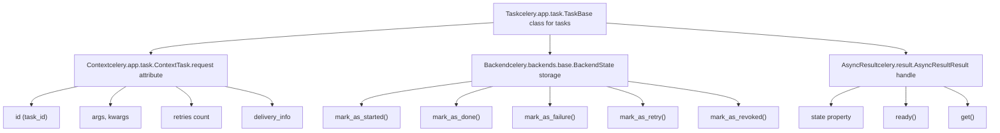
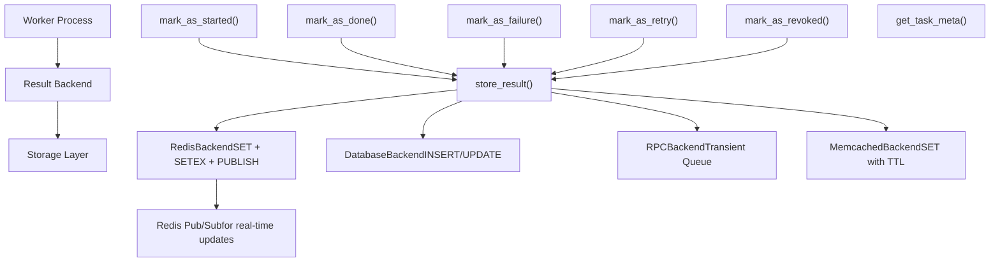
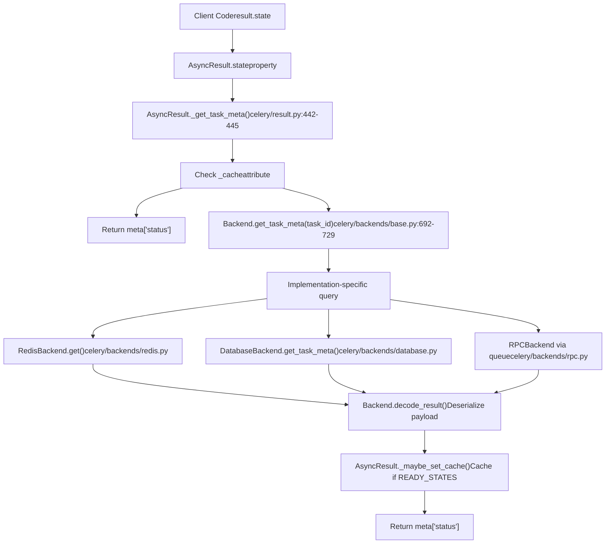
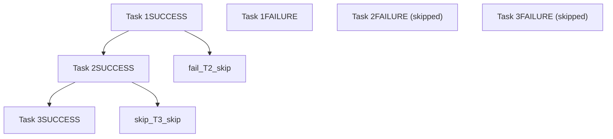

# Task Lifecycle and States

Relevant source files

-   [celery/app/amqp.py](https://github.com/celery/celery/blob/4d068b56/celery/app/amqp.py)
-   [celery/app/base.py](https://github.com/celery/celery/blob/4d068b56/celery/app/base.py)
-   [celery/app/defaults.py](https://github.com/celery/celery/blob/4d068b56/celery/app/defaults.py)
-   [celery/app/task.py](https://github.com/celery/celery/blob/4d068b56/celery/app/task.py)
-   [celery/canvas.py](https://github.com/celery/celery/blob/4d068b56/celery/canvas.py)
-   [celery/utils/\_\_init\_\_.py](https://github.com/celery/celery/blob/4d068b56/celery/utils/__init__.py)
-   [docs/faq.rst](https://github.com/celery/celery/blob/4d068b56/docs/faq.rst)
-   [docs/getting-started/first-steps-with-celery.rst](https://github.com/celery/celery/blob/4d068b56/docs/getting-started/first-steps-with-celery.rst)
-   [docs/getting-started/next-steps.rst](https://github.com/celery/celery/blob/4d068b56/docs/getting-started/next-steps.rst)
-   [docs/userguide/calling.rst](https://github.com/celery/celery/blob/4d068b56/docs/userguide/calling.rst)
-   [docs/userguide/canvas.rst](https://github.com/celery/celery/blob/4d068b56/docs/userguide/canvas.rst)
-   [docs/userguide/monitoring.rst](https://github.com/celery/celery/blob/4d068b56/docs/userguide/monitoring.rst)
-   [docs/userguide/periodic-tasks.rst](https://github.com/celery/celery/blob/4d068b56/docs/userguide/periodic-tasks.rst)
-   [docs/userguide/routing.rst](https://github.com/celery/celery/blob/4d068b56/docs/userguide/routing.rst)
-   [docs/userguide/tasks.rst](https://github.com/celery/celery/blob/4d068b56/docs/userguide/tasks.rst)
-   [docs/userguide/workers.rst](https://github.com/celery/celery/blob/4d068b56/docs/userguide/workers.rst)
-   [t/integration/conftest.py](https://github.com/celery/celery/blob/4d068b56/t/integration/conftest.py)
-   [t/integration/tasks.py](https://github.com/celery/celery/blob/4d068b56/t/integration/tasks.py)
-   [t/integration/test\_canvas.py](https://github.com/celery/celery/blob/4d068b56/t/integration/test_canvas.py)
-   [t/integration/test\_quorum\_queue\_qos\_cluster\_simulation.py](https://github.com/celery/celery/blob/4d068b56/t/integration/test_quorum_queue_qos_cluster_simulation.py)
-   [t/integration/test\_security.py](https://github.com/celery/celery/blob/4d068b56/t/integration/test_security.py)
-   [t/integration/test\_tasks.py](https://github.com/celery/celery/blob/4d068b56/t/integration/test_tasks.py)
-   [t/smoke/tests/test\_canvas.py](https://github.com/celery/celery/blob/4d068b56/t/smoke/tests/test_canvas.py)
-   [t/unit/app/test\_app.py](https://github.com/celery/celery/blob/4d068b56/t/unit/app/test_app.py)
-   [t/unit/tasks/test\_canvas.py](https://github.com/celery/celery/blob/4d068b56/t/unit/tasks/test_canvas.py)
-   [t/unit/tasks/test\_tasks.py](https://github.com/celery/celery/blob/4d068b56/t/unit/tasks/test_tasks.py)

This page documents the lifecycle of a Celery task from creation to completion, including all possible states a task can transition through and how state information is tracked and stored in result backends.

For information about invoking tasks, see [Task Definition and Invocation](/celery/celery/3.1-task-definition-and-invocation). For error handling and retry mechanisms, see [Error Handling and Retry](/celery/celery/3.3-error-handling-and-retry).

---

## Task States Overview

A task in Celery progresses through various states during its lifecycle. The state represents the current status of task execution and is stored in the result backend (if configured).

### State Definitions

Celery defines task states in the `celery.states` module, with the backend classes organizing them into categories:

| State | Category | Description | Stored in Backend |
| --- | --- | --- | --- |
| `PENDING` | Unready | Task is waiting for execution or unknown. Default state for any task ID that has not been registered | No (implicit) |
| `STARTED` | Unready | Task has been started by a worker | Yes (if `task_track_started=True`) |
| `RETRY` | Unready | Task is being retried after a failure | Yes |
| `FAILURE` | Ready, Exception | Task execution failed with an exception | Yes |
| `SUCCESS` | Ready | Task executed successfully | Yes |
| `REVOKED` | Ready, Exception | Task was revoked/cancelled | Yes |

**Sources:** [celery/backends/base.py109-112](https://github.com/celery/celery/blob/4d068b56/celery/backends/base.py#L109-L112) [celery/result.py193-194](https://github.com/celery/celery/blob/4d068b56/celery/result.py#L193-L194) [celery/app/task.py9](https://github.com/celery/celery/blob/4d068b56/celery/app/task.py#L9-L9)

### State Categories

The `Backend` class in `celery.backends.base` organizes states into categories for decision-making:

```
# From celery.backends.base.Backend
READY_STATES = states.READY_STATES        # {SUCCESS, FAILURE, REVOKED}
UNREADY_STATES = states.UNREADY_STATES    # {PENDING, STARTED, RETRY}
EXCEPTION_STATES = states.EXCEPTION_STATES # {FAILURE, RETRY, REVOKED}
```
Additional state groupings:

-   **READY\_STATES**: Task has completed execution (successfully or not) and will not be executed again
-   **UNREADY\_STATES**: Task has not completed execution yet
-   **EXCEPTION\_STATES**: Task state indicates an error condition
-   **PROPAGATE\_STATES**: States that should propagate through chains when a task fails (used in chain error handling)

**Sources:** [celery/backends/base.py109-112](https://github.com/celery/celery/blob/4d068b56/celery/backends/base.py#L109-L112) [celery/result.py193-194](https://github.com/celery/celery/blob/4d068b56/celery/result.py#L193-L194)

---

## Task Lifecycle Flow

### Task Lifecycle Components

Title: **Task Lifecycle Component Architecture**


**Sources:** [celery/app/task.py60-161](https://github.com/celery/celery/blob/4d068b56/celery/app/task.py#L60-L161) [celery/app/task.py164-627](https://github.com/celery/celery/blob/4d068b56/celery/app/task.py#L164-L627) [celery/backends/base.py108-421](https://github.com/celery/celery/blob/4d068b56/celery/backends/base.py#L108-L421) [celery/result.py69-461](https://github.com/celery/celery/blob/4d068b56/celery/result.py#L69-L461)

### Complete Lifecycle State Diagram

> **[Mermaid stateDiagram]**
> *(图表结构无法解析)*

**Sources:** [celery/backends/base.py176-307](https://github.com/celery/celery/blob/4d068b56/celery/backends/base.py#L176-L307) [celery/result.py343-357](https://github.com/celery/celery/blob/4d068b56/celery/result.py#L343-L357) [celery/app/task.py661-695](https://github.com/celery/celery/blob/4d068b56/celery/app/task.py#L661-L695)

### State Transition Details

#### 1\. Task Creation (PENDING)

When a task is invoked via `Task.delay()` or `Task.apply_async()`, it enters the `PENDING` state:

-   `Task.apply_async()` method is called [celery/app/task.py446-613](https://github.com/celery/celery/blob/4d068b56/celery/app/task.py#L446-L613)
-   A unique task ID (UUID) is generated if not provided via `task_id` option
-   The task message is sent via `app.send_task()` to the broker [celery/app/base.py820-959](https://github.com/celery/celery/blob/4d068b56/celery/app/base.py#L820-L959)
-   An `AsyncResult` instance is returned to the caller [celery/result.py88-100](https://github.com/celery/celery/blob/4d068b56/celery/result.py#L88-L100)
-   **No state is written to the backend** - PENDING is implicit for unknown task IDs

The `PENDING` state is returned when `Backend.get_task_meta()` finds no stored state for a task ID.

**Sources:** [celery/app/task.py446-613](https://github.com/celery/celery/blob/4d068b56/celery/app/task.py#L446-L613) [celery/result.py88-100](https://github.com/celery/celery/blob/4d068b56/celery/result.py#L88-L100) [celery/backends/base.py692-729](https://github.com/celery/celery/blob/4d068b56/celery/backends/base.py#L692-L729)

#### 2\. Task Started (STARTED)

When a worker picks up and begins executing a task:

-   Worker's task execution strategy calls `Backend.mark_as_started()` if `Task.track_started` is `True`
-   State metadata includes: task ID, arguments, worker hostname
-   The `Context` object in `Task.request` is populated with execution details [celery/app/task.py60-161](https://github.com/celery/celery/blob/4d068b56/celery/app/task.py#L60-L161)

```
# Backend.mark_as_started() signature at celery/backends/base.py:176-178
def mark_as_started(self, task_id, **meta):
    """Mark a task as started."""
    return self.store_result(task_id, meta, states.STARTED)
```
**Note:** By default, `task_track_started` is `False` for performance. The `Task.track_started` attribute controls this behavior [celery/app/task.py258](https://github.com/celery/celery/blob/4d068b56/celery/app/task.py#L258-L258)

**When to enable:**

-   Long-running tasks where knowing "started" vs "pending" is important
-   Progress tracking UIs
-   Debugging task execution issues

**Sources:** [celery/backends/base.py176-178](https://github.com/celery/celery/blob/4d068b56/celery/backends/base.py#L176-L178) [celery/app/task.py258](https://github.com/celery/celery/blob/4d068b56/celery/app/task.py#L258-L258) [celery/app/task.py60-161](https://github.com/celery/celery/blob/4d068b56/celery/app/task.py#L60-L161)

#### 3\. Task Success (SUCCESS)

When a task completes without raising an exception:

-   The `Task.run()` method returns normally
-   Worker calls `Backend.mark_as_done()` with the result value [celery/backends/base.py180-186](https://github.com/celery/celery/blob/4d068b56/celery/backends/base.py#L180-L186)
-   State metadata includes: result value, `date_done` timestamp, `children` list (for canvas workflows)
-   The message is acknowledged to the broker (timing depends on `Task.acks_late` setting [celery/app/task.py269](https://github.com/celery/celery/blob/4d068b56/celery/app/task.py#L269-L269))

```
# Backend.mark_as_done() at celery/backends/base.py:180-186
def mark_as_done(self, task_id, result,
                 request=None, store_result=True, state=states.SUCCESS):
    """Mark task as successfully executed."""
    if (store_result and not _is_request_ignore_result(request)):
        self.store_result(task_id, result, state, request=request)
    if request and request.chord:
        self.on_chord_part_return(request, state, result)
```
The `store_result()` method [celery/backends/base.py612-644](https://github.com/celery/celery/blob/4d068b56/celery/backends/base.py#L612-L644) handles the actual persistence to the backend.

**Sources:** [celery/backends/base.py180-186](https://github.com/celery/celery/blob/4d068b56/celery/backends/base.py#L180-L186) [celery/backends/base.py612-644](https://github.com/celery/celery/blob/4d068b56/celery/backends/base.py#L612-L644) [celery/app/task.py269](https://github.com/celery/celery/blob/4d068b56/celery/app/task.py#L269-L269)

#### 4\. Task Failure (FAILURE)

When a task raises an exception that is not retried:

-   Worker catches the exception and calls `Backend.mark_as_failure()` [celery/backends/base.py188-242](https://github.com/celery/celery/blob/4d068b56/celery/backends/base.py#L188-L242)
-   State metadata includes: serialized exception, traceback string, `date_done` timestamp
-   Error callbacks (errbacks) in `Context.errbacks` are executed if defined [celery/app/task.py72](https://github.com/celery/celery/blob/4d068b56/celery/app/task.py#L72-L72)
-   For chain tasks, the exception propagates to subsequent tasks via `Context.chain` [celery/app/task.py68](https://github.com/celery/celery/blob/4d068b56/celery/app/task.py#L68-L68)

```
# Backend.mark_as_failure() at celery/backends/base.py:188-242
def mark_as_failure(self, task_id, exc,
                    traceback=None, request=None,
                    store_result=True, call_errbacks=True,
                    state=states.FAILURE):
    """Mark task as executed with failure."""
    if store_result:
        self.store_result(task_id, exc, state,
                          traceback=traceback, request=request)
    if request:
        if request.chord:
            self.on_chord_part_return(request, state, exc)
        # Chain propagation logic at lines 206-239
        # Errback execution at lines 241-242
        if call_errbacks and request.errbacks:
            self._call_task_errbacks(request, exc, traceback)
```
The `Backend.prepare_exception()` method [celery/backends/base.py424-432](https://github.com/celery/celery/blob/4d068b56/celery/backends/base.py#L424-L432) serializes the exception for storage.

**Sources:** [celery/backends/base.py188-242](https://github.com/celery/celery/blob/4d068b56/celery/backends/base.py#L188-L242) [celery/backends/base.py424-432](https://github.com/celery/celery/blob/4d068b56/celery/backends/base.py#L424-L432) [celery/app/task.py68](https://github.com/celery/celery/blob/4d068b56/celery/app/task.py#L68-L68) [celery/app/task.py72](https://github.com/celery/celery/blob/4d068b56/celery/app/task.py#L72-L72)

#### 5\. Task Retry (RETRY)

When a task calls `Task.retry()` [celery/app/task.py661-695](https://github.com/celery/celery/blob/4d068b56/celery/app/task.py#L661-L695) or auto-retry is triggered:

-   `Task.retry()` raises a `Retry` exception [celery/exceptions.py](https://github.com/celery/celery/blob/4d068b56/celery/exceptions.py)
-   Worker catches `Retry` and calls `Backend.mark_as_retry()` [celery/backends/base.py299-307](https://github.com/celery/celery/blob/4d068b56/celery/backends/base.py#L299-L307)
-   State metadata includes: exception, traceback, `Context.retries` count [celery/app/task.py88](https://github.com/celery/celery/blob/4d068b56/celery/app/task.py#L88-L88)
-   A new task message is published with `countdown` or `eta` option
-   The original message is acknowledged

```
# Backend.mark_as_retry() at celery/backends/base.py:299-307
def mark_as_retry(self, task_id, exc, traceback=None,
                  request=None, store_result=True, state=states.RETRY):
    """Mark task as being retried.

    Note:
        Stores the current exception (if any).
    """
    return self.store_result(task_id, exc, state,
                             traceback=traceback, request=request)
```
The `Task.max_retries` attribute [celery/app/task.py199](https://github.com/celery/celery/blob/4d068b56/celery/app/task.py#L199-L199) limits the number of retry attempts.

**Sources:** [celery/backends/base.py299-307](https://github.com/celery/celery/blob/4d068b56/celery/backends/base.py#L299-L307) [celery/app/task.py661-695](https://github.com/celery/celery/blob/4d068b56/celery/app/task.py#L661-L695) [celery/app/task.py88](https://github.com/celery/celery/blob/4d068b56/celery/app/task.py#L88-L88) [celery/app/task.py199](https://github.com/celery/celery/blob/4d068b56/celery/app/task.py#L199-L199)

#### 6\. Task Revoked (REVOKED)

When a task is cancelled via `AsyncResult.revoke()` [celery/result.py144-164](https://github.com/celery/celery/blob/4d068b56/celery/result.py#L144-L164) or control commands:

-   Revoke request is broadcast to all workers via `app.control.revoke()` [celery/result.py162-164](https://github.com/celery/celery/blob/4d068b56/celery/result.py#L162-L164)
-   Workers mark the task with `Backend.mark_as_revoked()` [celery/backends/base.py290-297](https://github.com/celery/celery/blob/4d068b56/celery/backends/base.py#L290-L297)
-   State metadata includes: `TaskRevokedError` with reason string
-   Worker behavior depends on options:
    -   `terminate=True`: Send signal to terminate running task process
    -   Default: Skip task execution if not started yet

```
# Backend.mark_as_revoked() at celery/backends/base.py:290-297
def mark_as_revoked(self, task_id, reason='',
                    request=None, store_result=True, state=states.REVOKED):
    exc = TaskRevokedError(reason)
    if store_result:
        self.store_result(task_id, exc, state,
                          traceback=None, request=request)
    if request and request.chord:
        self.on_chord_part_return(request, state, exc)
```
**Sources:** [celery/backends/base.py290-297](https://github.com/celery/celery/blob/4d068b56/celery/backends/base.py#L290-L297) [celery/result.py144-164](https://github.com/celery/celery/blob/4d068b56/celery/result.py#L144-L164)

---

## Backend State Storage

### Storage Architecture


**Sources:** [celery/backends/base.py612-644](https://github.com/celery/celery/blob/4d068b56/celery/backends/base.py#L612-L644) [celery/backends/redis.py440-453](https://github.com/celery/celery/blob/4d068b56/celery/backends/redis.py#L440-L453)

### Result Metadata Structure

When a task state is stored via `Backend.store_result()`, the backend constructs metadata using `Backend._get_result_meta()`:

```
# Core metadata structure at celery/backends/base.py:558-607
meta = {
    'status': state,                    # State constant (SUCCESS, FAILURE, etc.)
    'result': result,                   # Return value or exception object
    'traceback': traceback,             # Traceback string (if exception)
    'children': [...],                  # Child AsyncResult objects (for canvas)
    'date_done': date_done,             # ISO 8601 timestamp string
    'task_id': task_id,                 # Task UUID
}

# Extended metadata if result_extended=True in configuration:
meta.update({
    'name': request.task,               # Task name from Context
    'args': request.args,               # Positional arguments from Context
    'kwargs': request.kwargs,           # Keyword arguments from Context
    'worker': request.hostname,         # Worker hostname from Context
    'retries': request.retries,         # Retry count from Context
    'queue': request.delivery_info.get('routing_key'),  # Queue name from Context
})
```
The `Context` object (task request context) provides execution metadata [celery/app/task.py60-161](https://github.com/celery/celery/blob/4d068b56/celery/app/task.py#L60-L161)

**Sources:** [celery/backends/base.py558-607](https://github.com/celery/celery/blob/4d068b56/celery/backends/base.py#L558-L607) [celery/app/task.py60-161](https://github.com/celery/celery/blob/4d068b56/celery/app/task.py#L60-L161)

### Key Naming Convention

Backends use consistent key naming via `Backend.get_key_for_task()`:

| Backend Type | Key Pattern | Example |
| --- | --- | --- |
| Redis/Memcached | `celery-task-meta-{task_id}` | `celery-task-meta-abc123...` |
| Redis (with prefix) | `{key_prefix}celery-task-meta-{task_id}` | `myapp:celery-task-meta-abc123...` |
| Database | Table row with `task_id` as primary key | `celery_taskmeta.task_id = 'abc123...'` |
| RPC | AMQP reply queue | Task-specific temporary queue |

The `Backend.get_key_for_task()` method [celery/backends/base.py911-914](https://github.com/celery/celery/blob/4d068b56/celery/backends/base.py#L911-L914) generates keys, and `KeyValueStoreBackend` subclasses use this consistently.

**Sources:** [celery/backends/base.py911-914](https://github.com/celery/celery/blob/4d068b56/celery/backends/base.py#L911-L914) [celery/backends/redis.py367-370](https://github.com/celery/celery/blob/4d068b56/celery/backends/redis.py#L367-L370)

### State Persistence and Expiry

Task states can be configured to expire automatically:

-   **result\_expires**: Default expiration time (timedelta or seconds)
-   **autoexpire backends**: Redis, Memcached automatically remove expired keys
-   **non-autoexpire backends**: Requires periodic cleanup task `celery.backend_cleanup`

```
# Configuration example
app.conf.result_expires = 3600  # 1 hour in seconds

# Or using timedelta
from datetime import timedelta
app.conf.result_expires = timedelta(hours=1)
```
**Sources:** [celery/backends/base.py535-542](https://github.com/celery/celery/blob/4d068b56/celery/backends/base.py#L535-L542) [celery/app/builtins.py13-23](https://github.com/celery/celery/blob/4d068b56/celery/app/builtins.py#L13-L23)

---

## Querying Task State

### Using AsyncResult

The `AsyncResult` class [celery/result.py69-461](https://github.com/celery/celery/blob/4d068b56/celery/result.py#L69-L461) provides methods to query task state:

```
# Create result object
from celery.result import AsyncResult
result = AsyncResult(task_id, app=app)

# Query state via property (calls Backend.get_task_meta())
result.state           # Returns: 'PENDING', 'STARTED', 'SUCCESS', etc.
result.status          # Alias for state (backwards compatibility)

# Check readiness (line 343-357)
result.ready()         # True if state in Backend.READY_STATES
result.successful()    # True if state == states.SUCCESS
result.failed()        # True if state == states.FAILURE

# Get result (blocks until ready, line 190-261)
result.get(timeout=10, propagate=True)  # Returns result or raises exception
```
The `AsyncResult.state` property calls `AsyncResult._get_task_meta()` which queries `Backend.get_task_meta()` [celery/result.py442-445](https://github.com/celery/celery/blob/4d068b56/celery/result.py#L442-L445)

**Sources:** [celery/result.py69-461](https://github.com/celery/celery/blob/4d068b56/celery/result.py#L69-L461) [celery/result.py442-445](https://github.com/celery/celery/blob/4d068b56/celery/result.py#L442-L445) [celery/result.py190-261](https://github.com/celery/celery/blob/4d068b56/celery/result.py#L190-L261) [celery/result.py343-357](https://github.com/celery/celery/blob/4d068b56/celery/result.py#L343-L357)

### State Property Implementation

Title: **AsyncResult State Query Flow**


**Sources:** [celery/result.py442-445](https://github.com/celery/celery/blob/4d068b56/celery/result.py#L442-L445) [celery/backends/base.py692-729](https://github.com/celery/celery/blob/4d068b56/celery/backends/base.py#L692-L729) [celery/result.py433-440](https://github.com/celery/celery/blob/4d068b56/celery/result.py#L433-L440)

### State Caching

The backend implements an LRU cache in `Backend.__init__()` for performance:

```
# Backend initialization at celery/backends/base.py:147-148
cmax = max_cached_results or conf.result_cache_max
self._cache = _nulldict() if cmax == -1 else LRUCache(limit=cmax)
```
Caching behavior:

-   `AsyncResult` caches state in `_cache` attribute when state is in `READY_STATES` [celery/result.py433-440](https://github.com/celery/celery/blob/4d068b56/celery/result.py#L433-L440)
-   `Backend.get_task_meta()` caches results for tasks in SUCCESS state [celery/backends/base.py727-729](https://github.com/celery/celery/blob/4d068b56/celery/backends/base.py#L727-L729)
-   Cache size controlled by `result_cache_max` configuration setting
-   Setting `result_cache_max=-1` disables caching entirely
-   Failed/retry states are not backend-cached to allow polling for status changes

**Sources:** [celery/backends/base.py147-148](https://github.com/celery/celery/blob/4d068b56/celery/backends/base.py#L147-L148) [celery/backends/base.py727-729](https://github.com/celery/celery/blob/4d068b56/celery/backends/base.py#L727-L729) [celery/result.py433-440](https://github.com/celery/celery/blob/4d068b56/celery/result.py#L433-L440)

---

## State Transitions in Canvas Workflows

### Chain State Propagation

When tasks are chained together, exception states propagate through the chain:


When a task in a chain fails:

1.  The backend's `mark_as_failure()` method processes chain elements
2.  Each subsequent task in the chain is marked as FAILURE (if `store_result=True`)
3.  The exception is propagated without executing subsequent tasks

**Sources:** [celery/backends/base.py206-239](https://github.com/celery/celery/blob/4d068b56/celery/backends/base.py#L206-L239)

### Chord State Coordination

Chords require special state tracking to synchronize header completion:

> **[Mermaid sequence]**
> *(图表结构无法解析)*

The `on_chord_part_return()` method is called when each header task completes:

-   Redis backend: Increments counter in sorted set
-   Other backends: Use fallback `chord_unlock` polling task

**Sources:** [celery/backends/base.py185-186](https://github.com/celery/celery/blob/4d068b56/celery/backends/base.py#L185-L186) [celery/backends/base.py778-779](https://github.com/celery/celery/blob/4d068b56/celery/backends/base.py#L778-L779) [celery/backends/redis.py468-523](https://github.com/celery/celery/blob/4d068b56/celery/backends/redis.py#L468-L523) [celery/app/builtins.py37-98](https://github.com/celery/celery/blob/4d068b56/celery/app/builtins.py#L37-L98)

### Group State Tracking

Group results aggregate states of multiple parallel tasks:

```
# GroupResult state methods
group_result.ready()        # True if all tasks ready
group_result.successful()   # True if all tasks successful
group_result.failed()       # True if any task failed
group_result.waiting()      # True if any task not ready
```
**Sources:** [celery/result.py616-654](https://github.com/celery/celery/blob/4d068b56/celery/result.py#L616-L654)

---

## Special State Behaviors

### PENDING State

`PENDING` is unique as the only state not explicitly stored in the backend:

-   It's the default state for any unknown task ID
-   `Backend.get_task_meta()` returns `{'status': 'PENDING', 'result': None}` for unknown IDs [celery/backends/base.py692-729](https://github.com/celery/celery/blob/4d068b56/celery/backends/base.py#L692-L729)
-   This allows querying arbitrary task IDs without errors
-   **Limitation**: Cannot distinguish between "task not started" and "task ID doesn't exist"

The default metadata structure for PENDING tasks:

```
# At celery/backends/base.py:692-729
return {
    'status': states.PENDING,
    'result': None,
    'traceback': None,
    'children': None,
    'date_done': None,
    'task_id': task_id,
}
```
**Sources:** [celery/backends/base.py692-729](https://github.com/celery/celery/blob/4d068b56/celery/backends/base.py#L692-L729)

### STARTED State Tracking

The `STARTED` state is optional and disabled by default via `Task.track_started`:

```
# Task attribute at celery/app/task.py:258
track_started = None  # Defaults to app.conf.task_track_started

# Enable globally in configuration
app.conf.task_track_started = True

# Or enable per-task
@app.task(track_started=True)
def my_task():
    pass
```
**Rationale for default disabled:**

-   Requires extra `Backend.mark_as_started()` call for every task
-   Increases backend write load significantly at scale
-   Most applications only care about PENDING vs READY states

**When to enable:**

-   Long-running tasks where progress visibility is important
-   UI/monitoring dashboards showing real-time task execution
-   Debugging to distinguish stuck vs pending tasks

**Sources:** [celery/app/task.py258](https://github.com/celery/celery/blob/4d068b56/celery/app/task.py#L258-L258) [celery/app/defaults.py310](https://github.com/celery/celery/blob/4d068b56/celery/app/defaults.py#L310-L310)

### State Storage with ignore\_result

Tasks can disable result storage via `Task.ignore_result`:

```
# Task attribute at celery/app/task.py:213
@app.task(ignore_result=True)
def fire_and_forget():
    # No state stored in backend
    pass
```
Behavior with `ignore_result=True`:

-   `Backend.mark_as_done()` skips storing SUCCESS state via `_is_request_ignore_result()` check [celery/backends/base.py102-105](https://github.com/celery/celery/blob/4d068b56/celery/backends/base.py#L102-L105)
-   FAILURE state **IS** stored if `Task.store_errors_even_if_ignored=True` [celery/app/task.py230](https://github.com/celery/celery/blob/4d068b56/celery/app/task.py#L230-L230)
-   This allows error tracking without storing all successful results

Configuration for storing errors:

```
# Global setting at celery/app/defaults.py:309
app.conf.task_store_errors_even_if_ignored = True
```
**Sources:** [celery/backends/base.py102-105](https://github.com/celery/celery/blob/4d068b56/celery/backends/base.py#L102-L105) [celery/app/task.py213](https://github.com/celery/celery/blob/4d068b56/celery/app/task.py#L213-L213) [celery/app/task.py230](https://github.com/celery/celery/blob/4d068b56/celery/app/task.py#L230-L230) [celery/app/defaults.py309](https://github.com/celery/celery/blob/4d068b56/celery/app/defaults.py#L309-L309)

### Result Backend Retry Logic

State storage operations can be automatically retried via `Backend.ensure()` wrapper:

```
# Configuration at celery/app/defaults.py:224-228
app.conf.result_backend_always_retry = False  # Default disabled
app.conf.result_backend_max_retries = float("inf")  # Unlimited by default
app.conf.result_backend_base_sleep_between_retries_ms = 10
app.conf.result_backend_max_sleep_between_retries_ms = 10000
```
The `Backend.store_result()` method [celery/backends/base.py612-644](https://github.com/celery/celery/blob/4d068b56/celery/backends/base.py#L612-L644) implements retry logic:

1.  Attempt to store state via implementation-specific method
2.  If backend raises recoverable exception, retry with exponential backoff [celery/utils/time.py](https://github.com/celery/celery/blob/4d068b56/celery/utils/time.py#LNaN-LNaN)
3.  Continue until success or `max_retries` reached
4.  Use `Backend.ensure()` method for retry wrapper [celery/backends/base.py157-161](https://github.com/celery/celery/blob/4d068b56/celery/backends/base.py#L157-L161)

**Sources:** [celery/backends/base.py612-644](https://github.com/celery/celery/blob/4d068b56/celery/backends/base.py#L612-L644) [celery/backends/base.py157-161](https://github.com/celery/celery/blob/4d068b56/celery/backends/base.py#L157-L161) [celery/app/defaults.py224-228](https://github.com/celery/celery/blob/4d068b56/celery/app/defaults.py#L224-L228)

---

## State Query Performance Considerations

### Native Join Support

Backend implementations vary in how they wait for results:

Title: **Backend Native Join Capabilities**

| Backend | supports\_native\_join | Mechanism | File Reference |
| --- | --- | --- | --- |
| RedisBackend | `True` | Redis pub/sub on task key | [celery/backends/redis.py206-207](https://github.com/celery/celery/blob/4d068b56/celery/backends/redis.py#L206-L207) |
| RPCBackend | `True` | AMQP reply-to queue | [celery/backends/rpc.py](https://github.com/celery/celery/blob/4d068b56/celery/backends/rpc.py) |
| DatabaseBackend | `False` | Polling via `get_task_meta()` | [celery/backends/database.py](https://github.com/celery/celery/blob/4d068b56/celery/backends/database.py) |
| Others | `False` | Polling via `get_task_meta()` | Various |

Usage in client code:

```
# Check backend capability via AsyncResult property
if result.supports_native_join:
    # Efficient: Uses pub/sub or AMQP push notifications
    result.get()  # No polling overhead
else:
    # Polling: Configure reasonable interval
    result.get(interval=0.5)  # Poll every 0.5 seconds
```
The `AsyncResult.get()` method [celery/result.py190-261](https://github.com/celery/celery/blob/4d068b56/celery/result.py#L190-L261) uses `Backend.wait_for_pending()` which leverages native join when available.

**Sources:** [celery/backends/base.py120-121](https://github.com/celery/celery/blob/4d068b56/celery/backends/base.py#L120-L121) [celery/backends/redis.py206-207](https://github.com/celery/celery/blob/4d068b56/celery/backends/redis.py#L206-L207) [celery/result.py190-261](https://github.com/celery/celery/blob/4d068b56/celery/result.py#L190-L261) [celery/result.py426-428](https://github.com/celery/celery/blob/4d068b56/celery/result.py#L426-L428)

### Caching Strategy

The backend's LRU cache reduces database/Redis queries:

```
# First call: Queries backend
state1 = result.state  # Backend query

# Second call: Uses cache (if SUCCESS)
state2 = result.state  # From cache

# Reload from backend explicitly
result.reload_task_result(task_id)
```
**Sources:** [celery/backends/base.py731-733](https://github.com/celery/celery/blob/4d068b56/celery/backends/base.py#L731-L733) [celery/result.py442-445](https://github.com/celery/celery/blob/4d068b56/celery/result.py#L442-L445)

---

## State-Related Exceptions

Several exceptions in `celery.exceptions` relate to task states:

| Exception | When Raised | Related State | File Reference |
| --- | --- | --- | --- |
| `TimeoutError` | `AsyncResult.get(timeout=...)` expires | Any UNREADY\_STATES | [celery/result.py80](https://github.com/celery/celery/blob/4d068b56/celery/result.py#L80-L80) |
| `TaskRevokedError` | Task was cancelled | REVOKED | [celery/backends/base.py292](https://github.com/celery/celery/blob/4d068b56/celery/backends/base.py#L292-L292) |
| `Retry` | Task.retry() called (internal signal) | RETRY | [celery/app/task.py661-695](https://github.com/celery/celery/blob/4d068b56/celery/app/task.py#L661-L695) |
| `MaxRetriesExceededError` | Retry limit exceeded in Task.retry() | FAILURE | [celery/app/task.py12](https://github.com/celery/celery/blob/4d068b56/celery/app/task.py#L12-L12) |

Exception handling in `AsyncResult.get()`:

-   Exceptions stored in backend are reconstructed via `Backend.exception_to_python()` [celery/backends/base.py434-503](https://github.com/celery/celery/blob/4d068b56/celery/backends/base.py#L434-L503)
-   `propagate=True` (default) re-raises the stored exception
-   `propagate=False` returns the exception object without raising

**Sources:** [celery/exceptions.py](https://github.com/celery/celery/blob/4d068b56/celery/exceptions.py) [celery/backends/base.py290-297](https://github.com/celery/celery/blob/4d068b56/celery/backends/base.py#L290-L297) [celery/result.py190-261](https://github.com/celery/celery/blob/4d068b56/celery/result.py#L190-L261) [celery/backends/base.py434-503](https://github.com/celery/celery/blob/4d068b56/celery/backends/base.py#L434-L503)

---

## Summary

The task lifecycle in Celery follows a well-defined state machine:

1.  **PENDING** (implicit) → Task created, not yet started
2.  **STARTED** (optional) → Worker begins execution
3.  **SUCCESS** / **FAILURE** / **RETRY** / **REVOKED** → Terminal or transitional states
4.  **State Storage** → Backend persists metadata with expiry
5.  **State Queries** → AsyncResult provides API with caching
6.  **Workflow Coordination** → Special handling for chains, chords, groups

Understanding these states and transitions is essential for:

-   Monitoring task progress
-   Debugging failures
-   Implementing retry logic
-   Coordinating complex workflows
-   Optimizing backend performance
