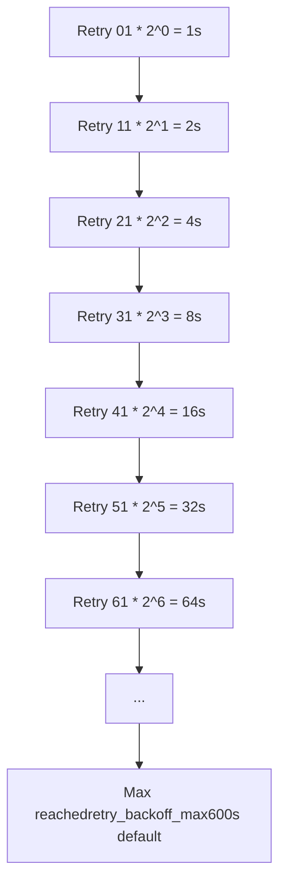
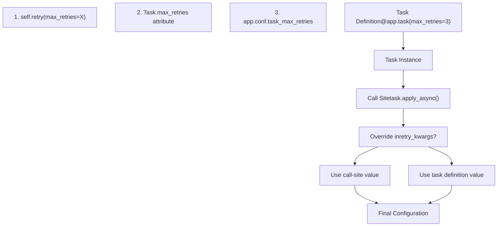

# Error Handling and Retry

Relevant source files

-   [celery/app/amqp.py](https://github.com/celery/celery/blob/4d068b56/celery/app/amqp.py)
-   [celery/app/base.py](https://github.com/celery/celery/blob/4d068b56/celery/app/base.py)
-   [celery/app/defaults.py](https://github.com/celery/celery/blob/4d068b56/celery/app/defaults.py)
-   [celery/app/task.py](https://github.com/celery/celery/blob/4d068b56/celery/app/task.py)
-   [celery/canvas.py](https://github.com/celery/celery/blob/4d068b56/celery/canvas.py)
-   [celery/utils/\_\_init\_\_.py](https://github.com/celery/celery/blob/4d068b56/celery/utils/__init__.py)
-   [docs/faq.rst](https://github.com/celery/celery/blob/4d068b56/docs/faq.rst)
-   [docs/getting-started/first-steps-with-celery.rst](https://github.com/celery/celery/blob/4d068b56/docs/getting-started/first-steps-with-celery.rst)
-   [docs/getting-started/next-steps.rst](https://github.com/celery/celery/blob/4d068b56/docs/getting-started/next-steps.rst)
-   [docs/userguide/calling.rst](https://github.com/celery/celery/blob/4d068b56/docs/userguide/calling.rst)
-   [docs/userguide/canvas.rst](https://github.com/celery/celery/blob/4d068b56/docs/userguide/canvas.rst)
-   [docs/userguide/monitoring.rst](https://github.com/celery/celery/blob/4d068b56/docs/userguide/monitoring.rst)
-   [docs/userguide/periodic-tasks.rst](https://github.com/celery/celery/blob/4d068b56/docs/userguide/periodic-tasks.rst)
-   [docs/userguide/routing.rst](https://github.com/celery/celery/blob/4d068b56/docs/userguide/routing.rst)
-   [docs/userguide/tasks.rst](https://github.com/celery/celery/blob/4d068b56/docs/userguide/tasks.rst)
-   [docs/userguide/workers.rst](https://github.com/celery/celery/blob/4d068b56/docs/userguide/workers.rst)
-   [t/integration/conftest.py](https://github.com/celery/celery/blob/4d068b56/t/integration/conftest.py)
-   [t/integration/tasks.py](https://github.com/celery/celery/blob/4d068b56/t/integration/tasks.py)
-   [t/integration/test\_canvas.py](https://github.com/celery/celery/blob/4d068b56/t/integration/test_canvas.py)
-   [t/integration/test\_quorum\_queue\_qos\_cluster\_simulation.py](https://github.com/celery/celery/blob/4d068b56/t/integration/test_quorum_queue_qos_cluster_simulation.py)
-   [t/integration/test\_security.py](https://github.com/celery/celery/blob/4d068b56/t/integration/test_security.py)
-   [t/integration/test\_tasks.py](https://github.com/celery/celery/blob/4d068b56/t/integration/test_tasks.py)
-   [t/smoke/tests/test\_canvas.py](https://github.com/celery/celery/blob/4d068b56/t/smoke/tests/test_canvas.py)
-   [t/unit/app/test\_app.py](https://github.com/celery/celery/blob/4d068b56/t/unit/app/test_app.py)
-   [t/unit/tasks/test\_canvas.py](https://github.com/celery/celery/blob/4d068b56/t/unit/tasks/test_canvas.py)
-   [t/unit/tasks/test\_tasks.py](https://github.com/celery/celery/blob/4d068b56/t/unit/tasks/test_tasks.py)

This page covers Celery's error handling and retry mechanisms for tasks. When tasks fail due to exceptions, Celery provides both manual and automatic retry capabilities with configurable backoff strategies. For information about task states during execution, see page 3.2. For time-based execution constraints, see page 3.4.

## Manual Retry

Tasks can explicitly retry themselves by calling the `self.retry()` method. This requires the task to be bound using `bind=True` in the `@app.task` decorator.

### Basic Retry Flow

Task.retry() Method Execution Flow

**Sources:** [celery/app/task.py661-772](https://github.com/celery/celery/blob/4d068b56/celery/app/task.py#L661-L772) [celery/app/task.py88](https://github.com/celery/celery/blob/4d068b56/celery/app/task.py#L88-L88) [docs/userguide/tasks.rst574-640](https://github.com/celery/celery/blob/4d068b56/docs/userguide/tasks.rst#L574-L640)

### Task.retry() Method

The `Task.retry()` method at [celery/app/task.py661-772](https://github.com/celery/celery/blob/4d068b56/celery/app/task.py#L661-L772) is the core mechanism for manual retry. It creates a new task signature using `signature_from_request()` and republishes the task message with an incremented retry count.

Task.retry() Parameters

| Parameter | Type | Description |
| --- | --- | --- |
| `args` | `Tuple` | Override positional arguments for retry |
| `kwargs` | `Dict` | Override keyword arguments for retry |
| `exc` | `Exception` | Exception to report when max retries exceeded |
| `throw` | `bool` | Whether to raise `Retry` exception (default: `True`) |
| `eta` | `datetime` | Absolute time to execute retry |
| `countdown` | `float` | Seconds to delay before retry |
| `max_retries` | `int` | Override default `max_retries` for this execution |

**Key Implementation Steps:**

1.  **Retrieve Retry Count**: Access `self.request.retries` from the `Context` object [celery/app/task.py88](https://github.com/celery/celery/blob/4d068b56/celery/app/task.py#L88-L88)
2.  **Increment Counter**: `retries = self.request.retries + 1`
3.  **Apply Default Delay**: If no `eta` or `countdown`, use `self.default_retry_delay` (default: 180 seconds) [celery/app/task.py203](https://github.com/celery/celery/blob/4d068b56/celery/app/task.py#L203-L203)
4.  **Check Max Retries**: Compare `retries` against `self.max_retries` (default: 3) [celery/app/task.py199](https://github.com/celery/celery/blob/4d068b56/celery/app/task.py#L199-L199)
5.  **Recreate Signature**: Call `self.signature_from_request(args, kwargs, countdown, eta, ...)` [celery/app/task.py636-658](https://github.com/celery/celery/blob/4d068b56/celery/app/task.py#L636-L658)
6.  **Republish Task**: Execute `S.apply_async()` where `S` is the signature
7.  **Raise Exception**: Raise `Retry(exc=exc, when=eta, sig=S)` to signal worker [celery/exceptions.py12](https://github.com/celery/celery/blob/4d068b56/celery/exceptions.py#L12-L12)

If `retries >= max_retries`, either re-raises the original `exc` or raises `MaxRetriesExceededError`.

**Sources:** [celery/app/task.py661-772](https://github.com/celery/celery/blob/4d068b56/celery/app/task.py#L661-L772) [celery/app/task.py199](https://github.com/celery/celery/blob/4d068b56/celery/app/task.py#L199-L199) [celery/app/task.py203](https://github.com/celery/celery/blob/4d068b56/celery/app/task.py#L203-L203) [celery/app/task.py636-658](https://github.com/celery/celery/blob/4d068b56/celery/app/task.py#L636-L658) [celery/exceptions.py12](https://github.com/celery/celery/blob/4d068b56/celery/exceptions.py#L12-L12)

### Example: Manual Retry

```
# From documentation examples
@app.task(bind=True, default_retry_delay=30 * 60)
def send_twitter_status(self, oauth, tweet):
    try:
        twitter = Twitter(oauth)
        twitter.update_status(tweet)
    except (Twitter.FailWhaleError, Twitter.LoginError) as exc:
        # Retry in 5 minutes instead of default 30 minutes
        raise self.retry(exc=exc, countdown=60 * 5)
```
**Important**: The `retry()` method raises a `Retry` exception to signal the worker. Code after `self.retry()` is not executed unless `throw=False` is specified.

**Sources:** [docs/userguide/tasks.rst590-640](https://github.com/celery/celery/blob/4d068b56/docs/userguide/tasks.rst#L590-L640)

## Automatic Retry

Celery supports automatic retry for specified exception types via the `add_autoretry_behaviour()` function [celery/app/autoretry.py](https://github.com/celery/celery/blob/4d068b56/celery/app/autoretry.py) called during task registration [celery/app/base.py604](https://github.com/celery/celery/blob/4d068b56/celery/app/base.py#L604-L604)

### Autoretry Configuration Attributes

Autoretry Task Attributes and Processing

```mermaid
flowchart TD
    app_task["@app.task decoratorwith autoretry options"]
    task_from_fun["_task_from_fun()celery/app/base.py:564-607"]
    add_autoretry["add_autoretry_behaviour()celery/app/autoretry.py"]
    check_autoretry_for["Check autoretry_for attribute"]
    wrap_run["Wrap Task.run() method"]
    wrapped_run["Wrapped run catches exceptions"]
    exc_raised["Exception raised in task"]
    check_dont_autoretry["Check dont_autoretry_for"]
    excluded["In dont_autoretry_for?"]
    propagate["Propagate exception"]
    check_in_autoretry["In autoretry_for?"]
    calc_backoff["Calculate backoff countdown"]
    apply_jitter["Apply jitter if enabled"]
    call_retry["Call self.retry() with countdown"]
    retry_flow["Standard retry flow"]
    task_failure["Task enters FAILURE state"]
    task_retry["Task enters RETRY state"]

    app --> task_task_from_fun
    task --> from_fun_add_autoretry
    add --> autoretry_check_autoretry_for
    check --> autoretry_for_wrap_run
    wrap --> run_wrapped_run
    wrapped --> run_exc_raised
    exc --> raised_check_dont_autoretry
    check --> dont_autoretry_excluded
    excluded --> propagate
    excluded --> check_in_autoretry
    check --> in_autoretry_calc_backoff
    check --> in_autoretry_propagate
    calc --> backoff_apply_jitter
    apply --> jitter_call_retry
    call --> retry_retry_flow
    propagate --> task_failure
    retry --> flow_task_retry
```
**Sources:** [celery/app/autoretry.py](https://github.com/celery/celery/blob/4d068b56/celery/app/autoretry.py) [celery/app/base.py604](https://github.com/celery/celery/blob/4d068b56/celery/app/base.py#L604-L604) [celery/app/base.py564-607](https://github.com/celery/celery/blob/4d068b56/celery/app/base.py#L564-L607) [docs/userguide/tasks.rst667-797](https://github.com/celery/celery/blob/4d068b56/docs/userguide/tasks.rst#L667-L797)

### Task Attribute Reference

Autoretry Task Attributes

| Attribute | Type | Default | Description |
| --- | --- | --- | --- |
| `autoretry_for` | `Tuple[Exception]` | `()` | Exceptions that trigger automatic retry via `isinstance()` check |
| `dont_autoretry_for` | `Tuple[Exception]` | `()` | Exceptions to exclude from autoretry even if in `autoretry_for` |
| `max_retries` | `int` or `None` | `3` | Maximum retry attempts; `None` = infinite retries [celery/app/task.py199](https://github.com/celery/celery/blob/4d068b56/celery/app/task.py#L199-L199) |
| `retry_kwargs` | `Dict` | `{}` | Additional keyword arguments passed to `self.retry()` |
| `retry_backoff` | `bool` or `int` | `False` | Enable exponential backoff; if `int`, use as base multiplier |
| `retry_backoff_max` | `int` | `600` | Maximum delay in seconds (10 minutes) to clamp backoff |
| `retry_jitter` | `bool` | `True` | Add random jitter to countdown between 0 and calculated delay |

**Sources:** [docs/userguide/tasks.rst667-797](https://github.com/celery/celery/blob/4d068b56/docs/userguide/tasks.rst#L667-L797) [t/unit/tasks/test\_tasks.py44-59](https://github.com/celery/celery/blob/4d068b56/t/unit/tasks/test_tasks.py#L44-L59)

### Autoretry Execution Flow

Autoretry Exception Handling Sequence

> **[Mermaid sequence]**
> *(图表结构无法解析)*

**Sources:** [celery/app/autoretry.py](https://github.com/celery/celery/blob/4d068b56/celery/app/autoretry.py) [celery/app/base.py604](https://github.com/celery/celery/blob/4d068b56/celery/app/base.py#L604-L604) [docs/userguide/tasks.rst667-716](https://github.com/celery/celery/blob/4d068b56/docs/userguide/tasks.rst#L667-L716)

### Example: Automatic Retry Configuration

```
from twitter.exceptions import FailWhaleError

# Basic autoretry
@app.task(autoretry_for=(FailWhaleError,))
def refresh_timeline(user):
    return twitter.refresh_timeline(user)

# With custom retry parameters
@app.task(
    autoretry_for=(FailWhaleError,),
    retry_kwargs={'max_retries': 5}
)
def refresh_timeline_limited(user):
    return twitter.refresh_timeline(user)

# Class-based configuration
class BaseTaskWithRetry(Task):
    autoretry_for = (TypeError,)
    max_retries = 5
    retry_backoff = True
    retry_backoff_max = 700
    retry_jitter = False
```
**Sources:** [docs/userguide/tasks.rst678-748](https://github.com/celery/celery/blob/4d068b56/docs/userguide/tasks.rst#L678-L748) [t/unit/tasks/test\_tasks.py44-59](https://github.com/celery/celery/blob/4d068b56/t/unit/tasks/test_tasks.py#L44-L59)

## Exponential Backoff

Exponential backoff increases retry delay exponentially to avoid overwhelming failing services. The calculation is performed by the autoretry wrapper before calling `self.retry()`.

### Backoff Calculation Algorithm

The countdown delay is calculated using these steps:

1.  **Base Multiplier**: `retry_backoff` value (1 if `True`, custom value if `int`)
2.  **Exponential Component**: `base * (2 ** self.request.retries)`
3.  **Clamping**: `min(calculated_delay, retry_backoff_max)` (default max: 600 seconds)
4.  **Jitter** (if `retry_jitter=True`): `random.uniform(0, clamped_delay)`

Exponential Backoff Progression


### Backoff Configuration Matrix

| `retry_backoff` | `retry_jitter` | `retries=0` | `retries=1` | `retries=2` | `retries=3` |
| --- | --- | --- | --- | --- | --- |
| `True` (=1) | `False` | 1s | 2s | 4s | 8s |
| `True` (=1) | `True` | 0-1s | 0-2s | 0-4s | 0-8s |
| `3` | `False` | 3s | 6s | 12s | 24s |
| `3` | `True` | 0-3s | 0-6s | 0-12s | 0-24s |

**Sources:** [docs/userguide/tasks.rst717-789](https://github.com/celery/celery/blob/4d068b56/docs/userguide/tasks.rst#L717-L789)

### Example: API Rate Limiting

```
from requests.exceptions import RequestException

@app.task(
    autoretry_for=(RequestException,),
    retry_backoff=True,           # Exponential backoff enabled
    retry_backoff_max=600,        # Max 10 minutes
    retry_jitter=True,            # Add randomization
    max_retries=5                 # Give up after 5 attempts
)
def fetch_external_api(url):
    response = requests.get(url)
    response.raise_for_status()
    return response.json()
```
This configuration produces delays approximately: 1s, 2s, 4s, 8s, 16s (with jitter).

**Sources:** [docs/userguide/tasks.rst717-730](https://github.com/celery/celery/blob/4d068b56/docs/userguide/tasks.rst#L717-L730)

## Error Callbacks

Tasks can register error callbacks using the `link_error` parameter or the `.link_error()` / `.on_error()` signature methods [celery/canvas.py725-745](https://github.com/celery/celery/blob/4d068b56/celery/canvas.py#L725-L745)

### Link Error vs Link Callback Comparison

Link Error Execution Model

```mermaid
flowchart TD
    task_exec["Task Execution"]
    success_state["Task reaches SUCCESS state"]
    failure_state["Task reaches FAILURE state"]
    link_cb["link callbacksSignature.options['link']"]
    link_error_cb["link_error callbacksSignature.options['link_error']"]
    apply_async["Execute as new taskcallback.apply_async(args=(result,))"]
    direct_call["Execute directly in workercallback(request, exc, traceback)"]
    new_task_result["Returns new AsyncResult"]
    no_result["No result stored"]

    task --> exec_success_state
    task --> exec_failure_state
    success --> state_link_cb
    failure --> state_link_error_cb
    link --> cb_apply_async
    link --> error_cb_direct_call
    apply --> async_new_task_result
    direct --> call_no_result
```


**Sources:** [docs/userguide/canvas.rst538-569](https://github.com/celery/celery/blob/4d068b56/docs/userguide/canvas.rst#L538-L569) [celery/canvas.py716-745](https://github.com/celery/celery/blob/4d068b56/celery/canvas.py#L716-L745)

### Error Callback API

Error callbacks are registered via:

1.  **Signature method**: `signature.link_error(callback)` [celery/canvas.py725-732](https://github.com/celery/celery/blob/4d068b56/celery/canvas.py#L725-L732)
2.  **Chaining method**: `signature.on_error(callback)` [celery/canvas.py734-745](https://github.com/celery/celery/blob/4d068b56/celery/canvas.py#L734-L745)
3.  **apply\_async parameter**: `task.apply_async(link_error=callback)` [celery/app/task.py518](https://github.com/celery/celery/blob/4d068b56/celery/app/task.py#L518-L518)

Error Callback vs Success Callback Comparison

| Aspect | Success Callback (`link`) | Error Callback (`link_error`) |
| --- | --- | --- |
| Execution | Executed as a new task via `apply_async()` | Called directly in worker process (not a task) |
| Arguments | `(result,)` - prepended to signature args | `(request, exc, traceback)` |
| Return value | Stored as `AsyncResult` in backend | Return value ignored |
| Task context | New task with own `request` context | Access to failed task's `request` context |
| Use case | Workflow continuation, chaining | Logging, cleanup, alerting, monitoring |

**Sources:** [celery/canvas.py716-745](https://github.com/celery/celery/blob/4d068b56/celery/canvas.py#L716-L745) [celery/app/task.py446-613](https://github.com/celery/celery/blob/4d068b56/celery/app/task.py#L446-L613)

### Example: Error Logging

```
import os
from proj.celery import app

@app.task
def log_error(request, exc, traceback):
    """Error callback for logging failures"""
    with open(os.path.join('/var/errors', request.id), 'a') as fh:
        print('--\n\n{0} {1} {2}'.format(
            request.id, exc, traceback), file=fh)

# Usage
from tasks import process_data
result = process_data.apply_async(
    args=(data,),
    link_error=log_error.s()
)

# Or with signature chaining
sig = process_data.s(data).on_error(log_error.s())
result = sig.delay()
```
**Sources:** [docs/userguide/canvas.rst556-568](https://github.com/celery/celery/blob/4d068b56/docs/userguide/canvas.rst#L556-L568) [t/integration/test\_canvas.py132-184](https://github.com/celery/celery/blob/4d068b56/t/integration/test_canvas.py#L132-L184)

## Exception Types and Handling

### Retry Exception

The `celery.exceptions.Retry` exception [celery/exceptions.py12](https://github.com/celery/celery/blob/4d068b56/celery/exceptions.py#L12-L12) signals the worker that a task should be retried. It is raised by `self.retry()` unless `throw=False` [celery/app/task.py757-760](https://github.com/celery/celery/blob/4d068b56/celery/app/task.py#L757-L760)

**Retry Exception Attributes:**

-   `exc`: Original exception that triggered retry (or `None`)
-   `when`: ETA or countdown value for the retry
-   `is_eager`: Boolean indicating if task is running in eager mode
-   `sig`: `Signature` object containing retry parameters

**Raising Mechanism** [celery/app/task.py757-760](https://github.com/celery/celery/blob/4d068b56/celery/app/task.py#L757-L760):

```
ret = Retry(exc=exc, when=eta or countdown, is_eager=is_eager, sig=S)
if throw:
    raise ret
return ret
```
The `Retry` exception is caught by the worker's task execution layer [celery/worker/request.py](https://github.com/celery/celery/blob/4d068b56/celery/worker/request.py) and triggers re-publication of the task message.

**Sources:** [celery/app/task.py757-760](https://github.com/celery/celery/blob/4d068b56/celery/app/task.py#L757-L760) [celery/exceptions.py12](https://github.com/celery/celery/blob/4d068b56/celery/exceptions.py#L12-L12)

### MaxRetriesExceededError

`MaxRetriesExceededError` [celery/exceptions.py176](https://github.com/celery/celery/blob/4d068b56/celery/exceptions.py#L176-L176) is raised when the retry count exceeds `max_retries` [celery/app/task.py751-755](https://github.com/celery/celery/blob/4d068b56/celery/app/task.py#L751-L755)

**Exception Construction:**

```
raise self.MaxRetriesExceededError(
    "Can't retry {}[{}] args:{} kwargs:{}".format(
        self.name, request.id, S.args, S.kwargs
    ), task_args=S.args, task_kwargs=S.kwargs
)
```
**Attributes for Debugging:**

-   `task_args`: Positional arguments from the failed task signature
-   `task_kwargs`: Keyword arguments from the failed task signature

This exception enters the task result backend as a `FAILURE` state with the exception details.

**Sources:** [celery/app/task.py751-755](https://github.com/celery/celery/blob/4d068b56/celery/app/task.py#L751-L755) [celery/exceptions.py176](https://github.com/celery/celery/blob/4d068b56/celery/exceptions.py#L176-L176)

### Ignore Exception

The `celery.exceptions.Ignore` exception [celery/exceptions.py12](https://github.com/celery/celery/blob/4d068b56/celery/exceptions.py#L12-L12) allows a task to exit without recording failure. When raised, the task transitions to `SUCCESS` state with no result value stored.

**Use Cases:**

-   Tasks that determine they should skip execution based on runtime conditions
-   Duplicate detection where task has already been processed
-   Guard clauses that prevent unnecessary work

The worker treats `Ignore` specially and does not log it as an error.

**Sources:** [celery/exceptions.py12](https://github.com/celery/celery/blob/4d068b56/celery/exceptions.py#L12-L12)

### Reject Exception

The `celery.exceptions.Reject` exception [celery/exceptions.py12](https://github.com/celery/celery/blob/4d068b56/celery/exceptions.py#L12-L12) causes the task message to be rejected and optionally requeued without incrementing the retry counter.

**Attributes:**

-   `requeue`: Boolean indicating whether to requeue the message (default: `True`)

Used when a task cannot be processed currently but should be retried by another worker without counting against `max_retries`.

**Sources:** [celery/exceptions.py12](https://github.com/celery/celery/blob/4d068b56/celery/exceptions.py#L12-L12)

### Exception Serialization

When exceptions occur during task execution, Celery serializes them for storage in the result backend. Unpickleable exceptions are wrapped in `UnpickleableExceptionWrapper` [celery/utils/serialization.py19](https://github.com/celery/celery/blob/4d068b56/celery/utils/serialization.py#L19-L19)

Exception Serialization and Storage Flow

```mermaid
flowchart TD
    exc_raised["Exception raised in task"]
    try_pickle["Attempt to pickle exception"]
    is_pickleable["Exceptionpickleable?"]
    store_direct["Store exception directlyin result backend"]
    wrap_exc["Wrap in UnpickleableExceptionWrapper"]
    extract_attrs["Extract attributes:exc_type, exc_message,exc_module, exc_args"]
    store_wrapper["Store wrapper in backend"]
    backend_storage["Result Backend Storage"]
    client_retrieve["Client calls result.get()"]
    check_wrapper["Is wrapped?"]
    unwrap["Reconstruct from wrapper attributes"]
    direct_raise["Raise original exception"]
    raise_to_client["Raise reconstructed exception"]

    exc --> raised_try_pickle
    try --> pickle_is_pickleable
    is --> pickleable_store_direct
    is --> pickleable_wrap_exc
    wrap --> exc_extract_attrs
    extract --> attrs_store_wrapper
    store --> direct_backend_storage
    store --> wrapper_backend_storage
    backend --> storage_client_retrieve
    client --> retrieve_check_wrapper
    check --> wrapper_unwrap
    check --> wrapper_direct_raise
    unwrap --> raise_to_client
    direct --> raise_raise_to_client
```


**Wrapper Attributes** [celery/utils/serialization.py19](https://github.com/celery/celery/blob/4d068b56/celery/utils/serialization.py#L19-L19):

-   `exc_type`: Exception class name
-   `exc_message`: String representation of exception
-   `exc_module`: Module where exception class is defined
-   `exc_args`: Exception constructor arguments

**Sources:** [celery/utils/serialization.py19](https://github.com/celery/celery/blob/4d068b56/celery/utils/serialization.py#L19-L19) [t/integration/test\_tasks.py207-234](https://github.com/celery/celery/blob/4d068b56/t/integration/test_tasks.py#L207-L234)

## Retry State and Tracking

### Request Context During Retry

The `self.request` context object tracks retry information:

| Attribute | Type | Description |
| --- | --- | --- |
| `request.retries` | `int` | Current retry count (starts at 0) |
| `request.id` | `str` | Task UUID (preserved across retries) |
| `request.root_id` | `str` | Root task UUID in workflow |
| `request.parent_id` | `str` | Parent task UUID |
| `request.origin` | `str` | Original client hostname |

**Retry Workflow:**

1.  Initial execution: `request.retries = 0`
2.  First retry: `request.retries = 1`
3.  Second retry: `request.retries = 2`
4.  Max retries check: `request.retries >= max_retries`

**Sources:** [celery/app/task.py60-161](https://github.com/celery/celery/blob/4d068b56/celery/app/task.py#L60-L161) [celery/app/task.py724](https://github.com/celery/celery/blob/4d068b56/celery/app/task.py#L724-L724)

### Retry State in Result Backend

When a task is retried, the result backend stores the `RETRY` state:

```
# State progression
PENDING -> RECEIVED -> STARTED -> RETRY -> STARTED -> SUCCESS/FAILURE
```
The `RETRY` state includes:

-   Exception information
-   Retry count
-   Next execution time (ETA)

**Sources:** [celery/states.py](https://github.com/celery/celery/blob/4d068b56/celery/states.py) [docs/userguide/tasks.rst586-608](https://github.com/celery/celery/blob/4d068b56/docs/userguide/tasks.rst#L586-L608)

## Task-Level vs Call-Level Configuration

### Configuration Precedence


### Example: Dynamic Retry Configuration

```
@app.task(bind=True, max_retries=3)
def flexible_task(self, data):
    try:
        process(data)
    except TemporaryError as exc:
        # Override max_retries for this specific retry
        raise self.retry(exc=exc, max_retries=10, countdown=60)
    except PermanentError:
        # Don't retry permanent errors
        raise
```
The `max_retries` parameter to `self.retry()` overrides the task-level default for that specific retry attempt.

**Sources:** [celery/app/task.py725-727](https://github.com/celery/celery/blob/4d068b56/celery/app/task.py#L725-L727) [docs/userguide/tasks.rst699-707](https://github.com/celery/celery/blob/4d068b56/docs/userguide/tasks.rst#L699-L707)

## Integration with Canvas Workflows

### Retry in Chains

When a task in a chain retries, the chain is paused until the retry completes:

```
# Chain with retry
result = (
    step1.s() |
    step2_with_retry.s() |  # May retry multiple times
    step3.s()
).delay()
```
The `step3` task will not execute until `step2_with_retry` succeeds or exhausts retries.

**Sources:** [celery/canvas.py931-950](https://github.com/celery/celery/blob/4d068b56/celery/canvas.py#L931-L950) [t/integration/test\_canvas.py187-253](https://github.com/celery/celery/blob/4d068b56/t/integration/test_canvas.py#L187-L253)

### Error Callbacks in Chains

```
from celery import chain
from tasks import process, cleanup

c = chain(
    process.s(data),
    finalize.s()
).on_error(cleanup.s())

result = c.delay()
```
If any task in the chain raises an exception (and doesn't retry), the error callback executes with the exception details.

**Sources:** [celery/canvas.py734-745](https://github.com/celery/celery/blob/4d068b56/celery/canvas.py#L734-L745) [t/integration/test\_canvas.py228-244](https://github.com/celery/celery/blob/4d068b56/t/integration/test_canvas.py#L228-L244)

### Retry in Groups and Chords

Individual tasks in a group can retry independently:

```
from celery import group, chord

# Group with independent retries
g = group(
    fetch_data.s(url) for url in urls
)
result = g.delay()

# Chord with retries in header
c = chord(
    [fetch.s(url) for url in urls],
    aggregate.s()
)
result = c.delay()
```
For chords, the callback waits for all header tasks to complete (including retries) before executing.

**Sources:** [celery/canvas.py1477-1584](https://github.com/celery/celery/blob/4d068b56/celery/canvas.py#L1477-L1584) [t/integration/test\_canvas.py343-361](https://github.com/celery/celery/blob/4d068b56/t/integration/test_canvas.py#L343-L361)

## Best Practices

### When to Use Manual vs Automatic Retry

Manual Retry vs Automatic Retry Decision Tree

```mermaid
flowchart TD
    need_retry["Need retry logic?"]
    no_retry["No retry configuration needed"]
    conditional["Conditional logicbased on exceptiondetails?"]
    manual["Use Manual Retryself.retry() in try/except"]
    simple_exc["Simple exceptiontype matching?"]
    check_backoff["Need exponentialbackoff?"]
    autoretry_backoff["Use Automatic Retryautoretry_for withretry_backoff=True"]
    autoretry_simple["Use Automatic Retryautoretry_for withdefault_retry_delay"]
    shared["Multiple tasksshare config?"]
    base_class["Create base Task classwith retry attributes"]
    decorator_opts["Use @app.task options"]

    need --> retry_no_retry
    need --> retry_conditional
    conditional --> manual
    conditional --> simple_exc
    simple --> exc_check_backoff
    simple --> exc_manual
    check --> backoff_autoretry_backoff
    check --> backoff_autoretry_simple
    autoretry --> backoff_shared
    autoretry --> simple_shared
    shared --> base_class
    shared --> decorator_opts
```


**Use Manual Retry (`self.retry()`) When:**

-   Conditional retry logic based on exception attributes or state
-   Modifying task arguments between retry attempts
-   Dynamic retry delays calculated from error details
-   Performing cleanup or logging before retry
-   Need access to exception details in task code

**Use Automatic Retry (`autoretry_for`) When:**

-   Simple exception type matching is sufficient
-   Standard exponential backoff meets requirements
-   Want cleaner task code without explicit try/except
-   Multiple tasks share identical retry configuration (use base `Task` class)
-   Don't need to inspect exception details before retry

**Sources:** [docs/userguide/tasks.rst667-797](https://github.com/celery/celery/blob/4d068b56/docs/userguide/tasks.rst#L667-L797) [celery/app/autoretry.py](https://github.com/celery/celery/blob/4d068b56/celery/app/autoretry.py)

### Retry Safety Considerations

Task Retry Safety Design Patterns

```mermaid
flowchart TD
    task_design["Task Design for Safe Retry"]
    idempotent["Design idempotent tasks"]
    state_check["Check state before actions"]
    transaction["Use atomic operations"]
    acks_late["Configure acks_late"]
    reject_lost["Configure reject_on_worker_lost"]
    same_result["Same arguments → Same resultregardless of retry count"]
    db_check["Query database before UPDATE"]
    file_check["Check file exists before write"]
    api_check["Verify API state before call"]
    db_transaction["Use database transactions"]
    two_phase["Two-phase commit for distributed"]
    compensate["Implement compensation logic"]
    late_true["acks_late=True"]
    requeue_death["Requeue if worker diesbefore task completes"]
    risk_duplicate["Risk: duplicate executionif worker crashes during task"]
    reject_true["reject_on_worker_lost=True"]
    no_requeue["Don't requeue on worker death"]
    prevent_dup["Prevents duplicate executionwhen worker crashes"]

    task --> design_idempotent
    task --> design_state_check
    task --> design_transaction
    task --> design_acks_late
    task --> design_reject_lost
    idempotent --> same_result
    state --> check_db_check
    state --> check_file_check
    state --> check_api_check
    transaction --> db_transaction
    transaction --> two_phase
    transaction --> compensate
    acks --> late_late_true
    late --> true_requeue_death
    late --> true_risk_duplicate
    reject --> lost_reject_true
    reject --> true_no_requeue
    reject --> true_prevent_dup
```


**Key Safety Attributes** [celery/app/task.py269-292](https://github.com/celery/celery/blob/4d068b56/celery/app/task.py#L269-L292):

| Attribute | Effect | Trade-off |
| --- | --- | --- |
| `acks_late=False` | Acknowledge before execution (default) | Lost tasks if worker crashes during execution |
| `acks_late=True` | Acknowledge after execution | Risk of duplicate execution if worker crashes |
| `reject_on_worker_lost=False` | Requeue message on worker death (default with `acks_late`) | Possible duplicate execution |
| `reject_on_worker_lost=True` | Reject message on worker death | Task lost if worker crashes |

**Recommended Patterns:**

1.  **Idempotent Design**: Ensure tasks produce same result regardless of retry count
2.  **State Verification**: Check current state before performing actions (database queries, file existence)
3.  **Atomic Operations**: Use database transactions, file locks, or distributed locks
4.  **Critical Tasks**: Use `acks_late=True` with idempotent design to ensure completion
5.  **Non-Idempotent Tasks**: Use `reject_on_worker_lost=True` to prevent duplicates

**Sources:** [docs/userguide/tasks.rst21-47](https://github.com/celery/celery/blob/4d068b56/docs/userguide/tasks.rst#L21-L47) [celery/app/task.py269-292](https://github.com/celery/celery/blob/4d068b56/celery/app/task.py#L269-L292)

### Monitoring and Debugging Retries

Track retry behavior using:

1.  **Task Request Context**: Access `self.request.retries` in task code
2.  **Result State**: Check `result.state == 'RETRY'`
3.  **Exception Information**: Retrieve from result backend with `result.info`
4.  **Worker Logs**: Enable logging to see retry events
5.  **Events**: Use Celery events system to monitor retry patterns

```
@app.task(bind=True, max_retries=3)
def monitored_task(self):
    logger.info(f"Attempt {self.request.retries + 1} of {self.max_retries + 1}")
    try:
        risky_operation()
    except TemporaryError as exc:
        logger.warning(f"Retry attempt {self.request.retries}: {exc}")
        raise self.retry(exc=exc)
```
**Sources:** [docs/userguide/tasks.rst409-432](https://github.com/celery/celery/blob/4d068b56/docs/userguide/tasks.rst#L409-L432) [celery/app/task.py60-161](https://github.com/celery/celery/blob/4d068b56/celery/app/task.py#L60-L161)
