# Task Options and Customization

Relevant source files

-   [celery/app/amqp.py](https://github.com/celery/celery/blob/4d068b56/celery/app/amqp.py)
-   [celery/app/base.py](https://github.com/celery/celery/blob/4d068b56/celery/app/base.py)
-   [celery/app/defaults.py](https://github.com/celery/celery/blob/4d068b56/celery/app/defaults.py)
-   [celery/app/task.py](https://github.com/celery/celery/blob/4d068b56/celery/app/task.py)
-   [celery/canvas.py](https://github.com/celery/celery/blob/4d068b56/celery/canvas.py)
-   [celery/utils/\_\_init\_\_.py](https://github.com/celery/celery/blob/4d068b56/celery/utils/__init__.py)
-   [docs/faq.rst](https://github.com/celery/celery/blob/4d068b56/docs/faq.rst)
-   [docs/getting-started/first-steps-with-celery.rst](https://github.com/celery/celery/blob/4d068b56/docs/getting-started/first-steps-with-celery.rst)
-   [docs/getting-started/next-steps.rst](https://github.com/celery/celery/blob/4d068b56/docs/getting-started/next-steps.rst)
-   [docs/userguide/calling.rst](https://github.com/celery/celery/blob/4d068b56/docs/userguide/calling.rst)
-   [docs/userguide/canvas.rst](https://github.com/celery/celery/blob/4d068b56/docs/userguide/canvas.rst)
-   [docs/userguide/monitoring.rst](https://github.com/celery/celery/blob/4d068b56/docs/userguide/monitoring.rst)
-   [docs/userguide/periodic-tasks.rst](https://github.com/celery/celery/blob/4d068b56/docs/userguide/periodic-tasks.rst)
-   [docs/userguide/routing.rst](https://github.com/celery/celery/blob/4d068b56/docs/userguide/routing.rst)
-   [docs/userguide/tasks.rst](https://github.com/celery/celery/blob/4d068b56/docs/userguide/tasks.rst)
-   [docs/userguide/workers.rst](https://github.com/celery/celery/blob/4d068b56/docs/userguide/workers.rst)
-   [t/integration/conftest.py](https://github.com/celery/celery/blob/4d068b56/t/integration/conftest.py)
-   [t/integration/tasks.py](https://github.com/celery/celery/blob/4d068b56/t/integration/tasks.py)
-   [t/integration/test\_canvas.py](https://github.com/celery/celery/blob/4d068b56/t/integration/test_canvas.py)
-   [t/integration/test\_quorum\_queue\_qos\_cluster\_simulation.py](https://github.com/celery/celery/blob/4d068b56/t/integration/test_quorum_queue_qos_cluster_simulation.py)
-   [t/integration/test\_security.py](https://github.com/celery/celery/blob/4d068b56/t/integration/test_security.py)
-   [t/integration/test\_tasks.py](https://github.com/celery/celery/blob/4d068b56/t/integration/test_tasks.py)
-   [t/smoke/tests/test\_canvas.py](https://github.com/celery/celery/blob/4d068b56/t/smoke/tests/test_canvas.py)
-   [t/unit/app/test\_app.py](https://github.com/celery/celery/blob/4d068b56/t/unit/app/test_app.py)
-   [t/unit/tasks/test\_canvas.py](https://github.com/celery/celery/blob/4d068b56/t/unit/tasks/test_canvas.py)
-   [t/unit/tasks/test\_tasks.py](https://github.com/celery/celery/blob/4d068b56/t/unit/tasks/test_tasks.py)

Celery tasks support extensive configuration through options that control execution behavior, result handling, serialization, and argument validation. Options can be set at three levels with increasing precedence: application configuration → task class definition → invocation-time parameters.

**Related Pages**: See [3.1](https://github.com/celery/celery/blob/4d068b56/3.1) for task definition basics, [3.3](https://github.com/celery/celery/blob/4d068b56/3.3) for retry mechanisms, and [3.4](https://github.com/celery/celery/blob/4d068b56/3.4) for time and rate limits.

## Overview

Task options control:

-   **Execution control**: `acks_late`, `track_started`, `reject_on_worker_lost`
-   **Result handling**: `ignore_result`, `trail`, `store_errors_even_if_ignored`
-   **Serialization**: `serializer`, `compression`
-   **Validation**: `typing`, Pydantic integration
-   **Behavior customization**: Custom task base classes

**Sources**: [celery/app/task.py164-336](https://github.com/celery/celery/blob/4d068b56/celery/app/task.py#L164-L336) [celery/app/defaults.py259-312](https://github.com/celery/celery/blob/4d068b56/celery/app/defaults.py#L259-L312)

## Task Options Architecture

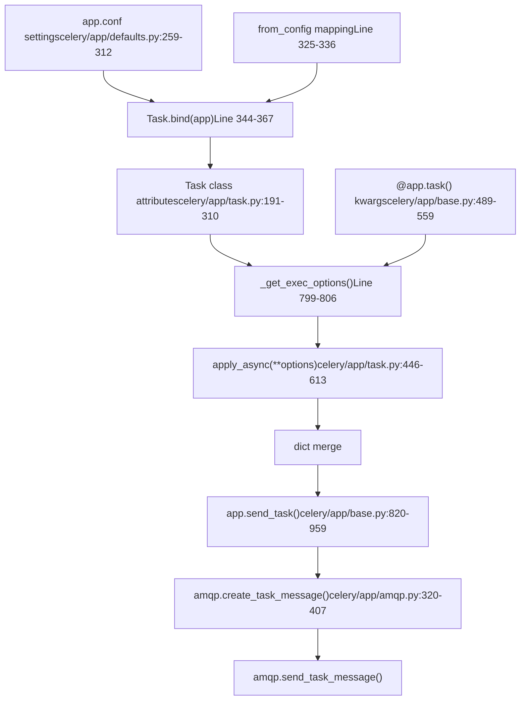
**Priority chain**: Configuration defaults are overridden by task class attributes, which are overridden by decorator arguments, which are overridden by `apply_async()` options. The `Task.bind(app)` method [celery/app/task.py344-367](https://github.com/celery/celery/blob/4d068b56/celery/app/task.py#L344-L367) applies configuration defaults to task attributes using the `from_config` tuple [celery/app/task.py325-336](https://github.com/celery/celery/blob/4d068b56/celery/app/task.py#L325-L336)

**Sources**: [celery/app/task.py325-368](https://github.com/celery/celery/blob/4d068b56/celery/app/task.py#L325-L368) [celery/app/task.py799-806](https://github.com/celery/celery/blob/4d068b56/celery/app/task.py#L799-L806) [celery/app/base.py489-608](https://github.com/celery/celery/blob/4d068b56/celery/app/base.py#L489-L608) [celery/app/base.py820-959](https://github.com/celery/celery/blob/4d068b56/celery/app/base.py#L820-L959) [celery/app/amqp.py320-407](https://github.com/celery/celery/blob/4d068b56/celery/app/amqp.py#L320-L407)

## Task Options Architecture

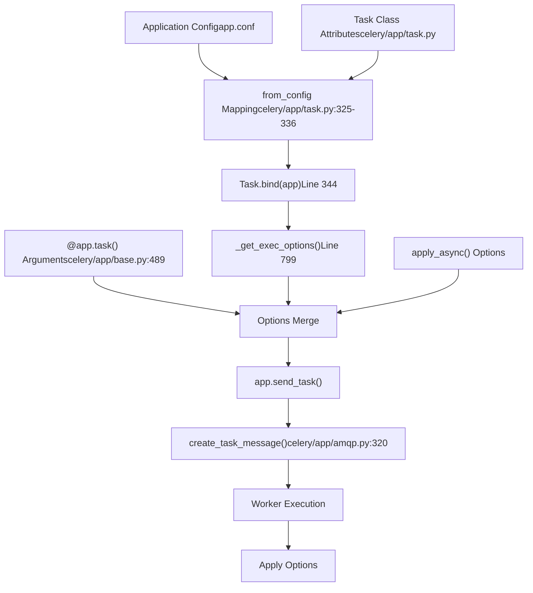
The task options system follows a priority chain where later sources override earlier ones: Configuration → Task Class → Decorator → `apply_async()`. The `Task.bind()` method reads configuration and sets task class attributes accordingly.

**Sources**: [celery/app/task.py325-368](https://github.com/celery/celery/blob/4d068b56/celery/app/task.py#L325-L368) [celery/app/task.py799-806](https://github.com/celery/celery/blob/4d068b56/celery/app/task.py#L799-L806) [celery/app/base.py489-608](https://github.com/celery/celery/blob/4d068b56/celery/app/base.py#L489-L608)

## Execution Control Options

### acks\_late

Controls message acknowledgment timing to the broker:

| Value | Acknowledgment Timing | Failure Behavior |
| --- | --- | --- |
| `False` (default) | Before task execution | Message lost if worker crashes |
| `True` | After task execution | Message redelivered if worker crashes |

**Message Acknowledgment Flow**

> **[Mermaid sequence]**
> *(图表结构无法解析)*

Configuration levels:

```
# Application-wide
app.conf.task_acks_late = True

# Task class attribute
class Task(celery.Task):
    acks_late = True

# Task decorator
@app.task(acks_late=True)
def critical_task():
    pass
```
**Important**: Tasks with `acks_late=True` may execute twice if the worker crashes mid-execution. Ensure idempotency or combine with `reject_on_worker_lost`.

**Sources**: [celery/app/task.py262-269](https://github.com/celery/celery/blob/4d068b56/celery/app/task.py#L262-L269) [celery/app/defaults.py261](https://github.com/celery/celery/blob/4d068b56/celery/app/defaults.py#L261-L261) [celery/worker/strategy.py](https://github.com/celery/celery/blob/4d068b56/celery/worker/strategy.py) [docs/userguide/tasks.rst28-47](https://github.com/celery/celery/blob/4d068b56/docs/userguide/tasks.rst#L28-L47)

### acks\_on\_failure\_or\_timeout

Controls message acknowledgment when tasks fail or exceed time limits. Only effective when `acks_late=True`.

| Value | Failure/Timeout Behavior | Use Case |
| --- | --- | --- |
| `True` (default) | Acknowledge message | Prevent retry loops |
| `False` | Reject for redelivery | Automatic retry on transient errors |

```
@app.task(acks_late=True, acks_on_failure_or_timeout=False)
def auto_retry_task():
    # Message requeued on failure or timeout
    # Useful for transient network/resource errors
    pass
```
**Warning**: Setting to `False` can create infinite retry loops if the task consistently fails. Combine with `max_retries` or ensure transient failure conditions.

**Sources**: [celery/app/task.py273-280](https://github.com/celery/celery/blob/4d068b56/celery/app/task.py#L273-L280) [celery/app/defaults.py262](https://github.com/celery/celery/blob/4d068b56/celery/app/defaults.py#L262-L262)

### reject\_on\_worker\_lost

Controls message redelivery when the worker process terminates abruptly (SIGKILL, segfault, OOM). Only applies with `acks_late=True`.

| Value | Worker Crash Behavior | Risk |
| --- | --- | --- |
| `None`/`False` (default) | Acknowledge message (task lost) | Message loss |
| `True` | Reject for redelivery | Potential crash loops |

```
@app.task(acks_late=True, reject_on_worker_lost=True)
def recoverable_task():
    # Requeued if worker killed by SIGKILL, SIGSEGV, OOM killer
    # NOT requeued on normal shutdown or task exceptions
    pass
```
**Warning**: Tasks that consistently crash workers (segfaults, OOM) will create redelivery loops. Use only for tasks that crash due to transient system conditions.

**Sources**: [celery/app/task.py282-292](https://github.com/celery/celery/blob/4d068b56/celery/app/task.py#L282-L292) [celery/app/defaults.py296](https://github.com/celery/celery/blob/4d068b56/celery/app/defaults.py#L296-L296) [docs/userguide/tasks.rst46-48](https://github.com/celery/celery/blob/4d068b56/docs/userguide/tasks.rst#L46-L48)

### track\_started

Controls whether the task reports a `STARTED` state to the result backend when execution begins.

| Value | State Reporting | Backend I/O | Use Case |
| --- | --- | --- | --- |
| `False` (default) | PENDING → SUCCESS/FAILURE | Minimal | Standard tasks |
| `True` | PENDING → STARTED → SUCCESS/FAILURE | Increased | Long-running tasks, progress monitoring |

**State Transition Diagram**

Configuration:

```
# Application-wide
app.conf.task_track_started = True

# Per-task
@app.task(track_started=True)
def long_running_task():
    # result.state == 'STARTED' visible immediately
    pass
```
**Impact**: Enabling adds one extra write to the result backend per task. Useful for monitoring dashboards showing active task execution.

**Sources**: [celery/app/task.py247-258](https://github.com/celery/celery/blob/4d068b56/celery/app/task.py#L247-L258) [celery/app/defaults.py310](https://github.com/celery/celery/blob/4d068b56/celery/app/defaults.py#L310-L310) [celery/backends/base.py](https://github.com/celery/celery/blob/4d068b56/celery/backends/base.py#LNaN-LNaN)

## Result Storage Options

### ignore\_result

Controls result backend storage for task return values.

| Value | Backend Storage | Memory Impact | Use Case |
| --- | --- | --- | --- |
| `False` (default) | Store results | Result backend entries | Workflows, RPC-style tasks |
| `True` | Discard results | No storage | Fire-and-forget, event triggers |

Configuration precedence:

```
# Application-wide default
app.conf.task_ignore_result = True

# Task definition (overrides config)
@app.task(ignore_result=True)
def background_job():
    send_email()

# Invocation-time (overrides task)
result = background_job.apply_async(ignore_result=False)
```
**Implementation**: The `ignore_result` flag is passed to `backend.store_result()` [celery/backends/base.py](https://github.com/celery/celery/blob/4d068b56/celery/backends/base.py) and checked before writing to storage.

**Sources**: [celery/app/task.py210-213](https://github.com/celery/celery/blob/4d068b56/celery/app/task.py#L210-L213) [celery/app/defaults.py281](https://github.com/celery/celery/blob/4d068b56/celery/app/defaults.py#L281-L281) [celery/app/base.py820-959](https://github.com/celery/celery/blob/4d068b56/celery/app/base.py#L820-L959)

### store\_errors\_even\_if\_ignored

Store error information even when `ignore_result=True`:

```
@app.task(ignore_result=True, store_errors_even_if_ignored=True)
def monitored_fire_and_forget():
    # Success results ignored, but errors stored for debugging
    pass
```
**Sources**: [celery/app/task.py228-230](https://github.com/celery/celery/blob/4d068b56/celery/app/task.py#L228-L230) [celery/app/defaults.py309](https://github.com/celery/celery/blob/4d068b56/celery/app/defaults.py#L309-L309)

### trail

Controls whether child task results are tracked:

| Value | Behavior |
| --- | --- |
| `True` (default) | Track child tasks in `request.children` |
| `False` | Don't track child tasks |

Useful for workflows with many subtasks:

```
@app.task(bind=True, trail=True)
def parent_task(self):
    for i in range(10):
        child_task.delay(i)
    # self.request.children will contain all child task IDs
```
**Sources**: [celery/app/task.py214-218](https://github.com/celery/celery/blob/4d068b56/celery/app/task.py#L214-L218)

## Serialization Options

### serializer

Specifies message body serialization format for task arguments and results.

| Serializer | Speed | Size | Type Support | Security | Use Case |
| --- | --- | --- | --- | --- | --- |
| `json` (default) | Fast | Medium | Limited (JSON types) | Safe | General purpose |
| `pickle` | Slow | Large | Full Python types | **Unsafe** | Complex objects, trusted network |
| `yaml` | Slow | Medium | JSON-like | Safe | Configuration, debugging |
| `msgpack` | Fastest | Smallest | Extended types | Safe | High throughput |

**Serialization Pipeline**

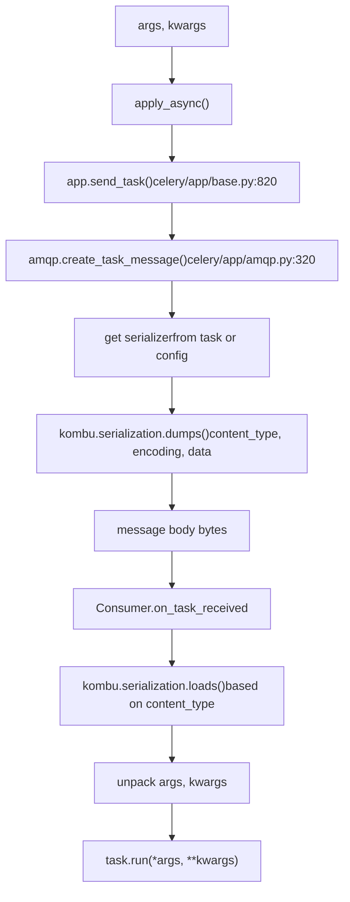
Configuration levels:

```
# Application-wide
app.conf.task_serializer = 'json'
app.conf.accept_content = ['json']  # Security: reject pickle

# Task class
@app.task(serializer='msgpack')
def high_throughput_task(data):
    pass

# Invocation
task.apply_async(args=[data], serializer='json')
```
**Security**: Pickle deserialization executes arbitrary code. Use `app.conf.accept_content` to restrict accepted formats. See [celery/app/defaults.py67](https://github.com/celery/celery/blob/4d068b56/celery/app/defaults.py#L67-L67) for `DEFAULT_ACCEPT_CONTENT`.

**Sources**: [celery/app/task.py232-234](https://github.com/celery/celery/blob/4d068b56/celery/app/task.py#L232-L234) [celery/app/defaults.py302](https://github.com/celery/celery/blob/4d068b56/celery/app/defaults.py#L302-L302) [celery/app/amqp.py320-407](https://github.com/celery/celery/blob/4d068b56/celery/app/amqp.py#L320-L407) [kombu/serialization.py](https://github.com/celery/celery/blob/4d068b56/kombu/serialization.py)

### compression

Compresses message bodies before broker transmission using `kombu.compression`.

| Method | Compression Ratio | CPU Cost | Network I/O | Use Case |
| --- | --- | --- | --- | --- |
| `None` (default) | 1:1 | Minimal | High | Small messages, fast network |
| `zlib` | Medium | Low | Medium | General purpose |
| `gzip` | High | Medium | Low | Large messages |
| `bzip2` | Highest | High | Lowest | Maximum compression, slow CPU acceptable |

Configuration:

```
# Application-wide
app.conf.task_compression = 'gzip'

# Per-task (extracted by extract_exec_options)
@app.task(compression='bzip2')
def large_payload_task(dataset):
    pass

# Per-invocation
task.apply_async(args=[data], compression='zlib')
```
**Implementation**: Compression is applied in `kombu.Producer.publish()` before broker transmission. The `compression` header indicates the algorithm, allowing automatic decompression on the worker side.

**Sources**: [celery/app/task.py28-32](https://github.com/celery/celery/blob/4d068b56/celery/app/task.py#L28-L32) [celery/app/defaults.py265](https://github.com/celery/celery/blob/4d068b56/celery/app/defaults.py#L265-L265) [kombu/compression.py](https://github.com/celery/celery/blob/4d068b56/kombu/compression.py)

## Argument Validation

### typing Option

The `typing` option enables automatic argument checking based on function signatures:

| Value | Behavior | Default |
| --- | --- | --- |
| `True` | Check arguments match signature | `app.strict_typing` |
| `False` | Skip argument checking | \- |
| `None` | Use application default | `app.strict_typing` |

```
# Application-wide
app = Celery('myapp', strict_typing=True)

# Task level
@app.task(typing=False)
def lenient_task(x, y):
    # No argument checking
    pass

# With typing enabled (default):
add.delay(2)  # Raises TypeError: missing required argument

# With typing disabled:
lenient_task.delay(2)  # No error, worker will fail at runtime
```
**Implementation**: Argument checking occurs in `Task.apply_async()` [celery/app/task.py567-574](https://github.com/celery/celery/blob/4d068b56/celery/app/task.py#L567-L574) using the `__header__` attribute created by `head_from_fun()` [celery/utils/functional.py](https://github.com/celery/celery/blob/4d068b56/celery/utils/functional.py)

**Sources**: [celery/app/task.py191-195](https://github.com/celery/celery/blob/4d068b56/celery/app/task.py#L191-L195) [celery/app/task.py567-574](https://github.com/celery/celery/blob/4d068b56/celery/app/task.py#L567-L574) [celery/app/base.py347-351](https://github.com/celery/celery/blob/4d068b56/celery/app/base.py#L347-L351) [docs/userguide/tasks.rst500-542](https://github.com/celery/celery/blob/4d068b56/docs/userguide/tasks.rst#L500-L542)

### Pydantic Integration

Celery provides automatic validation and serialization using Pydantic models.

**Configuration Parameters**

| Parameter | Type | Default | Description |
| --- | --- | --- | --- |
| `pydantic` | `bool` | `False` | Enable Pydantic wrapper |
| `pydantic_strict` | `bool` | `True` | Use strict validation mode |
| `pydantic_context` | `Dict` | `None` | Context passed to validators |
| `pydantic_dump_kwargs` | `Dict` | `{'mode': 'json'}` | `model_dump()` arguments |

**Validation Pipeline**

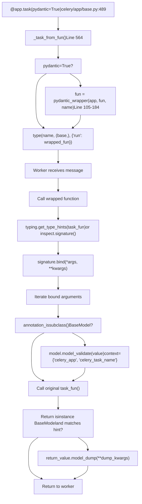
**Usage Example**

```
from pydantic import BaseModel

class TaskInput(BaseModel):
    x: int
    y: int

class TaskOutput(BaseModel):
    result: int

@app.task(pydantic=True)
def add(value: TaskInput) -> TaskOutput:
    return TaskOutput(result=value.x + value.y)

# Invocation with dict (validated automatically)
result = add.delay({'x': 2, 'y': 3})
result.get()  # {'result': 5}
```
**Type Hint Resolution**: The wrapper first attempts `typing.get_type_hints()` to resolve string annotations (from `from __future__ import annotations`), falling back to `inspect.signature()` if that fails due to circular imports [celery/app/base.py131-138](https://github.com/celery/celery/blob/4d068b56/celery/app/base.py#L131-L138)

**Optional Type Handling**: The `get_optional_arg()` utility [celery/utils/annotations.py39-55](https://github.com/celery/celery/blob/4d068b56/celery/utils/annotations.py#L39-L55) extracts the inner type from `Optional[T]` annotations, allowing `None` values without validation.

**Context in Validators**

```
from pydantic import field_validator, ValidationInfo

class ValidatedModel(BaseModel):
    value: int

    @field_validator('value')
    @classmethod
    def check_value(cls, v: int, info: ValidationInfo) -> int:
        # Access Celery context
        app = info.context['celery_app']
        task_name = info.context['celery_task_name']
        # Custom validation
        return v

@app.task(
    pydantic=True,
    pydantic_context={'max_value': 100}  # Additional context
)
def task(data: ValidatedModel):
    pass
```
**Sources**: [celery/app/base.py105-184](https://github.com/celery/celery/blob/4d068b56/celery/app/base.py#L105-L184) [celery/app/base.py564-608](https://github.com/celery/celery/blob/4d068b56/celery/app/base.py#L564-L608) [celery/utils/annotations.py1-70](https://github.com/celery/celery/blob/4d068b56/celery/utils/annotations.py#L1-L70) [t/integration/tasks.py45-56](https://github.com/celery/celery/blob/4d068b56/t/integration/tasks.py#L45-L56) [t/unit/app/test\_app.py1168-1402](https://github.com/celery/celery/blob/4d068b56/t/unit/app/test_app.py#L1168-L1402)

## Custom Task Classes

Custom task classes enable specialized behavior through lifecycle hooks and attribute customization.

### Base Task Definition

```
import celery

class MyTask(celery.Task):
    """Custom task base class with hooks."""

    def on_failure(self, exc, task_id, args, kwargs, einfo):
        """Called when task fails."""
        print(f'{task_id} failed: {exc}')

    def on_success(self, retval, task_id, args, kwargs):
        """Called when task succeeds."""
        print(f'{task_id} succeeded: {retval}')

    def on_retry(self, exc, task_id, args, kwargs, einfo):
        """Called when task is retried."""
        print(f'{task_id} retrying: {exc}')

@app.task(base=MyTask)
def custom_task(x, y):
    return x + y
```
### Lifecycle Hook Reference

**Hook Execution Flow**

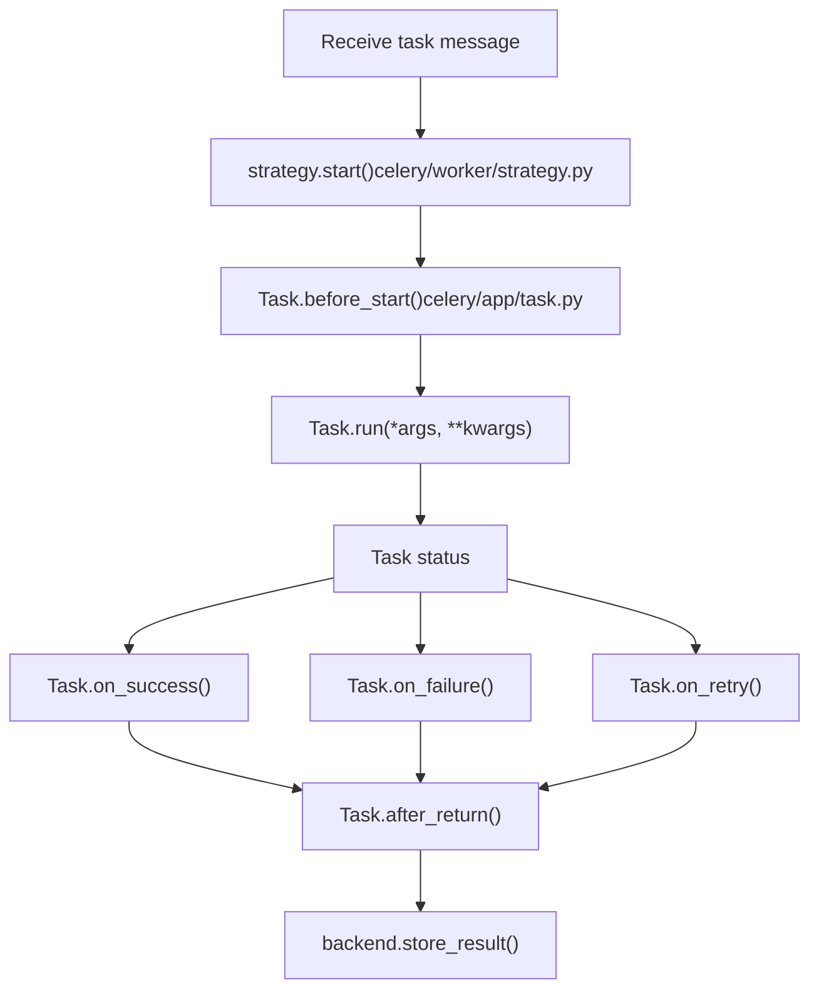
| Hook Method | Trigger | Arguments | Use Case |
| --- | --- | --- | --- |
| `on_bound(app)` | Task bound to application | `app` | Initialize app-specific resources |
| `before_start(task_id, args, kwargs)` | Before execution starts | Task metadata | Pre-execution setup, logging |
| `on_success(retval, task_id, args, kwargs)` | Task completes successfully | Result + metadata | Success notifications, cleanup |
| `on_failure(exc, task_id, args, kwargs, einfo)` | Task raises exception | Exception + traceback | Error reporting, rollback |
| `on_retry(exc, task_id, args, kwargs, einfo)` | Task scheduled for retry | Exception + traceback | Retry logging, backoff adjustment |
| `after_return(status, retval, task_id, args, kwargs, einfo)` | After execution (always) | All metadata | Universal cleanup, metrics |

**Example with Resource Management**

```
class DatabaseTask(celery.Task):
    """Task with database connection management."""
    _db = None

    @property
    def db(self):
        if self._db is None:
            self._db = create_db_connection()
        return self._db

    def after_return(self, status, retval, task_id, args, kwargs, einfo):
        """Close database connection after task."""
        if self._db is not None:
            self._db.close()
            self._db = None

@app.task(base=DatabaseTask, bind=True)
def query_database(self, query):
    return self.db.execute(query)
```
### Application-Wide Custom Task Class

Set default task base for all tasks:

```
# Method 1: task_cls parameter
app = celery.Celery('myapp', task_cls='myapp.tasks:MyTask')

# Method 2: Celery subclass
class MyCelery(celery.Celery):
    task_cls = 'myapp.tasks:MyTask'

app = MyCelery('myapp')

# Method 3: Configuration
app.conf.task_cls = 'myapp.tasks:MyTask'
```
**Note**: The `_custom_task_cls_used` flag [celery/app/base.py334-339](https://github.com/celery/celery/blob/4d068b56/celery/app/base.py#L334-L339) tracks whether a custom task class is in use, affecting certain optimizations.

**Sources**: [celery/app/task.py164-406](https://github.com/celery/celery/blob/4d068b56/celery/app/task.py#L164-L406) [celery/app/task.py369-377](https://github.com/celery/celery/blob/4d068b56/celery/app/task.py#L369-L377) [celery/app/base.py295](https://github.com/celery/celery/blob/4d068b56/celery/app/base.py#L295-L295) [celery/app/base.py334-340](https://github.com/celery/celery/blob/4d068b56/celery/app/base.py#L334-L340) [docs/userguide/tasks.rst167-184](https://github.com/celery/celery/blob/4d068b56/docs/userguide/tasks.rst#L167-L184)

## Complete Options Reference

### Task Class Attributes

Options configurable as task class attributes in [celery/app/task.py188-336](https://github.com/celery/celery/blob/4d068b56/celery/app/task.py#L188-L336):

| Attribute | Type | Default | Config Key | Description |
| --- | --- | --- | --- | --- |
| `name` | `str` | Auto-generated | \- | Unique task identifier |
| `typing` | `bool` | `None` → `app.strict_typing` | \- | Enable argument validation |
| `max_retries` | `int` | `3` | \- | Maximum retry attempts |
| `default_retry_delay` | `int` | `180` (3 min) | \- | Seconds between retries |
| `rate_limit` | `str` | `None` | `task_default_rate_limit` | Rate limit (e.g., `'100/m'`) |
| `ignore_result` | `bool` | `None` → `False` | `task_ignore_result` | Skip result storage |
| `trail` | `bool` | `True` | \- | Track child task IDs |
| `send_events` | `bool` | `True` | \- | Send monitoring events |
| `store_errors_even_if_ignored` | `bool` | `None` → `False` | `task_store_errors_even_if_ignored` | Store errors even if `ignore_result=True` |
| `serializer` | `str` | `None` → `'json'` | `task_serializer` | Message serializer |
| `time_limit` | `float` | `None` | `task_time_limit` | Hard time limit (seconds) |
| `soft_time_limit` | `float` | `None` | `task_soft_time_limit` | Soft time limit (seconds) |
| `track_started` | `bool` | `None` → `False` | `task_track_started` | Report STARTED state |
| `acks_late` | `bool` | `None` → `False` | `task_acks_late` | Acknowledge after execution |
| `acks_on_failure_or_timeout` | `bool` | `None` → `True` | `task_acks_on_failure_or_timeout` | Acknowledge on failure/timeout |
| `reject_on_worker_lost` | `bool` | `None` → `None` | `task_reject_on_worker_lost` | Requeue on worker crash |
| `throws` | `tuple` | `()` | \- | Expected exception types |
| `expires` | `float`/`datetime` | `None` | \- | Task expiration |
| `priority` | `int` | `None` | `task_default_priority` | Task priority (0-9) |
| `resultrepr_maxsize` | `int` | `1024` | \- | Max result repr length |

### Execution Options

Options extractable for message publishing via `extract_exec_options()` [celery/app/task.py28-32](https://github.com/celery/celery/blob/4d068b56/celery/app/task.py#L28-L32):

| Option | Source | Used By |
| --- | --- | --- |
| `queue` | Task attribute/invocation | Routing |
| `routing_key` | Task attribute/invocation | AMQP routing |
| `exchange` | Task attribute/invocation | AMQP exchange |
| `priority` | Task attribute/invocation | Message priority |
| `expires` | Task attribute/invocation | Message TTL |
| `serializer` | Task attribute/invocation | Serialization |
| `delivery_mode` | Task attribute/invocation | Persistence (1=transient, 2=persistent) |
| `compression` | Task attribute/invocation | Message compression |
| `time_limit` | Task attribute/invocation | Worker time limit |
| `soft_time_limit` | Task attribute/invocation | Worker soft limit |

### Configuration Mapping

The `from_config` tuple [celery/app/task.py325-336](https://github.com/celery/celery/blob/4d068b56/celery/app/task.py#L325-L336) maps configuration keys to task attributes:

```
from_config = (
    ('serializer', 'task_serializer'),
    ('rate_limit', 'task_default_rate_limit'),
    ('priority', 'task_default_priority'),
    ('track_started', 'task_track_started'),
    ('acks_late', 'task_acks_late'),
    ('acks_on_failure_or_timeout', 'task_acks_on_failure_or_timeout'),
    ('reject_on_worker_lost', 'task_reject_on_worker_lost'),
    ('ignore_result', 'task_ignore_result'),
    ('store_eager_result', 'task_store_eager_result'),
    ('store_errors_even_if_ignored', 'task_store_errors_even_if_ignored'),
)
```
Applied during `Task.bind(app)` [celery/app/task.py344-356](https://github.com/celery/celery/blob/4d068b56/celery/app/task.py#L344-L356) for attributes with `None` values.

**Sources**: [celery/app/task.py188-336](https://github.com/celery/celery/blob/4d068b56/celery/app/task.py#L188-L336) [celery/app/task.py325-336](https://github.com/celery/celery/blob/4d068b56/celery/app/task.py#L325-L336) [celery/app/task.py28-32](https://github.com/celery/celery/blob/4d068b56/celery/app/task.py#L28-L32) [celery/app/defaults.py259-312](https://github.com/celery/celery/blob/4d068b56/celery/app/defaults.py#L259-L312)

### Extract Execution Options

The `celery.app.task.extract_exec_options` function extracts message-publishing options from task attributes:

```
from celery.app.task import extract_exec_options

task = app.tasks['myapp.add']
options = extract_exec_options(task)
# Returns: {
#     'queue': ..., 'routing_key': ..., 'exchange': ...,
#     'priority': ..., 'expires': ..., 'serializer': ...,
#     'delivery_mode': ..., 'compression': ...,
#     'time_limit': ..., 'soft_time_limit': ...,
# }
```
**Sources**: [celery/app/task.py27-32](https://github.com/celery/celery/blob/4d068b56/celery/app/task.py#L27-L32)

## Configuration Integration

Task options integrate with Celery's configuration system through the `from_config` tuple:

```
# In celery/app/task.py
from_config = (
    ('serializer', 'task_serializer'),
    ('rate_limit', 'task_default_rate_limit'),
    ('priority', 'task_default_priority'),
    ('track_started', 'task_track_started'),
    ('acks_late', 'task_acks_late'),
    ('acks_on_failure_or_timeout', 'task_acks_on_failure_or_timeout'),
    ('reject_on_worker_lost', 'task_reject_on_worker_lost'),
    ('ignore_result', 'task_ignore_result'),
    ('store_eager_result', 'task_store_eager_result'),
    ('store_errors_even_if_ignored', 'task_store_errors_even_if_ignored'),
)
```
When `Task.bind(app)` is called, the task reads configuration values and sets its attributes accordingly. This happens during task registration.

**Diagram: Configuration to Task Attribute Flow**

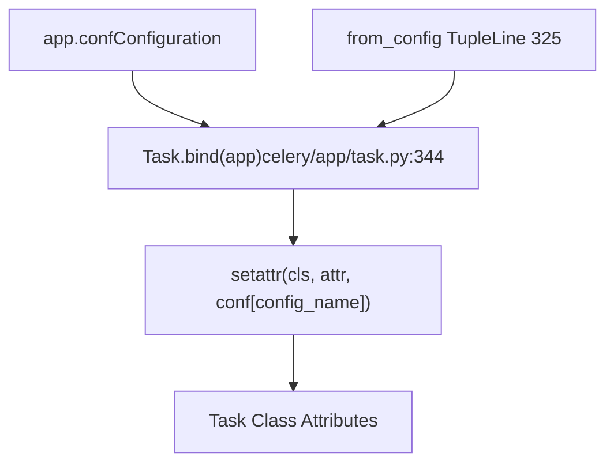
**Sources**: [celery/app/task.py325-366](https://github.com/celery/celery/blob/4d068b56/celery/app/task.py#L325-L366) [celery/app/defaults.py259-312](https://github.com/celery/celery/blob/4d068b56/celery/app/defaults.py#L259-L312)

## Configuration Options

The Pydantic integration is configured through the `@app.task()` decorator with the following parameters:

| Parameter | Type | Default | Description |
| --- | --- | --- | --- |
| `pydantic` | `bool` | `False` | Enable Pydantic validation and serialization |
| `pydantic_strict` | `bool` | `True` | Use strict validation mode |
| `pydantic_context` | `Optional[Dict[str, Any]]` | `None` | Context dictionary passed to validators |
| `pydantic_dump_kwargs` | `Optional[Dict[str, Any]]` | `None` | Keyword arguments for `model_dump()` |

The `pydantic_dump_kwargs` defaults to `{'mode': 'json'}` to ensure compatibility with Celery's serialization system.

**Sources**: [celery/app/base.py564-574](https://github.com/celery/celery/blob/4d068b56/celery/app/base.py#L564-L574)

## Wrapper Implementation

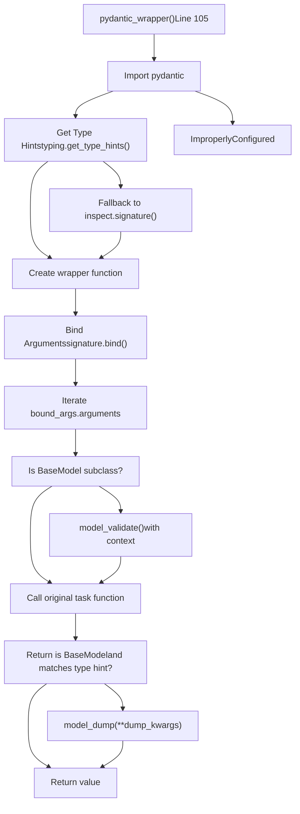
**Sources**: [celery/app/base.py105-184](https://github.com/celery/celery/blob/4d068b56/celery/app/base.py#L105-L184)

## Argument Validation

The wrapper validates task arguments through the following process:

### Type Hint Resolution

The wrapper attempts to resolve type hints in two ways:

1.  **Using `typing.get_type_hints()`** - Resolves string annotations to actual types
2.  **Fallback to `inspect.signature()`** - Uses raw annotations if get\_type\_hints fails

This dual approach handles both regular type hints and string annotations from `__future__ import annotations`.

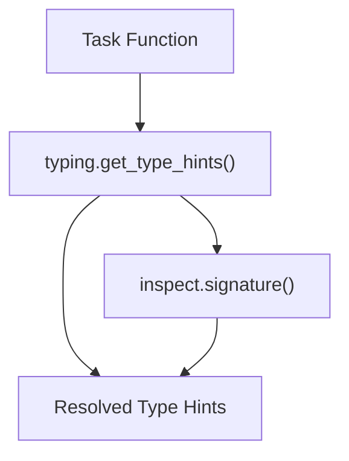
**Sources**: [celery/app/base.py131-138](https://github.com/celery/celery/blob/4d068b56/celery/app/base.py#L131-L138)

### Validation Steps

For each argument, the wrapper:

1.  **Binds arguments** using `inspect.signature.bind()` to match positional and keyword arguments
2.  **Checks type annotations** for each parameter
3.  **Handles Optional types** by extracting the inner type using `get_optional_arg()` utility
4.  **Validates BaseModel arguments** by calling `model_validate()` with:
    -   The argument value
    -   `strict=` parameter (configurable)
    -   `context=` dictionary including `celery_app` and `celery_task_name`

**Sources**: [celery/app/base.py139-159](https://github.com/celery/celery/blob/4d068b56/celery/app/base.py#L139-L159) [celery/utils/annotations.py](https://github.com/celery/celery/blob/4d068b56/celery/utils/annotations.py)

### Optional Type Handling

The integration properly handles `Optional[Model]` type hints:

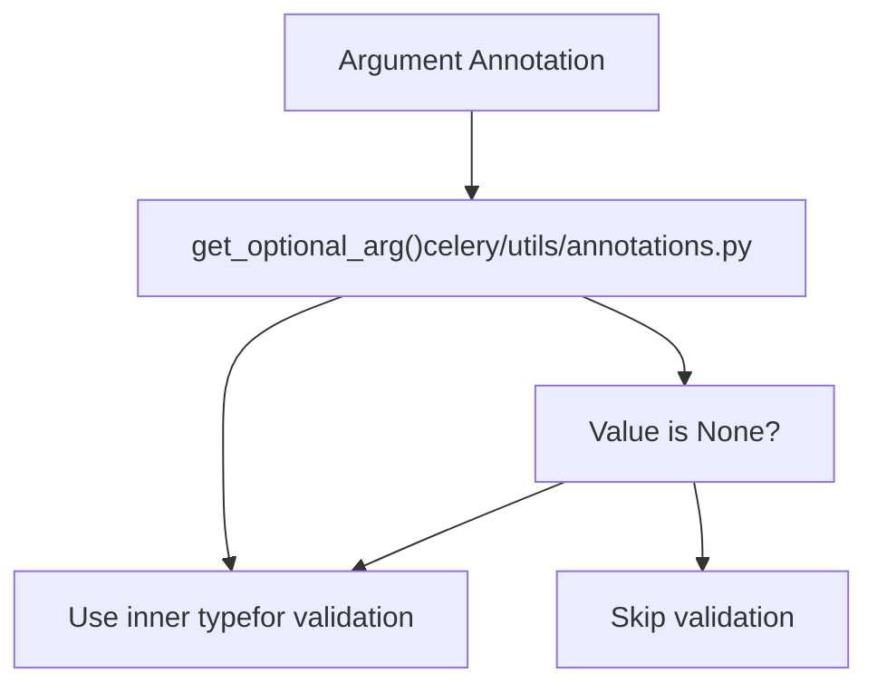
**Sources**: [celery/app/base.py149-152](https://github.com/celery/celery/blob/4d068b56/celery/app/base.py#L149-L152) [celery/utils/annotations.py1-38](https://github.com/celery/celery/blob/4d068b56/celery/utils/annotations.py#L1-L38)

## Return Value Serialization

After the task function executes, the wrapper serializes Pydantic model return values:

1.  **Checks return type annotation** - Resolves the return type hint
2.  **Handles Optional return types** - Extracts inner type if Optional
3.  **Validates return value** - Checks if the value is a BaseModel instance matching the type hint
4.  **Serializes to dict** - Calls `model_dump(**dump_kwargs)` with mode='json' by default

The serialization only occurs if:

-   The return annotation is a class (using `annotation_is_class()`)
-   The returned value is an instance of `BaseModel`
-   The returned value is an instance of the annotated return type

**Sources**: [celery/app/base.py163-181](https://github.com/celery/celery/blob/4d068b56/celery/app/base.py#L163-L181)

## Context and Validators

Pydantic validators can access Celery-specific context through the `context` parameter:

### Built-in Context Values

The wrapper automatically adds:

-   `celery_app` - The Celery application instance
-   `celery_task_name` - The name of the task being executed

These can be merged with user-provided context via the `pydantic_context` parameter.

### Example Validator Usage

```
from pydantic import BaseModel, field_validator, ValidationInfo

class MyModel(BaseModel):
    value: int

    @field_validator('value')
    @classmethod
    def check_value(cls, v: int, info: ValidationInfo) -> int:
        # Access Celery context
        app = info.context.get('celery_app')
        task_name = info.context.get('celery_task_name')
        # Custom validation logic
        return v
```
**Sources**: [celery/app/base.py154-158](https://github.com/celery/celery/blob/4d068b56/celery/app/base.py#L154-L158) [t/unit/app/test\_app.py1346-1402](https://github.com/celery/celery/blob/4d068b56/t/unit/app/test_app.py#L1346-L1402)

## String Annotations Support

The integration handles string annotations from `from __future__ import annotations`:

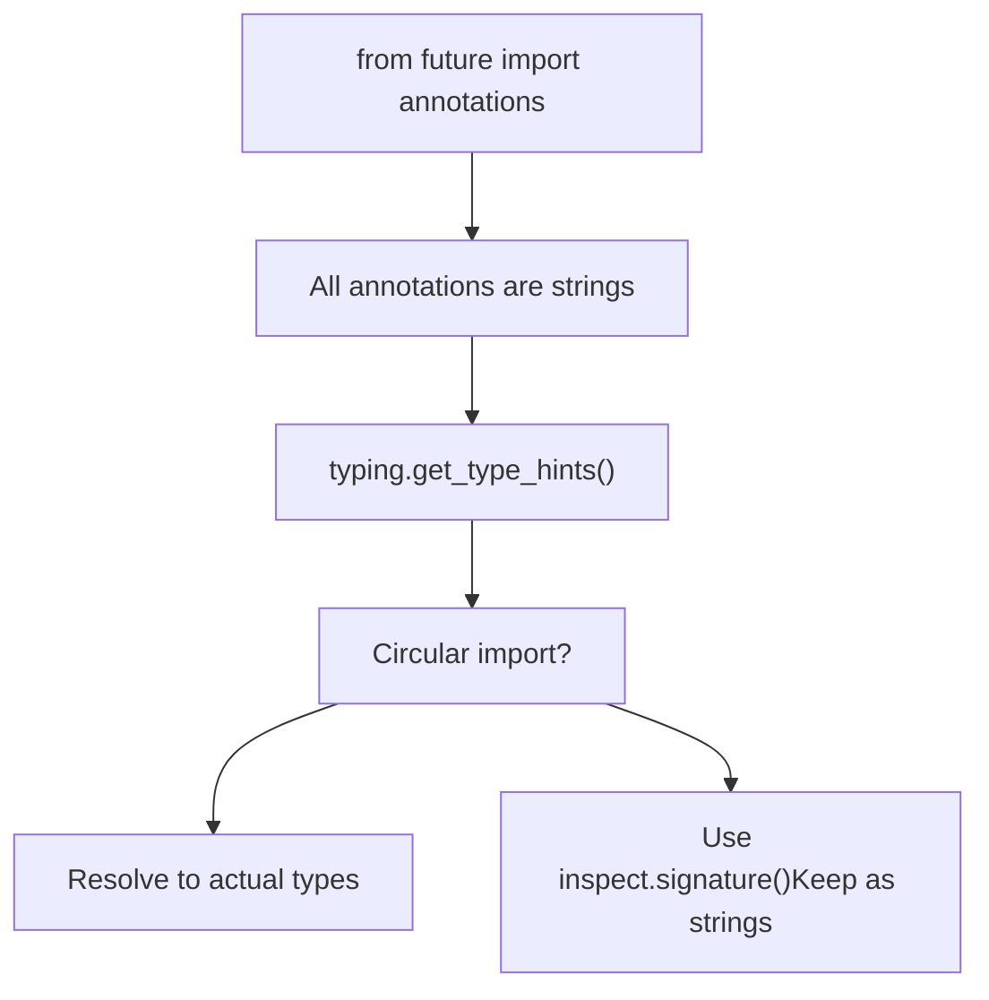
When `get_type_hints()` fails due to circular imports or `NameError`, the wrapper falls back to using raw annotations from `inspect.signature()`. Pydantic can still validate against string annotations in many cases.

**Sources**: [celery/app/base.py131-138](https://github.com/celery/celery/blob/4d068b56/celery/app/base.py#L131-L138) [t/integration/tasks.py51-56](https://github.com/celery/celery/blob/4d068b56/t/integration/tasks.py#L51-L56) [t/unit/app/test\_app.py1282-1294](https://github.com/celery/celery/blob/4d068b56/t/unit/app/test_app.py#L1282-L1294)

## Usage Examples

### Basic Usage

Define Pydantic models and annotate task parameters:

```
from pydantic import BaseModel
from celery import Celery

app = Celery()

class AddModel(BaseModel):
    x: int
    y: int

class AddResultModel(BaseModel):
    result: int

@app.task(pydantic=True)
def add(value: AddModel) -> AddResultModel:
    return AddResultModel(result=value.x + value.y)

# Usage
result = add.delay({'x': 1, 'y': 2})
result.get()  # Returns {'result': 3}
```
**Sources**: [t/integration/tasks.py45-50](https://github.com/celery/celery/blob/4d068b56/t/integration/tasks.py#L45-L50)

### Strict Mode

Control validation strictness:

```
@app.task(pydantic=True, pydantic_strict=False)
def lenient_task(value: MyModel) -> MyModel:
    return value
```
With `pydantic_strict=False`, type coercion is more permissive (e.g., strings to integers).

**Sources**: [celery/app/base.py571](https://github.com/celery/celery/blob/4d068b56/celery/app/base.py#L571-L571) [t/unit/app/test\_app.py1215-1240](https://github.com/celery/celery/blob/4d068b56/t/unit/app/test_app.py#L1215-L1240)

### Custom Context

Pass context to validators:

```
@app.task(
    pydantic=True,
    pydantic_context={'max_value': 100}
)
def validated_task(value: MyModel) -> ResultModel:
    return ResultModel(result=value.compute())
```
**Sources**: [celery/app/base.py572](https://github.com/celery/celery/blob/4d068b56/celery/app/base.py#L572-L572) [t/unit/app/test\_app.py1346-1402](https://github.com/celery/celery/blob/4d068b56/t/unit/app/test_app.py#L1346-L1402)

### Custom Serialization

Control `model_dump()` behavior:

```
@app.task(
    pydantic=True,
    pydantic_dump_kwargs={
        'mode': 'json',
        'exclude_none': True,
        'by_alias': True
    }
)
def custom_dump_task(value: InputModel) -> OutputModel:
    return OutputModel(data=value.process())
```
**Sources**: [celery/app/base.py573](https://github.com/celery/celery/blob/4d068b56/celery/app/base.py#L573-L573) [celery/app/base.py125](https://github.com/celery/celery/blob/4d068b56/celery/app/base.py#L125-L125)

## Integration with Task System

The Pydantic wrapper is applied during task registration in `_task_from_fun()`:

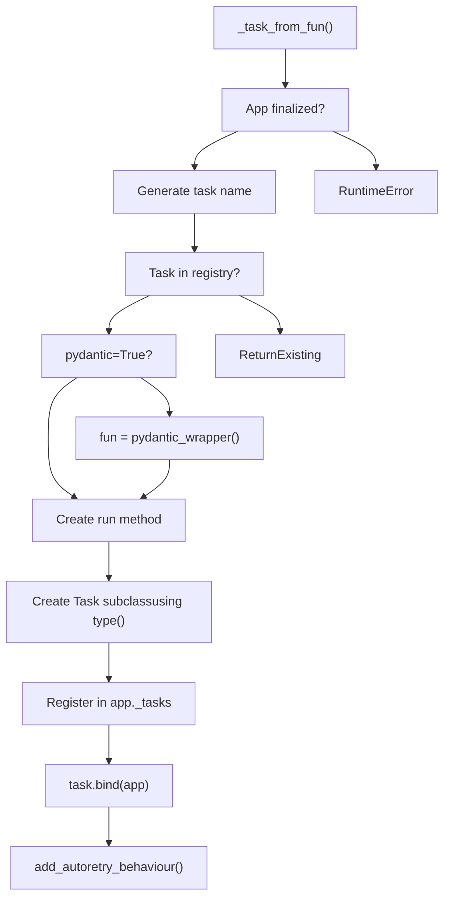
The wrapper is applied before the task class is created, so all task functionality (retry, rate limiting, time limits, etc.) works normally with Pydantic-validated tasks.

**Sources**: [celery/app/base.py564-608](https://github.com/celery/celery/blob/4d068b56/celery/app/base.py#L564-L608)

## Error Handling

### Import Error

If Pydantic is not installed:

```
try:
    pydantic = importlib.import_module('pydantic')
except ModuleNotFoundError as ex:
    raise ImproperlyConfigured(
        'You need to install pydantic to use pydantic model serialization.'
    ) from ex
```
**Sources**: [celery/app/base.py114-117](https://github.com/celery/celery/blob/4d068b56/celery/app/base.py#L114-L117)

### Validation Errors

Pydantic validation errors propagate as normal Python exceptions, which Celery handles according to the task's error handling configuration (retry, ignore, etc.).

**Sources**: [t/unit/app/test\_app.py1241-1263](https://github.com/celery/celery/blob/4d068b56/t/unit/app/test_app.py#L1241-L1263)

## Implementation Details

### Type Checking Utilities

The integration uses utility functions from `celery/utils/annotations.py`:

| Function | Purpose |
| --- | --- |
| `get_optional_arg()` | Extracts inner type from `Optional[T]` |
| `annotation_is_class()` | Checks if annotation is a class (not string or generic) |
| `annotation_issubclass()` | Safely checks subclass relationship with annotations |

**Sources**: [celery/utils/annotations.py1-70](https://github.com/celery/celery/blob/4d068b56/celery/utils/annotations.py#L1-L70)

### Signature Preservation

The wrapper uses `@functools.wraps(task_fun)` to preserve:

-   Function name (`__name__`)
-   Docstring (`__doc__`)
-   Module (`__module__`)
-   Annotations (`__annotations__`)

This ensures proper task introspection and documentation generation.

**Sources**: [celery/app/base.py139](https://github.com/celery/celery/blob/4d068b56/celery/app/base.py#L139-L139)

### Thread Safety

The Pydantic validation and serialization operations are thread-safe because:

-   Each task invocation creates a new bound arguments object
-   Pydantic models are immutable by default
-   No shared state is modified during validation/serialization

**Sources**: [celery/app/base.py140-181](https://github.com/celery/celery/blob/4d068b56/celery/app/base.py#L140-L181)

## Testing

The integration includes comprehensive tests:

### Unit Tests

Located in `t/unit/app/test_app.py`:

-   Basic validation and serialization
-   Optional argument handling
-   String annotation support
-   Strict mode behavior
-   Custom context passing
-   Validation error cases
-   Multiple argument validation
-   Return value type checking

**Sources**: [t/unit/app/test\_app.py1168-1402](https://github.com/celery/celery/blob/4d068b56/t/unit/app/test_app.py#L1168-L1402)

### Integration Tests

Located in `t/integration/test_tasks.py`:

-   End-to-end task execution with Pydantic models
-   Worker processing of Pydantic tasks
-   Result backend storage of serialized values

**Sources**: [t/integration/test\_tasks.py133-159](https://github.com/celery/celery/blob/4d068b56/t/integration/test_tasks.py#L133-L159) [t/integration/tasks.py45-56](https://github.com/celery/celery/blob/4d068b56/t/integration/tasks.py#L45-L56)
