# Workflow Primitives

Relevant source files

-   [celery/app/amqp.py](https://github.com/celery/celery/blob/4d068b56/celery/app/amqp.py)
-   [celery/app/base.py](https://github.com/celery/celery/blob/4d068b56/celery/app/base.py)
-   [celery/app/task.py](https://github.com/celery/celery/blob/4d068b56/celery/app/task.py)
-   [celery/canvas.py](https://github.com/celery/celery/blob/4d068b56/celery/canvas.py)
-   [celery/utils/\_\_init\_\_.py](https://github.com/celery/celery/blob/4d068b56/celery/utils/__init__.py)
-   [docs/userguide/canvas.rst](https://github.com/celery/celery/blob/4d068b56/docs/userguide/canvas.rst)
-   [t/integration/conftest.py](https://github.com/celery/celery/blob/4d068b56/t/integration/conftest.py)
-   [t/integration/tasks.py](https://github.com/celery/celery/blob/4d068b56/t/integration/tasks.py)
-   [t/integration/test\_canvas.py](https://github.com/celery/celery/blob/4d068b56/t/integration/test_canvas.py)
-   [t/integration/test\_quorum\_queue\_qos\_cluster\_simulation.py](https://github.com/celery/celery/blob/4d068b56/t/integration/test_quorum_queue_qos_cluster_simulation.py)
-   [t/integration/test\_security.py](https://github.com/celery/celery/blob/4d068b56/t/integration/test_security.py)
-   [t/integration/test\_tasks.py](https://github.com/celery/celery/blob/4d068b56/t/integration/test_tasks.py)
-   [t/smoke/tests/test\_canvas.py](https://github.com/celery/celery/blob/4d068b56/t/smoke/tests/test_canvas.py)
-   [t/unit/app/test\_app.py](https://github.com/celery/celery/blob/4d068b56/t/unit/app/test_app.py)
-   [t/unit/tasks/test\_canvas.py](https://github.com/celery/celery/blob/4d068b56/t/unit/tasks/test_canvas.py)
-   [t/unit/tasks/test\_tasks.py](https://github.com/celery/celery/blob/4d068b56/t/unit/tasks/test_tasks.py)

## Purpose and Scope

This page documents the Canvas workflow primitives that enable composition of complex task execution patterns in Celery. These primitives allow tasks to be combined into workflows with parallel execution, sequential chaining, synchronization points, and batch processing capabilities.

For information about basic task invocation and signatures, see [Task Definition and Invocation](/celery/celery/3.1-task-definition-and-invocation). For information about advanced canvas features like stamping and immutable signatures, see [Advanced Canvas Features](/celery/celery/4.3-advanced-canvas-features). For information about chord-specific implementation details, see [Chord Execution and Optimization](/celery/celery/4.4-chord-execution).

## Overview of Canvas Primitives

Canvas provides six fundamental primitives for workflow composition:

| Primitive | Purpose | Result Type | Example Use Case |
| --- | --- | --- | --- |
| `signature` | Wraps a task with args/kwargs/options | `Signature` | Creating reusable task templates |
| `chain` | Sequential execution with result passing | `AsyncResult` | Multi-step data transformations |
| `group` | Parallel execution of independent tasks | `GroupResult` | Fan-out processing |
| `chord` | Parallel execution with callback | `AsyncResult` | Map-reduce operations |
| `chunks` | Batch processing with partitioning | `GroupResult` | Processing large datasets |
| `map`/`starmap` | Apply task to iterable arguments | `AsyncResult` | Iterative transformations |

**Sources:** [celery/canvas.py36-39](https://github.com/celery/celery/blob/4d068b56/celery/canvas.py#L36-L39) [docs/userguide/canvas.rst250-306](https://github.com/celery/celery/blob/4d068b56/docs/userguide/canvas.rst#L250-L306)

---

## Primitive Relationships

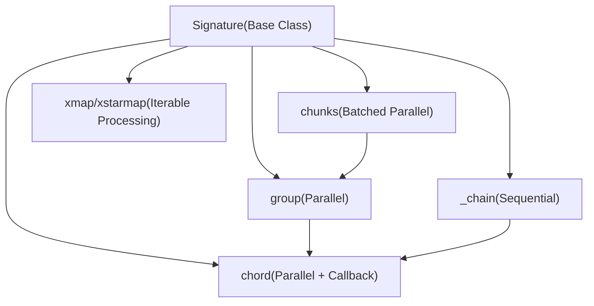
**Sources:** [celery/canvas.py232-287](https://github.com/celery/celery/blob/4d068b56/celery/canvas.py#L232-L287) [celery/canvas.py1389-1400](https://github.com/celery/celery/blob/4d068b56/celery/canvas.py#L1389-L1400) [celery/canvas.py1568-1580](https://github.com/celery/celery/blob/4d068b56/celery/canvas.py#L1568-L1580)

---

## Signature: The Foundation

The `Signature` class is the base for all canvas primitives. It wraps a task invocation with its arguments, keyword arguments, and execution options in a serializable form.

### Core Signature Properties

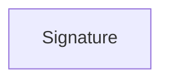
**Sources:** [celery/canvas.py232-287](https://github.com/celery/celery/blob/4d068b56/celery/canvas.py#L232-L287)

### Creating Signatures

Signatures can be created in multiple ways:

1.  **Using `signature()` factory function:**

    ```
    signature('tasks.add', args=(2, 2), countdown=10)
    ```

2.  **Using task's `.s()` method (shortcut):**

    ```
    add.s(2, 2)
    ```

3.  **Using task's `.si()` method (immutable):**

    ```
    add.si(2, 2)  # Arguments cannot be changed
    ```

4.  **Using task's `.signature()` method:**

    ```
    add.signature((2, 2), countdown=10)
    ```


**Sources:** [celery/canvas.py309-321](https://github.com/celery/celery/blob/4d068b56/celery/canvas.py#L309-L321) [celery/app/task.py636-658](https://github.com/celery/celery/blob/4d068b56/celery/app/task.py#L636-L658) [docs/userguide/canvas.rst29-72](https://github.com/celery/celery/blob/4d068b56/docs/userguide/canvas.rst#L29-L72)

### Signature Execution Methods

| Method | Description | Returns |
| --- | --- | --- |
| `__call__(*args, **kwargs)` | Execute task locally in current process | Task result |
| `delay(*args, **kwargs)` | Shortcut for `apply_async` | `AsyncResult` |
| `apply(args, kwargs, **options)` | Execute task locally (synchronous) | Task result |
| `apply_async(args, kwargs, **options)` | Send task message to worker | `AsyncResult` |
| `freeze(_id, group_id, chord, root_id, parent_id)` | Finalize with task IDs | `AsyncResult` |

**Sources:** [celery/canvas.py346-401](https://github.com/celery/celery/blob/4d068b56/celery/canvas.py#L346-L401) [celery/canvas.py472-519](https://github.com/celery/celery/blob/4d068b56/celery/canvas.py#L472-L519)

### Partial Application and Merging

Signatures support partial application where additional arguments can be prepended:

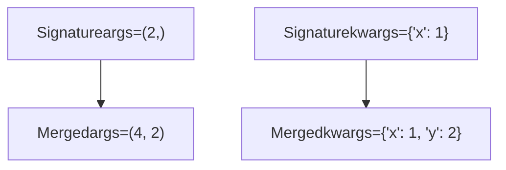
The `_merge()` method implements this behavior. For immutable signatures, existing args/kwargs are preserved and only options are merged.

**Sources:** [celery/canvas.py402-442](https://github.com/celery/celery/blob/4d068b56/celery/canvas.py#L402-L442)

### Immutability

Immutable signatures prevent argument modification, useful when a callback should not receive the parent task's result:

```
# Mutable (default) - receives parent result
add.apply_async((2, 2), link=log_result.s())

# Immutable - does not receive parent result
add.apply_async((2, 2), link=reset_buffers.si())
```
**Sources:** [celery/canvas.py438-442](https://github.com/celery/celery/blob/4d068b56/celery/canvas.py#L438-L442) [docs/userguide/canvas.rst168-190](https://github.com/celery/celery/blob/4d068b56/docs/userguide/canvas.rst#L168-L190)

---

## Chain: Sequential Execution

The `_chain` class executes tasks sequentially, passing each task's result as the first argument to the next task.

### Chain Structure

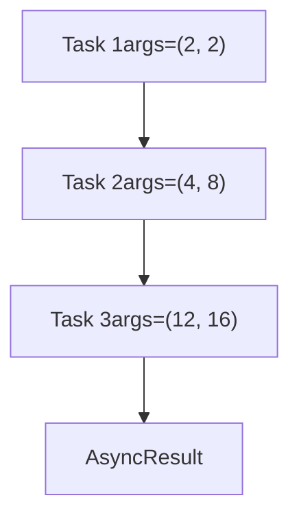
### Chain Implementation

The chain implementation uses several key methods:

| Method | Purpose | Location |
| --- | --- | --- |
| `__init__(*tasks)` | Initialize chain with task list | [celery/canvas.py1389-1428](https://github.com/celery/celery/blob/4d068b56/celery/canvas.py#L1389-L1428) |
| `unchain_tasks()` | Flatten nested chains | [celery/canvas.py1473-1500](https://github.com/celery/celery/blob/4d068b56/celery/canvas.py#L1473-L1500) |
| `prepare_steps()` | Link tasks with callbacks | [celery/canvas.py1502-1549](https://github.com/celery/celery/blob/4d068b56/celery/canvas.py#L1502-L1549) |
| `apply_async()` | Execute the chain | [celery/canvas.py1551-1566](https://github.com/celery/celery/blob/4d068b56/celery/canvas.py#L1551-L1566) |
| `freeze()` | Assign task IDs recursively | [celery/canvas.py1589-1638](https://github.com/celery/celery/blob/4d068b56/celery/canvas.py#L1589-L1638) |

**Sources:** [celery/canvas.py1389-1665](https://github.com/celery/celery/blob/4d068b56/celery/canvas.py#L1389-L1665)

### Chain Creation Patterns

Chains can be created using the `|` operator or the `chain()` function:

```
# Using pipe operator
c = add.s(2, 2) | add.s(4) | add.s(8)

# Using chain() constructor
c = chain(add.s(2, 2), add.s(4), add.s(8))

# Chaining to existing chain
c1 = add.s(4) | mul.s(2)
c2 = c1 | add.s(8)  # Appends to existing chain
```
**Sources:** [celery/canvas.py758-779](https://github.com/celery/celery/blob/4d068b56/celery/canvas.py#L758-L779) [celery/canvas.py1389-1428](https://github.com/celery/celery/blob/4d068b56/celery/canvas.py#L1389-L1428) [t/integration/test\_canvas.py188-207](https://github.com/celery/celery/blob/4d068b56/t/integration/test_canvas.py#L188-L207)

### Chain Execution Flow

> **[Mermaid sequence]**
> *(图表结构无法解析)*

**Sources:** [celery/canvas.py1551-1566](https://github.com/celery/celery/blob/4d068b56/celery/canvas.py#L1551-L1566) [celery/canvas.py1502-1549](https://github.com/celery/celery/blob/4d068b56/celery/canvas.py#L1502-L1549)

### Error Handling in Chains

When a task in a chain fails, subsequent tasks are not executed:

```
# Chain with error handling
c = chain(
    add.s(1, 2),
    fail.s(),  # This task raises an exception
    add.s(3, 4)  # This task will not execute
)
```
Error callbacks can be attached to handle failures:

```
c = chain(add.s(1, 2), fail.s(), add.s(3, 4))
c.link_error(handle_error.s())
```
**Sources:** [t/integration/test\_canvas.py227-244](https://github.com/celery/celery/blob/4d068b56/t/integration/test_canvas.py#L227-L244) [celery/canvas.py715-732](https://github.com/celery/celery/blob/4d068b56/celery/canvas.py#L715-L732)

---

## Group: Parallel Execution

The `group` class executes tasks in parallel, returning a `GroupResult` that collects all task results.

### Group Structure

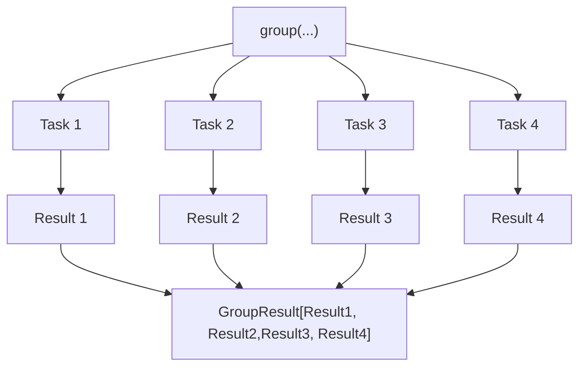
### Group Implementation

| Method | Purpose | Location |
| --- | --- | --- |
| `__init__(*tasks)` | Initialize with task list | [celery/canvas.py1038-1082](https://github.com/celery/celery/blob/4d068b56/celery/canvas.py#L1038-L1082) |
| `apply_async()` | Execute all tasks in parallel | [celery/canvas.py1179-1221](https://github.com/celery/celery/blob/4d068b56/celery/canvas.py#L1179-L1221) |
| `freeze()` | Assign group\_id and task IDs | [celery/canvas.py1261-1316](https://github.com/celery/celery/blob/4d068b56/celery/canvas.py#L1261-L1316) |
| `set_immutable()` | Make all tasks immutable | [celery/canvas.py1147-1151](https://github.com/celery/celery/blob/4d068b56/celery/canvas.py#L1147-L1151) |

**Sources:** [celery/canvas.py1011-1387](https://github.com/celery/celery/blob/4d068b56/celery/canvas.py#L1011-L1387)

### Group Creation

```
# Using group() constructor
g = group(add.s(i, i) for i in range(10))

# Using list of signatures
g = group([add.s(1, 1), add.s(2, 2), add.s(3, 3)])

# Partial groups receive parent result
result = add.s(5, 5) | group(add.s(1), add.s(2), add.s(3))
# Each group task receives result from add.s(5, 5)
```
**Sources:** [celery/canvas.py1038-1082](https://github.com/celery/celery/blob/4d068b56/celery/canvas.py#L1038-L1082) [t/integration/test\_canvas.py266-284](https://github.com/celery/celery/blob/4d068b56/t/integration/test_canvas.py#L266-L284)

### Group Result Collection

The `GroupResult` provides methods to wait for and collect all task results:

| Method | Description |
| --- | --- |
| `get(timeout)` | Wait for all tasks, return list of results |
| `ready()` | Check if all tasks completed |
| `successful()` | Check if all tasks succeeded |
| `failed()` | Check if any task failed |
| `join(timeout)` | Wait for all tasks (deprecated, use `get()`) |

**Sources:** [celery/result.py](https://github.com/celery/celery/blob/4d068b56/celery/result.py#LNaN-LNaN) [t/integration/test\_canvas.py369-378](https://github.com/celery/celery/blob/4d068b56/t/integration/test_canvas.py#L369-L378)

### Group Execution Flow

> **[Mermaid sequence]**
> *(图表结构无法解析)*

**Sources:** [celery/canvas.py1179-1221](https://github.com/celery/celery/blob/4d068b56/celery/canvas.py#L1179-L1221) [celery/canvas.py1261-1316](https://github.com/celery/celery/blob/4d068b56/celery/canvas.py#L1261-L1316)

### Group with Immutable Tasks

When a group follows another task in a chain but should not receive the parent result:

```
# Mutable group - receives parent result
result = add.s(4, 4) | group(add.s(1), add.s(2))
# Each task becomes: add(8, 1) and add(8, 2)

# Immutable group - does not receive parent result
result = add.s(4, 4) | group(add.si(1, 1), add.si(2, 2))
# Each task remains: add(1, 1) and add(2, 2)
```
**Sources:** [celery/canvas.py1147-1151](https://github.com/celery/celery/blob/4d068b56/celery/canvas.py#L1147-L1151) [docs/userguide/canvas.rst456-467](https://github.com/celery/celery/blob/4d068b56/docs/userguide/canvas.rst#L456-L467)

---

## Chord: Parallel Execution with Callback

A `chord` executes a group of tasks in parallel (the "header"), then executes a callback task (the "body") with the header results.

### Chord Structure

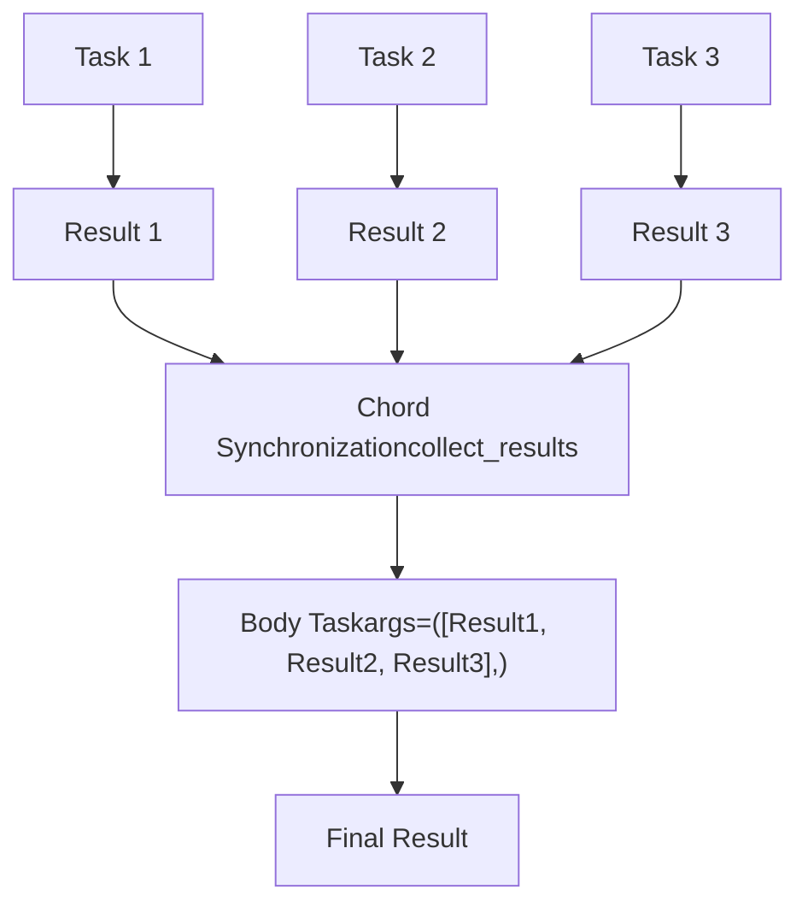
### Chord Implementation

| Component | Purpose | Location |
| --- | --- | --- |
| `chord.__init__()` | Initialize with header and body | [celery/canvas.py1668-1703](https://github.com/celery/celery/blob/4d068b56/celery/canvas.py#L1668-L1703) |
| `chord.apply_async()` | Execute header and register body | [celery/canvas.py1797-1831](https://github.com/celery/celery/blob/4d068b56/celery/canvas.py#L1797-L1831) |
| `chord.freeze()` | Set chord body in header options | [celery/canvas.py1770-1779](https://github.com/celery/celery/blob/4d068b56/celery/canvas.py#L1770-L1779) |
| Backend synchronization | Track header completion | [celery/backends/base.py](https://github.com/celery/celery/blob/4d068b56/celery/backends/base.py#LNaN-LNaN) |

**Sources:** [celery/canvas.py1668-1925](https://github.com/celery/celery/blob/4d068b56/celery/canvas.py#L1668-L1925)

### Chord Creation

```
# Using chord() constructor
c = chord([add.s(1, 1), add.s(2, 2), add.s(3, 3)], body=tsum.s())

# Using pipe operator (group | task becomes chord)
c = group(add.s(i, i) for i in range(10)) | tsum.s()

# Chord with immutable body
c = chord([task1.s(), task2.s()], body=callback.si())
```
**Sources:** [celery/canvas.py1668-1703](https://github.com/celery/celery/blob/4d068b56/celery/canvas.py#L1668-L1703) [docs/userguide/canvas.rst379-406](https://github.com/celery/celery/blob/4d068b56/docs/userguide/canvas.rst#L379-L406)

### Chord Execution Flow

> **[Mermaid sequence]**
> *(图表结构无法解析)*

**Sources:** [celery/canvas.py1797-1831](https://github.com/celery/celery/blob/4d068b56/celery/canvas.py#L1797-L1831) [celery/backends/base.py](https://github.com/celery/celery/blob/4d068b56/celery/backends/base.py#LNaN-LNaN)

### Chord Backend Requirements

Chords require backend support for coordination:

| Backend | Native Support | Implementation |
| --- | --- | --- |
| Redis | Yes | Native join with atomic operations |
| RPC/AMQP | Yes | Message-based synchronization |
| Database | Yes | Row-based tracking |
| Memcached | No | Not supported |
| Cache | No | Not supported |

To check if a backend supports chords:

```
try:
    app.backend.ensure_chords_allowed()
except NotImplementedError:
    # Chords not supported
    pass
```
**Sources:** [celery/backends/base.py](https://github.com/celery/celery/blob/4d068b56/celery/backends/base.py#LNaN-LNaN) [t/integration/test\_canvas.py362-366](https://github.com/celery/celery/blob/4d068b56/t/integration/test_canvas.py#L362-L366)

### Chord Error Propagation

If any header task fails, the body task is not executed:

```
# Chord with failing header task
c = chord([add.s(1, 1), fail.s(), add.s(3, 3)], body=tsum.s())
result = c()

# Result will contain the exception from fail.s()
try:
    result.get()
except ExpectedException:
    pass
```
**Sources:** [t/integration/test\_canvas.py1096-1137](https://github.com/celery/celery/blob/4d068b56/t/integration/test_canvas.py#L1096-L1137) [celery/canvas.py1833-1872](https://github.com/celery/celery/blob/4d068b56/celery/canvas.py#L1833-L1872)

---

## Chunks: Partitioned Batch Processing

The `chunks` primitive splits a large iterable of arguments into smaller chunks and processes each chunk in parallel.

### Chunks Structure

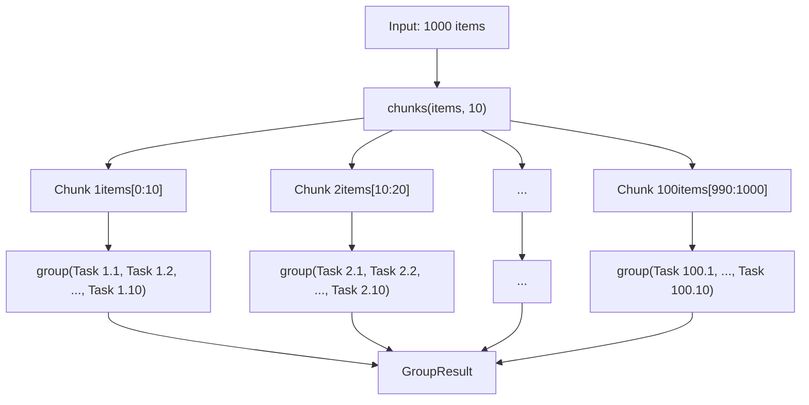
### Chunks Implementation

| Method | Purpose | Location |
| --- | --- | --- |
| `__init__(task, it, n)` | Initialize with task, items, chunk size | [celery/canvas.py967-976](https://github.com/celery/celery/blob/4d068b56/celery/canvas.py#L967-L976) |
| `apply_chunks()` | Create group for each chunk | [celery/canvas.py978-984](https://github.com/celery/celery/blob/4d068b56/celery/canvas.py#L978-L984) |
| `group()` property | Return group of chunk groups | [celery/canvas.py993-997](https://github.com/celery/celery/blob/4d068b56/celery/canvas.py#L993-L997) |

**Sources:** [celery/canvas.py951-1008](https://github.com/celery/celery/blob/4d068b56/celery/canvas.py#L951-L1008)

### Chunks Creation

```
# Basic chunks usage
items = list(range(1000))
result = add.chunks(zip(items, items), 10)

# This creates 100 groups, each processing 10 items
# Total: 100 groups * 10 tasks/group = 1000 tasks
```
**Sources:** [celery/canvas.py967-976](https://github.com/celery/celery/blob/4d068b56/celery/canvas.py#L967-L976) [docs/userguide/canvas.rst294-305](https://github.com/celery/celery/blob/4d068b56/docs/userguide/canvas.rst#L294-L305)

### Chunks Execution Pattern

> **[Mermaid sequence]**
> *(图表结构无法解析)*

**Sources:** [celery/canvas.py978-997](https://github.com/celery/celery/blob/4d068b56/celery/canvas.py#L978-L997)

### Chunks vs Map

| Approach | Parallelism | Task Count | Use Case |
| --- | --- | --- | --- |
| `chunks` | Group-level | N groups with M tasks each | Large datasets, control granularity |
| `map` | Single task | 1 task processing all items | Simple iteration, less overhead |

**Sources:** [celery/canvas.py951-1008](https://github.com/celery/celery/blob/4d068b56/celery/canvas.py#L951-L1008) [celery/canvas.py849-948](https://github.com/celery/celery/blob/4d068b56/celery/canvas.py#L849-L948)

---

## Map and Starmap: Iterable Processing

The `xmap` and `xstarmap` primitives apply a task to a sequence of arguments, similar to Python's built-in `map()` function.

### Map vs Starmap

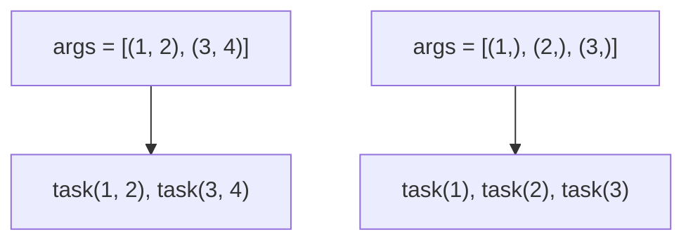
| Primitive | Argument Expansion | Example |
| --- | --- | --- |
| `xmap` | Single argument | `add.map([1, 2, 3])` → `[add(1), add(2), add(3)]` |
| `xstarmap` | Star arguments | `add.starmap([(1,2), (3,4)])` → `[add(1,2), add(3,4)]` |

**Sources:** [celery/canvas.py849-948](https://github.com/celery/celery/blob/4d068b56/celery/canvas.py#L849-L948)

### Map Implementation

| Method | Purpose | Location |
| --- | --- | --- |
| `__init__(task, it)` | Initialize with task and iterable | [celery/canvas.py860-866](https://github.com/celery/celery/blob/4d068b56/celery/canvas.py#L860-L866) |
| `apply_async()` | Execute map task | [celery/canvas.py868-873](https://github.com/celery/celery/blob/4d068b56/celery/canvas.py#L868-L873) |

**Sources:** [celery/canvas.py849-903](https://github.com/celery/celery/blob/4d068b56/celery/canvas.py#L849-L903)

### Map Creation and Usage

```
# Using map
result = add.map([1, 2, 3, 4, 5])
# Equivalent to: [add(1), add(2), add(3), add(4), add(5)]

# Using starmap
result = add.starmap([(1, 1), (2, 2), (3, 3)])
# Equivalent to: [add(1, 1), add(2, 2), add(3, 3)]
```
**Sources:** [celery/canvas.py849-948](https://github.com/celery/celery/blob/4d068b56/celery/canvas.py#L849-L948) [docs/userguide/canvas.rst272-292](https://github.com/celery/celery/blob/4d068b56/docs/userguide/canvas.rst#L272-L292)

### Map Execution

Map operations are implemented as a temporary task that processes all items:

> **[Mermaid sequence]**
> *(图表结构无法解析)*

**Sources:** [celery/canvas.py868-873](https://github.com/celery/celery/blob/4d068b56/celery/canvas.py#L868-L873) [t/unit/tasks/test\_canvas.py353-369](https://github.com/celery/celery/blob/4d068b56/t/unit/tasks/test_canvas.py#L353-L369)

---

## Composition and Nesting

Canvas primitives can be composed and nested to create complex workflows.

### Composition Patterns

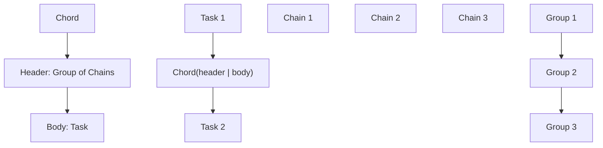
### Automatic Chord Upgrade

When a group is chained to another task, it automatically becomes a chord:

```
# This group | task pattern
sig = group(add.s(i, i) for i in range(10)) | tsum.s()

# Is equivalent to an explicit chord
sig = chord(group(add.s(i, i) for i in range(10)), body=tsum.s())
```
**Sources:** [celery/canvas.py770-775](https://github.com/celery/celery/blob/4d068b56/celery/canvas.py#L770-L775) [docs/userguide/canvas.rst432-440](https://github.com/celery/celery/blob/4d068b56/docs/userguide/canvas.rst#L432-L440)

### Complex Composition Example

```
# Multi-stage workflow: chain of chords
workflow = (
    # Stage 1: Process batches in parallel
    group(process_batch.s(batch) for batch in batches) |

    # Stage 2: Aggregate batch results
    aggregate_results.s() |

    # Stage 3: Analyze each aggregated result
    group(analyze.s(i) for i in range(10)) |

    # Stage 4: Final summary
    create_summary.s()
)
```
**Sources:** [t/integration/test\_canvas.py395-457](https://github.com/celery/celery/blob/4d068b56/t/integration/test_canvas.py#L395-L457)

### Nested Workflow Diagram

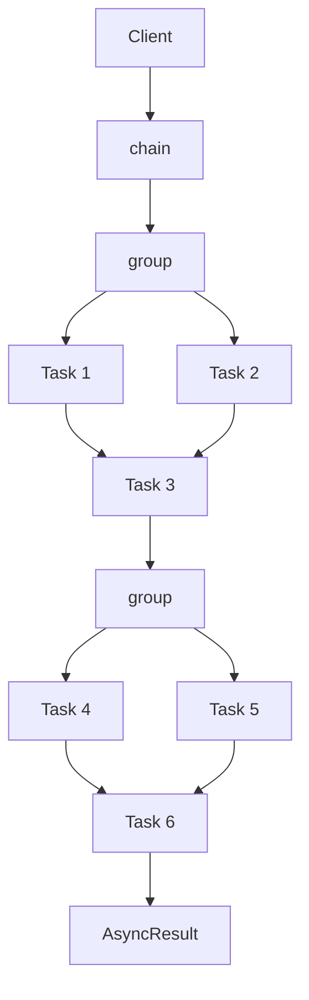
**Sources:** [t/integration/test\_canvas.py409-507](https://github.com/celery/celery/blob/4d068b56/t/integration/test_canvas.py#L409-L507)

---

## Stamping and Header Propagation

The stamping visitor pattern allows custom metadata to be propagated through canvas workflows.

### StampingVisitor Pattern

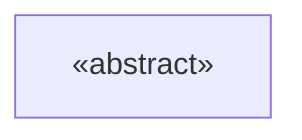
**Sources:** [celery/canvas.py118-229](https://github.com/celery/celery/blob/4d068b56/celery/canvas.py#L118-L229)

### Stamping Implementation

| Method | Purpose | Location |
| --- | --- | --- |
| `stamp(visitor, append_stamps, **headers)` | Stamp signature with headers | [celery/canvas.py613-633](https://github.com/celery/celery/blob/4d068b56/celery/canvas.py#L613-L633) |
| `stamp_links(visitor, append_stamps, **headers)` | Stamp callbacks and errbacks | [celery/canvas.py635-682](https://github.com/celery/celery/blob/4d068b56/celery/canvas.py#L635-L682) |
| `_stamp_headers(visitor_headers, ...)` | Merge stamp headers | [celery/canvas.py553-611](https://github.com/celery/celery/blob/4d068b56/celery/canvas.py#L553-L611) |

**Sources:** [celery/canvas.py553-682](https://github.com/celery/celery/blob/4d068b56/celery/canvas.py#L553-L682)

### Stamping Usage

```
class CustomVisitor(StampingVisitor):
    def on_signature(self, sig, **headers):
        return {'custom_id': generate_id(), **headers}

# Apply stamps to workflow
workflow = chain(task1.s(), task2.s(), task3.s())
workflow.stamp(visitor=CustomVisitor())
```
**Sources:** [celery/canvas.py118-229](https://github.com/celery/celery/blob/4d068b56/celery/canvas.py#L118-L229) [t/integration/test\_canvas.py772-839](https://github.com/celery/celery/blob/4d068b56/t/integration/test_canvas.py#L772-L839)

### Header Propagation Flow

> **[Mermaid sequence]**
> *(图表结构无法解析)*

**Sources:** [celery/canvas.py613-682](https://github.com/celery/celery/blob/4d068b56/celery/canvas.py#L613-L682) [t/integration/test\_canvas.py772-839](https://github.com/celery/celery/blob/4d068b56/t/integration/test_canvas.py#L772-L839)

---

## Primitive Type Registration

Canvas primitives use a registration system for serialization and deserialization.

### Type Registry

```
# Register custom primitive type
@Signature.register_type()
class custom_primitive(Signature):
    def __init__(self, *args, **kwargs):
        super().__init__(*args, **kwargs)
        self.subtask_type = "custom_primitive"
```
**Sources:** [celery/canvas.py295-307](https://github.com/celery/celery/blob/4d068b56/celery/canvas.py#L295-L307)

### Registered Types

| Type Name | Class | Purpose |
| --- | --- | --- |
| `"chain"` | `_chain` | Sequential execution |
| `"group"` | `group` | Parallel execution |
| `"chord"` | `chord` | Parallel with callback |
| `"chunks"` | `chunks` | Batch processing |
| `"xmap"` | `xmap` | Map operation |
| `"xstarmap"` | `xstarmap` | Starmap operation |

**Sources:** [celery/canvas.py289-307](https://github.com/celery/celery/blob/4d068b56/celery/canvas.py#L289-L307) [celery/canvas.py1389-1665](https://github.com/celery/celery/blob/4d068b56/celery/canvas.py#L1389-L1665) [celery/canvas.py1668-1925](https://github.com/celery/celery/blob/4d068b56/celery/canvas.py#L1668-L1925)

### Type Serialization

The `from_dict()` class method reconstructs primitives from serialized form:

```
# Serialize signature
sig = chain(add.s(1, 1), mul.s(2))
d = dict(sig)

# Deserialize using type registry
restored = Signature.from_dict(d, app=app)
assert isinstance(restored, _chain)
```
**Sources:** [celery/canvas.py310-320](https://github.com/celery/celery/blob/4d068b56/celery/canvas.py#L310-L320)

---

## Testing Primitives

Canvas primitives include comprehensive test coverage demonstrating usage patterns.

### Integration Test Structure

| Test Class | Focus | Location |
| --- | --- | --- |
| `test_chain` | Chain execution patterns | [t/integration/test\_canvas.py186-577](https://github.com/celery/celery/blob/4d068b56/t/integration/test_canvas.py#L186-L577) |
| `test_group` | Group execution and results | [t/integration/test\_canvas.py18-26](https://github.com/celery/celery/blob/4d068b56/t/integration/test_canvas.py#L18-L26) |
| `test_chord` | Chord synchronization | [t/integration/test\_canvas.py72-182](https://github.com/celery/celery/blob/4d068b56/t/integration/test_canvas.py#L72-L182) |
| `test_stamping` | Stamp propagation | [t/integration/test\_canvas.py772-1020](https://github.com/celery/celery/blob/4d068b56/t/integration/test_canvas.py#L772-L1020) |

**Sources:** [t/integration/test\_canvas.py1-1942](https://github.com/celery/celery/blob/4d068b56/t/integration/test_canvas.py#L1-L1942)

### Unit Test Coverage

| Test Module | Coverage |
| --- | --- |
| `test_Signature` | Signature creation, merging, linking |
| `test_chain` | Chain composition and flattening |
| `test_group` | Group creation and freezing |
| `test_chord` | Chord structure and callbacks |

**Sources:** [t/unit/tasks/test\_canvas.py1-2536](https://github.com/celery/celery/blob/4d068b56/t/unit/tasks/test_canvas.py#L1-L2536)

### Example Test Patterns

```
# Test chain result propagation
def test_simple_chain(manager):
    c = add.s(4, 4) | add.s(8) | add.s(16)
    assert c().get(timeout=TIMEOUT) == 32

# Test group parallel execution
def test_group(celery_setup):
    sig = group(add.si(1, 1), add.si(2, 2))
    res = sig.apply_async()
    assert res.get(timeout=TIMEOUT) == [2, 4]

# Test chord with callback
def test_chord(manager):
    c = chord([add.s(i, i) for i in range(10)], body=tsum.s())
    res = c()
    assert res.get(timeout=TIMEOUT) == 90
```
**Sources:** [t/integration/test\_canvas.py188-191](https://github.com/celery/celery/blob/4d068b56/t/integration/test_canvas.py#L188-L191) [t/smoke/tests/test\_canvas.py17-25](https://github.com/celery/celery/blob/4d068b56/t/smoke/tests/test_canvas.py#L17-L25) [t/smoke/tests/test\_canvas.py71-105](https://github.com/celery/celery/blob/4d068b56/t/smoke/tests/test_canvas.py#L71-L105)
