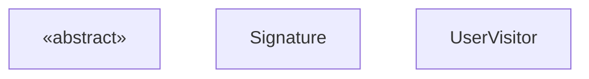
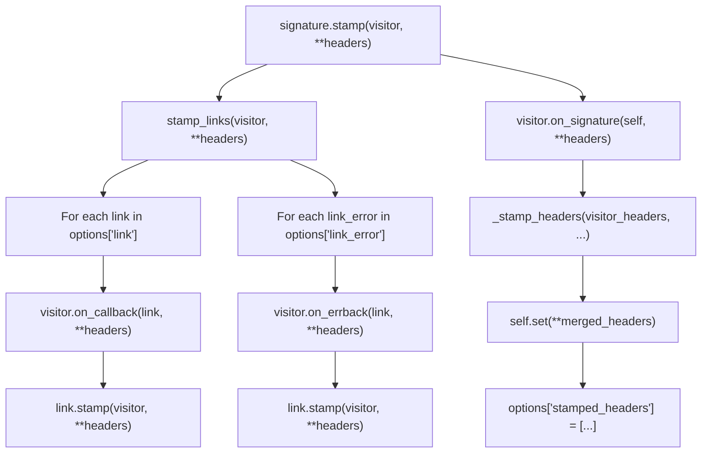
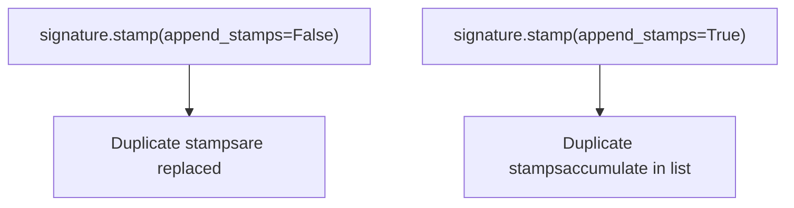
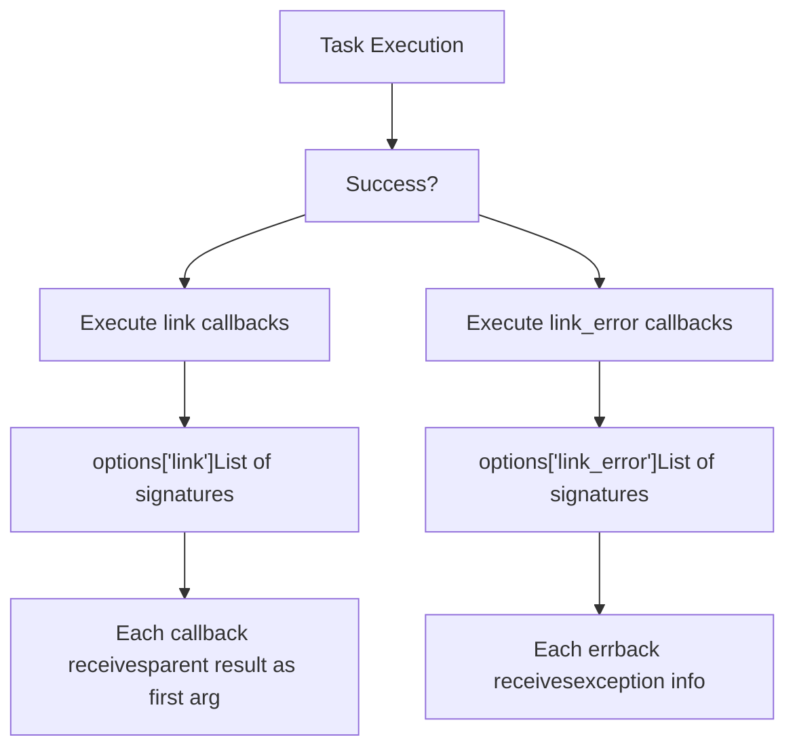
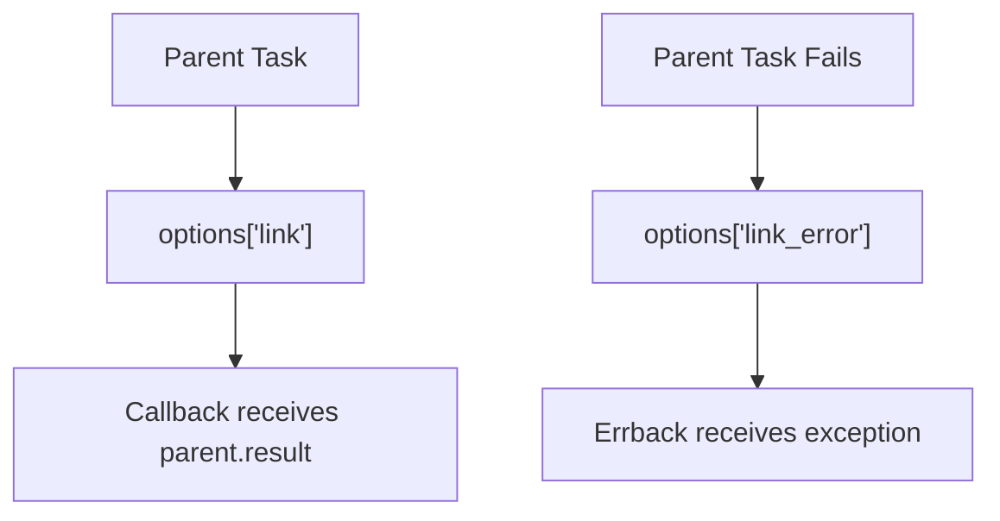
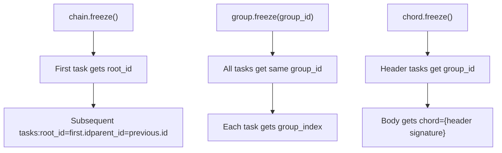
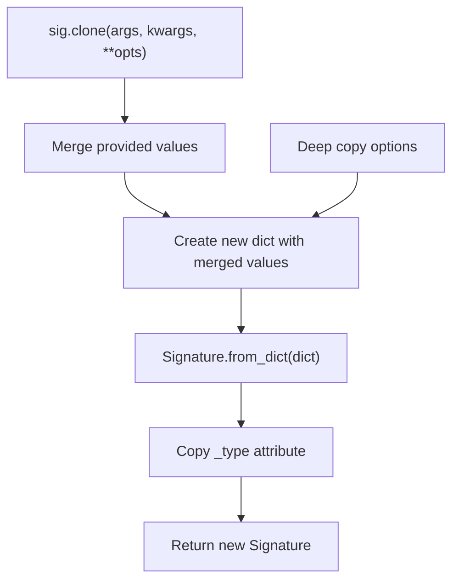
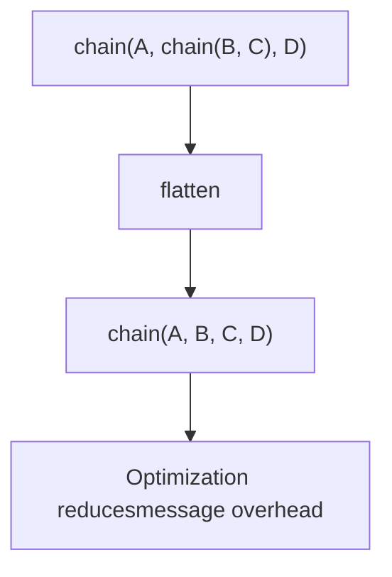
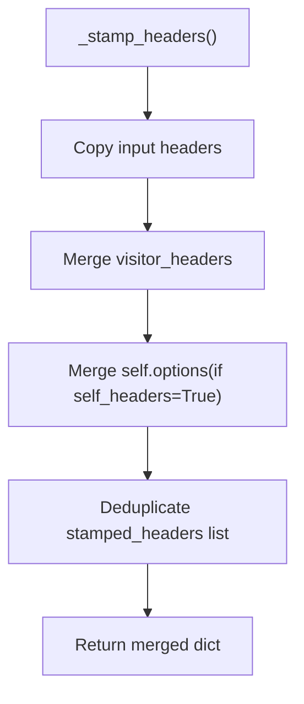
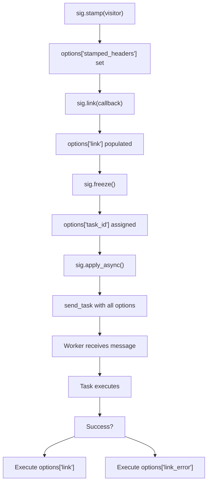

# Advanced Canvas Features

Relevant source files

-   [celery/app/amqp.py](https://github.com/celery/celery/blob/4d068b56/celery/app/amqp.py)
-   [celery/app/base.py](https://github.com/celery/celery/blob/4d068b56/celery/app/base.py)
-   [celery/app/task.py](https://github.com/celery/celery/blob/4d068b56/celery/app/task.py)
-   [celery/canvas.py](https://github.com/celery/celery/blob/4d068b56/celery/canvas.py)
-   [celery/utils/\_\_init\_\_.py](https://github.com/celery/celery/blob/4d068b56/celery/utils/__init__.py)
-   [docs/userguide/canvas.rst](https://github.com/celery/celery/blob/4d068b56/docs/userguide/canvas.rst)
-   [t/integration/conftest.py](https://github.com/celery/celery/blob/4d068b56/t/integration/conftest.py)
-   [t/integration/tasks.py](https://github.com/celery/celery/blob/4d068b56/t/integration/tasks.py)
-   [t/integration/test\_canvas.py](https://github.com/celery/celery/blob/4d068b56/t/integration/test_canvas.py)
-   [t/integration/test\_quorum\_queue\_qos\_cluster\_simulation.py](https://github.com/celery/celery/blob/4d068b56/t/integration/test_quorum_queue_qos_cluster_simulation.py)
-   [t/integration/test\_security.py](https://github.com/celery/celery/blob/4d068b56/t/integration/test_security.py)
-   [t/integration/test\_tasks.py](https://github.com/celery/celery/blob/4d068b56/t/integration/test_tasks.py)
-   [t/smoke/tests/test\_canvas.py](https://github.com/celery/celery/blob/4d068b56/t/smoke/tests/test_canvas.py)
-   [t/unit/app/test\_app.py](https://github.com/celery/celery/blob/4d068b56/t/unit/app/test_app.py)
-   [t/unit/tasks/test\_canvas.py](https://github.com/celery/celery/blob/4d068b56/t/unit/tasks/test_canvas.py)
-   [t/unit/tasks/test\_tasks.py](https://github.com/celery/celery/blob/4d068b56/t/unit/tasks/test_tasks.py)

This page documents advanced Canvas features for customizing and controlling task workflow execution. For basic Canvas primitives like `chain`, `group`, and `chord`, see [Workflow Primitives](/celery/celery/4.2-workflow-primitives). For the underlying `Signature` object model, see [Signature and Composition](/celery/celery/4.1-signatures).

This page covers:

-   **Stamping** - Adding custom headers to track workflows
-   **Callbacks** - Attaching success and error handlers
-   **Freeze** - Finalizing signatures with concrete task IDs
-   **Immutability** - Preventing argument modification
-   **Cloning** - Creating modified copies of signatures

## Stamping

Stamping allows adding custom headers to task signatures and their callbacks, enabling workflow tracking and custom metadata propagation. The stamping system uses the Visitor pattern to recursively traverse and annotate Canvas primitives.

### StampingVisitor Interface

The `StampingVisitor` abstract base class defines hooks for stamping different Canvas types:


**Sources**: [celery/canvas.py118-229](https://github.com/celery/celery/blob/4d068b56/celery/canvas.py#L118-L229)

### Stamping Mechanism

The `Signature.stamp()` method applies a visitor to the signature and all linked callbacks/errbacks:

**Diagram: Stamping Flow**


**Sources**: [celery/canvas.py613-633](https://github.com/celery/celery/blob/4d068b56/celery/canvas.py#L613-L633) [celery/canvas.py635-682](https://github.com/celery/celery/blob/4d068b56/celery/canvas.py#L635-L682)

### Stamped Headers Management

Stamped headers are tracked in `options['stamped_headers']` to prevent modification during signature merging:

| Header Type | Behavior |
| --- | --- |
| Regular options | Can be overridden during `_merge()` |
| Stamped headers | Protected from override (immutable) |
| `group_id` | Always immutable |

The `_IMMUTABLE_OPTIONS` set defines headers that cannot be modified:

```
_IMMUTABLE_OPTIONS = {"group_id", "stamped_headers"}
```
**Sources**: [celery/canvas.py293](https://github.com/celery/celery/blob/4d068b56/celery/canvas.py#L293-L293) [celery/canvas.py402-442](https://github.com/celery/celery/blob/4d068b56/celery/canvas.py#L402-L442)

### Example: Monitoring ID Visitor

```
class MonitoringVisitor(StampingVisitor):
    def on_signature(self, sig, **headers):
        return {'monitoring_id': uuid4().hex}

    def on_callback(self, callback, **headers):
        # Callbacks inherit monitoring_id
        return headers

# Usage
sig = add.s(1, 2)
sig.stamp(visitor=MonitoringVisitor())
# options now contains stamped monitoring_id
```
**Sources**: [t/integration/test\_tasks.py255-277](https://github.com/celery/celery/blob/4d068b56/t/integration/test_tasks.py#L255-L277)

### Stamp Aggregation

The `append_stamps` parameter controls duplicate stamp handling:


The `_stamp_headers()` method merges stamps using `_merge_dictionaries()`:

**Sources**: [celery/canvas.py553-611](https://github.com/celery/celery/blob/4d068b56/celery/canvas.py#L553-L611) [celery/canvas.py73-116](https://github.com/celery/celery/blob/4d068b56/celery/canvas.py#L73-L116)

## Callbacks and Error Handlers

Callbacks attach follow-up tasks that execute after a signature completes. Error handlers (`errbacks`) execute only on failure.

### Link and Link Error

**Diagram: Callback Types**


**Sources**: [celery/canvas.py716-746](https://github.com/celery/celery/blob/4d068b56/celery/canvas.py#L716-L746)

### Callback Management Methods

| Method | Purpose | Returns |
| --- | --- | --- |
| `link(callback)` | Add success callback | The callback signature |
| `link_error(errback)` | Add error callback | The errback signature |
| `on_error(errback)` | Chainable error handler | Self (for chaining) |
| `flatten_links()` | Get recursive link list | List of all linked signatures |

**Key Implementation Details:**

-   Callbacks are stored as lists in `options['link']` and `options['link_error']`
-   `_with_list_option()` ensures these are always lists
-   Duplicate callbacks are prevented by checking membership before append
-   The `on_error()` method enables chaining: `sig.on_error(handler).delay()`

**Sources**: [celery/canvas.py684-757](https://github.com/celery/celery/blob/4d068b56/celery/canvas.py#L684-L757)

### Callback Execution Context

When a signature with callbacks is frozen, the callbacks inherit contextual information:


**Sources**: [celery/app/task.py126-153](https://github.com/celery/celery/blob/4d068b56/celery/app/task.py#L126-L153)

## Freeze

The `freeze()` method finalizes a signature by assigning a concrete task ID and propagating workflow context (root\_id, parent\_id, group\_id).

### Freeze Signature

```
result = signature.freeze(
    _id=None,           # Task ID (generated if None)
    group_id=None,      # Group membership
    chord=None,         # Chord callback
    root_id=None,       # Workflow root
    parent_id=None,     # Parent task ID
    group_index=None    # Position in group
)
```
**Freeze Behavior:**

1.  If `task_id` already exists in options, return existing AsyncResult
2.  Otherwise, generate new UUID and assign to `options['task_id']`
3.  Set `root_id`, `parent_id`, `group_id`, `chord`, `group_index` if provided
4.  Set `reply_to` to `app.thread_oid` if not present
5.  Return `AsyncResult(task_id)`

**Sources**: [celery/canvas.py472-520](https://github.com/celery/celery/blob/4d068b56/celery/canvas.py#L472-L520)

### Freeze Workflow Context

**Diagram: Freeze Context Propagation**


**Sources**: [celery/canvas.py472-520](https://github.com/celery/celery/blob/4d068b56/celery/canvas.py#L472-L520)

## Clone and Partial Application

The `clone()` method creates a modified copy of a signature without mutating the original.

### Clone vs Partial

```
sig = add.s(2, 2)

# clone() is the full method
cloned = sig.clone(args=(3,), kwargs={'z': 1})

# partial() is an alias
partial = sig.partial(args=(3,))

assert cloned is not sig
assert cloned.args == (3, 2, 2)  # Prepended
```
**Sources**: [celery/canvas.py444-469](https://github.com/celery/celery/blob/4d068b56/celery/canvas.py#L444-L469)

### Clone Implementation

**Diagram: Clone Process**


**Key Details:**

-   Options are deep copied to avoid shared mutable state
-   The `_type` attribute (cached task class) is preserved
-   Merging respects immutability (unless `force=True`)

**Sources**: [celery/canvas.py444-469](https://github.com/celery/celery/blob/4d068b56/celery/canvas.py#L444-L469)

## Immutability

Immutable signatures prevent argument modification during composition. Created with `.si()` (signature immutable) or `.set(immutable=True)`.

### Immutable Signature Behavior

| Operation | Mutable | Immutable |
| --- | --- | --- |
| `sig.apply_async(args=(1,))` | Prepends args | Ignores args |
| `sig.clone(args=(1,))` | Prepends args | Ignores args (unless `force=True`) |
| `chain(sig, ...)` | Args pass to sig | Args ignored |
| Options merge | Always merged | Always merged |

**Sources**: [celery/canvas.py402-442](https://github.com/celery/celery/blob/4d068b56/celery/canvas.py#L402-L442)

### Merge Logic with Immutability

The `_merge()` method handles immutability:

```
def _merge(self, args=None, kwargs=None, options=None, force=False):
    if self.immutable and not force:
        return (self.args, self.kwargs, merged_options)
    return (
        tuple(args) + tuple(self.args),
        dict(self.kwargs, **kwargs),
        merged_options
    )
```
**Immutable Options:**

-   `group_id` - Never overridden once set
-   `stamped_headers` - Never overridden once set
-   Headers in `stamped_headers` list - Protected from modification

**Sources**: [celery/canvas.py402-442](https://github.com/celery/celery/blob/4d068b56/celery/canvas.py#L402-L442) [celery/canvas.py428-435](https://github.com/celery/celery/blob/4d068b56/celery/canvas.py#L428-L435)

### Creating Immutable Signatures

```
# Immutable shortcut
sig = add.si(2, 2)
assert sig.immutable == True

# Explicit setting
sig = add.s(2, 2).set(immutable=True)

# Or at creation
sig = Signature('add', args=(2, 2), immutable=True)
```
**Sources**: [celery/canvas.py550-552](https://github.com/celery/celery/blob/4d068b56/celery/canvas.py#L550-L552)

## Workflow Optimization

Canvas provides internal optimization mechanisms for efficient workflow execution.

### Prepare Steps

Complex workflows are optimized before execution through `_frozen` caching. When a chain is frozen, it flattens nested chains and prepares an optimized task list.

**Diagram: Chain Flattening**


**Sources**: [celery/canvas.py427-436](https://github.com/celery/celery/blob/4d068b56/celery/canvas.py#L427-L436) in `test_splices_chains`

### Stamping Performance

Stamping traverses the entire workflow tree. For large workflows, consider:

1.  **Stamp early** - Before expanding generators
2.  **Minimal visitor logic** - Keep `on_signature()` fast
3.  **Avoid duplicate stamps** - Use `append_stamps=False` when possible

**Sources**: [celery/canvas.py64-71](https://github.com/celery/celery/blob/4d068b56/celery/canvas.py#L64-L71) (\_stamp\_regen\_task for generator handling)

### Option Merging Optimization

The `_stamp_headers()` method optimizes header merging:


**Sources**: [celery/canvas.py553-611](https://github.com/celery/celery/blob/4d068b56/celery/canvas.py#L553-L611)

## Advanced Patterns

### Custom Visitor for Request Tracing

```
class RequestTracingVisitor(StampingVisitor):
    def __init__(self, request_id):
        self.request_id = request_id

    def on_signature(self, sig, **headers):
        return {
            'request_id': self.request_id,
            'trace_depth': headers.get('trace_depth', 0)
        }

    def on_callback(self, callback, **headers):
        return {
            'request_id': self.request_id,
            'trace_depth': headers.get('trace_depth', 0) + 1
        }
```
**Sources**: [celery/canvas.py118-229](https://github.com/celery/celery/blob/4d068b56/celery/canvas.py#L118-L229) [t/integration/test\_tasks.py255-277](https://github.com/celery/celery/blob/4d068b56/t/integration/test_tasks.py#L255-L277)

### Conditional Callbacks

```
def success_callback(result):
    if result > 100:
        return log_high_value.s(result)
    return log_normal_value.s(result)

sig = process_data.s(data)
sig.link(success_callback)
```
**Sources**: [celery/canvas.py716-723](https://github.com/celery/celery/blob/4d068b56/celery/canvas.py#L716-L723)

### Workflow Context Preservation

When replacing tasks with `.replace()`, stamped headers are preserved:

```
@app.task(bind=True)
def replace_with_stamped_task(self):
    new_task = add.s(1, 2)
    # Stamps from original task are preserved
    raise self.replace(new_task)
```
**Sources**: [t/integration/tasks.py350-358](https://github.com/celery/celery/blob/4d068b56/t/integration/tasks.py#L350-L358)

## Implementation Details

### Key Classes and Methods

| Class/Method | Location | Purpose |
| --- | --- | --- |
| `StampingVisitor` | [celery/canvas.py118-229](https://github.com/celery/celery/blob/4d068b56/celery/canvas.py#L118-L229) | Abstract visitor interface |
| `Signature.stamp()` | [celery/canvas.py613-633](https://github.com/celery/celery/blob/4d068b56/celery/canvas.py#L613-L633) | Apply visitor to signature |
| `Signature.stamp_links()` | [celery/canvas.py635-682](https://github.com/celery/celery/blob/4d068b56/celery/canvas.py#L635-L682) | Stamp callbacks/errbacks |
| `Signature._stamp_headers()` | [celery/canvas.py553-611](https://github.com/celery/celery/blob/4d068b56/celery/canvas.py#L553-L611) | Merge stamped headers |
| `Signature.freeze()` | [celery/canvas.py472-520](https://github.com/celery/celery/blob/4d068b56/celery/canvas.py#L472-L520) | Finalize with task ID |
| `Signature.clone()` | [celery/canvas.py444-469](https://github.com/celery/celery/blob/4d068b56/celery/canvas.py#L444-L469) | Create modified copy |
| `Signature._merge()` | [celery/canvas.py402-442](https://github.com/celery/celery/blob/4d068b56/celery/canvas.py#L402-L442) | Merge args/kwargs/options |
| `Signature.link()` | [celery/canvas.py716-723](https://github.com/celery/celery/blob/4d068b56/celery/canvas.py#L716-L723) | Add success callback |
| `Signature.link_error()` | [celery/canvas.py725-732](https://github.com/celery/celery/blob/4d068b56/celery/canvas.py#L725-L732) | Add error callback |

### Message Flow with Advanced Features

**Diagram: Complete Message Flow**


**Sources**: [celery/canvas.py613-757](https://github.com/celery/celery/blob/4d068b56/celery/canvas.py#L613-L757) [celery/app/base.py820-959](https://github.com/celery/celery/blob/4d068b56/celery/app/base.py#L820-L959)
