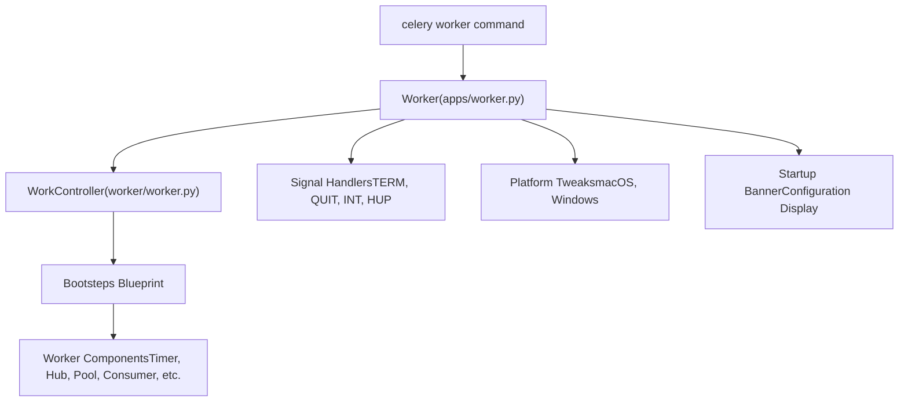
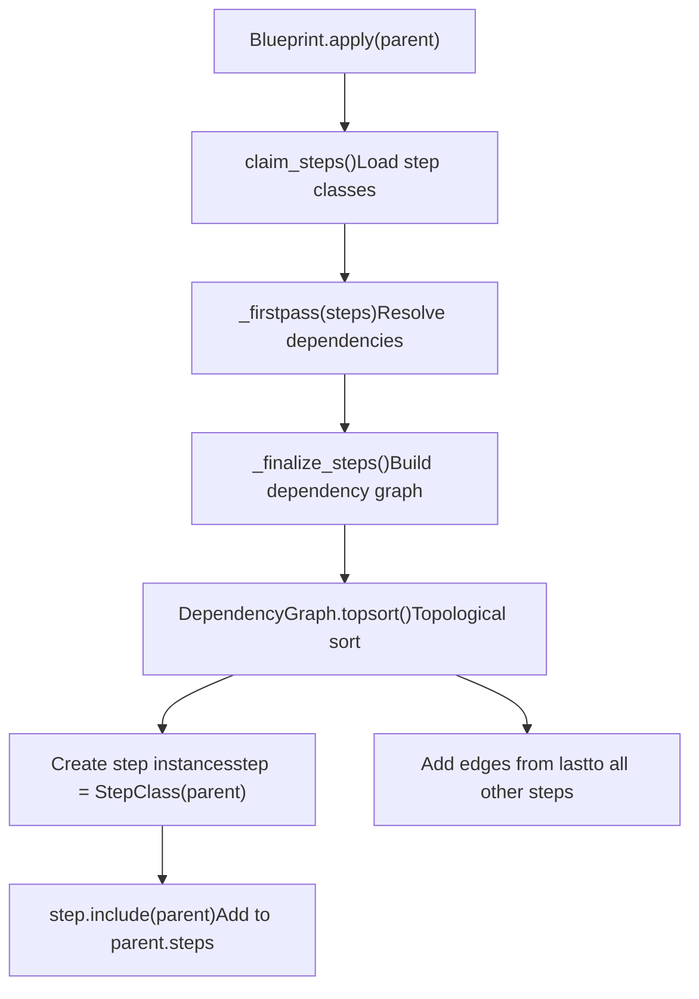
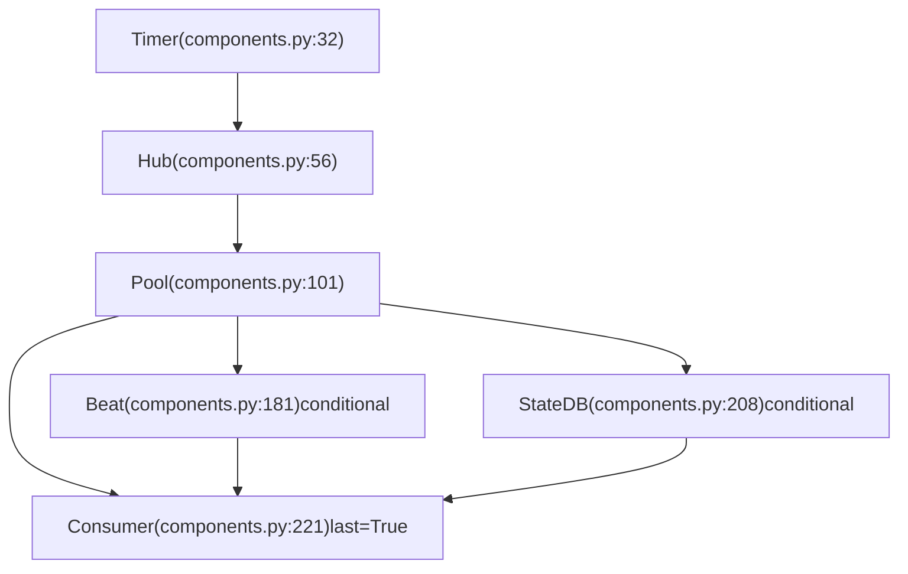
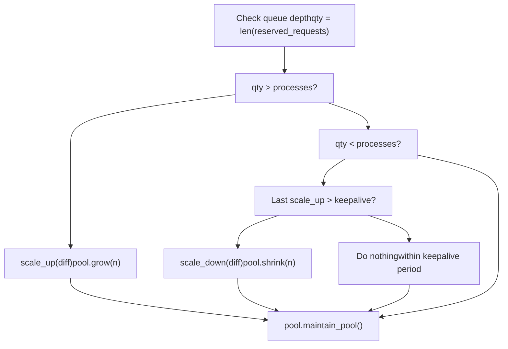
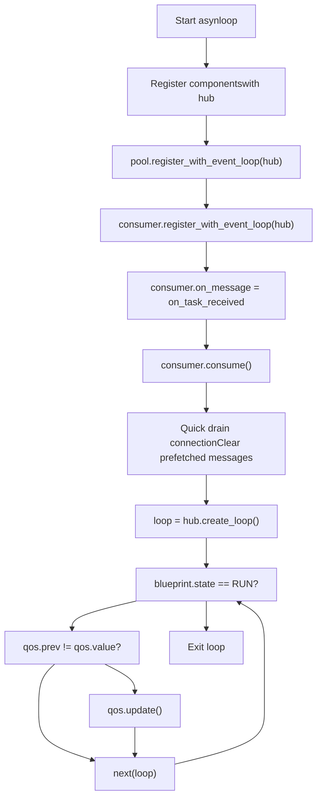
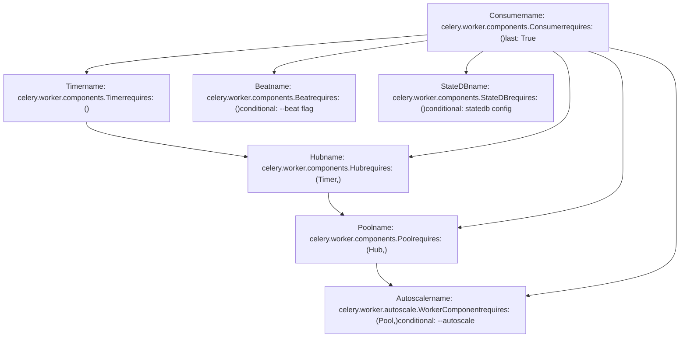

# Worker Architecture and Bootsteps

Relevant source files

-   [celery/bootsteps.py](https://github.com/celery/celery/blob/4d068b56/celery/bootsteps.py)
-   [celery/worker/autoscale.py](https://github.com/celery/celery/blob/4d068b56/celery/worker/autoscale.py)
-   [celery/worker/components.py](https://github.com/celery/celery/blob/4d068b56/celery/worker/components.py)
-   [celery/worker/loops.py](https://github.com/celery/celery/blob/4d068b56/celery/worker/loops.py)

## Purpose and Scope

This document describes the internal architecture of Celery workers and the bootsteps framework that manages component initialization. It covers the dependency-based initialization system, the core worker components, and how they are assembled into a running worker process.

For information about worker lifecycle and shutdown mechanisms, see [Worker Lifecycle and Shutdown](/celery/celery/5.2-worker-lifecycle-and-shutdown). For details about process pool implementations, see [Concurrency Models](/celery/celery/5.3-concurrency-models). For consumer event loop details, see [Consumer and Event Loops](/celery/celery/5.5-consumer-and-event-loops).

## WorkController and Worker Classes

The worker system uses two primary classes with distinct responsibilities:

**WorkController** serves as the core worker implementation, managing component initialization and coordination. It is located in `celery/worker/worker.py` and exported via [celery/worker/\_\_init\_\_.py2](https://github.com/celery/celery/blob/4d068b56/celery/worker/__init__.py#L2-L2)

**Worker** is a program-level wrapper that adds signal handlers, platform-specific tweaks, and command-line interface features. It inherits from `WorkController` and is defined in [celery/apps/worker.py85](https://github.com/celery/celery/blob/4d068b56/celery/apps/worker.py#L85-L85)


**Diagram: Worker Class Hierarchy**

The `Worker` class adds application-level features through lifecycle hooks:

-   `on_before_init`: Sets up worker optimizations and sends initialization signals [celery/apps/worker.py88-98](https://github.com/celery/celery/blob/4d068b56/celery/apps/worker.py#L88-L98)
-   `on_after_init`: Configures logging and output redirection [celery/apps/worker.py100-114](https://github.com/celery/celery/blob/4d068b56/celery/apps/worker.py#L100-L114)
-   `on_init_blueprint`: Finalizes application and applies task execution optimizations [celery/apps/worker.py116-120](https://github.com/celery/celery/blob/4d068b56/celery/apps/worker.py#L116-L120)
-   `on_start`: Displays startup banner and installs platform-specific signal handlers [celery/apps/worker.py122-161](https://github.com/celery/celery/blob/4d068b56/celery/apps/worker.py#L122-L161)

Sources: [celery/worker/\_\_init\_\_.py1-5](https://github.com/celery/celery/blob/4d068b56/celery/worker/__init__.py#L1-L5) [celery/apps/worker.py85-280](https://github.com/celery/celery/blob/4d068b56/celery/apps/worker.py#L85-L280)

## The Bootsteps Framework

The bootsteps framework provides a directed acyclic graph (DAG) based initialization system for managing component dependencies and startup order.

### Core Classes

The framework consists of three primary classes:

| Class | Purpose | File Location |
| --- | --- | --- |
| `Blueprint` | Container for steps, manages initialization order | [celery/bootsteps.py74-264](https://github.com/celery/celery/blob/4d068b56/celery/bootsteps.py#L74-L264) |
| `Step` | Base class for components | [celery/bootsteps.py288-353](https://github.com/celery/celery/blob/4d068b56/celery/bootsteps.py#L288-L353) |
| `StartStopStep` | Step with lifecycle methods (start/stop/terminate) | [celery/bootsteps.py355-384](https://github.com/celery/celery/blob/4d068b56/celery/bootsteps.py#L355-L384) |
| `ConsumerStep` | Step that starts message consumers | [celery/bootsteps.py386-416](https://github.com/celery/celery/blob/4d068b56/celery/bootsteps.py#L386-L416) |

### Blueprint Initialization Process


**Diagram: Blueprint Initialization Flow**

The blueprint applies steps in this sequence:

1.  **Claim Steps**: Load step classes from the types set [celery/bootsteps.py251-256](https://github.com/celery/celery/blob/4d068b56/celery/bootsteps.py#L251-L256)
2.  **First Pass**: Resolve symbolic dependencies and add implicit requirements [celery/bootsteps.py224-233](https://github.com/celery/celery/blob/4d068b56/celery/bootsteps.py#L224-L233)
3.  **Build Graph**: Create a `DependencyGraph` with all steps and their dependencies [celery/bootsteps.py235-241](https://github.com/celery/celery/blob/4d068b56/celery/bootsteps.py#L235-L241)
4.  **Topological Sort**: Determine initialization order respecting dependencies [celery/bootsteps.py247-249](https://github.com/celery/celery/blob/4d068b56/celery/bootsteps.py#L247-L249)
5.  **Instantiate**: Create step instances and add to parent [celery/bootsteps.py205-212](https://github.com/celery/celery/blob/4d068b56/celery/bootsteps.py#L205-L212)

Sources: [celery/bootsteps.py186-212](https://github.com/celery/celery/blob/4d068b56/celery/bootsteps.py#L186-L212) [celery/bootsteps.py224-249](https://github.com/celery/celery/blob/4d068b56/celery/bootsteps.py#L224-L249)

### Step Attributes

Each step class can define these attributes:

| Attribute | Type | Purpose |
| --- | --- | --- |
| `name` | str | Fully qualified step name (auto-generated from module.class) |
| `label` | str | Short name for display in logs and graphs |
| `requires` | tuple | Dependencies (other step classes or string paths) |
| `conditional` | bool | Whether step is conditionally included |
| `last` | bool | Mark this step as terminal (only one allowed per blueprint) |
| `enabled` | bool | Default value for `include_if()` predicate |

The `last` attribute is special: when set to `True`, the blueprint adds edges from this step to all other steps, ensuring it starts last [celery/bootsteps.py242-245](https://github.com/celery/celery/blob/4d068b56/celery/bootsteps.py#L242-L245)

Sources: [celery/bootsteps.py288-353](https://github.com/celery/celery/blob/4d068b56/celery/bootsteps.py#L288-L353)

### Blueprint States

The blueprint tracks its state through the lifecycle:

> **[Mermaid stateDiagram]**
> *(图表结构无法解析)*

**Diagram: Blueprint State Machine**

State constants are defined as:

-   `RUN = 0x1`: Blueprint is running [celery/bootsteps.py24](https://github.com/celery/celery/blob/4d068b56/celery/bootsteps.py#L24-L24)
-   `CLOSE = 0x2`: Blueprint is closing [celery/bootsteps.py25](https://github.com/celery/celery/blob/4d068b56/celery/bootsteps.py#L25-L25)
-   `TERMINATE = 0x3`: Blueprint is terminating [celery/bootsteps.py26](https://github.com/celery/celery/blob/4d068b56/celery/bootsteps.py#L26-L26)

Sources: [celery/bootsteps.py23-27](https://github.com/celery/celery/blob/4d068b56/celery/bootsteps.py#L23-L27) [celery/bootsteps.py89-97](https://github.com/celery/celery/blob/4d068b56/celery/bootsteps.py#L89-L97)

## Worker Components

The worker blueprint contains six core components, each implemented as a bootstep in [celery/worker/components.py](https://github.com/celery/celery/blob/4d068b56/celery/worker/components.py):

### Component Overview


**Diagram: Worker Component Dependencies**

### Timer Component

The `Timer` component creates a timer instance for scheduling delayed operations. It selects between two timer implementations based on whether the worker uses an event loop:

-   **Event Loop Mode**: Uses `kombu.asynchronous.timer.Timer` with max interval of 10 seconds [celery/worker/components.py38](https://github.com/celery/celery/blob/4d068b56/celery/worker/components.py#L38-L38)
-   **Non-Event Loop Mode**: Uses pool-specific timer (e.g., `billiard.pool.Timer` for prefork) [celery/worker/components.py43](https://github.com/celery/celery/blob/4d068b56/celery/worker/components.py#L43-L43)

The timer is created in the `create()` method with error and tick callbacks for monitoring [celery/worker/components.py35-47](https://github.com/celery/celery/blob/4d068b56/celery/worker/components.py#L35-L47)

Sources: [celery/worker/components.py32-54](https://github.com/celery/celery/blob/4d068b56/celery/worker/components.py#L32-L54)

### Hub Component

The `Hub` component manages the event loop for asynchronous operations. It is a `StartStopStep` that:

**Requires**: `Timer` component [celery/worker/components.py59](https://github.com/celery/celery/blob/4d068b56/celery/worker/components.py#L59-L59)

**Conditional**: Only included when `worker.use_eventloop` is true [celery/worker/components.py65-66](https://github.com/celery/celery/blob/4d068b56/celery/worker/components.py#L65-L66)

**Creation**: Gets or creates a `kombu.asynchronous.Hub` instance and patches thread primitives [celery/worker/components.py68-74](https://github.com/celery/celery/blob/4d068b56/celery/worker/components.py#L68-L74)

The hub's poller is initialized in the `start()` method to ensure it's ready before the event loop starts [celery/worker/components.py77-81](https://github.com/celery/celery/blob/4d068b56/celery/worker/components.py#L77-L81)

Thread primitive patching replaces locks with `DummyLock` for single-threaded event loop operation [celery/worker/components.py89-98](https://github.com/celery/celery/blob/4d068b56/celery/worker/components.py#L89-L98)

Sources: [celery/worker/components.py56-99](https://github.com/celery/celery/blob/4d068b56/celery/worker/components.py#L56-L99)

### Pool Component

The `Pool` component manages the process/thread pool for task execution:

**Requires**: `Hub` component [celery/worker/components.py115](https://github.com/celery/celery/blob/4d068b56/celery/worker/components.py#L115-L115)

**Attributes Set**:

-   `worker.pool`: The pool instance
-   `worker.max_concurrency`: Maximum workers (for autoscaling)
-   `worker.min_concurrency`: Minimum workers (usually equals `concurrency`)

The pool is instantiated with these key parameters:

-   `maxtasksperchild`: Process recycling threshold [celery/worker/components.py157](https://github.com/celery/celery/blob/4d068b56/celery/worker/components.py#L157-L157)
-   `max_memory_per_child`: Memory-based recycling threshold [celery/worker/components.py158](https://github.com/celery/celery/blob/4d068b56/celery/worker/components.py#L158-L158)
-   `timeout`/`soft_timeout`: Task time limits [celery/worker/components.py159-160](https://github.com/celery/celery/blob/4d068b56/celery/worker/components.py#L159-L160)
-   `semaphore`: Bounded semaphore for non-threaded pools [celery/worker/components.py147](https://github.com/celery/celery/blob/4d068b56/celery/worker/components.py#L147-L147)

For non-event loop pools, a `LaxBoundedSemaphore` controls concurrent task execution [celery/worker/components.py147-149](https://github.com/celery/celery/blob/4d068b56/celery/worker/components.py#L147-L149)

Sources: [celery/worker/components.py101-179](https://github.com/celery/celery/blob/4d068b56/celery/worker/components.py#L101-L179)

### Beat Component

The `Beat` component embeds a Beat scheduler within the worker process:

**Conditional**: Only enabled when `--beat` argument is provided [celery/worker/components.py188-193](https://github.com/celery/celery/blob/4d068b56/celery/worker/components.py#L188-L193)

**Error Checking**: Raises `ImproperlyConfigured` if used with eventlet/gevent pools [celery/worker/components.py198-201](https://github.com/celery/celery/blob/4d068b56/celery/worker/components.py#L198-L201)

**Creates**: `celery.beat.EmbeddedService` instance with schedule filename and scheduler class [celery/worker/components.py202-204](https://github.com/celery/celery/blob/4d068b56/celery/worker/components.py#L202-L204)

This component allows a worker to schedule periodic tasks without running a separate Beat process, but is incompatible with green thread pools.

Sources: [celery/worker/components.py181-206](https://github.com/celery/celery/blob/4d068b56/celery/worker/components.py#L181-L206)

### StateDB Component

The `StateDB` component manages persistent worker state across restarts:

**Conditional**: Only enabled when `worker.statedb` is configured [celery/worker/components.py212](https://github.com/celery/celery/blob/4d068b56/celery/worker/components.py#L212-L212)

**Creates**: `worker.state.Persistent` instance that saves state to a database file [celery/worker/components.py217](https://github.com/celery/celery/blob/4d068b56/celery/worker/components.py#L217-L217)

**Persistence**: Registers `atexit` handler to save state on worker exit [celery/worker/components.py218](https://github.com/celery/celery/blob/4d068b56/celery/worker/components.py#L218-L218)

The state database stores information about revoked tasks and other worker state that should survive restarts.

Sources: [celery/worker/components.py208-219](https://github.com/celery/celery/blob/4d068b56/celery/worker/components.py#L208-L219)

### Consumer Component

The `Consumer` component is the heart of the worker, handling message consumption and task execution:

**Requires**: All previous components (via dependencies)

**Last**: Marked with `last = True`, ensuring it starts after all other components [celery/worker/components.py224](https://github.com/celery/celery/blob/4d068b56/celery/worker/components.py#L224-L224)

**Prefetch Calculation**: Computes initial prefetch count based on concurrency and multiplier:

```
if max_concurrency:
    prefetch_count = max(max_concurrency, 1) * prefetch_multiplier
else:
    prefetch_count = concurrency * prefetch_multiplier
```
[celery/worker/components.py227-230](https://github.com/celery/celery/blob/4d068b56/celery/worker/components.py#L227-L230)

The consumer is instantiated with references to pool, timer, hub, and the task handler callback [celery/worker/components.py231-245](https://github.com/celery/celery/blob/4d068b56/celery/worker/components.py#L231-L245)

Sources: [celery/worker/components.py221-247](https://github.com/celery/celery/blob/4d068b56/celery/worker/components.py#L221-L247)

## Autoscaler Component

The `Autoscaler` is an optional component that dynamically adjusts pool size based on queue depth. It is defined in [celery/worker/autoscale.py](https://github.com/celery/celery/blob/4d068b56/celery/worker/autoscale.py)

### WorkerComponent Bootstep

The autoscaler is integrated via a `WorkerComponent` bootstep:

**Requires**: `Pool` component [celery/worker/autoscale.py36](https://github.com/celery/celery/blob/4d068b56/celery/worker/autoscale.py#L36-L36)

**Conditional**: Only enabled when `worker.autoscale` is set (from `--autoscale` option) [celery/worker/autoscale.py39](https://github.com/celery/celery/blob/4d068b56/celery/worker/autoscale.py#L39-L39)

**Dual Mode Operation**:

-   **Non-Event Loop**: Creates autoscaler as a background thread [celery/worker/autoscale.py48](https://github.com/celery/celery/blob/4d068b56/celery/worker/autoscale.py#L48-L48)
-   **Event Loop**: Registers scaling callback with hub timer [celery/worker/autoscale.py50-54](https://github.com/celery/celery/blob/4d068b56/celery/worker/autoscale.py#L50-L54)

Sources: [celery/worker/autoscale.py31-59](https://github.com/celery/celery/blob/4d068b56/celery/worker/autoscale.py#L31-L59)

### Autoscaler Algorithm


**Diagram: Autoscaler Decision Flow**

The autoscaler uses a keepalive period (default 30 seconds) to prevent rapid scaling oscillations [celery/worker/autoscale.py28](https://github.com/celery/celery/blob/4d068b56/celery/worker/autoscale.py#L28-L28) [celery/worker/autoscale.py116-118](https://github.com/celery/celery/blob/4d068b56/celery/worker/autoscale.py#L116-L118)

Queue depth is determined by `len(state.reserved_requests)`, representing tasks currently reserved or executing [celery/worker/autoscale.py149-150](https://github.com/celery/celery/blob/4d068b56/celery/worker/autoscale.py#L149-L150)

Sources: [celery/worker/autoscale.py61-155](https://github.com/celery/celery/blob/4d068b56/celery/worker/autoscale.py#L61-L155)

## Component Initialization Flow

The complete worker initialization sequence orchestrated by the blueprint:

> **[Mermaid sequence]**
> *(图表结构无法解析)*

**Diagram: Worker Component Initialization Sequence**

The initialization happens in three phases:

1.  **Instantiation**: Each step's `__init__` is called to set initial state [celery/bootsteps.py205](https://github.com/celery/celery/blob/4d068b56/celery/bootsteps.py#L205-L205)
2.  **Creation**: Each step's `create()` method instantiates its managed object [celery/bootsteps.py206](https://github.com/celery/celery/blob/4d068b56/celery/bootsteps.py#L206-L206)
3.  **Startup**: Each step's `start()` method activates the component [celery/bootsteps.py113-117](https://github.com/celery/celery/blob/4d068b56/celery/bootsteps.py#L113-L117)

Sources: [celery/bootsteps.py109-117](https://github.com/celery/celery/blob/4d068b56/celery/bootsteps.py#L109-L117) [celery/bootsteps.py199-212](https://github.com/celery/celery/blob/4d068b56/celery/bootsteps.py#L199-L212)

## Event Loop Selection

The worker supports two event loop strategies determined by the `use_eventloop` flag:

### Asynchronous Loop (asynloop)

Used when:

-   Transport supports async operations (e.g., AMQP, Redis)
-   Pool type is not blocking (eventlet, gevent, or prefork with hub)

The async loop registers callbacks with the hub and uses `hub.create_loop()` to iterate [celery/worker/loops.py50-98](https://github.com/celery/celery/blob/4d068b56/celery/worker/loops.py#L50-L98):


**Diagram: Asynchronous Event Loop Flow**

Key features:

-   Non-blocking operation using hub poller [celery/worker/loops.py82-98](https://github.com/celery/celery/blob/4d068b56/celery/worker/loops.py#L82-L98)
-   QoS updates batched between iterations [celery/worker/loops.py92-93](https://github.com/celery/celery/blob/4d068b56/celery/worker/loops.py#L92-L93)
-   Heartbeat monitoring via hub timer [celery/worker/loops.py59](https://github.com/celery/celery/blob/4d068b56/celery/worker/loops.py#L59-L59)

Sources: [celery/worker/loops.py50-98](https://github.com/celery/celery/blob/4d068b56/celery/worker/loops.py#L50-L98)

### Synchronous Loop (synloop)

Used when:

-   Transport doesn't support async (e.g., SQS, some custom transports)
-   Pool requires blocking operations

The sync loop uses `connection.drain_events()` with timeout [celery/worker/loops.py101-136](https://github.com/celery/celery/blob/4d068b56/celery/worker/loops.py#L101-L136):

| Operation | Async Loop | Sync Loop |
| --- | --- | --- |
| Message retrieval | Hub poller callbacks | `drain_events(timeout=2.0)` |
| QoS updates | Between hub iterations | Before each drain |
| Heartbeat | Hub timer callback | Green pool timer or disabled |
| Blocking | Non-blocking | 2-second timeout |

The sync loop calls `perform_pending_operations()` before each drain to process control messages and other pending work [celery/worker/loops.py124](https://github.com/celery/celery/blob/4d068b56/celery/worker/loops.py#L124-L124)

Sources: [celery/worker/loops.py101-136](https://github.com/celery/celery/blob/4d068b56/celery/worker/loops.py#L101-L136)

## Practical Example: Component Dependencies

To illustrate the dependency system, here's how the actual worker components depend on each other:


**Diagram: Actual Worker Component Dependency Graph**

The `Consumer` step's `last=True` attribute causes the blueprint to add implicit dependencies from Consumer to all other steps, ensuring it initializes last [celery/bootsteps.py242-245](https://github.com/celery/celery/blob/4d068b56/celery/bootsteps.py#L242-L245)

Conditional steps (`Beat`, `StateDB`, `Autoscaler`) are only included if their conditions are met [celery/worker/components.py190-193](https://github.com/celery/celery/blob/4d068b56/celery/worker/components.py#L190-L193) [celery/worker/components.py212](https://github.com/celery/celery/blob/4d068b56/celery/worker/components.py#L212-L212) [celery/worker/autoscale.py39](https://github.com/celery/celery/blob/4d068b56/celery/worker/autoscale.py#L39-L39)

Sources: [celery/worker/components.py16-247](https://github.com/celery/celery/blob/4d068b56/celery/worker/components.py#L16-L247) [celery/worker/autoscale.py31-59](https://github.com/celery/celery/blob/4d068b56/celery/worker/autoscale.py#L31-L59) [celery/bootsteps.py221-249](https://github.com/celery/celery/blob/4d068b56/celery/bootsteps.py#L221-L249)

## Blueprint Visualization

The blueprint can generate a DOT graph representation for debugging initialization order:

```
# Example: Print worker blueprint graph
from celery import Celery
from celery.worker import WorkController

app = Celery()
worker = WorkController(app=app, hostname='worker@example')
print(worker.blueprint.graph)
```
The `StepFormatter` class provides specialized rendering for bootsteps:

-   Blueprint steps (last=True) use parallelogram shape with `⧉` prefix [celery/bootsteps.py42-48](https://github.com/celery/celery/blob/4d068b56/celery/bootsteps.py#L42-L48)
-   Conditional steps use circle prefix `∘` [celery/bootsteps.py43](https://github.com/celery/celery/blob/4d068b56/celery/bootsteps.py#L43-L43)
-   Standard dependency edges shown with arrows
-   Last step edges shown without arrowheads [celery/bootsteps.py68-71](https://github.com/celery/celery/blob/4d068b56/celery/bootsteps.py#L68-L71)

Sources: [celery/bootsteps.py39-72](https://github.com/celery/celery/blob/4d068b56/celery/bootsteps.py#L39-L72)
