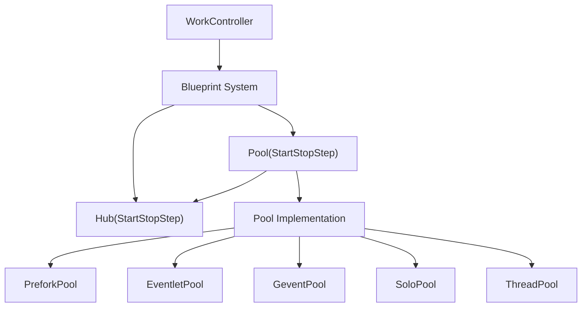
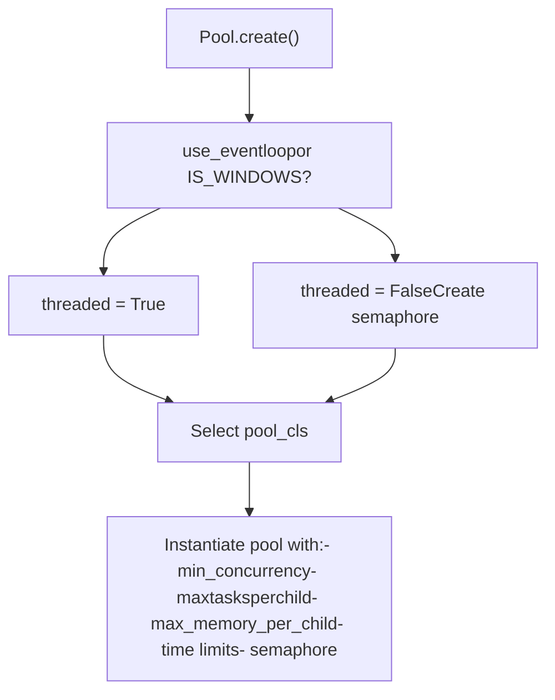
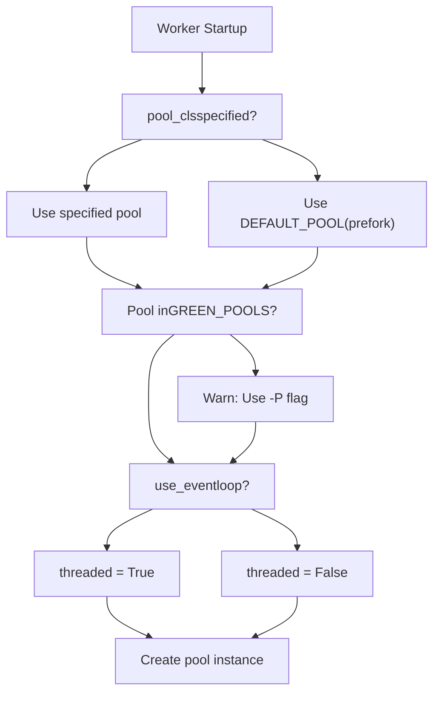
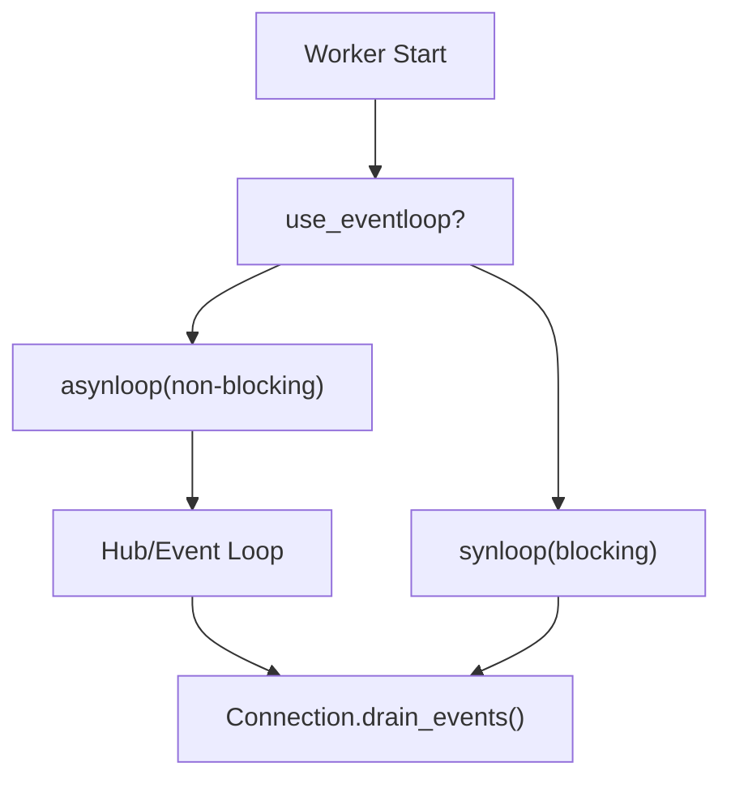

# Concurrency Models

Relevant source files

-   [.bumpversion.cfg](https://github.com/celery/celery/blob/4d068b56/.bumpversion.cfg)
-   [Changelog.rst](https://github.com/celery/celery/blob/4d068b56/Changelog.rst)
-   [README.rst](https://github.com/celery/celery/blob/4d068b56/README.rst)
-   [celery/\_\_init\_\_.py](https://github.com/celery/celery/blob/4d068b56/celery/__init__.py)
-   [celery/bootsteps.py](https://github.com/celery/celery/blob/4d068b56/celery/bootsteps.py)
-   [celery/contrib/sphinx.py](https://github.com/celery/celery/blob/4d068b56/celery/contrib/sphinx.py)
-   [celery/worker/autoscale.py](https://github.com/celery/celery/blob/4d068b56/celery/worker/autoscale.py)
-   [celery/worker/components.py](https://github.com/celery/celery/blob/4d068b56/celery/worker/components.py)
-   [celery/worker/loops.py](https://github.com/celery/celery/blob/4d068b56/celery/worker/loops.py)
-   [docs/getting-started/introduction.rst](https://github.com/celery/celery/blob/4d068b56/docs/getting-started/introduction.rst)
-   [docs/history/changelog-5.5.rst](https://github.com/celery/celery/blob/4d068b56/docs/history/changelog-5.5.rst)
-   [docs/history/changelog-5.6.rst](https://github.com/celery/celery/blob/4d068b56/docs/history/changelog-5.6.rst)
-   [docs/history/index.rst](https://github.com/celery/celery/blob/4d068b56/docs/history/index.rst)
-   [docs/history/whatsnew-5.5.rst](https://github.com/celery/celery/blob/4d068b56/docs/history/whatsnew-5.5.rst)
-   [docs/history/whatsnew-5.6.rst](https://github.com/celery/celery/blob/4d068b56/docs/history/whatsnew-5.6.rst)
-   [docs/includes/introduction.txt](https://github.com/celery/celery/blob/4d068b56/docs/includes/introduction.txt)
-   [docs/includes/resources.txt](https://github.com/celery/celery/blob/4d068b56/docs/includes/resources.txt)
-   [docs/index.rst](https://github.com/celery/celery/blob/4d068b56/docs/index.rst)

## Purpose and Scope

This document describes the concurrency models available in Celery workers for executing tasks. A concurrency model determines how a worker process executes multiple tasks simultaneously. Celery supports multiple pool implementations that provide different concurrency strategies optimized for various workload types.

For information about worker architecture and lifecycle, see [Worker Architecture and Bootsteps](/celery/celery/5.1-worker-architecture-and-bootsteps). For worker configuration options, see [Worker Configuration and Control](/celery/celery/5.4-worker-configuration-and-control).

## Overview

Celery workers execute tasks using a **pool** abstraction that manages concurrent execution. The pool acts as a layer between the worker's consumer (which receives task messages) and the actual task execution. Different pool implementations provide different concurrency strategies:

-   **prefork**: Uses multiprocessing for parallel execution (default)
-   **eventlet**: Uses cooperative multitasking with green threads
-   **gevent**: Uses cooperative multitasking with greenlets
-   **solo**: Executes tasks synchronously in the main process
-   **threads**: Uses threading for concurrent execution

Sources: [celery/app/defaults.py11](https://github.com/celery/celery/blob/4d068b56/celery/app/defaults.py#L11-L11) [celery/worker/components.py18](https://github.com/celery/celery/blob/4d068b56/celery/worker/components.py#L18-L18) [docs/userguide/workers.rst392-410](https://github.com/celery/celery/blob/4d068b56/docs/userguide/workers.rst#L392-L410)

## Pool Architecture

### Pool Bootstep Integration

The Pool component integrates with the worker through the bootsteps system. It is a `StartStopStep` that manages the pool lifecycle.


**Diagram: Pool Integration Through Bootsteps**

Sources: [celery/worker/components.py101-179](https://github.com/celery/celery/blob/4d068b56/celery/worker/components.py#L101-L179) [celery/bootsteps.py355-384](https://github.com/celery/celery/blob/4d068b56/celery/bootsteps.py#L355-L384)

### Pool Bootstep Implementation

The Pool bootstep is defined in `celery.worker.components.Pool`:

| Method | Description |
| --- | --- |
| `__init__` | Parses autoscale settings, initializes pool attributes |
| `create` | Instantiates the selected pool implementation |
| `close` | Gracefully closes the pool |
| `terminate` | Force terminates the pool |
| `register_with_event_loop` | Registers pool with event loop (for async pools) |

The `create` method determines pool configuration based on worker settings:


**Diagram: Pool Creation Flow**

Sources: [celery/worker/components.py138-172](https://github.com/celery/celery/blob/4d068b56/celery/worker/components.py#L138-L172)

## Available Concurrency Models

### Prefork Pool (Default)

The prefork pool uses Python's `multiprocessing` module to create separate worker processes. This is the default and most commonly used pool type.

**Characteristics:**

-   **Concurrency**: True parallelism using separate processes
-   **Isolation**: Each task runs in a separate process with its own memory space
-   **CPU-bound tasks**: Excellent for CPU-intensive workloads
-   **Memory**: Higher memory overhead due to separate processes
-   **Signal handling**: Supports time limits via signals

**Configuration:**

```
# Default configuration
worker_pool = 'prefork'  # or omit, as this is default
worker_concurrency = None  # defaults to number of CPUs
```
**Default Settings:**

| Setting | Default | Description |
| --- | --- | --- |
| `DEFAULT_POOL` | `'prefork'` | Default pool type |
| `worker_concurrency` | `None` | Number of CPUs if None |
| `worker_max_tasks_per_child` | `None` | Restart workers after N tasks |
| `worker_max_memory_per_child` | `None` | Restart workers after memory limit |

**Process Management:**

-   Supports autoscaling (see [Autoscaling](/celery/celery/5.6-autoscaling))
-   Supports `maxtasksperchild` for periodic worker restart
-   Supports `max_memory_per_child` for memory-based restart

Sources: [celery/app/defaults.py11](https://github.com/celery/celery/blob/4d068b56/celery/app/defaults.py#L11-L11) [celery/app/defaults.py338-340](https://github.com/celery/celery/blob/4d068b56/celery/app/defaults.py#L338-L340) [docs/userguide/workers.rst392-410](https://github.com/celery/celery/blob/4d068b56/docs/userguide/workers.rst#L392-L410)

### Eventlet Pool

The eventlet pool uses cooperative multitasking with green threads. Tasks yield control during I/O operations, allowing thousands of concurrent connections.

**Characteristics:**

-   **Concurrency**: Cooperative multitasking (not parallel)
-   **I/O-bound tasks**: Excellent for I/O-intensive workloads
-   **Memory**: Low memory overhead
-   **Scalability**: Can handle thousands of concurrent tasks
-   **Limitations**: No true parallelism; CPU-bound tasks block the pool

**Requirements:**

```
pip install celery[eventlet]
```
**Usage:**

```
celery -A proj worker -P eventlet -c 1000
```
**Important Considerations:**

-   Must be specified via `-P` flag, not `worker_pool` setting
-   Monkey patching is applied early in worker startup
-   Not compatible with embedded beat scheduler (`-B` flag)
-   Time limits work differently than prefork

Sources: [celery/worker/components.py18](https://github.com/celery/celery/blob/4d068b56/celery/worker/components.py#L18-L18) [celery/worker/components.py20-23](https://github.com/celery/celery/blob/4d068b56/celery/worker/components.py#L20-L23) [docs/userguide/workers.rst396-397](https://github.com/celery/celery/blob/4d068b56/docs/userguide/workers.rst#L396-L397)

### Gevent Pool

The gevent pool is similar to eventlet but uses the gevent library for cooperative multitasking.

**Characteristics:**

-   **Concurrency**: Cooperative multitasking with greenlets
-   **I/O-bound tasks**: Excellent for I/O-intensive workloads
-   **API**: Similar to eventlet but different underlying implementation
-   **Compatibility**: Better compatibility with some C extensions

**Requirements:**

```
pip install celery[gevent]
```
**Usage:**

```
celery -A proj worker -P gevent -c 1000
```
**Gevent vs Eventlet:**

-   Gevent uses libev for event loop (faster)
-   Better C extension compatibility
-   Different monkey patching behavior
-   Similar use cases and limitations

Sources: [celery/worker/components.py18](https://github.com/celery/celery/blob/4d068b56/celery/worker/components.py#L18-L18) [docs/getting-started/first-steps-with-celery.rst116](https://github.com/celery/celery/blob/4d068b56/docs/getting-started/first-steps-with-celery.rst#L116-L116)

### Solo Pool

The solo pool executes tasks synchronously in the main worker process without any concurrency.

**Characteristics:**

-   **Concurrency**: None (sequential execution)
-   **Use case**: Development, debugging, or testing
-   **Simplicity**: No process/thread management overhead
-   **Limitations**: Only one task at a time; remote control commands may block

**Usage:**

```
celery -A proj worker -P solo
```
**When to Use:**

-   Debugging tasks with a debugger
-   Testing task behavior in isolation
-   Simplifying deployment in resource-constrained environments
-   Tasks that must not run concurrently

**Remote Control Limitation:**

> The solo pool supports remote control commands, but any task executing will block any waiting control command, so it is of limited use if the worker is very busy.

Sources: [docs/userguide/workers.rst425-451](https://github.com/celery/celery/blob/4d068b56/docs/userguide/workers.rst#L425-L451)

### Threads Pool

The threads pool uses Python threading for concurrent execution.

**Characteristics:**

-   **Concurrency**: Concurrent but not parallel (due to GIL)
-   **Use case**: I/O-bound tasks on Windows
-   **GIL**: Limited by Python's Global Interpreter Lock
-   **Compatibility**: Works on all platforms including Windows

**Usage:**

```
celery -A proj worker -P threads
```
**Considerations:**

-   Limited by Python GIL for CPU-bound tasks
-   Better than solo but not as efficient as eventlet/gevent for I/O
-   Default choice on Windows when eventloop is not available

Sources: [celery/worker/components.py143](https://github.com/celery/celery/blob/4d068b56/celery/worker/components.py#L143-L143)

## Pool Selection and Configuration

### Selection Process


**Diagram: Pool Selection Flow**

Sources: [celery/worker/components.py138-172](https://github.com/celery/celery/blob/4d068b56/celery/worker/components.py#L138-L172)

### Configuration Options

**Command-Line Selection:**

```
# Use prefork (default)
celery -A proj worker

# Use eventlet
celery -A proj worker -P eventlet -c 1000

# Use gevent
celery -A proj worker -P gevent -c 500

# Use solo
celery -A proj worker -P solo

# Use threads
celery -A proj worker -P threads -c 10
```
**Concurrency Configuration:**

```
# Set concurrency level
celery -A proj worker -P prefork -c 4

# Use autoscaling (prefork only)
celery -A proj worker --autoscale=10,3  # max=10, min=3
```
**Configuration Settings:**

| Setting | Type | Default | Description |
| --- | --- | --- | --- |
| `worker_pool` | str | `'prefork'` | Pool implementation class |
| `worker_concurrency` | int | CPU count | Number of concurrent workers |
| `worker_autoscaler` | str | `'celery.worker.autoscale:Autoscaler'` | Autoscaler class |
| `worker_pool_putlocks` | bool | `True` | Use putlocks in pool |
| `worker_pool_restarts` | bool | `False` | Allow pool restarts |

Sources: [celery/app/defaults.py313-362](https://github.com/celery/celery/blob/4d068b56/celery/app/defaults.py#L313-L362) [celery/worker/components.py117-172](https://github.com/celery/celery/blob/4d068b56/celery/worker/components.py#L117-L172)

### Warning About Green Pools

If you set `worker_pool` to `'eventlet'` or `'gevent'` in configuration, Celery will emit a warning:

> The worker\_pool setting shouldn't be used to select the eventlet/gevent pools, instead you *must use the -P* argument so that patches are applied as early as possible.

This is because eventlet and gevent require monkey patching of standard library modules, which must happen before other imports.

Sources: [celery/worker/components.py25-29](https://github.com/celery/celery/blob/4d068b56/celery/worker/components.py#L25-L29) [celery/worker/components.py141-142](https://github.com/celery/celery/blob/4d068b56/celery/worker/components.py#L141-L142)

## Pool Execution Models

### Task Execution Flow

> **[Mermaid sequence]**
> *(图表结构无法解析)*

**Diagram: Task Execution Across Pool Types**

Sources: [celery/worker/loops.py50-99](https://github.com/celery/celery/blob/4d068b56/celery/worker/loops.py#L50-L99) [celery/worker/components.py138-172](https://github.com/celery/celery/blob/4d068b56/celery/worker/components.py#L138-L172)

### Threaded vs Non-Threaded Mode

The Pool bootstep determines whether to operate in "threaded" or "non-threaded" mode:

```
threaded = not w.use_eventloop or IS_WINDOWS
```
**Non-Threaded Mode (Async I/O):**

-   Used with prefork pool when event loop is available
-   Uses semaphore for flow control (`LaxBoundedSemaphore`)
-   Tasks are sent to pool processes via async I/O
-   More efficient but requires event loop support

**Threaded Mode:**

-   Used with green pools (eventlet/gevent) or on Windows
-   Uses threading primitives for synchronization
-   Fallback when event loop is not available
-   `pool_putlocks` enabled for thread-safe queue operations

Sources: [celery/worker/components.py143-153](https://github.com/celery/celery/blob/4d068b56/celery/worker/components.py#L143-L153)

### Semaphore and Flow Control

In non-threaded mode, Celery uses a `LaxBoundedSemaphore` to control task flow:

```
if not threaded:
    semaphore = w.semaphore = LaxBoundedSemaphore(procs)
    w._quick_acquire = w.semaphore.acquire
    w._quick_release = w.semaphore.release
```
This prevents the worker from accepting more tasks than it can handle based on the number of pool processes.

Sources: [celery/worker/components.py144-153](https://github.com/celery/celery/blob/4d068b56/celery/worker/components.py#L144-L153)

## Comparison and Use Cases

### Feature Comparison

| Feature | Prefork | Eventlet | Gevent | Solo | Threads |
| --- | --- | --- | --- | --- | --- |
| **True Parallelism** | ✓ | ✗ | ✗ | ✗ | ✗ (GIL) |
| **CPU-Bound Tasks** | Excellent | Poor | Poor | Poor | Poor |
| **I/O-Bound Tasks** | Good | Excellent | Excellent | Poor | Good |
| **Memory Efficiency** | Moderate | High | High | High | High |
| **Concurrency Scale** | 10s-100s | 1000s | 1000s | 1 | 10s |
| **Time Limits** | Hard+Soft | Soft only | Soft only | Both | Soft only |
| **Process Isolation** | ✓ | ✗ | ✗ | ✗ | ✗ |
| **Autoscaling** | ✓ | ✗ | ✗ | ✗ | ✗ |
| **Windows Support** | ✓ | ✗ | ✗ | ✓ | ✓ |
| **Debugging** | Harder | Harder | Harder | Easy | Moderate |

### Use Case Recommendations

**Use Prefork When:**

-   Tasks are CPU-intensive
-   You need process isolation
-   Memory usage is not a constraint
-   You want autoscaling support
-   You need hard time limits via signals

**Use Eventlet/Gevent When:**

-   Tasks are I/O-bound (HTTP requests, database queries)
-   You need to handle thousands of concurrent connections
-   Memory efficiency is critical
-   Tasks yield during I/O operations
-   You don't need CPU-intensive operations

**Use Solo When:**

-   Debugging tasks with a debugger
-   Running in development
-   Testing task behavior
-   Tasks must not run concurrently
-   Simplifying deployment

**Use Threads When:**

-   Running on Windows without eventlet/gevent
-   I/O-bound tasks with moderate concurrency needs
-   You need thread-safe libraries

Sources: [docs/userguide/workers.rst392-410](https://github.com/celery/celery/blob/4d068b56/docs/userguide/workers.rst#L392-L410) [docs/userguide/workers.rst695-733](https://github.com/celery/celery/blob/4d068b56/docs/userguide/workers.rst#L695-L733)

## Time Limits Support

Time limits behave differently across pool types:

| Pool Type | Hard Time Limit | Soft Time Limit |
| --- | --- | --- |
| **Prefork** | ✓ (SIGKILL) | ✓ (SoftTimeLimitExceeded) |
| **Gevent** | ✗ | ✓ (greenlet.kill) |
| **Eventlet** | ✗ | ✓ (timeout) |
| **Solo** | ✓ (SIGKILL) | ✓ (SoftTimeLimitExceeded) |
| **Threads** | ✗ | ✓ (exception) |

**Prefork Pool:**

-   Soft time limit raises `SoftTimeLimitExceeded` in task
-   Hard time limit sends `SIGKILL` to worker process

**Green Pools:**

-   Only soft time limits supported
-   Uses greenlet/eventlet timeout mechanisms
-   Cannot forcefully terminate greenlets

Sources: [docs/userguide/workers.rst695-733](https://github.com/celery/celery/blob/4d068b56/docs/userguide/workers.rst#L695-L733)

## Event Loop Integration

### Event Loop vs Synchronous Loop

Celery workers use either an asynchronous event loop (`asynloop`) or synchronous loop (`synloop`) depending on pool type and broker support:


**Diagram: Event Loop Selection**

**Asynloop (Non-blocking):**

-   Used when transport supports async I/O
-   Integrates with kombu Hub
-   More efficient for prefork with AMQP/Redis
-   Pool registers with event loop via `register_with_event_loop()`

**Synloop (Blocking):**

-   Fallback for transports without async support
-   Uses `connection.drain_events(timeout=2.0)` blocking call
-   Simpler but less efficient

Sources: [celery/worker/loops.py50-136](https://github.com/celery/celery/blob/4d068b56/celery/worker/loops.py#L50-L136) [celery/worker/components.py177-178](https://github.com/celery/celery/blob/4d068b56/celery/worker/components.py#L177-L178)

### Pool Event Loop Registration

The Pool bootstep provides a `register_with_event_loop()` method:

```
def register_with_event_loop(self, w, hub):
    w.pool.register_with_event_loop(hub)
```
This allows pools to integrate with the Hub for async I/O operations. The prefork pool uses this for non-blocking task submission.

Sources: [celery/worker/components.py177-178](https://github.com/celery/celery/blob/4d068b56/celery/worker/components.py#L177-L178)

## Pool Process Management

### Worker Process Lifecycle (Prefork)

> **[Mermaid stateDiagram]**
> *(图表结构无法解析)*

**Diagram: Prefork Pool Process Lifecycle**

### Pool Configuration Parameters

The Pool bootstep instantiates pools with these parameters:

```
pool = self.instantiate(
    w.pool_cls, w.min_concurrency,
    initargs=(w.app, w.hostname),
    maxtasksperchild=w.max_tasks_per_child,
    max_memory_per_child=w.max_memory_per_child,
    timeout=w.time_limit,
    soft_timeout=w.soft_time_limit,
    putlocks=w.pool_putlocks and threaded,
    lost_worker_timeout=w.worker_lost_wait,
    threads=threaded,
    max_restarts=max_restarts,
    allow_restart=allow_restart,
    forking_enable=True,
    semaphore=semaphore,
    sched_strategy=self.optimization,
    app=w.app,
)
```
| Parameter | Description |
| --- | --- |
| `min_concurrency` | Initial number of worker processes |
| `initargs` | Arguments passed to worker process init |
| `maxtasksperchild` | Restart worker after N tasks (prevents leaks) |
| `max_memory_per_child` | Restart worker after memory limit |
| `timeout` | Hard time limit for tasks |
| `soft_timeout` | Soft time limit for tasks |
| `putlocks` | Use locks for task queue operations |
| `lost_worker_timeout` | Timeout before considering worker lost |
| `threads` | Whether to use threaded or async mode |
| `max_restarts` | Maximum pool restarts (100 for non-threaded) |
| `allow_restart` | Allow pool to restart on failure |
| `semaphore` | Semaphore for flow control (non-threaded only) |
| `sched_strategy` | Scheduling strategy (fair/default) |

Sources: [celery/worker/components.py154-170](https://github.com/celery/celery/blob/4d068b56/celery/worker/components.py#L154-L170)

## Implementation Notes

### Green Pool Restrictions

Green pools (eventlet/gevent) have special restrictions:

1.  **Must use `-P` flag:** Cannot be set via `worker_pool` config due to monkey patching requirements
2.  **No embedded beat:** Cannot use `-B` flag with green pools
3.  **Different threading primitives:** Hub uses `DummyLock` instead of real locks

```
GREEN_POOLS = {'eventlet', 'gevent'}

if w.app.conf.worker_pool in GREEN_POOLS:
    warnings.warn(UserWarning(W_POOL_SETTING))
```
The error message for attempting to use embedded beat:

```
ERR_B_GREEN = """\
-B option doesn't work with eventlet/gevent pools: \
use standalone beat instead.\
"""
```
Sources: [celery/worker/components.py18](https://github.com/celery/celery/blob/4d068b56/celery/worker/components.py#L18-L18) [celery/worker/components.py20-23](https://github.com/celery/celery/blob/4d068b56/celery/worker/components.py#L20-L23) [celery/worker/components.py141-142](https://github.com/celery/celery/blob/4d068b56/celery/worker/components.py#L141-L142) [celery/worker/components.py198-201](https://github.com/celery/celery/blob/4d068b56/celery/worker/components.py#L198-L201)

### Hub and Timer Integration

The Hub bootstep creates the event loop for async operations:

```
def create(self, w):
    w.hub = get_event_loop()
    if w.hub is None:
        required_hub = getattr(w._conninfo, 'requires_hub', None)
        w.hub = set_event_loop((
            required_hub if required_hub else _Hub)(w.timer))
    self._patch_thread_primitives(w)
    return self
```
When using the event loop, thread primitives are patched to use dummy locks:

```
def _patch_thread_primitives(self, w):
    # make clock use dummy lock
    w.app.clock.mutex = DummyLock()
```
Sources: [celery/worker/components.py56-99](https://github.com/celery/celery/blob/4d068b56/celery/worker/components.py#L56-L99)

### Task Join Behavior

The pool sets a flag indicating whether joining on tasks will block:

```
from celery._state import _set_task_join_will_block

_set_task_join_will_block(pool.task_join_will_block)
```
This affects how results are retrieved and whether workers can safely join on task results.

Sources: [celery/worker/components.py171](https://github.com/celery/celery/blob/4d068b56/celery/worker/components.py#L171-L171)

## Summary

Celery's concurrency model system provides flexibility in choosing the right execution strategy for different workload types. The Pool bootstep manages pool lifecycle through the bootsteps framework, while supporting diverse pool implementations from parallel multiprocessing to cooperative multitasking.

**Key Takeaways:**

-   **Prefork** is the default and best for CPU-bound tasks
-   **Eventlet/Gevent** excel at I/O-bound tasks with high concurrency
-   **Solo** is best for debugging and development
-   **Threads** provide a middle ground, especially on Windows
-   Pool selection impacts memory usage, concurrency scale, and feature availability
-   Event loop integration enables efficient async I/O for compatible transports

Sources: [celery/worker/components.py101-179](https://github.com/celery/celery/blob/4d068b56/celery/worker/components.py#L101-L179) [celery/app/defaults.py11](https://github.com/celery/celery/blob/4d068b56/celery/app/defaults.py#L11-L11) [docs/userguide/workers.rst392-410](https://github.com/celery/celery/blob/4d068b56/docs/userguide/workers.rst#L392-L410)
