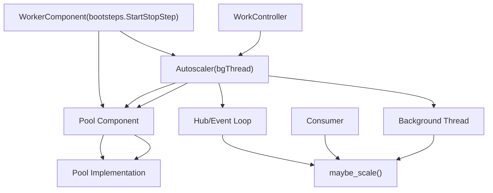
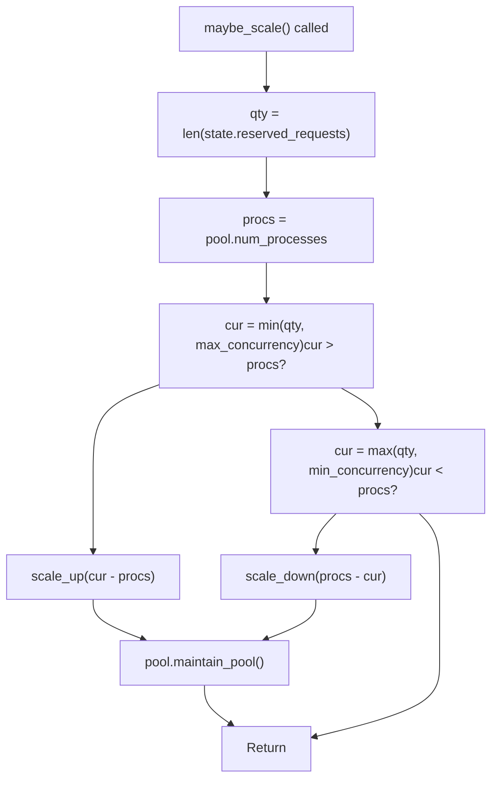
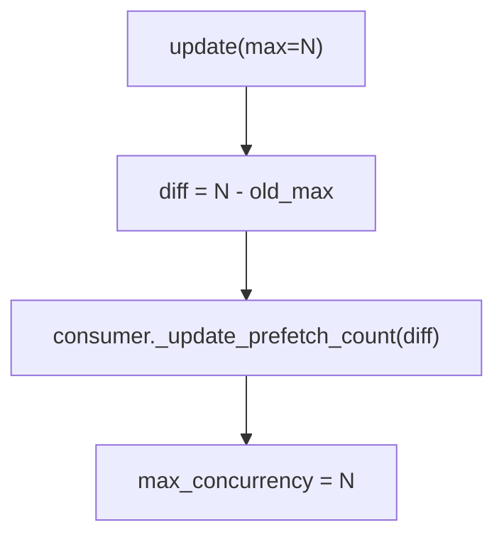

# Autoscaling

Relevant source files

-   [celery/bootsteps.py](https://github.com/celery/celery/blob/4d068b56/celery/bootsteps.py)
-   [celery/worker/autoscale.py](https://github.com/celery/celery/blob/4d068b56/celery/worker/autoscale.py)
-   [celery/worker/components.py](https://github.com/celery/celery/blob/4d068b56/celery/worker/components.py)
-   [celery/worker/loops.py](https://github.com/celery/celery/blob/4d068b56/celery/worker/loops.py)

## Purpose and Scope

This document describes Celery's autoscaling system, which dynamically adjusts the worker pool size based on demand. The autoscaler monitors the number of reserved tasks and scales the pool up or down within configured bounds to optimize resource utilization.

For general worker architecture and the bootsteps system, see [Worker Architecture and Bootsteps](/celery/celery/5.1-worker-architecture-and-bootsteps). For pool implementations and concurrency models, see [Concurrency Models](/celery/celery/5.3-concurrency-models). For consumer behavior and prefetch management, see [Consumer Behavior](/celery/celery/5.5-consumer-and-event-loops).

## Overview

The autoscaler is a worker component that monitors task demand and automatically grows or shrinks the execution pool to match workload. It operates within user-defined `min_concurrency` and `max_concurrency` bounds, scaling up when tasks are waiting and scaling down when the pool is underutilized.

The autoscaler runs either as a background thread or integrated with the event loop, depending on the worker's concurrency model. It includes a keepalive period to prevent rapid scale-down operations that could cause instability.

**Key Features:**

-   Dynamic pool sizing based on reserved task count
-   Configurable min/max concurrency bounds
-   Keepalive delay to prevent thrashing
-   Automatic prefetch count adjustment
-   Integration with both threaded and async worker modes

Sources: [celery/worker/autoscale.py1-10](https://github.com/celery/celery/blob/4d068b56/celery/worker/autoscale.py#L1-L10)

## Architecture

### Component Hierarchy


Sources: [celery/worker/autoscale.py31-59](https://github.com/celery/celery/blob/4d068b56/celery/worker/autoscale.py#L31-L59) [celery/worker/components.py98-126](https://github.com/celery/celery/blob/4d068b56/celery/worker/components.py#L98-L126)

### Class Structure


The `WorkerComponent` is a bootstep that integrates the autoscaler into the worker lifecycle. It is conditional, meaning it only runs when autoscaling is enabled via the `--autoscale` option. The component creates an `Autoscaler` instance and registers it with either the event loop or runs it as a background thread.

The `Autoscaler` class extends `bgThread` and implements the actual scaling logic. It maintains references to the pool, scaling bounds, and timing information.

Sources: [celery/worker/autoscale.py31-59](https://github.com/celery/celery/blob/4d068b56/celery/worker/autoscale.py#L31-L59) [celery/worker/autoscale.py61-155](https://github.com/celery/celery/blob/4d068b56/celery/worker/autoscale.py#L61-L155)

## Scaling Algorithm

### Demand Calculation

The autoscaler determines demand by examining `state.reserved_requests`, which tracks tasks that have been received but not yet started. The scaling decision is based on comparing this demand against the current pool size:


**Scale-up Logic:**

1.  Calculate target: `cur = min(qty, max_concurrency)`
2.  If `cur > procs`, grow by `cur - procs` processes
3.  Record timestamp in `_last_scale_up`

**Scale-down Logic:**

1.  Calculate target: `cur = max(qty, min_concurrency)`
2.  If `cur < procs` AND keepalive period has elapsed, shrink by `procs - cur` processes
3.  Keepalive check: `monotonic() - _last_scale_up > keepalive`

Sources: [celery/worker/autoscale.py83-96](https://github.com/celery/celery/blob/4d068b56/celery/worker/autoscale.py#L83-L96) [celery/worker/autoscale.py111-131](https://github.com/celery/celery/blob/4d068b56/celery/worker/autoscale.py#L111-L131)

### Keepalive Protection

The keepalive mechanism prevents rapid scale-down cycles that could cause instability. The default keepalive is 30 seconds, configurable via the `AUTOSCALE_KEEPALIVE` environment variable.

> **[Mermaid sequence]**
> *(图表结构无法解析)*

This ensures that after scaling up, the autoscaler waits for the keepalive duration before scaling down, giving the system time to stabilize and utilize the additional capacity.

Sources: [celery/worker/autoscale.py28](https://github.com/celery/celery/blob/4d068b56/celery/worker/autoscale.py#L28-L28) [celery/worker/autoscale.py115-118](https://github.com/celery/celery/blob/4d068b56/celery/worker/autoscale.py#L115-L118)

## Configuration and Usage

### Enabling Autoscaling

Autoscaling is enabled via the `--autoscale` command-line option when starting a worker:

```
celery worker --autoscale=MAX,MIN
```
Where:

-   `MAX`: Maximum number of pool processes
-   `MIN`: Minimum number of pool processes (optional, defaults to 0)

Examples:

```
# Scale between 10 and 3 processes
celery worker --autoscale=10,3

# Scale up to 10, down to 0
celery worker --autoscale=10
```
The autoscale parameter is parsed in the `Pool` component's `__init__` method:

Sources: [celery/worker/components.py114-125](https://github.com/celery/celery/blob/4d068b56/celery/worker/components.py#L114-L125)

### Configuration Parameters

| Parameter | Type | Default | Description |
| --- | --- | --- | --- |
| `max_concurrency` | int | Required | Maximum pool size |
| `min_concurrency` | int | 0 | Minimum pool size |
| `keepalive` | float | 30.0 | Seconds to wait before scaling down |
| `prefetch_multiplier` | int | 4 | Tasks per worker to prefetch |

The `AUTOSCALE_KEEPALIVE` environment variable overrides the default keepalive duration:

```
AUTOSCALE_KEEPALIVE = float(os.environ.get('AUTOSCALE_KEEPALIVE', 30))
```
Sources: [celery/worker/autoscale.py28](https://github.com/celery/celery/blob/4d068b56/celery/worker/autoscale.py#L28-L28) [celery/worker/autoscale.py64-76](https://github.com/celery/celery/blob/4d068b56/celery/worker/autoscale.py#L64-L76)

### Runtime Updates

The autoscaler supports runtime updates to scaling bounds via the `update()` method:

```
# Update max_concurrency to 20
autoscaler.update(max=20)

# Update min_concurrency to 5
autoscaler.update(min=5)

# Update both
autoscaler.update(max=20, min=5)
```
When bounds are updated:

1.  If new max < current processes, immediate shrink occurs
2.  If new min > current processes, immediate growth occurs
3.  Consumer prefetch count is updated to match new max

Sources: [celery/worker/autoscale.py98-109](https://github.com/celery/celery/blob/4d068b56/celery/worker/autoscale.py#L98-L109)

## Integration with Worker Lifecycle

### Initialization Sequence

> **[Mermaid sequence]**
> *(图表结构无法解析)*

The autoscaler is conditionally enabled based on the `w.autoscale` attribute, which is set by the `Pool` component during worker initialization.

Sources: [celery/worker/components.py114-125](https://github.com/celery/celery/blob/4d068b56/celery/worker/components.py#L114-L125) [celery/worker/autoscale.py38-48](https://github.com/celery/celery/blob/4d068b56/celery/worker/autoscale.py#L38-L48)

### Event Loop vs Threaded Mode

The autoscaler operates in two modes depending on the worker's configuration:

**Event Loop Mode** (when `w.use_eventloop == True`):

-   No background thread is created
-   `hub.call_repeatedly()` invokes `maybe_scale()` every `keepalive` seconds
-   `consumer.on_task_message` signal triggers `maybe_scale()` on task receipt
-   Uses `DummyLock` for mutex (no real locking needed)

**Threaded Mode** (when `w.use_eventloop == False`):

-   Background thread created, inheriting from `bgThread`
-   `body()` method runs in loop: acquire mutex, call `maybe_scale()`, sleep 1 second
-   Real `threading.Lock` used for mutex
-   Thread stopped during worker shutdown

Sources: [celery/worker/autoscale.py42-48](https://github.com/celery/celery/blob/4d068b56/celery/worker/autoscale.py#L42-L48) [celery/worker/autoscale.py50-54](https://github.com/celery/celery/blob/4d068b56/celery/worker/autoscale.py#L50-L54) [celery/worker/autoscale.py78-81](https://github.com/celery/celery/blob/4d068b56/celery/worker/autoscale.py#L78-L81)

### Prefetch Count Coordination

When the autoscaler changes `max_concurrency`, it must update the consumer's prefetch count to ensure proper message flow:


The prefetch count is calculated as:

```
prefetch_count = max_concurrency * prefetch_multiplier
```
When max\_concurrency changes, the delta is applied to the consumer's current prefetch count, ensuring the broker delivers an appropriate number of messages.

Sources: [celery/worker/autoscale.py133-138](https://github.com/celery/celery/blob/4d068b56/celery/worker/autoscale.py#L133-L138) [celery/worker/components.py221-224](https://github.com/celery/celery/blob/4d068b56/celery/worker/components.py#L221-L224)

## Error Handling

The autoscaler includes defensive error handling for pool operations:

### Shrink Failures

When calling `pool.shrink(n)`, two types of errors are caught:

1.  **ValueError**: Raised when all processes are busy and cannot be terminated

    -   Logged as debug message: "Autoscaler won't scale down: all processes busy."
    -   Scale-down operation is skipped
2.  **General Exception**: Any other error during shrink

    -   Logged as error with full traceback
    -   Operation continues without propagating error

```
try:
    self.pool.shrink(n)
except ValueError:
    debug("Autoscaler won't scale down: all processes busy.")
except Exception as exc:
    error('Autoscaler: scale_down: %r', exc, exc_info=True)
```
Sources: [celery/worker/autoscale.py124-131](https://github.com/celery/celery/blob/4d068b56/celery/worker/autoscale.py#L124-L131)

### State Access

The autoscaler accesses `state.reserved_requests` to determine current demand. This is a module-level data structure maintained by the worker that tracks reserved but not yet executing tasks.

Sources: [celery/worker/autoscale.py20](https://github.com/celery/celery/blob/4d068b56/celery/worker/autoscale.py#L20-L20) [celery/worker/autoscale.py149-150](https://github.com/celery/celery/blob/4d068b56/celery/worker/autoscale.py#L149-L150)

## Monitoring and Introspection

The autoscaler exposes current state via the `info()` method, which returns a dictionary with:

| Field | Description |
| --- | --- |
| `max` | Current max\_concurrency setting |
| `min` | Current min\_concurrency setting |
| `current` | Actual number of pool processes |
| `qty` | Number of reserved tasks (demand) |

This information is included in the worker's component info when queried via remote control commands or inspection tools.

Sources: [celery/worker/autoscale.py140-146](https://github.com/celery/celery/blob/4d068b56/celery/worker/autoscale.py#L140-L146) [celery/worker/autoscale.py56-58](https://github.com/celery/celery/blob/4d068b56/celery/worker/autoscale.py#L56-L58)

## Implementation Details

### Background Thread Execution

When running in threaded mode, the `body()` method implements the main loop:

```
def body(self):
    with self.mutex:
        self.maybe_scale()
    sleep(1.0)
```
This method:

1.  Acquires the mutex lock
2.  Checks if scaling is needed
3.  Releases the lock
4.  Sleeps for 1 second before repeating

The mutex prevents concurrent scaling operations that could corrupt pool state.

Sources: [celery/worker/autoscale.py78-81](https://github.com/celery/celery/blob/4d068b56/celery/worker/autoscale.py#L78-L81)

### Pool Interface

The autoscaler interacts with the pool through a minimal interface:

-   `pool.num_processes`: Property returning current process count
-   `pool.grow(n)`: Add n processes to the pool
-   `pool.shrink(n)`: Remove n processes from the pool
-   `pool.maintain_pool()`: Ensure pool state consistency after scaling

Sources: [celery/worker/autoscale.py96](https://github.com/celery/celery/blob/4d068b56/celery/worker/autoscale.py#L96-L96) [celery/worker/autoscale.py122](https://github.com/celery/celery/blob/4d068b56/celery/worker/autoscale.py#L122-L122) [celery/worker/autoscale.py127](https://github.com/celery/celery/blob/4d068b56/celery/worker/autoscale.py#L127-L127) [celery/worker/autoscale.py153-154](https://github.com/celery/celery/blob/4d068b56/celery/worker/autoscale.py#L153-L154)

### Mutex Strategy

The mutex is conditionally configured based on execution mode:

```
mutex=DummyLock() if w.use_eventloop else None
```
When `None` is passed, the `Autoscaler.__init__` falls back to `threading.Lock()`. The `DummyLock` is used in event loop mode because all operations occur on a single thread, eliminating the need for real locking.

Sources: [celery/worker/autoscale.py46](https://github.com/celery/celery/blob/4d068b56/celery/worker/autoscale.py#L46-L46) [celery/worker/autoscale.py69](https://github.com/celery/celery/blob/4d068b56/celery/worker/autoscale.py#L69-L69)
