# Backend Architecture

Relevant source files

-   [Makefile](https://github.com/celery/celery/blob/4d068b56/Makefile)
-   [celery/app/backends.py](https://github.com/celery/celery/blob/4d068b56/celery/app/backends.py)
-   [celery/app/builtins.py](https://github.com/celery/celery/blob/4d068b56/celery/app/builtins.py)
-   [celery/backends/base.py](https://github.com/celery/celery/blob/4d068b56/celery/backends/base.py)
-   [celery/backends/redis.py](https://github.com/celery/celery/blob/4d068b56/celery/backends/redis.py)
-   [celery/result.py](https://github.com/celery/celery/blob/4d068b56/celery/result.py)
-   [docs/Makefile](https://github.com/celery/celery/blob/4d068b56/docs/Makefile)
-   [docs/\_ext/celerydocs.py](https://github.com/celery/celery/blob/4d068b56/docs/_ext/celerydocs.py)
-   [docs/changelog\_formatter.py](https://github.com/celery/celery/blob/4d068b56/docs/changelog_formatter.py)
-   [docs/userguide/configuration.rst](https://github.com/celery/celery/blob/4d068b56/docs/userguide/configuration.rst)
-   [requirements/docs.txt](https://github.com/celery/celery/blob/4d068b56/requirements/docs.txt)
-   [requirements/pkgutils.txt](https://github.com/celery/celery/blob/4d068b56/requirements/pkgutils.txt)
-   [requirements/test-integration.txt](https://github.com/celery/celery/blob/4d068b56/requirements/test-integration.txt)
-   [t/unit/backends/test\_base.py](https://github.com/celery/celery/blob/4d068b56/t/unit/backends/test_base.py)
-   [t/unit/backends/test\_redis.py](https://github.com/celery/celery/blob/4d068b56/t/unit/backends/test_redis.py)
-   [t/unit/tasks/test\_chord.py](https://github.com/celery/celery/blob/4d068b56/t/unit/tasks/test_chord.py)
-   [t/unit/tasks/test\_result.py](https://github.com/celery/celery/blob/4d068b56/t/unit/tasks/test_result.py)
-   [tox.ini](https://github.com/celery/celery/blob/4d068b56/tox.ini)

This page documents the architectural design of Celery's result backend system, including the base classes, interfaces, and patterns that enable pluggable storage for task results. For information about specific backend implementations (Redis, Database, etc.), see [Backend Implementations](/celery/celery/6.2-backend-implementations). For details on how results are serialized and retrieved, see [Result Serialization and Retrieval](/celery/celery/6.3-result-storage-and-retrieval).

## Purpose and Scope

The backend architecture provides a flexible, extensible system for storing and retrieving task results. It defines abstract interfaces and base classes that concrete backend implementations inherit from, enabling support for 20+ different storage systems while maintaining a consistent API.

## Class Hierarchy

The backend system uses a multi-layer inheritance pattern to provide common functionality while allowing backends to opt into specific features.

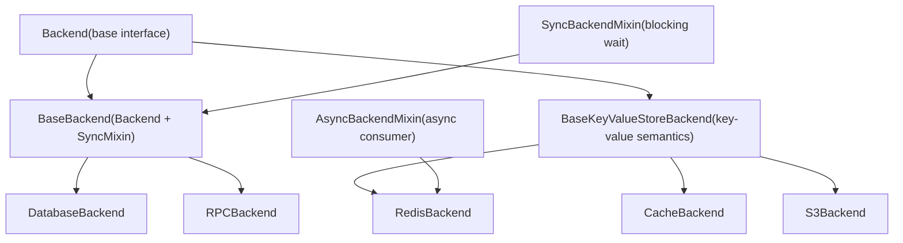
Sources: [celery/backends/base.py108-906](https://github.com/celery/celery/blob/4d068b56/celery/backends/base.py#L108-L906)

## Backend Base Class

The `Backend` class defines the core interface that all result backends must implement. It provides the contract for storing and retrieving task metadata.

### Core Interface Methods

| Method | Purpose | Implementation Required |
| --- | --- | --- |
| `store_result()` | Store task result with state | Abstract via `_store_result()` |
| `get_task_meta()` | Retrieve task metadata | Abstract via `_get_task_meta_for()` |
| `forget()` | Remove task result | Abstract via `_forget()` |
| `_save_group()` | Persist group result | Optional |
| `_restore_group()` | Retrieve group result | Optional |
| `on_chord_part_return()` | Handle chord coordination | Optional |

### State Management Methods

The `Backend` class provides convenience methods for marking tasks in different states:

```mermaid
flowchart TD
    mark_as_started["mark_as_started()"]
    mark_as_done["mark_as_done()"]
    mark_as_failure["mark_as_failure()"]
    mark_as_retry["mark_as_retry()"]
    mark_as_revoked["mark_as_revoked()"]
    store_result["store_result()(STARTED)"]
    store_result2["store_result()(SUCCESS)"]
    store_result3["store_result()(FAILURE)"]
    store_result4["store_result()(RETRY)"]
    store_result5["store_result()(REVOKED)"]
    on_chord_part_return["on_chord_part_return()"]

    mark --> as_started_store_result
    mark --> as_done_store_result2
    mark --> as_failure_store_result3
    mark --> as_retry_store_result4
    mark --> as_revoked_store_result5
    mark --> as_done_on_chord_part_return
    mark --> as_failure_on_chord_part_return
    mark --> as_revoked_on_chord_part_return
```
Sources: [celery/backends/base.py176-298](https://github.com/celery/celery/blob/4d068b56/celery/backends/base.py#L176-L298)

### Backend Initialization

The `Backend.__init__()` method configures:

-   **Serializer**: Determines encoding format (json, pickle, msgpack, yaml)
-   **Accept Content**: Content types accepted for deserialization
-   **Expires**: Result TTL configuration
-   **Cache**: LRU cache for result objects
-   **Retry Policy**: Exponential backoff configuration for transient errors

Sources: [celery/backends/base.py138-166](https://github.com/celery/celery/blob/4d068b56/celery/backends/base.py#L138-L166)

## SyncBackendMixin vs AsyncBackendMixin

Celery provides two patterns for waiting on results: synchronous polling and asynchronous event-driven.

### SyncBackendMixin

The synchronous backend pattern uses polling to wait for results. This is the default for most backends.

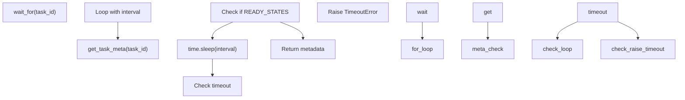
**Key Methods:**

-   `wait_for()`: Polls backend until task reaches ready state
-   `wait_for_pending()`: Waits for pending result
-   `get_many()`: Not implemented in base (sync backends poll individually)

Sources: [celery/backends/base.py825-901](https://github.com/celery/celery/blob/4d068b56/celery/backends/base.py#L825-L901)

### AsyncBackendMixin

The asynchronous pattern uses a consumer to receive result updates via pub/sub or message queues.

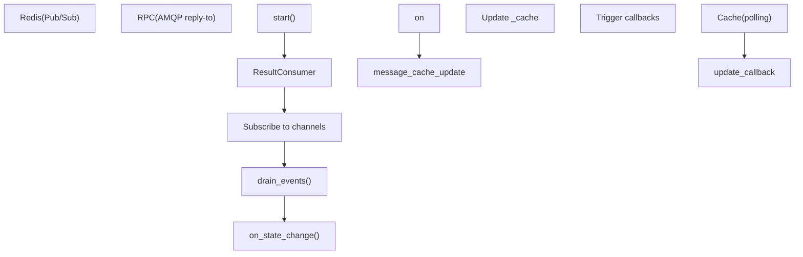
**Key Components:**

-   `ResultConsumer`: Event loop that listens for result updates
-   `add_pending_result()`: Registers interest in a task result
-   `iter_native()`: Yields results as they become available

Sources: [celery/backends/asynchronous.py](https://github.com/celery/celery/blob/4d068b56/celery/backends/asynchronous.py) (referenced in redis.py), [celery/backends/redis.py83-188](https://github.com/celery/celery/blob/4d068b56/celery/backends/redis.py#L83-L188)

## BaseKeyValueStoreBackend

Many backends operate on key-value semantics. `BaseKeyValueStoreBackend` provides a common abstraction for these backends.

### Key Naming Convention

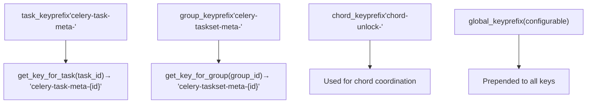
**Abstract Methods for Subclasses:**

-   `get(key)`: Retrieve value by key
-   `set(key, value)`: Store value at key
-   `mget(keys)`: Retrieve multiple keys
-   `delete(key)`: Remove key

Sources: [celery/backends/base.py910-1055](https://github.com/celery/celery/blob/4d068b56/celery/backends/base.py#L910-L1055)

### Chord Support with Increment Counter

Key-value backends that support atomic increment operations can use `_apply_chord_incr()` for efficient chord coordination:

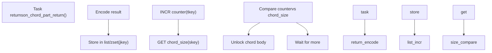
**Key-Value Operations:**

-   `jkey` (join key): Stores encoded task results (list or sorted set)
-   `tkey` (counter key): Atomic counter for completed tasks
-   `skey` (size key): Expected chord size

Sources: [celery/backends/base.py1145-1230](https://github.com/celery/celery/blob/4d068b56/celery/backends/base.py#L1145-L1230) [celery/backends/redis.py507-578](https://github.com/celery/celery/blob/4d068b56/celery/backends/redis.py#L507-L578)

## Result Caching

The backend uses an LRU (Least Recently Used) cache to avoid redundant backend queries for completed tasks.

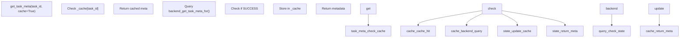
**Configuration:**

-   `result_cache_max`: Maximum cached results (default from config)
-   `-1`: Disables caching (uses `_nulldict`)
-   Cache only stores `SUCCESS` state results

Sources: [celery/backends/base.py148](https://github.com/celery/celery/blob/4d068b56/celery/backends/base.py#L148-L148) [celery/backends/base.py692-729](https://github.com/celery/celery/blob/4d068b56/celery/backends/base.py#L692-L729)

## Serialization and Encoding

The backend handles serialization of task results, including special handling for exceptions.

### Exception Serialization

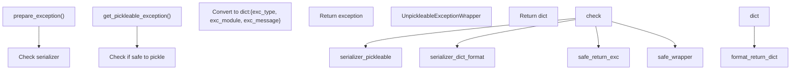
**Security Consideration:**

The `exception_to_python()` method validates that deserialized exceptions are actual `BaseException` subclasses to prevent code execution vulnerabilities.

Sources: [celery/backends/base.py424-503](https://github.com/celery/celery/blob/4d068b56/celery/backends/base.py#L424-L503) [celery/backends/base.py434-503](https://github.com/celery/celery/blob/4d068b56/celery/backends/base.py#L434-L503)

### Result Encoding

| Step | Method | Purpose |
| --- | --- | --- |
| 1\. Prepare | `encode_result()` | Convert result to serializable form |
| 2\. Encode | `_encode()` / `encode()` | Apply serialization (json/pickle/etc) |
| 3\. Store | `_store_result()` | Backend-specific storage |

For retrieval:

| Step | Method | Purpose |
| --- | --- | --- |
| 1\. Retrieve | `_get_task_meta_for()` | Backend-specific retrieval |
| 2\. Decode | `decode()` | Deserialize payload |
| 3\. Convert | `meta_from_decoded()` | Exception reconstruction |

Sources: [celery/backends/base.py505-553](https://github.com/celery/celery/blob/4d068b56/celery/backends/base.py#L505-L553)

## Backend Selection

Backends are selected via URL scheme or name using the backend registry.

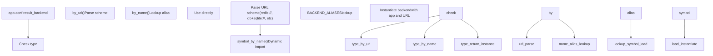
**Common URL Schemes:**

-   `redis://` → RedisBackend
-   `rediss://` → RedisBackend (SSL)
-   `rpc://` → RPCBackend
-   `db+postgresql://` → DatabaseBackend
-   `cache+memcached://` → CacheBackend
-   `s3://` → S3Backend

Sources: [celery/app/backends.py](https://github.com/celery/celery/blob/4d068b56/celery/app/backends.py) (referenced), [celery/backends/base.py167-175](https://github.com/celery/celery/blob/4d068b56/celery/backends/base.py#L167-L175)

## Retry and Resilience

The base backend implements exponential backoff retry for transient failures.

### Retry Configuration

```
retry_policy = {
    'max_retries': 20,
    'interval_start': 0,
    'interval_step': 1,
    'interval_max': 1,
}
```
Configurable via:

-   `result_backend_always_retry`: Enable automatic retry
-   `result_backend_max_retries`: Override max retries
-   `result_backend_base_sleep_between_retries_ms`: Initial backoff
-   `result_backend_max_sleep_between_retries_ms`: Maximum backoff

### Store/Retrieve Retry Logic

Both `store_result()` and `get_task_meta()` implement retry loops:

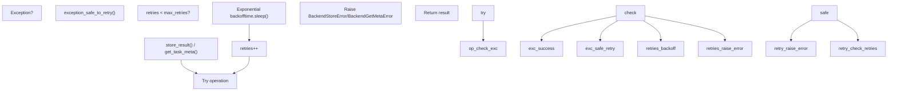
**Backend-Specific Retry:**

Backends override `exception_safe_to_retry()` to determine which exceptions are transient (e.g., network errors) vs permanent (e.g., authentication failures).

Sources: [celery/backends/base.py612-645](https://github.com/celery/celery/blob/4d068b56/celery/backends/base.py#L612-L645) [celery/backends/base.py692-725](https://github.com/celery/celery/blob/4d068b56/celery/backends/base.py#L692-L725) [celery/backends/base.py682-690](https://github.com/celery/celery/blob/4d068b56/celery/backends/base.py#L682-L690)

## Integration with Application

The backend is initialized and managed by the Celery application.

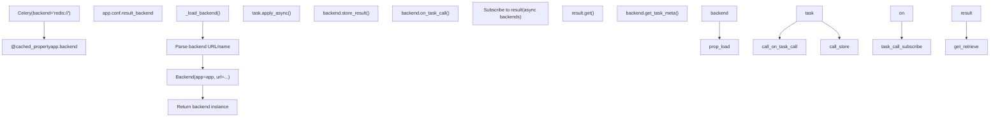
**Key Integration Points:**

1.  **Task Execution**: Workers call `mark_as_done()` / `mark_as_failure()` after task execution
2.  **Result Retrieval**: `AsyncResult.get()` calls `backend.wait_for_pending()`
3.  **Chord Coordination**: Workers call `on_chord_part_return()` for chord tasks
4.  **Cleanup**: `backend.cleanup()` removes expired results (if not autoexpire)

Sources: [celery/app/base.py](https://github.com/celery/celery/blob/4d068b56/celery/app/base.py) (referenced for backend loading), [celery/backends/base.py772-773](https://github.com/celery/celery/blob/4d068b56/celery/backends/base.py#L772-L773)

## Thread Safety

Backends can be configured for thread-safe operation:

**Configuration:**

-   `result_backend_thread_safe`: Enable thread-safe mode (default: False)

When enabled, backends must ensure thread-safe access to connection pools and shared state. This is particularly important for:

-   Multi-threaded workers (`--pool=threads`)
-   Concurrent result retrieval
-   Connection pooling

Sources: [celery/backends/base.py161](https://github.com/celery/celery/blob/4d068b56/celery/backends/base.py#L161-L161)

## Summary

The backend architecture provides:

1.  **Pluggable Design**: Abstract interfaces allow 20+ backend implementations
2.  **Flexible Wait Patterns**: Sync (polling) and async (event-driven) support
3.  **Efficient Caching**: LRU cache reduces backend load
4.  **Robust Retry**: Exponential backoff for transient failures
5.  **Secure Serialization**: Validation prevents code execution attacks
6.  **Chord Coordination**: Built-in support for complex workflows

The layered inheritance model allows backends to share common functionality while implementing storage-specific optimizations. This design enables Celery to support everything from simple file-based storage to distributed cloud services with a consistent API.
