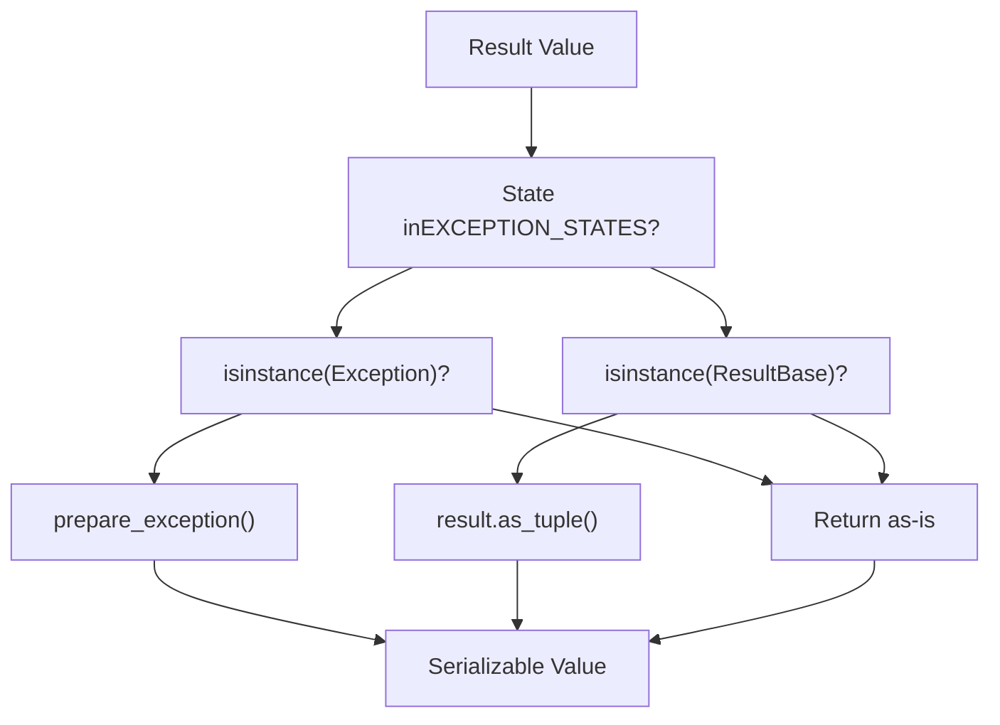
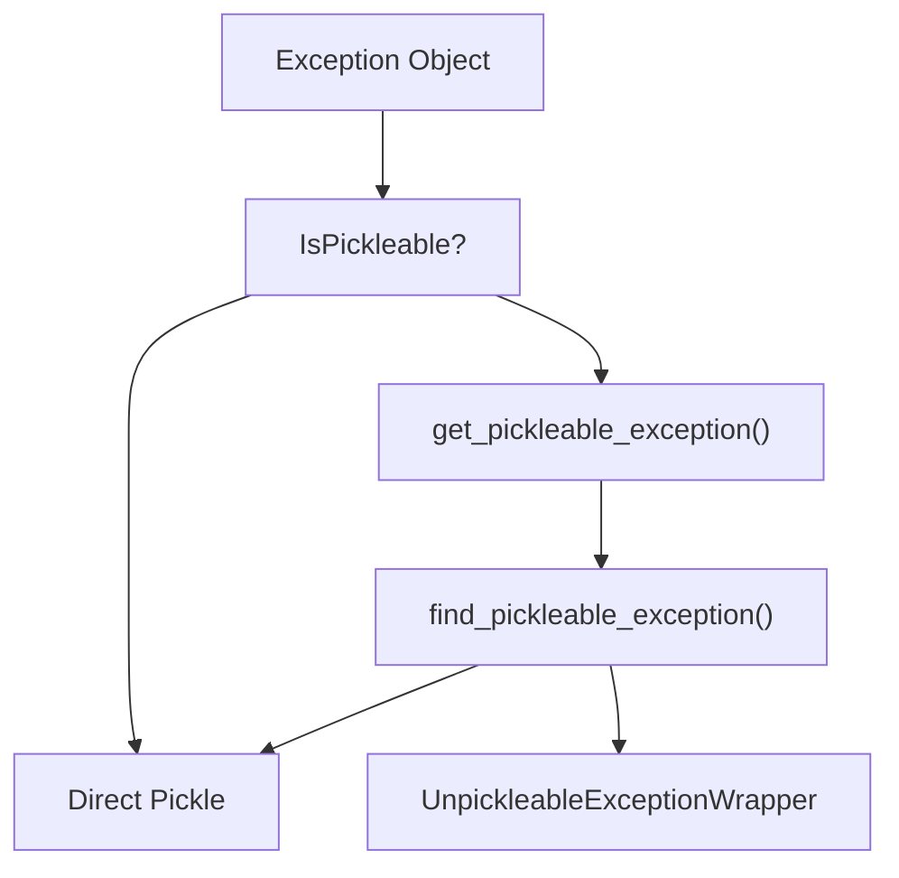
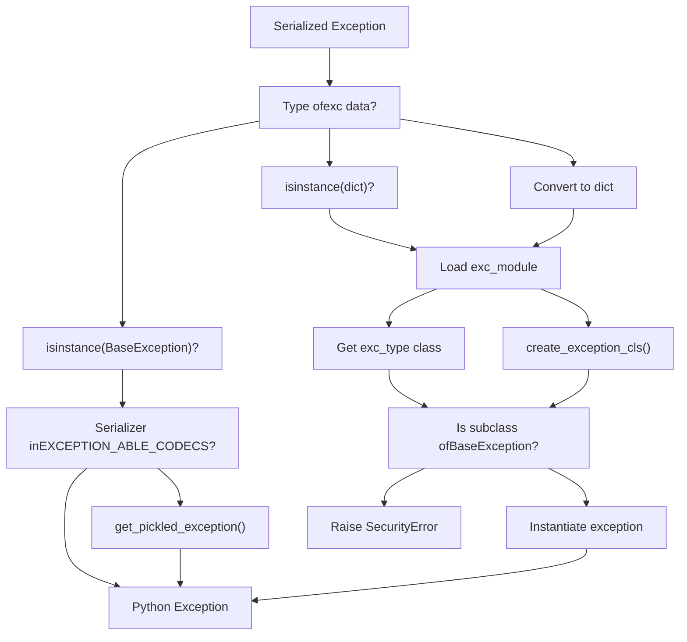
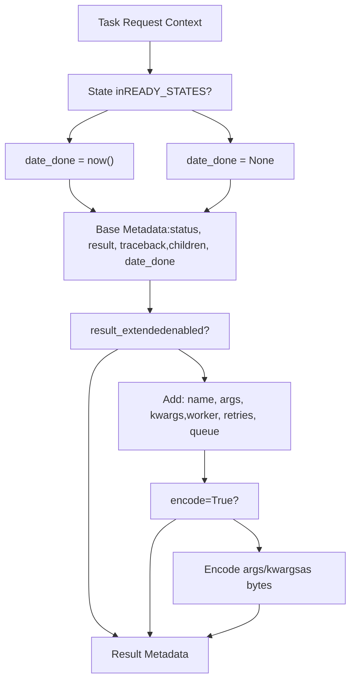
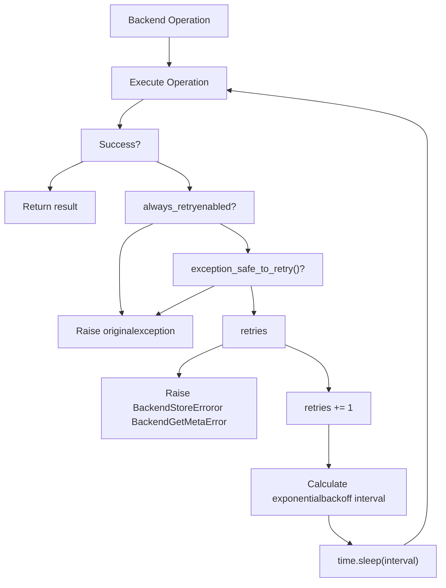
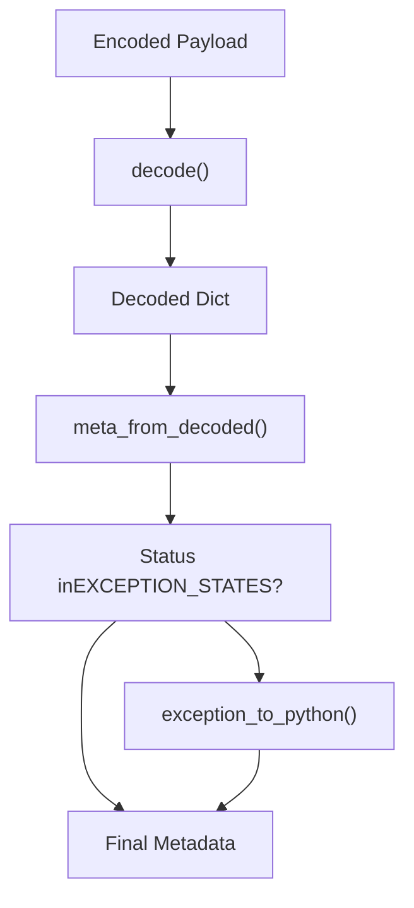

# Result Serialization and Retrieval

Relevant source files

-   [celery/app/builtins.py](https://github.com/celery/celery/blob/4d068b56/celery/app/builtins.py)
-   [celery/backends/base.py](https://github.com/celery/celery/blob/4d068b56/celery/backends/base.py)
-   [celery/backends/redis.py](https://github.com/celery/celery/blob/4d068b56/celery/backends/redis.py)
-   [celery/result.py](https://github.com/celery/celery/blob/4d068b56/celery/result.py)
-   [docs/userguide/configuration.rst](https://github.com/celery/celery/blob/4d068b56/docs/userguide/configuration.rst)
-   [t/unit/backends/test\_base.py](https://github.com/celery/celery/blob/4d068b56/t/unit/backends/test_base.py)
-   [t/unit/backends/test\_redis.py](https://github.com/celery/celery/blob/4d068b56/t/unit/backends/test_redis.py)
-   [t/unit/tasks/test\_chord.py](https://github.com/celery/celery/blob/4d068b56/t/unit/tasks/test_chord.py)
-   [t/unit/tasks/test\_result.py](https://github.com/celery/celery/blob/4d068b56/t/unit/tasks/test_result.py)

This page describes how task results are serialized when stored to a backend and deserialized when retrieved by clients. It covers result encoding/decoding, exception handling, security checks, and the polling mechanisms used by `AsyncResult.get()`. For information about backend architecture and implementation, see [Backend Architecture](/celery/celery/6.1-backend-architecture). For details about backend-specific features, see [Backend Implementations](/celery/celery/6.2-backend-implementations).

## Overview of Result Lifecycle

When a task completes, its return value must be serialized and stored. When a client retrieves that result, it must be deserialized back into Python objects. This process involves several steps to handle different data types, exceptions, and security concerns.

> **[Mermaid sequence]**
> *(图表结构无法解析)*

Sources: [celery/backends/base.py176-187](https://github.com/celery/celery/blob/4d068b56/celery/backends/base.py#L176-L187) [celery/backends/base.py550-607](https://github.com/celery/celery/blob/4d068b56/celery/backends/base.py#L550-L607) [celery/result.py190-261](https://github.com/celery/celery/blob/4d068b56/celery/result.py#L190-L261)

## Result Encoding

### Core Encoding Methods

The `Backend` class provides a multi-stage encoding pipeline:

| Method | Purpose | Location |
| --- | --- | --- |
| `prepare_value()` | Converts result objects to serializable forms | [celery/backends/base.py505-509](https://github.com/celery/celery/blob/4d068b56/celery/backends/base.py#L505-L509) |
| `encode_result()` | Prepares results/exceptions based on state | [celery/backends/base.py550-553](https://github.com/celery/celery/blob/4d068b56/celery/backends/base.py#L550-L553) |
| `encode()` | Serializes data using configured serializer | [celery/backends/base.py511-513](https://github.com/celery/celery/blob/4d068b56/celery/backends/base.py#L511-L513) |
| `_encode()` | Underlying serialization call to kombu | [celery/backends/base.py515-516](https://github.com/celery/celery/blob/4d068b56/celery/backends/base.py#L515-L516) |

#### Result Value Preparation


**Result Value Preparation Logic**

The `prepare_value()` method handles special cases:

-   If `serializer != 'pickle'` and result is a `ResultBase` (AsyncResult, GroupResult), it converts to tuple representation via `as_tuple()` to avoid circular references
-   Otherwise, returns the result unchanged for direct serialization

The `encode_result()` method routes based on task state:

-   If state is in `EXCEPTION_STATES` and result is an `Exception`, calls `prepare_exception()`
-   Otherwise, calls `prepare_value()`

Sources: [celery/backends/base.py505-509](https://github.com/celery/celery/blob/4d068b56/celery/backends/base.py#L505-L509) [celery/backends/base.py550-553](https://github.com/celery/celery/blob/4d068b56/celery/backends/base.py#L550-L553)

#### Serialization Format

The backend uses the serializer configured in `app.conf.result_serializer` (default: 'json'). The serializer determines:

-   **Content-Type**: MIME type for the serialized data (e.g., 'application/json')
-   **Content-Encoding**: Encoding used (e.g., 'utf-8')
-   **Encoder function**: The actual serialization function from `kombu.serialization`

Sources: [celery/backends/base.py143-146](https://github.com/celery/celery/blob/4d068b56/celery/backends/base.py#L143-L146)

## Exception Serialization

Exception handling is one of the most complex aspects of result serialization because exceptions must be reconstructed on the client side, potentially across different Python environments.

### Serialization Strategy

The strategy for serializing exceptions depends on the configured serializer:

#### Pickle-Based Serializers

For serializers in `EXCEPTION_ABLE_CODECS` (currently only `'pickle'`):


**Pickle Serialization Process**

1.  `prepare_exception()` calls `get_pickleable_exception(exc)` [celery/backends/base.py428](https://github.com/celery/celery/blob/4d068b56/celery/backends/base.py#L428-L428)
2.  If exception is pickleable, return it directly
3.  If not, `find_pickleable_exception()` searches for the nearest pickleable base class
4.  If no pickleable base found, wraps in `UnpickleableExceptionWrapper`

Sources: [celery/backends/base.py424-432](https://github.com/celery/celery/blob/4d068b56/celery/backends/base.py#L424-L432) [celery/utils/serialization.py](https://github.com/celery/celery/blob/4d068b56/celery/utils/serialization.py)

#### JSON/Non-Pickle Serializers

For JSON and other serializers that cannot serialize arbitrary Python objects, exceptions are converted to dictionaries:

```
{
    'exc_type': 'KeyError',           # Exception class name (or qualified name)
    'exc_module': 'builtins',         # Module containing exception class
    'exc_message': ('key not found',) # Exception args as tuple
}
```
**Exception Metadata Extraction**

The `prepare_exception()` method extracts:

-   `exc_type`: Uses `__qualname__` if available (for nested classes), falls back to `__name__`
-   `exc_module`: The module path where the exception class is defined
-   `exc_message`: Exception arguments, made serializable via `ensure_serializable()`

Sources: [celery/backends/base.py429-432](https://github.com/celery/celery/blob/4d068b56/celery/backends/base.py#L429-L432)

### Deserialization and Reconstruction

#### Exception Reconstruction Flow


**Exception Reconstruction Process**

The `exception_to_python()` method handles reconstruction [celery/backends/base.py434-503](https://github.com/celery/celery/blob/4d068b56/celery/backends/base.py#L434-L503):

1.  **Handle None/Empty**: Returns `None` for empty data
2.  **Handle BaseException instances**: If already an exception object:
    -   For pickle serializers, call `get_pickled_exception()` to unwrap
    -   Otherwise return as-is
3.  **Handle dict format**: Extract `exc_type`, `exc_module`, and `exc_message`
4.  **Class lookup**:
    -   Try to import `exc_module` and find class by `exc_type`
    -   If module not found, dynamically create exception class via `create_exception_cls()`
5.  **Security validation**: Verify the reconstructed class is actually a `BaseException` subclass
6.  **Instantiation**: Create exception instance with `exc_message` args

Sources: [celery/backends/base.py434-503](https://github.com/celery/celery/blob/4d068b56/celery/backends/base.py#L434-L503)

## Security Considerations

### Exception Injection Prevention

A critical security check prevents arbitrary code execution via malicious exception data:

```
# Security check in exception_to_python()
if not isinstance(cls, type) or not issubclass(cls, BaseException):
    fake_exc_type = exc_type if exc_module is None else f'{exc_module}.{exc_type}'
    raise SecurityError(
        f"Expected an exception class, got {fake_exc_type} with payload {exc_msg}")
```
**Attack Vector Example**

Without this check, an attacker could store a task result like:

```
{
    "exc_module": "os",
    "exc_type": "system",
    "exc_message": "rm -rf /important/data"
}
```
This would cause `os.system("rm -rf /important/data")` to execute when reconstructing the exception.

The security check ensures that only actual exception classes can be instantiated, preventing this attack vector.

Sources: [celery/backends/base.py487-490](https://github.com/celery/celery/blob/4d068b56/celery/backends/base.py#L487-L490) comments at [celery/backends/base.py472-486](https://github.com/celery/celery/blob/4d068b56/celery/backends/base.py#L472-L486)

### Accept Content Filtering

Backends enforce accepted content types to prevent deserialization attacks:

```
# Accept content precedence
self.accept = conf.result_accept_content if accept is None else accept
self.accept = conf.accept_content if self.accept is None else self.accept
self.accept = prepare_accept_content(self.accept)
```
This prevents accepting untrusted serialization formats. Configuration precedence:

1.  Explicit `accept` parameter to backend constructor
2.  `result_accept_content` configuration
3.  `accept_content` configuration (global fallback)

Sources: [celery/backends/base.py152-155](https://github.com/celery/celery/blob/4d068b56/celery/backends/base.py#L152-L155)

## Result Metadata Structure

When a result is stored, it includes extensive metadata about the task execution:

### Basic Metadata Fields

| Field | Type | Description |
| --- | --- | --- |
| `status` | str | Task state (SUCCESS, FAILURE, etc.) |
| `result` | any | The actual return value or exception |
| `traceback` | str | Traceback string for failures |
| `children` | list | Child task results (for task trails) |
| `date_done` | datetime | Completion timestamp |

### Extended Metadata

When `app.conf.result_extended = True`, additional fields are included:

| Field | Type | Description |
| --- | --- | --- |
| `name` | str | Task name |
| `args` | list | Task positional arguments |
| `kwargs` | dict | Task keyword arguments |
| `worker` | str | Worker hostname |
| `retries` | int | Number of retry attempts |
| `queue` | str | Queue name |
| `stamped_headers` | dict | Custom stamped headers |

Sources: [celery/backends/base.py558-606](https://github.com/celery/celery/blob/4d068b56/celery/backends/base.py#L558-L606)

#### Metadata Generation


Sources: [celery/backends/base.py558-607](https://github.com/celery/celery/blob/4d068b56/celery/backends/base.py#L558-L607)

## Result Retrieval

### AsyncResult.get() Method

The primary method for retrieving task results is `AsyncResult.get()`. This method blocks until the task completes or times out.

#### Get Method Signature

```
def get(self, timeout=None, propagate=True, interval=0.5,
        no_ack=True, follow_parents=True, callback=None, on_message=None,
        on_interval=None, disable_sync_subtasks=True)
```
**Key Parameters:**

| Parameter | Default | Purpose |
| --- | --- | --- |
| `timeout` | None | Max seconds to wait (None = infinite) |
| `propagate` | True | Re-raise exceptions from failed tasks |
| `interval` | 0.5 | Polling interval in seconds |
| `follow_parents` | True | Check parent tasks in chains |
| `disable_sync_subtasks` | True | Prevent deadlocks from nested .get() calls |
| `callback` | None | Called with (task\_id, value) when done |

Sources: [celery/result.py190-234](https://github.com/celery/celery/blob/4d068b56/celery/result.py#L190-L234)

### Retrieval Flow

> **[Mermaid sequence]**
> *(图表结构无法解析)*

Sources: [celery/result.py190-261](https://github.com/celery/celery/blob/4d068b56/celery/result.py#L190-L261) [celery/backends/base.py846-890](https://github.com/celery/celery/blob/4d068b56/celery/backends/base.py#L846-L890)

### Caching Strategy

Results are cached to avoid repeated backend queries:

**Cache Implementation:**

-   Uses `LRUCache` with configurable size (`result_cache_max`)
-   Special `_nulldict` implementation when `result_cache_max = -1` (caching disabled)
-   Only SUCCESS states are cached permanently
-   Cache key is the task ID

**Cache Population:**

```
def _maybe_set_cache(self, meta):
    if meta:
        state = meta['status']
        if state in states.READY_STATES:
            d = self._set_cache(self.backend.meta_from_decoded(meta))
            self.on_ready(self)
            return d
    return meta
```
Sources: [celery/backends/base.py148](https://github.com/celery/celery/blob/4d068b56/celery/backends/base.py#L148-L148) [celery/result.py433-440](https://github.com/celery/celery/blob/4d068b56/celery/result.py#L433-L440)

### Polling Mechanism

For backends that don't support native result notifications (most backends except AMQP/Redis pub/sub), results are retrieved via polling:

#### SyncBackendMixin.wait\_for()

```
def wait_for(self, task_id, timeout=None, interval=0.5, no_ack=True, on_interval=None):
    self._ensure_not_eager()
    time_elapsed = 0.0

    while 1:
        meta = self.get_task_meta(task_id)
        if meta['status'] in states.READY_STATES:
            return meta
        if on_interval:
            on_interval()
        time.sleep(interval)
        time_elapsed += interval
        if timeout and time_elapsed >= timeout:
            raise TimeoutError('The operation timed out.')
```
**Polling Characteristics:**

-   Default interval: 0.5 seconds
-   Configurable via `interval` parameter
-   Tracks elapsed time for timeout enforcement
-   Calls `on_interval` callback each iteration (useful for progress updates)

Sources: [celery/backends/base.py864-890](https://github.com/celery/celery/blob/4d068b56/celery/backends/base.py#L864-L890)

### Parent Error Propagation

When `follow_parents=True`, the result checks parent tasks in a chain for errors:

```
def _maybe_reraise_parent_error(self):
    for node in reversed(list(self._parents())):
        node.maybe_throw()
```
This ensures that errors in parent tasks are propagated even if the child task succeeded.

Sources: [celery/result.py264-272](https://github.com/celery/celery/blob/4d068b56/celery/result.py#L264-L272)

## Retry Logic for Backend Operations

Both storage and retrieval operations support automatic retry with exponential backoff when `result_backend_always_retry` is enabled.

### Retry Configuration

| Setting | Default | Purpose |
| --- | --- | --- |
| `result_backend_always_retry` | False | Enable automatic retries |
| `result_backend_max_retries` | inf | Maximum retry attempts |
| `result_backend_base_sleep_between_retries_ms` | 10 | Initial backoff (ms) |
| `result_backend_max_sleep_between_retries_ms` | 10000 | Max backoff (ms) |

Sources: [celery/backends/base.py157-161](https://github.com/celery/celery/blob/4d068b56/celery/backends/base.py#L157-L161)

### Retry Flow


**Exponential Backoff Calculation:**

The sleep interval grows exponentially with each retry:

```
sleep_amount = get_exponential_backoff_interval(
    self.base_sleep_between_retries_ms,
    retries,
    self.max_sleep_between_retries_ms,
    True
) / 1000
```
Sources: [celery/backends/base.py612-644](https://github.com/celery/celery/blob/4d068b56/celery/backends/base.py#L612-L644) [celery/backends/base.py692-729](https://github.com/celery/celery/blob/4d068b56/celery/backends/base.py#L692-L729)

### Exception Safety Check

Backends must implement `exception_safe_to_retry()` to identify retriable exceptions:

```
def exception_safe_to_retry(self, exc):
    """Check if an exception is safe to retry.

    Backends have to overload this method with correct predicates dealing
    with their exceptions.

    By default no exception is safe to retry, it's up to backend
    implementation to define which exceptions are safe.
    """
    return False
```
Backend implementations override this to identify transient errors (connection timeouts, temporary unavailability, etc.) vs. permanent errors (authentication failures, etc.).

Sources: [celery/backends/base.py682-690](https://github.com/celery/celery/blob/4d068b56/celery/backends/base.py#L682-L690)

## Decoding and Metadata Processing

### Decode Pipeline


**Decoding Methods:**

1.  **decode()**: Deserializes the raw payload using kombu serialization

    -   Handles None/empty payloads
    -   Uses configured content\_type and content\_encoding
    -   Respects accept content filtering
2.  **meta\_from\_decoded()**: Post-processes the decoded metadata

    -   Converts exception dicts to Python exceptions via `exception_to_python()`
    -   Returns the complete metadata structure
3.  **decode\_result()**: Convenience method combining both steps


Sources: [celery/backends/base.py518-533](https://github.com/celery/celery/blob/4d068b56/celery/backends/base.py#L518-L533)

## Result Access Properties

The `AsyncResult` class provides convenient properties for accessing result metadata:

```
@property
def result(self):
    """Task return value or exception."""
    return self._get_task_meta()['result']

@property
def traceback(self):
    """Traceback for failed task."""
    return self._get_task_meta().get('traceback')

@property
def state(self):
    """Current task state."""
    return self._get_task_meta()['status']
```
Additional extended properties (when `result_extended=True`):

```
@property
def name(self):
    return self._get_task_meta().get('name')

@property
def args(self):
    return self._get_task_meta().get('args')

@property
def kwargs(self):
    return self._get_task_meta().get('kwargs')

@property
def worker(self):
    return self._get_task_meta().get('worker')

@property
def date_done(self):
    date_done = self._get_task_meta().get('date_done')
    if date_done and not isinstance(date_done, datetime.datetime):
        return isoparse(date_done)
    return date_done
```
These properties trigger metadata retrieval and caching on first access.

Sources: [celery/result.py459-547](https://github.com/celery/celery/blob/4d068b56/celery/result.py#L459-L547)

## Backend-Specific Serialization

Different backends have specific serialization requirements:

### MongoDB Backend

**Special Handling:**

-   Uses `Binary` wrapper for binary codecs (pickle, msgpack)
-   Supports native BSON serialization when `serializer='bson'`
-   Bypasses standard encode/decode for BSON

```
def encode(self, data):
    if self.serializer == 'bson':
        return data  # MongoDB handles serialization
    payload = super().encode(data)
    if self.serializer in BINARY_CODECS:
        payload = Binary(payload)
    return payload
```
Sources: [celery/backends/mongodb.py166-180](https://github.com/celery/celery/blob/4d068b56/celery/backends/mongodb.py#L166-L180)

### Cassandra Backend

**Binary Encoding:**

-   All payloads stored as blobs
-   Converts encoded data to bytes using `buf_t()`
-   Stores result, traceback, and children as binary blobs

Sources: [celery/backends/cassandra.py214-226](https://github.com/celery/celery/blob/4d068b56/celery/backends/cassandra.py#L214-L226)

## Error Handling During Retrieval

### Exception Re-raising

The `maybe_throw()` method handles exception propagation:

```
def maybe_throw(self, propagate=True, callback=None):
    cache = self._get_task_meta() if self._cache is None else self._cache
    state, value, tb = (
        cache['status'], cache['result'], cache.get('traceback'))
    if state in states.PROPAGATE_STATES and propagate:
        self.throw(value, self._to_remote_traceback(tb))
    if callback is not None:
        callback(self.id, value)
    return value
```
**PROPAGATE\_STATES**: States that should raise exceptions when `propagate=True`

-   FAILURE
-   RETRY
-   REVOKED (in some contexts)

Sources: [celery/result.py362-371](https://github.com/celery/celery/blob/4d068b56/celery/result.py#L362-L371) [celery/states.py](https://github.com/celery/celery/blob/4d068b56/celery/states.py)

### Remote Traceback Reconstruction

When `task_remote_tracebacks=True` and `tblib` is installed, the original traceback from the worker is reconstructed on the client:

```
def _to_remote_traceback(self, tb):
    if tb and tblib is not None and self.app.conf.task_remote_tracebacks:
        return tblib.Traceback.from_string(tb).as_traceback()
```
This allows debugging with the actual stack trace from where the exception occurred, not just the retrieval point.

Sources: [celery/result.py373-375](https://github.com/celery/celery/blob/4d068b56/celery/result.py#L373-L375)

## Performance Considerations

### Native Join Support

Some backends support native join operations for efficient result retrieval:

```
@property
def supports_native_join(self):
    return self.backend.supports_native_join
```
**Backends with Native Join:**

-   RPC/AMQP: Uses reply-to queues
-   Redis: Uses pub/sub for notifications
-   Cache: Efficient memory-based lookup

Backends without native join fall back to polling via `wait_for()`.

Sources: [celery/backends/base.py120-121](https://github.com/celery/celery/blob/4d068b56/celery/backends/base.py#L120-L121) [celery/result.py426-427](https://github.com/celery/celery/blob/4d068b56/celery/result.py#L426-L427)

### Thread Safety

Backends can be configured for thread-safe operation:

```
self.thread_safe = conf.get('result_backend_thread_safe', False)
```
When enabled, backends must ensure thread-safe access to connections and caches. This is particularly important for multi-threaded applications using the same backend instance.

Sources: [celery/backends/base.py161](https://github.com/celery/celery/blob/4d068b56/celery/backends/base.py#L161-L161)

### Cache Efficiency

The LRU cache prevents redundant backend queries:

-   Maximum size configured via `result_cache_max`
-   Default limit prevents unbounded memory growth
-   Set to `-1` to disable caching entirely
-   Only READY states are cached to avoid stale data

Sources: [celery/backends/base.py147-148](https://github.com/celery/celery/blob/4d068b56/celery/backends/base.py#L147-L148) [celery/backends/base.py727-729](https://github.com/celery/celery/blob/4d068b56/celery/backends/base.py#L727-L729)
