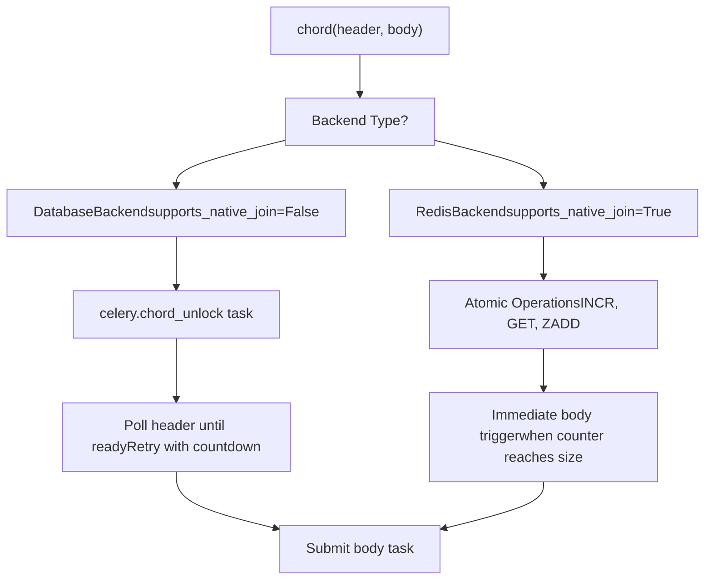
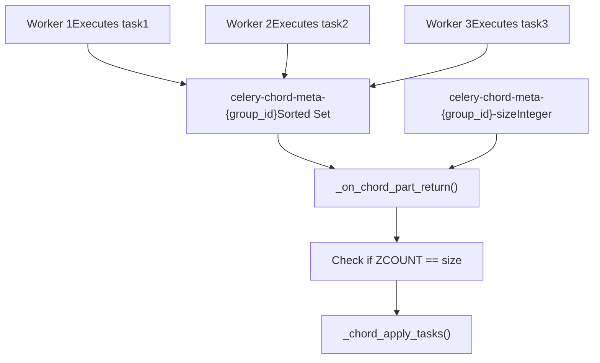
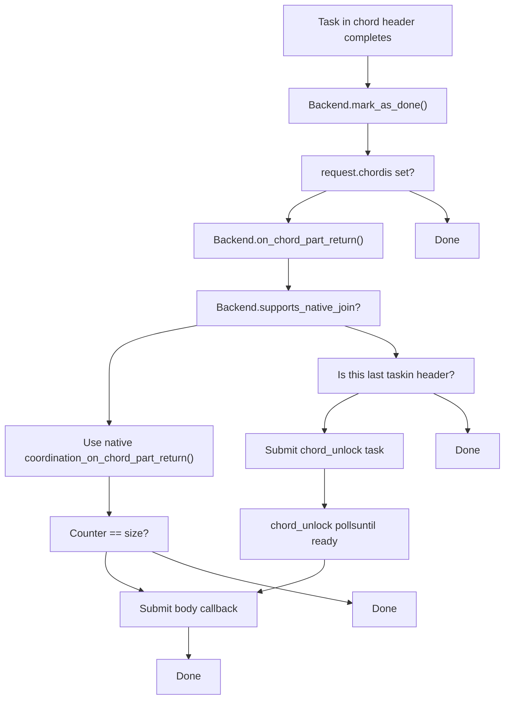
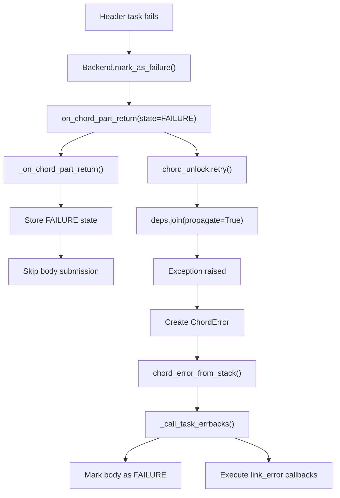
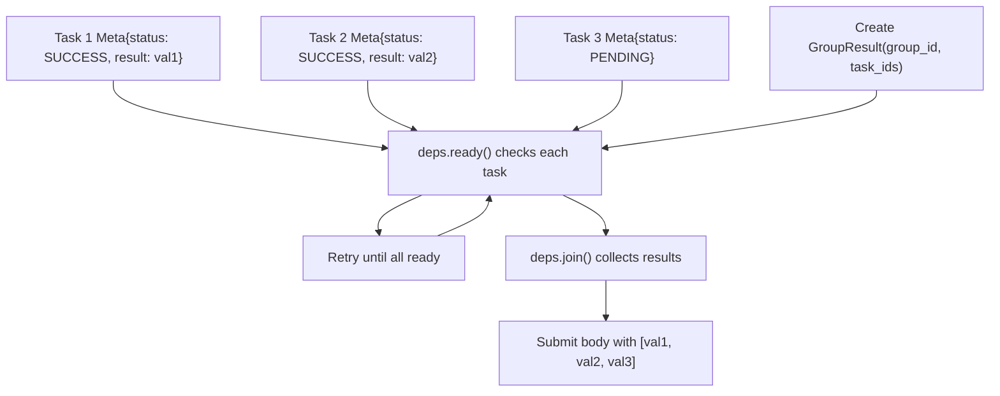

# Chord Coordination

Relevant source files

-   [celery/app/builtins.py](https://github.com/celery/celery/blob/4d068b56/celery/app/builtins.py)
-   [celery/backends/base.py](https://github.com/celery/celery/blob/4d068b56/celery/backends/base.py)
-   [celery/backends/redis.py](https://github.com/celery/celery/blob/4d068b56/celery/backends/redis.py)
-   [celery/result.py](https://github.com/celery/celery/blob/4d068b56/celery/result.py)
-   [docs/userguide/configuration.rst](https://github.com/celery/celery/blob/4d068b56/docs/userguide/configuration.rst)
-   [t/unit/backends/test\_base.py](https://github.com/celery/celery/blob/4d068b56/t/unit/backends/test_base.py)
-   [t/unit/backends/test\_redis.py](https://github.com/celery/celery/blob/4d068b56/t/unit/backends/test_redis.py)
-   [t/unit/tasks/test\_chord.py](https://github.com/celery/celery/blob/4d068b56/t/unit/tasks/test_chord.py)
-   [t/unit/tasks/test\_result.py](https://github.com/celery/celery/blob/4d068b56/t/unit/tasks/test_result.py)

## Purpose and Scope

This page documents the chord coordination mechanism in Celery, which ensures that when a chord (a group of tasks followed by a callback) executes, the callback task runs only after all header tasks complete successfully. Chord coordination is implemented differently depending on backend capabilities: backends like Redis use native atomic operations, while others use a fallback polling mechanism.

For general information about chords and canvas workflows, see [Workflow Primitives](/celery/celery/4.2-workflow-primitives). For chord execution details, see [Chord Execution](/celery/celery/4.4-chord-execution). This page focuses specifically on the coordination mechanisms that track chord completion across different result backends.

---

## Chord Coordination Overview

A chord consists of two parts:

-   **Header**: A `group` of tasks that execute in parallel
-   **Body**: A callback task that receives the results of all header tasks

The coordination challenge is ensuring the body executes exactly once, only after all header tasks complete, even when tasks finish in any order across distributed workers.

> **[Mermaid sequence]**
> *(图表结构无法解析)*

**Sources:** [celery/canvas.py1718-1800](https://github.com/celery/celery/blob/4d068b56/celery/canvas.py#L1718-L1800) [celery/backends/base.py185-187](https://github.com/celery/celery/blob/4d068b56/celery/backends/base.py#L185-L187)

---

## Native vs Fallback Chord Implementations

Celery provides two chord coordination strategies based on backend capabilities:

| Strategy | Backends | Mechanism | Key Characteristic |
| --- | --- | --- | --- |
| **Native** | Redis, Memcached | Atomic counter operations | Real-time, no polling |
| **Fallback** | Database, RPC, MongoDB, etc. | `celery.chord_unlock` polling task | Periodic polling |


**Sources:** [celery/backends/redis.py207](https://github.com/celery/celery/blob/4d068b56/celery/backends/redis.py#L207-L207) [celery/backends/base.py120-121](https://github.com/celery/celery/blob/4d068b56/celery/backends/base.py#L120-L121) [celery/app/builtins.py37-98](https://github.com/celery/celery/blob/4d068b56/celery/app/builtins.py#L37-L98)

---

## Native Chord Support in Redis Backend

The Redis backend implements chord coordination using atomic Redis operations. Each task completion increments a counter, and when the counter reaches the expected size, the body task is immediately submitted.

### Redis Chord Tracking Architecture


### Key Redis Backend Methods

The following methods in `RedisBackend` handle chord coordination:

**`_on_chord_apply(group_id, body, result)`** [celery/backends/redis.py400-430](https://github.com/celery/celery/blob/4d068b56/celery/backends/redis.py#L400-L430)

-   Called when a chord is first applied
-   Sets the expected chord size: `self.client.setnx(size_key, len(result))`
-   Sets expiration on the size key
-   Returns the body callback signature

**`_on_chord_part_return(request, state, result)`** [celery/backends/redis.py432-490](https://github.com/celery/celery/blob/4d068b56/celery/backends/redis.py#L432-L490)

-   Called each time a header task completes
-   Atomically adds the task to a sorted set: `self.client.zadd(jkey, {encoded_task_result: now})`
-   Checks completion: `self.client.zcount(jkey, 0, "+inf") >= size`
-   If complete, retrieves all results and triggers the body

**`_chord_apply_tasks(header_result_args, body, **kwargs)`** [celery/backends/redis.py582-611](https://github.com/celery/celery/blob/4d068b56/celery/backends/redis.py#L582-L611)

-   Submits the body callback task with collected results
-   Handles error propagation if any header task failed

### Redis Chord State Machine

> **[Mermaid stateDiagram]**
> *(图表结构无法解析)*

**Sources:** [celery/backends/redis.py400-611](https://github.com/celery/celery/blob/4d068b56/celery/backends/redis.py#L400-L611) [celery/backends/base.py1078-1130](https://github.com/celery/celery/blob/4d068b56/celery/backends/base.py#L1078-L1130)

---

## Fallback Chord Support (chord\_unlock)

For backends that don't support atomic operations, Celery uses a polling mechanism implemented by the `celery.chord_unlock` task.

### Chord Unlock Task Flow

> **[Mermaid sequence]**
> *(图表结构无法解析)*

### chord\_unlock Task Implementation

The `unlock_chord` task is defined in [celery/app/builtins.py37-98](https://github.com/celery/celery/blob/4d068b56/celery/app/builtins.py#L37-L98):

```
@app.task(name='celery.chord_unlock', max_retries=None,
          default_retry_delay=app.conf.result_chord_retry_interval,
          ignore_result=True, lazy=False, bind=True)
def unlock_chord(self, group_id, callback, interval=None,
                 max_retries=None, result=None, **kwargs):
```
**Key behaviors:**

1.  **Polling Loop**: Checks `deps.ready()` and retries if not complete
2.  **Configuration**: Uses `result_chord_retry_interval` (default 1 second)
3.  **No Retry Limit**: `max_retries=None` means it polls indefinitely
4.  **Result Collection**: Calls `deps.join()` with `result_chord_join_timeout`

### Fallback Chord Decision Tree


**Sources:** [celery/app/builtins.py37-98](https://github.com/celery/celery/blob/4d068b56/celery/app/builtins.py#L37-L98) [celery/backends/base.py185-187](https://github.com/celery/celery/blob/4d068b56/celery/backends/base.py#L185-L187)

---

## Chord Error Handling

When tasks in a chord header fail or raise exceptions, Celery must handle error propagation to prevent the body from executing with incomplete results.

### Error Propagation Mechanisms


### Backend Error Handling Methods

**`chord_error_from_stack(callback, exc)`** [celery/backends/base.py309-335](https://github.com/celery/celery/blob/4d068b56/celery/backends/base.py#L309-L335)

-   Creates a fake request for the callback task
-   Calls error callbacks (`link_error`)
-   Marks the callback task as failed using `fail_from_current_stack()`

**`_handle_group_chord_error(group_callback, backend, exc)`** [celery/backends/base.py337-403](https://github.com/celery/celery/blob/4d068b56/celery/backends/base.py#L337-L403)

-   Special handling when the chord body is a group (prevents hanging, issue #8786)
-   Revokes all tasks in the group body
-   Marks each as failed with the original exception
-   Executes error callbacks for each task

**`_call_task_errbacks(request, exc, traceback)`** [celery/backends/base.py244-288](https://github.com/celery/celery/blob/4d068b56/celery/backends/base.py#L244-L288)

-   Executes `link_error` callbacks
-   Handles both old-style (task\_id only) and new-style (request, exc, traceback) errbacks
-   Gracefully handles non-registered tasks

### Chord Error Example Flow

> **[Mermaid sequence]**
> *(图表结构无法解析)*

**Sources:** [celery/backends/base.py309-403](https://github.com/celery/celery/blob/4d068b56/celery/backends/base.py#L309-L403) [celery/app/builtins.py82-97](https://github.com/celery/celery/blob/4d068b56/celery/app/builtins.py#L82-L97)

---

## Chord State Tracking

Chord coordination requires tracking which tasks have completed and their results. The implementation differs between native and fallback backends.

### Redis Native Tracking

Redis uses two keys per chord:

| Key Pattern | Type | Purpose | Expiration |
| --- | --- | --- | --- |
| `celery-chord-meta-{group_id}` | Sorted Set | Stores completed task results with timestamps | Set after all tasks complete |
| `celery-chord-meta-{group_id}-size` | String (integer) | Expected number of header tasks | Matches result expiration |

**Operations:**

1.  **Initialization**: `SETNX` to set the size (only if not exists)
2.  **Task Completion**: `ZADD` to add result with timestamp as score
3.  **Count Check**: `ZCOUNT` to check how many tasks have completed
4.  **Result Retrieval**: `ZRANGE` to get all results when complete
5.  **Cleanup**: Keys expire automatically based on `result_expires` configuration

### Fallback State Tracking

The fallback mechanism relies on the backend's existing result storage:


### Chord Request Context

Each task in a chord header has `request.chord` set with coordination metadata:

```
# Structure stored in Context.chord (from task headers)
{
    'task_id': body_task_id,      # ID of the callback task
    'group_id': group_id,          # ID of the chord header group
    'options': body_options,       # Options for body task execution
}
```
This is used by:

-   `Backend.mark_as_done()` → `on_chord_part_return()` [celery/backends/base.py185-187](https://github.com/celery/celery/blob/4d068b56/celery/backends/base.py#L185-L187)
-   `Backend.mark_as_failure()` → `on_chord_part_return()` [celery/backends/base.py198-199](https://github.com/celery/celery/blob/4d068b56/celery/backends/base.py#L198-L199)
-   `Backend.mark_as_revoked()` → `on_chord_part_return()` [celery/backends/base.py296-297](https://github.com/celery/celery/blob/4d068b56/celery/backends/base.py#L296-L297)

**Sources:** [celery/backends/redis.py400-490](https://github.com/celery/celery/blob/4d068b56/celery/backends/redis.py#L400-L490) [celery/app/task.py68-69](https://github.com/celery/celery/blob/4d068b56/celery/app/task.py#L68-L69) [celery/result.py550-687](https://github.com/celery/celery/blob/4d068b56/celery/result.py#L550-L687)

---

## Configuration Options

Chord coordination behavior is controlled by several configuration settings:

| Setting | Default | Description | Relevant To |
| --- | --- | --- | --- |
| `result_chord_retry_interval` | 1.0 | Seconds between `chord_unlock` retries | Fallback only |
| `result_chord_join_timeout` | 3.0 | Timeout for joining chord header results | Fallback only |
| `result_expires` | 86400 (24h) | Chord metadata expiration | Both |
| `task_allow_error_cb_on_chord_header` | False | Whether to allow error callbacks on header tasks | Both |

**Example configuration:**

```
# Faster polling for fallback backends
app.conf.result_chord_retry_interval = 0.5

# Longer timeout for slow header tasks
app.conf.result_chord_join_timeout = 10.0

# Allow error callbacks on header tasks (Celery 5.0+)
app.conf.task_allow_error_cb_on_chord_header = True
```
**Sources:** [docs/userguide/configuration.rst400-800](https://github.com/celery/celery/blob/4d068b56/docs/userguide/configuration.rst#L400-L800) [celery/app/builtins.py48-79](https://github.com/celery/celery/blob/4d068b56/celery/app/builtins.py#L48-L79)

---

## Implementation Comparison Table

| Aspect | Native (Redis) | Fallback (chord\_unlock) |
| --- | --- | --- |
| **Trigger Mechanism** | Atomic counter check | Polling task |
| **Latency** | Immediate on last task | `result_chord_retry_interval` delay |
| **Overhead** | Minimal (few Redis ops) | Additional task per chord |
| **Scalability** | Excellent | Good (limited by polling frequency) |
| **Failure Detection** | Immediate | On next poll attempt |
| **Backend Support** | Redis, Memcached | Database, RPC, MongoDB, etc. |
| **Key Methods** | `_on_chord_part_return()` [celery/backends/redis.py432-490](https://github.com/celery/celery/blob/4d068b56/celery/backends/redis.py#L432-L490) | `unlock_chord()` [celery/app/builtins.py37-98](https://github.com/celery/celery/blob/4d068b56/celery/app/builtins.py#L37-L98) |

**Sources:** [celery/backends/redis.py190-611](https://github.com/celery/celery/blob/4d068b56/celery/backends/redis.py#L190-L611) [celery/app/builtins.py37-98](https://github.com/celery/celery/blob/4d068b56/celery/app/builtins.py#L37-L98) [celery/backends/base.py120-121](https://github.com/celery/celery/blob/4d068b56/celery/backends/base.py#L120-L121)
