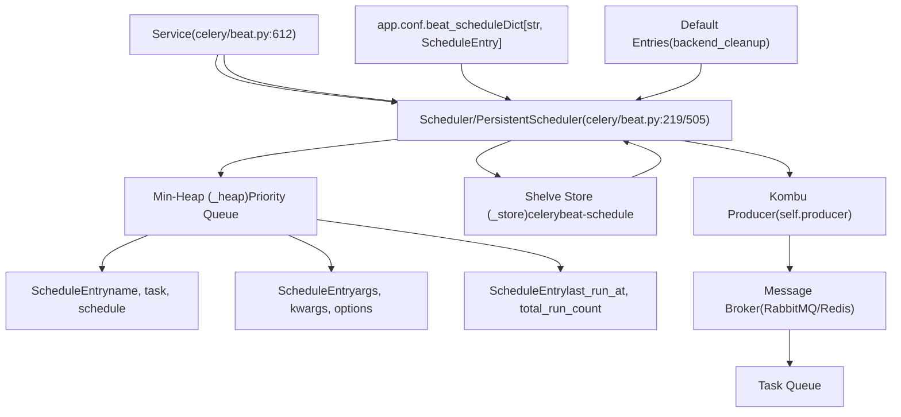
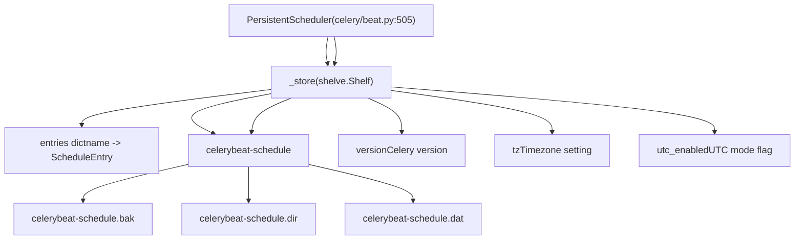
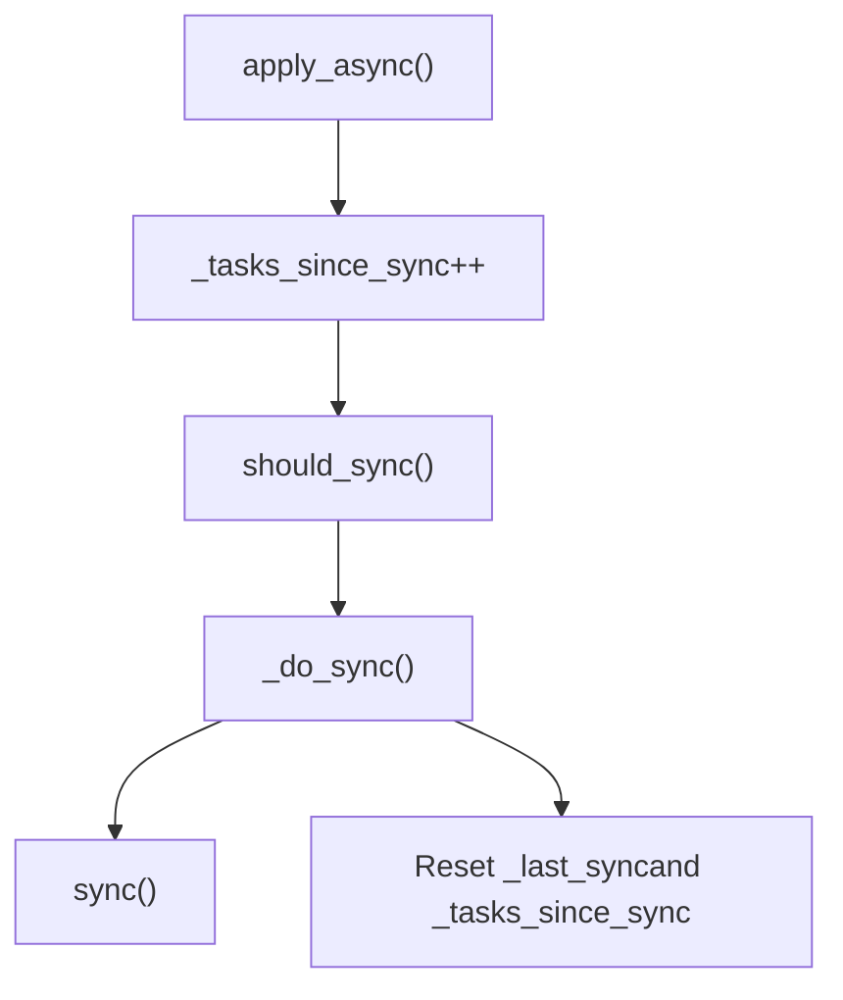
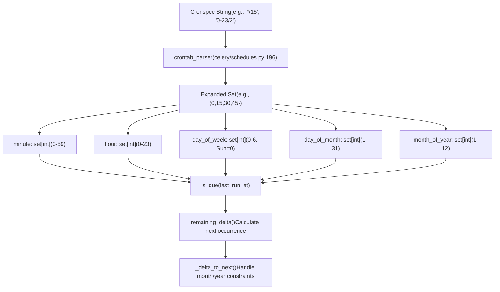
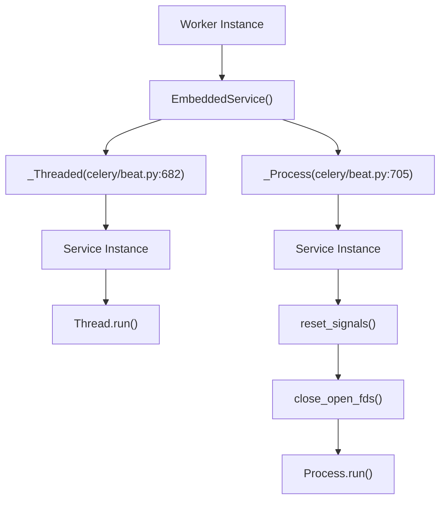
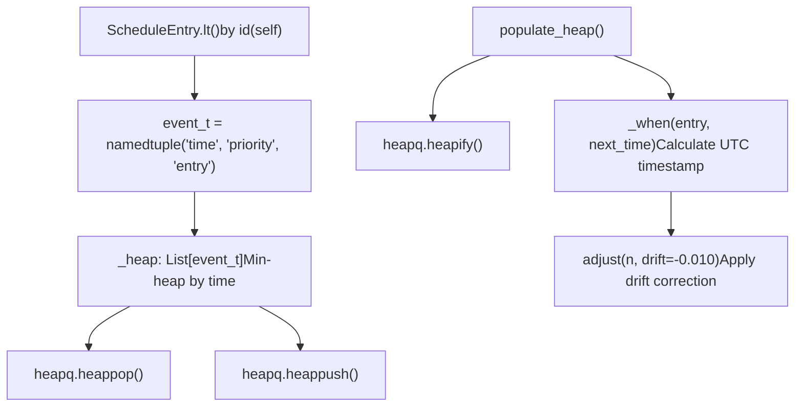
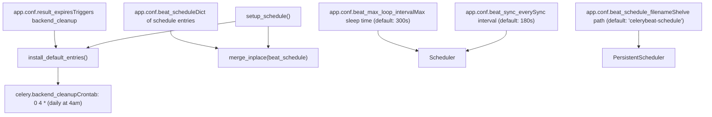
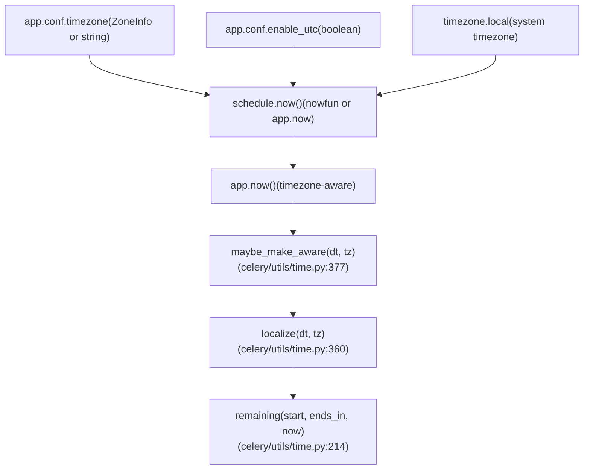

# Periodic Tasks (Beat)

Relevant source files

-   [CONTRIBUTORS.txt](https://github.com/celery/celery/blob/4d068b56/CONTRIBUTORS.txt)
-   [celery/beat.py](https://github.com/celery/celery/blob/4d068b56/celery/beat.py)
-   [celery/schedules.py](https://github.com/celery/celery/blob/4d068b56/celery/schedules.py)
-   [celery/utils/iso8601.py](https://github.com/celery/celery/blob/4d068b56/celery/utils/iso8601.py)
-   [celery/utils/time.py](https://github.com/celery/celery/blob/4d068b56/celery/utils/time.py)
-   [docs/AUTHORS.txt](https://github.com/celery/celery/blob/4d068b56/docs/AUTHORS.txt)
-   [t/unit/app/test\_beat.py](https://github.com/celery/celery/blob/4d068b56/t/unit/app/test_beat.py)
-   [t/unit/app/test\_schedules.py](https://github.com/celery/celery/blob/4d068b56/t/unit/app/test_schedules.py)
-   [t/unit/backends/test\_cache.py](https://github.com/celery/celery/blob/4d068b56/t/unit/backends/test_cache.py)
-   [t/unit/utils/test\_serialization.py](https://github.com/celery/celery/blob/4d068b56/t/unit/utils/test_serialization.py)
-   [t/unit/utils/test\_time.py](https://github.com/celery/celery/blob/4d068b56/t/unit/utils/test_time.py)

This document describes the Beat scheduler system that enables periodic task execution in Celery. Beat is a standalone service that reads scheduled task definitions, determines when they should run, and publishes task messages to the broker at the appropriate times.

For information about task definitions and execution, see [Tasks](/celery/celery/3-tasks). For information about workers that consume these tasks, see [Workers](/celery/celery/5-workers). For schedule configuration syntax, see [Schedule Types](/celery/celery/7.2-schedule-types).

---

## Overview

The Beat scheduler operates as a separate process that maintains a schedule of periodic tasks. It uses a tick-based architecture where each iteration checks for due tasks, publishes them to the message broker, and determines when to wake up next. The scheduler supports multiple schedule types (fixed intervals, cron expressions, solar events) and can persist its state across restarts.

**Core Components:**

-   **Service** ([celery/beat.py612-680](https://github.com/celery/celery/blob/4d068b56/celery/beat.py#L612-L680)): Manages scheduler lifecycle and the tick loop
-   **Scheduler** ([celery/beat.py219-503](https://github.com/celery/celery/blob/4d068b56/celery/beat.py#L219-L503)): Maintains schedule entries and determines when tasks are due
-   **ScheduleEntry** ([celery/beat.py82-199](https://github.com/celery/celery/blob/4d068b56/celery/beat.py#L82-L199)): Wraps a task with its schedule and execution metadata
-   **Schedule Types** ([celery/schedules.py](https://github.com/celery/celery/blob/4d068b56/celery/schedules.py)): Define when tasks should run (interval, crontab, solar)

---

## Beat Service Architecture


**Sources:** [celery/beat.py612-680](https://github.com/celery/celery/blob/4d068b56/celery/beat.py#L612-L680) [celery/beat.py219-503](https://github.com/celery/celery/blob/4d068b56/celery/beat.py#L219-L503) [celery/beat.py82-199](https://github.com/celery/celery/blob/4d068b56/celery/beat.py#L82-L199)

---

## Tick Loop Mechanism

The scheduler's `tick()` method is the heart of the Beat system. It implements a non-blocking event loop that processes one due task per iteration.

> **[Mermaid sequence]**
> *(图表结构无法解析)*

**Key Methods:**

-   `Scheduler.tick()` ([celery/beat.py326-364](https://github.com/celery/celery/blob/4d068b56/celery/beat.py#L326-L364)): Main iteration that checks and applies one due entry
-   `Scheduler.populate_heap()` ([celery/beat.py310-323](https://github.com/celery/celery/blob/4d068b56/celery/beat.py#L310-L323)): Builds min-heap from schedule entries
-   `Scheduler.apply_entry()` ([celery/beat.py279-290](https://github.com/celery/celery/blob/4d068b56/celery/beat.py#L279-L290)): Publishes task message to broker
-   `Scheduler.reserve()` ([celery/beat.py389-391](https://github.com/celery/celery/blob/4d068b56/celery/beat.py#L389-L391)): Updates entry with new last\_run\_at and increments counter

**Sources:** [celery/beat.py326-364](https://github.com/celery/celery/blob/4d068b56/celery/beat.py#L326-L364) [celery/beat.py310-323](https://github.com/celery/celery/blob/4d068b56/celery/beat.py#L310-L323) [celery/beat.py279-290](https://github.com/celery/celery/blob/4d068b56/celery/beat.py#L279-L290)

---

## ScheduleEntry Data Structure

`ScheduleEntry` encapsulates all information needed to execute a periodic task.

| Field | Type | Description |
| --- | --- | --- |
| `name` | str | Unique identifier for the schedule entry |
| `task` | str | Task name (e.g., `'myapp.tasks.cleanup'`) |
| `schedule` | BaseSchedule | Schedule instance (schedule, crontab, solar) |
| `args` | tuple | Positional arguments for task |
| `kwargs` | dict | Keyword arguments for task (supports BeatLazyFunc) |
| `options` | dict | Task execution options (routing\_key, expires, etc.) |
| `last_run_at` | datetime | Last execution timestamp (timezone-aware) |
| `total_run_count` | int | Number of times task has been executed |

**BeatLazyFunc Support:**

Arguments can be wrapped in `BeatLazyFunc` for lazy evaluation at execution time ([celery/beat.py50-78](https://github.com/celery/celery/blob/4d068b56/celery/beat.py#L50-L78)):

```
# Evaluated when task is applied, not when schedule is loaded
beat_schedule = {
    'example': {
        'task': 'myapp.tasks.process',
        'schedule': 300,
        'kwargs': {
            'timestamp': BeatLazyFunc(datetime.now)
        }
    }
}
```
**Sources:** [celery/beat.py82-199](https://github.com/celery/celery/blob/4d068b56/celery/beat.py#L82-L199) [celery/beat.py50-78](https://github.com/celery/celery/blob/4d068b56/celery/beat.py#L50-L78) [celery/beat.py201-216](https://github.com/celery/celery/blob/4d068b56/celery/beat.py#L201-L216)

---

## Persistent Scheduler

`PersistentScheduler` extends the base `Scheduler` with persistence using Python's `shelve` module.


**Persistence Operations:**

-   **setup\_schedule()** ([celery/beat.py531-567](https://github.com/celery/celery/blob/4d068b56/celery/beat.py#L531-L567)): Opens shelve, handles corruption, checks timezone/UTC changes
-   **sync()** ([celery/beat.py599-601](https://github.com/celery/celery/blob/4d068b56/celery/beat.py#L599-L601)): Flushes changes to disk via `_store.sync()`
-   **\_create\_schedule()** ([celery/beat.py569-590](https://github.com/celery/celery/blob/4d068b56/celery/beat.py#L569-L590)): Initializes empty schedule or migrates from old versions
-   **\_destroy\_open\_corrupted\_schedule()** ([celery/beat.py525-529](https://github.com/celery/celery/blob/4d068b56/celery/beat.py#L525-L529)): Removes corrupted database files and recreates

**Timezone/Version Migration:**

When timezone or UTC settings change, PersistentScheduler clears the schedule to avoid incorrect execution times ([celery/beat.py545-556](https://github.com/celery/celery/blob/4d068b56/celery/beat.py#L545-L556)):

```
# Detected timezone change
if stored_tz is not None and stored_tz != tz:
    warning('Reset: Timezone changed from %r to %r', stored_tz, tz)
    self._store.clear()  # Reset database

# Detected UTC mode change
if stored_utc is not None and stored_utc != utc:
    warning('Reset: UTC changed from %s to %s', choices[stored_utc], choices[utc])
    self._store.clear()
```
**Sources:** [celery/beat.py505-610](https://github.com/celery/celery/blob/4d068b56/celery/beat.py#L505-L610) [celery/beat.py531-567](https://github.com/celery/celery/blob/4d068b56/celery/beat.py#L531-L567)

---

## Schedule Synchronization

The scheduler periodically syncs its state based on two conditions:

1.  **Time-based**: After `beat_sync_every` seconds (default: 180 seconds)
2.  **Task-based**: After `beat_sync_every_tasks` task applications


**Key Methods:**

-   `Scheduler.should_sync()` ([celery/beat.py381-387](https://github.com/celery/celery/blob/4d068b56/celery/beat.py#L381-L387)): Checks if sync is needed
-   `Scheduler._do_sync()` ([celery/beat.py427-433](https://github.com/celery/celery/blob/4d068b56/celery/beat.py#L427-L433)): Calls `sync()` and resets counters
-   `PersistentScheduler.sync()` ([celery/beat.py599-601](https://github.com/celery/celery/blob/4d068b56/celery/beat.py#L599-L601)): Writes shelve to disk

**Configuration:**

-   `beat_sync_every`: Sync interval in seconds (default: 180)
-   `beat_sync_every_tasks`: Sync after N task applications (default: None)

**Sources:** [celery/beat.py381-387](https://github.com/celery/celery/blob/4d068b56/celery/beat.py#L381-L387) [celery/beat.py427-433](https://github.com/celery/celery/blob/4d068b56/celery/beat.py#L427-L433) [celery/beat.py393-418](https://github.com/celery/celery/blob/4d068b56/celery/beat.py#L393-L418)

---

## Schedule Types and is\_due Implementation

Each schedule type implements `is_due(last_run_at)` which returns `(is_due, next_time_to_check)`.

### Fixed Interval (schedule)

```
# celery/schedules.py:111-194
class schedule(BaseSchedule):
    def __init__(self, run_every, relative=False):
        self.run_every = maybe_timedelta(run_every)  # Convert to timedelta
        self.relative = relative  # Round to interval resolution

    def is_due(self, last_run_at):
        rem_delta = self.remaining_estimate(last_run_at)
        remaining_s = max(rem_delta.total_seconds(), 0)
        if remaining_s == 0:
            return schedstate(is_due=True, next=self.seconds)
        return schedstate(is_due=False, next=remaining_s)
```
**Example:**

```
# Run every 30 seconds
schedule(run_every=30.0)
# Run every 5 minutes
schedule(run_every=timedelta(minutes=5))
```
**Sources:** [celery/schedules.py111-194](https://github.com/celery/celery/blob/4d068b56/celery/schedules.py#L111-L194)

### Crontab (crontab)

The `crontab` class supports standard cron syntax with minute, hour, day\_of\_week, day\_of\_month, and month\_of\_year fields.


**Crontab Parser:**

The `crontab_parser` class ([celery/schedules.py196-321](https://github.com/celery/celery/blob/4d068b56/celery/schedules.py#L196-L321)) parses cron expressions using regex patterns:

| Pattern | Example | Result |
| --- | --- | --- |
| `*` | `*` | All values (0-59 for minutes) |
| Range | `10-15` | {10, 11, 12, 13, 14, 15} |
| Steps | `*/5` | {0, 5, 10, 15, ...} |
| Range+Steps | `10-30/5` | {10, 15, 20, 25, 30} |
| List | `1,5,10` | {1, 5, 10} |
| Weekday Names | `mon-fri` | {1, 2, 3, 4, 5} |
| Month Names | `jan,feb` | {1, 2} |

**Crontab Examples:**

```
# Every 15 minutes
crontab(minute='*/15')

# At 00:00 every day
crontab(minute=0, hour=0)

# At 08:30 every Monday
crontab(minute=30, hour=8, day_of_week='mon')

# First day of every month at midnight
crontab(minute=0, hour=0, day_of_month=1)

# Using from_string() factory
crontab.from_string('0 8 * * MON')  # Every Monday at 08:00
```
**Crontab Due Logic:**

The `crontab.is_due()` method ([celery/schedules.py641-688](https://github.com/celery/celery/blob/4d068b56/celery/schedules.py#L641-L688)) determines if a task should run:

1.  Calculate `remaining_estimate()` - time until next occurrence
2.  If remaining is 0, task is due
3.  Check `beat_cron_starting_deadline` to prevent late runs
4.  Return `(is_due, seconds_until_next_check)`

**Sources:** [celery/schedules.py323-701](https://github.com/celery/celery/blob/4d068b56/celery/schedules.py#L323-L701) [celery/schedules.py196-321](https://github.com/celery/celery/blob/4d068b56/celery/schedules.py#L196-L321)

### Solar (solar)

Solar schedules trigger tasks based on astronomical events using the `ephem` library.

**Supported Events:**

-   `dawn_astronomical`, `dawn_nautical`, `dawn_civil`
-   `sunrise`, `solar_noon`, `sunset`
-   `dusk_civil`, `dusk_nautical`, `dusk_astronomical`

**Example:**

```
# Run at sunrise in New York (latitude 40.7, longitude -74.0)
solar('sunrise', lat=40.7, lon=-74.0)

# Run at sunset
solar('sunset', lat=40.7, lon=-74.0)
```
**Implementation:**

The `solar` class ([celery/schedules.py717-857](https://github.com/celery/celery/blob/4d068b56/celery/schedules.py#L717-L857)) uses `ephem.Observer` to calculate event times based on latitude, longitude, and horizon angles specific to each event.

**Sources:** [celery/schedules.py717-857](https://github.com/celery/celery/blob/4d068b56/celery/schedules.py#L717-L857)

---

## Service Lifecycle

The `Service` class manages the scheduler's lifecycle from initialization through shutdown.

> **[Mermaid stateDiagram]**
> *(图表结构无法解析)*

**Service Methods:**

-   **`__init__(app, max_interval, schedule_filename, scheduler_cls)`** ([celery/beat.py617-625](https://github.com/celery/celery/blob/4d068b56/celery/beat.py#L617-L625)): Initialize with configuration
-   **`start(embedded_process=False)`** ([celery/beat.py633-655](https://github.com/celery/celery/blob/4d068b56/celery/beat.py#L633-L655)): Begin tick loop, send `beat_init` signal
-   **`stop(wait=False)`** ([celery/beat.py661-664](https://github.com/celery/celery/blob/4d068b56/celery/beat.py#L661-L664)): Set shutdown flag, optionally wait for completion
-   **`get_scheduler(lazy=False)`** ([celery/beat.py666-675](https://github.com/celery/celery/blob/4d068b56/celery/beat.py#L666-L675)): Create scheduler instance using extension namespace
-   **`sync()`** ([celery/beat.py657-659](https://github.com/celery/celery/blob/4d068b56/celery/beat.py#L657-L659)): Close scheduler (triggers sync) and set stopped flag

**Signals:**

-   `signals.beat_init`: Sent when beat starts
-   `signals.beat_embedded_init`: Sent when embedded beat starts

**Sources:** [celery/beat.py612-680](https://github.com/celery/celery/blob/4d068b56/celery/beat.py#L612-L680)

---

## Embedded Beat

Celery supports running Beat within the worker process using threads or multiprocessing.


**Factory Function:**

`EmbeddedService(app, max_interval, thread=False)` ([celery/beat.py727-738](https://github.com/celery/celery/blob/4d068b56/celery/beat.py#L727-L738)) returns either:

-   `_Threaded`: Runs Beat in a daemon thread (max\_interval forced to 1 second for quick shutdown)
-   `_Process`: Runs Beat in a separate process (if multiprocessing available)

**Thread Implementation:**

```
class _Threaded(Thread):
    def __init__(self, app, **kwargs):
        self.service = Service(app, **kwargs)
        self.daemon = True
        self.name = 'Beat'

    def run(self):
        self.app.set_current()
        self.service.start()
```
**Process Implementation:**

```
class _Process(Process):
    def run(self):
        reset_signals(full=False)  # Reset signal handlers
        platforms.close_open_fds([...])  # Close inherited file descriptors
        self.app.set_default()
        self.app.set_current()
        self.service.start(embedded_process=True)
```
**Sources:** [celery/beat.py682-738](https://github.com/celery/celery/blob/4d068b56/celery/beat.py#L682-L738)

---

## Schedule Entry Comparison and Heap Management

The scheduler uses a min-heap to efficiently track the next task to execute. Heap entries are tuples of `(time, priority, entry)`.


**Key Implementation Details:**

**`_when(entry, next_time_to_run)` ([celery/beat.py300-308](https://github.com/celery/celery/blob/4d068b56/celery/beat.py#L300-L308)**:

-   Converts entry's `last_run_at` to UTC timestamp
-   Adds `next_time_to_run` (in seconds)
-   Applies microsecond precision
-   Returns UTC timestamp for heap ordering

**`adjust(n, drift=-0.010)` ([celery/beat.py292-295](https://github.com/celery/celery/blob/4d068b56/celery/beat.py#L292-L295)**:

-   Applies -10ms drift to prevent busy-wait
-   Ensures small delays don't cause immediate re-execution

**`ScheduleEntry.__lt__(other)` ([celery/beat.py175-184](https://github.com/celery/celery/blob/4d068b56/celery/beat.py#L175-L184)**:

-   Compares entries by `id(self)` (memory address)
-   Used as tiebreaker when times are equal
-   Prevents comparison of actual entry contents

**Heap Rebuild:**

The heap is rebuilt when the schedule changes ([celery/beat.py338-341](https://github.com/celery/celery/blob/4d068b56/celery/beat.py#L338-L341)):

```
if (self._heap is None or
    not self.schedules_equal(self.old_schedulers, self.schedule)):
    self.old_schedulers = copy.copy(self.schedule)
    self.populate_heap()
```
**Sources:** [celery/beat.py300-308](https://github.com/celery/celery/blob/4d068b56/celery/beat.py#L300-L308) [celery/beat.py292-295](https://github.com/celery/celery/blob/4d068b56/celery/beat.py#L292-L295) [celery/beat.py310-323](https://github.com/celery/celery/blob/4d068b56/celery/beat.py#L310-L323) [celery/beat.py175-184](https://github.com/celery/celery/blob/4d068b56/celery/beat.py#L175-L184)

---

## Configuration Integration

Beat reads schedule configuration from the Celery application's configuration.


**Schedule Entry Format:**

```
app.conf.beat_schedule = {
    'task-name': {
        'task': 'myapp.tasks.add',           # Required
        'schedule': 30.0,                     # Required: seconds, timedelta, or schedule object
        'args': (16, 16),                     # Optional: positional args
        'kwargs': {'callback': 'process'},    # Optional: keyword args
        'options': {                          # Optional: apply_async options
            'queue': 'priority',
            'routing_key': 'high',
            'expires': 60,
        },
    },
}
```
**Built-in Tasks:**

The scheduler automatically adds `celery.backend_cleanup` if:

-   `result_expires` is set (results have expiration)
-   Backend doesn't support auto-expiration (`supports_autoexpire=False`)

**Schedule Update:**

When `beat_schedule` changes at runtime:

1.  `merge_inplace()` compares old and new schedules ([celery/beat.py458-472](https://github.com/celery/celery/blob/4d068b56/celery/beat.py#L458-L472))
2.  Removes entries not in new schedule
3.  Updates existing entries with new values
4.  Adds new entries
5.  Heap is rebuilt on next `tick()` if changes detected

**Sources:** [celery/beat.py268-277](https://github.com/celery/celery/blob/4d068b56/celery/beat.py#L268-L277) [celery/beat.py423-425](https://github.com/celery/celery/blob/4d068b56/celery/beat.py#L423-L425) [celery/beat.py458-472](https://github.com/celery/celery/blob/4d068b56/celery/beat.py#L458-L472)

---

## Time and Timezone Handling

Beat uses timezone-aware datetimes throughout to ensure correct scheduling across DST transitions and timezone changes.


**Key Timezone Functions:**

**`maybe_make_aware(dt, tz, naive_as_utc=True)` ([celery/utils/time.py377-386](https://github.com/celery/celery/blob/4d068b56/celery/utils/time.py#L377-L386)**:

-   Converts naive datetime to timezone-aware
-   If already aware, returns unchanged
-   Default assumes naive datetimes are UTC

**`remaining(start, ends_in, now, relative=False)` ([celery/utils/time.py214-250](https://github.com/celery/celery/blob/4d068b56/celery/utils/time.py#L214-L250)**:

-   Calculates time remaining until `start + ends_in`
-   Uses UTC for calculations to handle DST correctly
-   If `relative=True`, rounds to schedule resolution

**`ffwd` Class ([celery/utils/time.py389-431](https://github.com/celery/celery/blob/4d068b56/celery/utils/time.py#L389-L431)**:

-   Date arithmetic class similar to `dateutil.relativedelta`
-   Used by crontab to calculate next occurrence
-   Handles month boundaries and weekday positioning

**Timezone Persistence:**

PersistentScheduler stores timezone information ([celery/beat.py545-556](https://github.com/celery/celery/blob/4d068b56/celery/beat.py#L545-L556)):

-   `_store['tz']`: Current timezone string
-   `_store['utc_enabled']`: Current UTC mode
-   Clears schedule if either changes to prevent incorrect scheduling

**Sources:** [celery/utils/time.py377-386](https://github.com/celery/celery/blob/4d068b56/celery/utils/time.py#L377-L386) [celery/utils/time.py214-250](https://github.com/celery/celery/blob/4d068b56/celery/utils/time.py#L214-L250) [celery/utils/time.py389-431](https://github.com/celery/celery/blob/4d068b56/celery/utils/time.py#L389-L431) [celery/beat.py545-556](https://github.com/celery/celery/blob/4d068b56/celery/beat.py#L545-L556)

---

## CLI Integration

Beat can be started using the `celery beat` command, which is implemented in the CLI system.

**Command Structure:**

```
celery -A myapp beat [OPTIONS]

Options:
  --detach              Run as daemon
  -s, --schedule FILE   Path to schedule database
  -S, --scheduler CLS   Scheduler class
  --max-interval SEC    Max sleep between checks
  -l, --loglevel LEVEL  Logging level
```
**Scheduler Class Resolution:**

The `Service.get_scheduler()` method ([celery/beat.py666-675](https://github.com/celery/celery/blob/4d068b56/celery/beat.py#L666-L675)) resolves scheduler classes:

1.  Loads extension classes from `celery.beat_schedulers` entry point
2.  Uses `symbol_by_name()` to resolve class from string
3.  Supports built-in aliases (e.g., `'default'` → `PersistentScheduler`)

**Custom Scheduler Example:**

```
# Define custom scheduler
class MyScheduler(PersistentScheduler):
    def setup_schedule(self):
        # Custom initialization
        super().setup_schedule()

# Use via CLI
celery -A myapp beat -S myapp.schedulers:MyScheduler
```
**Sources:** [celery/beat.py666-675](https://github.com/celery/celery/blob/4d068b56/celery/beat.py#L666-L675)

---

## Testing and Mocking

The test suite provides examples of mocking schedulers for testing periodic tasks.

**Mock Scheduler Pattern:**

```
# t/unit/app/test_beat.py:133-145
class mScheduler(beat.Scheduler):
    def __init__(self, *args, **kwargs):
        self.sent = []  # Track sent tasks
        super().__init__(*args, **kwargs)

    def send_task(self, name=None, args=None, kwargs=None, **options):
        self.sent.append({'name': name, 'args': args,
                         'kwargs': kwargs, 'options': options})
        return self.app.AsyncResult(uuid())
```
**Mock Schedule Pattern:**

```
# t/unit/app/test_beat.py:159-177
class mocked_schedule(schedule):
    def __init__(self, is_due, next_run_at):
        self._is_due = is_due
        self._next_run_at = next_run_at
        self.run_every = timedelta(seconds=1)

    def is_due(self, last_run_at):
        return self._is_due, self._next_run_at

# Create test schedules
always_due = mocked_schedule(True, 1)
always_pending = mocked_schedule(False, 60)
```
**Testing Tick Behavior:**

```
# Add entry to scheduler
scheduler.add(
    name='test_task',
    schedule=always_due,
    args=(1, 2),
    kwargs={'foo': 'bar'}
)

# Execute tick
interval = scheduler.tick()

# Verify task was sent
assert len(scheduler.sent) == 1
assert scheduler.sent[0]['name'] == 'test_task'
assert interval == 0  # Due task returns 0
```
**Sources:** [t/unit/app/test\_beat.py133-145](https://github.com/celery/celery/blob/4d068b56/t/unit/app/test_beat.py#L133-L145) [t/unit/app/test\_beat.py159-177](https://github.com/celery/celery/blob/4d068b56/t/unit/app/test_beat.py#L159-L177) [t/unit/app/test\_beat.py371-377](https://github.com/celery/celery/blob/4d068b56/t/unit/app/test_beat.py#L371-L377)
