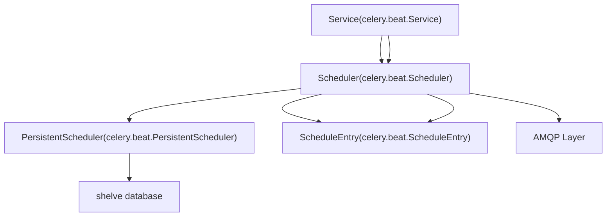
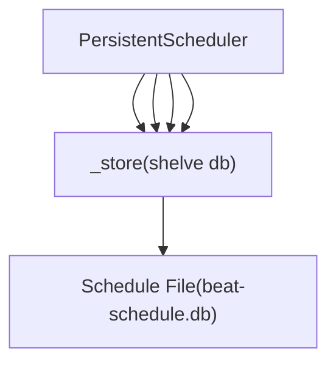
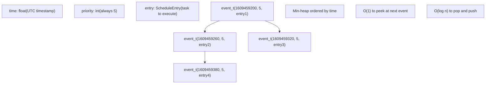
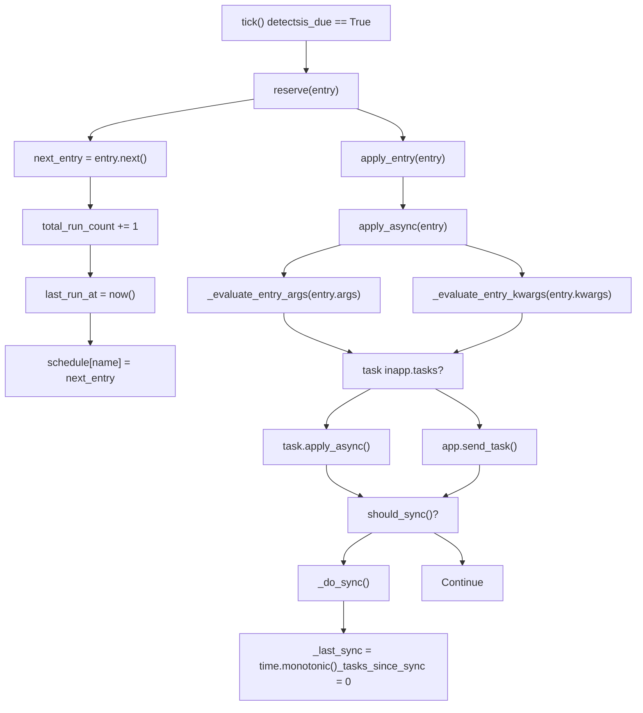
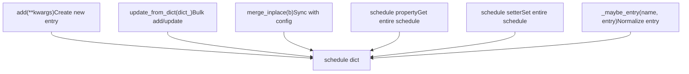
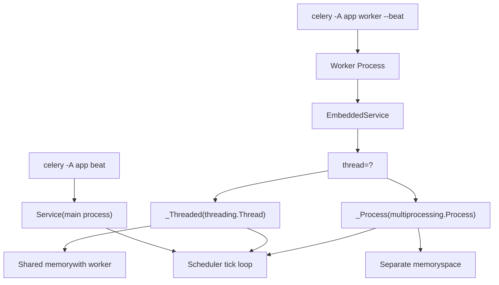
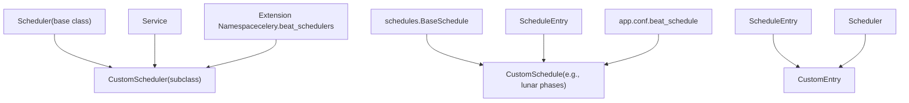
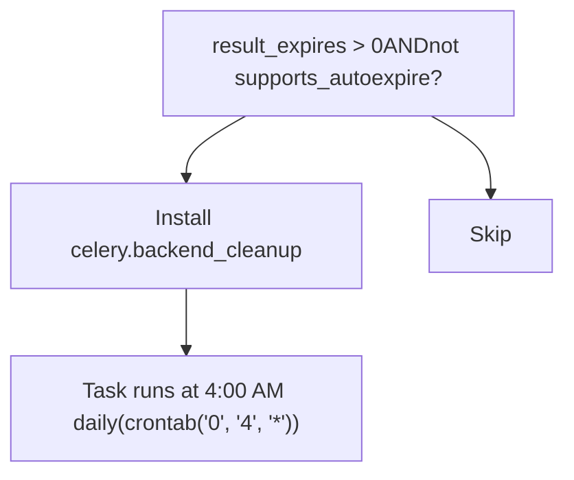

# Beat Scheduler Architecture

Relevant source files

-   [CONTRIBUTORS.txt](https://github.com/celery/celery/blob/4d068b56/CONTRIBUTORS.txt)
-   [celery/beat.py](https://github.com/celery/celery/blob/4d068b56/celery/beat.py)
-   [celery/schedules.py](https://github.com/celery/celery/blob/4d068b56/celery/schedules.py)
-   [celery/utils/iso8601.py](https://github.com/celery/celery/blob/4d068b56/celery/utils/iso8601.py)
-   [celery/utils/time.py](https://github.com/celery/celery/blob/4d068b56/celery/utils/time.py)
-   [docs/AUTHORS.txt](https://github.com/celery/celery/blob/4d068b56/docs/AUTHORS.txt)
-   [t/unit/app/test\_beat.py](https://github.com/celery/celery/blob/4d068b56/t/unit/app/test_beat.py)
-   [t/unit/app/test\_schedules.py](https://github.com/celery/celery/blob/4d068b56/t/unit/app/test_schedules.py)
-   [t/unit/backends/test\_cache.py](https://github.com/celery/celery/blob/4d068b56/t/unit/backends/test_cache.py)
-   [t/unit/utils/test\_serialization.py](https://github.com/celery/celery/blob/4d068b56/t/unit/utils/test_serialization.py)
-   [t/unit/utils/test\_time.py](https://github.com/celery/celery/blob/4d068b56/t/unit/utils/test_time.py)

## Purpose and Scope

This document explains the architecture of Celery's Beat scheduler system, which handles periodic task execution. It covers the main components (`Service`, `Scheduler`, `PersistentScheduler`, `ScheduleEntry`), the tick-based scheduling loop, heap management, and task dispatch mechanisms.

For information about specific schedule types (fixed interval, crontab, solar), see [Schedule Types](/celery/celery/7.2-schedule-types). For details on timezone handling and time calculations, see [Time and Timezone Handling](/celery/celery/7.3-time-and-timezone-handling). For persistence mechanisms and storage details, see [Persistent Storage](/celery/celery/7.4-persistent-storage).

---

## Core Component Architecture

The Beat scheduler consists of four primary components that work together to manage periodic task execution:


**Sources:** [celery/beat.py612-680](https://github.com/celery/celery/blob/4d068b56/celery/beat.py#L612-L680) [celery/beat.py219-503](https://github.com/celery/celery/blob/4d068b56/celery/beat.py#L219-L503) [celery/beat.py505-610](https://github.com/celery/celery/blob/4d068b56/celery/beat.py#L505-L610) [celery/beat.py82-199](https://github.com/celery/celery/blob/4d068b56/celery/beat.py#L82-L199)

### Service Class

The `Service` class ([celery/beat.py612-680](https://github.com/celery/celery/blob/4d068b56/celery/beat.py#L612-L680)) is the main entry point for the Beat scheduler. It orchestrates the scheduling loop and manages the lifecycle of the scheduler:

| Component | Type | Purpose |
| --- | --- | --- |
| `scheduler_cls` | Class attribute | Scheduler class to instantiate (default: `PersistentScheduler`) |
| `max_interval` | Instance attribute | Maximum sleep time between ticks |
| `schedule_filename` | Instance attribute | Path to persistent schedule storage |
| `_is_shutdown` | Event | Signals shutdown request |
| `_is_stopped` | Event | Signals shutdown completion |

The `start()` method ([celery/beat.py633-655](https://github.com/celery/celery/blob/4d068b56/celery/beat.py#L633-L655)) runs the main loop:

```
while not self._is_shutdown.is_set():
    interval = self.scheduler.tick()
    if interval and interval > 0.0:
        time.sleep(interval)
```
**Sources:** [celery/beat.py612-680](https://github.com/celery/celery/blob/4d068b56/celery/beat.py#L612-L680)

### Scheduler Class

The `Scheduler` class ([celery/beat.py219-503](https://github.com/celery/celery/blob/4d068b56/celery/beat.py#L219-L503)) manages the schedule and determines when tasks should execute:

| Attribute | Type | Default | Purpose |
| --- | --- | --- | --- |
| `schedule` | dict/shelve | `{}` | Maps entry names to `ScheduleEntry` objects |
| `max_interval` | int | 300 | Maximum seconds to sleep between checks |
| `sync_every` | int | 180 | Seconds between schedule syncs |
| `sync_every_tasks` | int | `None` | Number of tasks before forced sync |
| `_heap` | list | `None` | Min-heap of `event_t` tuples |
| `_last_sync` | float | `None` | Timestamp of last sync |
| `_tasks_since_sync` | int | 0 | Counter for tasks since sync |

**Sources:** [celery/beat.py219-503](https://github.com/celery/celery/blob/4d068b56/celery/beat.py#L219-L503)

### PersistentScheduler Class

The `PersistentScheduler` ([celery/beat.py505-610](https://github.com/celery/celery/blob/4d068b56/celery/beat.py#L505-L610)) extends `Scheduler` to persist schedule state across restarts using Python's `shelve` module:


The storage schema:

-   `entries`: Dictionary of `ScheduleEntry` objects keyed by name
-   `__version__`: Celery version that created the schedule
-   `tz`: Timezone setting
-   `utc_enabled`: UTC enable flag

Migration logic ([celery/beat.py545-589](https://github.com/celery/celery/blob/4d068b56/celery/beat.py#L545-L589)) detects changes in timezone or UTC settings and resets the schedule to avoid time calculation errors.

**Sources:** [celery/beat.py505-610](https://github.com/celery/celery/blob/4d068b56/celery/beat.py#L505-L610)

### ScheduleEntry Class

A `ScheduleEntry` ([celery/beat.py82-199](https://github.com/celery/celery/blob/4d068b56/celery/beat.py#L82-L199)) represents a single periodic task with its scheduling information:

| Attribute | Type | Purpose |
| --- | --- | --- |
| `name` | str | Unique identifier for the entry |
| `task` | str | Task name to execute |
| `schedule` | schedule object | Determines when task runs (interval, crontab, solar) |
| `args` | tuple | Positional arguments for task |
| `kwargs` | dict | Keyword arguments for task |
| `options` | dict | Task execution options (routing\_key, etc.) |
| `last_run_at` | datetime | When task last executed |
| `total_run_count` | int | Number of times task has been scheduled |

The `is_due()` method ([celery/beat.py161-163](https://github.com/celery/celery/blob/4d068b56/celery/beat.py#L161-L163)) delegates to the schedule object:

```
def is_due(self):
    return self.schedule.is_due(self.last_run_at)
```
**Sources:** [celery/beat.py82-199](https://github.com/celery/celery/blob/4d068b56/celery/beat.py#L82-L199)

---

## The Tick-Based Scheduling Loop

The Beat scheduler operates on a tick-based model where each tick processes one due task:

> **[Mermaid sequence]**
> *(图表结构无法解析)*

**Sources:** [celery/beat.py326-364](https://github.com/celery/celery/blob/4d068b56/celery/beat.py#L326-L364) [celery/beat.py633-655](https://github.com/celery/celery/blob/4d068b56/celery/beat.py#L633-L655)

### Tick Method Implementation

The `tick()` method ([celery/beat.py326-364](https://github.com/celery/celery/blob/4d068b56/celery/beat.py#L326-L364)) is the core of the scheduling logic:

**Step 1: Heap Population**

```
if (self._heap is None or
    not self.schedules_equal(self.old_schedulers, self.schedule)):
    self.old_schedulers = copy.copy(self.schedule)
    self.populate_heap()
```
The scheduler detects schedule changes by comparing the current schedule dict with a cached copy. If changes are detected, it rebuilds the heap.

**Step 2: Check Next Entry**

```
event = H[0]  # Peek at earliest event
entry = event[2]
is_due, next_time_to_run = self.is_due(entry)
```
**Step 3: Execute If Due**

```
if is_due:
    verify = heappop(H)
    if verify is event:  # Double-check it's still the same
        next_entry = self.reserve(entry)
        self.apply_entry(entry, producer=self.producer)
        heappush(H, event_t(self._when(next_entry, next_time_to_run),
                           event[1], next_entry))
        return 0  # Check again immediately
```
**Step 4: Sleep Calculation**

```
adjusted_next_time = adjust(next_time_to_run)
return min(adjusted_next_time, max_interval)
```
**Sources:** [celery/beat.py326-364](https://github.com/celery/celery/blob/4d068b56/celery/beat.py#L326-L364)

---

## Heap-Based Priority Queue

The scheduler uses a min-heap to efficiently find the next task to execute:


The `event_t` named tuple ([celery/beat.py37](https://github.com/celery/celery/blob/4d068b56/celery/beat.py#L37-L37)) has three fields:

-   `time`: UTC timestamp when the task should run next
-   `priority`: Fixed at 5 (historical, not used for ordering)
-   `entry`: The `ScheduleEntry` object

### Heap Population

The `populate_heap()` method ([celery/beat.py310-323](https://github.com/celery/celery/blob/4d068b56/celery/beat.py#L310-L323)) converts the schedule dictionary into a heap:

```
self._heap = []
for entry in self.schedule.values():
    is_due, next_call_delay = entry.is_due()
    self._heap.append(event_t(
        self._when(entry, 0 if is_due else next_call_delay) or 0,
        priority, entry
    ))
heapify(self._heap)
```
The `_when()` method ([celery/beat.py300-308](https://github.com/celery/celery/blob/4d068b56/celery/beat.py#L300-L308)) converts the next run delay into an absolute UTC timestamp for heap ordering:

```
def _when(self, entry, next_time_to_run, mktime=timegm):
    adjust = self.adjust
    as_now = maybe_make_aware(entry.default_now())
    return (mktime(as_now.utctimetuple()) +
            as_now.microsecond / 1e6 +
            (adjust(next_time_to_run) or 0))
```
**Sources:** [celery/beat.py310-323](https://github.com/celery/celery/blob/4d068b56/celery/beat.py#L310-L323) [celery/beat.py300-308](https://github.com/celery/celery/blob/4d068b56/celery/beat.py#L300-L308) [celery/beat.py37](https://github.com/celery/celery/blob/4d068b56/celery/beat.py#L37-L37)

---

## Task Dispatch Flow

When a task is due, the scheduler goes through a dispatch flow to send it to the message broker:


**Sources:** [celery/beat.py279-290](https://github.com/celery/celery/blob/4d068b56/celery/beat.py#L279-L290) [celery/beat.py389-418](https://github.com/celery/celery/blob/4d068b56/celery/beat.py#L389-L418) [celery/beat.py393-418](https://github.com/celery/celery/blob/4d068b56/celery/beat.py#L393-L418)

### Entry Reservation

The `reserve()` method ([celery/beat.py389-391](https://github.com/celery/celery/blob/4d068b56/celery/beat.py#L389-L391)) creates the next entry instance:

```
def reserve(self, entry):
    new_entry = self.schedule[entry.name] = next(entry)
    return new_entry
```
The `_next_instance()` method ([celery/beat.py134-140](https://github.com/celery/celery/blob/4d068b56/celery/beat.py#L134-L140)) creates a new `ScheduleEntry` with updated timestamps:

```
def _next_instance(self, last_run_at=None):
    return self.__class__(**dict(
        self,
        last_run_at=last_run_at or self.default_now(),
        total_run_count=self.total_run_count + 1,
    ))
```
### Task Application

The `apply_async()` method ([celery/beat.py393-418](https://github.com/celery/celery/blob/4d068b56/celery/beat.py#L393-L418)) handles task dispatch with lazy argument evaluation:

```
entry_args = _evaluate_entry_args(entry.args)
entry_kwargs = _evaluate_entry_kwargs(entry.kwargs)

if task:
    return task.apply_async(entry_args, entry_kwargs,
                           producer=producer,
                           **entry.options)
else:
    return self.send_task(entry.task, entry_args, entry_kwargs,
                         producer=producer,
                         **entry.options)
```
The `_evaluate_entry_args()` and `_evaluate_entry_kwargs()` functions ([celery/beat.py201-216](https://github.com/celery/celery/blob/4d068b56/celery/beat.py#L201-L216)) support `BeatLazyFunc` for dynamic argument generation:

```
def _evaluate_entry_kwargs(entry_kwargs):
    if not entry_kwargs:
        return {}
    return {
        k: v() if isinstance(v, BeatLazyFunc) else v
        for k, v in entry_kwargs.items()
    }
```
**Sources:** [celery/beat.py389-418](https://github.com/celery/celery/blob/4d068b56/celery/beat.py#L389-L418) [celery/beat.py134-140](https://github.com/celery/celery/blob/4d068b56/celery/beat.py#L134-L140) [celery/beat.py201-216](https://github.com/celery/celery/blob/4d068b56/celery/beat.py#L201-L216)

### Synchronization

After dispatching tasks, the scheduler checks if synchronization is needed ([celery/beat.py381-418](https://github.com/celery/celery/blob/4d068b56/celery/beat.py#L381-L418)):

```
self._tasks_since_sync += 1
if self.should_sync():
    self._do_sync()
```
Synchronization occurs when:

-   `sync_every` seconds have elapsed (default: 180 seconds)
-   `sync_every_tasks` tasks have been dispatched (configurable via `beat_sync_every`)

The `_do_sync()` method ([celery/beat.py427-433](https://github.com/celery/celery/blob/4d068b56/celery/beat.py#L427-L433)) calls `sync()` and resets counters:

```
def _do_sync(self):
    try:
        debug('beat: Synchronizing schedule...')
        self.sync()
    finally:
        self._last_sync = time.monotonic()
        self._tasks_since_sync = 0
```
For `PersistentScheduler`, `sync()` writes to the shelve database ([celery/beat.py599-601](https://github.com/celery/celery/blob/4d068b56/celery/beat.py#L599-L601)):

```
def sync(self):
    if self._store is not None:
        self._store.sync()
```
**Sources:** [celery/beat.py381-418](https://github.com/celery/celery/blob/4d068b56/celery/beat.py#L381-L418) [celery/beat.py427-433](https://github.com/celery/celery/blob/4d068b56/celery/beat.py#L427-L433) [celery/beat.py599-601](https://github.com/celery/celery/blob/4d068b56/celery/beat.py#L599-L601)

---

## Schedule Management

The scheduler provides methods to dynamically manage the schedule:


**Sources:** [celery/beat.py441-490](https://github.com/celery/celery/blob/4d068b56/celery/beat.py#L441-L490)

### Adding Entries

The `add()` method ([celery/beat.py441-444](https://github.com/celery/celery/blob/4d068b56/celery/beat.py#L441-L444)) creates a new schedule entry:

```
def add(self, **kwargs):
    entry = self.Entry(app=self.app, **kwargs)
    self.schedule[entry.name] = entry
    return entry
```
### Merging Schedules

The `merge_inplace()` method ([celery/beat.py458-472](https://github.com/celery/celery/blob/4d068b56/celery/beat.py#L458-L472)) synchronizes the in-memory schedule with configuration:

```
def merge_inplace(self, b):
    schedule = self.schedule
    A, B = set(schedule), set(b)

    # Remove items not in the new schedule
    for key in A ^ B:
        schedule.pop(key, None)

    # Update and add new items
    for key in B:
        entry = self.Entry(**dict(b[key], name=key, app=self.app))
        if schedule.get(key):
            schedule[key].update(entry)
        else:
            schedule[key] = entry
```
This is used during initialization to merge `app.conf.beat_schedule` with the persistent schedule.

**Sources:** [celery/beat.py441-444](https://github.com/celery/celery/blob/4d068b56/celery/beat.py#L441-L444) [celery/beat.py458-472](https://github.com/celery/celery/blob/4d068b56/celery/beat.py#L458-L472)

---

## Embedded Beat Service

Celery supports embedding the Beat scheduler within a worker process, avoiding the need for a separate Beat process:


**Sources:** [celery/beat.py682-738](https://github.com/celery/celery/blob/4d068b56/celery/beat.py#L682-L738)

### EmbeddedService Factory

The `EmbeddedService()` function ([celery/beat.py727-738](https://github.com/celery/celery/blob/4d068b56/celery/beat.py#L727-L738)) returns either a threaded or process-based implementation:

```
def EmbeddedService(app, max_interval=None, **kwargs):
    if kwargs.pop('thread', False) or _Process is None:
        return _Threaded(app, max_interval=1, **kwargs)
    return _Process(app, max_interval=max_interval, **kwargs)
```
Note: Threaded mode uses `max_interval=1` to allow for responsive shutdown.

### Threaded Implementation

The `_Threaded` class ([celery/beat.py682-697](https://github.com/celery/celery/blob/4d068b56/celery/beat.py#L682-L697)) runs Beat in a daemon thread:

```
class _Threaded(Thread):
    def __init__(self, app, **kwargs):
        super().__init__()
        self.app = app
        self.service = Service(app, **kwargs)
        self.daemon = True
        self.name = 'Beat'

    def run(self):
        self.app.set_current()
        self.service.start()
```
### Process Implementation

The `_Process` class ([celery/beat.py705-724](https://github.com/celery/celery/blob/4d068b56/celery/beat.py#L705-L724)) runs Beat in a separate process with proper signal handling and file descriptor cleanup:

```
class _Process(Process):
    def run(self):
        reset_signals(full=False)
        platforms.close_open_fds([
            sys.__stdin__, sys.__stdout__, sys.__stderr__,
        ] + list(iter_open_logger_fds()))
        self.app.set_default()
        self.app.set_current()
        self.service.start(embedded_process=True)
```
**Sources:** [celery/beat.py682-738](https://github.com/celery/celery/blob/4d068b56/celery/beat.py#L682-L738)

---

## Extension and Customization

The scheduler provides several extension points for customization:


**Sources:** [celery/beat.py666-675](https://github.com/celery/celery/blob/4d068b56/celery/beat.py#L666-L675) [celery/beat.py233](https://github.com/celery/celery/blob/4d068b56/celery/beat.py#L233-L233)

### Custom Scheduler Example

To use a custom scheduler, specify it when creating the service:

```
class MyScheduler(PersistentScheduler):
    def tick(self):
        # Custom tick logic
        return super().tick()

service = Service(
    app=app,
    scheduler_cls='myproject.schedulers:MyScheduler'
)
```
The scheduler is resolved using the extension namespace mechanism ([celery/beat.py666-675](https://github.com/celery/celery/blob/4d068b56/celery/beat.py#L666-L675)):

```
def get_scheduler(self, lazy=False,
                  extension_namespace='celery.beat_schedulers'):
    filename = self.schedule_filename
    aliases = dict(load_extension_class_names(extension_namespace))
    return symbol_by_name(self.scheduler_cls, aliases=aliases)(
        app=self.app,
        schedule_filename=filename,
        max_interval=self.max_interval,
        lazy=lazy,
    )
```
### Custom Entry Class

Override the `Entry` class attribute on your scheduler:

```
class MyScheduler(Scheduler):
    Entry = MyScheduleEntry
```
**Sources:** [celery/beat.py233](https://github.com/celery/celery/blob/4d068b56/celery/beat.py#L233-L233) [celery/beat.py666-675](https://github.com/celery/celery/blob/4d068b56/celery/beat.py#L666-L675)

---

## Default Entries

The scheduler automatically installs default maintenance tasks:


The `install_default_entries()` method ([celery/beat.py268-277](https://github.com/celery/celery/blob/4d068b56/celery/beat.py#L268-L277)) adds the backend cleanup task:

```
def install_default_entries(self, data):
    entries = {}
    if self.app.conf.result_expires and \
            not self.app.backend.supports_autoexpire:
        if 'celery.backend_cleanup' not in data:
            entries['celery.backend_cleanup'] = {
                'task': 'celery.backend_cleanup',
                'schedule': crontab('0', '4', '*'),
                'options': {'expires': 12 * 3600}}
    self.update_from_dict(entries)
```
This task cleans up expired task results from backends that don't automatically expire entries (like database backends).

**Sources:** [celery/beat.py268-277](https://github.com/celery/celery/blob/4d068b56/celery/beat.py#L268-L277)

---

## Summary

The Beat scheduler architecture consists of:

1.  **Service**: Main entry point that runs the scheduling loop
2.  **Scheduler**: Core logic for determining when tasks execute
3.  **PersistentScheduler**: Extends Scheduler with shelve-based persistence
4.  **ScheduleEntry**: Represents individual periodic tasks
5.  **Heap-based priority queue**: Efficiently tracks next task to execute
6.  **Tick loop**: Single iteration processes one due task
7.  **Task dispatch**: Evaluates arguments and sends to AMQP
8.  **Synchronization**: Periodically persists schedule state
9.  **Embedded mode**: Run Beat within worker process (threaded or multiprocess)
10.  **Extension points**: Custom schedulers, entries, and schedule types

The tick-based model with heap priority queue ensures efficient O(log n) scheduling even with thousands of periodic tasks.
