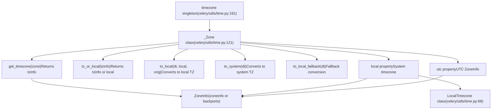
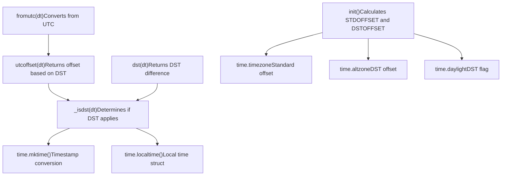
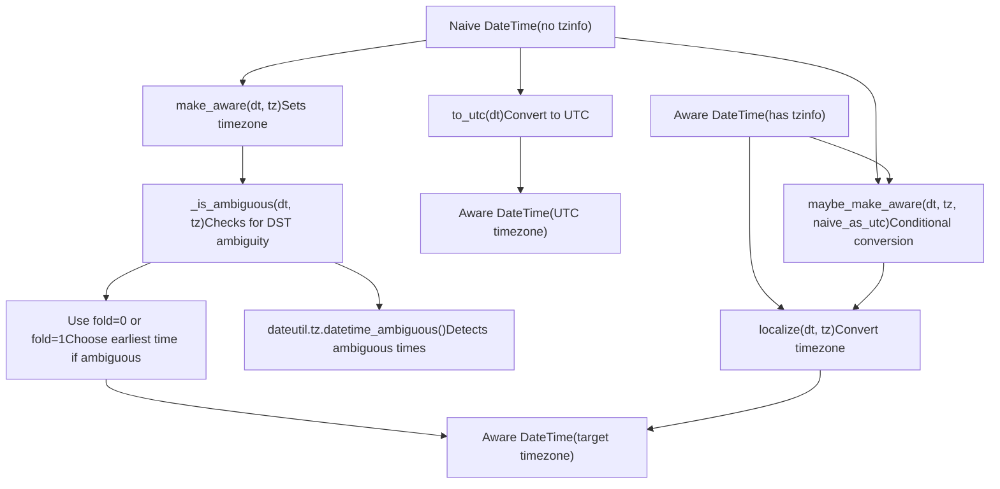
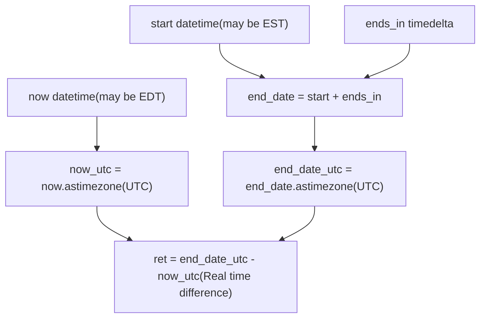
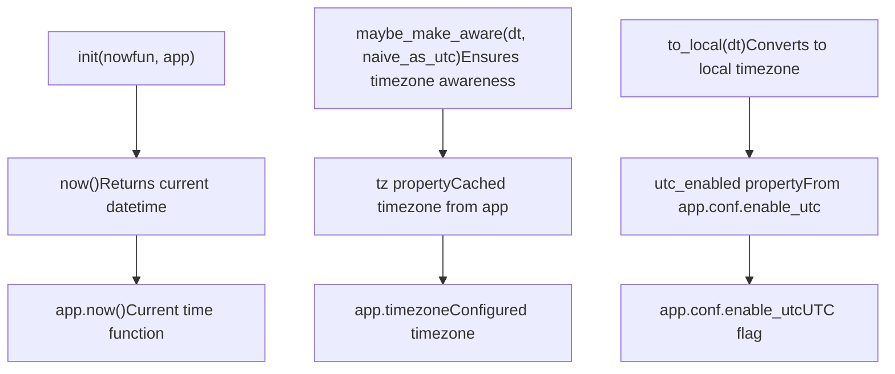

# Time and Timezone Handling

Relevant source files

-   [CONTRIBUTORS.txt](https://github.com/celery/celery/blob/4d068b56/CONTRIBUTORS.txt)
-   [celery/beat.py](https://github.com/celery/celery/blob/4d068b56/celery/beat.py)
-   [celery/schedules.py](https://github.com/celery/celery/blob/4d068b56/celery/schedules.py)
-   [celery/utils/iso8601.py](https://github.com/celery/celery/blob/4d068b56/celery/utils/iso8601.py)
-   [celery/utils/time.py](https://github.com/celery/celery/blob/4d068b56/celery/utils/time.py)
-   [docs/AUTHORS.txt](https://github.com/celery/celery/blob/4d068b56/docs/AUTHORS.txt)
-   [t/unit/app/test\_beat.py](https://github.com/celery/celery/blob/4d068b56/t/unit/app/test_beat.py)
-   [t/unit/app/test\_schedules.py](https://github.com/celery/celery/blob/4d068b56/t/unit/app/test_schedules.py)
-   [t/unit/backends/test\_cache.py](https://github.com/celery/celery/blob/4d068b56/t/unit/backends/test_cache.py)
-   [t/unit/utils/test\_serialization.py](https://github.com/celery/celery/blob/4d068b56/t/unit/utils/test_serialization.py)
-   [t/unit/utils/test\_time.py](https://github.com/celery/celery/blob/4d068b56/t/unit/utils/test_time.py)

**Purpose**: This document explains how Celery handles time and timezones across periodic task scheduling, task execution timing, and result expiration. It covers the core timezone infrastructure, datetime conversion operations, DST handling, and integration with Beat scheduler.

For information about scheduling periodic tasks using time-based schedules, see [Schedule Types](/celery/celery/7.2-schedule-types). For details on Beat scheduler architecture, see [Beat Scheduler Architecture](/celery/celery/7.1-beat-scheduler-architecture).

## Timezone Configuration

Celery provides two configuration settings that control timezone behavior throughout the system:

| Setting | Type | Default | Description |
| --- | --- | --- | --- |
| `timezone` | str or tzinfo | `'UTC'` | The timezone used by the application |
| `enable_utc` | bool | `True` | Whether to use UTC everywhere or local time |

When `enable_utc=True` (default), Celery stores all datetimes as UTC internally and converts to the configured timezone only when needed. When `enable_utc=False`, Celery uses the system's local timezone through `LocalTimezone`.

The `timezone` setting can be specified as:

-   A string like `'US/Eastern'` or `'Europe/London'` (uses ZoneInfo)
-   A `tzinfo` object directly
-   The special value `'UTC'`

**Sources**: [celery/utils/time.py121-181](https://github.com/celery/celery/blob/4d068b56/celery/utils/time.py#L121-L181) [celery/schedules.py84-103](https://github.com/celery/celery/blob/4d068b56/celery/schedules.py#L84-L103)

## Core Timezone Infrastructure

### The \_Zone Class and timezone Singleton

Celery's timezone handling is centralized in the `_Zone` class at [celery/utils/time.py121-179](https://github.com/celery/celery/blob/4d068b56/celery/utils/time.py#L121-L179) A singleton instance called `timezone` provides timezone utilities throughout the codebase:


**Sources**: [celery/utils/time.py121-181](https://github.com/celery/celery/blob/4d068b56/celery/utils/time.py#L121-L181)

### LocalTimezone Implementation

When `enable_utc=False`, Celery uses the `LocalTimezone` class to represent the system's local timezone. This implementation handles DST transitions using Python's `time` module:


The `LocalTimezone` class maintains an `_offset_cache` dictionary to avoid recreating timezone objects for the same UTC offsets. This optimization is particularly important for `fromutc()` conversions.

**Sources**: [celery/utils/time.py68-119](https://github.com/celery/celery/blob/4d068b56/celery/utils/time.py#L68-L119)

## Timezone-Aware DateTime Operations

### Making DateTimes Timezone-Aware

Celery provides three main functions for adding timezone information to datetime objects:


Key functions at [celery/utils/time.py327-387](https://github.com/celery/celery/blob/4d068b56/celery/utils/time.py#L327-L387):

-   **`is_naive(dt)`**: Returns `True` if datetime has no timezone info or `utcoffset` is `None`
-   **`make_aware(dt, tz)`**: Adds timezone info by calling `dt.replace(tzinfo=tz)` and handles ambiguous times
-   **`maybe_make_aware(dt, tz, naive_as_utc=True)`**: Only converts if datetime is naive
-   **`localize(dt, tz)`**: Converts an aware datetime to another timezone using `astimezone()`
-   **`to_utc(dt)`**: Specialized function to convert naive datetime to UTC

**Sources**: [celery/utils/time.py327-387](https://github.com/celery/celery/blob/4d068b56/celery/utils/time.py#L327-L387)

### Timezone Conversion Flow

The `_Zone` class provides high-level conversion methods that combine the low-level operations:

| Method | Purpose | Typical Use Case |
| --- | --- | --- |
| `to_local(dt, local, orig)` | Convert to local timezone | Display times to users |
| `to_system(dt)` | Convert to system timezone | Logging, file timestamps |
| `to_local_fallback(dt)` | Fallback local conversion | When `enable_utc=False` |
| `tz_or_local(tzinfo)` | Get timezone or default | Normalize timezone arguments |

**Sources**: [celery/utils/time.py129-156](https://github.com/celery/celery/blob/4d068b56/celery/utils/time.py#L129-L156)

## DST (Daylight Saving Time) Handling

Celery handles DST transitions carefully to ensure scheduled tasks run at the correct times. The implementation uses Python's `dateutil` module to detect ambiguous times.

### Ambiguous Time Detection

When converting a naive datetime to a timezone-aware one during a DST transition, there can be ambiguity. For example, when clocks "fall back" at 2:00 AM to 1:00 AM, the time 1:30 AM occurs twice. Celery resolves this by choosing the earlier occurrence:

```
def make_aware(dt: datetime, tz: tzinfo) -> datetime:
    dt = dt.replace(tzinfo=tz)
    if _is_ambiguous(dt, tz):
        dt = min(dt.replace(fold=0), dt.replace(fold=1))
    return dt
```
The `_is_ambiguous()` helper at [celery/utils/time.py338-348](https://github.com/celery/celery/blob/4d068b56/celery/utils/time.py#L338-L348) checks if a timezone can detect ambiguity using `dateutil.tz.datetime_ambiguous()`. This works with both `ZoneInfo` and legacy `pytz` timezones.

**Sources**: [celery/utils/time.py332-358](https://github.com/celery/celery/blob/4d068b56/celery/utils/time.py#L332-L358)

### DST in Schedule Calculations

The `remaining()` function at [celery/utils/time.py214-250](https://github.com/celery/celery/blob/4d068b56/celery/utils/time.py#L214-L250) calculates the real remaining time by converting all datetimes to UTC before comparison:


This approach avoids Python's default wall-time arithmetic between datetimes with equal non-UTC timezones, ensuring accurate scheduling across DST transitions.

**Sources**: [celery/utils/time.py214-250](https://github.com/celery/celery/blob/4d068b56/celery/utils/time.py#L214-L250) [t/unit/utils/test\_time.py125-214](https://github.com/celery/celery/blob/4d068b56/t/unit/utils/test_time.py#L125-L214)

## Schedule Integration

All schedule types (`schedule`, `crontab`, `solar`) inherit from `BaseSchedule` at [celery/schedules.py65-109](https://github.com/celery/celery/blob/4d068b56/celery/schedules.py#L65-L109) which provides timezone integration:

### BaseSchedule Timezone Properties


**Sources**: [celery/schedules.py65-109](https://github.com/celery/celery/blob/4d068b56/celery/schedules.py#L65-L109)

### Crontab Timezone Handling

The `crontab` schedule type performs complex timezone-aware calculations in `remaining_delta()` at [celery/schedules.py572-628](https://github.com/celery/celery/blob/4d068b56/celery/schedules.py#L572-L628):

1.  **Make all datetimes timezone-aware**: Calls `maybe_make_aware()` on `last_run_at` and `now()`
2.  **Calculate next occurrence**: Determines the next scheduled time based on minute, hour, day, month constraints
3.  **Apply timezone conversion**: Uses `to_local()` to convert results back to local timezone if needed

The method returns a tuple `(last_run_at_local, delta, now_local)` where all datetimes are in the appropriate timezone.

**Sources**: [celery/schedules.py572-628](https://github.com/celery/celery/blob/4d068b56/celery/schedules.py#L572-L628)

### Schedule Type Comparison

| Schedule Type | Timezone Handling | DST Behavior |
| --- | --- | --- |
| `schedule` | Uses `remaining()` with UTC conversion | Handles DST transitions correctly |
| `crontab` | Complex timezone-aware delta calculation | Adjusts for DST, may skip/duplicate times |
| `solar` | Uses ephem library with timezone-aware datetimes | Based on actual sun position |

**Sources**: [celery/schedules.py111-194](https://github.com/celery/celery/blob/4d068b56/celery/schedules.py#L111-L194) [celery/schedules.py323-700](https://github.com/celery/celery/blob/4d068b56/celery/schedules.py#L323-L700) [celery/schedules.py717-869](https://github.com/celery/celery/blob/4d068b56/celery/schedules.py#L717-L869)

## Persistent Scheduler Timezone Tracking

The `PersistentScheduler` at [celery/beat.py505-610](https://github.com/celery/celery/blob/4d068b56/celery/beat.py#L505-L610) tracks timezone configuration in its shelve database to detect changes that would invalidate stored schedule entries.

### Timezone Change Detection

During `setup_schedule()` at [celery/beat.py531-567](https://github.com/celery/celery/blob/4d068b56/celery/beat.py#L531-L567) the scheduler compares stored and current timezone settings:

> **[Mermaid sequence]**
> *(图表结构无法解析)*

This reset behavior ensures that all schedule entries are recalculated with the new timezone, preventing incorrect scheduling.

**Sources**: [celery/beat.py531-567](https://github.com/celery/celery/blob/4d068b56/celery/beat.py#L531-L567)

### Stored Timezone Fields

The persistent scheduler stores three timezone-related fields:

| Field | Type | Purpose |
| --- | --- | --- |
| `tz` | str | The timezone string (e.g., 'US/Eastern') |
| `utc_enabled` | bool | Whether UTC mode was enabled |
| `__version__` | str | Celery version for migration detection |

These fields are checked on every scheduler startup at [celery/beat.py545-564](https://github.com/celery/celery/blob/4d068b56/celery/beat.py#L545-L564):

```
tz = self.app.conf.timezone
stored_tz = self._store.get('tz')
if stored_tz is not None and stored_tz != tz:
    warning('Reset: Timezone changed from %r to %r', stored_tz, tz)
    self._store.clear()   # Timezone changed, reset db!

utc = self.app.conf.enable_utc
stored_utc = self._store.get('utc_enabled')
if stored_utc is not None and stored_utc != utc:
    choices = {True: 'enabled', False: 'disabled'}
    warning('Reset: UTC changed from %s to %s',
            choices[stored_utc], choices[utc])
    self._store.clear()   # UTC setting changed, reset db!
```
**Sources**: [celery/beat.py545-564](https://github.com/celery/celery/blob/4d068b56/celery/beat.py#L545-L564)

### Database Reset Scenarios

The scheduler resets its database in three scenarios:

1.  **Timezone change**: When `app.conf.timezone` differs from stored `'tz'`
2.  **UTC mode change**: When `app.conf.enable_utc` differs from stored `'utc_enabled'`
3.  **Version upgrade**: When `__version__` field is missing or changed

All three reset scenarios trigger a `self._store.clear()` to ensure schedule consistency.

**Sources**: [celery/beat.py569-590](https://github.com/celery/celery/blob/4d068b56/celery/beat.py#L569-L590)

## Time Calculation Utilities

Celery provides several utilities for time-related calculations at [celery/utils/time.py184-463](https://github.com/celery/celery/blob/4d068b56/celery/utils/time.py#L184-L463):

### Delta Resolution

The `delta_resolution()` function at [celery/utils/time.py191-211](https://github.com/celery/celery/blob/4d068b56/celery/utils/time.py#L191-L211) rounds a datetime to the resolution of a timedelta:

```
def delta_resolution(dt: datetime, delta: timedelta) -> datetime:
    """
    Round to nearest: days (≥86400s), hours (≥3600s), minutes (≥60s), or seconds
    """
    # Returns datetime rounded to timedelta's resolution
```
### Remaining Time Calculation

The `remaining()` function at [celery/utils/time.py214-250](https://github.com/celery/celery/blob/4d068b56/celery/utils/time.py#L214-L250) calculates real remaining time accounting for DST:

```
def remaining(start: datetime, ends_in: timedelta, now: datetime | None = None,
              relative: bool = False) -> timedelta:
    """
    Calculate remaining time by:
    1. Add ends_in to start
    2. Apply delta_resolution if relative=True
    3. Convert both to UTC
    4. Return real time difference
    """
```
### Forward Delta (ffwd)

The `ffwd` class at [celery/utils/time.py389-430](https://github.com/celery/celery/blob/4d068b56/celery/utils/time.py#L389-L430) provides a version of `dateutil.relativedelta` that only supports addition:

```
ffwd(year=2024, month=3, day=10, hour=14, minute=30)
# Can be added to datetime to get specific date/time
```
This is used by crontab schedules to calculate the next occurrence.

**Sources**: [celery/utils/time.py184-463](https://github.com/celery/celery/blob/4d068b56/celery/utils/time.py#L184-L463)

## Best Practices

### 1\. Always Use Timezone-Aware DateTimes

When working with Celery tasks and schedules, always ensure datetimes are timezone-aware:

```
from celery.utils.time import timezone, make_aware
from datetime import datetime

# Good: timezone-aware
now = datetime.now(timezone.utc)
aware_dt = make_aware(datetime(2024, 1, 1), timezone.utc)

# Bad: naive datetime
naive_dt = datetime.now()  # No timezone info
```
### 2\. Configure Timezone Consistently

Set the timezone once in your Celery configuration:

```
app.conf.timezone = 'US/Eastern'
app.conf.enable_utc = True  # Recommended
```
Avoid changing timezone configuration after deployment, as this triggers schedule database resets.

### 3\. Use UTC for Storage

When storing datetimes in databases or passing them between systems, convert to UTC:

```
from celery.utils.time import to_utc

utc_time = to_utc(local_time)
```
### 4\. Handle DST Transitions

Be aware that crontab schedules may skip or duplicate execution during DST transitions. Use the `beat_cron_starting_deadline` setting to control how late tasks can run:

```
app.conf.beat_cron_starting_deadline = 3600  # 1 hour in seconds
```
### 5\. Test with Multiple Timezones

When testing scheduled tasks, verify behavior across different timezones and DST transitions:

```
from zoneinfo import ZoneInfo

eastern = ZoneInfo('US/Eastern')
tokyo = ZoneInfo('Asia/Tokyo')

# Test schedule behavior in both timezones
```
**Sources**: [celery/schedules.py641-688](https://github.com/celery/celery/blob/4d068b56/celery/schedules.py#L641-L688) [celery/utils/time.py214-250](https://github.com/celery/celery/blob/4d068b56/celery/utils/time.py#L214-L250)
