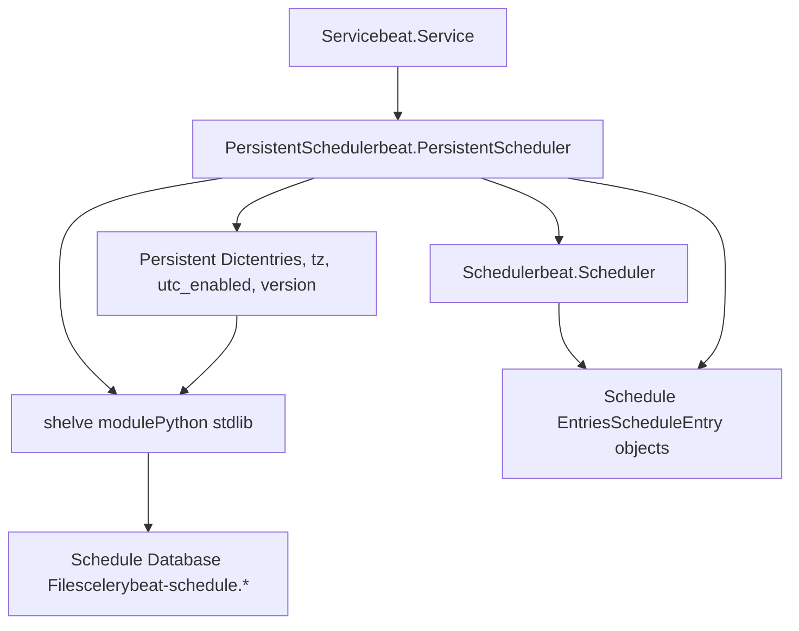
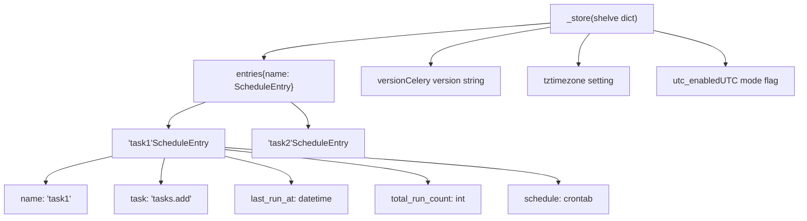
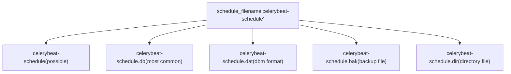
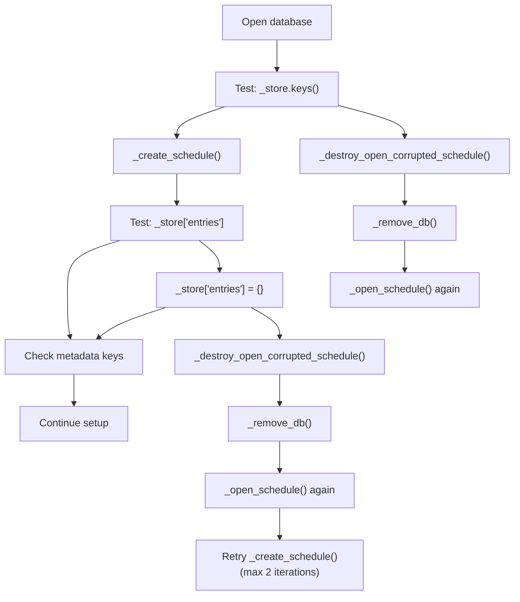
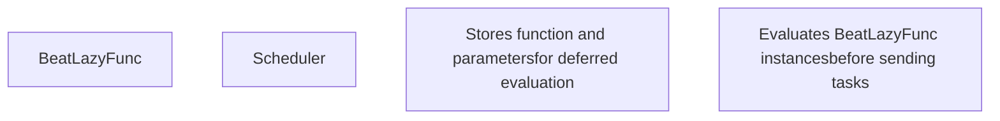

# Persistent Storage

Relevant source files

-   [CONTRIBUTORS.txt](https://github.com/celery/celery/blob/4d068b56/CONTRIBUTORS.txt)
-   [celery/beat.py](https://github.com/celery/celery/blob/4d068b56/celery/beat.py)
-   [celery/schedules.py](https://github.com/celery/celery/blob/4d068b56/celery/schedules.py)
-   [celery/utils/iso8601.py](https://github.com/celery/celery/blob/4d068b56/celery/utils/iso8601.py)
-   [celery/utils/time.py](https://github.com/celery/celery/blob/4d068b56/celery/utils/time.py)
-   [docs/AUTHORS.txt](https://github.com/celery/celery/blob/4d068b56/docs/AUTHORS.txt)
-   [t/unit/app/test\_beat.py](https://github.com/celery/celery/blob/4d068b56/t/unit/app/test_beat.py)
-   [t/unit/app/test\_schedules.py](https://github.com/celery/celery/blob/4d068b56/t/unit/app/test_schedules.py)
-   [t/unit/backends/test\_cache.py](https://github.com/celery/celery/blob/4d068b56/t/unit/backends/test_cache.py)
-   [t/unit/utils/test\_serialization.py](https://github.com/celery/celery/blob/4d068b56/t/unit/utils/test_serialization.py)
-   [t/unit/utils/test\_time.py](https://github.com/celery/celery/blob/4d068b56/t/unit/utils/test_time.py)

This document covers the persistent storage system used by Celery Beat's scheduler to maintain schedule state across restarts. Topics include the shelve-based storage mechanism, version management, timezone migration, corruption recovery, and the `BeatLazyFunc` utility for dynamic task arguments.

For information about the Beat scheduler architecture and tick loop, see [Beat Scheduler Architecture](/celery/celery/7.1-beat-scheduler-architecture). For schedule type definitions, see [Schedule Types](/celery/celery/7.2-schedule-types).

## Purpose and Scope

The persistent storage system in Celery Beat solves a critical problem: maintaining schedule state across process restarts. Without persistence, every time Beat restarts, all schedule entries would reset to their initial state, causing tasks to run at incorrect times or skip scheduled executions entirely.

The `PersistentScheduler` extends the base `Scheduler` class by adding a persistent storage layer using Python's `shelve` module. This allows Beat to:

-   Remember the last run time (`last_run_at`) of each scheduled task
-   Track the total run count (`total_run_count`) for each entry
-   Detect timezone and configuration changes that require schedule resets
-   Recover from database corruption gracefully
-   Support dynamic task arguments through `BeatLazyFunc`

Sources: [celery/beat.py505-610](https://github.com/celery/celery/blob/4d068b56/celery/beat.py#L505-L610) [celery/beat.py50-78](https://github.com/celery/celery/blob/4d068b56/celery/beat.py#L50-L78)

## Architecture Overview

The persistent storage system is implemented through the `PersistentScheduler` class, which wraps the base `Scheduler` functionality with a shelve-backed persistent dictionary.


**Diagram: PersistentScheduler Class Hierarchy and Storage Layer**

The key components are:

-   **`PersistentScheduler`**: Main class implementing persistence ([celery/beat.py505](https://github.com/celery/celery/blob/4d068b56/celery/beat.py#L505-L505))
-   **`persistence` attribute**: Module providing shelve interface (default: `shelve`) ([celery/beat.py508](https://github.com/celery/celery/blob/4d068b56/celery/beat.py#L508-L508))
-   **`_store` attribute**: The opened shelve database ([celery/beat.py511](https://github.com/celery/celery/blob/4d068b56/celery/beat.py#L511-L511))
-   **`schedule_filename` attribute**: Path to the database file ([celery/beat.py514](https://github.com/celery/celery/blob/4d068b56/celery/beat.py#L514-L514))

Sources: [celery/beat.py505-516](https://github.com/celery/celery/blob/4d068b56/celery/beat.py#L505-L516)

## Storage Structure

The shelve database stores a dictionary with specific keys that maintain both schedule data and metadata for change detection.


**Diagram: Persistent Storage Data Structure**

The stored data includes:

| Key | Type | Purpose |
| --- | --- | --- |
| `entries` | `dict[str, ScheduleEntry]` | Map of schedule entry names to entry objects |
| `__version__` | `str` | Celery version (e.g., "5.3.0") for migration detection |
| `tz` | `str` or `tzinfo` | Configured timezone for change detection |
| `utc_enabled` | `bool` | UTC mode setting for change detection |

Each `ScheduleEntry` in the `entries` dictionary contains:

-   `name`: Entry name/identifier
-   `task`: Task name to execute
-   `schedule`: Schedule object (e.g., `crontab`, `schedule`)
-   `args`: Positional arguments for the task
-   `kwargs`: Keyword arguments for the task
-   `options`: Task execution options
-   `last_run_at`: Last execution timestamp
-   `total_run_count`: Number of times executed

Sources: [celery/beat.py557-568](https://github.com/celery/celery/blob/4d068b56/celery/beat.py#L557-L568) [celery/beat.py592-596](https://github.com/celery/celery/blob/4d068b56/celery/beat.py#L592-L596)

## Database File Format

The shelve module uses the `dbm` library, which creates multiple files with different suffixes depending on the underlying DBM implementation.


**Diagram: Known Database File Suffixes**

The `known_suffixes` list defines all possible file extensions ([celery/beat.py509](https://github.com/celery/celery/blob/4d068b56/celery/beat.py#L509-L509)):

-   `''`: No suffix (some DBM implementations)
-   `.db`: Most common, used by dbm.gnu and others
-   `.dat`: Data file for some DBM formats
-   `.bak`: Backup file for hash-based formats
-   `.dir`: Directory file for hash-based formats

When removing the database, all variants must be deleted to ensure clean removal ([celery/beat.py517-520](https://github.com/celery/celery/blob/4d068b56/celery/beat.py#L517-L520)).

Sources: [celery/beat.py509](https://github.com/celery/celery/blob/4d068b56/celery/beat.py#L509-L509) [celery/beat.py517-520](https://github.com/celery/celery/blob/4d068b56/celery/beat.py#L517-L520)

## Database Lifecycle

The persistent scheduler manages the database through distinct lifecycle phases: setup, synchronization, and closure.

### Setup Phase

> **[Mermaid sequence]**
> *(图表结构无法解析)*

**Diagram: Database Setup Sequence**

The setup phase ([celery/beat.py531-568](https://github.com/celery/celery/blob/4d068b56/celery/beat.py#L531-L568)):

1.  **Open database**: Call `_open_schedule()` to get a shelve dict with `writeback=True`
2.  **Validate structure**: Attempt to read `_store.keys()` to detect corruption early
3.  **Handle corruption**: If errors occur, call `_destroy_open_corrupted_schedule()` to remove and recreate
4.  **Create schedule**: Call `_create_schedule()` to ensure `entries` key exists
5.  **Detect changes**: Check if `tz` or `utc_enabled` differ from stored values
6.  **Reset on change**: Clear entire store if timezone or UTC setting changed
7.  **Merge configuration**: Apply configuration from `app.conf.beat_schedule`
8.  **Update metadata**: Store current `__version__`, `tz`, and `utc_enabled`
9.  **Sync**: Write changes to disk

Sources: [celery/beat.py531-568](https://github.com/celery/celery/blob/4d068b56/celery/beat.py#L531-L568)

### Synchronization Phase

The scheduler periodically synchronizes in-memory state to disk through the `sync()` method:

```
def sync(self):
    if self._store is not None:
        self._store.sync()
```
Synchronization occurs:

-   After each task execution if `should_sync()` returns `True` ([celery/beat.py417-418](https://github.com/celery/celery/blob/4d068b56/celery/beat.py#L417-L418))
-   When `sync_every` seconds have elapsed ([celery/beat.py381-387](https://github.com/celery/celery/blob/4d068b56/celery/beat.py#L381-L387))
-   When `sync_every_tasks` tasks have been executed ([celery/beat.py385-386](https://github.com/celery/celery/blob/4d068b56/celery/beat.py#L385-L386))
-   On explicit `close()` call ([celery/beat.py603-605](https://github.com/celery/celery/blob/4d068b56/celery/beat.py#L603-L605))

The `sync()` method delegates to `shelve.sync()`, which writes the in-memory state to disk using the underlying DBM's sync mechanism.

Sources: [celery/beat.py599-601](https://github.com/celery/celery/blob/4d068b56/celery/beat.py#L599-L601) [celery/beat.py381-387](https://github.com/celery/celery/blob/4d068b56/celery/beat.py#L381-L387) [celery/beat.py417-418](https://github.com/celery/celery/blob/4d068b56/celery/beat.py#L417-L418)

### Closure Phase

```
def close(self):
    self.sync()
    self._store.close()
```
On shutdown, the scheduler:

1.  Calls `sync()` to flush pending changes
2.  Calls `_store.close()` to properly close the shelve database

This ensures all schedule state is persisted before the process exits.

Sources: [celery/beat.py603-605](https://github.com/celery/celery/blob/4d068b56/celery/beat.py#L603-L605)

## Corruption Detection and Recovery

The persistent scheduler implements robust corruption detection and recovery mechanisms to handle damaged or incompatible database files.


**Diagram: Corruption Detection and Recovery Flow**

### Detection Points

The scheduler detects corruption at multiple points:

1.  **Initial open**: Testing `_store.keys()` immediately after opening ([celery/beat.py539](https://github.com/celery/celery/blob/4d068b56/celery/beat.py#L539-L539))
2.  **Entry access**: Accessing `_store['entries']` during creation ([celery/beat.py572](https://github.com/celery/celery/blob/4d068b56/celery/beat.py#L572-L572))
3.  **Entry creation**: Writing new entries dict ([celery/beat.py576](https://github.com/celery/celery/blob/4d068b56/celery/beat.py#L576-L576))

Detected exceptions ([celery/beat.py540](https://github.com/celery/celery/blob/4d068b56/celery/beat.py#L540-L540) [celery/beat.py573](https://github.com/celery/celery/blob/4d068b56/celery/beat.py#L573-L573) [celery/beat.py577](https://github.com/celery/celery/blob/4d068b56/celery/beat.py#L577-L577)):

-   `KeyError`: Missing required keys
-   `UnicodeDecodeError`: Encoding issues in stored data
-   `TypeError`: Type mismatches from version incompatibilities
-   `UnpicklingError`: Pickle deserialization failures
-   `dbm.error`: DBM-level corruption

### Recovery Process

The `_destroy_open_corrupted_schedule()` method handles recovery ([celery/beat.py525-529](https://github.com/celery/celery/blob/4d068b56/celery/beat.py#L525-L529)):

```
def _destroy_open_corrupted_schedule(self, exc):
    error('Removing corrupted schedule file %r: %r',
          self.schedule_filename, exc, exc_info=True)
    self._remove_db()
    return self._open_schedule()
```
Steps:

1.  Log error with full exception details
2.  Call `_remove_db()` to delete all database file variants
3.  Re-open with `_open_schedule()`, creating fresh database

The `_remove_db()` method removes all possible file suffixes ([celery/beat.py517-520](https://github.com/celery/celery/blob/4d068b56/celery/beat.py#L517-L520)):

```
def _remove_db(self):
    for suffix in self.known_suffixes:
        with platforms.ignore_errno(errno.ENOENT):
            os.remove(self.schedule_filename + suffix)
```
This ensures complete cleanup even when the DBM implementation uses multiple files.

### Retry Logic

The `_create_schedule()` method uses a loop to retry after recovery ([celery/beat.py569-590](https://github.com/celery/celery/blob/4d068b56/celery/beat.py#L569-L590)):

```
def _create_schedule(self):
    for _ in (1, 2):  # Try twice
        try:
            self._store['entries']
        except (KeyError, UnicodeDecodeError, TypeError, UnpicklingError):
            try:
                self._store['entries'] = {}
            except (...) as exc:
                self._store = self._destroy_open_corrupted_schedule(exc)
                continue  # Retry
        else:
            # Success, check for version fields
            if '__version__' not in self._store:
                warning('DB Reset: Account for new __version__ field')
                self._store.clear()
            # ... similar checks for 'tz' and 'utc_enabled'
        break
```
The loop allows one retry after corruption recovery, providing resilience against transient issues.

Sources: [celery/beat.py525-590](https://github.com/celery/celery/blob/4d068b56/celery/beat.py#L525-L590) [celery/beat.py517-520](https://github.com/celery/celery/blob/4d068b56/celery/beat.py#L517-L520)

## Metadata Management

The persistent scheduler tracks metadata to detect configuration changes that require schedule resets.

### Version Tracking

The `__version__` field stores the Celery version string ([celery/beat.py561](https://github.com/celery/celery/blob/4d068b56/celery/beat.py#L561-L561)):

```
self._store.update({
    '__version__': __version__,
    'tz': tz,
    'utc_enabled': utc,
})
```
When an old database lacks this field, the schedule is cleared ([celery/beat.py581-583](https://github.com/celery/celery/blob/4d068b56/celery/beat.py#L581-L583)):

```
if '__version__' not in self._store:
    warning('DB Reset: Account for new __version__ field')
    self._store.clear()
```
This enables future migrations when schedule format changes between versions.

### Timezone Change Detection

The scheduler compares stored timezone against current configuration ([celery/beat.py545-549](https://github.com/celery/celery/blob/4d068b56/celery/beat.py#L545-L549)):

```
tz = self.app.conf.timezone
stored_tz = self._store.get('tz')
if stored_tz is not None and stored_tz != tz:
    warning('Reset: Timezone changed from %r to %r', stored_tz, tz)
    self._store.clear()
```
Timezone changes affect schedule calculations, so a full reset prevents incorrect execution times.

### UTC Mode Detection

Similarly, UTC mode changes trigger resets ([celery/beat.py550-556](https://github.com/celery/celery/blob/4d068b56/celery/beat.py#L550-L556)):

```
utc = self.app.conf.enable_utc
stored_utc = self._store.get('utc_enabled')
if stored_utc is not None and stored_utc != utc:
    choices = {True: 'enabled', False: 'disabled'}
    warning('Reset: UTC changed from %s to %s',
            choices[stored_utc], choices[utc])
    self._store.clear()
```
Changing between UTC and local time fundamentally alters time calculations, requiring schedule reset.

Sources: [celery/beat.py545-564](https://github.com/celery/celery/blob/4d068b56/celery/beat.py#L545-L564) [celery/beat.py581-589](https://github.com/celery/celery/blob/4d068b56/celery/beat.py#L581-L589)

## Dynamic Arguments with BeatLazyFunc

The `BeatLazyFunc` class enables deferred evaluation of task arguments, allowing schedule entries to use dynamically computed values at execution time rather than schedule definition time.

### Purpose and Use Case

Consider a scenario where you want to send the current timestamp to a task every time it runs. Without `BeatLazyFunc`, the timestamp would be fixed when the schedule is defined:

```
# Static approach - timestamp fixed at definition time
beat_schedule = {
    'task-with-timestamp': {
        'task': 'tasks.process',
        'schedule': 300,
        'kwargs': {
            'timestamp': datetime.datetime.now()  # Fixed value!
        }
    }
}
```
With `BeatLazyFunc`, the function is called each time the task is sent:

```
# Dynamic approach - timestamp evaluated at execution time
beat_schedule = {
    'task-with-timestamp': {
        'task': 'tasks.process',
        'schedule': 300,
        'kwargs': {
            'timestamp': BeatLazyFunc(datetime.datetime.now)  # Called each time!
        }
    }
}
```
Sources: [celery/beat.py50-78](https://github.com/celery/celery/blob/4d068b56/celery/beat.py#L50-L78)

### Implementation

The `BeatLazyFunc` class is a simple callable wrapper:


**Diagram: BeatLazyFunc Evaluation Flow**

The class stores a callable and its parameters ([celery/beat.py50-78](https://github.com/celery/celery/blob/4d068b56/celery/beat.py#L50-L78)):

-   `_func`: The function to call
-   `_func_params`: Dict containing 'args' and 'kwargs' for the function
-   `__call__()` and `delay()`: Both invoke the stored function with stored parameters

Sources: [celery/beat.py50-78](https://github.com/celery/celery/blob/4d068b56/celery/beat.py#L50-L78)

### Evaluation at Execution Time

When the scheduler prepares to send a task, it evaluates any `BeatLazyFunc` instances in the entry's arguments:

> **[Mermaid sequence]**
> *(图表结构无法解析)*

**Diagram: BeatLazyFunc Evaluation Sequence**

The evaluation functions ([celery/beat.py201-216](https://github.com/celery/celery/blob/4d068b56/celery/beat.py#L201-L216)):

**`_evaluate_entry_args(entry_args)`**:

```
def _evaluate_entry_args(entry_args):
    if not entry_args:
        return []
    return [
        v() if isinstance(v, BeatLazyFunc) else v
        for v in entry_args
    ]
```
**`_evaluate_entry_kwargs(entry_kwargs)`**:

```
def _evaluate_entry_kwargs(entry_kwargs):
    if not entry_kwargs:
        return {}
    return {
        k: v() if isinstance(v, BeatLazyFunc) else v
        for k, v in entry_kwargs.items()
    }
```
These functions are called in `Scheduler.apply_async()` before task submission ([celery/beat.py393-410](https://github.com/celery/celery/blob/4d068b56/celery/beat.py#L393-L410)):

```
def apply_async(self, entry, producer=None, advance=True, **kwargs):
    entry = self.reserve(entry) if advance else entry
    task = self.app.tasks.get(entry.task)

    try:
        entry_args = _evaluate_entry_args(entry.args)
        entry_kwargs = _evaluate_entry_kwargs(entry.kwargs)
        if task:
            return task.apply_async(entry_args, entry_kwargs,
                                    producer=producer,
                                    **entry.options)
        # ...
```
Sources: [celery/beat.py201-216](https://github.com/celery/celery/blob/4d068b56/celery/beat.py#L201-L216) [celery/beat.py393-410](https://github.com/celery/celery/blob/4d068b56/celery/beat.py#L393-L410)

### Persistence Behavior

`BeatLazyFunc` instances are stored in the shelve database along with the rest of the schedule entry. Because they use pickle serialization:

-   The wrapped function must be pickleable (importable at module level)
-   Lambda functions cannot be used (they don't pickle)
-   Instance methods work if the instance is also pickleable

Example of valid and invalid usage:

```
# Valid: Module-level function
def get_current_time():
    return datetime.datetime.now()

beat_schedule = {
    'task1': {
        'task': 'tasks.process',
        'schedule': 300,
        'kwargs': {
            'time': BeatLazyFunc(get_current_time)  # ✓ Works
        }
    }
}

# Invalid: Lambda function
beat_schedule = {
    'task2': {
        'task': 'tasks.process',
        'schedule': 300,
        'kwargs': {
            'time': BeatLazyFunc(lambda: datetime.datetime.now())  # ✗ Won't pickle
        }
    }
}
```
When the scheduler loads the database, it unpickles the `BeatLazyFunc` instances, which then function normally during evaluation.

Sources: [celery/beat.py50-78](https://github.com/celery/celery/blob/4d068b56/celery/beat.py#L50-L78) [celery/beat.py201-216](https://github.com/celery/celery/blob/4d068b56/celery/beat.py#L201-L216)

## Configuration

The persistent scheduler accepts configuration through both initialization arguments and application configuration.

### Schedule Filename

The database file path is determined by ([celery/beat.py623-624](https://github.com/celery/celery/blob/4d068b56/celery/beat.py#L623-L624)):

```
self.schedule_filename = (
    schedule_filename or app.conf.beat_schedule_filename)
```
Default configuration ([celery/app/defaults.py](https://github.com/celery/celery/blob/4d068b56/celery/app/defaults.py)):

-   Setting: `beat_schedule_filename`
-   Default value: `'celerybeat-schedule'`
-   Type: `str`

The filename can be:

-   Relative path: Creates database in current working directory
-   Absolute path: Creates database at specified location

### Scheduler Class Selection

The `Service` class loads the scheduler using an alias system ([celery/beat.py666-675](https://github.com/celery/celery/blob/4d068b56/celery/beat.py#L666-L675)):

```
def get_scheduler(self, lazy=False,
                  extension_namespace='celery.beat_schedulers'):
    filename = self.schedule_filename
    aliases = dict(load_extension_class_names(extension_namespace))
    return symbol_by_name(self.scheduler_cls, aliases=aliases)(
        app=self.app,
        schedule_filename=filename,
        max_interval=self.max_interval,
        lazy=lazy,
    )
```
The default scheduler class is `PersistentScheduler` ([celery/beat.py615](https://github.com/celery/celery/blob/4d068b56/celery/beat.py#L615-L615)):

```
class Service:
    scheduler_cls = PersistentScheduler
```
Custom schedulers can be specified via:

-   `scheduler_cls` argument to `Service`
-   Application configuration with scheduler alias

Sources: [celery/beat.py514](https://github.com/celery/celery/blob/4d068b56/celery/beat.py#L514-L514) [celery/beat.py623-624](https://github.com/celery/celery/blob/4d068b56/celery/beat.py#L623-L624) [celery/beat.py615](https://github.com/celery/celery/blob/4d068b56/celery/beat.py#L615-L615) [celery/beat.py666-675](https://github.com/celery/celery/blob/4d068b56/celery/beat.py#L666-L675)

## Schedule Property Access

The `PersistentScheduler` overrides the `schedule` property to provide access to the persistent entries:

```
def get_schedule(self):
    return self._store['entries']

def set_schedule(self, schedule):
    self._store['entries'] = schedule

schedule = property(get_schedule, set_schedule)
```
This property:

-   Returns the `entries` dict from the shelve database
-   Allows updating the entire schedule dict
-   Triggers shelve's writeback mechanism on modification (when `writeback=True`)

The base `Scheduler` class uses `self.data` for schedule storage, while `PersistentScheduler` redirects to `self._store['entries']`, creating a transparent persistence layer.

Sources: [celery/beat.py592-597](https://github.com/celery/celery/blob/4d068b56/celery/beat.py#L592-L597)

## Info Property

The `info` property provides diagnostic information about the persistent store ([celery/beat.py607-609](https://github.com/celery/celery/blob/4d068b56/celery/beat.py#L607-L609)):

```
@property
def info(self):
    return f'    . db -> {self.schedule_filename}'
```
This appears in Beat's startup output, showing operators which database file is being used. It's particularly useful when debugging configuration issues or verifying the correct database is loaded.

Sources: [celery/beat.py607-609](https://github.com/celery/celery/blob/4d068b56/celery/beat.py#L607-L609)

## Integration with Base Scheduler

The persistent scheduler maintains compatibility with the base `Scheduler` interface while adding persistence:

| Method | Base Scheduler | PersistentScheduler |
| --- | --- | --- |
| `__init__` | Initialize in-memory schedule | Also open shelve database |
| `setup_schedule()` | Load from `app.conf.beat_schedule` | Load from database, merge config, handle metadata |
| `sync()` | No-op (empty implementation) | Call `_store.sync()` to flush to disk |
| `close()` | Call `sync()` | Call `sync()` then `_store.close()` |
| `schedule` property | Return `self.data` | Return `self._store['entries']` |

The inheritance structure allows swapping schedulers without changing the `Service` or tick loop logic.

Sources: [celery/beat.py219-503](https://github.com/celery/celery/blob/4d068b56/celery/beat.py#L219-L503) [celery/beat.py505-610](https://github.com/celery/celery/blob/4d068b56/celery/beat.py#L505-L610)
