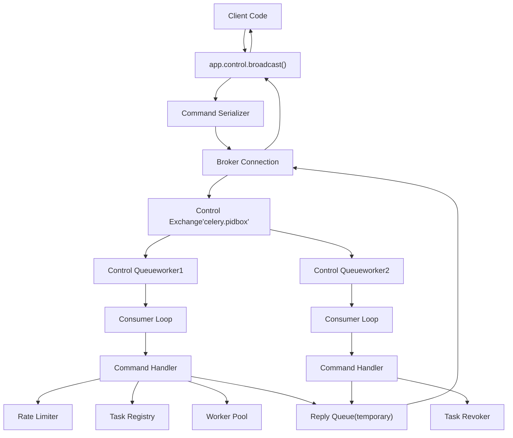

# Remote Control Commands

Relevant source files

-   [celery/app/defaults.py](https://github.com/celery/celery/blob/4d068b56/celery/app/defaults.py)
-   [docs/faq.rst](https://github.com/celery/celery/blob/4d068b56/docs/faq.rst)
-   [docs/getting-started/first-steps-with-celery.rst](https://github.com/celery/celery/blob/4d068b56/docs/getting-started/first-steps-with-celery.rst)
-   [docs/getting-started/next-steps.rst](https://github.com/celery/celery/blob/4d068b56/docs/getting-started/next-steps.rst)
-   [docs/userguide/calling.rst](https://github.com/celery/celery/blob/4d068b56/docs/userguide/calling.rst)
-   [docs/userguide/monitoring.rst](https://github.com/celery/celery/blob/4d068b56/docs/userguide/monitoring.rst)
-   [docs/userguide/periodic-tasks.rst](https://github.com/celery/celery/blob/4d068b56/docs/userguide/periodic-tasks.rst)
-   [docs/userguide/routing.rst](https://github.com/celery/celery/blob/4d068b56/docs/userguide/routing.rst)
-   [docs/userguide/tasks.rst](https://github.com/celery/celery/blob/4d068b56/docs/userguide/tasks.rst)
-   [docs/userguide/workers.rst](https://github.com/celery/celery/blob/4d068b56/docs/userguide/workers.rst)

Remote control commands provide a mechanism to manage and control Celery workers at runtime without stopping or restarting them. These commands are sent as high-priority broadcast messages through the broker to one or more worker nodes, enabling operations like revoking tasks, adjusting rate limits, shutting down workers, and modifying pool concurrency.

For information about querying worker state (active tasks, registered tasks, statistics), see [Worker Inspection](/celery/celery/8.2-worker-inspection). For monitoring worker activity through events, see [Event Monitoring Tools](/celery/celery/8.3-event-system).

---

## System Architecture

The remote control system uses a dedicated high-priority message queue to deliver commands from client applications to worker nodes. Workers continuously listen on this queue and execute commands immediately upon receipt.

### Control Message Flow

> **[Mermaid sequence]**
> *(图表结构无法解析)*

**Sources:** [docs/userguide/workers.rst414-461](https://github.com/celery/celery/blob/4d068b56/docs/userguide/workers.rst#L414-L461) [docs/userguide/monitoring.rst25-205](https://github.com/celery/celery/blob/4d068b56/docs/userguide/monitoring.rst#L25-L205)

### Pool and Broker Support

The remote control system has different support levels depending on the worker pool type and message broker:

| Component | Support Level |
| --- | --- |
| **Pool Types** | prefork, eventlet, gevent, thread (full support)
solo (limited - blocking) |
| **Brokers** | RabbitMQ/AMQP (full support)
Redis (full support)
Other brokers (limited or none) |

**Note:** The solo pool supports remote control but any executing task will block control commands until completion. Increase the reply timeout when using solo pools with long-running tasks.

**Sources:** [docs/userguide/workers.rst425-451](https://github.com/celery/celery/blob/4d068b56/docs/userguide/workers.rst#L425-L451)

---

## Control Configuration

Control commands use a dedicated exchange and queue with specific configuration options:

```
# Configuration options for control system
control_queue_ttl = 300.0          # Message TTL (seconds)
control_queue_expires = 10.0       # Queue auto-delete timeout (seconds)
control_queue_exclusive = False    # Exclusive queue flag
control_queue_durable = False      # Queue durability
control_exchange = 'celery'        # Control exchange name
```
These settings control the behavior of the control message queue, including message expiration and queue lifecycle.

**Sources:** [celery/app/defaults.py150-156](https://github.com/celery/celery/blob/4d068b56/celery/app/defaults.py#L150-L156)

---

## The Broadcast Function

The `control.broadcast()` method is the foundation for all remote control commands. It sends a command to one or more workers and optionally collects replies.

### Method Signature

```
app.control.broadcast(
    command,              # Command name (string)
    arguments=None,       # Command arguments (dict)
    destination=None,     # Target workers (list) or None for all
    connection=None,      # Custom connection
    reply=False,          # Wait for replies
    timeout=1.0,          # Reply timeout (seconds)
    limit=None,           # Max number of replies
    callback=None,        # Reply callback function
    channel=None          # Custom channel
)
```
### Basic Usage

```
# Send command without waiting for reply (asynchronous)
app.control.broadcast('rate_limit',
                      arguments={'task_name': 'myapp.mytask',
                                'rate_limit': '200/m'})

# Send command and wait for replies
replies = app.control.broadcast('rate_limit',
                                arguments={'task_name': 'myapp.mytask',
                                          'rate_limit': '200/m'},
                                reply=True)
# Returns: [{'worker1.example.com': 'New rate limit set successfully'},
#           {'worker2.example.com': 'New rate limit set successfully'}]

# Send to specific workers
replies = app.control.broadcast('rate_limit',
                                arguments={'task_name': 'myapp.mytask',
                                          'rate_limit': '200/m'},
                                reply=True,
                                destination=['worker1@example.com'])
```
**Sources:** [docs/userguide/workers.rst453-496](https://github.com/celery/celery/blob/4d068b56/docs/userguide/workers.rst#L453-L496)

---

## Control Commands Reference

### Task Revocation Commands

#### revoke

Revoke one or more tasks by ID, preventing execution or terminating running tasks.

```
# Revoke a single task
app.control.revoke('d9078da5-9915-40a0-bfa1-392c7bde42ed')

# Revoke and terminate if already executing (prefork, eventlet, gevent only)
app.control.revoke('d9078da5-9915-40a0-bfa1-392c7bde42ed',
                   terminate=True)

# Revoke with custom signal
app.control.revoke('d9078da5-9915-40a0-bfa1-392c7bde42ed',
                   terminate=True,
                   signal='SIGKILL')

# Revoke multiple tasks
app.control.revoke([
    '7993b0aa-1f0b-4780-9af0-c47c0858b3f2',
    'f565793e-b041-4b2b-9ca4-dca22762a55d',
    'd9d35e03-2997-42d0-a13e-64a66b88a618'
])

# CLI usage
celery -A proj control revoke <task_id>
celery -A proj control revoke <task_id> --terminate --signal=SIGKILL
```
**Behavior:**

-   Revoked task IDs are stored in worker memory (up to `CELERY_WORKER_REVOKES_MAX`, default 50,000)
-   Tasks with ETA/countdown are revoked immediately in the result backend (since v5.6)
-   Persistent revokes can be enabled with `--statedb` option
-   Revoke list expires after 10,800 seconds (3 hours) when limit is exceeded

**Sources:** [docs/userguide/workers.rst501-628](https://github.com/celery/celery/blob/4d068b56/docs/userguide/workers.rst#L501-L628)

#### revoke\_by\_stamped\_headers

Revoke tasks matching stamped header key-value pairs.

```
# Revoke all tasks with specific header
app.control.revoke_by_stamped_headers({'header_key': 'header_value'})

# CLI usage
celery -A proj control revoke_by_stamped_headers header=value
```
**Warning:** Revoked header mappings are not persistent across worker restarts.

**Sources:** [docs/userguide/workers.rst630-700](https://github.com/celery/celery/blob/4d068b56/docs/userguide/workers.rst#L630-L700)

---

### Worker Lifecycle Commands

#### shutdown

Shutdown one or more workers gracefully or immediately.

```
# Shutdown all workers
app.control.shutdown()

# Shutdown specific worker
app.control.shutdown(destination=['worker1@example.com'])

# CLI usage
celery -A proj control shutdown
celery -A proj control shutdown -d worker1@example.com
```
**Sources:** [docs/userguide/workers.rst498-499](https://github.com/celery/celery/blob/4d068b56/docs/userguide/workers.rst#L498-L499)

#### pool\_restart

Restart the worker pool processes without shutting down the main worker process.

```
# Restart pool on all workers
app.control.pool_restart()

# Restart specific worker's pool
app.control.pool_restart(destination=['worker1@example.com'])

# CLI usage
celery -A proj control pool_restart
```
This is useful for recovering from memory leaks or other pool-related issues without full worker restart.

**Sources:** [docs/userguide/workers.rst498-499](https://github.com/celery/celery/blob/4d068b56/docs/userguide/workers.rst#L498-L499)

---

### Concurrency Management Commands

#### pool\_grow

Increase the number of pool processes.

```
# Add 3 processes to pool
app.control.pool_grow(n=3)

# CLI usage
celery -A proj control pool_grow 3
```
#### pool\_shrink

Decrease the number of pool processes.

```
# Remove 2 processes from pool
app.control.pool_shrink(n=2)

# CLI usage
celery -A proj control pool_shrink 2
```
#### autoscale

Dynamically adjust the min/max pool size for autoscaling.

```
# Set autoscale parameters: max=10, min=3
app.control.autoscale(max=10, min=3)

# CLI usage
celery -A proj control autoscale 10 3
```
**Sources:** [docs/userguide/workers.rst498-499](https://github.com/celery/celery/blob/4d068b56/docs/userguide/workers.rst#L498-L499)

---

### Rate Limiting Commands

#### rate\_limit

Set or modify the rate limit for a specific task type at runtime.

```
# Set rate limit to 200 tasks per minute
app.control.rate_limit('myapp.mytask', '200/m')

# Set rate limit to 10 tasks per second
app.control.rate_limit('myapp.mytask', '10/s')

# Set rate limit to 5 tasks per hour
app.control.rate_limit('myapp.mytask', '5/h')

# Disable rate limiting
app.control.rate_limit('myapp.mytask', None)

# CLI usage
celery -A proj control rate_limit myapp.mytask 200/m
```
**Rate Limit Format:**

-   `<number>/<unit>` where unit is `s` (seconds), `m` (minutes), or `h` (hours)
-   Rate limits are per-worker instance, not global
-   Tasks are distributed evenly over the time period

**Sources:** [docs/userguide/workers.rst460-461](https://github.com/celery/celery/blob/4d068b56/docs/userguide/workers.rst#L460-L461) [docs/getting-started/first-steps-with-celery.rst400-409](https://github.com/celery/celery/blob/4d068b56/docs/getting-started/first-steps-with-celery.rst#L400-L409)

#### time\_limit

Change soft and hard time limits for a task type at runtime.

```
# Set hard time limit to 60 seconds, soft to 50 seconds
app.control.time_limit('myapp.mytask', hard=60, soft=50)

# CLI usage
celery -A proj control time_limit myapp.mytask 60 50
```
**Sources:** [docs/userguide/workers.rst498-499](https://github.com/celery/celery/blob/4d068b56/docs/userguide/workers.rst#L498-L499)

---

### Queue Management Commands

#### add\_consumer

Start consuming from a new queue on running workers.

```
# Start consuming from 'new_queue'
app.control.add_consumer('new_queue')

# Start with specific routing key and exchange
app.control.add_consumer(
    queue='new_queue',
    exchange='custom_exchange',
    exchange_type='topic',
    routing_key='custom.routing.key'
)

# CLI usage
celery -A proj control add_consumer new_queue
```
#### cancel\_consumer

Stop consuming from a queue without removing it.

```
# Stop consuming from queue
app.control.cancel_consumer('old_queue')

# CLI usage
celery -A proj control cancel_consumer old_queue
```
#### active\_queues

List queues that workers are currently consuming from.

```
# Get active queues from all workers
queues = app.control.active_queues()

# CLI usage
celery -A proj control active_queues
```
**Sources:** [docs/userguide/workers.rst498-499](https://github.com/celery/celery/blob/4d068b56/docs/userguide/workers.rst#L498-L499)

---

### Event Management Commands

#### enable\_events

Enable task event broadcasting for monitoring.

```
# Enable events on all workers
app.control.enable_events()

# CLI usage
celery -A proj control enable_events
```
#### disable\_events

Disable task event broadcasting.

```
# Disable events on all workers
app.control.disable_events()

# CLI usage
celery -A proj control disable_events
```
Events are used by monitoring tools like Flower and `celery events`. Enabling them has a performance overhead as each task state change generates a message.

**Sources:** [docs/userguide/monitoring.rst161-171](https://github.com/celery/celery/blob/4d068b56/docs/userguide/monitoring.rst#L161-L171)

---

### Election Command

#### election

Trigger leader election in worker cluster (used internally by some features).

```
# Trigger election
app.control.election()
```
**Sources:** [docs/userguide/workers.rst498-499](https://github.com/celery/celery/blob/4d068b56/docs/userguide/workers.rst#L498-L499)

---

## Command Line Interface

The `celery control` command provides CLI access to remote control commands.

### Basic Syntax

```
celery -A <app> control <command> [options] [arguments]
```
### Common Options

| Option | Description |
| --- | --- |
| `-d`, `--destination` | Target specific workers (comma-separated) |
| `-t`, `--timeout` | Reply timeout in seconds (default: 1.0) |
| `-j`, `--json` | Output replies as JSON |

### Examples

```
# Revoke a task
celery -A proj control revoke d9078da5-9915-40a0-bfa1-392c7bde42ed

# Rate limit to specific workers
celery -A proj control rate_limit tasks.add 100/m -d worker1@host,worker2@host

# Shutdown specific worker
celery -A proj control shutdown -d worker1@example.com

# Increase timeout for slow responses
celery -A proj control pool_restart -t 5.0

# Get help for control commands
celery control --help
```
**Sources:** [celery/bin/celery.py1-228](https://github.com/celery/celery/blob/4d068b56/celery/bin/celery.py#L1-L228) [docs/userguide/monitoring.rst25-205](https://github.com/celery/celery/blob/4d068b56/docs/userguide/monitoring.rst#L25-L205)

---

## Targeting Workers

Commands can be directed to all workers or a specific subset using the `destination` parameter.

### Destination Formats

```
# All workers (default)
app.control.revoke(task_id)

# Single worker by hostname
app.control.revoke(task_id, destination=['worker1@example.com'])

# Multiple workers
app.control.revoke(task_id, destination=[
    'worker1@example.com',
    'worker2@example.com'
])

# CLI format
celery -A proj control shutdown -d worker1@host,worker2@host
```
### Hostname Patterns

Worker hostnames follow the pattern: `<nodename>@<hostname>`

-   `%h` - Full hostname with domain (e.g., `worker1@server.example.com`)
-   `%n` - Hostname only (e.g., `worker1@server`)
-   `%d` - Domain only (e.g., `worker1@example.com`)

**Sources:** [docs/userguide/monitoring.rst193-205](https://github.com/celery/celery/blob/4d068b56/docs/userguide/monitoring.rst#L193-L205) [docs/userguide/workers.rst37-61](https://github.com/celery/celery/blob/4d068b56/docs/userguide/workers.rst#L37-L61)

---

## Timeouts and Reply Handling

### Default Timeout Behavior

```
# Default 1 second timeout
replies = app.control.broadcast('rate_limit',
                                arguments={'task_name': 'tasks.add',
                                          'rate_limit': '200/m'},
                                reply=True)

# Custom timeout for slow networks or busy workers
replies = app.control.broadcast('rate_limit',
                                arguments={'task_name': 'tasks.add',
                                          'rate_limit': '200/m'},
                                reply=True,
                                timeout=5.0)
```
### Reply Limits

```
# Wait for replies from all workers
replies = app.control.broadcast('ping', reply=True, limit=None)

# Wait for first 3 replies only
replies = app.control.broadcast('ping', reply=True, limit=3)

# When destination specified, limit defaults to len(destination)
replies = app.control.broadcast('ping',
                                reply=True,
                                destination=['w1@host', 'w2@host'])
# Limit automatically set to 2
```
### Understanding Missing Replies

A worker not replying within the timeout doesn't necessarily mean:

-   The worker is dead
-   The worker didn't receive the command
-   The worker didn't execute the command

It may simply indicate:

-   Network latency
-   Worker is busy processing commands
-   The solo pool is blocked by a long-running task

**Recommendation:** Adjust timeout based on your network conditions and worker load.

**Sources:** [docs/userguide/workers.rst428-451](https://github.com/celery/celery/blob/4d068b56/docs/userguide/workers.rst#L428-L451)

---

## Control Command Execution Flow


**Sources:** [docs/userguide/workers.rst414-496](https://github.com/celery/celery/blob/4d068b56/docs/userguide/workers.rst#L414-L496)

---

## Practical Examples

### Coordinated Task Revocation

```
# Revoke all instances of a task across cluster
def revoke_task_everywhere(task_id):
    """Revoke task on all workers with confirmation."""
    replies = app.control.revoke(
        task_id,
        reply=True,
        timeout=3.0
    )

    successful = [r for r in replies if r.get('ok')]
    print(f"Revoked on {len(successful)} workers")
    return replies
```
### Dynamic Rate Limit Adjustment

```
# Adjust rate limits based on system load
def adjust_rate_limits(task_name, requests_per_minute):
    """Dynamically adjust rate limits for a task."""
    rate_limit = f"{requests_per_minute}/m"

    replies = app.control.rate_limit(
        task_name,
        rate_limit,
        reply=True,
        timeout=2.0
    )

    return all('ok' in r for r in replies)
```
### Graceful Worker Scaling

```
# Scale down workers safely
def scale_down_worker(worker_hostname):
    """Stop consuming and shutdown a worker."""
    # First stop consuming new tasks
    app.control.cancel_consumer(
        'celery',
        destination=[worker_hostname]
    )

    # Wait for existing tasks to complete (application logic)
    time.sleep(30)

    # Then shutdown
    app.control.shutdown(destination=[worker_hostname])
```
### Emergency Shutdown with Timeout Adjustment

```
# Shutdown with increased timeout for slow workers
def emergency_shutdown_all():
    """Shutdown all workers with extended timeout."""
    replies = app.control.shutdown(
        reply=True,
        timeout=10.0  # Give workers time to respond
    )

    worker_count = len(replies)
    print(f"Shutdown initiated on {worker_count} workers")
    return replies
```
**Sources:** [docs/userguide/workers.rst453-496](https://github.com/celery/celery/blob/4d068b56/docs/userguide/workers.rst#L453-L496) [docs/getting-started/first-steps-with-celery.rst400-414](https://github.com/celery/celery/blob/4d068b56/docs/getting-started/first-steps-with-celery.rst#L400-L414)

---

## Limitations and Considerations

### Solo Pool Limitations

When using the solo pool, control commands may be blocked by long-running tasks since the worker processes commands in the same thread as task execution. Solutions:

1.  Increase timeout: `timeout=30.0` or higher
2.  Use a different pool type for production (prefork, eventlet, gevent)
3.  Accept delayed command execution

**Sources:** [docs/userguide/workers.rst446-451](https://github.com/celery/celery/blob/4d068b56/docs/userguide/workers.rst#L446-L451)

### Broker Requirements

Not all brokers fully support control commands:

| Broker | Support Level |
| --- | --- |
| RabbitMQ/AMQP | Full - Recommended |
| Redis | Full |
| Amazon SQS | Limited - No broadcasts |
| Other brokers | Varies |

**Sources:** [docs/userguide/workers.rst426-427](https://github.com/celery/celery/blob/4d068b56/docs/userguide/workers.rst#L426-L427) [docs/userguide/workers.rst627-628](https://github.com/celery/celery/blob/4d068b56/docs/userguide/workers.rst#L627-L628)

### Memory Considerations

Revoked task IDs are stored in worker memory with these limits:

-   `CELERY_WORKER_REVOKES_MAX`: Maximum revoked IDs (default: 50,000)
-   `CELERY_WORKER_REVOKE_EXPIRES`: Expiration time when limit exceeded (default: 10,800 seconds)

For persistent revokes across restarts, use the `--statedb` option:

```
celery -A proj worker --statedb=/var/run/celery/worker.state
```
**Sources:** [docs/userguide/workers.rst515-520](https://github.com/celery/celery/blob/4d068b56/docs/userguide/workers.rst#L515-L520) [docs/userguide/workers.rst597-624](https://github.com/celery/celery/blob/4d068b56/docs/userguide/workers.rst#L597-L624)

### Network Latency

Command timeouts should be adjusted based on network conditions:

-   Local network: 1-2 seconds sufficient
-   Remote/slow network: 5-10 seconds recommended
-   Distributed environments: 10-30 seconds may be needed

Missing replies don't always indicate failures - they may simply indicate timeout.

**Sources:** [docs/userguide/workers.rst434-440](https://github.com/celery/celery/blob/4d068b56/docs/userguide/workers.rst#L434-L440)
