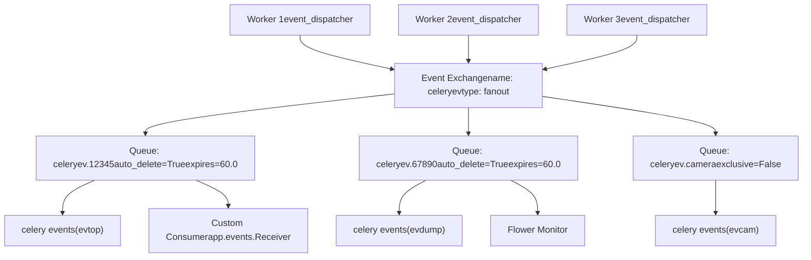
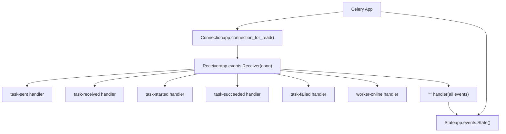
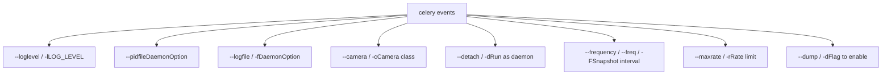
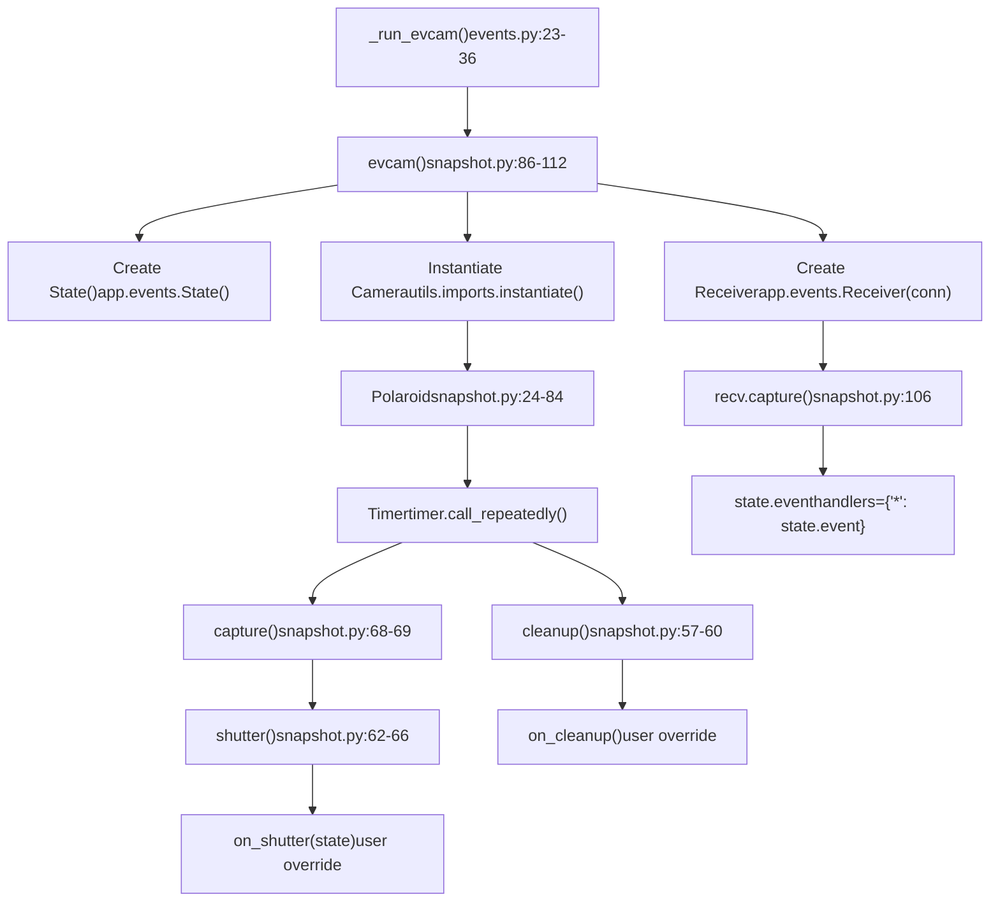

# Event System

Relevant source files

-   [celery/bin/base.py](https://github.com/celery/celery/blob/4d068b56/celery/bin/base.py)
-   [celery/bin/beat.py](https://github.com/celery/celery/blob/4d068b56/celery/bin/beat.py)
-   [celery/bin/celery.py](https://github.com/celery/celery/blob/4d068b56/celery/bin/celery.py)
-   [celery/bin/events.py](https://github.com/celery/celery/blob/4d068b56/celery/bin/events.py)
-   [celery/bin/worker.py](https://github.com/celery/celery/blob/4d068b56/celery/bin/worker.py)
-   [celery/events/snapshot.py](https://github.com/celery/celery/blob/4d068b56/celery/events/snapshot.py)

The event system in Celery provides real-time monitoring of cluster activity by allowing workers to emit events describing task and worker state changes. Events are published to a dedicated exchange and can be consumed by monitoring tools, custom applications, or the `celery events` command.

For information about remote control commands, see page 8.1. For worker inspection commands, see page 8.2.

## Overview

The event system consists of three main components:

1.  **Event Publishing**: Workers emit events to a dedicated event exchange when `worker_send_task_events` is enabled
2.  **Event Exchange**: A fanout exchange (`celeryev` by default) that distributes events to all bound queues
3.  **Event Consumers**: Tools and applications that consume and process events, including:
    -   `celery events` command (evtop, evdump, evcam modes)
    -   Third-party monitors like Flower
    -   Custom event consumers via `app.events.Receiver`

Sources: [celery/bin/events.py1-95](https://github.com/celery/celery/blob/4d068b56/celery/bin/events.py#L1-L95) [celery/events/snapshot.py1-112](https://github.com/celery/celery/blob/4d068b56/celery/events/snapshot.py#L1-L112)

## Event Exchange Architecture

Events are published through a dedicated AMQP exchange configured separately from task routing. The event exchange uses a fanout topology, meaning all bound queues receive all events.

### Event Exchange Configuration

Title: Event Exchange and Queue Configuration


**Event Exchange Settings:**

| Setting | Default | Purpose |
| --- | --- | --- |
| `event_exchange` | `'celeryev'` | Exchange name for events |
| `event_exchange_type` | `'topic'` | Exchange type (topic allows routing) |
| `event_queue_prefix` | `'celeryev'` | Prefix for event queue names |
| `event_queue_expires` | `60.0` | Queue TTL in seconds (auto-delete) |
| `event_queue_ttl` | `5.0` | Message TTL in seconds |
| `event_serializer` | `'json'` | Serialization format for events |

Event queues are typically auto-generated with random suffixes and automatically deleted when consumers disconnect.

Sources: [celery/bin/events.py1-95](https://github.com/celery/celery/blob/4d068b56/celery/bin/events.py#L1-L95) [celery/events/snapshot.py86-112](https://github.com/celery/celery/blob/4d068b56/celery/events/snapshot.py#L86-L112)

## Event Types

Workers emit various event types to describe task execution and worker state changes. Event consumers can filter and handle specific event types.

### Task Events

Task events track the lifecycle of individual task executions:

| Event Type | Timing | Description | Key Fields |
| --- | --- | --- | --- |
| `task-sent` | Client side | Task message sent to broker | `name`, `id`, `args`, `kwargs`, `routing_key`, `eta` |
| `task-received` | Worker side | Task received by worker | `name`, `id`, `args`, `kwargs`, `hostname` |
| `task-started` | Worker side | Task execution started | `name`, `id`, `hostname`, `pid` |
| `task-succeeded` | Worker side | Task completed successfully | `name`, `id`, `result`, `runtime` |
| `task-failed` | Worker side | Task raised exception | `name`, `id`, `exception`, `traceback` |
| `task-rejected` | Worker side | Task rejected by worker | `name`, `id`, `requeue` |
| `task-revoked` | Worker side | Task revoked before execution | `name`, `id`, `terminated`, `signum`, `expired` |
| `task-retried` | Worker side | Task will be retried | `name`, `id`, `exception`, `traceback` |

### Worker Events

Worker events describe worker state and lifecycle:

| Event Type | Timing | Description | Key Fields |
| --- | --- | --- | --- |
| `worker-online` | Startup | Worker started and connected | `hostname`, `timestamp`, `freq` |
| `worker-heartbeat` | Periodic | Worker still alive | `hostname`, `timestamp`, `active`, `processed` |
| `worker-offline` | Shutdown | Worker disconnected | `hostname`, `timestamp` |

### Event Message Structure

All events share a common structure with type-specific fields:

```
{
    "type": "task-started",           # Event type
    "uuid": "task-uuid-here",         # Task ID
    "hostname": "worker1@host",       # Worker hostname
    "timestamp": 1234567890.123,      # Unix timestamp
    "clock": 42,                      # Logical clock value
    "local_received": 1234567890.456, # Consumer receive time
    # Type-specific fields...
    "name": "myapp.tasks.add",
    "pid": 12345,
}
```
The `clock` field implements a Lamport logical clock for event ordering across distributed workers.

Sources: [celery/bin/events.py1-95](https://github.com/celery/celery/blob/4d068b56/celery/bin/events.py#L1-L95)

## Enabling Event Emission

Workers do not emit events by default. Event emission must be explicitly enabled through configuration or runtime control.

### Configuration-based Enabling

**Application Configuration:**

```
app.conf.worker_send_task_events = True
app.conf.task_send_sent_event = True  # Enable task-sent events
```
**Worker Command Line:**

```
celery -A proj worker --task-events
# or equivalently
celery -A proj worker -E
```
See [celery/bin/worker.py212-220](https://github.com/celery/celery/blob/4d068b56/celery/bin/worker.py#L212-L220) for the `--task-events` / `-E` option.

### Runtime Control

Enable or disable events on running workers:

```
# Enable events on all workers
celery -A proj control enable_events

# Disable events on all workers
celery -A proj control disable_events

# Target specific workers
celery -A proj control enable_events -d worker1@host
```
This is implemented through the remote control system (see page 8.1).

Sources: [celery/bin/worker.py212-220](https://github.com/celery/celery/blob/4d068b56/celery/bin/worker.py#L212-L220)

## Event Consumer Implementation

Applications can consume events programmatically using the `app.events.Receiver` class. This allows custom monitoring, logging, or processing of cluster events.

### Basic Event Consumer

Title: Event Consumer Implementation Pattern


**Basic Implementation:**

```
from celery import Celery

app = Celery('proj')

def on_task_succeeded(event):
    print(f"Task {event['uuid']} succeeded: {event['result']}")

def on_task_failed(event):
    print(f"Task {event['uuid']} failed: {event['exception']}")

def monitor_events():
    # Create connection and state
    connection = app.connection_for_read()
    state = app.events.State()

    # Create receiver with handlers
    with app.events.Receiver(connection, handlers={
        'task-succeeded': on_task_succeeded,
        'task-failed': on_task_failed,
        '*': state.event,  # Update state for all events
    }) as recv:
        recv.capture(limit=None, timeout=None, wakeup=True)

if __name__ == '__main__':
    monitor_events()
```
### State Tracking

The `app.events.State()` class maintains an in-memory representation of cluster state based on consumed events:

```
state = app.events.State()

# Register state.event as wildcard handler
recv = app.events.Receiver(conn, handlers={'*': state.event})
recv.capture(limit=None)

# Access accumulated state
print(f"Active workers: {len(state.workers)}")
print(f"Active tasks: {len(state.tasks)}")

# Iterate over workers
for hostname, worker_info in state.workers.items():
    print(f"Worker {hostname}: {worker_info}")

# Iterate over tasks
for uuid, task_info in state.tasks.items():
    print(f"Task {uuid}: {task_info.name} - {task_info.state}")
```
The `State` class is used by evtop, evcam, and other monitoring tools to track cluster state.

Sources: [celery/events/snapshot.py98-112](https://github.com/celery/celery/blob/4d068b56/celery/events/snapshot.py#L98-L112)

## The celery events Command

The `celery events` command provides three built-in modes for consuming the event stream. The mode is determined by command-line options.

### Command Structure

The `celery events` command is implemented in [celery/bin/events.py50-94](https://github.com/celery/celery/blob/4d068b56/celery/bin/events.py#L50-L94) and automatically determines which mode to run based on options:

```
celery -A proj events [OPTIONS]
```
**Mode Selection:**

| Option | Mode | Function Called | Description |
| --- | --- | --- | --- |
| `--dump` | evdump | `_run_evdump()` | Dump events to stdout |
| `--camera=CLASS` | evcam | `_run_evcam()` | Start snapshot camera |
| (none) | evtop | `_run_evtop()` | Start curses monitor |

Sources: [celery/bin/events.py50-94](https://github.com/celery/celery/blob/4d068b56/celery/bin/events.py#L50-L94)

### Command Options


Sources: [celery/bin/events.py50-79](https://github.com/celery/celery/blob/4d068b56/celery/bin/events.py#L50-L79)

## Event Dump Mode

Event dump mode (`evdump`) writes raw events to stdout as they arrive, useful for debugging or piping to other tools.

### Invocation

```
# Dump all events to stdout
celery -A proj events --dump

# Redirect to file
celery -A proj events --dump > events.log
```
### Implementation

The mode is triggered when the `--dump` flag is present [celery/bin/events.py85-86](https://github.com/celery/celery/blob/4d068b56/celery/bin/events.py#L85-L86):

```
if dump:
    return _run_evdump(app)
```
The `_run_evdump()` function [celery/bin/events.py17-20](https://github.com/celery/celery/blob/4d068b56/celery/bin/events.py#L17-L20) sets the process title and delegates to `celery.events.dumper.evdump`.

Sources: [celery/bin/events.py17-20](https://github.com/celery/celery/blob/4d068b56/celery/bin/events.py#L17-L20) [celery/bin/events.py85-86](https://github.com/celery/celery/blob/4d068b56/celery/bin/events.py#L85-L86)

## Curses Monitor Mode

The default mode without flags launches `evtop`, a terminal-based curses monitor showing real-time task and worker activity.

### Invocation

```
# Start curses monitor
celery -A proj events

# Requires ncurses library
```
### Implementation

When neither `--dump` nor `--camera` is specified, the command defaults to evtop [celery/bin/events.py94](https://github.com/celery/celery/blob/4d068b56/celery/bin/events.py#L94-L94):

```
return _run_evtop(app)
```
The `_run_evtop()` function [celery/bin/events.py39-48](https://github.com/celery/celery/blob/4d068b56/celery/bin/events.py#L39-L48) imports from `celery.events.cursesmon` and handles the case where curses is not available:

```
try:
    from celery.events.cursesmon import evtop
    _set_process_status('top')
    return evtop(app=app)
except ModuleNotFoundError as e:
    if e.name == '_curses':
        raise click.UsageError("The curses module is required...")
```
The monitor displays tasks, workers, and their states in a terminal interface updated in real-time.

Sources: [celery/bin/events.py39-48](https://github.com/celery/celery/blob/4d068b56/celery/bin/events.py#L39-L48) [celery/bin/events.py94](https://github.com/celery/celery/blob/4d068b56/celery/bin/events.py#L94-L94) [docs/userguide/monitoring.rst321-330](https://github.com/celery/celery/blob/4d068b56/docs/userguide/monitoring.rst#L321-L330)

## Snapshot Camera Mode

The camera mode (`evcam`) periodically captures cluster state and passes it to a custom camera implementation for persistence or processing.

### Invocation

```
# Start camera with snapshot every 2 seconds
celery -A proj events --camera=myapp.Camera --frequency=2.0

# Run as daemon with rate limiting
celery -A proj events -c myapp.Camera --detach --maxrate=10/m \
    --logfile=/var/log/celery/cam.log --pidfile=/var/run/celery/cam.pid
```
### Camera Mode Options

| Option | Type | Default | Description |
| --- | --- | --- | --- |
| `--camera` / `-c` | string | required | Fully qualified camera class name |
| `--frequency` / `--freq` / `-F` | float | 1.0 | Seconds between snapshots |
| `--maxrate` / `-r` | string | None | Rate limit (e.g., '10/m') |
| `--detach` / `-d` | flag | False | Run as background daemon |

Sources: [celery/bin/events.py56-72](https://github.com/celery/celery/blob/4d068b56/celery/bin/events.py#L56-L72)

### Camera Mode Implementation

Title: Camera Mode Data Flow


The `_run_evcam()` function [celery/bin/events.py23-36](https://github.com/celery/celery/blob/4d068b56/celery/bin/events.py#L23-L36) orchestrates camera mode:

1.  Calls `evcam()` from [celery/events/snapshot.py86-112](https://github.com/celery/celery/blob/4d068b56/celery/events/snapshot.py#L86-L112)
2.  Creates a `State` instance to track cluster state
3.  Instantiates the custom camera class (must inherit from `Polaroid`)
4.  Installs snapshot timers via `cam.install()` [celery/events/snapshot.py45-49](https://github.com/celery/celery/blob/4d068b56/celery/events/snapshot.py#L45-L49)
5.  Creates an event receiver with `state.event` as the wildcard handler
6.  Starts consuming events with `recv.capture(limit=None)` [celery/events/snapshot.py106](https://github.com/celery/celery/blob/4d068b56/celery/events/snapshot.py#L106-L106)

Sources: [celery/bin/events.py23-36](https://github.com/celery/celery/blob/4d068b56/celery/bin/events.py#L23-L36) [celery/events/snapshot.py24-112](https://github.com/celery/celery/blob/4d068b56/celery/events/snapshot.py#L24-L112)

### Polaroid Class Architecture

The `Polaroid` class [celery/events/snapshot.py24-84](https://github.com/celery/celery/blob/4d068b56/celery/events/snapshot.py#L24-L84) manages periodic snapshot capture:

**Key Attributes:**

| Attribute | Type | Description |
| --- | --- | --- |
| `state` | State | Cluster state object |
| `freq` | float | Snapshot frequency in seconds |
| `cleanup_freq` | float | Cleanup frequency (default: 3600.0) |
| `timer` | Timer | Timer for scheduling |
| `maxrate` | TokenBucket | Rate limiter (optional) |
| `shutter_signal` | Signal | Emitted on snapshot |
| `cleanup_signal` | Signal | Emitted on cleanup |

**Core Methods:**

| Method | Purpose | File Reference |
| --- | --- | --- |
| `install()` | Start snapshot timers | [snapshot.py45-49](https://github.com/celery/celery/blob/4d068b56/snapshot.py#L45-L49) |
| `capture()` | Take snapshot | [snapshot.py68-69](https://github.com/celery/celery/blob/4d068b56/snapshot.py#L68-L69) |
| `shutter()` | Process snapshot with rate limiting | [snapshot.py62-66](https://github.com/celery/celery/blob/4d068b56/snapshot.py#L62-L66) |
| `cleanup()` | Periodic cleanup | [snapshot.py57-60](https://github.com/celery/celery/blob/4d068b56/snapshot.py#L57-L60) |
| `cancel()` | Stop snapshot timers | [snapshot.py71-76](https://github.com/celery/celery/blob/4d068b56/snapshot.py#L71-L76) |
| `on_shutter()` | User hook for snapshots | [snapshot.py51-52](https://github.com/celery/celery/blob/4d068b56/snapshot.py#L51-L52) |
| `on_cleanup()` | User hook for cleanup | [snapshot.py54-55](https://github.com/celery/celery/blob/4d068b56/snapshot.py#L54-L55) |

Sources: [celery/events/snapshot.py24-84](https://github.com/celery/celery/blob/4d068b56/celery/events/snapshot.py#L24-L84)

### Snapshot Timing Flow

Title: Polaroid Snapshot Execution Sequence

> **[Mermaid sequence]**
> *(图表结构无法解析)*

The `State.freeze_while()` method [celery/events/snapshot.py69](https://github.com/celery/celery/blob/4d068b56/celery/events/snapshot.py#L69-L69) ensures that the state doesn't change during snapshot processing. Rate limiting via `TokenBucket` [celery/events/snapshot.py63](https://github.com/celery/celery/blob/4d068b56/celery/events/snapshot.py#L63-L63) prevents excessive snapshot frequency when events arrive rapidly.

Sources: [celery/events/snapshot.py45-69](https://github.com/celery/celery/blob/4d068b56/celery/events/snapshot.py#L45-L69)

## Creating Custom Cameras

Custom camera implementations extend the snapshot system by implementing handlers for captured state.

### Camera Implementation Pattern

```
# myapp/cameras.py

from celery.events.snapshot import Polaroid

class MyCamera(Polaroid):
    """Custom camera that stores snapshots to database."""

    clear_after = True  # Clear state after snapshot

    def on_shutter(self, state):
        """Called for each snapshot."""
        # Access state data
        workers = state.workers
        tasks = state.tasks

        # Store to database
        self.store_snapshot({
            'timestamp': time.time(),
            'workers': dict(workers),
            'tasks': dict(tasks),
        })

    def on_cleanup(self):
        """Called periodically for maintenance."""
        # Remove old snapshots
        self.remove_old_snapshots(days=7)
```
### Starting Custom Camera

```
celery -A proj events --camera=myapp.cameras.MyCamera --frequency=5.0
```
Sources: [celery/events/snapshot.py24-84](https://github.com/celery/celery/blob/4d068b56/celery/events/snapshot.py#L24-L84) [docs/userguide/monitoring.rst522-527](https://github.com/celery/celery/blob/4d068b56/docs/userguide/monitoring.rst#L522-L527)

## Camera System Configuration

### Rate Limiting

The `maxrate` option uses `TokenBucket` from kombu to limit snapshot frequency [celery/events/snapshot.py43](https://github.com/celery/celery/blob/4d068b56/celery/events/snapshot.py#L43-L43):

```
self.maxrate = maxrate and TokenBucket(rate(maxrate))
```
Rate limiting is checked before each snapshot [celery/events/snapshot.py63](https://github.com/celery/celery/blob/4d068b56/celery/events/snapshot.py#L63-L63):

```
if self.maxrate is None or self.maxrate.can_consume():
    # Take snapshot
```
### Snapshot Frequency

The `freq` parameter controls how often snapshots are taken. The timer calls `capture()` at this interval [celery/events/snapshot.py46](https://github.com/celery/celery/blob/4d068b56/celery/events/snapshot.py#L46-L46):

```
self._tref = self.timer.call_repeatedly(self.freq, self.capture)
```
### Cleanup Frequency

Separate cleanup operations run at `cleanup_freq` interval (default 3600 seconds) [celery/events/snapshot.py47-49](https://github.com/celery/celery/blob/4d068b56/celery/events/snapshot.py#L47-L49):

```
self._ctref = self.timer.call_repeatedly(
    self.cleanup_freq, self.cleanup,
)
```
Sources: [celery/events/snapshot.py35-49](https://github.com/celery/celery/blob/4d068b56/celery/events/snapshot.py#L35-L49)

## Process Management

### Process Title Setting

All event modes set a descriptive process title [celery/bin/events.py11-14](https://github.com/celery/celery/blob/4d068b56/celery/bin/events.py#L11-L14):

```
def _set_process_status(prog, info=''):
    prog = '{}:{}'.format('celery events', prog)
    info = f'{info} {strargv(sys.argv)}'
    return set_process_title(prog, info=info)
```
Process titles distinguish between modes:

-   `celery events:dump` for evdump
-   `celery events:cam` for evcam
-   `celery events:top` for evtop

Sources: [celery/bin/events.py11-14](https://github.com/celery/celery/blob/4d068b56/celery/bin/events.py#L11-L14)

### Daemonization

Camera mode supports daemonization via the `--detach` flag [celery/bin/events.py32-34](https://github.com/celery/celery/blob/4d068b56/celery/bin/events.py#L32-L34):

```
if detach:
    with detached(logfile, pidfile, uid, gid, umask, workdir):
        return cam()
```
The `detached()` context manager from `celery.platforms` handles:

-   Double-fork daemonization
-   File descriptor management
-   Working directory change
-   PID file creation
-   Privilege dropping (uid/gid)

Daemon options inherited from `CeleryDaemonCommand` [celery/bin/events.py50](https://github.com/celery/celery/blob/4d068b56/celery/bin/events.py#L50-L50):

-   `--pidfile`: PID file path
-   `--logfile` / `-f`: Log file path
-   `--uid`: User ID to drop privileges to
-   `--gid`: Group ID to drop privileges to
-   `--umask`: File creation mask
-   `--workdir`: Working directory

Sources: [celery/bin/events.py23-36](https://github.com/celery/celery/blob/4d068b56/celery/bin/events.py#L23-L36) [celery/bin/events.py50](https://github.com/celery/celery/blob/4d068b56/celery/bin/events.py#L50-L50) [celery/platforms.py376-429](https://github.com/celery/celery/blob/4d068b56/celery/platforms.py#L376-L429)

## Event Configuration

### Enabling Events on Workers

Workers must be configured to send events. This is controlled by configuration or command-line options:

**Configuration Setting:**

```
app.conf.worker_send_task_events = True
```
**Worker Command Line:**

```
celery -A proj worker --task-events
```
**Runtime Control Command:**

```
celery -A proj control enable_events
```
## Third-Party Event Consumers

### Flower Web Monitor

Flower is a separate package that consumes the event stream to provide a web-based monitoring interface:

```
# Install Flower
pip install flower

# Start Flower
celery -A proj flower
```
Flower internally uses `app.events.Receiver` to consume events and maintains its own state tracking.

### Custom Event Consumers

Any application can consume events by:

1.  Creating a connection: `connection = app.connection_for_read()`
2.  Creating a receiver: `recv = app.events.Receiver(connection, handlers={...})`
3.  Consuming events: `recv.capture(limit=None)`

The event exchange is `celeryev` by default, and events are serialized as JSON. Event queues are typically auto-generated and ephemeral (automatically deleted on disconnect).

Sources: [celery/events/snapshot.py102-112](https://github.com/celery/celery/blob/4d068b56/celery/events/snapshot.py#L102-L112)

## Advanced Event Consumer Patterns

### Filtering Events by Type

Handle only specific event types:

```
def my_monitor():
    with app.events.Receiver(connection, handlers={
        'task-succeeded': handle_success,
        'task-failed': handle_failure,
        'worker-online': handle_worker_online,
    }) as recv:
        recv.capture(limit=None)
```
### State Freezing for Snapshots

Use `State.freeze_while()` to safely read state during processing:

```
def take_snapshot(state):
    def capture():
        # State is frozen during this function
        snapshot = {
            'workers': dict(state.workers),
            'tasks': dict(state.tasks),
            'timestamp': time.time(),
        }
        save_to_database(snapshot)

    state.freeze_while(capture, clear_after=False)
```
This is the same mechanism used by `Polaroid.capture()` [celery/events/snapshot.py68-69](https://github.com/celery/celery/blob/4d068b56/celery/events/snapshot.py#L68-L69)

### Event Receiver Options

The `Receiver.capture()` method accepts several parameters:

| Parameter | Type | Default | Description |
| --- | --- | --- | --- |
| `limit` | int | `None` | Max events to capture (None = unlimited) |
| `timeout` | float | `None` | Capture timeout in seconds |
| `wakeup` | bool | `True` | Wake up on new events |

Sources: [celery/events/snapshot.py68-69](https://github.com/celery/celery/blob/4d068b56/celery/events/snapshot.py#L68-L69) [celery/events/snapshot.py106](https://github.com/celery/celery/blob/4d068b56/celery/events/snapshot.py#L106-L106)

## Usage Examples

### Monitoring Tasks in Terminal

```
# Start curses monitor
celery -A proj events

# Press keys to navigate:
# - Arrow keys: scroll
# - 'q': quit
# - 'r': refresh
```
### Dumping Events to File

```
# Capture all events to file
celery -A proj events --dump > events.json

# Filter with grep
celery -A proj events --dump | grep task-succeeded
```
### Running Camera as Daemon

```
# Start camera daemon
celery -A proj events \
    --camera=myapp.DatabaseCamera \
    --frequency=10.0 \
    --detach \
    --logfile=/var/log/celery/camera.log \
    --pidfile=/var/run/celery/camera.pid

# Stop camera daemon
kill $(cat /var/run/celery/camera.pid)
```
### Rate-Limited Snapshots

```
# Limit to 6 snapshots per minute (1 every 10 seconds)
celery -A proj events \
    --camera=myapp.Camera \
    --frequency=1.0 \
    --maxrate=6/m
```
Sources: [celery/bin/events.py1-95](https://github.com/celery/celery/blob/4d068b56/celery/bin/events.py#L1-L95) [docs/userguide/monitoring.rst332-360](https://github.com/celery/celery/blob/4d068b56/docs/userguide/monitoring.rst#L332-L360)
