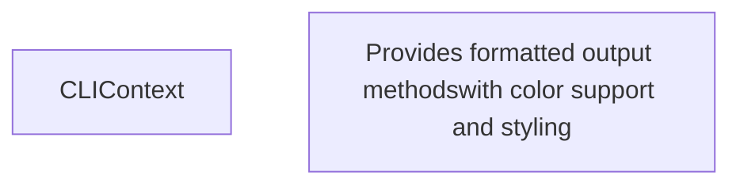
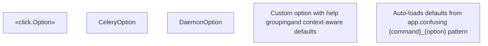
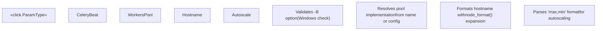
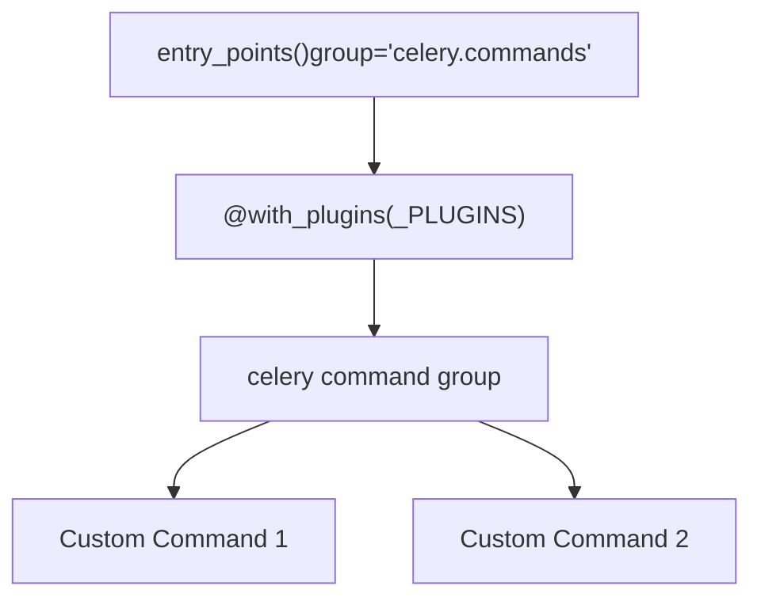
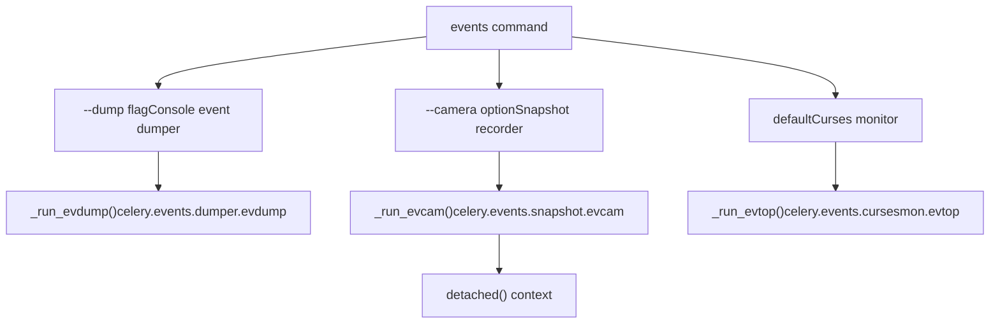

# Command Line Interface

Relevant source files

-   [celery/bin/base.py](https://github.com/celery/celery/blob/4d068b56/celery/bin/base.py)
-   [celery/bin/beat.py](https://github.com/celery/celery/blob/4d068b56/celery/bin/beat.py)
-   [celery/bin/celery.py](https://github.com/celery/celery/blob/4d068b56/celery/bin/celery.py)
-   [celery/bin/events.py](https://github.com/celery/celery/blob/4d068b56/celery/bin/events.py)
-   [celery/bin/worker.py](https://github.com/celery/celery/blob/4d068b56/celery/bin/worker.py)
-   [celery/events/snapshot.py](https://github.com/celery/celery/blob/4d068b56/celery/events/snapshot.py)

The Command Line Interface (CLI) provides the primary means for managing Celery workers, schedulers, and clusters from the command line. The CLI is implemented using the Click framework with extensive customizations for Celery-specific requirements such as application loading, configuration management, and plugin extensibility.

For information about remote control commands that can be sent to running workers, see [Remote Control Commands](/celery/celery/8.1-remote-control-commands). For details about worker configuration and lifecycle, see [Worker Architecture and Bootsteps](/celery/celery/5.1-worker-architecture-and-bootsteps).

## Purpose and Scope

This page documents the technical architecture of Celery's CLI system, including:

-   Command structure and hierarchy using Click framework
-   Application loading and configuration mechanism
-   Custom Click components (`CeleryCommand`, `CeleryOption`, `CLIContext`)
-   Global options and environment variable handling
-   Plugin system for extending CLI with custom commands
-   Common patterns for daemon commands (worker, beat)

## CLI Entry Point and Command Structure

The main CLI entry point is the `celery` command group defined in [celery/bin/celery.py55-164](https://github.com/celery/celery/blob/4d068b56/celery/bin/celery.py#L55-L164) which serves as the umbrella command for all Celery operations.

### Command Hierarchy

```mermaid
flowchart TD
    Main["celery(main command group)"]
    Worker["workerStart worker instance"]
    Beat["beatStart periodic scheduler"]
    Events["eventsEvent monitoring"]
    Control["controlRemote control broadcast"]
    Inspect["inspectQuery worker state"]
    Status["statusShow cluster status"]
    Purge["purgeDelete messages"]
    Result["resultQuery task result"]
    List["listShow registered tasks"]
    Call["callExecute task"]
    Migrate["migrateMigrate messages"]
    Graph["graphGraph workflows"]
    Shell["shellInteractive shell"]
    Multi["multiManage multiple workers"]
    Report["reportBug report info"]
    Upgrade["upgradeUpgrade settings"]
    Amqp["amqpAMQP admin"]
    Logtool["logtoolLog analysis"]

    Main --> Worker
    Main --> Beat
    Main --> Events
    Main --> Control
    Main --> Inspect
    Main --> Status
    Main --> Purge
    Main --> Result
    Main --> List
    Main --> Call
    Main --> Migrate
    Main --> Graph
    Main --> Shell
    Main --> Multi
    Main --> Report
    Main --> Upgrade
    Main --> Amqp
    Main --> Logtool
```


**Sources:** [celery/bin/celery.py55-191](https://github.com/celery/celery/blob/4d068b56/celery/bin/celery.py#L55-L191)

### Main Command Implementation

The `celery` command group is decorated with `@with_plugins(_PLUGINS)` to enable plugin discovery and `@click.group(cls=DYMGroup)` to provide "did you mean" suggestions for mistyped commands.

> **[Mermaid sequence]**
> *(图表结构无法解析)*

**Sources:** [celery/bin/celery.py113-164](https://github.com/celery/celery/blob/4d068b56/celery/bin/celery.py#L113-L164)

## Global Options

The main `celery` command accepts several global options that affect application loading and behavior across all subcommands.

| Option | Environment Variable | Type | Description |
| --- | --- | --- | --- |
| `-A`, `--app` | `APP` | str/Celery | Application instance or import path |
| `-b`, `--broker` | `BROKER_URL` | str | Broker connection URL |
| `--result-backend` | `RESULT_BACKEND` | str | Result backend URL |
| `--loader` | `LOADER` | str | Loader class to use |
| `--config` | `CONFIG_MODULE` | str | Configuration module path |
| `--workdir` | \- | Path | Change working directory |
| `-C`, `--no-color` | `NO_COLOR` | flag | Disable colored output |
| `-q`, `--quiet` | \- | flag | Suppress informational output |
| `--version` | \- | flag | Show version and exit |
| `--skip-checks` | `SKIP_CHECKS` | flag | Skip Django core checks |

**Sources:** [celery/bin/celery.py57-112](https://github.com/celery/celery/blob/4d068b56/celery/bin/celery.py#L57-L112)

### Application Loading

The CLI supports multiple ways to specify the Celery application:

1.  **Import path string**: `celery -A myapp.celery worker`
2.  **Celery object**: When invoked programmatically
3.  **Default app**: Falls back to `get_current_app()` if not specified

The `find_app()` function [celery/bin/celery.py137](https://github.com/celery/celery/blob/4d068b56/celery/bin/celery.py#L137-L137) handles module resolution with comprehensive error handling for missing modules, missing attributes, and general exceptions [celery/bin/celery.py136-152](https://github.com/celery/celery/blob/4d068b56/celery/bin/celery.py#L136-L152)

**Sources:** [celery/bin/celery.py135-156](https://github.com/celery/celery/blob/4d068b56/celery/bin/celery.py#L135-L156) [celery/app/utils.py](https://github.com/celery/celery/blob/4d068b56/celery/app/utils.py)

## CLIContext and Context Management

The `CLIContext` class provides a context object that is passed to all subcommands via Click's context system.


The context object is created in [celery/bin/celery.py154-155](https://github.com/celery/celery/blob/4d068b56/celery/bin/celery.py#L154-L155) and accessed by subcommands using `@click.pass_context` decorator:

```
@click.pass_context
def worker(ctx, ...):
    app = ctx.obj.app
    ctx.obj.echo("Starting worker...")
```
**Sources:** [celery/bin/base.py34-118](https://github.com/celery/celery/blob/4d068b56/celery/bin/base.py#L34-L118)

## Custom Click Components

Celery extends Click with custom classes to support application-specific requirements.

### CeleryOption

`CeleryOption` extends `click.Option` to support:

-   **Help grouping**: Options can be grouped in help output using `help_group` parameter
-   **Default from context**: `default_value_from_context` pulls defaults from `CLIContext`


**Sources:** [celery/bin/base.py140-153](https://github.com/celery/celery/blob/4d068b56/celery/bin/base.py#L140-L153) [celery/bin/base.py174-189](https://github.com/celery/celery/blob/4d068b56/celery/bin/base.py#L174-L189)

### CeleryCommand and CeleryDaemonCommand

`CeleryCommand` customizes help formatting to display options in groups [celery/bin/base.py155-171](https://github.com/celery/celery/blob/4d068b56/celery/bin/base.py#L155-L171)

`CeleryDaemonCommand` extends `CeleryCommand` with common daemon options [celery/bin/base.py191-204](https://github.com/celery/celery/blob/4d068b56/celery/bin/base.py#L191-L204):

-   `--logfile` / `-f`: Log destination
-   `--pidfile`: PID file path
-   `--uid`: User ID for privilege dropping
-   `--gid`: Group ID for privilege dropping
-   `--umask`: File creation mask
-   `--executable`: Override Python executable

**Sources:** [celery/bin/base.py155-204](https://github.com/celery/celery/blob/4d068b56/celery/bin/base.py#L155-L204)

### Custom Parameter Types

Celery defines several custom Click parameter types for validation and conversion:

| Type | Class | Purpose |
| --- | --- | --- |
| `COMMA_SEPARATED_LIST` | `CommaSeparatedList` | Parse comma-separated values into list |
| `JSON_ARRAY` | `JsonArray` | Parse and validate JSON arrays |
| `JSON_OBJECT` | `JsonObject` | Parse and validate JSON objects |
| `ISO8601` | `ISO8601DateTime` | Parse ISO 8601 datetime strings |
| `ISO8601_OR_FLOAT` | `ISO8601DateTimeOrFloat` | Parse datetime or float values |
| `LOG_LEVEL` | `LogLevel` | Parse log level names to numeric values |

**Sources:** [celery/bin/base.py207-306](https://github.com/celery/celery/blob/4d068b56/celery/bin/base.py#L207-L306)

### Worker-Specific Parameter Types

The worker command defines additional custom types:


**Sources:** [celery/bin/worker.py22-98](https://github.com/celery/celery/blob/4d068b56/celery/bin/worker.py#L22-L98)

## Plugin System

The CLI supports extensibility through setuptools entry points. Plugins are loaded from the `celery.commands` entry point group.


The plugin discovery mechanism [celery/bin/celery.py46-52](https://github.com/celery/celery/blob/4d068b56/celery/bin/celery.py#L46-L52) handles different Python versions:

-   Python 3.10+: `entry_points(group='celery.commands')`
-   Python <3.10: `entry_points().get('celery.commands', [])` or `.select(group='celery.commands')`

**Sources:** [celery/bin/celery.py46-55](https://github.com/celery/celery/blob/4d068b56/celery/bin/celery.py#L46-L55)

### User Options

Applications can extend CLI commands with custom options using the `user_options` dictionary:

```
app = Celery('myapp')
app.user_options['worker'].update([
    click.Option(['--custom-option'], help='Custom worker option')
])
app.user_options['preload'].update([
    click.Option(['--preload-option'], help='Global preload option')
])
```
User options are applied to commands in [celery/bin/celery.py157-163](https://github.com/celery/celery/blob/4d068b56/celery/bin/celery.py#L157-L163):

-   `worker.params.extend(app.user_options.get('worker', []))`
-   `beat.params.extend(app.user_options.get('beat', []))`
-   `events.params.extend(app.user_options.get('events', []))`
-   All commands get `preload` options

The `handle_preload_options` decorator [celery/bin/base.py120-137](https://github.com/celery/celery/blob/4d068b56/celery/bin/base.py#L120-L137) extracts preload options and sends the `user_preload_options` signal.

**Sources:** [celery/bin/celery.py157-164](https://github.com/celery/celery/blob/4d068b56/celery/bin/celery.py#L157-L164) [celery/bin/base.py120-137](https://github.com/celery/celery/blob/4d068b56/celery/bin/base.py#L120-L137)

## Worker Command

The `worker` command starts a worker instance with extensive configuration options organized into logical groups.

### Worker Command Structure

```mermaid
flowchart TD
    WorkerCmd["worker command"]
    Hostname["--hostname / -nCustom hostname"]
    Detach["--detach / -DDaemonize"]
    StateDB["--statedb / -SState database path"]
    LogLevel["--loglevel / -lLogging level"]
    Optimization["--optimization / -OOptimization profile"]
    PrefetchMult["--prefetch-multiplierPrefetch multiplier"]
    DisablePrefetch["--disable-prefetchDisable prefetching"]
    Concurrency["--concurrency / -cWorker processes"]
    Pool["--pool / -PPool implementation"]
    Events["--task-events / -ESend events"]
    TimeLimit["--time-limitHard time limit"]
    SoftTimeLimit["--soft-time-limitSoft time limit"]
    MaxTasks["--max-tasks-per-childTask limit per worker"]
    MaxMemory["--max-memory-per-childMemory limit per worker"]
    Purge["--purge / --discardClear queues"]
    Queues["--queues / -QConsume from queues"]
    Exclude["--exclude-queues / -XExclude queues"]
    Include["--include / -IImport modules"]
    Gossip["--without-gossipDisable gossip"]
    Mingle["--without-mingleDisable mingle"]
    Heartbeat["--without-heartbeatDisable heartbeat"]
    HeartbeatInt["--heartbeat-intervalHeartbeat interval"]
    Autoscale["--autoscaleAutoscale workers"]
    Beat["--beat / -BEmbed beat scheduler"]
    Schedule["--schedule-filename / -sSchedule database"]
    Scheduler["--schedulerScheduler class"]

    WorkerCmd --> Hostname
    WorkerCmd --> Detach
    WorkerCmd --> Concurrency
    WorkerCmd --> Pool
    WorkerCmd --> Queues
    WorkerCmd --> Gossip
    WorkerCmd --> Beat
```


**Sources:** [celery/bin/worker.py136-304](https://github.com/celery/celery/blob/4d068b56/celery/bin/worker.py#L136-L304)

### Worker Detach Mode

When the `--detach` flag is used, the worker forks into a background daemon process. The detach logic [celery/bin/worker.py336-356](https://github.com/celery/celery/blob/4d068b56/celery/bin/worker.py#L336-L356):

1.  Reconstructs command-line arguments, removing detach-related options
2.  Calls `detach()` function [celery/bin/worker.py108-133](https://github.com/celery/celery/blob/4d068b56/celery/bin/worker.py#L108-L133)
3.  Uses `os.execv()` to replace process with new worker instance
4.  Handles privilege dropping via `maybe_drop_privileges()` if not detaching

**Sources:** [celery/bin/worker.py108-133](https://github.com/celery/celery/blob/4d068b56/celery/bin/worker.py#L108-L133) [celery/bin/worker.py336-371](https://github.com/celery/celery/blob/4d068b56/celery/bin/worker.py#L336-L371)

### Worker Execution Flow

> **[Mermaid sequence]**
> *(图表结构无法解析)*

**Sources:** [celery/bin/worker.py306-371](https://github.com/celery/celery/blob/4d068b56/celery/bin/worker.py#L306-L371)

## Beat Command

The `beat` command starts the periodic task scheduler with support for detached daemon mode.

### Beat Command Options

| Option Group | Options |
| --- | --- |
| **Beat Options** | `--detach`: Run as daemon
`--schedule / -s`: Schedule database path
`--scheduler / -S`: Scheduler class
`--max-interval`: Max sleep between iterations
`--loglevel / -l`: Logging level |
| **Daemonization** | `--logfile / -f`: Log destination
`--pidfile`: PID file path
`--uid`: User ID
`--gid`: Group ID
`--umask`: File creation mask
`--executable`: Python executable path |

**Sources:** [celery/bin/beat.py10-45](https://github.com/celery/celery/blob/4d068b56/celery/bin/beat.py#L10-L45)

### Beat Execution

The beat command creates a partial `app.Beat` object with configured options and either runs it directly or within a detached context [celery/bin/beat.py61-72](https://github.com/celery/celery/blob/4d068b56/celery/bin/beat.py#L61-L72):

```
beat = partial(app.Beat, logfile=logfile, pidfile=pidfile,
               quiet=ctx.obj.quiet, **kwargs)

if detach:
    with detached(logfile, pidfile, uid, gid, umask, workdir):
        return beat().run()
else:
    return beat().run()
```
**Sources:** [celery/bin/beat.py47-72](https://github.com/celery/celery/blob/4d068b56/celery/bin/beat.py#L47-L72)

## Events Command

The `events` command provides event monitoring utilities with three modes: dump, snapshot camera, and top (curses monitor).

### Events Command Modes


**Sources:** [celery/bin/events.py82-94](https://github.com/celery/celery/blob/4d068b56/celery/bin/events.py#L82-L94)

### Events Command Options

| Option | Group | Description |
| --- | --- | --- |
| `--dump / -d` | Dumper | Print events to console |
| `--camera / -c` | Snapshot | Snapshot camera class |
| `--detach / -d` | Snapshot | Detach camera as daemon |
| `--frequency / -F` | Snapshot | Snapshot frequency (seconds) |
| `--maxrate / -r` | Snapshot | Max snapshot rate |
| `--loglevel / -l` | Snapshot | Logging level |

The snapshot camera feature is implemented in [celery/events/snapshot.py24-111](https://github.com/celery/celery/blob/4d068b56/celery/events/snapshot.py#L24-L111) using the `Polaroid` class and `evcam()` function.

**Sources:** [celery/bin/events.py50-82](https://github.com/celery/celery/blob/4d068b56/celery/bin/events.py#L50-L82) [celery/events/snapshot.py86-111](https://github.com/celery/celery/blob/4d068b56/celery/events/snapshot.py#L86-L111)

## Configuration from Command Line

Both worker and beat commands support passing additional configuration via extra arguments after the command:

```
celery -A myapp worker -- worker_prefetch_multiplier=1 worker_max_tasks_per_child=100
```
The `app.config_from_cmdline()` method [celery/bin/worker.py330](https://github.com/celery/celery/blob/4d068b56/celery/bin/worker.py#L330-L330) and [celery/bin/beat.py54](https://github.com/celery/celery/blob/4d068b56/celery/bin/beat.py#L54-L54) parses these arguments and applies them to the application configuration. The namespace parameter ('worker') prefixes the configuration keys.

**Sources:** [celery/bin/worker.py328-335](https://github.com/celery/celery/blob/4d068b56/celery/bin/worker.py#L328-L335) [celery/bin/beat.py52-59](https://github.com/celery/celery/blob/4d068b56/celery/bin/beat.py#L52-L59)

## Error Handling and User Experience

### Application Loading Error Messages

The CLI provides detailed error messages for application loading failures with color-coded output:

-   `UNABLE_TO_LOAD_APP_MODULE_NOT_FOUND`: Module not found [celery/bin/celery.py32-34](https://github.com/celery/celery/blob/4d068b56/celery/bin/celery.py#L32-L34)
-   `UNABLE_TO_LOAD_APP_ERROR_OCCURRED`: Exception during import [celery/bin/celery.py36-39](https://github.com/celery/celery/blob/4d068b56/celery/bin/celery.py#L36-L39)
-   `UNABLE_TO_LOAD_APP_APP_MISSING`: Missing app attribute [celery/bin/celery.py41-43](https://github.com/celery/celery/blob/4d068b56/celery/bin/celery.py#L41-L43)

**Sources:** [celery/bin/celery.py32-152](https://github.com/celery/celery/blob/4d068b56/celery/bin/celery.py#L32-L152)

### Option Position Validation

The CLI enforces that global options like `-A`/`--app` must be specified before the subcommand, not after. A monkey-patched `NoSuchOption.show()` method [celery/bin/celery.py206-217](https://github.com/celery/celery/blob/4d068b56/celery/bin/celery.py#L206-L217) provides a helpful error message explaining the correct usage:

```
You are using `-A` as an option of the worker sub-command:
celery worker -A celeryapp <...>

The support for this usage was removed in Celery 5.0. Instead you should use `-A` as a global option:
celery -A celeryapp worker <...>
```
**Sources:** [celery/bin/celery.py193-217](https://github.com/celery/celery/blob/4d068b56/celery/bin/celery.py#L193-L217)

### Process Title and Status

Commands set meaningful process titles for easier process identification. The `_set_process_status()` helper [celery/bin/events.py11-14](https://github.com/celery/celery/blob/4d068b56/celery/bin/events.py#L11-L14) formats process titles like `celery events:dump` with command-line arguments.

**Sources:** [celery/bin/events.py11-20](https://github.com/celery/celery/blob/4d068b56/celery/bin/events.py#L11-L20)

## Command Registration

All commands are registered with the main `celery` group using `celery.add_command()` [celery/bin/celery.py175-191](https://github.com/celery/celery/blob/4d068b56/celery/bin/celery.py#L175-L191):

```
celery.add_command(purge)
celery.add_command(call)
celery.add_command(beat)
celery.add_command(list_)
celery.add_command(result)
# ... and 11 more commands
```
Each command is implemented in its own module under `celery/bin/` and imported at the top of `celery.py`.

**Sources:** [celery/bin/celery.py15-30](https://github.com/celery/celery/blob/4d068b56/celery/bin/celery.py#L15-L30) [celery/bin/celery.py175-191](https://github.com/celery/celery/blob/4d068b56/celery/bin/celery.py#L175-L191)
