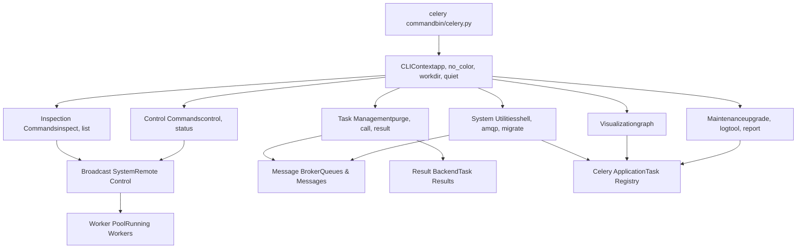
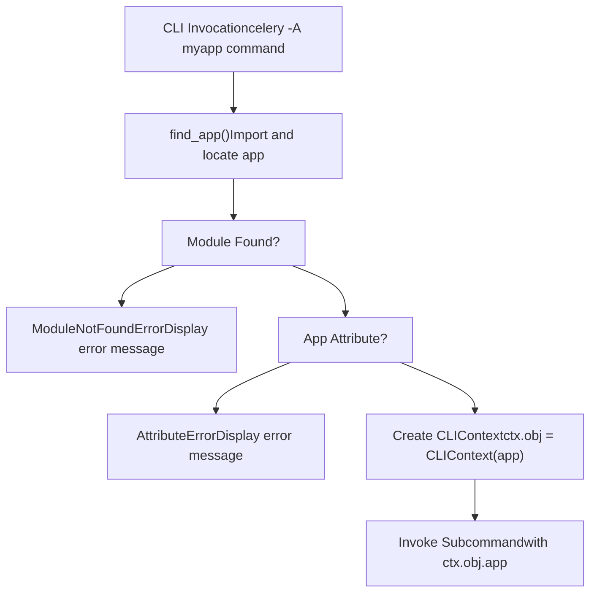
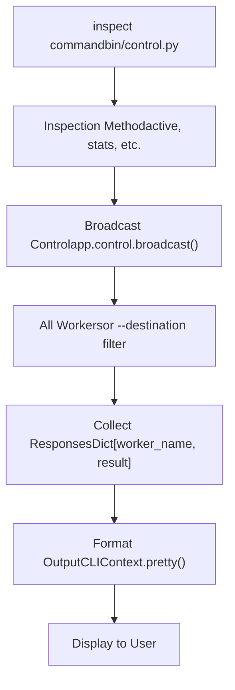
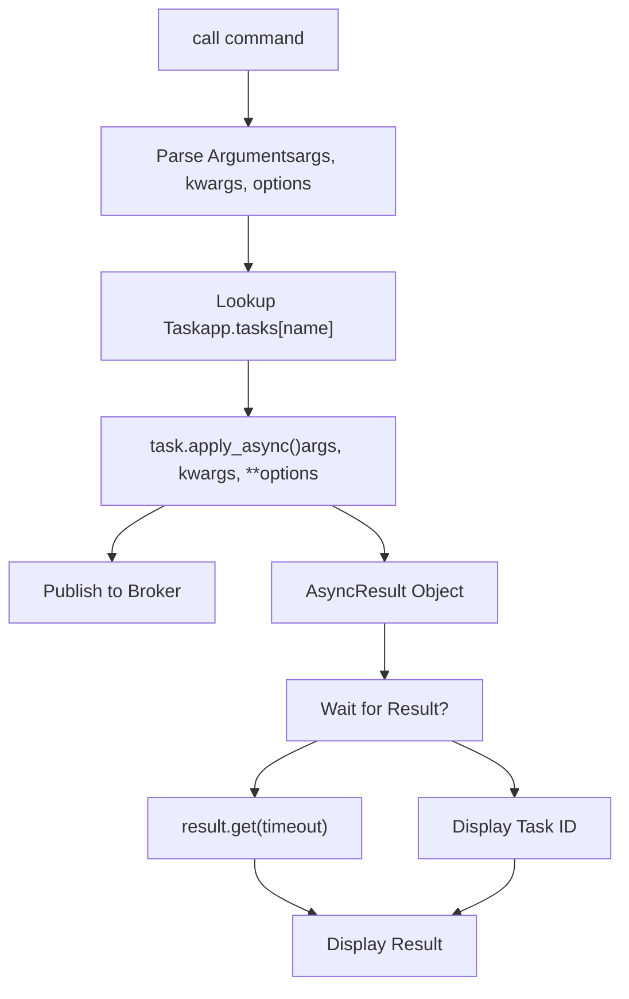
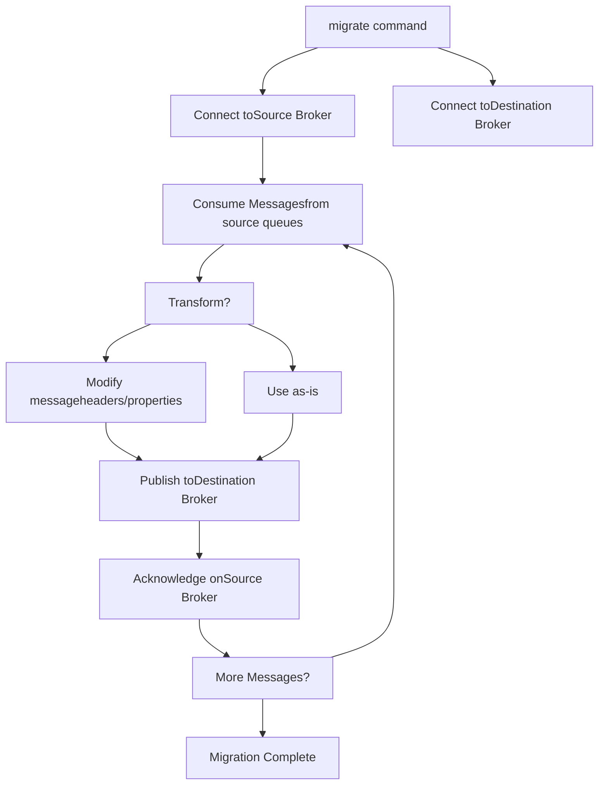
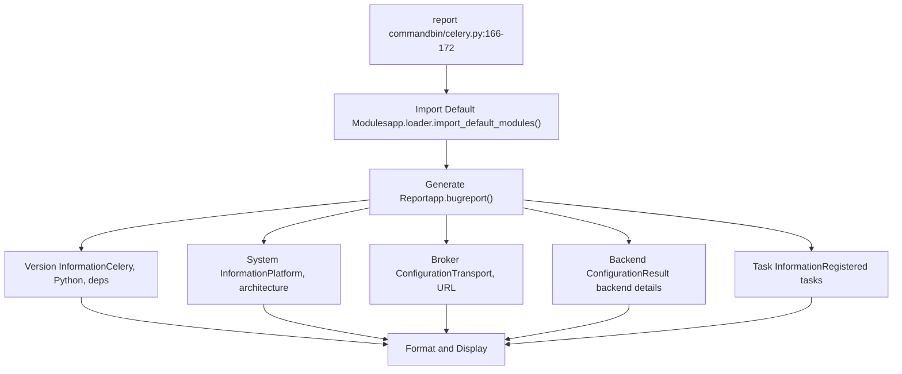

# Management Commands

Relevant source files

-   [celery/bin/base.py](https://github.com/celery/celery/blob/4d068b56/celery/bin/base.py)
-   [celery/bin/beat.py](https://github.com/celery/celery/blob/4d068b56/celery/bin/beat.py)
-   [celery/bin/celery.py](https://github.com/celery/celery/blob/4d068b56/celery/bin/celery.py)
-   [celery/bin/events.py](https://github.com/celery/celery/blob/4d068b56/celery/bin/events.py)
-   [celery/bin/worker.py](https://github.com/celery/celery/blob/4d068b56/celery/bin/worker.py)
-   [celery/events/snapshot.py](https://github.com/celery/celery/blob/4d068b56/celery/events/snapshot.py)

## Purpose and Scope

This page documents Celery's management and utility commands that provide operational control, inspection, and maintenance capabilities for Celery applications. These commands enable administrators and developers to interact with running workers, manage tasks, inspect cluster state, and perform administrative operations.

This page covers the following commands: `inspect`, `control`, `purge`, `call`, `result`, `migrate`, `status`, `shell`, `amqp`, `graph`, `list`, `upgrade`, `logtool`, and `report`. For information about starting workers and beat schedulers, see [Worker and Beat Commands](/celery/celery/9.2-worker-and-beat-commands). For managing multiple worker instances, see [Multi-worker Management](/celery/celery/9.4-multi-worker-management).

Sources: [celery/bin/celery.py1-228](https://github.com/celery/celery/blob/4d068b56/celery/bin/celery.py#L1-L228)

## Command Categories

Management commands in Celery are organized into several functional categories based on their purpose and the system components they interact with.

### Command Registration

All management commands are registered with the main `celery` CLI group in the entrypoint module. The registration follows a consistent pattern where each command is imported and added to the CLI group.

```
celery.add_command(purge)
celery.add_command(call)
celery.add_command(result)
celery.add_command(migrate)
celery.add_command(status)
celery.add_command(inspect)
celery.add_command(control)
celery.add_command(graph)
celery.add_command(upgrade)
celery.add_command(logtool)
celery.add_command(amqp)
celery.add_command(shell)
celery.add_command(list_)
```
Sources: [celery/bin/celery.py175-191](https://github.com/celery/celery/blob/4d068b56/celery/bin/celery.py#L175-L191)

### Management Command Architecture

The following diagram shows how management commands are organized and what system components they interact with:


Sources: [celery/bin/celery.py15-31](https://github.com/celery/celery/blob/4d068b56/celery/bin/celery.py#L15-L31) [celery/bin/celery.py175-191](https://github.com/celery/celery/blob/4d068b56/celery/bin/celery.py#L175-L191)

## Command Infrastructure

All management commands are built on the Click framework with Celery-specific customizations. They share common infrastructure for application loading, configuration, and output formatting.

### Base Classes and Context

Management commands inherit from `CeleryCommand` and receive a `CLIContext` object containing the initialized Celery application and output preferences.

| Component | Purpose | Key Attributes |
| --- | --- | --- |
| `CLIContext` | Shared CLI context | `app`, `no_color`, `quiet`, `workdir` |
| `CeleryCommand` | Base command class | Custom help formatting with grouped options |
| `CeleryOption` | Custom option type | Support for help groups and context defaults |

The `CLIContext` class provides utility methods for formatted output:

| Method | Purpose |
| --- | --- |
| `echo()` | Standard output with color support |
| `secho()` | Styled echo with color support |
| `error()` | Error output to stderr |
| `pretty()` | Pretty-print dictionaries and lists |
| `say_chat()` | Directional message display (← or →) |

Sources: [celery/bin/base.py34-118](https://github.com/celery/celery/blob/4d068b56/celery/bin/base.py#L34-L118) [celery/bin/base.py155-172](https://github.com/celery/celery/blob/4d068b56/celery/bin/base.py#L155-L172)

### Application Loading

The main `celery` command handles application loading before invoking subcommands. The application can be specified via the `-A/--app` option or environment variables.


The application loading process includes error handling for common failure scenarios:

-   **Module not found**: Displays styled error message indicating the module could not be imported
-   **Attribute error**: Indicates the app instance could not be found in the module
-   **Generic exceptions**: Shows full traceback for debugging

Sources: [celery/bin/celery.py113-156](https://github.com/celery/celery/blob/4d068b56/celery/bin/celery.py#L113-L156)

## Inspection Commands

Inspection commands query worker state without modifying anything. They use the broadcast-based remote control system to communicate with running workers.

### inspect Command

The `inspect` command provides read-only access to worker state and statistics. It communicates with workers via the control broadcast system.

Common inspection operations include:

| Operation | Purpose |
| --- | --- |
| `active` | List currently executing tasks |
| `scheduled` | List scheduled tasks (ETA/countdown) |
| `reserved` | List reserved (prefetched) tasks |
| `stats` | Worker statistics and configuration |
| `registered` | List registered task types |
| `active_queues` | List active queue names |
| `conf` | Worker configuration values |
| `revoked` | List revoked task IDs |
| `clock` | Logical clock value |
| `ping` | Check worker responsiveness |

The inspect command architecture:


Workers respond to inspection commands through the consumer's control handler, which executes the requested inspection method and returns results.

Sources: [celery/bin/celery.py19](https://github.com/celery/celery/blob/4d068b56/celery/bin/celery.py#L19-L19) [celery/bin/celery.py184](https://github.com/celery/celery/blob/4d068b56/celery/bin/celery.py#L184-L184)

### list Command

The `list` command displays information about registered tasks and bindings. Unlike `inspect`, this command operates on the local application instance rather than querying remote workers.

The command can list:

-   **Registered tasks**: All tasks known to the application
-   **Task bindings**: Queue and exchange bindings configured for tasks

Sources: [celery/bin/celery.py22](https://github.com/celery/celery/blob/4d068b56/celery/bin/celery.py#L22-L22) [celery/bin/celery.py178](https://github.com/celery/celery/blob/4d068b56/celery/bin/celery.py#L178-L178)

## Control Commands

Control commands send directives to workers that modify their behavior or state. These use the same broadcast system as inspection but trigger actions rather than queries.

### control Command

The `control` command sends operational directives to workers. Common control operations:

| Operation | Purpose | Impact |
| --- | --- | --- |
| `shutdown` | Gracefully shut down worker | Worker terminates after finishing current tasks |
| `pool_restart` | Restart worker pool | Pool processes are replaced |
| `pool_grow` | Add worker processes | Increases concurrency |
| `pool_shrink` | Remove worker processes | Decreases concurrency |
| `autoscale` | Set autoscale parameters | Changes min/max worker count |
| `time_limit` | Set task time limits | Affects soft/hard time limits |
| `rate_limit` | Set task rate limit | Controls task execution rate |
| `revoke` | Cancel task execution | Marks task ID as revoked |
| `terminate` | Forcefully terminate task | Kills worker process executing task |
| `enable_events` | Enable event monitoring | Starts sending task events |
| `disable_events` | Disable event monitoring | Stops sending task events |
| `election` | Trigger leader election | For event camera coordination |

### Control Message Flow

> **[Mermaid sequence]**
> *(图表结构无法解析)*

Sources: [celery/bin/celery.py19](https://github.com/celery/celery/blob/4d068b56/celery/bin/celery.py#L19-L19) [celery/bin/celery.py185](https://github.com/celery/celery/blob/4d068b56/celery/bin/celery.py#L185-L185)

### status Command

The `status` command is a specialized control operation that checks cluster status. It pings all workers and reports which workers are online.

This command is particularly useful for:

-   Health checks in deployment scripts
-   Verifying worker availability
-   Monitoring cluster size

Sources: [celery/bin/celery.py19](https://github.com/celery/celery/blob/4d068b56/celery/bin/celery.py#L19-L19) [celery/bin/celery.py181](https://github.com/celery/celery/blob/4d068b56/celery/bin/celery.py#L181-L181)

## Task Management Commands

Task management commands interact with the broker and result backend to manage task lifecycle operations.

### purge Command

The `purge` command removes all messages from configured queues. This is a destructive operation that discards pending tasks.

Operation flow:

1.  Connect to broker
2.  Iterate through configured queues
3.  Delete all messages from each queue
4.  Report number of messages purged

Use cases:

-   Clearing a backlog after fixing a bug
-   Removing obsolete tasks during deployment
-   Testing and development cleanup

Sources: [celery/bin/celery.py26](https://github.com/celery/celery/blob/4d068b56/celery/bin/celery.py#L26-L26) [celery/bin/celery.py175](https://github.com/celery/celery/blob/4d068b56/celery/bin/celery.py#L175-L175)

### call Command

The `call` command invokes a task from the command line. It provides a CLI interface for task submission with support for arguments, keyword arguments, and execution options.

Supported options typically include:

-   Task arguments (positional and keyword)
-   Execution options (ETA, countdown, queue, routing)
-   Result handling (wait, timeout)


Sources: [celery/bin/celery.py18](https://github.com/celery/celery/blob/4d068b56/celery/bin/celery.py#L18-L18) [celery/bin/celery.py176](https://github.com/celery/celery/blob/4d068b56/celery/bin/celery.py#L176-L176)

### result Command

The `result` command retrieves and displays task results given a task ID. It queries the result backend and handles various result states.

The command handles:

-   **PENDING**: Task not yet executed
-   **STARTED**: Task execution in progress
-   **SUCCESS**: Task completed successfully (display result)
-   **FAILURE**: Task failed (display exception)
-   **RETRY**: Task being retried
-   **REVOKED**: Task was cancelled

Result retrieval options:

-   Blocking wait with timeout
-   Task state checking
-   Exception traceback display
-   Result deserialization

Sources: [celery/bin/celery.py27](https://github.com/celery/celery/blob/4d068b56/celery/bin/celery.py#L27-L27) [celery/bin/celery.py179](https://github.com/celery/celery/blob/4d068b56/celery/bin/celery.py#L179-L179)

## System Utility Commands

System utilities provide direct access to Celery's internal components for debugging, migration, and interactive use.

### shell Command

The `shell` command starts an interactive Python shell with the Celery application pre-loaded. The shell environment includes:

-   Loaded Celery application (`app`)
-   All registered tasks
-   Celery utility functions
-   Access to broker and backend connections

Shell implementations supported:

-   IPython (if available)
-   bpython (if available)
-   Standard Python REPL

Typical shell session:

```
# Celery application automatically loaded
>>> app
<Celery default at 0x...>

# Access registered tasks
>>> app.tasks
{'celery.chain': <Task: celery.chain>, ...}

# Submit tasks interactively
>>> result = add.delay(2, 2)
>>> result.get()
4
```
Sources: [celery/bin/celery.py28](https://github.com/celery/celery/blob/4d068b56/celery/bin/celery.py#L28-L28) [celery/bin/celery.py190](https://github.com/celery/celery/blob/4d068b56/celery/bin/celery.py#L190-L190)

### amqp Command

The `amqp` command provides a low-level interface to AMQP operations. It enables direct interaction with the message broker for:

-   Queue declaration and inspection
-   Exchange declaration and binding
-   Message publishing
-   Message consumption
-   Queue purging
-   Binding management

This is primarily used for:

-   Debugging broker connectivity
-   Inspecting queue contents
-   Testing routing configurations
-   Manual message manipulation

Sources: [celery/bin/celery.py15](https://github.com/celery/celery/blob/4d068b56/celery/bin/celery.py#L15-L15) [celery/bin/celery.py189](https://github.com/celery/celery/blob/4d068b56/celery/bin/celery.py#L189-L189)

### migrate Command

The `migrate` command facilitates broker migration by moving tasks from one broker to another. It consumes messages from the source broker and republishes them to the destination broker.

Migration process:


Use cases:

-   Switching broker technologies (RabbitMQ → Redis)
-   Moving to different broker instances
-   Broker version upgrades
-   Disaster recovery

Sources: [celery/bin/celery.py24](https://github.com/celery/celery/blob/4d068b56/celery/bin/celery.py#L24-L24) [celery/bin/celery.py180](https://github.com/celery/celery/blob/4d068b56/celery/bin/celery.py#L180-L180)

## Visualization and Reporting Commands

These commands provide insights into task relationships and system configuration.

### graph Command

The `graph` command generates DOT format graphs showing task dependencies and Canvas workflow structure. It visualizes:

-   Task dependency chains
-   Canvas primitives (group, chord, chain)
-   Callback and errback relationships
-   Workflow composition

Output formats:

-   DOT language (for Graphviz)
-   Visual rendering (if Graphviz installed)

This is useful for:

-   Understanding complex workflows
-   Documentation generation
-   Debugging task dependencies
-   Visual architecture review

Sources: [celery/bin/celery.py21](https://github.com/celery/celery/blob/4d068b56/celery/bin/celery.py#L21-L21) [celery/bin/celery.py186](https://github.com/celery/celery/blob/4d068b56/celery/bin/celery.py#L186-L186)

### report Command

The `report` command generates a comprehensive system report including:

-   Celery version information
-   Python version and platform
-   Broker transport details
-   Result backend configuration
-   Installed dependencies
-   Configuration summary


This report is designed to be included in bug reports and support requests, providing all relevant environmental and configuration details.

Sources: [celery/bin/celery.py166-172](https://github.com/celery/celery/blob/4d068b56/celery/bin/celery.py#L166-L172)

## Maintenance Commands

### upgrade Command

The `upgrade` command performs version-specific upgrade procedures when migrating between major Celery versions. It handles:

-   Configuration migration
-   Database schema updates
-   File format conversions
-   Compatibility checks

The command is version-aware and only executes relevant upgrade steps based on the current and target versions.

Sources: [celery/bin/celery.py29](https://github.com/celery/celery/blob/4d068b56/celery/bin/celery.py#L29-L29) [celery/bin/celery.py187](https://github.com/celery/celery/blob/4d068b56/celery/bin/celery.py#L187-L187)

### logtool Command

The `logtool` command provides utilities for log file analysis and manipulation. It can:

-   Parse Celery log files
-   Extract statistics
-   Filter log entries
-   Generate reports from logs

This is useful for post-mortem analysis and performance investigation.

Sources: [celery/bin/celery.py23](https://github.com/celery/celery/blob/4d068b56/celery/bin/celery.py#L23-L23) [celery/bin/celery.py188](https://github.com/celery/celery/blob/4d068b56/celery/bin/celery.py#L188-L188)

## Common Command Patterns

### Output Formatting

All management commands use `CLIContext` for consistent output formatting. The context provides color support that can be disabled with the `--no-color` flag.

Pretty-printing logic:

| Input Type | Format Strategy |
| --- | --- |
| `list` | Bullet-point list with "\* " prefix |
| `dict` with `ok`/`error` keys | Status-prefixed indented output |
| `dict` (general) | JSON formatted with syntax highlighting |
| `str` | Direct output |
| Other | `pformat()` representation |

Sources: [celery/bin/base.py80-109](https://github.com/celery/celery/blob/4d068b56/celery/bin/base.py#L80-L109)

### Error Handling

Commands follow a consistent error handling pattern:

1.  Attempt operation
2.  Catch specific exceptions
3.  Format error message with `ctx.obj.error()`
4.  Exit with non-zero status

The framework provides special handling for common errors:

-   Application loading failures
-   Broker connection errors
-   Worker unavailability
-   Invalid arguments

Sources: [celery/bin/celery.py136-152](https://github.com/celery/celery/blob/4d068b56/celery/bin/celery.py#L136-L152)

### Command Extensions via Plugins

The CLI system supports plugin-based command extensions through entry points. Third-party packages can register additional commands:

```
# In setup.py
entry_points={
    'celery.commands': [
        'mycommand = mypackage.commands:mycommand',
    ],
}
```
The main CLI loads plugins from the `celery.commands` entry point group and integrates them seamlessly with built-in commands.

Sources: [celery/bin/celery.py46-53](https://github.com/celery/celery/blob/4d068b56/celery/bin/celery.py#L46-L53) [celery/bin/celery.py55-56](https://github.com/celery/celery/blob/4d068b56/celery/bin/celery.py#L55-L56)

## Integration with Worker Control System

Management commands that interact with workers use the remote control system, which relies on broadcast messaging. For detailed information on the remote control protocol, see [Remote Control Commands](/celery/celery/8.1-remote-control-commands) and [Worker Inspection](/celery/celery/8.2-worker-inspection).

### Control Message Protocol

Control and inspection commands:

1.  Create control message with command name and arguments
2.  Publish to control exchange with appropriate routing
3.  Wait for responses (with timeout)
4.  Aggregate responses from multiple workers
5.  Format and display results

Workers receive control messages through a dedicated consumer that:

-   Validates the control command
-   Checks method permissions
-   Executes the requested operation
-   Returns results if expected

Sources: [celery/bin/celery.py19](https://github.com/celery/celery/blob/4d068b56/celery/bin/celery.py#L19-L19)
