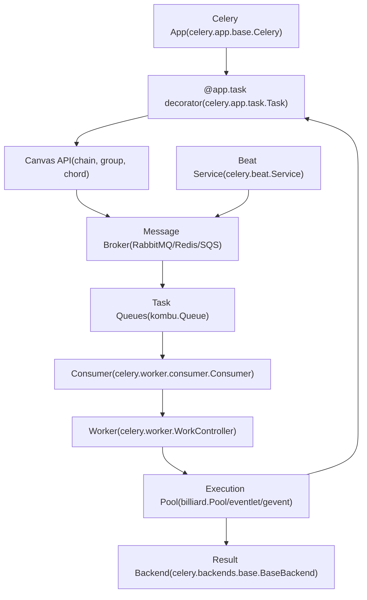
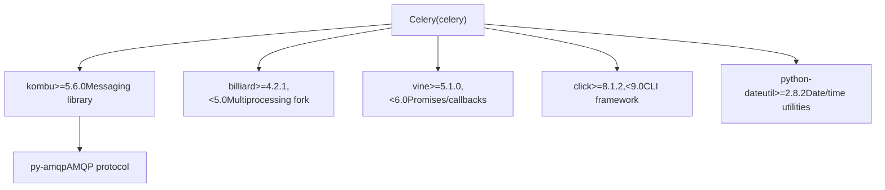

# Celery 概览

相关源文件

-   [.bumpversion.cfg](https://github.com/celery/celery/blob/4d068b56/.bumpversion.cfg)
-   [Changelog.rst](https://github.com/celery/celery/blob/4d068b56/Changelog.rst)
-   [README.rst](https://github.com/celery/celery/blob/4d068b56/README.rst)
-   [celery/\_\_init\_\_.py](https://github.com/celery/celery/blob/4d068b56/celery/__init__.py)
-   [celery/contrib/sphinx.py](https://github.com/celery/celery/blob/4d068b56/celery/contrib/sphinx.py)
-   [docs/getting-started/introduction.rst](https://github.com/celery/celery/blob/4d068b56/docs/getting-started/introduction.rst)
-   [docs/history/changelog-5.5.rst](https://github.com/celery/celery/blob/4d068b56/docs/history/changelog-5.5.rst)
-   [docs/history/changelog-5.6.rst](https://github.com/celery/celery/blob/4d068b56/docs/history/changelog-5.6.rst)
-   [docs/history/index.rst](https://github.com/celery/celery/blob/4d068b56/docs/history/index.rst)
-   [docs/history/whatsnew-5.5.rst](https://github.com/celery/celery/blob/4d068b56/docs/history/whatsnew-5.5.rst)
-   [docs/history/whatsnew-5.6.rst](https://github.com/celery/celery/blob/4d068b56/docs/history/whatsnew-5.6.rst)
-   [docs/includes/installation.txt](https://github.com/celery/celery/blob/4d068b56/docs/includes/installation.txt)
-   [docs/includes/introduction.txt](https://github.com/celery/celery/blob/4d068b56/docs/includes/introduction.txt)
-   [docs/includes/resources.txt](https://github.com/celery/celery/blob/4d068b56/docs/includes/resources.txt)
-   [docs/index.rst](https://github.com/celery/celery/blob/4d068b56/docs/index.rst)
-   [requirements/default.txt](https://github.com/celery/celery/blob/4d068b56/requirements/default.txt)
-   [setup.cfg](https://github.com/celery/celery/blob/4d068b56/setup.cfg)
-   [setup.py](https://github.com/celery/celery/blob/4d068b56/setup.py)

## 目的与范围

本页面介绍了 Celery 作为一个分布式任务队列（distributed task queue）系统，解释了其核心目的、主要架构组件，以及消息如何在客户端（clients）、代理（brokers）、工作者（workers）和结果后端（result backends）之间流动。有关详细的安装说明和依赖管理，请参阅[安装与设置](/celery/celery/1.1-installation-and-setup)。有关深入的架构细节和组件交互，请参阅[核心架构](/celery/celery/1.2-core-architecture)。

## 什么是 Celery？

Celery 是一个分布式任务队列系统，它使应用程序能够跨线程、进程或机器分发工作。任务队列接受被称为任务（tasks）的工作单元，专门的工作者进程会持续监控并执行这些任务。

Celery 通过消息（messages）进行通信，使用消息代理（message broker）在客户端（任务生产者）和工作者（任务消费者）之间进行调解。客户端将任务消息添加到队列中，代理将其传递给可用的工作者，工作者随后执行该任务。结果可以选择性地存储在结果后端中，以便稍后检索。

**关键特性：**

| 特性 | 描述 |
| --- | --- |
| **分布式 (Distributed)** | 工作者和代理可以跨多台机器和数据中心运行 |
| **异步 (Asynchronous)** | 任务的执行独立于调用代码 |
| **可扩展 (Scalable)** | 系统可以通过添加更多工作者来水平扩展 |
| **容错 (Fault-tolerant)** | 在连接丢失或失败时自动重试 |
| **灵活 (Flexible)** | 支持多种代理、后端、序列化格式和并发模型 |

来源：[README.rst91-105](https://github.com/celery/celery/blob/4d068b56/README.rst#L91-L105) [docs/includes/introduction.txt10-25](https://github.com/celery/celery/blob/4d068b56/docs/includes/introduction.txt#L10-L25) [docs/getting-started/introduction.rst11-25](https://github.com/celery/celery/blob/4d068b56/docs/getting-started/introduction.rst#L11-L25)

## 架构概览

下图展示了 Celery 系统中的主要组件及其关系：


### 组件职责

| 组件 | 主要类 | 目的 |
| --- | --- | --- |
| **Celery App** | `celery.app.base.Celery` | 配置注册与任务管理 |
| **Task** | `celery.app.task.Task` | 具有重试/错误处理功能的待执行工作单元 |
| **Broker** | 各种 (RabbitMQ/Redis/SQS) | 消息传输与队列管理 |
| **Worker** | `celery.worker.WorkController` | 进程生命周期与组件编排 |
| **Consumer** | `celery.worker.consumer.Consumer` | 消息获取与分发 |
| **Pool** | `billiard.Pool` / eventlet / gevent | 并发任务执行 |
| **Backend** | `celery.backends.base.BaseBackend` | 任务结果存储与检索 |
| **Beat** | `celery.beat.Service` | 周期性任务调度 |

来源：[celery/\_\_init\_\_.py29-34](https://github.com/celery/celery/blob/4d068b56/celery/__init__.py#L29-L34) [README.rst100-105](https://github.com/celery/celery/blob/4d068b56/README.rst#L100-L105) 来自高层架构的图表 1

## 任务执行流

以下时序图展示了一个任务从调用到完成在系统中的流动过程：

> **[Mermaid sequence]**
> *(图表结构无法解析)*

### 关键流程步骤

1.  **任务调用 (Task Invocation)**：客户端调用带有参数的 `task.apply_async()`
2.  **消息创建 (Message Creation)**：应用通过 AMQP 层序列化参数并创建消息
3.  **路由 (Routing)**：消息根据路由规则路由到相应的队列
4.  **交付 (Delivery)**：代理将消息交付给工作者消费者（带有预取/prefetch 功能）
5.  **执行 (Execution)**：消费者分发到执行池（execution pool）
6.  **结果处理 (Result Handling)**：结果存储在后端且消息被确认（acknowledged）
7.  **检索 (Retrieval)**：客户端通过 `AsyncResult` 异步检索结果

来源：来自高层架构的图表 2，[celery/app/task.py](https://github.com/celery/celery/blob/4d068b56/celery/app/task.py) [celery/worker/consumer/consumer.py](https://github.com/celery/celery/blob/4d068b56/celery/worker/consumer/consumer.py)

## 支持的基础设施

### 消息代理 (Message Brokers)

Celery 支持多种消息传输后端：

| 代理 | 状态 | 捆绑包 (Bundle) | 描述 |
| --- | --- | --- | --- |
| **RabbitMQ** | 功能完备 | `librabbitmq` | 推荐的生产环境代理，支持所有功能 |
| **Redis** | 功能完备 | `redis` | 热门替代方案，设置更简单 |
| **Amazon SQS** | 已支持 | `sqs` | 托管的 AWS 队列服务 |
| **Google Pub/Sub** | 实验性 | `gcpubsub` | Google Cloud 消息服务 |

来源：[README.rst219-221](https://github.com/celery/celery/blob/4d068b56/README.rst#L219-L221) [docs/getting-started/introduction.rst132-134](https://github.com/celery/celery/blob/4d068b56/docs/getting-started/introduction.rst#L132-L134) [setup.py12-46](https://github.com/celery/celery/blob/4d068b56/setup.py#L12-L46)

### 结果后端 (Result Backends)

用于存储任务结果和状态的存储系统：

| 后端类型 | 实现 | 捆绑包 |
| --- | --- | --- |
| **键值存储 (Key-Value Stores)** | Redis, Memcached (pylibmc/pymemcache) | `redis`, `memcache`, `pymemcache` |
| **关系型数据库 (Relational Databases)** | SQLAlchemy, Django ORM | `sqlalchemy`, `django` |
| **NoSQL 数据库** | MongoDB, Cassandra, CouchDB, Couchbase, ArangoDB | `mongodb`, `cassandra`, `couchdb`, `couchbase`, `arangodb` |
| **云存储 (Cloud Storage)** | Amazon S3, DynamoDB, Azure Block Blob, Cosmos DB, Google Cloud Storage | `s3`, `dynamodb`, `azureblockblob`, `cosmosdbsql`, `gcs` |
| **搜索引擎 (Search Engines)** | Elasticsearch, Riak | `elasticsearch`, `riak` |
| **消息队列 (Message Queues)** | AMQP (RPC 后端) | 内置 |

来源：[README.rst227-233](https://github.com/celery/celery/blob/4d068b56/README.rst#L227-L233) [docs/includes/installation.txt59-122](https://github.com/celery/celery/blob/4d068b56/docs/includes/installation.txt#L59-L122) [setup.py12-46](https://github.com/celery/celery/blob/4d068b56/setup.py#L12-L46)

### 并发模型 (Concurrency Models)

工作者执行策略：

| 模型 | 实现 | 捆绑包 | 描述 |
| --- | --- | --- | --- |
| **prefork** | `billiard.Pool` | 内置 | 使用进程池的多进程模式（默认） |
| **eventlet** | `eventlet` | `eventlet` | 绿线程（Green threads），异步 I/O |
| **gevent** | `gevent` | `gevent` | 绿线程，异步 I/O |
| **solo** | 单线程 | 内置 | 单个工作者线程（用于测试/调试） |
| **threads** | `ThreadPool` | 内置 | 基于线程的并发 |

来源：[README.rst224-225](https://github.com/celery/celery/blob/4d068b56/README.rst#L224-L225) [celery/\_\_init\_\_.py100-146](https://github.com/celery/celery/blob/4d068b56/celery/__init__.py#L100-L146)

### 序列化格式 (Serialization Formats)

支持的消息序列化：

| 格式 | 捆绑包 | 特性 |
| --- | --- | --- |
| **json** | 内置 | 默认，跨语言兼容 |
| **pickle** | 内置 | Python 对象，不安全 |
| **yaml** | `yaml` | 人类可读 |
| **msgpack** | `msgpack` | 二进制，紧凑 |
| **auth** | `auth` | 加密消息签名 |

压缩：zlib, bzip2（内置）

来源：[README.rst236-239](https://github.com/celery/celery/blob/4d068b56/README.rst#L236-L239) [docs/getting-started/introduction.rst155-159](https://github.com/celery/celery/blob/4d068b56/docs/getting-started/introduction.rst#L155-L159)

## 核心依赖

Celery 构建在以下几个关键库之上：


| 依赖 | 版本要求 | 目的 |
| --- | --- | --- |
| **kombu** | \>=5.6.0 | 消息队列抽象与代理通信 |
| **billiard** | \>=4.2.1,<5.0 | 多进程池（multiprocessing pool）实现 |
| **vine** | \>=5.1.0,<6.0 | 异步操作的 Promise 和回调系统 |
| **click** | \>=8.1.2,<9.0 | 命令行界面框架 |
| **python-dateutil** | \>=2.8.2 | 用于调度的日期和时间解析 |

来源：[requirements/default.txt1-11](https://github.com/celery/celery/blob/4d068b56/requirements/default.txt#L1-L11) [setup.py117-119](https://github.com/celery/celery/blob/4d068b56/setup.py#L117-L119)

## 版本信息

**当前版本**：5.6.2 (代号: "recovery")

**Python 支持**：

-   CPython: 3.9, 3.10, 3.11, 3.12, 3.13
-   PyPy: 3.9+ (v7.3.12+)

**注意**：Python 3.8 的支持已在版本 5.6.0 中停止。Python 3.9 将于 2025 年 10 月达到生命周期终点（EOL）。

**系列命名**：Celery 5.x 版本以 [Jon Hopkins](https://en.wikipedia.org/wiki/Jon_Hopkins) 的歌曲命名。

来源：[celery/\_\_init\_\_.py18-48](https://github.com/celery/celery/blob/4d068b56/celery/__init__.py#L18-L48) [README.rst123-140](https://github.com/celery/celery/blob/4d068b56/README.rst#L123-L140) [docs/history/whatsnew-5.6.rst40-42](https://github.com/celery/celery/blob/4d068b56/docs/history/whatsnew-5.6.rst#L40-L42)

## 包结构

主 Celery 包导出了以下公共 API：

| 导出项 | 模块 | 描述 |
| --- | --- | --- |
| `Celery` | `celery.app.base` | 主应用类 |
| `Task` | `celery.app.task` | 基础任务类 |
| `current_app` | `celery._state` | 线程局部（thread-local）当前应用代理 |
| `current_task` | `celery._state` | 线程局部当前任务代理 |
| `shared_task` | `celery.app` | 用于共享任务的装饰器 |
| `chain` | `celery.canvas` | 顺序工作流原语 |
| `group` | `celery.canvas` | 并行工作流原语 |
| `chord` | `celery.canvas` | 带有回调的组原语 |
| `signature` | `celery.canvas` | 任务签名包装器 |

来源：[celery/\_\_init\_\_.py29-34](https://github.com/celery/celery/blob/4d068b56/celery/__init__.py#L29-L34) [celery/\_\_init\_\_.py152-162](https://github.com/celery/celery/blob/4d068b56/celery/__init__.py#L152-L162)

## 简单示例

最简单的 Celery 应用展示了核心概念：

```
from celery import Celery

app = Celery('hello', broker='amqp://guest@localhost//')

@app.task
def hello():
    return 'hello world'
```
这段代码：

1.  使用名称和代理 URL 创建一个 `Celery` 应用实例
2.  使用 `@app.task` 装饰器定义一个任务
3.  该任务可以被异步调用：`hello.delay()` 或 `hello.apply_async()`
4.  当任务被发布到代理时，工作者将执行该任务

来源：[README.rst188-196](https://github.com/celery/celery/blob/4d068b56/README.rst#L188-L196) [docs/getting-started/introduction.rst97-105](https://github.com/celery/celery/blob/4d068b56/docs/getting-started/introduction.rst#L97-L105)

## 入口点 (Entry Points)

Celery 提供了一个统一的命令行界面：

**控制台脚本 (Console Script)**：`celery`（在 `setup.py` 入口点中定义）

**主入口点 (Main Entry Point)**：`celery.__main__:main`

常用的子命令：

-   `celery worker` - 启动一个工作者进程
-   `celery beat` - 启动周期性任务调度器
-   `celery events` - 监控任务事件
-   `celery inspect` - 检查运行中的工作者
-   `celery control` - 向工作者发送控制命令

有关详细的 CLI 文档，请参阅[命令行界面](/celery/celery/9-command-line-interface)。

来源：[setup.py154-158](https://github.com/celery/celery/blob/4d068b56/setup.py#L154-L158) [celery/\_\_main\_\_.py](https://github.com/celery/celery/blob/4d068b56/celery/__main__.py)

## 框架集成

Celery 与流行的 Web 框架集成：

| 框架 | 集成方式 | 备注 |
| --- | --- | --- |
| Django | 内置 | 无需额外安装包 |
| Flask | 内置 | 无需额外安装包 |
| FastAPI | 内置 | 无需额外安装包 |
| Pyramid | `pyramid_celery` | 提供集成包 |
| Tornado | `tornado-celery` | 提供集成包 |

集成包提供了框架特定的特性，例如在派生（fork）时管理数据库连接。

来源：[README.rst248-268](https://github.com/celery/celery/blob/4d068b56/README.rst#L248-L268) [docs/getting-started/introduction.rst222-246](https://github.com/celery/celery/blob/4d068b56/docs/getting-started/introduction.rst#L222-L246)

## 关键特性摘要

| 特性 | 描述 | 文档引用 |
| --- | --- | --- |
| **任务工作流 (Task Workflows)** | 使用 chain、group、chord 构建复杂的工作流 | [Canvas 工作流](/celery/celery/4-canvas-workflows) |
| **周期性任务 (Periodic Tasks)** | 使用 crontab 或间隔调度循环任务 | [周期性任务 (Beat)](/celery/celery/7-periodic-tasks-(beat)) |
| **任务重试 (Task Retry)** | 带有指数退避（exponential backoff）的自动重试 | [任务 (Tasks)](/celery/celery/3-tasks) |
| **时间限制 (Time Limits)** | 每个任务的软性和硬性时间限制 | [任务 (Tasks)](/celery/celery/3-tasks) |
| **速率限制 (Rate Limits)** | 控制任务执行速率 | [任务 (Tasks)](/celery/celery/3-tasks) |
| **远程控制 (Remote Control)** | 在运行时检查并控制工作者 | [监控与控制](/celery/celery/8-monitoring-and-control) |
| **事件监控 (Event Monitoring)** | 用于监控的实时事件流 | [监控与控制](/celery/celery/8-monitoring-and-control) |
| **结果后端 (Result Backends)** | 多种任务结果存储选项 | [结果后端 (Result Backends)](/celery/celery/6-result-backends) |

来源：[docs/getting-started/introduction.rst162-218](https://github.com/celery/celery/blob/4d068b56/docs/getting-started/introduction.rst#L162-218) [README.rst176-215](https://github.com/celery/celery/blob/4d068b56/README.rst#L176-215)

## 后续步骤

-   **安装**：请参阅[安装与设置](/celery/celery/1.1-installation-and-setup)获取安装说明和捆绑包选择
-   **架构详情**：请参阅[核心架构](/celery/celery/1.2-core-architecture)获取深入的组件描述
-   **配置**：请参阅[Celery 应用](/celery/celery/2-the-celery-application)获取应用设置与配置
-   **任务开发**：请参阅[任务 (Tasks)](/celery/celery/3-tasks)获取任务定义和执行模式
-   **生产部署**：请参阅[工作者 (Workers)](/celery/celery/5-workers)获取工作者配置与部署
