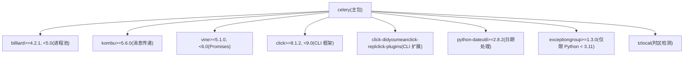
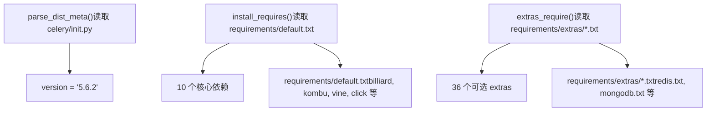

# 安装与设置

相关源文件

-   [docs/includes/installation.txt](https://github.com/celery/celery/blob/4d068b56/docs/includes/installation.txt)
-   [requirements/default.txt](https://github.com/celery/celery/blob/4d068b56/requirements/default.txt)
-   [setup.cfg](https://github.com/celery/celery/blob/4d068b56/setup.cfg)
-   [setup.py](https://github.com/celery/celery/blob/4d068b56/setup.py)

本文档将指导您安装 Celery，了解其依赖项，并为您特定的使用场景选择合适的可选 extras。它涵盖了基础的 pip 安装、核心依赖项、广泛的 extras 系统以及替代安装方法。

有关安装后配置 Celery 应用的信息，请参阅[应用初始化与配置](/celery/celery/2.1-application-initialization-and-configuration)。有关在生产环境中部署和运行工作者（workers）的信息，请参阅[工作者配置与控制](/celery/celery/5.4-worker-configuration-and-control)。

## Python 版本要求

Celery 5.6.x 要求 Python 3.9 或更高版本。官方支持以下 Python 实现：

| Python 实现 | 最低版本 | 备注 |
| --- | --- | --- |
| CPython | 3.9 | v5.6.0b2 中已停止对 Python 3.8 的支持 |
| CPython | 3.10, 3.11, 3.12, 3.13 | 完全支持 |
| PyPy | 3.9+ (v7.3.12+) | 替代实现 |

**重要提示**：Celery 5.5.x 是支持 Python 3.8（2024 年 10 月 EOL）的最后一个版本。Python 3.9 将于 2025 年 10 月达到生命周期终点（EOL）。

来源：[README.rst123-139](https://github.com/celery/celery/blob/4d068b56/README.rst#L123-L139) [setup.py150](https://github.com/celery/celery/blob/4d068b56/setup.py#L150-L150) [celery/\_\_init\_\_.py18-20](https://github.com/celery/celery/blob/4d068b56/celery/__init__.py#L18-L20)

## 核心依赖

Celery 拥有一组最小化的必需依赖项，这些依赖项会随基础包自动安装：


**依赖角色**：

-   **billiard**：`multiprocessing` 的分支，提供 prefork 工作者池实现
-   **kombu**：抽象了消息传输（AMQP、Redis、SQS 等）的消息库
-   **vine**：用于回调和错误处理的 Promises/futures 实现
-   **click**：驱动 `celery` 命令的命令行界面框架
-   **python-dateutil**：用于调度的日期/时间解析与操作
-   **tzlocal**：用于调度器的自动时区检测
-   **exceptiongroup**：为旧版本 Python 提供的 Python 3.11 异常组（exception groups）后向移植

来源：[requirements/default.txt1-10](https://github.com/celery/celery/blob/4d068b56/requirements/default.txt#L1-L10) [setup.py117-119](https://github.com/celery/celery/blob/4d068b56/setup.py#L117-L119)

## 基础安装

### 从 PyPI 安装

最简单的安装方法是使用 `pip`：

```
$ pip install -U Celery
```
这将仅安装带有核心依赖项的 Celery。您需要根据您选择的消息代理（message broker）和结果后端（result backend）来安装额外的包。

### 验证安装

安装完成后，验证 Celery 是否可用：

```
$ celery --version
```
这应该显示版本信息，如 `5.6.2 (recovery)`。

来源：[README.rst305-310](https://github.com/celery/celery/blob/4d068b56/README.rst#L305-L310)

## 可选 Extras 系统

Celery 提供了 36 个可选的 "extras"（也称为 "bundles"），它们为特定功能安装额外的依赖项。extras 系统在 [setup.py12-46](https://github.com/celery/celery/blob/4d068b56/setup.py#L12-L46) 中定义，并可以通过 `pip` 的括号语法访问。

### 安装语法

通过在括号中指定 extras 来安装它们：

```
# 单个 extra
$ pip install "celery[redis]"

# 多个 extras（逗号分隔）
$ pip install "celery[redis,auth,msgpack]"
```
**注意**：在包规范周围使用引号，以防止 shell 扩展括号。

### Extras 完整参考


### Extras 分类

#### 序列化器 (Serializers)

| Extra | 目的 | 使用场景 |
| --- | --- | --- |
| `celery[auth]` | Auth 安全序列化器 | 加密消息签名 |
| `celery[msgpack]` | MessagePack 序列化 | 紧凑的二进制格式 |
| `celery[yaml]` | YAML 序列化 | 人类可读的配置 |

#### 并发模型 (Concurrency Models)

| Extra | 目的 | 使用场景 |
| --- | --- | --- |
| `celery[eventlet]` | Eventlet 池 | 网络 I/O 密集型任务 |
| `celery[gevent]` | Gevent 池 | 协作式多任务 |

#### 消息代理与传输 (Message Brokers & Transports)

| Extra | 目的 | 安装的依赖 |
| --- | --- | --- |
| `celery[amqp]` | 带有 librabbitmq 的 RabbitMQ | `librabbitmq` |
| `celery[redis]` | Redis 代理/后端 | `redis>=4.5.2` |
| `celery[sqs]` | Amazon SQS | `boto3`, `pycurl` |
| `celery[gcpubsub]` | Google Cloud Pub/Sub | `google-cloud-pubsub` |
| `celery[zookeeper]` | Apache ZooKeeper | `kazoo` |

#### 结果后端 - 缓存 (Result Backends - Cache)

| Extra | 目的 | 实现 |
| --- | --- | --- |
| `celery[memcache]` | Memcached 后端 | `pylibmc` (C 扩展) |
| `celery[pymemcache]` | Memcached 后端 | 纯 Python |

#### 结果后端 - 数据库 (Result Backends - Database)

| Extra | 目的 | 依赖 |
| --- | --- | --- |
| `celery[sqlalchemy]` | SQL 数据库后端 | `sqlalchemy` (1.4.x 或 2.0.x) |
| `celery[django]` | Django ORM 后端 | 最低 Django 版本 |

#### 结果后端 - NoSQL (Result Backends - NoSQL)

| Extra | 目的 | 依赖 |
| --- | --- | --- |
| `celery[mongodb]` | MongoDB 后端 | `pymongo>=4.0.2` |
| `celery[cassandra]` | Apache Cassandra/Astra | DataStax 驱动 |
| `celery[elasticsearch]` | Elasticsearch 后端 | `elasticsearch` 客户端 |
| `celery[couchbase]` | Couchbase 后端 | Couchbase SDK |
| `celery[couchdb]` | CouchDB 后端 | CouchDB 客户端 |
| `celery[arangodb]` | ArangoDB 后端 | `pyArango` |
| `celery[riak]` | Riak 后端 | Riak 客户端 |
| `celery[dynamodb]` | AWS DynamoDB | `boto3` |
| `celery[cosmosdbsql]` | Azure Cosmos DB | `pydocumentdb` |
| `celery[consul]` | Consul KV 存储 | `python-consul2` |

#### 结果后端 - 云存储 (Result Backends - Cloud Storage)

| Extra | 目的 | 依赖 |
| --- | --- | --- |
| `celery[s3]` | Amazon S3 后端 | `boto3` |
| `celery[gcs]` | Google Cloud Storage | `google-cloud-storage` |
| `celery[azureblockblob]` | Azure Blob 存储 | `azure-storage` |

#### 附加功能 (Additional Features)

| Extra | 目的 | 使用场景 |
| --- | --- | --- |
| `celery[tblib]` | 远程回溯 | `task_remote_tracebacks` 特性 |
| `celery[solar]` | 太阳能调度 | 日出/日落调度 |
| `celery[brotli]` | Brotli 压缩 | 消息压缩 |
| `celery[zstd]` | Zstandard 压缩 | 高性能压缩 |
| `celery[pydantic]` | Pydantic 模型支持 | 类型校验 |
| `celery[pytest]` | 测试框架 | `pytest-celery` 固件 (fixtures) |

来源：[README.rst331-425](https://github.com/celery/celery/blob/4d068b56/README.rst#L331-L425) [setup.py12-46](https://github.com/celery/celery/blob/4d068b56/setup.py#L12-L46) [setup.py122-124](https://github.com/celery/celery/blob/4d068b56/setup.py#L122-L124)

## Setup.py 结构

[setup.py](https://github.com/celery/celery/blob/4d068b56/setup.py) 中的包配置展示了依赖项是如何组织的：


位于 [setup.py12-46](https://github.com/celery/celery/blob/4d068b56/setup.py#L12-L46) 的 `EXTENSIONS` 元组定义了所有可用的 extras：

```
EXTENSIONS = (
    'arangodb', 'auth', 'azureblockblob', 'brotli', 'cassandra',
    'consul', 'cosmosdbsql', 'couchbase', 'couchdb', 'django',
    'dynamodb', 'elasticsearch', 'eventlet', 'gevent', 'gcs',
    'librabbitmq', 'memcache', 'mongodb', 'msgpack', 'pymemcache',
    'pydantic', 'pyro', 'pytest', 'redis', 's3', 'slmq', 'solar',
    'sqlalchemy', 'sqs', 'tblib', 'yaml', 'zookeeper', 'zstd'
)
```
每个 extra 都映射到 `requirements/extras/` 中的一个文件（例如 `redis.txt`、`mongodb.txt`）。

来源：[setup.py12-46](https://github.com/celery/celery/blob/4d068b56/setup.py#L12-L46) [setup.py63-76](https://github.com/celery/celery/blob/4d068b56/setup.py#L63-L76) [setup.py112-124](https://github.com/celery/celery/blob/4d068b56/setup.py#L112-L124)

## 从源码安装

对于开发或使用最新的未发布特性，请从 GitHub 仓库安装。

### 下载源码分发包

从 PyPI 下载最新版本：

```
$ wget https://pypi.org/project/celery/#files
$ tar xvfz celery-5.6.2.tar.gz
$ cd celery-5.6.2
$ python setup.py build
$ python setup.py install  # 可能需要 sudo
```
**注意**：使用 virtualenv 以避免需要提升权限。

### 安装开发版本

开发版本需要核心依赖项的匹配开发版本：

```
# 安装 Celery 开发版本
$ pip install https://github.com/celery/celery/zipball/main#egg=celery

# 安装匹配的核心依赖版本
$ pip install https://github.com/celery/billiard/zipball/main#egg=billiard
$ pip install https://github.com/celery/py-amqp/zipball/main#egg=amqp
$ pip install https://github.com/celery/kombu/zipball/main#egg=kombu
$ pip install https://github.com/celery/vine/zipball/main#egg=vine
```
**警告**：开发版本不稳定，不推荐用于生产环境。

### 使用 Git 克隆

对于为 Celery 贡献代码：

```
$ git clone https://github.com/celery/celery.git
$ cd celery
$ pip install -e .  # 可编辑安装
```
有关运行测试套件的信息，请参阅[测试基础设施](/celery/celery/10.1-testing-infrastructure)。

来源：[README.rst430-476](https://github.com/celery/celery/blob/4d068b56/README.rst#L430-L476)

## 平台特定考虑因素

### Microsoft Windows

**官方支持状态**：Celery 在 Windows 上不受官方支持，尽管它应该可以工作。维护者资金有限，无法提供 Windows 支持。请不要开启 Windows 特定的 issue。

### 消息代理要求

Celery 需要消息代理（message broker）才能运行。安装后，您必须：

1.  选择一个代理：RabbitMQ（推荐用于生产环境）、Redis、Amazon SQS 或其他
2.  安装并配置代理
3.  安装相应的 Celery extra（例如 `celery[redis]`）

最常见的代理选择是：

-   **RabbitMQ**：功能完备、稳健，推荐用于生产环境
-   **Redis**：功能完备、设置更简单，适用于开发和生产环境
-   **Amazon SQS**：实验性，适用于 AWS 环境
-   **SQLite**：仅用于本地开发（不推荐用于生产环境）

来源：[README.rst142-151](https://github.com/celery/celery/blob/4d068b56/README.rst#L142-L151) [docs/includes/introduction.txt59-62](https://github.com/celery/celery/blob/4d068b56/docs/includes/introduction.txt#L59-L62)

## 版本信息

当前版本在 [celery/\_\_init\_\_.py18-20](https://github.com/celery/celery/blob/4d068b56/celery/__init__.py#L18-L20) 中定义：

```
SERIES = 'recovery'
__version__ = '5.6.2'
```
版本遵循语义化版本控制（semantic versioning），格式为 `MAJOR.MINOR.MICRO`。发布代号基于 Jon Hopkins 的歌曲。

版本信息也维护在：

-   [.bumpversion.cfg2](https://github.com/celery/celery/blob/4d068b56/.bumpversion.cfg#L2-L2) - `current_version = 5.6.2`
-   [docs/includes/introduction.txt1](https://github.com/celery/celery/blob/4d068b56/docs/includes/introduction.txt#L1-L1) - 文档版本
-   [README.rst5](https://github.com/celery/celery/blob/4d068b56/README.rst#L5-L5) - README 版本

来源：[celery/\_\_init\_\_.py18-48](https://github.com/celery/celery/blob/4d068b56/celery/__init__.py#L18-L48) [.bumpversion.cfg1-14](https://github.com/celery/celery/blob/4d068b56/.bumpversion.cfg#L1-L14)

## 后续步骤

安装完成后：

1.  **配置应用**：请参阅[应用初始化与配置](/celery/celery/2.1-application-initialization-and-configuration)来创建并配置 Celery 应用
2.  **定义任务**：请参阅[任务定义与调用](/celery/celery/3.1-task-definition-and-invocation)来编写您的第一个任务
3.  **选择代理**：请参阅[消息代理与路由](/celery/celery/2.3-message-brokers-and-routing)来选择并配置代理
4.  **启动工作者**：请参阅[工作者配置与控制](/celery/celery/5.4-worker-configuration-and-control)来运行工作者
5.  **部署到生产环境**：请参阅[CLI 架构](/celery/celery/9.1-cli-architecture)获取生产环境部署模式

来源：[README.rst153-173](https://github.com/celery/celery/blob/4d068b56/README.rst#L153-L173) [docs/index.rst26-32](https://github.com/celery/celery/blob/4d068b56/docs/index.rst#L26-L32)
