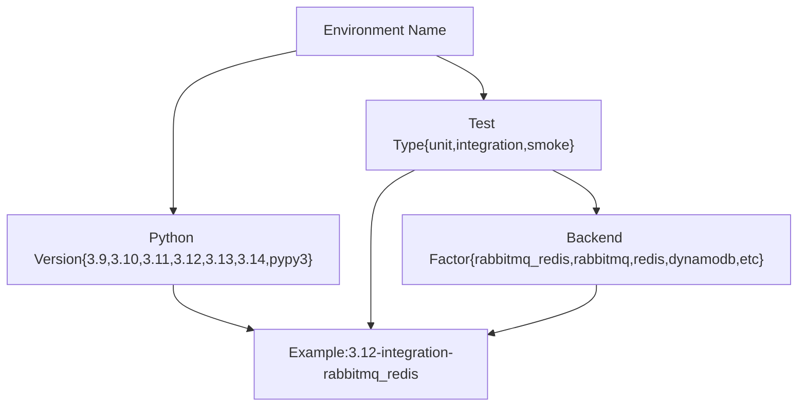
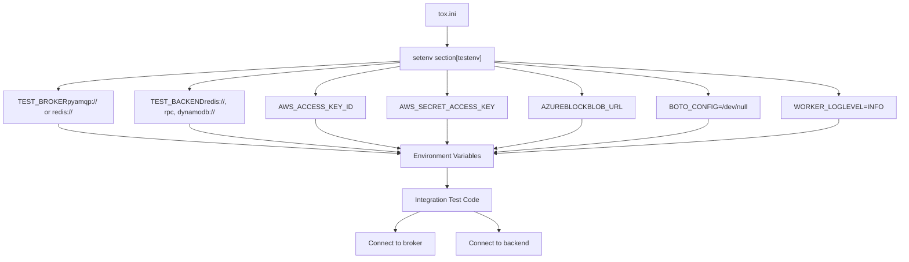
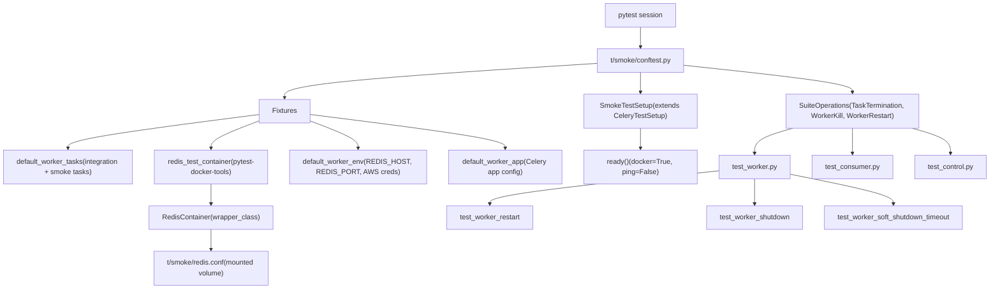
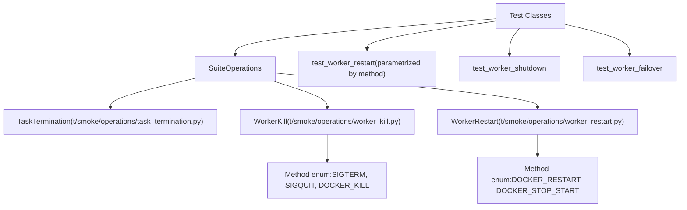
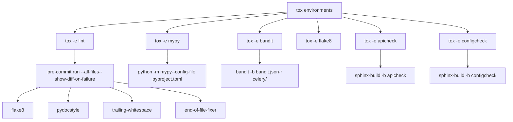
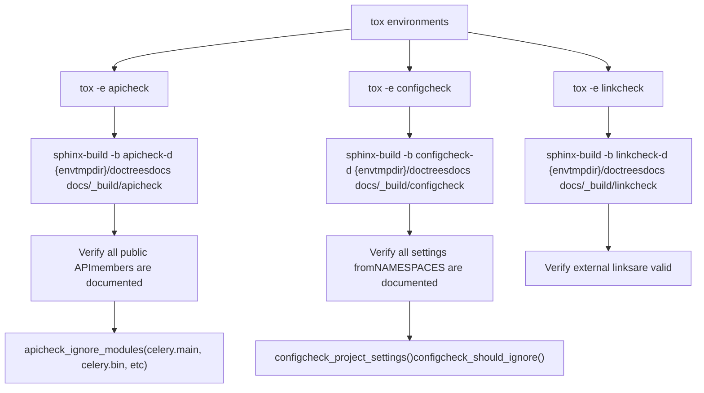
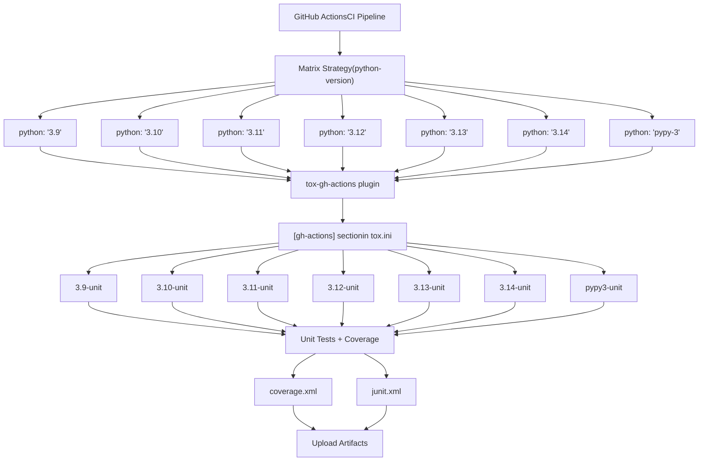
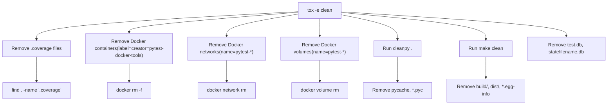

# 开发与测试 (Development and Testing)

相关源文件

-   [Makefile](https://github.com/celery/celery/blob/4d068b56/Makefile)
-   [celery/app/backends.py](https://github.com/celery/celery/blob/4d068b56/celery/app/backends.py)
-   [docs/Makefile](https://github.com/celery/celery/blob/4d068b56/docs/Makefile)
-   [docs/_ext/celerydocs.py](https://github.com/celery/celery/blob/4d068b56/docs/_ext/celerydocs.py)
-   [docs/changelog_formatter.py](https://github.com/celery/celery/blob/4d068b56/docs/changelog_formatter.py)
-   [requirements/docs.txt](https://github.com/celery/celery/blob/4d068b56/requirements/docs.txt)
-   [requirements/extras/pytest.txt](https://github.com/celery/celery/blob/4d068b56/requirements/extras/pytest.txt)
-   [requirements/pkgutils.txt](https://github.com/celery/celery/blob/4d068b56/requirements/pkgutils.txt)
-   [requirements/test-integration.txt](https://github.com/celery/celery/blob/4d068b56/requirements/test-integration.txt)
-   [requirements/test.txt](https://github.com/celery/celery/blob/4d068b56/requirements/test.txt)
-   [t/smoke/conftest.py](https://github.com/celery/celery/blob/4d068b56/t/smoke/conftest.py)
-   [t/smoke/operations/__init__.py](https://github.com/celery/celery/blob/4d068b56/t/smoke/operations/__init__.py)
-   [t/smoke/redis.conf](https://github.com/celery/celery/blob/4d068b56/t/smoke/redis.conf)
-   [t/smoke/tasks.py](https://github.com/celery/celery/blob/4d068b56/t/smoke/tasks.py)
-   [t/smoke/tests/__init__.py](https://github.com/celery/celery/blob/4d068b56/t/smoke/tests/__init__.py)
-   [t/smoke/tests/failover/__init__.py](https://github.com/celery/celery/blob/4d068b56/t/smoke/tests/failover/__init__.py)
-   [t/smoke/tests/failover/test_broker_failover.py](https://github.com/celery/celery/blob/4d068b56/t/smoke/tests/failover/test_broker_failover.py)
-   [t/smoke/tests/failover/test_worker_failover.py](https://github.com/celery/celery/blob/4d068b56/t/smoke/tests/failover/test_worker_failover.py)
-   [t/smoke/tests/test_consumer.py](https://github.com/celery/celery/blob/4d068b56/t/smoke/tests/test_consumer.py)
-   [t/smoke/tests/test_control.py](https://github.com/celery/celery/blob/4d068b56/t/smoke/tests/test_control.py)
-   [t/smoke/tests/test_worker.py](https://github.com/celery/celery/blob/4d068b56/t/smoke/tests/test_worker.py)
-   [t/smoke/workers/docker/dev](https://github.com/celery/celery/blob/4d068b56/t/smoke/workers/docker/dev)
-   [t/smoke/workers/docker/pypi](https://github.com/celery/celery/blob/4d068b56/t/smoke/workers/docker/pypi)
-   [tox.ini](https://github.com/celery/celery/blob/4d068b56/tox.ini)

本文档涵盖了 Celery 代码库的开发基础设施、测试框架和质量保证系统。它解释了测试是如何组织、执行以及如何集成到 CI/CD 流水线中的，同时还介绍了文档构建系统和代码质量工具。

有关命令行界面和工作者管理的信息，请参阅[命令行界面 (CLI)](/celery/celery/9-command-line-interface)。有关打包与分发的信息，请参阅[打包与分发](/celery/celery/11-packaging-and-distribution)。

## 测试基础设施概述

Celery 维护着一个全面的测试基础设施，包括单元测试、集成测试、冒烟测试（smoke tests）以及各种质量检查。测试系统通过 `tox` 进行编排，管理着跨不同 Python 版本和后端组合的多个测试环境。

### 测试目录结构

测试目录 `t/` 组织为三个主要的测试套件：

```mermaid
flowchart TD
    Root["t/"]
    Unit["t/unit/"]
    Integration["t/integration/"]
    Smoke["t/smoke/"]
    UnitApp["t/unit/app/"]
    UnitBin["t/unit/bin/"]
    UnitWorker["t/unit/worker/"]
    UnitBackends["t/unit/backends/"]
    UnitTasks["t/unit/tasks/"]
    UnitCanvas["t/unit/canvas.py"]
    IntTasks["t/integration/tasks.py"]
    IntTests["t/integration/test_*.py"]
    SmokeTests["t/smoke/tests/"]
    SmokeTasks["t/smoke/tasks.py"]
    SmokeWorkers["t/smoke/workers/"]
    SmokeOps["t/smoke/operations/"]
    SmokeConf["t/smoke/conftest.py"]
    TestWorker["test_worker.py"]
    TestConsumer["test_consumer.py"]
    TestControl["test_control.py"]
    TestFailover["failover/test_worker_failover.py"]
    DevWorker["workers/dev.py"]
    LatestWorker["workers/latest.py"]
    AltWorker["workers/alt.py"]
    DockerDev["workers/docker/dev"]
    DockerPyPI["workers/docker/pypi"]

    Root --> Unit
    Root --> Integration
    Root --> Smoke
    Unit --> UnitApp
    Unit --> UnitBin
    Unit --> UnitWorker
    Unit --> UnitBackends
    Unit --> UnitTasks
    Unit --> UnitCanvas
    Integration --> IntTasks
    Integration --> IntTests
    Smoke --> SmokeTests
    Smoke --> SmokeTasks
    Smoke --> SmokeWorkers
    Smoke --> SmokeOps
    Smoke --> SmokeConf
    SmokeTests --> TestWorker
    SmokeTests --> TestConsumer
    SmokeTests --> TestControl
    SmokeTests --> TestFailover
    SmokeWorkers --> DevWorker
    SmokeWorkers --> LatestWorker
    SmokeWorkers --> AltWorker
    SmokeWorkers --> DockerDev
    SmokeWorkers --> DockerPyPI
```


**来源：** [tox.ini1-137](https://github.com/celery/celery/blob/4d068b56/tox.ini#L1-L137) [t/smoke/conftest.py1-156](https://github.com/celery/celery/blob/4d068b56/t/smoke/conftest.py#L1-L156) [t/smoke/tests/test_worker.py1-503](https://github.com/celery/celery/blob/4d068b56/t/smoke/tests/test_worker.py#L1-L503)

测试目录分为三大类：

| 测试类型 | 目录 | 目的 | 执行策略 | 框架 |
| --- | --- | --- | --- | --- |
| **单元测试** | `t/unit/` | 快速、隔离的使用 Mock 依赖的测试 | 使用 pytest 和 coverage 并行执行 | pytest + unittest.mock |
| **集成测试** | `t/integration/` | 针对真实代理和后端的测试 | 使用后端特定的配置顺序执行 | 使用真实基础设施的 pytest |
| **冒烟测试** | `t/smoke/` | Docker 容器中的端到端验证 | 并行执行，对不稳定测试进行重试 | pytest-celery 框架 |

**来源：** [tox.ini46-51](https://github.com/celery/celery/blob/4d068b56/tox.ini#L46-L51) [requirements/test.txt1-20](https://github.com/celery/celery/blob/4d068b56/requirements/test.txt#L1-L20)

## Tox 环境矩阵

`tox.ini` 文件定义了一个全面的测试矩阵，涵盖了多个 Python 版本和后端组合。测试环境使用基于因子的命名方式进行结构化。

### 环境命名约定


**来源：** [tox.ini4-7](https://github.com/celery/celery/blob/4d068b56/tox.ini#L4-L7)

### 支持的 Python 版本

测试矩阵包含：

-   **CPython**: 3.9, 3.10, 3.11, 3.12, 3.13, 3.14
-   **PyPy**: pypy3

每个 Python 版本都会针对以下内容进行测试：

-   单元测试（始终执行）
-   集成测试（使用各种后端组合）
-   冒烟测试（始终执行）

**来源：** [tox.ini89-96](https://github.com/celery/celery/blob/4d068b56/tox.ini#L89-L96)

### 集成测试后端组合

集成测试矩阵涵盖了以下后端配置：

| 环境因子 | 代理 (Broker) | 后端 (Backend) | 用例 |
| --- | --- | --- | --- |
| `rabbitmq_redis` | RabbitMQ (`pyamqp://`) | Redis | 类似生产环境的配置 |
| `rabbitmq` | RabbitMQ | RPC 后端 | 纯 AMQP 栈 |
| `redis` | Redis | Redis | 全 Redis 栈 |
| `dynamodb` | Redis | DynamoDB | AWS DynamoDB 后端 |
| `azureblockblob` | Redis | Azure Blob 存储 | Azure 云后端 |
| `cache` | Redis | 缓存 (pylibmc) | Memcached 后端 |
| `cassandra` | Redis | Cassandra | NoSQL 后端 |
| `elasticsearch` | Redis | Elasticsearch | 基于搜索的后端 |
| `docker` | RabbitMQ（容器内） | Redis（容器内） | 容器化测试 |

**来源：** [tox.ini60-88](https://github.com/celery/celery/blob/4d068b56/tox.ini#L60-L88)

## 测试执行流

下图展示了 tox 如何通过 pytest-celery 编排测试执行：

图表：通过 Tox 的测试执行流

> **[Mermaid sequence]**
> *(图表结构无法解析)*

**来源：** [tox.ini46-51](https://github.com/celery/celery/blob/4d068b56/tox.ini#L46-L51) [tox.ini99](https://github.com/celery/celery/blob/4d068b56/tox.ini#L99-L99) [t/smoke/conftest.py20-32](https://github.com/celery/celery/blob/4d068b56/t/smoke/conftest.py#L20-L32)

### 单元测试执行

单元测试在执行时会进行代码覆盖率跟踪：

```bash
coverage run --source=celery -m pytest -vv --maxfail=10 --capture=no -v \
  --junitxml=junit.xml -o junit_family=legacy
```
关键参数：

-   `--source=celery`：跟踪 celery 包的覆盖率。
-   `--maxfail=10`：在发生 10 次失败后停止，以实现快速失败。
-   `--capture=no`：立即显示输出（对调试很有用）。
-   `--junitxml=junit.xml`：为 CI 系统生成 XML 报告。

测试执行后，生成覆盖率报告：

```bash
coverage xml    # 用于 CI 集成
coverage report # 控制台摘要
```
**来源：** [tox.ini47-49](https://github.com/celery/celery/blob/4d068b56/tox.ini#L47-L49)

### 集成测试执行

集成测试使用环境变量指定代理和后端 URL：

```bash
pytest -xsvv t/integration
```
-xsvv` 标志的含义：

-   `-x`：在第一次失败时停止。
-   `-s`：不捕获输出。
-   `-vv`：非常详细的输出。

**来源：** [tox.ini50](https://github.com/celery/celery/blob/4d068b56/tox.ini#L50-L50)

### 冒烟测试执行

冒烟测试使用 pytest-xdist 进行并行执行，并使用 pytest-rerunfailures 处理不稳定的测试：

```bash
pytest -xsvv t/smoke --dist=loadscope --reruns 5 --reruns-delay 10
```
-   `--dist=loadscope`：按模块分发测试（保持模块内的测试顺序）。
-   `--reruns 5`：失败的测试最多重试 5 次。
-   `--reruns-delay 10`：重试之间等待 10 秒。

**来源：** [tox.ini51](https://github.com/celery/celery/blob/4d068b56/tox.ini#L51-L51)

## 集成测试配置

集成测试需要真实的代理和后端实例。测试配置通过 `tox.ini` 中 `[testenv]` 部分设置的环境变量进行控制。

### 环境变量系统

图表：集成测试环境变量


**来源：** [tox.ini52-88](https://github.com/celery/celery/blob/4d068b56/tox.ini#L52-L88)

### 后端特定配置示例

`tox.ini` 中的 `setenv` 部分为每个集成测试因子定义了后端特定的环境变量：

**RabbitMQ + Redis:**

```ini
rabbitmq_redis: TEST_BROKER=pyamqp://
rabbitmq_redis: TEST_BACKEND=redis://
```
**DynamoDB (带有 AWS 凭证):**

```ini
dynamodb: TEST_BROKER=redis://
dynamodb: TEST_BACKEND=dynamodb://@localhost:8000
dynamodb: AWS_ACCESS_KEY_ID=test_aws_key_id
dynamodb: AWS_SECRET_ACCESS_KEY=test_aws_secret_key
```
**Azure Blob 存储:**

```ini
azureblockblob: TEST_BROKER=redis://
azureblockblob: TEST_BACKEND=azureblockblob://DefaultEndpointsProtocol=http;AccountName=devstoreaccount1;...
```
**基于 Docker (容器化服务):**

```ini
docker: TEST_BROKER=pyamqp://rabbit:5672
docker: TEST_BACKEND=redis://redis
```
**来源：** [tox.ini60-88](https://github.com/celery/celery/blob/4d068b56/tox.ini#L60-L88)

### 标准环境变量

所有测试环境都设置了以下内容：

| 变量 | 值 | 目的 |
| --- | --- | --- |
| `PIP_EXTRA_INDEX_URL` | `https://celery.github.io/celery-wheelhouse/repo/simple/` | 访问预构建的 wheel 包 |
| `BOTO_CONFIG` | `/dev/null` | 防止 AWS SDK 读取配置 |
| `WORKER_LOGLEVEL` | `INFO` | 工作者日志详细程度 |
| `PYTHONIOENCODING` | `UTF-8` | 强制使用 UTF-8 编码 |
| `PYTHONUNBUFFERED` | `1` | 禁用输出缓冲 |
| `PYTHONDONTWRITEBYTECODE` | `1` | 跳过 .pyc 文件生成 |

**来源：** [tox.ini52-58](https://github.com/celery/celery/blob/4d068b56/tox.ini#L52-L58)

## 冒烟测试基础设施

冒烟测试使用 `pytest-celery` 框架，针对运行在 Docker 容器中的真实 Celery 工作者执行端到端测试。这提供了现实的集成测试，而无需手动搭建基础设施。

### pytest-celery 框架架构

图表：pytest-celery 冒烟测试架构


**来源：** [t/smoke/conftest.py1-156](https://github.com/celery/celery/blob/4d068b56/t/smoke/conftest.py#L1-L156) [requirements/test.txt1-3](https://github.com/celery/celery/blob/4d068b56/requirements/test.txt#L1-L3) [requirements/extras/pytest.txt1](https://github.com/celery/celery/blob/4d068b56/requirements/extras/pytest.txt#L1-L1)

### Docker 工作者镜像

冒烟测试使用根据自定义 Dockerfile 构建的 Docker 工作者，这些 Dockerfile 以不同的配置安装 Celery：

| 工作者类型 | Dockerfile | 目的 |
| --- | --- | --- |
| **Dev Worker** | `t/smoke/workers/docker/dev` | 从源代码以 `-e` 可编辑模式安装 Celery |
| **PyPI Worker** | `t/smoke/workers/docker/pypi` | 从 PyPI 安装特定的 Celery 版本 |

**Dev Worker 配置：**

-   基础镜像：`python:3.13-bookworm`
-   用户：`test_user`（非 root）
-   安装命令：`pip install -e /celery[redis,pymemcache,pydantic,sqs]`
-   启动命令：`celery -A app worker --loglevel=$LOG_LEVEL -n $WORKER_NAME@%h -Q $WORKER_QUEUE`

**来源：** [t/smoke/workers/docker/dev1-52](https://github.com/celery/celery/blob/4d068b56/t/smoke/workers/docker/dev#L1-L52) [t/smoke/workers/docker/pypi1-52](https://github.com/celery/celery/blob/4d068b56/t/smoke/workers/docker/pypi#L1-L52)

### 冒烟测试操作

`SuiteOperations` 类提供了可重用的测试操作：

图表：冒烟测试操作类层次结构


**来源：** [t/smoke/conftest.py35-49](https://github.com/celery/celery/blob/4d068b56/t/smoke/conftest.py#L35-L49) [t/smoke/tests/test_worker.py9](https://github.com/celery/celery/blob/4d068b56/t/smoke/tests/test_worker.py#L9-L9)

### 工作者生命周期测试

冒烟测试验证了工作者在不同停机场景下的行为：

**温和关闭 (SIGTERM):**

-   工作者在退出前完成正在运行的任务。
-   测试使用 `acks_late=True` 验证任务完成情况。
-   日志验证：`"worker: Warm shutdown (MainProcess)"`。

**冷关闭 (SIGQUIT):**

-   工作者立即终止，不完成任务。
-   测试验证任务未完成。
-   日志验证：`"worker: Cold shutdown (MainProcess)"`。

**软关闭 (可配置超时):**

-   工作者等待最多 `worker_soft_shutdown_timeout` 秒。
-   完成运行时间短的任务，如果超时则终止。
-   测试验证超时行为和任务完成情况。

**来源：** [t/smoke/tests/test_worker.py66-236](https://github.com/celery/celery/blob/4d068b56/t/smoke/tests/test_worker.py#L66-L236)

### 消费者与预取测试

冒烟测试验证消费者行为，包括预取计数（prefetch count）管理：

**预取计数削减：**

-   测试 `worker_enable_prefetch_count_reduction=True`。
-   验证在代理重启期间预取计数的动态调整。
-   验证在恢复后恢复到最大预取计数。

**连接丢失处理：**

-   测试 `worker_cancel_long_running_tasks_on_connection_loss=True`。
-   验证在代理重启时的任务取消和重新入队。
-   使用 `acks_late=True` 测试任务恢复。

**来源：** [t/smoke/tests/test_consumer.py1-148](https://github.com/celery/celery/blob/4d068b56/t/smoke/tests/test_consumer.py#L1-L148)

### 故障转移测试 (Failover Tests)

故障转移测试验证多工作者场景：

```python
@pytest.fixture
def celery_worker_cluster(
    celery_worker: CeleryTestWorker,
    celery_alt_dev_worker: CeleryTestWorker,
) -> CeleryWorkerCluster:
    cluster = CeleryWorkerCluster(celery_worker, celery_alt_dev_worker)
    yield cluster
    cluster.teardown()
```
测试验证：

-   第一个工作者被杀死时的任务执行情况。
-   当所有工作者都被杀死并重启后的恢复情况。
-   跨多个工作者的任务路由。

**来源：** [t/smoke/tests/failover/test_worker_failover.py11-56](https://github.com/celery/celery/blob/4d068b56/t/smoke/tests/failover/test_worker_failover.py#L11-L56)

### 测试用 Redis 配置

冒烟测试使用挂载为卷的自定义 Redis 配置：

```conf
bind 0.0.0.0
protected-mode no
save ""
appendonly no
maxmemory-policy noeviction
loglevel verbose
```
此配置：

-   允许来自任何 IP 的连接（用于 Docker 网络）。
-   禁用持久化以加快测试速度。
-   启用详细日志以供调试。

**来源：** [t/smoke/redis.conf1-7](https://github.com/celery/celery/blob/4d068b56/t/smoke/redis.conf#L1-L7) [t/smoke/conftest.py66-84](https://github.com/celery/celery/blob/4d068b56/t/smoke/conftest.py#L66-L84)

## 代码质量工具

Celery 使用多种静态分析工具来维护代码质量。这些工具集成在 tox 环境中。

### 质量工具集成

图表：Tox 中的代码质量工具


**来源：** [tox.ini9-125](https://github.com/celery/celery/blob/4d068b56/tox.ini#L9-L125)

### 静态分析工具配置

| 工具 | 环境 | 命令 | 配置文件 | 目的 |
| --- | --- | --- | --- | --- |
| **flake8** | `tox -e flake8` | `flake8 celery t` | `.flake8` 或 `setup.cfg` | PEP 8 风格检查 |
| **mypy** | `tox -e mypy` | `python -m mypy --config-file pyproject.toml` | `pyproject.toml` | 静态类型检查 |
| **bandit** | `tox -e bandit` | `bandit -b bandit.json -r celery/` | `bandit.json` | 安全问题扫描 |
| **pre-commit** | `tox -e lint` | `pre-commit run --all-files` | `.pre-commit-config.yaml` | 多工具 Lint 检查 |

**来源：** [tox.ini9-124](https://github.com/celery/celery/blob/4d068b56/tox.ini#L9-L124)

### Pre-commit 钩子集成

`lint` tox 环境跨所有文件运行 pre-commit 钩子：

```bash
pre-commit run --all-files --show-diff-on-failure
```
Pre-commit 钩子包括：

-   `flake8` - 风格检查。
-   `pydocstyle` - Docstring 规范。
-   `trailing-whitespace` - 清理行尾空格。
-   `end-of-file-fixer` - 文件末尾换行。
-   `check-yaml` - YAML 语法验证。
-   `check-added-large-files` - 防止提交大文件。

**来源：** [tox.ini122-124](https://github.com/celery/celery/blob/4d068b56/tox.ini#L122-L124) [requirements/test.txt12](https://github.com/celery/celery/blob/4d068b56/requirements/test.txt#L12-L12)

### 使用 Mypy 进行类型检查

Mypy 按照 `pyproject.toml` 中的配置执行静态类型检查。mypy 环境使用 Python 3.13：

```bash
python -m mypy --config-file pyproject.toml
```
类型检查仅在 CPython 实现上运行（不包括 PyPy）：

```ini
[testenv:mypy]
commands = python -m mypy --config-file pyproject.toml
```
**来源：** [tox.ini101-102](https://github.com/celery/celery/blob/4d068b56/tox.ini#L101-L102) [requirements/test.txt11](https://github.com/celery/celery/blob/4d068b56/requirements/test.txt#L11-L11)

### 使用 Bandit 进行安全扫描

Bandit 扫描 `celery/` 包以查找常见的安全问题：

```bash
bandit -b bandit.json -r celery/
```
`bandit.json` 配置文件指定了运行哪些测试以及排除哪些文件。

**来源：** [tox.ini118-120](https://github.com/celery/celery/blob/4d068b56/tox.ini#L118-L120)

## 文档验证

Celery 使用 Sphinx 自定义构建器来验证 API 和配置文档的覆盖率。

### 文档检查构建器

图表：Sphinx 文档验证


**来源：** [tox.ini104-116](https://github.com/celery/celery/blob/4d068b56/tox.ini#L104-L116)

### API 覆盖率验证

`apicheck` 构建器验证所有公共 API 成员是否都已记录在档：

```bash
tox -e apicheck
```
这将运行：

```bash
sphinx-build -b apicheck -d {envtmpdir}/doctrees docs docs/_build/apicheck
```
构建器检查除忽略列表（测试模块、内部修复等）之外的所有模块。

**来源：** [tox.ini104-108](https://github.com/celery/celery/blob/4d068b56/tox.ini#L104-L108)

### 配置覆盖率验证

`configcheck` 构建器确保所有配置设置都已记录在档：

```bash
tox -e configcheck
```
这将运行：

```bash
sphinx-build -b configcheck -d {envtmpdir}/doctrees docs docs/_build/configcheck
```
构建器验证 `celery.app.defaults.NAMESPACES` 中定义的所有设置是否都已记录。

**来源：** [tox.ini110-112](https://github.com/celery/celery/blob/4d068b56/tox.ini#L110-L112)

### 链接验证

`linkcheck` 构建器检查文档中的外部链接：

```bash
tox -e linkcheck
```
这将运行：

```bash
sphinx-build -b linkcheck -d {envtmpdir}/doctrees docs docs/_build/linkcheck
```
**来源：** [tox.ini114-116](https://github.com/celery/celery/blob/4d068b56/tox.ini#L114-L116)

## CI/CD 集成

Celery 通过 `tox-gh-actions` 插件与 GitHub Actions 集成，该插件会根据 CI 矩阵中的 Python 版本自动选择适当的 tox 环境。

### GitHub Actions 映射

图表：带有 tox-gh-actions 的 CI/CD 流水线


**来源：** [tox.ini2-23](https://github.com/celery/celery/blob/4d068b56/tox.ini#L2-L23)

`tox.ini` 中的 `[gh-actions]` 部分定义了 Python 版本到 tox 环境的映射：

```ini
[gh-actions]
python =
    3.9: 3.9-unit
    3.10: 3.10-unit
    3.11: 3.11-unit
    3.12: 3.12-unit
    3.13: 3.13-unit
    3.14: 3.14-unit
    pypy-3: pypy3-unit
```
当 GitHub Actions 以 `python-version: 3.12` 运行时，`tox-gh-actions` 插件会自动选择 `3.12-unit` 环境。

**来源：** [tox.ini15-23](https://github.com/celery/celery/blob/4d068b56/tox.ini#L15-L23)

### 覆盖率与制品报告 (Artifact Reporting)

单元测试运行会生成两种类型的报告：

1.  **覆盖率报告** (`coverage.xml`):
    -   由 `coverage xml` 命令生成。
    -   包含逐行的覆盖率数据。
    -   供覆盖率报告服务（Codecov, Coveralls）使用。
2.  **JUnit XML 报告** (`junit.xml`):
    -   由 pytest 通过 `--junitxml=junit.xml` 生成。
    -   包含测试执行结果。
    -   供 CI 系统用于测试结果可视化。

**来源：** [tox.ini47-49](https://github.com/celery/celery/blob/4d068b56/tox.ini#L47-L49)

## 测试清理

`clean` tox 环境提供了测试制品的自动清理：

```bash
tox -e clean
```
图表：测试清理过程


**来源：** [tox.ini126-137](https://github.com/celery/celery/blob/4d068b56/tox.ini#L126-L137)

此操作会移除：

-   覆盖率文件 (`*.coverage*`)。
-   由 pytest-docker-tools 创建的 Docker 容器（标有 `creator=pytest-docker-tools`）。
-   Docker 网络（匹配 `pytest-*` 模式）。
-   Docker 卷（匹配 `pytest-*` 模式）。
-   Python 缓存文件（通过 `cleanpy`）。
-   构建制品（通过 `make clean`）。
-   测试数据库 (`test.db`, `statefilename.db`)。

**来源：** [tox.ini126-137](https://github.com/celery/celery/blob/4d068b56/tox.ini#L126-L137)

## 测试依赖项

### 核心测试依赖

`requirements/test.txt` 文件定义了核心测试依赖：

| 包名 | 版本 | 目的 |
| --- | --- | --- |
| `pytest` | 8.4.2 | 测试框架 |
| `pytest-celery[all]` | >=1.2.0,<1.3.0 | Celery 特定的测试固件和 Docker 集成 |
| `pytest-rerunfailures` | >=15.0 | 重试不稳定的测试 |
| `pytest-subtests` | >=0.14.1 | 支持子测试 (Subtests) |
| `pytest-timeout` | 2.4.0 | 强制测试超时 |
| `pytest-click` | 1.1.0 | Click CLI 测试 |
| `pytest-order` | 1.3.0 | 测试执行排序 |
| `boto3` | >=1.26.143 | AWS SDK (用于 DynamoDB, S3 后端) |
| `moto` | >=4.1.11,<5.1.0 | AWS 服务 Mock |
| `mypy` | 1.19.1 | 静态类型检查 (仅限 CPython) |
| `pre-commit` | >=4.0.1 | Pre-commit 钩子框架 |

该文件还包含了针对特定后端的 extras（YAML, msgpack, MongoDB, GCS, Pydantic, Azure, gevent）。

**来源：** [requirements/test.txt1-20](https://github.com/celery/celery/blob/4d068b56/requirements/test.txt#L1-L20)

### 集成测试依赖

`requirements/test-integration.txt` 文件增加了集成特定的依赖：

```text
-r extras/redis.txt
-r extras/azureblockblob.txt
-r extras/auth.txt
-r extras/memcache.txt
pytest-rerunfailures>=11.1.2
git+https://github.com/celery/kombu.git
```
这包括：

-   Redis 客户端库。
-   Azure Blob 存储 SDK。
-   身份验证库。
-   Memcached 客户端。
-   Kombu 的最新开发版本。

**来源：** [requirements/test-integration.txt1-7](https://github.com/celery/celery/blob/4d068b56/requirements/test-integration.txt#L1-L7)

## 总结

Celery 的开发与测试基础设施提供了：

1.  **全面的测试覆盖**：涵盖单元测试、集成测试和冒烟测试。
2.  **多环境测试**：通过 tox 支持 7 个 Python 版本和 9 种后端组合。
3.  **代码质量强制执行**：通过 flake8, bandit, mypy 和 pre-commit 钩子。
4.  **文档验证**：使用 apicheck 和 configcheck 构建器。
5.  **CI/CD 集成**：通过 GitHub Actions 自动选择环境。
6.  **基于 Docker 的工作流**：为没有本地基础设施的开发人员提供支持。
7.  **自定义 Sphinx 扩展**：增强文档的交叉引用。

测试套件确保了在各种部署场景下的可靠性，质量工具维护了代码标准，文档系统则保持 API 参考与代码库同步。
