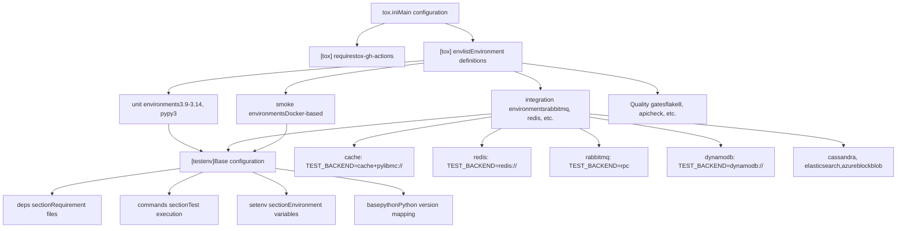
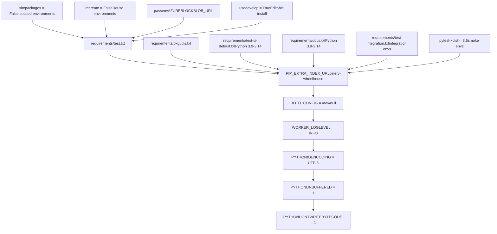
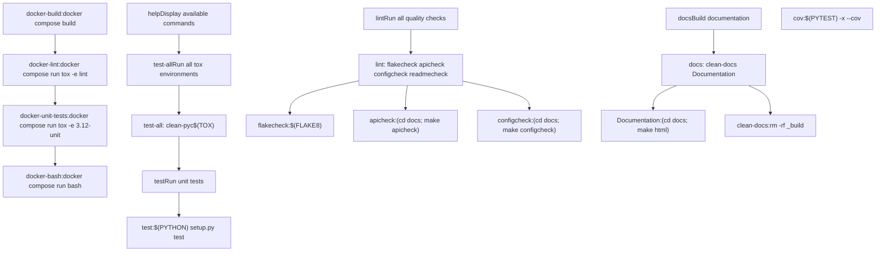
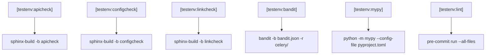
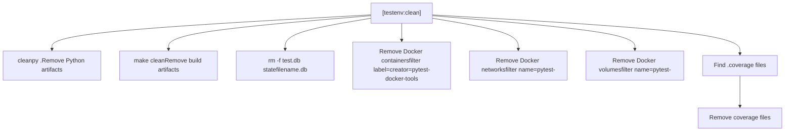
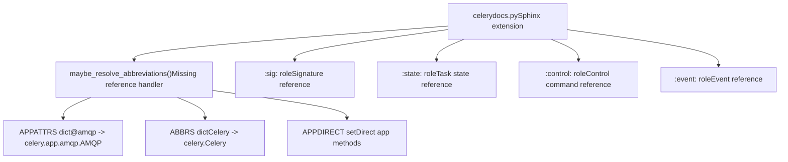
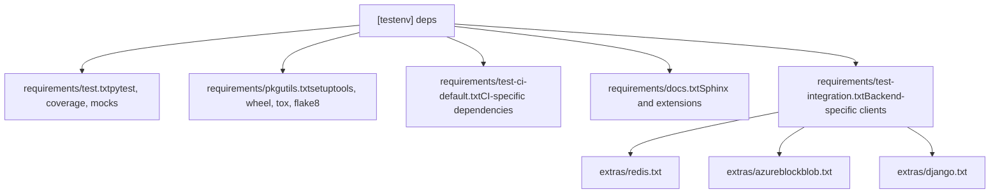

# 测试基础设施 (Testing Infrastructure)

相关源文件

-   [Makefile](https://github.com/celery/celery/blob/4d068b56/Makefile)
-   [celery/app/backends.py](https://github.com/celery/celery/blob/4d068b56/celery/app/backends.py)
-   [docs/Makefile](https://github.com/celery/celery/blob/4d068b56/docs/Makefile)
-   [docs/\_ext/celerydocs.py](https://github.com/celery/celery/blob/4d068b56/docs/_ext/celerydocs.py)
-   [docs/changelog\_formatter.py](https://github.com/celery/celery/blob/4d068b56/docs/changelog_formatter.py)
-   [requirements/docs.txt](https://github.com/celery/celery/blob/4d068b56/requirements/docs.txt)
-   [requirements/pkgutils.txt](https://github.com/celery/celery/blob/4d068b56/requirements/pkgutils.txt)
-   [requirements/test-integration.txt](https://github.com/celery/celery/blob/4d068b56/requirements/test-integration.txt)
-   [tox.ini](https://github.com/celery/celery/blob/4d068b56/tox.ini)

## 目的与范围

本文档解释了 Celery 的测试基础设施，重点介绍了负责编排测试执行、代码质量检查和文档验证的 `tox.ini` 配置和 `Makefile`。有关实际测试实现和测试矩阵配置的信息，请参阅[测试矩阵与环境](/celery/celery/10.2-test-matrix-and-environments)。有关集成测试的详细信息，请参阅[集成与冒烟测试](/celery/celery/10.3-integration-and-smoke-tests)。有关文档质量门禁的信息，请参阅[代码质量与文档](/celery/celery/10.4-code-quality-and-documentation)。

---

## 概述

Celery 的测试基础设施使用两个主要的编排系统：

-   **tox** ([tox.ini1-137](https://github.com/celery/celery/blob/4d068b56/tox.ini#L1-L137))：管理跨 Python 版本、测试类别和后端配置的测试环境。
-   **make** ([Makefile1-205](https://github.com/celery/celery/blob/4d068b56/Makefile#L1-L205))：提供方便的简写命令来调用 tox 和其他工具。

该基础设施支持三类测试：**单元测试**（快速，无外部依赖）、**集成测试**（需要 Redis、RabbitMQ 等外部服务）和**冒烟测试**（Docker 中的全系统测试）。它还强制执行质量门禁，包括 lint 检查、安全扫描和文档完整性检查。

**来源：** [tox.ini1-137](https://github.com/celery/celery/blob/4d068b56/tox.ini#L1-L137) [Makefile1-205](https://github.com/celery/celery/blob/4d068b56/Makefile#L1-L205)

---

## Tox 配置架构

`tox.ini` 文件定义了完整的测试编排系统。它指定了所有测试场景的环境定义、依赖项、命令和环境变量。

### 配置结构


**图表：Tox 配置架构**

**来源：** [tox.ini1-137](https://github.com/celery/celery/blob/4d068b56/tox.ini#L1-L137)

### 环境列表定义

`envlist` 使用矩阵扩展语法定义了所有测试环境：

```ini
envlist =
    {3.9,3.10,3.11,3.12,3.13,3.14,pypy3}-unit
    {3.9,3.10,3.11,3.12,3.13,3.14,pypy3}-integration-{rabbitmq_redis,rabbitmq,redis,dynamodb,azureblockblob,cache,cassandra,elasticsearch,docker}
    {3.9,3.10,3.11,3.12,3.13,3.14,pypy3}-smoke
```
这会扩展为 100 多个环境组合。例如：

-   `3.9-unit`：使用 Python 3.9 运行单元测试。
-   `3.12-integration-redis`：使用 Python 3.12 运行 Redis 后端的集成测试。
-   `pypy3-smoke`：使用 PyPy3 运行冒烟测试。

**来源：** [tox.ini4-7](https://github.com/celery/celery/blob/4d068b56/tox.ini#L4-L7)

### GitHub Actions 集成

`[gh-actions]` 部分将 GitHub Actions 的 Python 版本映射到 tox 环境：

| GitHub Python 版本 | Tox 环境 |
| --- | --- |
| 3.9 | 3.9-unit |
| 3.10 | 3.10-unit |
| 3.11 | 3.11-unit |
| 3.12 | 3.12-unit |
| 3.13 | 3.13-unit |
| 3.14 | 3.14-unit |
| pypy-3 | pypy3-unit |

这使得 GitHub Actions 能够根据 Python 版本矩阵自动选择正确的 tox 环境。

**来源：** [tox.ini15-23](https://github.com/celery/celery/blob/4d068b56/tox.ini#L15-L23)

---

## 测试环境配置

### 基础测试环境

`[testenv]` 部分定义了所有测试环境的通用配置：


**图表：基础测试环境配置流**

**来源：** [tox.ini25-59](https://github.com/celery/celery/blob/4d068b56/tox.ini#L25-L59)

### 按测试类型划分的命令

`commands` 部分定义了不同的测试执行策略：

| 测试类型 | 命令 | 目的 |
| --- | --- | --- |
| unit | `coverage run --source=celery -m pytest -vv --maxfail=10` | 运行带有覆盖率跟踪的单元测试 |
| unit | `coverage xml` | 生成 XML 覆盖率报告 |
| unit | `coverage report` | 显示覆盖率摘要 |
| integration | `pytest -xsvv t/integration {posargs}` | 运行详细输出的集成测试 |
| smoke | `pytest -xsvv t/smoke --dist=loadscope --reruns 5 --reruns-delay 10` | 运行带有重试和并行执行的冒烟测试 |

`{posargs}` 占位符允许传递额外参数：`tox -e 3.12-unit -- -k test_specific`。

**来源：** [tox.ini46-51](https://github.com/celery/celery/blob/4d068b56/tox.ini#L46-L51)

### 后端特定配置

每种后端类型通过 `setenv` 部分设置特定的环境变量：


**图表：后端配置矩阵**

每个后端配置指定了：

1.  **TEST\_BROKER**：消息代理 URL。
2.  **TEST\_BACKEND**：结果后端 URL。
3.  **附加变量**：后端特定的凭证或设置。

**来源：** [tox.ini60-87](https://github.com/celery/celery/blob/4d068b56/tox.ini#L60-L87)

---

## Makefile 集成

`Makefile` 提供了包装了 tox 命令和其他工具的便捷目标（targets）。

### 核心 Makefile 结构


**图表：Makefile 目标依赖关系**

**来源：** [Makefile1-205](https://github.com/celery/celery/blob/4d068b56/Makefile#L1-L205)

### 关键 Makefile 目标

#### 测试目标

| 目标 | 命令 | 目的 |
| --- | --- | --- |
| `test-all` | `$(TOX)` | 运行 envlist 中定义的所有 tox 环境 |
| `test` | `$(PYTHON) setup.py test` | 使用当前 Python 解释器运行测试 |
| `cov` | `$(PYTEST) -x --cov="$(PROJ)" --cov-report=html` | 运行测试并生成 HTML 覆盖率报告 |

**来源：** [Makefile141-148](https://github.com/celery/celery/blob/4d068b56/Makefile#L141-L148)

#### Lint 目标

| 目标 | 命令 | 目的 |
| --- | --- | --- |
| `lint` | `flakecheck apicheck configcheck readmecheck` | 运行所有质量检查 |
| `flakecheck` | `$(FLAKE8) "$(PROJ)" "$(TESTDIR)"` | 使用 flake8 检查代码风格 |
| `apicheck` | `(cd "$(SPHINX_DIR)"; $(MAKE) apicheck)` | 验证 API 文档完整性 |
| `configcheck` | `(cd "$(SPHINX_DIR)"; $(MAKE) configcheck)` | 验证配置文档 |
| `readmecheck` | `readmecheck-unicode readmecheck-rst` | 验证 README.rst 编码和语法 |

**来源：** [Makefile86-116](https://github.com/celery/celery/blob/4d068b56/Makefile#L86-L116)

#### 文档目标

| 目标 | 命令 | 目的 |
| --- | --- | --- |
| `docs` | `clean-docs Documentation` | 构建 HTML 文档 |
| `Documentation` | `(cd "$(SPHINX_DIR)"; $(MAKE) html)` | 调用 Sphinx 构建 |
| `clean-docs` | `rm -rf "$(SPHINX_BUILDDIR)" "$(DOCUMENTATION)"` | 移除文档构建制品 |

**来源：** [Makefile77-84](https://github.com/celery/celery/blob/4d068b56/Makefile#L77-L84)

#### Docker 目标

| 目标 | 命令 | 目的 |
| --- | --- | --- |
| `docker-build` | `docker compose -f docker/docker-compose.yml build` | 构建 Celery Docker 容器 |
| `docker-lint` | `docker compose ... run ... tox -e lint` | 在 Docker 中运行 lint |
| `docker-unit-tests` | `docker compose ... run ... tox -e 3.12-unit` | 在 Docker 中运行单元测试 |
| `docker-bash` | `docker compose ... run ... bash` | 进入容器 shell |
| `docker-docs` | `docker compose up --build -d docs` | 在 Docker 中构建文档并支持热重载 |

**来源：** [Makefile169-201](https://github.com/celery/celery/blob/4d068b56/Makefile#L169-L201)

---

## 质量门禁环境 (Quality Gate Environments)

Tox 定义了几个专门用于质量门禁的环境，这些环境不运行测试，而是验证代码和文档质量。

### 质量门禁配置


**图表：质量门禁环境**

**来源：** [tox.ini101-124](https://github.com/celery/celery/blob/4d068b56/tox.ini#L101-L124)

### 各个质量门禁

#### mypy 类型检查

`[testenv:mypy]` 环境运行静态类型检查：

```ini
[testenv:mypy]
commands = python -m mypy --config-file pyproject.toml
```
这会根据 `pyproject.toml` 配置验证整个代码库中的类型注解。

**来源：** [tox.ini101-102](https://github.com/celery/celery/blob/4d068b56/tox.ini#L101-L102)

#### apicheck 文档检查

`[testenv:apicheck]` 环境验证 API 文档的完整性：

```ini
[testenv:apicheck]
setenv =
    PYTHONHASHSEED = 100
commands =
    sphinx-build -j2 -b apicheck -d {envtmpdir}/doctrees docs docs/_build/apicheck
```
这使用了一个自定义的 Sphinx 构建器，以确保所有公共 API 都已记录。`PYTHONHASHSEED` 确保了输出的确定性。

**来源：** [tox.ini104-108](https://github.com/celery/celery/blob/4d068b56/tox.ini#L104-L108)

#### configcheck 文档检查

`[testenv:configcheck]` 环境验证配置文档：

```ini
[testenv:configcheck]
commands =
    sphinx-build -j2 -b configcheck -d {envtmpdir}/doctrees docs docs/_build/configcheck
```
这确保了所有配置选项都已记录。

**来源：** [tox.ini110-112](https://github.com/celery/celery/blob/4d068b56/tox.ini#L110-L112)

#### linkcheck 外部链接检查

`[testenv:linkcheck]` 环境验证外部 URL：

```ini
[testenv:linkcheck]
commands =
    sphinx-build -j2 -b linkcheck -d {envtmpdir}/doctrees docs docs/_build/linkcheck
```
这会检查文档中的所有外部链接是否有效。

**来源：** [tox.ini114-116](https://github.com/celery/celery/blob/4d068b56/tox.ini#L114-L116)

#### bandit 安全扫描

`[testenv:bandit]` 环境运行安全漏洞扫描：

```ini
[testenv:bandit]
commands =
    bandit -b bandit.json -r celery/
```
这会使用 `bandit.json` 中定义的规则扫描 `celery/` 目录以查找常见的安全问题。

**来源：** [tox.ini118-120](https://github.com/celery/celery/blob/4d068b56/tox.ini#L118-L120)

#### lint Pre-commit 钩子

`[testenv:lint]` 环境运行所有 pre-commit 钩子：

```ini
[testenv:lint]
commands =
    pre-commit {posargs:run --all-files --show-diff-on-failure}
```
这会执行 `.pre-commit-config.yaml` 中定义的 linter、formatter 和其他检查。

**来源：** [tox.ini122-124](https://github.com/celery/celery/blob/4d068b56/tox.ini#L122-L124)

---

## 清理环境 (Cleanup Environment)

`[testenv:clean]` 环境提供了测试制品的全面清理：


**图表：清理环境操作**

清理过程包括：

1.  **覆盖率文件**：移除所有 `.coverage*` 文件。
2.  **Docker 制品**：移除由 `pytest-docker-tools` 创建的容器、网络和卷。
3.  **Python 制品**：使用 `cleanpy` 移除 `.pyc`、`__pycache__` 等。
4.  **构建制品**：调用 `make clean` 移除构建目录。
5.  **数据库文件**：移除测试数据库文件。

**来源：** [tox.ini126-137](https://github.com/celery/celery/blob/4d068b56/tox.ini#L126-L137)

---

## 文档基础设施

### Sphinx 扩展系统

`celerydocs.py` 自定义 Sphinx 扩展为 Celery 特有的结构提供了智能交叉引用：


**图表：自定义 Sphinx 扩展架构**

该扩展允许在文档中使用像 `@amqp` 这样的快捷方式（解析为 `celery.app.amqp.AMQP`），并为 Celery 特有的结构定义了自定义交叉引用类型。

**来源：** [docs/\_ext/celerydocs.py1-181](https://github.com/celery/celery/blob/4d068b56/docs/_ext/celerydocs.py#L1-L181)

### 文档构建目标

`docs/Makefile` 提供了专门的构建目标：

| 目标 | 命令 | 目的 |
| --- | --- | --- |
| `html` | `sphinx-build -b html` | 构建 HTML 文档 |
| `livehtml` | `sphinx-autobuild --host 0.0.0.0 --port 7000` | 热重载文档服务器 |
| `apicheck` | `sphinx-build -b apicheck` | 验证 API 文档完整性 |
| `configcheck` | `sphinx-build -b configcheck` | 验证配置文档 |
| `linkcheck` | `sphinx-build -b linkcheck` | 检查外部链接 |
| `spelling` | `SPELLCHECK=1 sphinx-build -b spelling` | 拼写检查文档 |

**来源：** [docs/Makefile19-241](https://github.com/celery/celery/blob/4d068b56/docs/Makefile#L19-L241)

---

## 依赖管理

### 需求文件 (Requirement Files)

测试基础设施为不同目的使用多个需求文件：


**图表：需求文件依赖关系**

**来源：** [tox.ini31-44](https://github.com/celery/celery/blob/4d068b56/tox.ini#L31-L44) [requirements/docs.txt1-10](https://github.com/celery/celery/blob/4d068b56/requirements/docs.txt#L1-L10) [requirements/test-integration.txt1-8](https://github.com/celery/celery/blob/4d068b56/requirements/test-integration.txt#L1-L8) [requirements/pkgutils.txt1-12](https://github.com/celery/celery/blob/4d068b56/requirements/pkgutils.txt#L1-L12)

### 包实用工具

`requirements/pkgutils.txt` 文件指定了包开发所需的工具：

| 工具 | 版本 | 目的 |
| --- | --- | --- |
| setuptools | \>=40.8.0 | 包构建 |
| wheel | \>=0.33.1 | Wheel 分发格式 |
| flake8 | \>=3.8.3 | 代码风格检查 |
| flake8-docstrings | \>=1.7.0 | Docstring 风格检查 |
| pydocstyle | \==6.3.0 | Docstring 规范检查 |
| tox | \>=3.8.4 | 测试环境管理 |
| sphinx2rst | \>=1.0 | Sphinx 到 RST 转换 |
| bumpversion | \==0.6.0 | 版本号管理 |

**来源：** [requirements/pkgutils.txt1-12](https://github.com/celery/celery/blob/4d068b56/requirements/pkgutils.txt#L1-L12)

---

## 执行流程

### 完整的测试执行流

> **[Mermaid sequence]**
> *(图表结构无法解析)*

**图表：测试执行流**

**来源：** [tox.ini46-51](https://github.com/celery/celery/blob/4d068b56/tox.ini#L46-L51) [Makefile141-142](https://github.com/celery/celery/blob/4d068b56/Makefile#L141-L142)

### 单个测试命令流

运行特定测试环境时：

```bash
# 直接调用 tox
tox -e 3.12-unit

# 带有额外的 pytest 参数
tox -e 3.12-unit -- -k test_task_retry

# 使用特定后端的集成测试
tox -e 3.12-integration-redis

# 质量门禁
tox -e apicheck
```
流程如下：

1.  Tox 读取 `[testenv]` 和 `[testenv:3.12-unit]` 配置。
2.  使用 Python 3.12 创建/重用虚拟环境。
3.  从 `deps` 部分安装依赖。
4.  从 `setenv` 部分设置环境变量。
5.  执行 `commands` 部分的命令。
6.  将结果报告到标准输出。

**来源：** [tox.ini25-100](https://github.com/celery/celery/blob/4d068b56/tox.ini#L25-L100)

---

## 总结

Celery 的测试基础设施提供了：

-   **多 Python 版本测试**：支持 Python 3.9-3.14 和 PyPy3。
-   **多种测试类别**：单元测试（快速）、集成测试（后端特定）、冒烟测试（全系统）。
-   **质量门禁**：Lint 检查 (flake8)、类型检查 (mypy)、安全扫描 (bandit)、文档验证 (apicheck/configcheck)。
-   **灵活执行**：直接通过 tox 或使用 make 简写命令。
-   **后端矩阵**：针对 9 种以上的后端配置进行测试。
-   **Docker 支持**：为 CI 环境提供基于容器的测试。
-   **文档验证**：确保 API 完整性和链接有效性。

该系统编排了 100 多种测试环境组合，同时通过 tox 的环境定义系统和 make 的便捷目标保持了清晰的组织结构。

**来源：** [tox.ini1-137](https://github.com/celery/celery/blob/4d068b56/tox.ini#L1-L137) [Makefile1-205](https://github.com/celery/celery/blob/4d068b56/Makefile#L1-L205)
