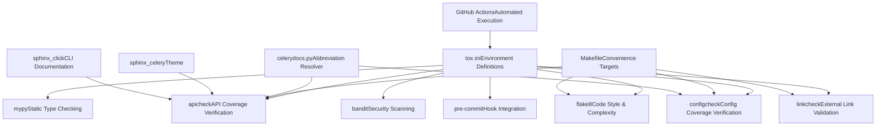
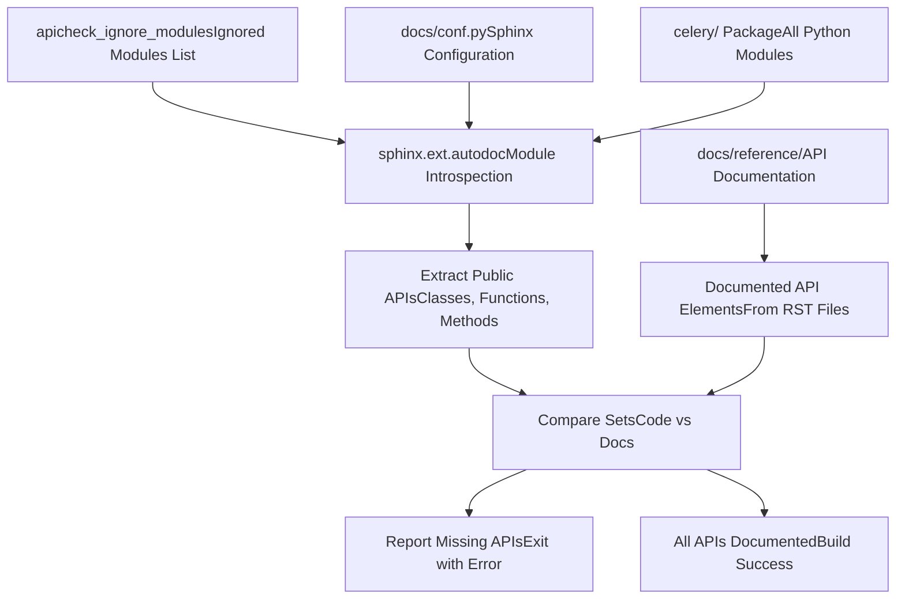
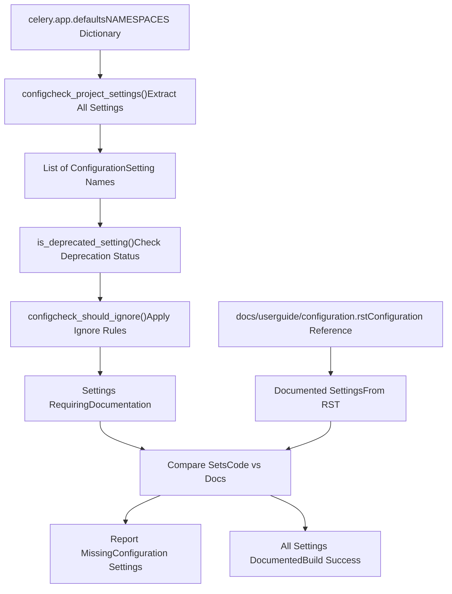
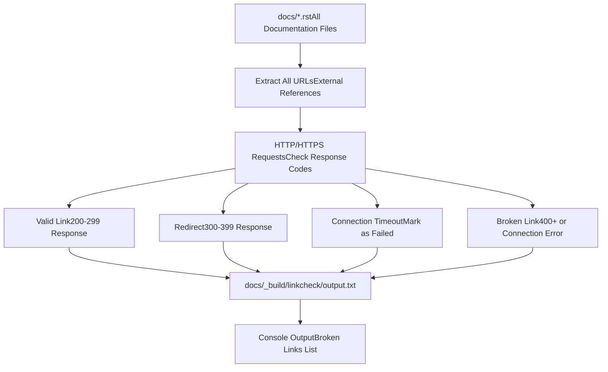
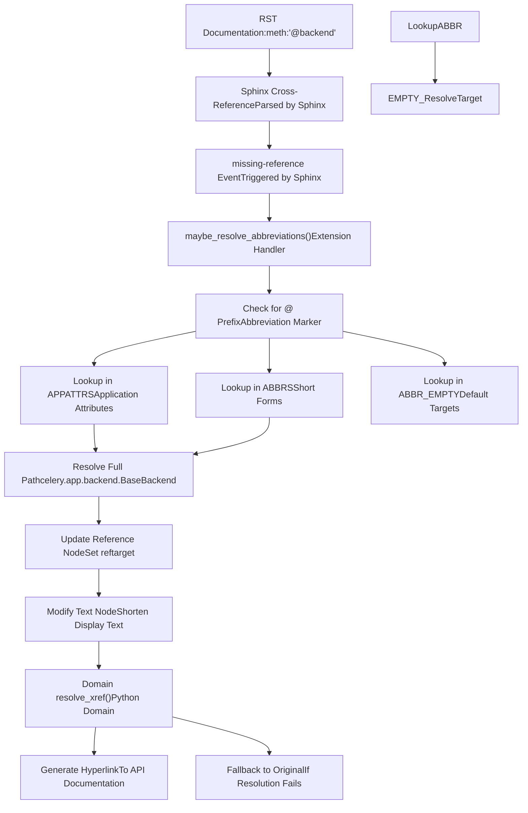
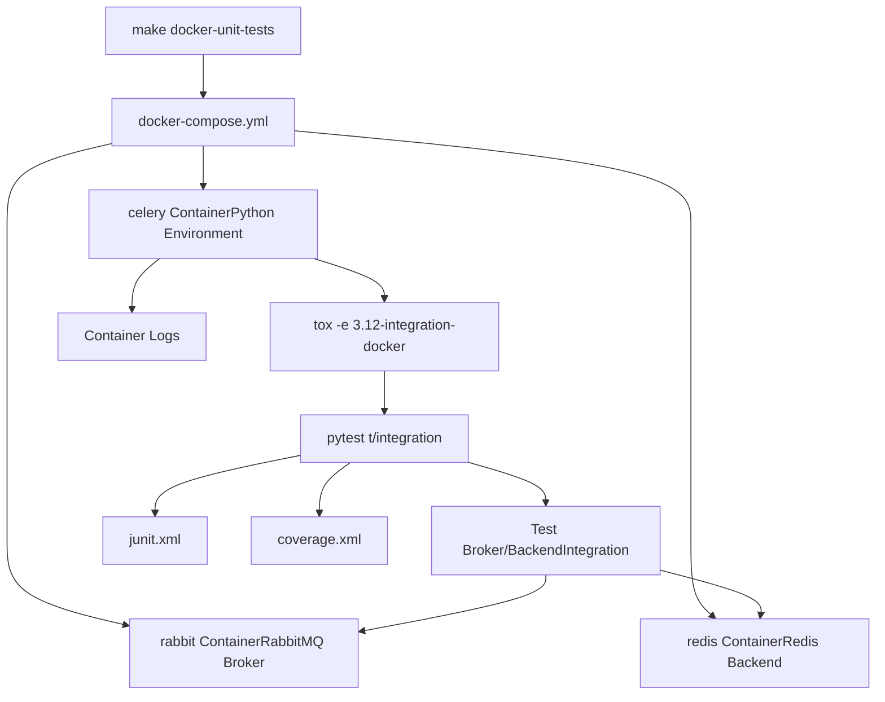
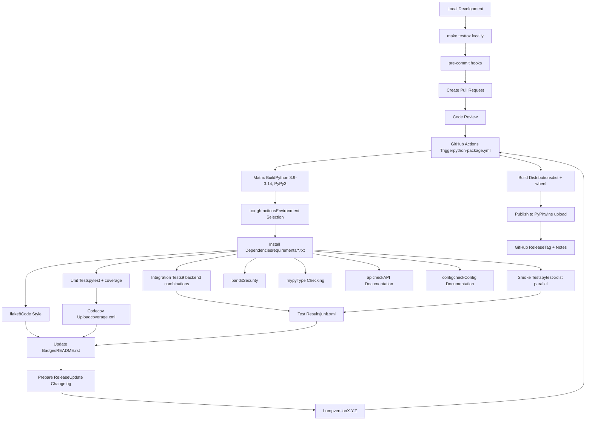
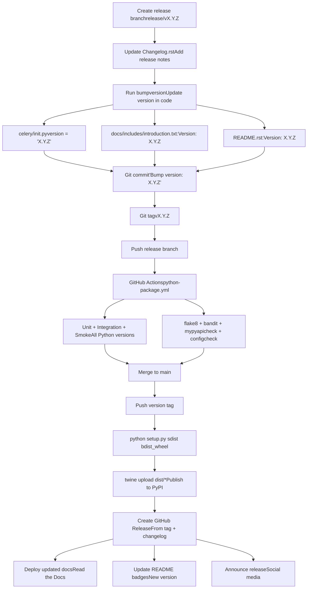

# 代码质量与文档 (Code Quality and Documentation)

相关源文件

-   [Makefile](https://github.com/celery/celery/blob/4d068b56/Makefile)
-   [celery/app/backends.py](https://github.com/celery/celery/blob/4d068b56/celery/app/backends.py)
-   [docs/Makefile](https://github.com/celery/celery/blob/4d068b56/docs/Makefile)
-   [docs/\_ext/celerydocs.py](https://github.com/celery/celery/blob/4d068b56/docs/_ext/celerydocs.py)
-   [docs/changelog\_formatter.py](https://github.com/celery/celery/blob/4d068b56/docs/changelog_formatter.py)
-   [requirements/docs.txt](https://github.com/celery/celery/blob/4d068b56/requirements/docs.txt)
-   [requirements/pkgutils.txt](https://github.com/celery/celery/blob/4d068b56/requirements/pkgutils.txt)
-   [requirements/test-integration.txt](https://github.com/celery/celery/blob/4d068b56/requirements/test-integration.txt)
-   [tox.ini](https://github.com/celery/celery/blob/4d068b56/tox.ini)

## 目的与范围

本文档描述了 Celery 的代码质量强制执行和文档验证系统。它涵盖了静态分析工具（flake8, mypy, bandit）、文档完整性检查（apicheck, configcheck, linkcheck），以及用于交叉引用的自定义 `celerydocs.py` Sphinx 扩展。有关测试执行框架的信息，请参阅[测试基础设施](/celery/celery/10.1-testing-infrastructure)。有关 CI/CD 集成的详细信息，请参阅测试相关页面。

Celery 通过多个验证层强制执行质量标准，在代码合并之前验证代码风格、类型正确性、安全性和文档完整性。

## 质量门禁架构 (Quality Gate Architecture)

Celery 的质量强制执行系统由多个独立的验证工具组成，每个工具验证代码质量的不同方面：

**质量门禁架构：**


**来源：** [tox.ini9-12](https://github.com/celery/celery/blob/4d068b56/tox.ini#L9-L12) [Makefile86](https://github.com/celery/celery/blob/4d068b56/Makefile#L86-L86)

### 质量门禁环境

[tox.ini9-12](https://github.com/celery/celery/blob/4d068b56/tox.ini#L9-L12) 配置定义了专门用于质量检查的环境：

| 环境因子 | 工具 | Python 版本 | 目的 |
| --- | --- | --- | --- |
| `flake8` | flake8 | 3.13 | 检查代码风格和复杂度 |
| `mypy` | mypy | 3.13 | 静态类型分析 |
| `bandit` | bandit | 3.13 | 安全漏洞扫描 |
| `lint` | pre-commit | 3.13 | 运行所有 pre-commit 钩子 |
| `apicheck` | sphinx-build | 3.13 | API 文档覆盖率检查 |
| `configcheck` | sphinx-build | 3.13 | 配置文档覆盖率检查 |
| `linkcheck` | sphinx-build | 3.13 | 外部链接有效性验证 |

所有质量门禁均在 Python 3.13 [tox.ini98](https://github.com/celery/celery/blob/4d068b56/tox.ini#L98-L98) 上运行，以确保结果的一致性。

**来源：** [tox.ini9-12](https://github.com/celery/celery/blob/4d068b56/tox.ini#L9-L12) [tox.ini98](https://github.com/celery/celery/blob/4d068b56/tox.ini#L98-L98)

## 代码风格检查 (flake8)

`flake8` 环境负责在整个 Celery 代码库中验证代码风格、复杂度和 docstring 质量。

### Flake8 配置

**工具栈：**

-   `flake8>=3.8.3` - 核心 Linter [requirements/pkgutils.txt3](https://github.com/celery/celery/blob/4d068b56/requirements/pkgutils.txt#L3-L3)。
-   `flake8-docstrings>=1.7.0` - Docstring 风格检查器 [requirements/pkgutils.txt4](https://github.com/celery/celery/blob/4d068b56/requirements/pkgutils.txt#L4-L4)。
-   `pydocstyle==6.3.0` - Docstring 规范强制执行器 [requirements/pkgutils.txt5](https://github.com/celery/celery/blob/4d068b56/requirements/pkgutils.txt#L5-L5)。

**执行方法：**

```bash
# 通过 Makefile 执行
make flakecheck

# 通过 tox 执行（隐式环境）
tox -e lint

# 直接执行
flake8 celery t
```
**Makefile 集成** [Makefile94-95](https://github.com/celery/celery/blob/4d068b56/Makefile#L94-L95)：

```makefile
flakecheck:
	$(FLAKE8) "$(PROJ)" "$(TESTDIR)"
```
这会同时检查 `celery/` 源代码目录和 `t/` 测试目录。

**来源：** [requirements/pkgutils.txt3-5](https://github.com/celery/celery/blob/4d068b56/requirements/pkgutils.txt#L3-L5) [Makefile94-95](https://github.com/celery/celery/blob/4d068b56/Makefile#L94-L95) [Makefile86](https://github.com/celery/celery/blob/4d068b56/Makefile#L86-L86)

### Flake8 验证的内容

**代码风格检查：**

-   符合 PEP 8 规范（行号、缩进、空格）。
-   命名约定（函数、类、变量）。
-   导入顺序和组织。
-   未使用的导入和变量。

**复杂度检查：**

-   函数的圈复杂度 (Cyclomatic complexity)。
-   函数长度限制。
-   嵌套深度限制。

**Docstring 检查：**

-   模块、类和函数 docstring 的存在性。
-   Docstring 格式 (PEP 257)。
-   参数文档的完整性。

**来源：** [requirements/pkgutils.txt3-5](https://github.com/celery/celery/blob/4d068b56/requirements/pkgutils.txt#L3-L5)

## 静态类型检查 (mypy)

`mypy` 环境 [tox.ini101-102](https://github.com/celery/celery/blob/4d068b56/tox.ini#L101-L102) 执行静态类型分析，以便在运行时之前捕获与类型相关的错误。

### MyPy 配置

**Tox 环境定义：**

```ini
[testenv:mypy]
commands = python -m mypy --config-file pyproject.toml
```
**执行：**

```bash
tox -e mypy
```
类型检查配置存储在 `pyproject.toml` 中，它定义了：

-   被检查的模块和包。
-   类型严格程度。
-   忽略的错误或模块。
-   插件配置。

**来源：** [tox.ini101-102](https://github.com/celery/celery/blob/4d068b56/tox.ini#L101-L102)

### 类型检查范围

MyPy 分析以下内容：

-   函数和方法签名。
-   变量类型注解。
-   返回类型的正确性。
-   赋值中的类型兼容性。
-   泛型 (Generic type) 的使用。

这可以捕获如下问题：

-   向函数传递错误类型。
-   返回不正确的类型。
-   访问未定义的属性。
-   不兼容的类型操作。

**来源：** [tox.ini101-102](https://github.com/celery/celery/blob/4d068b56/tox.ini#L101-L102)

## 安全扫描 (bandit)

`bandit` 环境 [tox.ini118-120](https://github.com/celery/celery/blob/4d068b56/tox.ini#L118-L120) 扫描 Celery 代码库中的常见安全漏洞。

### Bandit 配置

**Tox 环境定义：**

```ini
[testenv:bandit]
commands =
    bandit -b bandit.json -r celery/
```
**执行：**

```bash
tox -e bandit
```
扫描使用来自 `bandit.json` 的配置，并递归检查 `celery/` 目录中的所有文件。

**来源：** [tox.ini44](https://github.com/celery/celery/blob/4d068b56/tox.ini#L44-L44) [tox.ini118-120](https://github.com/celery/celery/blob/4d068b56/tox.ini#L118-L120)

### 执行的安全检查

Bandit 识别潜在的安全问题：

-   硬编码的密码或密钥。
-   SQL 注入漏洞。
-   Shell 注入风险。
-   不安全的加密实践。
-   不安全的反序列化。
-   弱随机数生成。
-   路径遍历漏洞。
-   XML 外部实体 (XXE) 问题。

`bandit.json` 配置文件定义了：

-   严重性阈值。
-   排除的测试。
-   忽略的文件模式。
-   自定义安全配置文件。

**来源：** [tox.ini118-120](https://github.com/celery/celery/blob/4d068b56/tox.ini#L118-L120)

## Pre-commit 钩子集成

`lint` 环境 [tox.ini122-124](https://github.com/celery/celery/blob/4d068b56/tox.ini#L122-L124) 执行 pre-commit 钩子以进行全面的代码验证。

### Pre-commit 配置

**Tox 环境定义：**

```ini
[testenv:lint]
commands =
    pre-commit {posargs:run --all-files --show-diff-on-failure}
```
**执行：**

```bash
# 在所有文件上运行所有钩子
tox -e lint

# 运行特定的钩子
tox -e lint -- run --hook-id flake8

# 仅在暂存文件上运行（典型的 pre-commit 用法）
pre-commit run
```
**来源：** [tox.ini43](https://github.com/celery/celery/blob/4d068b56/tox.ini#L43-L43) [tox.ini122-124](https://github.com/celery/celery/blob/4d068b56/tox.ini#L122-L124)

### Pre-commit 钩子

`.pre-commit-config.yaml` 文件定义了自动运行的钩子：

-   代码格式化器（行尾空格、EOF 修复器）。
-   Linter（flake8，以及其他可能的工具）。
-   安全扫描器。
-   导入排序器。
-   YAML/JSON 验证器。

这些钩子运行的时机：

1.  **自动**：在 `git commit` 时运行（如果已安装 pre-commit）。
2.  **CI 中**：通过 lint tox 环境运行。
3.  **手动**：通过 `tox -e lint` 运行。

**来源：** [tox.ini122-124](https://github.com/celery/celery/blob/4d068b56/tox.ini#L122-L124)

## 文档质量验证

Celery 使用自定义的 Sphinx 构建器来确保文档的完整性和准确性。

### API 覆盖率验证 (apicheck)

`apicheck` 构建器验证所有公共 API 元素是否都已记录在参考文档中。

**API 覆盖率检查流程：**


**执行方法：**

```bash
# 通过 tox
tox -e apicheck

# 通过根目录 Makefile
make apicheck

# 通过 docs 目录下的 Makefile
cd docs && make apicheck

# 直接调用 Sphinx
sphinx-build -b apicheck -d docs/_build/doctrees docs docs/_build/apicheck
```
**Tox 环境** [tox.ini104-108](https://github.com/celery/celery/blob/4d068b56/tox.ini#L104-L108)：

```ini
[testenv:apicheck]
setenv =
    PYTHONHASHSEED = 100
commands =
    sphinx-build -j2 -b apicheck -d {envtmpdir}/doctrees docs docs/_build/apicheck
```
`PYTHONHASHSEED=100` 确保了可重现构建的确定性输出。

**来源：** [tox.ini104-108](https://github.com/celery/celery/blob/4d068b56/tox.ini#L104-L108) [Makefile88-89](https://github.com/celery/celery/blob/4d068b56/Makefile#L88-L89) [docs/Makefile215-217](https://github.com/celery/celery/blob/4d068b56/docs/Makefile#L215-L217)

### 配置覆盖率验证 (configcheck)

`configcheck` 构建器确保所有配置设置都已记录在配置参考中。

**配置检查过程：**


**执行方法：**

```bash
# 通过 tox
tox -e configcheck

# 通过根目录 Makefile
make configcheck

# 通过 docs 目录下的 Makefile
cd docs && make configcheck

# 直接调用 Sphinx
sphinx-build -b configcheck -d docs/_build/doctrees docs docs/_build/configcheck
```
**Tox 环境** [tox.ini110-112](https://github.com/celery/celery/blob/4d068b56/tox.ini#L110-L112)：

```ini
[testenv:configcheck]
commands =
    sphinx-build -j2 -b configcheck -d {envtmpdir}/doctrees docs docs/_build/configcheck
```
**来源：** [tox.ini110-112](https://github.com/celery/celery/blob/4d068b56/tox.ini#L110-L112) [Makefile91-92](https://github.com/celery/celery/blob/4d068b56/Makefile#L91-L92) [docs/Makefile219-221](https://github.com/celery/celery/blob/4d068b56/docs/Makefile#L219-L221)

### 链接验证 (linkcheck)

`linkcheck` 构建器验证文档中所有的外部超链接。

**链接检查过程：**


**执行方法：**

```bash
# 通过 tox
tox -e linkcheck

# 通过 docs 目录下的 Makefile
cd docs && make linkcheck

# 直接调用 Sphinx
sphinx-build -b linkcheck -d docs/_build/doctrees docs docs/_build/linkcheck
```
**Tox 环境** [tox.ini114-116](https://github.com/celery/celery/blob/4d068b56/tox.ini#L114-L116)：

```ini
[testenv:linkcheck]
commands =
    sphinx-build -j2 -b linkcheck -d {envtmpdir}/doctrees docs docs/_build/linkcheck
```
链接检查器验证的内容：

-   外部 URL（GitHub, PyPI, 文档网站）。
-   外部页面内的锚点链接。
-   协议有效性 (HTTP/HTTPS)。
-   响应状态码。
-   连接超时。

**来源：** [tox.ini114-116](https://github.com/celery/celery/blob/4d068b56/tox.ini#L114-L116) [docs/Makefile196-201](https://github.com/celery/celery/blob/4d068b56/docs/Makefile#L196-L201)

## 自定义 Sphinx 扩展 (celerydocs)

`celerydocs.py` 扩展 [docs/\_ext/celerydocs.py1-181](https://github.com/celery/celery/blob/4d068b56/docs/_ext/celerydocs.py#L1-L181) 提供了一个用于交叉引用 Celery 组件的缩写系统。

### 缩写映射

**应用程序属性** [docs/\_ext/celerydocs.py6-25](https://github.com/celery/celery/blob/4d068b56/docs/_ext/celerydocs.py#L6-L25)：

| 缩写 | 完整路径 | 描述 |
| --- | --- | --- |
| `@amqp` | `celery.app.amqp.AMQP` | AMQP 层 |
| `@backend` | `celery.backends.base.BaseBackend` | 结果后端 |
| `@conf` | `celery.app.utils.Settings` | 配置对象 |
| `@control` | `celery.app.control.Control` | 工作者控制 |
| `@events` | `celery.events.Events` | 事件分发器 |
| `@loader` | `celery.app.loaders.base.BaseLoader` | 配置加载器 |
| `@log` | `celery.app.log.Logging` | 日志设置 |
| `@pool` | `kombu.connection.ConnectionPool` | 连接池 |
| `@tasks` | `celery.app.registry.Registry` | 任务注册表 |
| `@AsyncResult` | `celery.result.AsyncResult` | 任务结果对象 |
| `@ResultSet` | `celery.result.ResultSet` | 多重结果 |
| `@GroupResult` | `celery.result.GroupResult` | 组结果 |
| `@Worker` | `celery.apps.worker.Worker` | 工作者应用 |
| `@WorkController` | `celery.worker.WorkController` | 工作者控制器 |
| `@Beat` | `celery.apps.beat.Beat` | Beat 调度器 |
| `@Task` | `celery.app.task.Task` | 任务基类 |
| `@signature` | `celery.canvas.Signature` | 任务签名 |

**直接方法** [docs/\_ext/celerydocs.py27-40](https://github.com/celery/celery/blob/4d068b56/docs/_ext/celerydocs.py#L27-L40)：

这些方法解析为 `celery.Celery.<method>`：

-   `@task`, `@send_task`, `@connection`, `@connection_or_acquire`
-   `@producer_or_acquire`, `@prepare_config`, `@now`
-   `@select_queues`, `@either`, `@bugreport`, `@create_task_cls`
-   以及更多...

**短缩写** [docs/\_ext/celerydocs.py44-51](https://github.com/celery/celery/blob/4d068b56/docs/_ext/celerydocs.py#L44-L51)：

-   `Celery` → `celery.Celery`
-   空的缩写，如 `:exc:` → `celery.exceptions`

**来源：** [docs/\_ext/celerydocs.py6-51](https://github.com/celery/celery/blob/4d068b56/docs/_ext/celerydocs.py#L6-L51)

### 缩写解析

**解析流程：**


**解析函数** [docs/\_ext/celerydocs.py89-148](https://github.com/celery/celery/blob/4d068b56/docs/_ext/celerydocs.py#L89-L148)：

-   `resolve(S, type)` - 主解析函数。
    -   处理 `@` 前缀标记。
    -   查找缩写字典。
    -   返回完整路径和源字典。
-   `get_abbr(pre, rest, type, orig)` - 缩写查找。
    -   首先检查 `APPATTRS` 字典。
    -   回退到 `ABBRS` 字典。
    -   如果未找到，返回 `ABBR_EMPTY` 中的默认值。
-   `maybe_resolve_abbreviations(app, env, node, contnode)` - Sphinx 事件处理程序。
    -   连接到 `missing-reference` 事件。
    -   当标准解析失败时解析缩写。
    -   更新带有完整路径的参考节点。
    -   根据 `~` 前缀修改显示文本。

**来源：** [docs/\_ext/celerydocs.py89-148](https://github.com/celery/celery/blob/4d068b56/docs/_ext/celerydocs.py#L89-L148)

### 文本简短化

该扩展提供了智能文本简短化功能 [docs/\_ext/celerydocs.py60-67](https://github.com/celery/celery/blob/4d068b56/docs/_ext/celerydocs.py#L60-L67) [docs/\_ext/celerydocs.py118-124](https://github.com/celery/celery/blob/4d068b56/docs/_ext/celerydocs.py#L118-L124)：

**不带 `~` 前缀：**

```text
:class:`@backend`
→ 显示：app.backend
→ 链接到：celery.backends.base.BaseBackend
```
**带有 `~` 前缀：**

```text
:class:`~@backend`
→ 显示：BaseBackend
→ 链接到：celery.backends.base.BaseBackend
```
**函数：**

-   `shorten(S, newtarget, src_dict)` - 确定显示文本。
    -   `@-` 前缀：完全移除前缀。
    -   `@` 前缀：如果是来自 `APPATTRS`，则在前面加上 `app.`。
    -   否则：原样返回。
-   `basename(module_fqdn)` - 提取最后一个组件。
-   `typeify(S, type)` - 为方法/函数添加 `()`。

**来源：** [docs/\_ext/celerydocs.py54-124](https://github.com/celery/celery/blob/4d068b56/docs/_ext/celerydocs.py#L54-L124)

### 扩展注册

**Sphinx Setup** [docs/\_ext/celerydocs.py151-180](https://github.com/celery/celery/blob/4d068b56/docs/_ext/celerydocs.py#L151-L180)：

```python
def setup(app):
    # 将缩写解析器连接到 missing-reference 事件
    app.connect('missing-reference', maybe_resolve_abbreviations)

    # 注册自定义交叉引用类型
    app.add_crossref_type(
        directivename='sig',
        rolename='sig',
        indextemplate='pair: %s; sig',
    )
    app.add_crossref_type(
        directivename='state',
        rolename='state',
        indextemplate='pair: %s; state',
    )
    app.add_crossref_type(
        directivename='control',
        rolename='control',
        indextemplate='pair: %s; control',
    )
    app.add_crossref_type(
        directivename='event',
        rolename='event',
        indextemplate='pair: %s; event',
    )

    return {'parallel_read_safe': True}
```
这注册了：

-   自定义交叉引用类型 (`:sig:`, `:state:`, `:control:`, `:event:`)。
-   缺失引用的事件处理程序。
-   多进程构建的并行读取安全标志。

**来源：** [docs/\_ext/celerydocs.py151-180](https://github.com/celery/celery/blob/4d068b56/docs/_ext/celerydocs.py#L151-L180)

## 基于 Docker 的测试

Celery 提供基于 Docker 的测试基础设施，以实现隔离且可重现的测试执行。

### Docker 测试目标

Makefile [Makefile169-204](https://github.com/celery/celery/blob/4d068b56/Makefile#L169-L204) 提供了 Docker 特定的命令：

| 目标 | 目的 | 命令 |
| --- | --- | --- |
| `docker-build` | 构建 Celery 容器 | `docker compose -f docker/docker-compose.yml build` |
| `docker-lint` | 运行 lint 检查 | `docker compose ... run celery tox -e lint` |
| `docker-unit-tests` | 运行单元测试 | `docker compose ... run celery tox -e 3.12-unit` |
| `docker-integration-tests` | 运行集成测试 | `docker compose ... run celery tox -e 3.12-integration-docker` |
| `docker-bash` | 交互式 shell | `docker compose ... run celery bash` |
| `docker-docs` | 构建文档 | `docker compose ... up --build -d docs` |

**来源：** [Makefile169-204](https://github.com/celery/celery/blob/4d068b56/Makefile#L169-L204)

### Docker 测试环境

`docker` 集成环境 [tox.ini78-79](https://github.com/celery/celery/blob/4d068b56/tox.ini#L78-L79) 为容器化服务配置了代理和后端 URL：

```ini
TEST_BROKER=pyamqp://rabbit:5672
TEST_BACKEND=redis://redis
```
这些服务名称（`rabbit`, `redis`）指的是 `docker/docker-compose.yml` 中定义的 Docker Compose 服务名称。

**来源：** [tox.ini78-79](https://github.com/celery/celery/blob/4d068b56/tox.ini#L78-L79) [Makefile169-190](https://github.com/celery/celery/blob/4d068b56/Makefile#L169-L190)

### Docker 测试流程


**来源：** [Makefile169-190](https://github.com/celery/celery/blob/4d068b56/Makefile#L169-L190) [tox.ini78-79](https://github.com/celery/celery/blob/4d068b56/tox.ini#L78-L79)

### 文档容器

`docker-docs` 目标 [Makefile192-200](https://github.com/celery/celery/blob/4d068b56/Makefile#L192-L200) 在容器中构建文档：

```bash
make docker-docs
```
该操作会：

1.  通过 `docker compose up --build -d docs` 启动 `docs` 服务。
2.  最多等待 60 秒以在日志中查找 "build succeeded"。
3.  如果失败，显示最后 50 行日志。
4.  通过 `docker compose down` 关闭容器。

**来源：** [Makefile192-200](https://github.com/celery/celery/blob/4d068b56/Makefile#L192-L200)

## Makefile 集成

Makefile [Makefile1-205](https://github.com/celery/celery/blob/4d068b56/Makefile#L1-L205) 为 CI/CD 操作提供了便捷的目标。

### 关键目标

**测试：**

-   `test-all` - 为所有环境运行 tox [Makefile141-142](https://github.com/celery/celery/blob/4d068b56/Makefile#L141-L142)。
-   `test` - 通过 setup.py 运行测试 [Makefile144-145](https://github.com/celery/celery/blob/4d068b56/Makefile#L144-L145)。
-   `cov` - 运行测试并生成 HTML 覆盖率报告 [Makefile147-148](https://github.com/celery/celery/blob/4d068b56/Makefile#L147-L148)。

**质量检查：**

-   `lint` - 运行所有 linting (flake8, apicheck, configcheck, readmecheck) [Makefile86](https://github.com/celery/celery/blob/4d068b56/Makefile#L86-L86)。
-   `flakecheck` - 运行 flake8 代码风格检查 [Makefile94-95](https://github.com/celery/celery/blob/4d068b56/Makefile#L94-L95)。
-   `apicheck` - 验证 API 文档覆盖率 [Makefile88-89](https://github.com/celery/celery/blob/4d068b56/Makefile#L88-L89)。
-   `configcheck` - 验证配置文档 [Makefile91-92](https://github.com/celery/celery/blob/4d068b56/Makefile#L91-L92)。

**文档：**

-   `docs` - 构建 HTML 文档 [Makefile81](https://github.com/celery/celery/blob/4d068b56/Makefile#L81-L81)。
-   `clean-docs` - 移除文档构建制品 [Makefile83-84](https://github.com/celery/celery/blob/4d068b56/Makefile#L83-L84)。

**分发：**

-   `build` - 构建源码和 wheel 分发包 [Makefile150-151](https://github.com/celery/celery/blob/4d068b56/Makefile#L150-L151)。
-   `distcheck` - 在分发前运行 lint、测试和清理 [Makefile153](https://github.com/celery/celery/blob/4d068b56/Makefile#L153-L153)。
-   `dist` - 构建包含已清理 readme 和 contrib 文件的分发包 [Makefile155](https://github.com/celery/celery/blob/4d068b56/Makefile#L155-L155)。

**清理：**

-   `clean` - 移除文档、pyc 和构建制品 [Makefile61](https://github.com/celery/celery/blob/4d068b56/Makefile#L61-L61)。
-   `clean-pyc` - 移除 Python 缓存文件 [Makefile126-128](https://github.com/celery/celery/blob/4d068b56/Makefile#L126-L128)。
-   `clean-build` - 移除 setup 制品 [Makefile132-133](https://github.com/celery/celery/blob/4d068b56/Makefile#L132-L133)。

**来源：** [Makefile27-155](https://github.com/celery/celery/blob/4d068b56/Makefile#L27-L155)

### Tox 清理环境

`clean` 环境 [tox.ini126-136](https://github.com/celery/celery/blob/4d068b56/tox.ini#L126-L136) 执行全面清理：

```bash
tox -e clean
```
操作步骤：

1.  移除覆盖率文件 (`*.coverage*`)。
2.  移除 pytest-docker-tools 容器。
3.  移除 pytest Docker 网络。
4.  移除 pytest Docker 卷。
5.  运行 `cleanpy .` 以移除 Python 制品。
6.  运行 `make clean`。
7.  移除测试数据库 (`test.db`, `statefilename.db`)。

**来源：** [tox.ini126-136](https://github.com/celery/celery/blob/4d068b56/tox.ini#L126-L136)

## CI/CD 流水线概述

完整的 CI/CD 流水线集成了从本地开发到发布的各种组件：


**来源：** [tox.ini1-137](https://github.com/celery/celery/blob/4d068b56/tox.ini#L1-L137) [Makefile1-205](https://github.com/celery/celery/blob/4d068b56/Makefile#L1-L205) [.bumpversion.cfg1-14](https://github.com/celery/celery/blob/4d068b56/.bumpversion.cfg#L1-L14) [README.rst566-608](https://github.com/celery/celery/blob/4d068b56/README.rst#L566-L608)

### CI/CD 配置文件

| 文件 | 用途 | 关键组件 |
| --- | --- | --- |
| [tox.ini1-137](https://github.com/celery/celery/blob/4d068b56/tox.ini#L1-L137) | 测试编排 | 环境矩阵、依赖项、命令 |
| [.bumpversion.cfg1-14](https://github.com/celery/celery/blob/4d068b56/.bumpversion.cfg#L1-L14) | 版本管理 | 版本模式、受影响的文件 |
| `.github/workflows/python-package.yml` | CI 工作流 | 矩阵策略、测试执行、制品上传 |
| [Makefile1-205](https://github.com/celery/celery/blob/4d068b56/Makefile#L1-L205) | 构建自动化 | 测试目标、质量检查、分发 |
| [requirements/test-ci-default.txt](https://github.com/celery/celery/blob/4d068b56/requirements/test-ci-default.txt) | CI 依赖 | pytest, coverage, tox 插件 |
| [requirements/test-integration.txt1-8](https://github.com/celery/celery/blob/4d068b56/requirements/test-integration.txt#L1-L8) | 集成测试依赖 | 后端客户端, pytest-rerunfailures |

**来源：** [tox.ini1-137](https://github.com/celery/celery/blob/4d068b56/tox.ini#L1-L137) [.bumpversion.cfg1-14](https://github.com/celery/celery/blob/4d068b56/.bumpversion.cfg#L1-L14) [Makefile1-205](https://github.com/celery/celery/blob/4d068b56/Makefile#L1-L205) [requirements/test-integration.txt1-8](https://github.com/celery/celery/blob/4d068b56/requirements/test-integration.txt#L1-L8)

## 发布流程 (Release Process)

### 版本管理

Celery 使用 `bumpversion` 进行版本管理 [.bumpversion.cfg1-14](https://github.com/celery/celery/blob/4d068b56/.bumpversion.cfg#L1-L14)。版本号遵循语义化版本规范，并带有可选的发布级别后缀。

**配置结构：**

| 设置项 | 值 | 描述 |
| --- | --- | --- |
| `current_version` | `5.6.2` | 当前项目版本 |
| `commit` | `True` | 自动提交版本更改 |
| `tag` | `True` | 为发布创建 Git 标签 |
| `parse` | `(?P<major>\d+)\.(?P<minor>\d+)\.(?P<patch>\d+)(?P<releaselevel>[a-z\d]+)?` | 版本正则表达式模式 |
| `serialize` | `{major}.{minor}.{patch}{releaselevel}` 或 `{major}.{minor}.{patch}` | 版本字符串格式 |

**更新的版本文件：**

-   [celery/\_\_init\_\_.py20](https://github.com/celery/celery/blob/4d068b56/celery/__init__.py#L20-L20) - `__version__` 变量。
-   [docs/includes/introduction.txt1](https://github.com/celery/celery/blob/4d068b56/docs/includes/introduction.txt#L1-L1) - 文档版本。
-   [README.rst5](https://github.com/celery/celery/blob/4d068b56/README.rst#L5-L5) - README 版本标题。

**来源：** [.bumpversion.cfg1-14](https://github.com/celery/celery/blob/4d068b56/.bumpversion.cfg#L1-L14) [celery/\_\_init\_\_.py18-20](https://github.com/celery/celery/blob/4d068b56/celery/__init__.py#L18-L20) [README.rst5](https://github.com/celery/celery/blob/4d068b56/README.rst#L5-L5)

### 版本自增

**版本自增命令：**

```bash
# 修订版发布 (5.6.2 → 5.6.3)
bumpversion patch

# 次版本发布 (5.6.2 → 5.7.0)
bumpversion minor

# 主版本发布 (5.6.2 → 6.0.0)
bumpversion major

# 预发布版本 (5.6.2 → 5.6.3rc1)
bumpversion --new-version 5.6.3rc1 releaselevel
```
版本信息也在 [celery/\_\_init\_\_.py18-48](https://github.com/celery/celery/blob/4d068b56/celery/__init__.py#L18-L48) 中通过额外的元数据进行维护：

```python
SERIES = 'recovery'
__version__ = '5.6.2'
VERSION_BANNER = f'{__version__} ({SERIES})'
```
**来源：** [.bumpversion.cfg1-14](https://github.com/celery/celery/blob/4d068b56/.bumpversion.cfg#L1-L14) [celery/\_\_init\_\_.py18-48](https://github.com/celery/celery/blob/4d068b56/celery/__init__.py#L18-L48)

### 发布工作流

**发布过程流程：**


**来源：** [.bumpversion.cfg1-14](https://github.com/celery/celery/blob/4d068b56/.bumpversion.cfg#L1-L14) [Changelog.rst1-25](https://github.com/celery/celery/blob/4d068b56/Changelog.rst#L1-L25)

### 变更日志 (Changelog) 管理

Celery 提供了一个变更日志格式化工具 [docs/changelog\_formatter.py1-131](https://github.com/celery/celery/blob/4d068b56/docs/changelog_formatter.py#L1-L131)，用于处理 GitHub 生成的发布说明：

**用法：**

```bash
make -C docs changelog
# 或者直接：
python docs/changelog_formatter.py --clipboard
```
**处理步骤：**

1.  从剪贴板读取发布说明 [docs/changelog\_formatter.py26-28](https://github.com/celery/celery/blob/4d068b56/docs/changelog_formatter.py#L26-L28)。
2.  过滤掉 `[pre-commit.ci]` 相关的行 [docs/changelog\_formatter.py35-36](https://github.com/celery/celery/blob/4d068b56/docs/changelog_formatter.py#L35-L36)。
3.  在 "## New Contributors" 部分停止处理 [docs/changelog\_formatter.py43-44](https://github.com/celery/celery/blob/4d068b56/docs/changelog_formatter.py#L43-L44)。
4.  使用正则表达式模式提取 PR 描述和编号 [docs/changelog\_formatter.py14](https://github.com/celery/celery/blob/4d068b56/docs/changelog_formatter.py#L14-L14)。
5.  将输出格式化为 RST 变更日志条目 [docs/changelog\_formatter.py99-126](https://github.com/celery/celery/blob/4d068b56/docs/changelog_formatter.py#L99-L126)。

**输出格式：**

```rst
.. _version-x.y.z:

x.y.z
=====

:release-date: <YYYY-MM-DD>
:release-by: <FULL NAME>

What's Changed
~~~~~~~~~~~~~~

- Description (#{pr_number})
- ...
```
**来源：** [docs/changelog\_formatter.py1-131](https://github.com/celery/celery/blob/4d068b56/docs/changelog_formatter.py#L1-L131) [docs/Makefile243-252](https://github.com/celery/celery/blob/4d068b56/docs/Makefile#L243-L252)

### 构建分发包

Makefile 提供了用于构建分发包的目标 [Makefile150-158](https://github.com/celery/celery/blob/4d068b56/Makefile#L150-L158)：

| 目标 | 目的 | 命令 |
| --- | --- | --- |
| `build` | 构建源码包和 wheel 包 | `python setup.py sdist bdist_wheel` |
| `distcheck` | 分发前的验证 | `make lint && make test && make clean` |
| `dist` | 构建清理后的分发包 | `make readme && make contrib && make build` |

**发布前验证：**

```bash
# 在发布前运行所有质量检查
make distcheck

# 这会执行：
# 1. make lint (flake8, apicheck, configcheck)
# 2. make test (完整测试套件)
# 3. make clean (移除制品)
```
**来源：** [Makefile150-158](https://github.com/celery/celery/blob/4d068b56/Makefile#L150-L158)

### 发布类型

Celery 遵循如下发布模式 [Changelog.rst11-309](https://github.com/celery/celery/blob/4d068b56/Changelog.rst#L11-L309)：

| 发布类型 | 版本模式 | 示例 | 目的 |
| --- | --- | --- | --- |
| 主版本 | `X.0.0` | `6.0.0` | 重大变更，主功能。 |
| 次版本 | `X.Y.0` | `5.6.0` | 新功能，向后兼容。 |
| 修订版 | `X.Y.Z` | `5.6.2` | 仅错误修复。 |
| Beta | `X.Y.ZbN` | `5.6.0b1` | 功能完整，测试阶段。 |
| 发布候选 (RC) | `X.Y.ZrcN` | `5.6.0rc1` | 发布前的最终测试。 |

**系列命名**：每个主/次版本都有一个基于 Jon Hopkins 歌曲的代号 [celery/\_\_init\_\_.py18](https://github.com/celery/celery/blob/4d068b56/celery/__init__.py#L18-L18)：

-   5.6.x: "recovery"
-   5.5.x: "immunity"

**来源：** [Changelog.rst1-309](https://github.com/celery/celery/blob/4d068b56/Changelog.rst#L1-L309) [celery/\_\_init\_\_.py18](https://github.com/celery/celery/blob/4d068b56/celery/__init__.py#L18-L18)

## 环境透传

CI 系统支持通过 tox 透传环境变量 [tox.ini28-29](https://github.com/celery/celery/blob/4d068b56/tox.ini#L28-L29)：

```ini
passenv =
    AZUREBLOCKBLOB_URL
```
这允许集成测试使用由 CI 环境提供的外部服务 URL 或凭证。

**来源：** [tox.ini28-29](https://github.com/celery/celery/blob/4d068b56/tox.ini#L28-L29)

## 版本特定的依赖项

依赖系统因 Python 版本而异 [tox.ini35-37](https://github.com/celery/celery/blob/4d068b56/tox.ini#L35-L37)：

**CPython 3.9-3.14:**

-   完整的 CI 依赖：`requirements/test-ci-default.txt`。
-   文档工具：`requirements/docs.txt`。

**PyPy3:**

-   仅 CI 依赖：`requirements/test-ci-default.txt`。
-   无文档依赖（文档构建需要 CPython）。

这种优化减少了 PyPy 环境的设置时间，因为文档仅在 CPython 上构建。

**来源：** [tox.ini35-37](https://github.com/celery/celery/blob/4d068b56/tox.ini#L35-L37)
