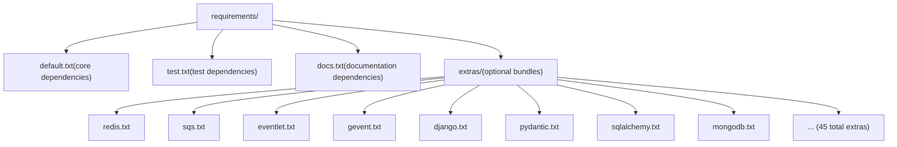
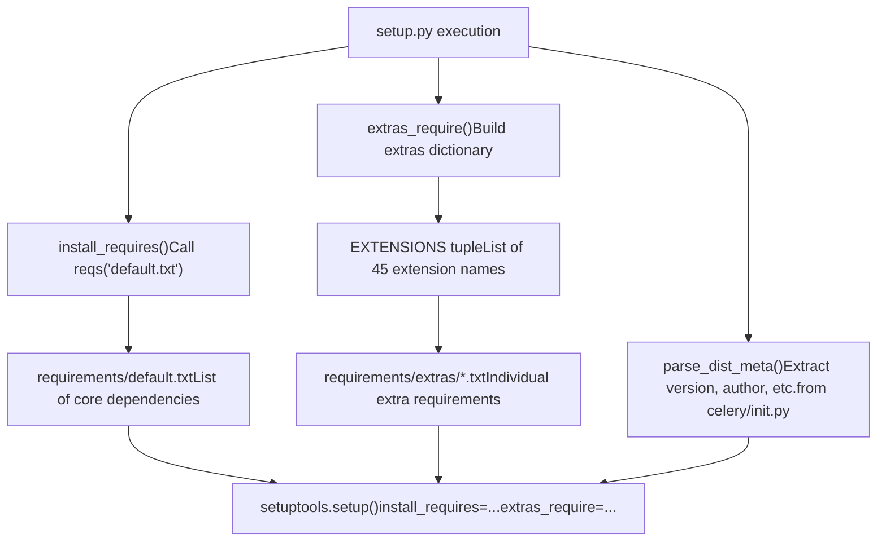

# 依赖与 Extras (Dependencies and Extras)

相关源文件

-   [docs/includes/installation.txt](https://github.com/celery/celery/blob/4d068b56/docs/includes/installation.txt)
-   [requirements/default.txt](https://github.com/celery/celery/blob/4d068b56/requirements/default.txt)
-   [setup.cfg](https://github.com/celery/celery/blob/4d068b56/setup.cfg)
-   [setup.py](https://github.com/celery/celery/blob/4d068b56/setup.py)

## 目的与范围

本文档详述了 Celery 的依赖管理系统，包括所有安装都必须具备的核心依赖，以及用于启用特定功能或集成的可选 extras。依赖系统在 [setup.py](https://github.com/celery/celery/blob/4d068b56/setup.py) 中定义，并通过 `requirements/` 目录结构进行组织。

有关包结构和分发的信息，请参阅[包结构](/celery/celery/11.1-package-structure)。有关版本管理和发布流程的信息，请参阅[版本管理与发布](/celery/celery/11.3-version-management-and-release)。

## 核心依赖 (Core Dependencies)

Celery 需要一组始终会被安装的最小核心依赖。这些依赖在 [requirements/default.txt1-10](https://github.com/celery/celery/blob/4d068b56/requirements/default.txt#L1-L10) 中定义，并通过 [setup.py149](https://github.com/celery/celery/blob/4d068b56/setup.py#L149-L149) 中的 `install_requires` 参数进行安装。

### 基本依赖项

| 依赖项 | 版本约束 | 用途 |
| --- | --- | --- |
| `kombu` | \>=5.6.0 | 消息代理抽象层，处理代理连接和消息路由 |
| `billiard` | \>=4.2.1,<5.0 | 为 prefork 并发模型提供的多进程池实现 |
| `vine` | \>=5.1.0,<6.0 | 内部使用的 Promise 和同步原语 |
| `click` | \>=8.1.2,<9.0 | 用于 `celery` 命令的命令行界面框架 |
| `click-didyoumean` | \>=0.3.0 | 为拼写错误的 CLI 命令提供建议功能 |
| `click-repl` | \>=0.2.0 | CLI 的交互式 REPL 模式 |
| `click-plugins` | \>=1.1.1 | 用于扩展 CLI 的插件系统 |
| `python-dateutil` | \>=2.8.2 | 用于调度的日期/时间解析和操作 |
| `exceptiongroup` | \>=1.3.0 | 为兼容 Python <3.11 提供的异常组支持 |
| `tzlocal` | (无约束) | 用于调度评估的本地时区检测 |

### Kombu：消息代理抽象

`kombu` 库是最关键的依赖项，它为多种消息代理提供了统一接口。Celery 的 AMQP 层 [celery/app/amqp.py](https://github.com/celery/celery/blob/4d068b56/celery/app/amqp.py) 使用 kombu 来抽象代理特定的细节，从而实现在不更改应用代码的情况下支持 RabbitMQ、Redis、Amazon SQS 和其他代理。

### Billiard：进程池管理

`billiard` 库是 Python multiprocessing 模块的一个分支，提供了 prefork 工作者池的实现。它被 [celery/concurrency/prefork.py](https://github.com/celery/celery/blob/4d068b56/celery/concurrency/prefork.py) 用于管理工作者进程，并增强了优雅停机和进程监控功能。即使使用其他并发模型，Billiard 也是必需的，因为它提供了核心同步原语。

### Vine：Promises 和回调 (Callbacks)

`vine` 库提供了贯穿 Celery 异步操作的 Promise 类对象和回调机制。它对于 canvas 工作流 [celery/canvas.py](https://github.com/celery/celery/blob/4d068b56/celery/canvas.py) 尤为重要，因为任务链和任务组需要协调异步结果。

### Click：CLI 框架

`click` 框架驱动了 Celery 的命令行界面 [celery/bin/](https://github.com/celery/celery/blob/4d068b56/celery/bin/)，提供了参数解析、帮助文本生成和命令组织功能。三个 click 扩展（`click-didyoumean`、`click-repl`、`click-plugins`）通过拼写建议、交互式 shell 和扩展性增强了可用性。

**来源：** [requirements/default.txt1-10](https://github.com/celery/celery/blob/4d068b56/requirements/default.txt#L1-L10) [setup.py117-119](https://github.com/celery/celery/blob/4d068b56/setup.py#L117-L119)

## 可选 Extras 系统

Celery 使用 setuptools 的 `extras_require` 机制来定义可选的功能捆绑包。每个 extra 对应 `requirements/extras/` 中的一个需求文件，并可以通过 `pip install celery[extra_name]` 进行安装。

### 扩展 (Extensions) 定义

[setup.py12-46](https://github.com/celery/celery/blob/4d068b56/setup.py#L12-L46) 中的 `EXTENSIONS` 元组列举了所有可用的 extras：

```python
EXTENSIONS = (
    'arangodb', 'auth', 'azureblockblob', 'brotli', 'cassandra',
    'consul', 'cosmosdbsql', 'couchbase', 'couchdb', 'django',
    'dynamodb', 'elasticsearch', 'eventlet', 'gevent', 'gcs',
    'librabbitmq', 'memcache', 'mongodb', 'msgpack', 'pymemcache',
    'pydantic', 'pyro', 'pytest', 'redis', 's3', 'slmq',
    'solar', 'sqlalchemy', 'sqs', 'tblib', 'yaml', 'zookeeper', 'zstd'
)
```
[setup.py122-124](https://github.com/celery/celery/blob/4d068b56/setup.py#L122-L124) 中的 `extras_require()` 函数通过读取 `requirements/extras/{extension}.txt` 中相应的文档，生成一个将每个扩展名称映射到其依赖项的字典。

### 依赖项分类


**来源：** [setup.py12-46](https://github.com/celery/celery/blob/4d068b56/setup.py#L12-L46) [setup.py122-124](https://github.com/celery/celery/blob/4d068b56/setup.py#L122-L124)

### 主要 Extras 类别

#### 代理和传输 (Transport) Extras

-   **`redis`**：通过 `redis-py` 库启用 Redis 作为消息代理和结果后端。
-   **`sqs`**：通过 `boto3` 启用 Amazon SQS 作为代理，并使用 `pycurl` 提高性能。
-   **`librabbitmq`**：提供一个更快的基于 C 的 AMQP 客户端，作为纯 Python 实现的替代方案。

#### 结果后端 (Result Backend) Extras

Celery 支持多种结果后端实现，每种都需要特定的数据库驱动程序：

-   **`sqlalchemy`**：通过 SQLAlchemy ORM 启用 SQL 数据库（PostgreSQL, MySQL, SQLite）。
-   **`mongodb`**：使用 `pymongo` 进行 MongoDB 结果存储。
-   **`redis`**：也可用作结果后端（与代理 extra 是同一个包）。
-   **`dynamodb`**：通过 `boto3` 使用 AWS DynamoDB。
-   **`cassandra`**：通过 `cassandra-driver` 使用 Apache Cassandra。
-   **`elasticsearch`**：通过官方 Python 客户端使用 Elasticsearch。
-   **云存储**：`azureblockblob`、`gcs`、`s3` 用于对象存储后端。

#### 并发模型 Extras

-   **`eventlet`**：使用 eventlet 库实现绿线程（Green thread）并发，适用于 I/O 密集型任务。
-   **`gevent`**：使用 gevent 和 libevent 实现的另一种绿线程方案。

#### 序列化与压缩 Extras

-   **`msgpack`**：通过 MessagePack 实现高效的二进制序列化。
-   **`yaml`**：支持 YAML 序列化。
-   **`auth`**：通过 `cryptography` 库实现消息签名和加密。
-   **`brotli`** 和 **`zstd`**：用于消息压缩的现代压缩算法。

#### 框架集成 Extras

-   **`django`**：用于设置和数据库连接管理的 Django 框架集成。
-   **`pydantic`**：使用 Pydantic 模型进行任务参数验证（v5.5+）。
-   **`pytest`**：通过 `pytest-celery` 提供的测试实用工具。

#### 调度与监控 Extras

-   **`solar`**：通过 `ephem` 库实现太阳事件调度（日出/日落）。
-   **`zookeeper`**：通过 `kazoo` 实现 Zookeeper 集成，用于分布式协调。
-   **`consul`**：用于服务发现的 Consul 集成。

**来源：** [setup.py12-46](https://github.com/celery/celery/blob/4d068b56/setup.py#L12-L46)

## Requirements 目录结构

`requirements/` 目录以分层结构组织依赖规范：


### 需求文件解析

[setup.py81-109](https://github.com/celery/celery/blob/4d068b56/setup.py#L81-L109) 模块实现了一个需求文件解析器，支持：

1.  **注释去除**：通过 [setup.py81-82](https://github.com/celery/celery/blob/4d068b56/setup.py#L81-L82) 的 `_strip_comments()` 忽略以 `#` 开头的行。
2.  **递归包含**：文件可以使用 `-r path/to/file.txt` 语法包含其他文件，由 [setup.py85-89](https://github.com/celery/celery/blob/4d068b56/setup.py#L85-L89) 的 `_pip_requirement()` 解析。
3.  **嵌套路径**：[setup.py100-109](https://github.com/celery/celery/blob/4d068b56/setup.py#L100-L109) 的 `reqs()` 函数接受可变路径组件，例如 `reqs('extras', 'redis.txt')` 会读取 `requirements/extras/redis.txt`。

[setup.py112-114](https://github.com/celery/celery/blob/4d068b56/setup.py#L112-L114) 的 `extras()` 助手函数是一个便捷包装器，它会自动在路径前加上 `extras/` 目录。

**来源：** [setup.py78-114](https://github.com/celery/celery/blob/4d068b56/setup.py#L78-L114)

## 安装模式

### 基础安装

不带 extras 安装 Celery 将提供核心功能：

```bash
pip install celery
```
这将仅安装来自 [requirements/default.txt](https://github.com/celery/celery/blob/4d068b56/requirements/default.txt) 的依赖项。

### 单个 Extra 安装

带上特定的 extra 安装以启用某项功能：

```bash
pip install celery[redis]      # Redis 代理和后端
pip install celery[eventlet]   # Eventlet 并发
pip install celery[pydantic]   # Pydantic 验证
```
### 多个 Extras 安装

使用逗号分隔组合多个 extras：

```bash
pip install celery[redis,eventlet,msgpack]
pip install celery[sqs,sqlalchemy,auth]
```
### 常用安装配置集

针对不同部署场景的典型安装组合：

| 配置集 | Extras | 用例 |
| --- | --- | --- |
| **Redis 栈** | `redis,msgpack` | 带有高效序列化的 Redis 代理/后端 |
| **RabbitMQ 栈** | `librabbitmq,msgpack` | 使用 C 客户端的高性能 RabbitMQ |
| **AWS 栈** | `sqs,dynamodb,s3` | 全面的 AWS 集成（SQS 代理，DynamoDB 结果） |
| **Django 集成** | `django,redis,msgpack` | 配合 Redis 使用的 Django 项目 |
| **异步 I/O** | `redis,gevent` 或 `redis,eventlet` | 使用绿线程的 I/O 密集型工作负载 |
| **类型安全** | `pydantic` | 使用 Pydantic 模型进行验证的项目 |

**来源：** [setup.py122-152](https://github.com/celery/celery/blob/4d068b56/setup.py#L122-L152)

## 依赖解析机制

setup.py 文件实现了一个多步骤的依赖解析过程：


### 解析步骤

1.  **元数据提取** ([setup.py63-76](https://github.com/celery/celery/blob/4d068b56/setup.py#L63-L76))：`parse_dist_meta()` 函数读取 [celery/\_\_init\_\_.py](https://github.com/celery/celery/blob/4d068b56/celery/__init__.py) 并使用正则表达式模式提取包元数据，如 `__version__`、`__author__` 等。

2.  **核心依赖** ([setup.py117-119](https://github.com/celery/celery/blob/4d068b56/setup.py#L117-L119))：`install_requires()` 函数调用 `reqs('default.txt')` 从 [requirements/default.txt](https://github.com/celery/celery/blob/4d068b56/requirements/default.txt) 加载核心依赖项。

3.  **Extras 字典生成** ([setup.py122-124](https://github.com/celery/celery/blob/4d068b56/setup.py#L122-L124))：`extras_require()` 函数遍历 `EXTENSIONS` 元组，为每个扩展调用 `extras(x + '.txt')` 以构建 extras 字典。

4.  **文件解析** ([setup.py92-109](https://github.com/celery/celery/blob/4d068b56/setup.py#L92-L109))：`_reqs()` 函数读取需求文件，去除注释，处理带有 `-r` 的递归包含，并返回扁平化的需求列表。

5.  **Setup 调用** ([setup.py137-182](https://github.com/celery/celery/blob/4d068b56/setup.py#L137-L182))：`setuptools.setup()` 调用接收 `install_requires` 和 `extras_require` 参数，setuptools 在 `pip install` 期间使用这些参数进行依赖解析。

**来源：** [setup.py63-124](https://github.com/celery/celery/blob/4d068b56/setup.py#L63-L124) [setup.py137-152](https://github.com/celery/celery/blob/4d068b56/setup.py#L137-L152)

## Python 版本约束

Celery 通过 [setup.py150](https://github.com/celery/celery/blob/4d068b56/setup.py#L150-L150) 的 `python_requires` 参数强制要求最低 Python 版本为 3.9。该包支持：

-   **CPython**：3.9, 3.10, 3.11, 3.12, 3.13。
-   **PyPy**：PyPy3（等同于 CPython 3.9+）。

该约束也反映在 [setup.py173-179](https://github.com/celery/celery/blob/4d068b56/setup.py#L173-L179) 的包分类器 (classifiers) 中，并已在 `tox.ini` 定义的矩阵中进行了测试（参见[测试矩阵与环境](/celery/celery/10.2-test-matrix-and-environments)）。

### 平台特定依赖项

[setup.cfg35-39](https://github.com/celery/celery/blob/4d068b56/setup.cfg#L35-L39) 文件定义了 RPM 特定的依赖项，其中包含针对旧版本 Python 的 backports：

-   针对 Python <3.9 的 `backports.zoneinfo>=0.2.1`（虽然现在要求 3.9+）。
-   针对时区数据库更新的 `tzdata>=2022.7`。

**来源：** [setup.py150](https://github.com/celery/celery/blob/4d068b56/setup.py#L150-L150) [setup.py166-181](https://github.com/celery/celery/blob/4d068b56/setup.py#L166-L181) [setup.cfg35-39](https://github.com/celery/celery/blob/4d068b56/setup.cfg#L35-L39)

## 开发依赖项

开发特定的依赖项与生产依赖项是分离的：

-   **测试依赖项**：在 `requirements/test.txt` 中定义，并通过 [setup.py151](https://github.com/celery/celery/blob/4d068b56/setup.py#L151-L151) 的 `tests_require` 安装。
-   **文档依赖项**：在 `requirements/docs.txt` 中为 Sphinx 及相关工具定义。

这些依赖项不会随包一起安装，而是用于开发环境和 CI/CD 流水线。有关其用法的详情，请参阅[测试基础设施](/celery/celery/10.1-testing-infrastructure)和文档系统。

**来源：** [setup.py151](https://github.com/celery/celery/blob/4d068b56/setup.py#L151-L151)

## 控制台脚本入口点

setup.py 文件在 [setup.py154-158](https://github.com/celery/celery/blob/4d068b56/setup.py#L154-L158) 注册了一个控制台脚本入口点：

```python
entry_points={
    'console_scripts': [
        'celery = celery.__main__:main',
    ]
}
```
这创建了 `celery` 命令行可执行文件，它会调用 [celery/\_\_main\_\_.py](https://github.com/celery/celery/blob/4d068b56/celery/__main__.py) 中的 `main()` 函数。这种机制允许 CLI 在安装后在全系统范围内可用，而无需显式执行 Python 模块 (`python -m celery`)。

**来源：** [setup.py154-158](https://github.com/celery/celery/blob/4d068b56/setup.py#L154-L158)
