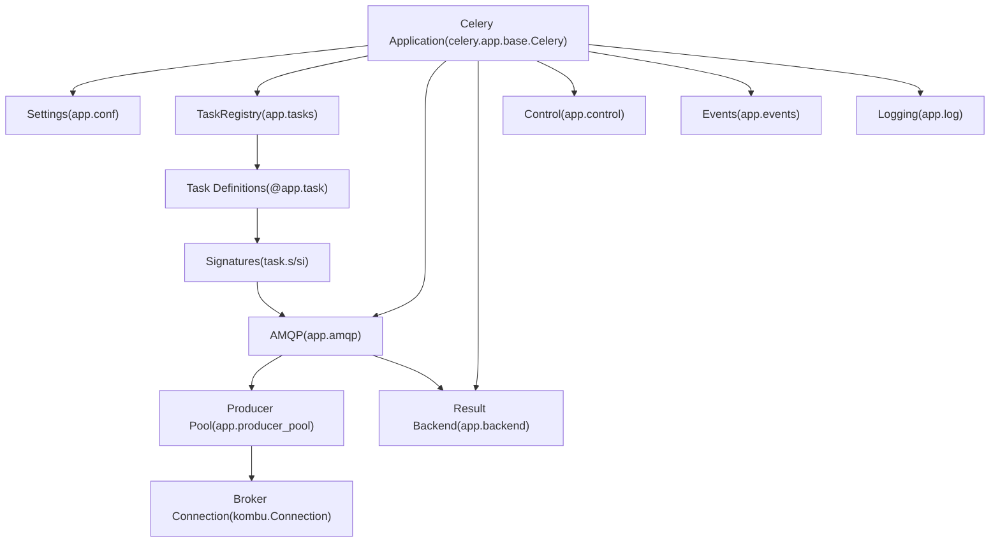
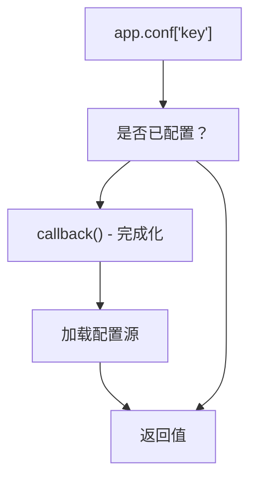
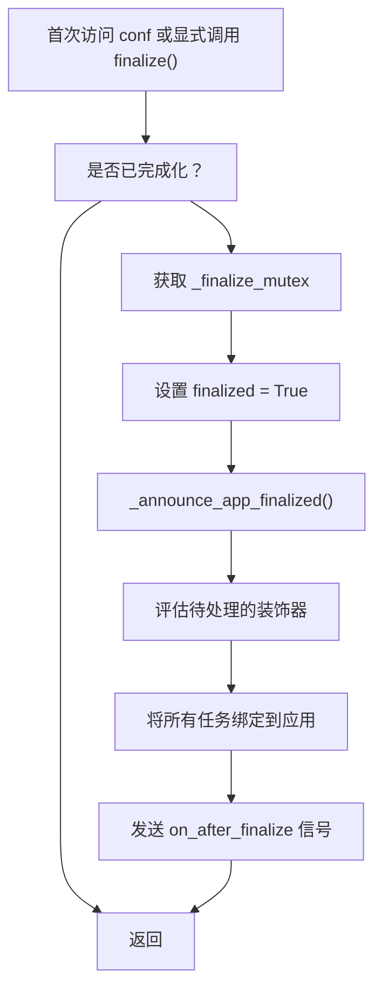
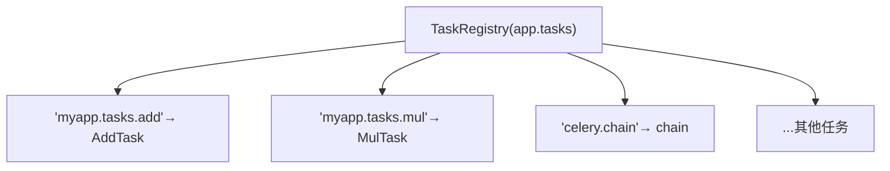
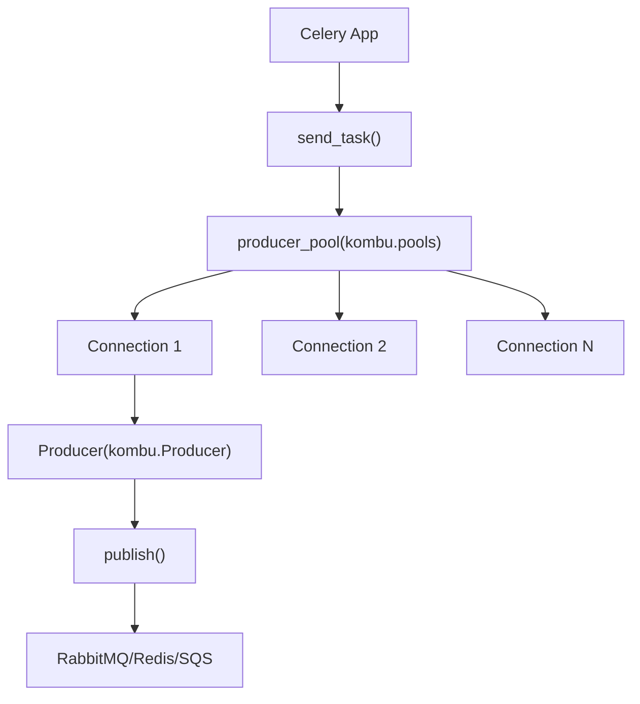
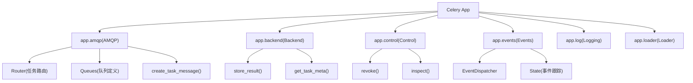
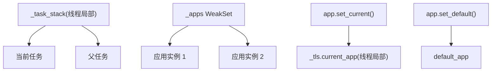

# Celery 应用

相关源文件

-   [celery/app/amqp.py](https://github.com/celery/celery/blob/4d068b56/celery/app/amqp.py)
-   [celery/app/base.py](https://github.com/celery/celery/blob/4d068b56/celery/app/base.py)
-   [celery/app/task.py](https://github.com/celery/celery/blob/4d068b56/celery/app/task.py)
-   [celery/canvas.py](https://github.com/celery/celery/blob/4d068b56/celery/canvas.py)
-   [celery/utils/\_\_init\_\_.py](https://github.com/celery/celery/blob/4d068b56/celery/utils/__init__.py)
-   [docs/userguide/canvas.rst](https://github.com/celery/celery/blob/4d068b56/docs/userguide/canvas.rst)
-   [t/integration/conftest.py](https://github.com/celery/celery/blob/4d068b56/t/integration/conftest.py)
-   [t/integration/tasks.py](https://github.com/celery/celery/blob/4d068b56/t/integration/tasks.py)
-   [t/integration/test\_canvas.py](https://github.com/celery/celery/blob/4d068b56/t/integration/test_canvas.py)
-   [t/integration/test\_quorum\_queue\_qos\_cluster\_simulation.py](https://github.com/celery/celery/blob/4d068b56/t/integration/test_quorum_queue_qos_cluster_simulation.py)
-   [t/integration/test\_security.py](https://github.com/celery/celery/blob/4d068b56/t/integration/test_security.py)
-   [t/integration/test\_tasks.py](https://github.com/celery/celery/blob/4d068b56/t/integration/test_tasks.py)
-   [t/smoke/tests/test\_canvas.py](https://github.com/celery/celery/blob/4d068b56/t/smoke/tests/test_canvas.py)
-   [t/unit/app/test\_app.py](https://github.com/celery/celery/blob/4d068b56/t/unit/app/test_app.py)
-   [t/unit/tasks/test\_canvas.py](https://github.com/celery/celery/blob/4d068b56/t/unit/tasks/test_canvas.py)
-   [t/unit/tasks/test\_tasks.py](https://github.com/celery/celery/blob/4d068b56/t/unit/tasks/test_tasks.py)

## 目的与范围

本文档描述了 **Celery 应用类** (`celery.app.base.Celery`)，它是配置和管理 Celery 部署的核心入口点。应用实例协调所有主要的子系统，包括任务注册、消息代理连接、结果后端和工作者管理。

有关以下内容的信息：

-   详细的配置来源和设置管理，请参阅 [2.1](/celery/celery/2.1-application-initialization-and-configuration)
-   任务装饰器的用法和任务注册表，请参阅 [2.2](/celery/celery/2.2-task-registration)
-   代理配置和路由规则，请参阅 [2.3](/celery/celery/2.3-message-brokers-and-routing)
-   消息协议和 AMQP 集成细节，请参阅 [2.4](/celery/celery/2.4-amqp-layer-and-message-protocol)
-   任务执行与生命周期，请参阅 [3](/celery/celery/3-tasks)
-   工作者架构，请参阅 [5](/celery/celery/5-workers)

---

## Celery 类

定义在 [celery/app/base.py230-1288](https://github.com/celery/celery/blob/4d068b56/celery/app/base.py#L230-L1288) 中的 `Celery` 类是主要的应用程序对象。每个 Celery 部署都会实例化此类，以创建一个管理配置、任务注册、代理连接和组件协调的应用实例。

### 类定义与核心属性

```
class Celery:
    """Celery application.

    Arguments:
        main (str): Name of the main module if running as `__main__`.
        broker (str): URL of the default broker used.
        backend (str): The result store backend class or name.
        autofinalize (bool): If False, raises RuntimeError if task registry
            or tasks are used before the app is finalized.
        set_as_current (bool): Make this the global current app.
    """
```
**关键属性：**

-   `main`：在自动生成任务名称时使用的模块名称
-   `conf`：带有配置键值对的设置对象
-   `tasks`：任务注册表（TaskRegistry 实例）
-   `amqp`：用于创建和路由消息的 AMQP 接口
-   `backend`：用于存储任务结果的结果后端（result backend）
-   `control`：用于工作者管理的控制接口
-   `events`：事件监控系统
-   `loader`：配置加载器
-   `log`：日志配置

来源：[celery/app/base.py230-348](https://github.com/celery/celery/blob/4d068b56/celery/app/base.py#L230-L348)

---

## 应用架构

下图展示了 Celery 应用的高层架构及其与其他组件的关系：


**组件关系：**

| 组件 | 类/模块 | 目的 |
| --- | --- | --- |
| 应用 (Application) | `celery.app.base.Celery` | 核心协调器 |
| 设置 (Settings) | `celery.app.utils.Settings` | 配置管理 |
| 任务注册表 (Task Registry) | `celery.app.registry.TaskRegistry` | 映射任务名称到任务类 |
| AMQP | `celery.app.amqp.AMQP` | 消息创建与路由 |
| 后端 (Backend) | `celery.backends.base.Backend` | 结果存储 |
| 控制 (Control) | `celery.app.control.Control` | 工作者控制命令 |
| 事件 (Events) | `celery.app.events.Events` | 事件监控 |

来源：[celery/app/base.py230-408](https://github.com/celery/celery/blob/4d068b56/celery/app/base.py#L230-L408) [celery/app/amqp.py219-301](https://github.com/celery/celery/blob/4d068b56/celery/app/amqp.py#L219-L301)

---

## 应用初始化

Celery 应用遵循带有延迟配置（lazy configuration）和完成化（finalization）的多阶段初始化模式：

> **[Mermaid stateDiagram]**
> *(图表结构无法解析)*

### 构造函数参数

`__init__` 方法接受以下关键参数：

| 参数 | 类型 | 默认值 | 描述 |
| --- | --- | --- | --- |
| `main` | str | None | 用于任务命名的主模块名称 |
| `broker` | str | None | 代理 URL |
| `backend` | str | None | 结果后端 URL 或类 |
| `loader` | str | None | 配置加载器类 |
| `config_source` | obj/str | None | 配置对象或模块 |
| `task_cls` | str/class | `'celery.app.task:Task'` | 基础任务类 |
| `autofinalize` | bool | True | 首次使用时自动完成化 |
| `set_as_current` | bool | True | 设置为当前应用 |
| `namespace` | str | None | 配置命名空间 |

来源：[celery/app/base.py317-408](https://github.com/celery/celery/blob/4d068b56/celery/app/base.py#L317-L408)

### 初始化序列

> **[Mermaid sequence]**
> *(图表结构无法解析)*

初始化过程：

1.  **线程局部存储 (Thread-local storage)** - 为每个线程的状态创建 `threading.local()`
2.  **时钟 (Clock)** - 初始化用于分布式事件排序的 Lamport 时钟
3.  **配置 (Configuration)** - 创建推迟加载的 `PendingConfiguration` 包装器
4.  **任务注册表 (Task registry)** - 创建或使用提供的 `TaskRegistry`
5.  **修整 (Fixups)** - 应用框架集成（如 Django 等）
6.  **注册 (Registration)** - 在全局 `_state` 模块中注册应用
7.  **当前应用 (Current app)** - 可选地将其设置为此线程的当前应用

来源：[celery/app/base.py317-408](https://github.com/celery/celery/blob/4d068b56/celery/app/base.py#L317-L408)

---

## 配置系统

Celery 应用使用一个两层配置系统：用于延迟加载的 `PendingConfiguration` 和用于已完成化配置的 `Settings`。

### PendingConfiguration

`PendingConfiguration` 类实现了延迟配置加载：


**关键特性：**

-   配置直到第一次访问时才会加载
-   访问任何配置键都会触发完成化（finalization）
-   允许在加载前设置预配置值
-   使用 `AttributeDictMixin` 支持字典式和属性式访问

来源：[celery/app/base.py186-228](https://github.com/celery/celery/blob/4d068b56/celery/app/base.py#L186-L228)

### 配置加载方法

应用提供了多种加载配置的方法：

| 方法 | 来源类型 | 示例 |
| --- | --- | --- |
| `config_from_object()` | 模块/对象 | `app.config_from_object('celeryconfig')` |
| `config_from_envvar()` | 环境变量 | `app.config_from_envvar('CELERY_CONFIG_MODULE')` |
| `config_from_cmdline()` | 命令行参数 | `app.config_from_cmdline(argv)` |
| 构造函数 `config_source` | 直接对象 | `Celery(config_source=obj)` |

**配置优先级：**

1.  传递给构造函数的关键字参数（`broker`、`backend` 等）
2.  配置源（`config_from_object` 等）
3.  来自 `celery.app.defaults` 的默认值

来源：[celery/app/base.py677-723](https://github.com/celery/celery/blob/4d068b56/celery/app/base.py#L677-L723)

---

## 应用完成化 (Application Finalization)

完成化是完成应用设置并使其准备就绪的过程：


### 完成化过程

`finalize()` 方法执行以下步骤：

1.  **锁获取** - 使用 `threading.RLock()` 确保线程安全
2.  **待处理装饰器** - 评估被推迟的 `@app.task` 装饰器
3.  **任务绑定** - 将所有注册的任务绑定到应用
4.  **信号发送** - 发送 `on_after_finalize` 信号

**自动完成化 (Auto-finalization)：**

-   当 `autofinalize=True`（默认值）时，完成化会在首次使用时自动发生
-   当 `autofinalize=False` 时，必须显式调用 `app.finalize()`
-   访问任务注册表或配置都会触发完成化

来源：[celery/app/base.py631-651](https://github.com/celery/celery/blob/4d068b56/celery/app/base.py#L631-L651)

---

## 任务管理

应用通过 `TaskRegistry` 管理任务注册，并提供 `@app.task` 装饰器来定义任务。

### 任务注册流

> **[Mermaid sequence]**
> *(图表结构无法解析)*

### @app.task 装饰器

`task()` 方法从函数创建任务类：

**关键特性：**

-   **延迟评估 (Lazy evaluation)** - 如果应用未完成化，则返回 `PromiseProxy`
-   **共享任务 (Shared tasks)** - 可以通过 `connect_on_app_finalize` 创建供多个应用使用的任务
-   **自定义基类** - 接受用于任务继承的 `base` 参数
-   **绑定 (Binding)** - `bind=True` 会将任务实例作为第一个参数传递
-   **任务命名** - 根据模块和函数名称自动生成名称

**常用的装饰器参数：**

| 参数 | 类型 | 描述 |
| --- | --- | --- |
| `name` | str | 显式任务名称（默认：自动生成） |
| `bind` | bool | 将任务实例作为第一个参数传递 |
| `base` | class | 自定义任务基类 |
| `max_retries` | int | 最大重试次数 |
| `autoretry_for` | tuple | 自动重试的异常类型 |
| `acks_late` | bool | 执行后确认（acknowledge） |
| `ignore_result` | bool | 不存储结果 |

来源：[celery/app/base.py489-608](https://github.com/celery/celery/blob/4d068b56/celery/app/base.py#L489-L608)

### 任务注册表 (Task Registry)

`TaskRegistry` 维护任务名称到任务类的映射：


**注册表操作：**

-   `app.tasks[name]` - 根据名称获取任务
-   `app.tasks.keys()` - 列出所有任务名称
-   `app.register_task(task)` - 手动注册任务
-   通过 `@app.task` 装饰器自动注册任务

来源：[celery/app/base.py609-626](https://github.com/celery/celery/blob/4d068b56/celery/app/base.py#L609-L626) [celery/app/registry.py](https://github.com/celery/celery/blob/4d068b56/celery/app/registry.py)

---

## 连接与生产者管理

应用通过连接池（connection pools）和生产者池（producer pools）管理代理连接（broker connections）。

### 连接架构


### 连接方法

应用提供了几种连接管理方法：

| 方法 | 目的 | 上下文管理器 |
| --- | --- | --- |
| `connection()` | 创建新连接 | 是 |
| `connection_for_read()` | 用于消费的连接 | 是 |
| `connection_for_write()` | 用于发布的连接 | 是 |
| `connection_or_acquire()` | 使用现有连接或创建新连接 | 否 |
| `producer_or_acquire()` | 从池中获取生产者 | 否 |

**用法示例：**

```
# 使用上下文管理器
with app.connection_for_write() as conn:
    with app.Producer(conn) as producer:
        producer.publish(...)

# 使用池
with app.producer_or_acquire() as producer:
    producer.publish(...)
```
来源：[celery/app/base.py961-1032](https://github.com/celery/celery/blob/4d068b56/celery/app/base.py#L961-L1032)

### 生产者池 (Producer Pool)

`producer_pool` 是一个缓存属性，它创建一个连接池以实现高效的连接复用：

```
@cached_property
def producer_pool(self):
    """用于连接复用的生产者池"""
    return pools.producers[self.connection_for_write()]
```
**益处：**

-   避免为每个任务产生连接开销
-   自动管理连接生命周期
-   线程安全的连接池
-   可通过 `broker_pool_limit` 设置进行配置

来源：[celery/app/base.py1366-1371](https://github.com/celery/celery/blob/4d068b56/celery/app/base.py#L1366-L1371)

---

## 关键应用组件

Celery 应用通过组件对象协调几个主要的子系统：

### 组件概览


### 组件类

| 组件 | 类 | 模块 | 目的 |
| --- | --- | --- | --- |
| AMQP | `AMQP` | `celery.app.amqp` | 消息协议与路由 |
| 后端 (Backend) | Backend 子类 | `celery.backends.*` | 结果存储 |
| 控制 (Control) | `Control` | `celery.app.control` | 工作者管理 |
| 事件 (Events) | `Events` | `celery.app.events` | 事件系统 |
| 日志 (Log) | `Logging` | `celery.app.log` | 日志配置 |
| 加载器 (Loader) | Loader 子类 | `celery.loaders.*` | 配置加载 |

来源：[celery/app/base.py289-296](https://github.com/celery/celery/blob/4d068b56/celery/app/base.py#L289-L296)

### AMQP 组件

`app.amqp` 组件处理消息创建和路由：

**关键方法：**

-   `create_task_message()` - 创建 v1 或 v2 协议消息
-   `send_task_message()` - 将消息发布到代理
-   `Router()` - 创建用于任务路由的路由器
-   `Queues()` - 创建队列定义

来源：[celery/app/amqp.py219-301](https://github.com/celery/celery/blob/4d068b56/celery/app/amqp.py#L219-L301)

### 后端组件 (Backend Component)

`app.backend` 提供结果存储：

**关键方法：**

-   `store_result()` - 保存任务结果
-   `get_task_meta()` - 检索任务元数据
-   `mark_as_started()` - 将任务标记为已开始
-   `mark_as_done()` - 将任务标记为已完成
-   `mark_as_failure()` - 将任务标记为失败

后端是延迟初始化的，并缓存于 `_backend_cache` 中。

来源：[celery/app/base.py1248-1273](https://github.com/celery/celery/blob/4d068b56/celery/app/base.py#L1248-L1273)

---

## 任务调用

应用提供了 `send_task()` 方法，用于按名称调用任务，而无需导入任务定义：

### send\_task() 方法

> **[Mermaid sequence]**
> *(图表结构无法解析)*

**方法签名：**

```
def send_task(self, name, args=None, kwargs=None,
              countdown=None, eta=None, task_id=None,
              producer=None, connection=None, router=None,
              result_cls=None, expires=None, link=None,
              link_error=None, **options):
    """按名称发送任务而无需导入任务定义"""
```
**关键特性：**

-   无需导入即可调用任务
-   支持所有任务选项（countdown、eta、expires 等）
-   处理父子任务关系
-   管理用于追踪的 root\_id 和 parent\_id
-   支持从父任务继承优先级

来源：[celery/app/base.py820-959](https://github.com/celery/celery/blob/4d068b56/celery/app/base.py#L820-L959)

---

## 应用上下文与状态

Celery 维护全局和线程局部的应用状态：

### 全局状态管理


### 上下文方法

| 方法 | 作用域 | 目的 |
| --- | --- | --- |
| `app.set_current()` | 线程 | 设置为该线程的当前应用 |
| `app.set_default()` | 全局 | 设置为所有线程的默认应用 |
| `get_current_app()` | 线程 | 从线程局部获取当前应用 |
| `current_app` | 线程 | 访问当前应用的属性 |

**用法：**

```
app = Celery('myapp', set_as_current=True)  # 自动设置为当前应用

# 或者手动设置
app.set_current()  # 针对此线程
app.set_default()  # 针对所有线程
```
来源：[celery/app/base.py426-432](https://github.com/celery/celery/blob/4d068b56/celery/app/base.py#L426-L432) [celery/\_state.py](https://github.com/celery/celery/blob/4d068b56/celery/_state.py)

---

## 高级应用特性

### 自动发现 (Autodiscovery)

应用可以自动发现并导入任务模块：

```
app.autodiscover_tasks(['myapp.tasks', 'myapp.workers'])
```
**工作原理：**

1.  在每个包中搜索 `tasks.py`（或自定义名称）
2.  导入模块以触发 `@app.task` 装饰器
3.  可以是延迟的（推迟）或立即的（强制）
4.  与框架修整（fixups）集成（例如，Django 自动发现已安装的应用）

来源：[celery/app/base.py756-818](https://github.com/celery/celery/blob/4d068b56/celery/app/base.py#L756-L818)

### 信号 (Signals)

应用在关键生命周期点发出信号：

| 信号 | 发出时机 | 使用场景 |
| --- | --- | --- |
| `on_configure` | 配置加载开始时 | 预配置钩子 |
| `on_after_configure` | 配置已加载 | 配置后校验 |
| `on_after_finalize` | 应用已完成化 | 组件初始化 |
| `on_after_fork` | 工作者进程派生（fork）后 | 重置连接 |

```
from celery.signals import on_after_configure

@on_after_configure.connect
def configure_workers(sender, **kwargs):
    # 自定义配置逻辑
    pass
```
来源：[celery/app/base.py393-401](https://github.com/celery/celery/blob/4d068b56/celery/app/base.py#L393-L401)

### 修整 (Fixups)

修整是将 Celery 与框架集成的插件：

**内置修整：**

-   `celery.fixups.django:fixup` - Django 集成

修整可以：

-   修改配置
-   挂钩到生命周期事件
-   提供框架特定的特性
-   从框架组件中自动发现任务

来源：[celery/app/base.py385-387](https://github.com/celery/celery/blob/4d068b56/celery/app/base.py#L385-L387)

---

## 应用生命周期摘要

Celery 应用的完整生命周期：

> **[Mermaid stateDiagram]**
> *(图表结构无法解析)*

**典型使用模式：**

1.  **创建应用** - `app = Celery('myapp')`
2.  **配置** - `app.config_from_object('celeryconfig')`
3.  **定义任务** - `@app.task` 装饰器
4.  **完成化** - 首次使用时自动完成
5.  **使用应用** - 发送任务，启动工作者

来源：[celery/app/base.py230-1288](https://github.com/celery/celery/blob/4d068b56/celery/app/base.py#L230-L1288)

---

## 总结

Celery 应用 (`celery.app.base.Celery`) 是所有 Celery 操作的核心协调器：

**核心职责：**

-   通过 `Settings` 和 `PendingConfiguration` 进行配置管理
-   通过 `TaskRegistry` 进行任务注册表管理
-   通过 `producer_pool` 进行连接池管理
-   组件协调（AMQP、后端、控制、事件）
-   生命周期管理（初始化、完成化、清理）

**关键设计模式：**

-   **延迟初始化 (Lazy initialization)** - 配置和完成化推迟到需要时进行
-   **组件注入 (Component injection)** - 可插拔的加载器、后端、任务类
-   **上下文管理 (Context management)** - 线程局部和全局应用状态
-   **基于信号的钩子 (Signal-based hooks)** - 生命周期事件通知

**相关文档：**

-   有关配置详情，请参阅 [2.1](/celery/celery/2.1-application-initialization-and-configuration)
-   有关任务注册机制，请参阅 [2.2](/celery/celery/2.2-task-registration)
-   有关代理和路由配置，请参阅 [2.3](/celery/celery/2.3-message-brokers-and-routing)
-   有关消息协议详情，请参阅 [2.4](/celery/celery/2.4-amqp-layer-and-message-protocol)

来源：[celery/app/base.py230-1288](https://github.com/celery/celery/blob/4d068b56/celery/app/base.py#L230-L1288) [celery/app/amqp.py219-301](https://github.com/celery/celery/blob/4d068b56/celery/app/amqp.py#L219-L301) [celery/app/utils.py](https://github.com/celery/celery/blob/4d068b56/celery/app/utils.py)
