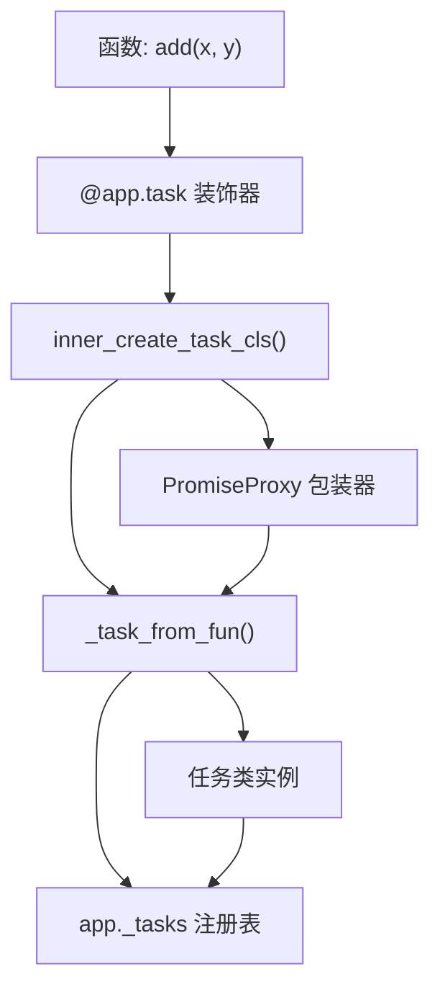
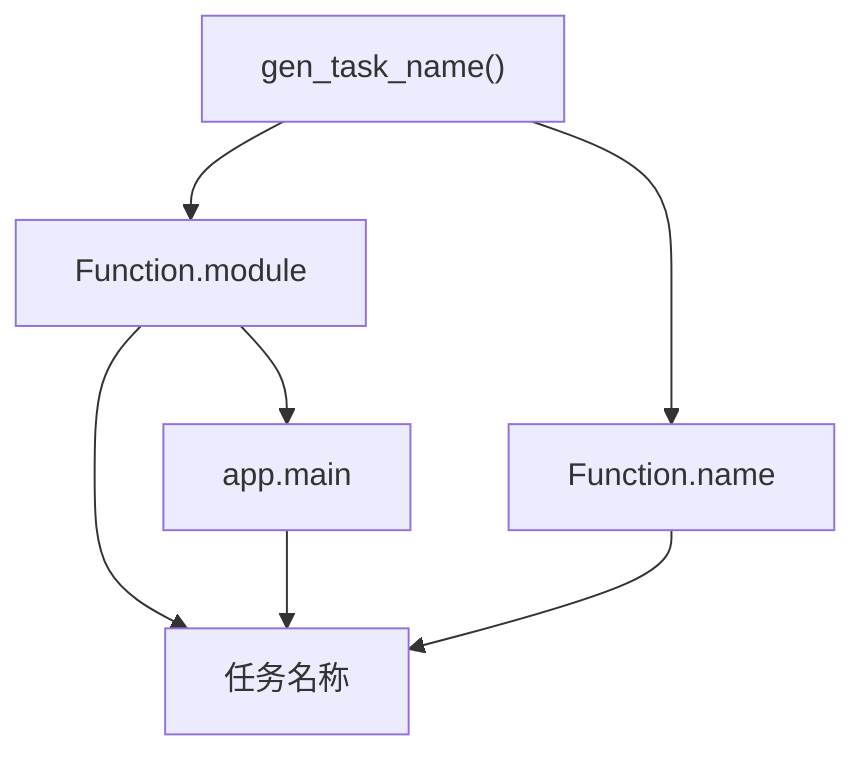
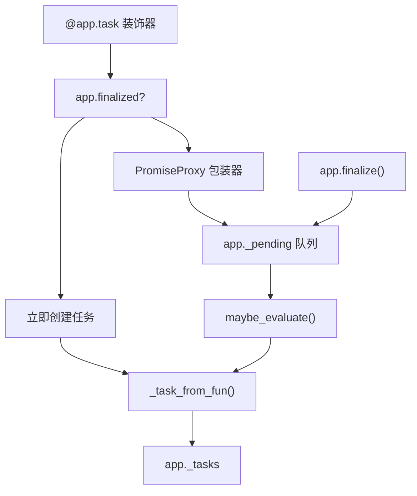
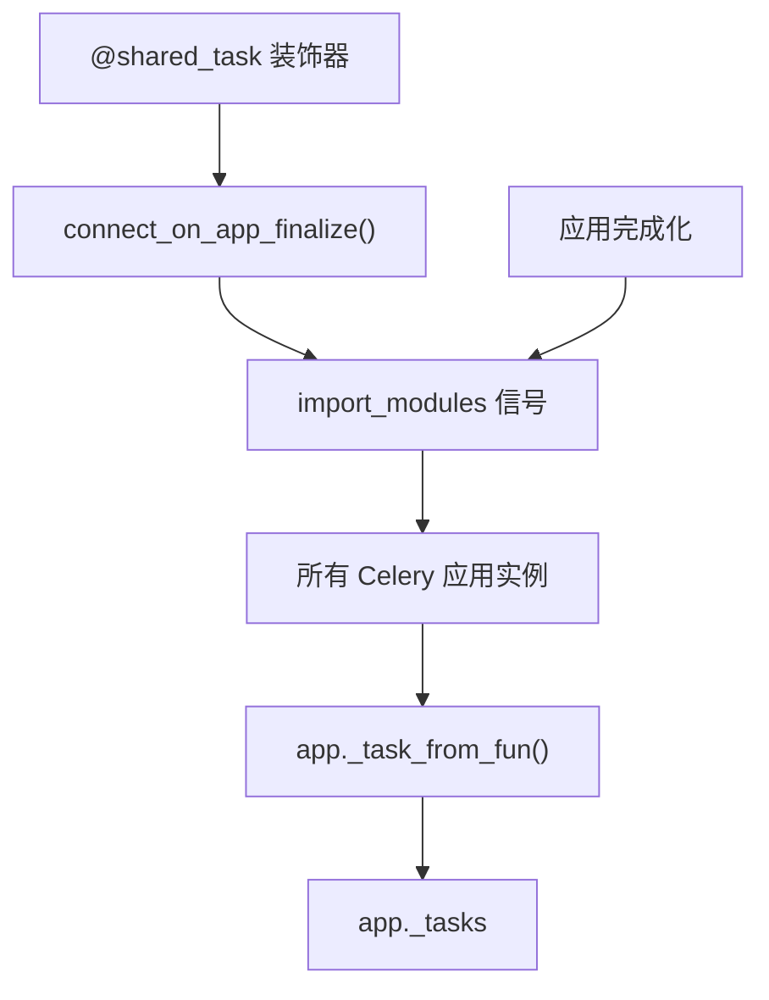
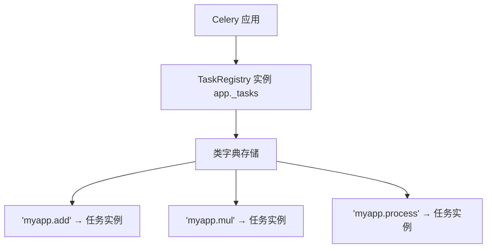
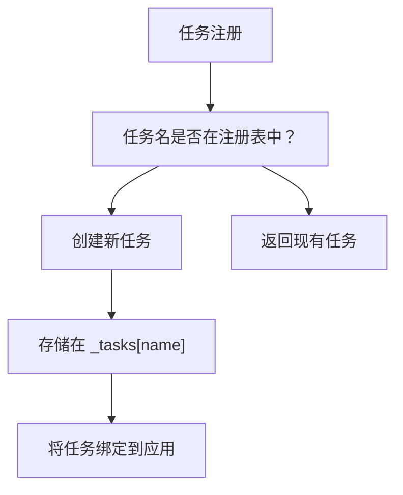
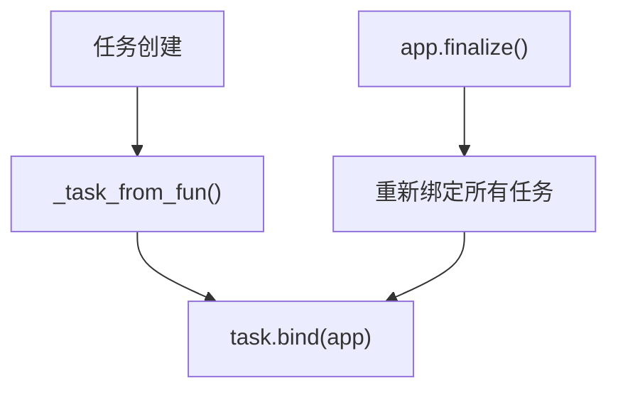

# 任务注册

相关源文件

-   [celery/app/amqp.py](https://github.com/celery/celery/blob/4d068b56/celery/app/amqp.py)
-   [celery/app/base.py](https://github.com/celery/celery/blob/4d068b56/celery/app/base.py)
-   [celery/app/defaults.py](https://github.com/celery/celery/blob/4d068b56/celery/app/defaults.py)
-   [celery/app/task.py](https://github.com/celery/celery/blob/4d068b56/celery/app/task.py)
-   [celery/canvas.py](https://github.com/celery/celery/blob/4d068b56/celery/canvas.py)
-   [celery/utils/\_\_init\_\_.py](https://github.com/celery/celery/blob/4d068b56/celery/utils/__init__.py)
-   [docs/faq.rst](https://github.com/celery/celery/blob/4d068b56/docs/faq.rst)
-   [docs/getting-started/first-steps-with-celery.rst](https://github.com/celery/celery/blob/4d068b56/docs/getting-started/first-steps-with-celery.rst)
-   [docs/getting-started/next-steps.rst](https://github.com/celery/celery/blob/4d068b56/docs/getting-started/next-steps.rst)
-   [docs/userguide/calling.rst](https://github.com/celery/celery/blob/4d068b56/docs/userguide/calling.rst)
-   [docs/userguide/canvas.rst](https://github.com/celery/celery/blob/4d068b56/docs/userguide/canvas.rst)
-   [docs/userguide/monitoring.rst](https://github.com/celery/celery/blob/4d068b56/docs/userguide/monitoring.rst)
-   [docs/userguide/periodic-tasks.rst](https://github.com/celery/celery/blob/4d068b56/docs/userguide/periodic-tasks.rst)
-   [docs/userguide/routing.rst](https://github.com/celery/celery/blob/4d068b56/docs/userguide/routing.rst)
-   [docs/userguide/tasks.rst](https://github.com/celery/celery/blob/4d068b56/docs/userguide/tasks.rst)
-   [docs/userguide/workers.rst](https://github.com/celery/celery/blob/4d068b56/docs/userguide/workers.rst)
-   [t/integration/conftest.py](https://github.com/celery/celery/blob/4d068b56/t/integration/conftest.py)
-   [t/integration/tasks.py](https://github.com/celery/celery/blob/4d068b56/t/integration/tasks.py)
-   [t/integration/test\_canvas.py](https://github.com/celery/celery/blob/4d068b56/t/integration/test_canvas.py)
-   [t/integration/test\_quorum\_queue\_qos\_cluster\_simulation.py](https://github.com/celery/celery/blob/4d068b56/t/integration/test_quorum_queue_qos_cluster_simulation.py)
-   [t/integration/test\_security.py](https://github.com/celery/celery/blob/4d068b56/t/integration/test_security.py)
-   [t/integration/test\_tasks.py](https://github.com/celery/celery/blob/4d068b56/t/integration/test_tasks.py)
-   [t/smoke/tests/test\_canvas.py](https://github.com/celery/celery/blob/4d068b56/t/smoke/tests/test_canvas.py)
-   [t/unit/app/test\_app.py](https://github.com/celery/celery/blob/4d068b56/t/unit/app/test_app.py)
-   [t/unit/tasks/test\_canvas.py](https://github.com/celery/celery/blob/4d068b56/t/unit/tasks/test_canvas.py)
-   [t/unit/tasks/test\_tasks.py](https://github.com/celery/celery/blob/4d068b56/t/unit/tasks/test_tasks.py)

任务注册（Task registration）是将可调用函数转换为 Celery 任务实例并将其与 Celery 应用（application）关联的过程。本页面记录了 `@app.task` 装饰器、任务注册表（task registry）、延迟评估（lazy evaluation）机制以及共享任务（shared task）模式。

有关任务执行和生命周期的信息，请参阅[任务生命周期与状态](/celery/celery/3.2-task-lifecycle-and-states)。有关调用任务的详细信息，请参阅[任务定义与调用](/celery/celery/3.1-task-definition-and-invocation)。

## 概览

任务通过 `@app.task` 装饰器向 Celery 应用实例注册。注册过程包括：

1.  将函数封装在任务类（Task class）中
2.  生成或分配一个唯一的名称
3.  将任务存储在应用的任务注册表中
4.  将任务绑定（bind）到应用

注册表作为一个中央查找表，将任务名称映射到任务实例，使得工作者（workers）在消息到达时能够定位并执行任务。

**来源：** [celery/app/base.py489-608](https://github.com/celery/celery/blob/4d068b56/celery/app/base.py#L489-L608) [docs/userguide/tasks.rst89-147](https://github.com/celery/celery/blob/4d068b56/docs/userguide/tasks.rst#L89-L147)

## 任务装饰器

### 基本用法

`@app.task` 装饰器将一个普通的 Python 函数转换为 Celery 任务：

```
@app.task
def add(x, y):
    return x + y
```
这将创建一个带有自动生成名称（例如 `"module.add"`）的任务实例，并将其注册到应用中。

**来源：** [celery/app/base.py489-559](https://github.com/celery/celery/blob/4d068b56/celery/app/base.py#L489-L559) [docs/getting-started/first-steps-with-celery.rst130-150](https://github.com/celery/celery/blob/4d068b56/docs/getting-started/first-steps-with-celery.rst#L130-L150)

### 装饰器原理


**装饰器执行流程**

装饰器的实现遵循以下路径：

1.  **装饰器调用** [celery/app/base.py489](https://github.com/celery/celery/blob/4d068b56/celery/app/base.py#L489-L489) - 调用 `app.task()` 并带有可选参数
2.  **内部函数创建** [celery/app/base.py528-549](https://github.com/celery/celery/blob/4d068b56/celery/app/base.py#L528-L549) - `inner_create_task_cls()` 定义了实际的装饰逻辑
3.  **延迟评估与立即评估** [celery/app/base.py538-544](https://github.com/celery/celery/blob/4d068b56/celery/app/base.py#L538-L544)：
    -   如果 `lazy=True` 且应用未完成化：返回 `PromiseProxy`
    -   如果 `lazy=False` 或应用已完成化：立即调用 `_task_from_fun()`
4.  **任务创建** [celery/app/base.py564-607](https://github.com/celery/celery/blob/4d068b56/celery/app/base.py#L564-L607) - `_task_from_fun()` 构造任务类
5.  **注册表存储** [celery/app/base.py602](https://github.com/celery/celery/blob/4d068b56/celery/app/base.py#L602-L602) - 任务存储在 `app._tasks[task.name]` 中

**来源：** [celery/app/base.py489-607](https://github.com/celery/celery/blob/4d068b56/celery/app/base.py#L489-L607)

### 装饰器选项

该装饰器接受众多配置任务行为的选项：

| 选项 | 目的 | 示例 |
| --- | --- | --- |
| `name` | 显式任务名称 | `@app.task(name='myapp.add')` |
| `bind` | 将任务实例绑定为第一个参数 | `@app.task(bind=True)` |
| `base` | 自定义基类 | `@app.task(base=MyTask)` |
| `pydantic` | 启用 Pydantic 校验 | `@app.task(pydantic=True)` |
| `shared` | 注册为共享任务 | `@app.task(shared=True)` |
| `lazy` | 启用延迟评估 | `@app.task(lazy=True)` |

所有关键字参数都将成为生成的任务类的属性 [celery/app/base.py586-595](https://github.com/celery/celery/blob/4d068b56/celery/app/base.py#L586-L595)

**来源：** [celery/app/base.py489-559](https://github.com/celery/celery/blob/4d068b56/celery/app/base.py#L489-L559) [docs/userguide/tasks.rst106-114](https://github.com/celery/celery/blob/4d068b56/docs/userguide/tasks.rst#L106-L114)

## 任务命名

### 自动名称生成

当未提供显式 `name` 时，Celery 使用以下模式生成名称：

```
<模块名称>.<函数名称>
```
生成过程发生在 `gen_task_name()` 中：


名称生成逻辑 \[celery/utils/imports.py\]（在 [celery/app/base.py628-629](https://github.com/celery/celery/blob/4d068b56/celery/app/base.py#L628-L629) 中被引用）：

1.  使用 `fun.__module__` 作为命名空间
2.  如果模块是 `"__main__"`，则替换为 `app.main` 的值
3.  追加函数名称：`f"{module}.{name}"`

**示例：**

```
# 在文件 myapp/tasks.py 中
@app.task
def process_data(data):
    pass

# 生成的名称: "myapp.tasks.process_data"
```
**来源：** [celery/app/base.py628-629](https://github.com/celery/celery/blob/4d068b56/celery/app/base.py#L628-L629) [celery/utils/imports.py](https://github.com/celery/celery/blob/4d068b56/celery/utils/imports.py) [docs/userguide/tasks.rst187-240](https://github.com/celery/celery/blob/4d068b56/docs/userguide/tasks.rst#L187-L240)

### 显式命名

任务可以指定自定义名称：

```
@app.task(name='custom.task.name')
def my_function():
    pass
```
显式名称会绕过自动生成而直接被使用 [celery/app/base.py578](https://github.com/celery/celery/blob/4d068b56/celery/app/base.py#L578-L578)

**最佳实践：** 使用模块限定名称（module-qualified names）以避免冲突：

```
@app.task(name='myapp.tasks.process')
```
**来源：** [docs/userguide/tasks.rst196-216](https://github.com/celery/celery/blob/4d068b56/docs/userguide/tasks.rst#L196-L216)

### 自定义名称生成

应用可以重写 `gen_task_name()` 来自定义命名规则：

```
class MyCelery(Celery):
    def gen_task_name(self, name, module):
        if module.endswith('.tasks'):
            module = module[:-6]  # 移除 .tasks 后缀
        return super().gen_task_name(name, module)
```
这允许建立项目范围的命名规范 [docs/userguide/tasks.rst250-295](https://github.com/celery/celery/blob/4d068b56/docs/userguide/tasks.rst#L250-L295)

**来源：** [docs/userguide/tasks.rst250-295](https://github.com/celery/celery/blob/4d068b56/docs/userguide/tasks.rst#L250-L295)

## 延迟评估与完成化

### 延迟注册模式

Celery 使用延迟评估（lazy evaluation）将任务创建推迟到应用完全配置之后。这解决了循环依赖问题，并允许在任务定义后进行配置。


**实现细节**

延迟评估机制使用三个组件：

1.  **PromiseProxy** \[celery/local.py\] - 一个推迟评估的代理对象
2.  **\_pending 队列** [celery/app/base.py356](https://github.com/celery/celery/blob/4d068b56/celery/app/base.py#L356-L356) - 存储待处理的任务代理
3.  **finalize() 方法** [celery/app/base.py631-651](https://github.com/celery/celery/blob/4d068b56/celery/app/base.py#L631-L651) - 评估所有待处理的任务

**当延迟评估开启时：**

```
@app.task  # 默认 lazy=True
def my_task():
    pass

# 此时，my_task 是一个 PromiseProxy
# 实际的任务实例在以下情况创建：
# 1. 任务被调用/访问，或者
# 2. app.finalize() 被调用
```
**来源：** [celery/app/base.py538-544](https://github.com/celery/celery/blob/4d068b56/celery/app/base.py#L538-L544) [celery/app/base.py631-651](https://github.com/celery/celery/blob/4d068b56/celery/app/base.py#L631-L651)

### 完成化过程 (Finalization Process)

完成化过程 [celery/app/base.py631-651](https://github.com/celery/celery/blob/4d068b56/celery/app/base.py#L631-L651) 发生在以下情况：

-   应用被显式完成化：`app.finalize()`
-   启用了自动完成化（默认）且触发了完成化
-   访问了任务或注册表且 `autofinalize=True`

**完成化步骤：**

1.  获取完成化互斥锁（mutex） [celery/app/base.py637](https://github.com/celery/celery/blob/4d068b56/celery/app/base.py#L637-L637)
2.  将应用标记为已完成化 [celery/app/base.py641](https://github.com/celery/celery/blob/4d068b56/celery/app/base.py#L641-L641)
3.  通过信号宣告完成化 [celery/app/base.py642](https://github.com/celery/celery/blob/4d068b56/celery/app/base.py#L642-L642)
4.  评估所有待处理的代理 [celery/app/base.py644-646](https://github.com/celery/celery/blob/4d068b56/celery/app/base.py#L644-L646)
5.  将所有任务绑定到应用 [celery/app/base.py648-649](https://github.com/celery/celery/blob/4d068b56/celery/app/base.py#L648-L649)
6.  发送 `on_after_finalize` 信号 [celery/app/base.py651](https://github.com/celery/celery/blob/4d068b56/celery/app/base.py#L651-L651)

**来源：** [celery/app/base.py631-651](https://github.com/celery/celery/blob/4d068b56/celery/app/base.py#L631-L651)

### 禁用延迟评估

对于需要立即创建任务的情况：

```
@app.task(lazy=False)
def immediate_task():
    pass

# 任务会立即创建，即使应用尚未完成化
```
这在以下情况很有用：

-   任务需要立即访问其属性
-   不担心循环依赖
-   使用某些测试框架时

**来源：** [celery/app/base.py538](https://github.com/celery/celery/blob/4d068b56/celery/app/base.py#L538-L538)

## 共享任务 (Shared Tasks)

### 目的与用法

共享任务允许库和可复用模块定义任务，而无需耦合到特定的应用实例：

```
from celery import shared_task

@shared_task
def library_task(x):
    return x * 2
```
该任务将注册到当前活跃的任何应用实例 \[celery/\_state.py\]。

**来源：** [docs/userguide/tasks.rst122-131](https://github.com/celery/celery/blob/4d068b56/docs/userguide/tasks.rst#L122-L131)

### 共享任务实现


共享任务使用 `connect_on_app_finalize` 机制 \[celery/\_state.py\]：

1.  装饰器创建一个用于注册任务的回调函数
2.  回调函数连接到应用完成化信号
3.  当任何应用完成化时，它会收到该回调
4.  任务被注册到该应用

**关键实现** [celery/app/base.py532-537](https://github.com/celery/celery/blob/4d068b56/celery/app/base.py#L532-L537)：

```
if shared:
    def cons(app):
        return app._task_from_fun(fun, **opts)
    cons.__name__ = fun.__name__
    connect_on_app_finalize(cons)
```
这允许一个任务定义被注册到多个应用实例。

**来源：** [celery/app/base.py532-537](https://github.com/celery/celery/blob/4d068b56/celery/app/base.py#L532-L537) [celery/\_state.py](https://github.com/celery/celery/blob/4d068b56/celery/_state.py)

### 库的共享任务模式

构建可复用的 Celery 库时：

```
# mylib/tasks.py
from celery import shared_task

@shared_task(name='mylib.process')
def process_data(data):
    """可从任何应用调用的库任务。"""
    return transform(data)

# 用户应用
from celery import Celery
from mylib import tasks  # 自动注册到此应用

app = Celery('myapp')
# tasks.process_data 现在已注册到 'myapp'
```
**来源：** [docs/userguide/tasks.rst122-131](https://github.com/celery/celery/blob/4d068b56/docs/userguide/tasks.rst#L122-L131)

## 任务注册表

### 注册表结构

任务注册表是存储在 `app._tasks` 中的 `TaskRegistry` 实例 [celery/app/base.py357-359](https://github.com/celery/celery/blob/4d068b56/celery/app/base.py#L357-L359)：


注册表类可通过 `registry_cls` 进行配置 [celery/app/base.py296](https://github.com/celery/celery/blob/4d068b56/celery/app/base.py#L296-L296)

**来源：** [celery/app/base.py296](https://github.com/celery/celery/blob/4d068b56/celery/app/base.py#L296-L296) [celery/app/base.py342](https://github.com/celery/celery/blob/4d068b56/celery/app/base.py#L342-L342) [celery/app/base.py357-359](https://github.com/celery/celery/blob/4d068b56/celery/app/base.py#L357-L359)

### 访问已注册任务

可以通过名称从注册表中访问任务：

```
# 直接访问注册表
task = app.tasks['myapp.tasks.add']

# 通过 send_task (不需要本地任务实例)
result = app.send_task('myapp.tasks.add', args=[2, 3])
```
注册表提供：

-   **按名称查找任务** - 将任务名称映射到任务实例
-   **任务发现** - 列出所有已注册的任务
-   **动态任务调用** - 无需导入即可按名称调用任务

**来源：** [celery/app/base.py602](https://github.com/celery/celery/blob/4d068b56/celery/app/base.py#L602-L602) [celery/app/base.py820-959](https://github.com/celery/celery/blob/4d068b56/celery/app/base.py#L820-L959)

### 注册表操作


**注册逻辑** [celery/app/base.py581-607](https://github.com/celery/celery/blob/4d068b56/celery/app/base.py#L581-L607)：

1.  检查任务名称是否存在于注册表中 [celery/app/base.py581](https://github.com/celery/celery/blob/4d068b56/celery/app/base.py#L581-L581)
2.  如果是新任务：
    -   如果启用了 Pydantic，则封装函数 [celery/app/base.py582-583](https://github.com/celery/celery/blob/4d068b56/celery/app/base.py#L582-L583)
    -   动态创建任务类 [celery/app/base.py586-595](https://github.com/celery/celery/blob/4d068b56/celery/app/base.py#L586-L595)
    -   存储在注册表中 [celery/app/base.py602](https://github.com/celery/celery/blob/4d068b56/celery/app/base.py#L602-L602)
    -   绑定到应用 [celery/app/base.py603](https://github.com/celery/celery/blob/4d068b56/celery/app/base.py#L603-L603)
    -   应用自动重试（autoretry）行为 [celery/app/base.py604](https://github.com/celery/celery/blob/4d068b56/celery/app/base.py#L604-L604)
3.  如果任务已存在：返回现有任务 [celery/app/base.py606](https://github.com/celery/celery/blob/4d068b56/celery/app/base.py#L606-L606)

**来源：** [celery/app/base.py581-607](https://github.com/celery/celery/blob/4d068b56/celery/app/base.py#L581-L607)

### 手动注册任务

对于基于类的任务（legacy Celery 1.0 风格）：

```
from celery import Task

class MyTask(Task):
    name = 'myapp.legacy_task'

    def run(self, x, y):
        return x + y

# 手动注册
app.register_task(MyTask())
```
`register_task()` 方法 [celery/app/base.py609-626](https://github.com/celery/celery/blob/4d068b56/celery/app/base.py#L609-L626)：

1.  如果是一个类，则实例化任务
2.  如果未提供名称，则生成一个名称
3.  添加到注册表
4.  绑定到应用

**现代方法：** 应改用 `@app.task` 装饰器。

**来源：** [celery/app/base.py609-626](https://github.com/celery/celery/blob/4d068b56/celery/app/base.py#L609-L626) [docs/userguide/tasks.rst167-183](https://github.com/celery/celery/blob/4d068b56/docs/userguide/tasks.rst#L167-L183)

## 任务绑定

### 什么是绑定？

任务绑定建立任务实例与其 Celery 应用之间的关系。绑定为任务提供：

-   **应用引用** - 访问 `task.app`
-   **配置** - 任务可以读取 `app.conf`
-   **后端访问** - 任务可以存储结果
-   **请求上下文** - 任务获取执行元数据

**来源：** [celery/app/base.py603](https://github.com/celery/celery/blob/4d068b56/celery/app/base.py#L603-L603) [celery/app/base.py625](https://github.com/celery/celery/blob/4d068b56/celery/app/base.py#L625-L625)

### 绑定何时发生

绑定发生在多个时间点：


**绑定时间点：**

1.  **任务创建期间** [celery/app/base.py603](https://github.com/celery/celery/blob/4d068b56/celery/app/base.py#L603-L603) - 当 `_task_from_fun()` 创建任务时
2.  **完成化期间** [celery/app/base.py648-649](https://github.com/celery/celery/blob/4d068b56/celery/app/base.py#L648-L649) - 重新绑定所有任务以确保一致性
3.  **手动注册期间** [celery/app/base.py625](https://github.com/celery/celery/blob/4d068b56/celery/app/base.py#L625-L625) - 使用 `register_task()` 时

**绑定实现：**

```
task.bind(app)  # 设置 task._app = app
```
这确保了任务始终能够访问其应用的配置和资源。

**来源：** [celery/app/base.py603](https://github.com/celery/celery/blob/4d068b56/celery/app/base.py#L603-L603) [celery/app/base.py625](https://github.com/celery/celery/blob/4d068b56/celery/app/base.py#L625-L625) [celery/app/base.py648-649](https://github.com/celery/celery/blob/4d068b56/celery/app/base.py#L648-L649)

## 注册生命周期图

> **[Mermaid stateDiagram]**
> *(图表结构无法解析)*

**完整注册流程：**

1.  **装饰** - 对函数应用 `@app.task`
2.  **评估模式** - 延迟评估（PromiseProxy）或立即评估
3.  **名称分配** - 自动命名或显式命名
4.  **任务创建** - 动态构建类
5.  **注册表存储** - 添加到 `app._tasks[name]`
6.  **绑定** - 将任务链接到应用
7.  **准备就绪** - 任务可以被调用

**来源：** [celery/app/base.py489-651](https://github.com/celery/celery/blob/4d068b56/celery/app/base.py#L489-L651)

## 关键配置选项

任务注册行为由应用设置控制：

| 设置项 | 描述 | 默认值 |
| --- | --- | --- |
| `task_cls` | `@app.task` 的基础任务类 | `'celery.app.task:Task'` |
| `registry_cls` | 要使用的注册表类 | `'celery.app.registry:TaskRegistry'` |
| `autofinalize` | 首次使用时自动完成化 | `True` |
| `strict_typing` | 启用参数检查 | `True` |

在应用配置中设置：

```
app = Celery(
    'myapp',
    task_cls='myapp.MyTask',
    autofinalize=False
)
```
**来源：** [celery/app/base.py295-347](https://github.com/celery/celery/blob/4d068b56/celery/app/base.py#L295-L347) [celery/app/defaults.py](https://github.com/celery/celery/blob/4d068b56/celery/app/defaults.py)

## 常见模式

### 工厂模式

动态创建任务：

```
def create_task(operation):
    @app.task(name=f'myapp.{operation}')
    def task_function(x, y):
        return getattr(operator, operation)(x, y)
    return task_function

add_task = create_task('add')
mul_task = create_task('mul')
```
**来源：** [celery/app/base.py489-607](https://github.com/celery/celery/blob/4d068b56/celery/app/base.py#L489-L607)

### 条件注册

根据配置注册任务：

```
if app.conf.enable_feature_x:
    @app.task
    def feature_x_task():
        pass
```
**来源：** [celery/app/base.py489-559](https://github.com/celery/celery/blob/4d068b56/celery/app/base.py#L489-L559)

### 多个应用

向多个应用注册同一个任务：

```
# 使用 shared_task
@shared_task
def universal_task():
    pass

# 或者显式注册
def my_function():
    pass

app1.task(my_function, name='app1.task')
app2.task(my_function, name='app2.task')
```
**来源：** [celery/app/base.py532-537](https://github.com/celery/celery/blob/4d068b56/celery/app/base.py#L532-L537) [docs/userguide/tasks.rst122-131](https://github.com/celery/celery/blob/4d068b56/docs/userguide/tasks.rst#L122-L131)
