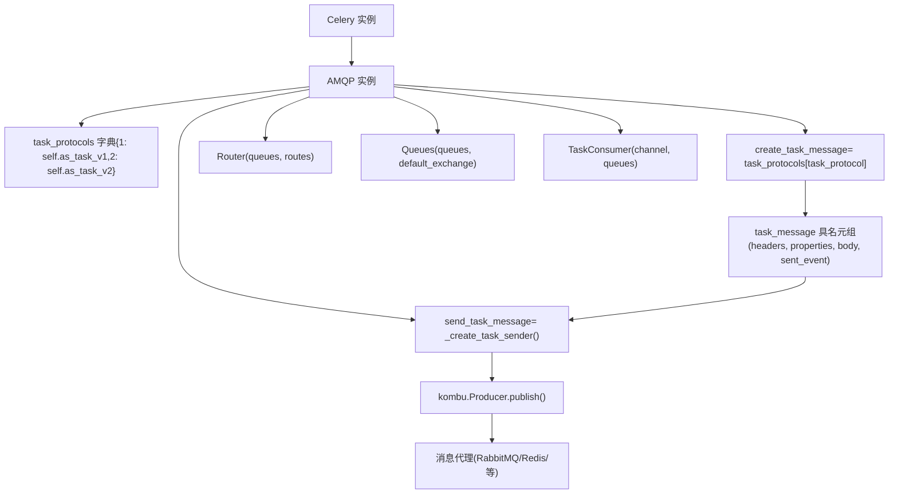

# AMQP 层与消息协议

相关源文件

-   [celery/app/amqp.py](https://github.com/celery/celery/blob/4d068b56/celery/app/amqp.py)
-   [celery/app/base.py](https://github.com/celery/celery/blob/4d068b56/celery/app/base.py)
-   [celery/app/task.py](https://github.com/celery/celery/blob/4d068b56/celery/app/task.py)
-   [celery/canvas.py](https://github.com/celery/celery/blob/4d068b56/celery/canvas.py)
-   [celery/utils/\_\_init\_\_.py](https://github.com/celery/celery/blob/4d068b56/celery/utils/__init__.py)
-   [docs/userguide/canvas.rst](https://github.com/celery/celery/blob/4d068b56/docs/userguide/canvas.rst)
-   [t/integration/conftest.py](https://github.com/celery/celery/blob/4d068b56/t/integration/conftest.py)
-   [t/integration/tasks.py](https://github.com/celery/celery/blob/4d068b56/t/integration/tasks.py)
-   [t/integration/test\_canvas.py](https://github.com/celery/celery/blob/4d068b56/t/integration/test_canvas.py)
-   [t/integration/test\_quorum\_queue\_qos\_cluster\_simulation.py](https://github.com/celery/celery/blob/4d068b56/t/integration/test_quorum_queue_qos_cluster_simulation.py)
-   [t/integration/test\_security.py](https://github.com/celery/celery/blob/4d068b56/t/integration/test_security.py)
-   [t/integration/test\_tasks.py](https://github.com/celery/celery/blob/4d068b56/t/integration/test_tasks.py)
-   [t/smoke/tests/test\_canvas.py](https://github.com/celery/celery/blob/4d068b56/t/smoke/tests/test_canvas.py)
-   [t/unit/app/test\_app.py](https://github.com/celery/celery/blob/4d068b56/t/unit/app/test_app.py)
-   [t/unit/tasks/test\_canvas.py](https://github.com/celery/celery/blob/4d068b56/t/unit/tasks/test_canvas.py)
-   [t/unit/tasks/test\_tasks.py](https://github.com/celery/celery/blob/4d068b56/t/unit/tasks/test_tasks.py)

## 目的与范围

AMQP 层 (`celery.app.amqp.AMQP`) 用于创建、序列化任务消息并将其发布到消息代理（message brokers）。本文件涵盖了消息协议版本（v1/v2）、`task_message` 结构、序列化逻辑以及 `send_task_message` 发布机制。

相关内容：[2.3 消息代理与路由](https://github.com/celery/celery/blob/4d068b56/2.3 Message Brokers and Routing) [3.1 任务定义与调用](https://github.com/celery/celery/blob/4d068b56/3.1 Task Definition and Invocation)

## AMQP 类

`AMQP` 类 [celery/app/amqp.py219-673](https://github.com/celery/celery/blob/4d068b56/celery/app/amqp.py#L219-L673) 提供了应用的 AMQP 接口，可通过 `app.amqp` 访问。它协调消息创建、序列化和代理发布。

**celery.app.amqp.AMQP 架构**


**来源：** [celery/app/amqp.py219-265](https://github.com/celery/celery/blob/4d068b56/celery/app/amqp.py#L219-L265) [celery/app/amqp.py259-265](https://github.com/celery/celery/blob/4d068b56/celery/app/amqp.py#L259-L265) [celery/app/base.py820-959](https://github.com/celery/celery/blob/4d068b56/celery/app/base.py#L820-L959)

### 核心组件

| 组件 | 类型 | 目的 |
| --- | --- | --- |
| `task_protocols` | dict | 将协议版本（1 或 2）映射到 `as_task_v1` 或 `as_task_v2` 方法 |
| `create_task_message` | cached\_property | 解析为 `task_protocols[app.conf.task_protocol]` |
| `send_task_message` | cached\_property | 返回来自 `_create_task_sender()` 的闭包 |
| `Router()` | 方法 | 创建 `celery.app.routes.Router` 实例 |
| `Queues()` | 方法 | 创建 `celery.app.amqp.Queues` 实例 |
| `TaskConsumer()` | 方法 | 为任务队列创建 `kombu.Consumer` |

**AMQP.**init** 结构** [celery/app/amqp.py251-257](https://github.com/celery/celery/blob/4d068b56/celery/app/amqp.py#L251-L257)：

```
def __init__(self, app):
    self.app = app
    self.task_protocols = {
        1: self.as_task_v1,
        2: self.as_task_v2,
    }
    self.app._conf.bind_to(self._handle_conf_update)
```
**来源：** [celery/app/amqp.py219-318](https://github.com/celery/celery/blob/4d068b56/celery/app/amqp.py#L219-L318)

## 任务消息协议版本

Celery 支持两个消息协议版本。协议版本通过 `app.conf.task_protocol` 配置（默认值为 2）。

### 协议 v2 (当前)

协议 v2 是当前且推荐的消息格式。它将消息元数据分离到标头（headers）、属性（properties）和主体（body）部分，以获得更好的结构和扩展性。

#### 使用 as\_task\_v2 创建消息

`as_task_v2` 方法 [celery/app/amqp.py320-412](https://github.com/celery/celery/blob/4d068b56/celery/app/amqp.py#L320-L412) 创建协议 v2 消息：

**as\_task\_v2() 处理流水线**

**来源：** [celery/app/amqp.py320-412](https://github.com/celery/celery/blob/4d068b56/celery/app/amqp.py#L320-L412)

#### v2 消息结构

v2 协议的数据结构如下：

| 组件 | 内容 | 目的 |
| --- | --- | --- |
| **headers (标头)** | 任务元数据（名称、ID、ETA、过期时间、重试次数、时间限制、来源等） | 核心任务执行参数 |
| **properties (属性)** | AMQP 消息属性 (correlation\_id, reply\_to) | 代理层级的消息处理 |
| **body (主体)** | (args, kwargs, embed dict) 的元组 | 任务参数和嵌入对象（callbacks, errbacks, chain, chord） |
| **sent\_event** | 用于监控的事件数据（可选） | 已发送任务的事件追踪 |

**Headers 字典结构** [celery/app/amqp.py364-385](https://github.com/celery/celery/blob/4d068b56/celery/app/amqp.py#L364-L385)：

```
headers = {
    'lang': 'py',                    # 语言
    'task': name,                    # 任务名称
    'id': task_id,                   # 任务 UUID
    'shadow': shadow,                # 用于日志的阴影名称 (Shadow name)
    'eta': eta,                      # ISO8601 格式的预计到达时间 (ETA)
    'expires': expires,              # ISO8601 格式的过期时间
    'group': group_id,               # 组 ID（针对 groups）
    'group_index': group_index,      # 组内索引
    'retries': retries,              # 重试计数
    'timelimit': [time_limit, soft_time_limit],
    'root_id': root_id,              # 链中的根任务 ID
    'parent_id': parent_id,          # 父任务 ID
    'argsrepr': argsrepr,            # 参数的字符串表示
    'kwargsrepr': kwargsrepr,        # 关键字参数的字符串表示
    'origin': origin,                # 节点名称
    'ignore_result': ignore_result,  # 结果后端标志
    'replaced_task_nesting': replaced_task_nesting,
    'stamped_headers': stamped_headers,  # 盖章标头 (stamped header) 键列表
    'stamps': stamps,                # 盖章标头值
}
```
**Body 元组结构** [celery/app/amqp.py393-400](https://github.com/celery/celery/blob/4d068b56/celery/app/amqp.py#L393-L400)：

```
body = (
    args,      # 任务位置参数
    kwargs,    # 任务关键字参数
    {
        'callbacks': callbacks,    # 成功回调
        'errbacks': errbacks,      # 错误回调
        'chain': chain,            # 链式延续
        'chord': chord,            # Chord 主体签名
    }
)
```
**来源：** [celery/app/amqp.py320-412](https://github.com/celery/celery/blob/4d068b56/celery/app/amqp.py#L320-L412)

### 协议 v1 (遗留)

协议 v1 是为了保持后向兼容性而保留的遗留格式。它将所有任务元数据存储在消息主体中，而不是标头中。

`as_task_v1` 方法创建 v1 协议消息 [celery/app/amqp.py414-472](https://github.com/celery/celery/blob/4d068b56/celery/app/amqp.py#L414-L472)：

**v1 消息结构：**

| 组件 | 内容 | 目的 |
| --- | --- | --- |
| **headers** | 空字典 | v1 中未使用 |
| **properties** | correlation\_id, reply\_to | AMQP 属性 |
| **body** | 包含所有任务数据的单个字典 | 所有元数据和参数合并在一起 |

**Body 字典结构** [celery/app/amqp.py446-462](https://github.com/celery/celery/blob/4d068b56/celery/app/amqp.py#L446-L462)：

```
body = {
    'task': name,
    'id': task_id,
    'args': args,
    'kwargs': kwargs,
    'group': group_id,
    'group_index': group_index,
    'retries': retries,
    'eta': eta,
    'expires': expires,
    'utc': utc,
    'callbacks': callbacks,
    'errbacks': errbacks,
    'timelimit': (time_limit, soft_time_limit),
    'taskset': group_id,  # 兼容性别名
    'chord': chord,
}
```
**来源：** [celery/app/amqp.py414-472](https://github.com/celery/celery/blob/4d068b56/celery/app/amqp.py#L414-L472)

## task\_message 具名元组

两个协议版本都返回一个 `task_message` 具名元组（namedtuple），它封装了完整的消息结构 [celery/app/amqp.py32-33](https://github.com/celery/celery/blob/4d068b56/celery/app/amqp.py#L32-L33)：

```
task_message = namedtuple('task_message',
                          ('headers', 'properties', 'body', 'sent_event'))
```
该结构随后被传递给 `send_task_message` 以进行序列化并发布到代理。

**来源：** [celery/app/amqp.py32-33](https://github.com/celery/celery/blob/4d068b56/celery/app/amqp.py#L32-L33)

## 消息创建流

**消息创建与发布流**

> **[Mermaid sequence]**
> *(图表结构无法解析)*

**来源：** [celery/app/task.py446-613](https://github.com/celery/celery/blob/4d068b56/celery/app/task.py#L446-L613) [celery/app/base.py820-959](https://github.com/celery/celery/blob/4d068b56/celery/app/base.py#L820-L959) [celery/app/amqp.py259-265](https://github.com/celery/celery/blob/4d068b56/celery/app/amqp.py#L259-L265) [celery/app/amqp.py320-412](https://github.com/celery/celery/blob/4d068b56/celery/app/amqp.py#L320-L412) [celery/app/amqp.py479-567](https://github.com/celery/celery/blob/4d068b56/celery/app/amqp.py#L479-L567)

## 消息序列化

### 参数校验与类型检查

在创建消息之前，协议方法会验证参数类型 [celery/app/amqp.py332-335](https://github.com/celery/celery/blob/4d068b56/celery/app/amqp.py#L332-L335)：

```
if not isinstance(args, (list, tuple)):
    raise TypeError('task args must be a list or tuple')
if not isinstance(kwargs, Mapping):
    raise TypeError('task keyword arguments must be a mapping')
```
**来源：** [celery/app/amqp.py330-335](https://github.com/celery/celery/blob/4d068b56/celery/app/amqp.py#L330-L335)

### 基于时间字段的处理

协议通过将倒计时（countdown）和相对过期时间转换为绝对 datetime 值来处理它们：

**倒计时到 ETA 的转换** [celery/app/amqp.py336-342](https://github.com/celery/celery/blob/4d068b56/celery/app/amqp.py#L336-L342)：

```
if countdown:
    self._verify_seconds(countdown, 'countdown')
    now = now or self.app.now()
    timezone = timezone or self.app.timezone
    eta = maybe_make_aware(
        now + timedelta(seconds=countdown), tz=timezone,
    )
```
**过期时间转换** [celery/app/amqp.py343-349](https://github.com/celery/celery/blob/4d068b56/celery/app/amqp.py#L343-L349)：

```
if isinstance(expires, numbers.Real):
    self._verify_seconds(expires, 'expires')
    now = now or self.app.now()
    timezone = timezone or self.app.timezone
    expires = maybe_make_aware(
        now + timedelta(seconds=expires), tz=timezone,
    )
```
ETA 和 expires 随后都被转换为 ISO8601 格式字符串 [celery/app/amqp.py350-354](https://github.com/celery/celery/blob/4d068b56/celery/app/amqp.py#L350-L354)：

```
if not isinstance(eta, str):
    eta = eta and eta.isoformat()
if not isinstance(expires, str):
    expires = expires and expires.isoformat()
```
**来源：** [celery/app/amqp.py336-354](https://github.com/celery/celery/blob/4d068b56/celery/app/amqp.py#L336-L354)

### 参数表示 (Argument Representation)

为了进行日志记录和监控，协议使用 `saferepr` 生成参数的安全字符串表示，并带有可配置的大小限制 [celery/app/amqp.py356-359](https://github.com/celery/celery/blob/4d068b56/celery/app/amqp.py#L356-L359)：

```
if argsrepr is None:
    argsrepr = saferepr(args, self.argsrepr_maxsize)
if kwargsrepr is None:
    kwargsrepr = saferepr(kwargs, self.kwargsrepr_maxsize)
```
最大大小是可配置的：

-   `argsrepr_maxsize`：默认 1024 字节 [celery/app/amqp.py246](https://github.com/celery/celery/blob/4d068b56/celery/app/amqp.py#L246-L246)
-   `kwargsrepr_maxsize`：默认 1024 字节 [celery/app/amqp.py249](https://github.com/celery/celery/blob/4d068b56/celery/app/amqp.py#L249-L249)

**来源：** [celery/app/amqp.py244-249](https://github.com/celery/celery/blob/4d068b56/celery/app/amqp.py#L244-L249) [celery/app/amqp.py356-359](https://github.com/celery/celery/blob/4d068b56/celery/app/amqp.py#L356-L359)

### 根 ID (Root ID) 默认化

如果未提供 root\_id，则默认为 task\_id [celery/app/amqp.py361-362](https://github.com/celery/celery/blob/4d068b56/celery/app/amqp.py#L361-L362)：

```
if not root_id:
    root_id = task_id
```
这确保了工作流中的每个任务都可以追溯到原始的根任务。

**来源：** [celery/app/amqp.py361-362](https://github.com/celery/celery/blob/4d068b56/celery/app/amqp.py#L361-L362)

### 盖章标头 (Stamped Headers)

协议 v2 支持用于工作流追踪的盖章标头。`stamped_headers` 列表标识哪些标头键是盖章 (stamps)，`stamps` 字典包含它们的值 [celery/app/amqp.py364](https://github.com/celery/celery/blob/4d068b56/celery/app/amqp.py#L364-L364)：

```
stamps = {header: options[header] for header in stamped_headers or []}
```
**来源：** [celery/app/amqp.py364](https://github.com/celery/celery/blob/4d068b56/celery/app/amqp.py#L364-L364) [celery/canvas.py553-612](https://github.com/celery/celery/blob/4d068b56/celery/canvas.py#L553-L612)

## 消息发送

`_create_task_sender` 方法返回一个闭包 `send_task_message`，它处理实际的消息发布 [celery/app/amqp.py479-567](https://github.com/celery/celery/blob/4d068b56/celery/app/amqp.py#L479-L567)

### 消息发送流

**send\_task\_message() 内部逻辑**

**来源：** [celery/app/amqp.py479-567](https://github.com/celery/celery/blob/4d068b56/celery/app/amqp.py#L479-L567)

### 队列与交换机解析

发送者按此顺序解析目标队列和交换机 [celery/app/amqp.py515-543](https://github.com/celery/celery/blob/4d068b56/celery/app/amqp.py#L515-L543)：

1.  **队列解析**：如果队列名称是字符串，则在 `app.amqp.queues` 中查找
2.  **交付模式 (Delivery Mode)**：使用队列交换机的 delivery\_mode，或者默认为 `task_default_delivery_mode`
3.  **交换机类型**：从队列交换机中提取，或者默认为 'direct'
4.  **匿名交换机转换**：对于没有显式交换机/路由键的直连（direct）交换机，使用匿名交换机 (exchange='', routing\_key=queue\_name)
5.  **具名交换机**：否则使用队列的交换机名称或默认交换机

**来源：** [celery/app/amqp.py515-543](https://github.com/celery/celery/blob/4d068b56/celery/app/amqp.py#L515-L543)

### 序列化与压缩

实际的序列化和压缩被委托给 Kombu Producer [celery/app/amqp.py559-565](https://github.com/celery/celery/blob/4d068b56/celery/app/amqp.py#L559-L565)：

```
ret = producer.publish(
    body,
    exchange=exchange,
    routing_key=routing_key,
    serializer=serializer or default_serializer,
    compression=compression or default_compressor,
    retry=retry, retry_policy=_rp,
    # ... 其他选项
)
```
序列化器和压缩由以下因素决定：

-   任务选项中显式的 `serializer` 选项
-   `task_serializer` 配置（默认值：'json'）
-   任务选项中显式的 `compression` 选项
-   `task_compression` 配置（默认值：None）

**来源：** [celery/app/amqp.py559-567](https://github.com/celery/celery/blob/4d068b56/celery/app/amqp.py#L559-L567) [celery/app/amqp.py497-498](https://github.com/celery/celery/blob/4d068b56/celery/app/amqp.py#L497-L498)

### 信号 (Signals)

在消息发布期间会发送三个信号 [celery/app/amqp.py485-491](https://github.com/celery/celery/blob/4d068b56/celery/app/amqp.py#L485-L491) [celery/app/amqp.py552-558](https://github.com/celery/celery/blob/4d068b56/celery/app/amqp.py#L552-L558) [celery/app/amqp.py568-573](https://github.com/celery/celery/blob/4d068b56/celery/app/amqp.py#L568-L573)：

1.  **before\_task\_publish**：在发布前发送，允许修改消息
2.  **after\_task\_publish**：在发布成功后发送
3.  **task\_sent**：遗留的兼容性信号（已弃用）

**来源：** [celery/app/amqp.py485-491](https://github.com/celery/celery/blob/4d068b56/celery/app/amqp.py#L485-L491) [celery/app/amqp.py552-573](https://github.com/celery/celery/blob/4d068b56/celery/app/amqp.py#L552-L573)

## 配置选项

影响 AMQP 层的关键配置设置：

| 设置项 | 默认值 | 目的 |
| --- | --- | --- |
| `task_protocol` | 2 | 消息协议版本（1 或 2） |
| `task_serializer` | 'json' | 序列化格式（json, pickle, yaml, msgpack） |
| `task_compression` | None | 压缩方法（zlib, bzip2） |
| `task_publish_retry` | True | 在连接失败时启用重试 |
| `task_publish_retry_policy` | {...} | 重试策略配置 |
| `task_default_delivery_mode` | 2 | AMQP 交付模式（1=瞬态/transient，2=持久/persistent） |
| `task_default_queue` | 'celery' | 默认队列名称 |
| `task_default_exchange` | 'celery' | 默认交换机名称 |
| `task_default_routing_key` | 'celery' | 默认路由键 |
| `task_send_sent_event` | False | 发送任务已发送 (task-sent) 监控事件 |

**来源：** [celery/app/defaults.py](https://github.com/celery/celery/blob/4d068b56/celery/app/defaults.py) [celery/app/amqp.py479-498](https://github.com/celery/celery/blob/4d068b56/celery/app/amqp.py#L479-L498)

## 与任务提交的集成

AMQP 层是从应用的 `send_task` 方法中调用的 [celery/app/base.py820-959](https://github.com/celery/celery/blob/4d068b56/celery/app/base.py#L820-L959)：

**app.send\_task() 集成**

```mermaid
flowchart TD
    ApplyAsync["Task.apply_async(args, kwargs, task_id, producer, link, link_error, shadow, **options)"]
    SendTask["app.send_task(name, args, kwargs, task_id, producer, connection, router, result_cls, expires, retries, chord, reply_to, time_limit, soft_time_limit, root_id, parent_id, route_name, shadow, chain, task_type, **options)"]
    GenUUID["task_id = task_id or uuid()"]
    GetRouter["router = router or amqp.router"]
    RouteCall["options = router.route(options, route_name or name, args, kwargs, task_type)"]
    ParentCheck["root_id 或 parent_id 缺失？"]
    GetParent["parent = current_worker_task"]
    CreateMsg["message = amqp.create_task_message(task_id, name, args, kwargs, countdown, eta, group_id, group_index, expires, retries, chord, maybe_list(link), maybe_list(link_error), reply_to or self.thread_oid, time_limit, soft_time_limit, task_send_sent_event, root_id, parent_id, shadow, chain, ignore_result=ignore_result, replaced_task_nesting=replaced_task_nesting, **options)"]
    InheritIDs["root_id = parent.request.root_id 或 parent.request.id; parent_id = parent.request.id"]
    ProducerCheck["提供了 connection？"]
    NewProducer["producer = amqp.Producer(connection, auto_declare=False)"]
    AcquireProducer["with producer_or_acquire(producer) as P:"]
    IgnoreCheck["未忽略结果？(not ignore_result)"]
    BackendCall["backend.on_task_call(P, task_id)"]
    SendMsg["amqp.send_task_message(P, name, message, **options)"]
    ResultObj["result = (result_cls or AsyncResult)(task_id); result.ignored = ignore_result"]
    AddParent["add_to_parent 且父级存在？"]
    AddTrail["parent.add_trail(result)"]
    ReturnResult["返回 result"]

    ApplyAsync --> SendTask
    SendTask --> GenUUID
    GenUUID --> GetRouter
    GetRouter --> RouteCall
    RouteCall --> ParentCheck
    ParentCheck --> GetParent
    ParentCheck --> CreateMsg
    GetParent --> InheritIDs
    InheritIDs --> CreateMsg
    CreateMsg --> ProducerCheck
    ProducerCheck --> NewProducer
    ProducerCheck --> AcquireProducer
    NewProducer --> IgnoreCheck
    AcquireProducer --> IgnoreCheck
    IgnoreCheck --> BackendCall
    IgnoreCheck --> SendMsg
    BackendCall --> SendMsg
    SendMsg --> ResultObj
    ResultObj --> AddParent
    AddParent --> AddTrail
    AddParent --> ReturnResult
    AddTrail --> ReturnResult
```


集成点：

-   `Task.apply_async()` 使用任务名称调用 `app.send_task()` [celery/app/task.py608-613](https://github.com/celery/celery/blob/4d068b56/celery/app/task.py#L608-L613)
-   `app.send_task()` 生成 UUID、路由任务、创建消息 [celery/app/base.py838-934](https://github.com/celery/celery/blob/4d068b56/celery/app/base.py#L838-L934)
-   消息通过生产者池中的 `producer_or_acquire()` 发送 [celery/app/base.py943-947](https://github.com/celery/celery/blob/4d068b56/celery/app/base.py#L943-L947)
-   立即返回 `AsyncResult` 而不阻塞 [celery/app/base.py948-959](https://github.com/celery/celery/blob/4d068b56/celery/app/base.py#L948-L959)

**来源：** [celery/app/task.py446-613](https://github.com/celery/celery/blob/4d068b56/celery/app/task.py#L446-L613) [celery/app/base.py820-959](https://github.com/celery/celery/blob/4d068b56/celery/app/base.py#L820-L959)

## 消息结构示例

### 协议 v2 示例

```
task_message(
    headers={
        'lang': 'py',
        'task': 'tasks.add',
        'id': 'd3a7f2b0-1234-5678-9abc-def123456789',
        'shadow': None,
        'eta': '2024-01-15T10:30:00.000000+00:00',
        'expires': None,
        'group': None,
        'group_index': None,
        'retries': 0,
        'timelimit': [None, None],
        'root_id': 'd3a7f2b0-1234-5678-9abc-def123456789',
        'parent_id': None,
        'argsrepr': '(2, 3)',
        'kwargsrepr': '{}',
        'origin': 'gen123@hostname',
        'ignore_result': False,
        'replaced_task_nesting': 0,
        'stamped_headers': None,
        'stamps': {},
    },
    properties={
        'correlation_id': 'd3a7f2b0-1234-5678-9abc-def123456789',
        'reply_to': 'gen123@hostname',
    },
    body=(
        (2, 3),  # args
        {},      # kwargs
        {
            'callbacks': None,
            'errbacks': None,
            'chain': None,
            'chord': None,
        }
    ),
    sent_event=None  # 或者如果 task_send_sent_event=True 则为事件字典
)
```
### 协议 v1 示例

```
task_message(
    headers={},
    properties={
        'correlation_id': 'd3a7f2b0-1234-5678-9abc-def123456789',
        'reply_to': 'gen123@hostname',
    },
    body={
        'task': 'tasks.add',
        'id': 'd3a7f2b0-1234-5678-9abc-def123456789',
        'args': (2, 3),
        'kwargs': {},
        'group': None,
        'group_index': None,
        'retries': 0,
        'eta': '2024-01-15T10:30:00.000000+00:00',
        'expires': None,
        'utc': True,
        'callbacks': None,
        'errbacks': None,
        'timelimit': (None, None),
        'taskset': None,
        'chord': None,
    },
    sent_event=None
)
```
**来源：** [celery/app/amqp.py320-472](https://github.com/celery/celery/blob/4d068b56/celery/app/amqp.py#L320-L472)
