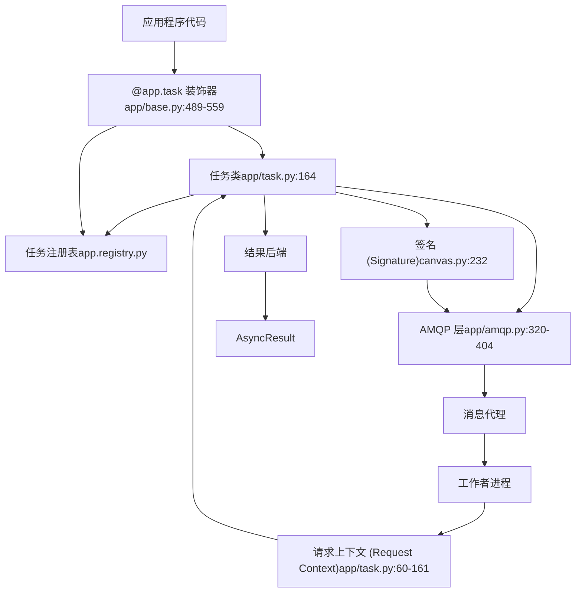
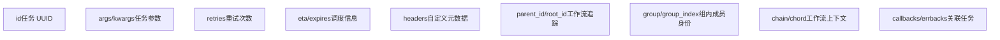
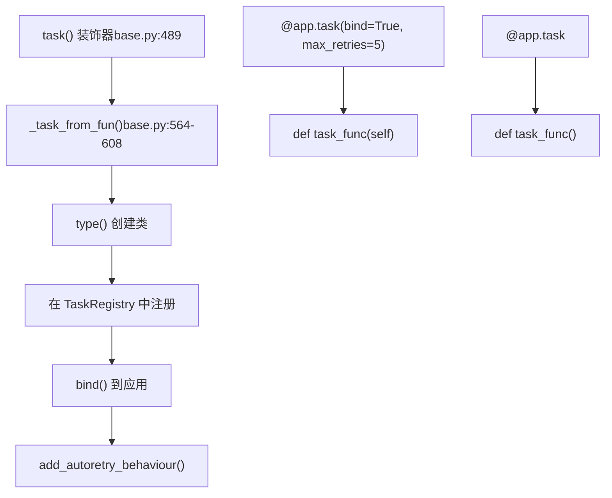
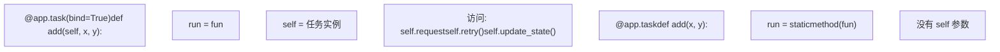
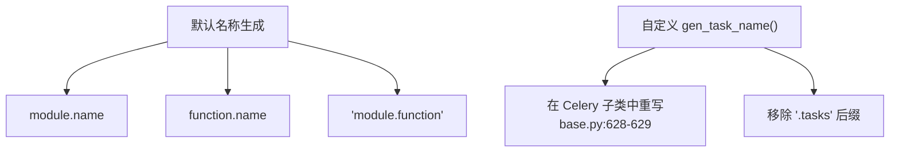
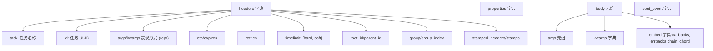
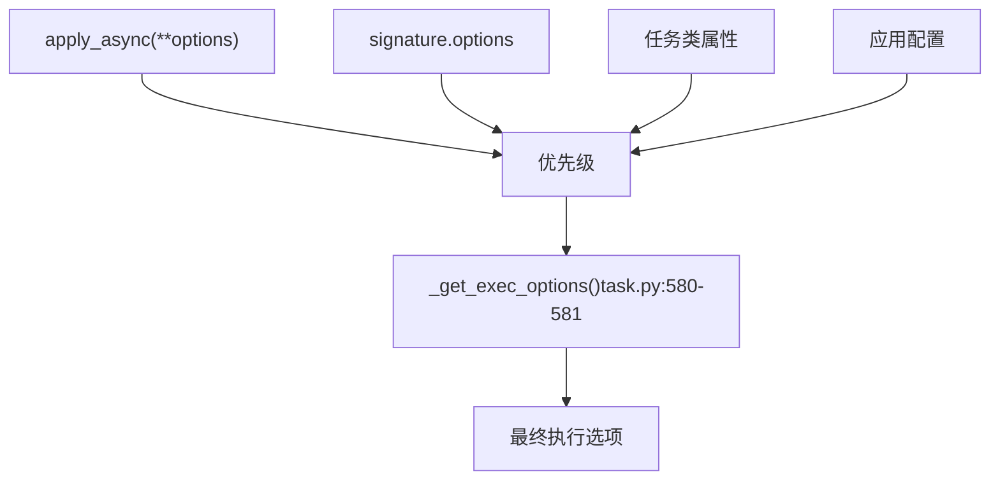
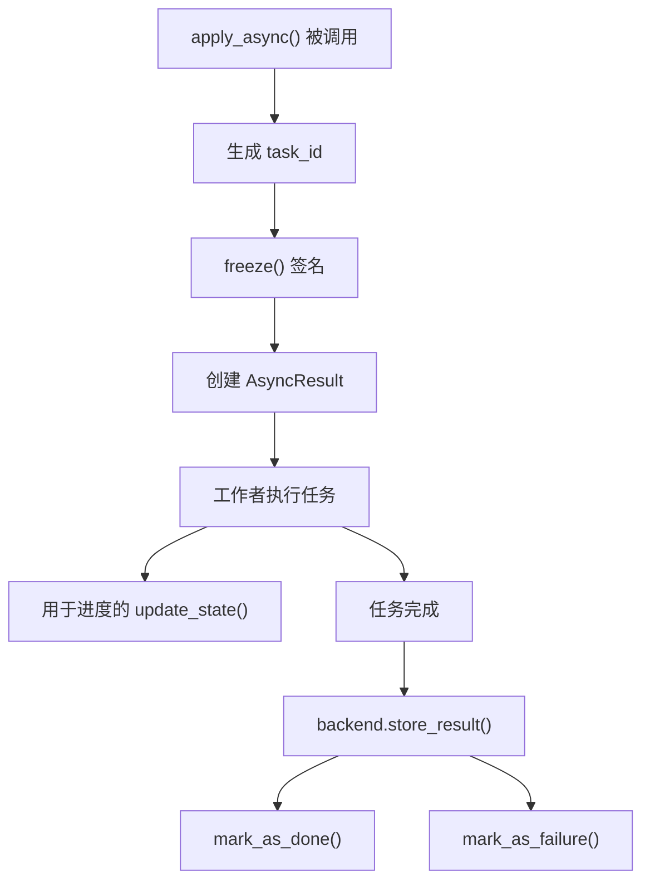
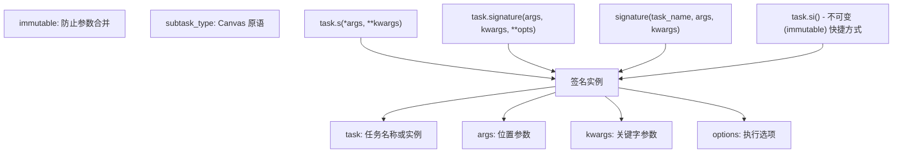
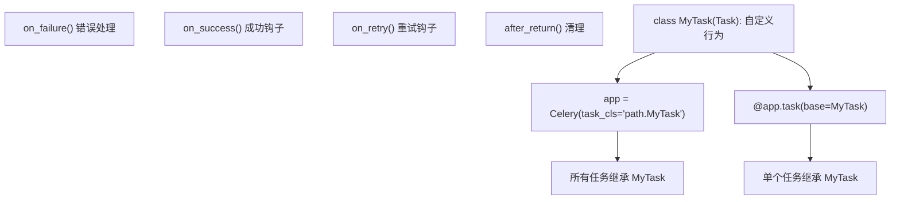

# 任务 (Tasks)

相关源文件

-   [celery/app/amqp.py](https://github.com/celery/celery/blob/4d068b56/celery/app/amqp.py)
-   [celery/app/base.py](https://github.com/celery/celery/blob/4d068b56/celery/app/base.py)
-   [celery/app/defaults.py](https://github.com/celery/celery/blob/4d068b56/celery/app/defaults.py)
-   [celery/app/task.py](https://github.com/celery/celery/blob/4d068b56/celery/app/task.py)
-   [celery/canvas.py](https://github.com/celery/celery/blob/4d068b56/celery/canvas.py)
-   [celery/utils/\_\_init\_\_.py](https://github.com/celery/celery/blob/4d068b56/celery/utils/__init__.py)
-   [docs/faq.rst](https://github.com/celery/celery/blob/4d068b56/docs/faq.rst)
-   [docs/getting-started/first-steps-with-celery.rst](https://github.com/celery/celery/blob/4d068b56/docs/getting-started/first-steps-with-celery.rst)
-   [docs/getting-started/next-steps.rst](https://github.com/celery/celery/blob/4d068b56/docs/getting-started/next-steps.rst)
-   [docs/userguide/calling.rst](https://github.com/celery/celery/blob/4d068b56/docs/userguide/calling.rst)
-   [docs/userguide/canvas.rst](https://github.com/celery/celery/blob/4d068b56/docs/userguide/canvas.rst)
-   [docs/userguide/monitoring.rst](https://github.com/celery/celery/blob/4d068b56/docs/userguide/monitoring.rst)
-   [docs/userguide/periodic-tasks.rst](https://github.com/celery/celery/blob/4d068b56/docs/userguide/periodic-tasks.rst)
-   [docs/userguide/routing.rst](https://github.com/celery/celery/blob/4d068b56/docs/userguide/routing.rst)
-   [docs/userguide/tasks.rst](https://github.com/celery/celery/blob/4d068b56/docs/userguide/tasks.rst)
-   [docs/userguide/workers.rst](https://github.com/celery/celery/blob/4d068b56/docs/userguide/workers.rst)
-   [t/integration/conftest.py](https://github.com/celery/celery/blob/4d068b56/t/integration/conftest.py)
-   [t/integration/tasks.py](https://github.com/celery/celery/blob/4d068b56/t/integration/tasks.py)
-   [t/integration/test\_canvas.py](https://github.com/celery/celery/blob/4d068b56/t/integration/test_canvas.py)
-   [t/integration/test\_quorum\_queue\_qos\_cluster\_simulation.py](https://github.com/celery/celery/blob/4d068b56/t/integration/test_quorum_queue_qos_cluster_simulation.py)
-   [t/integration/test\_security.py](https://github.com/celery/celery/blob/4d068b56/t/integration/test_security.py)
-   [t/integration/test\_tasks.py](https://github.com/celery/celery/blob/4d068b56/t/integration/test_tasks.py)
-   [t/smoke/tests/test\_canvas.py](https://github.com/celery/celery/blob/4d068b56/t/smoke/tests/test_canvas.py)
-   [t/unit/app/test\_app.py](https://github.com/celery/celery/blob/4d068b56/t/unit/app/test_app.py)
-   [t/unit/tasks/test\_canvas.py](https://github.com/celery/celery/blob/4d068b56/t/unit/tasks/test_canvas.py)
-   [t/unit/tasks/test\_tasks.py](https://github.com/celery/celery/blob/4d068b56/t/unit/tasks/test_tasks.py)

任务（Tasks）是 Celery 中的基本工作单元。任务是一个可调用对象，可以由工作者（workers）异步执行，它提供了在集群中分发工作的核心抽象。任务定义了任务被调用时发生的情况（向代理/broker 发送消息）以及工作者收到该消息时发生的情况（执行任务函数）。

**范围**：本页面涵盖了任务系统架构、任务类结构、定义模式和任务注册表。有关特定方面的详细信息：

-   任务调用与执行选项：请参阅[任务定义与调用](/celery/celery/3.1-task-definition-and-invocation)
-   任务状态转换与生命周期：请参阅[任务生命周期与状态](/celery/celery/3.2-task-lifecycle-and-states)
-   重试机制与错误处理：请参阅[错误处理与重试](/celery/celery/3.3-error-handling-and-retry)
-   任务工作流编排：请参阅[Canvas 工作流](/celery/celery/4-canvas-workflows)

## 任务架构

下图展示了任务如何融入 Celery 架构及其与其他核心组件的关系：

**来源**：[celery/app/base.py489-608](https://github.com/celery/celery/blob/4d068b56/celery/app/base.py#L489-L608) [celery/app/task.py164-425](https://github.com/celery/celery/blob/4d068b56/celery/app/task.py#L164-L425) [celery/canvas.py232-287](https://github.com/celery/celery/blob/4d068b56/celery/canvas.py#L232-L287)

## 任务类 (Task Class)

位于 [celery/app/task.py164](https://github.com/celery/celery/blob/4d068b56/celery/app/task.py#L164-L164) 的 `Task` 基类为所有任务提供了基础。当您使用 `@app.task` 装饰器时，它会创建一个继承自该基类的新类。

### 核心任务属性

| 属性 | 类型 | 默认值 | 描述 |
| --- | --- | --- | --- |
| `name` | str | 自动生成 | 用于路由的唯一任务名称 |
| `max_retries` | int | 3 | 最大重试次数 |
| `default_retry_delay` | int | 180 | 重试前的秒数（3 分钟） |
| `rate_limit` | str | None | 速率限制（例如 '100/m', '100/h'） |
| `time_limit` | float | None | 硬性时间限制（以秒为单位） |
| `soft_time_limit` | float | None | 软性时间限制（以秒为单位） |
| `ignore_result` | bool | None | 不存储任务结果 |
| `track_started` | bool | None | 报告 'STARTED' 状态 |
| `acks_late` | bool | None | 执行后确认 (Acknowledge) |
| `acks_on_failure_or_timeout` | bool | None | 即使失败也进行确认 |
| `reject_on_worker_lost` | bool | None | 如果工作者崩溃则重新入队 |

**来源**：[celery/app/task.py189-310](https://github.com/celery/celery/blob/4d068b56/celery/app/task.py#L189-L310)

### 任务请求上下文 (Task Request Context)

位于 [celery/app/task.py60-161](https://github.com/celery/celery/blob/4d068b56/celery/app/task.py#L60-L161) 的 `Context` 类保存了关于当前正在执行的任务的信息：

**来源**：[celery/app/task.py60-161](https://github.com/celery/celery/blob/4d068b56/celery/app/task.py#L60-L161)

## 任务定义

任务是使用定义在 [celery/app/base.py489-559](https://github.com/celery/celery/blob/4d068b56/celery/app/base.py#L489-L559) 的 `@app.task` 装饰器创建的。该装饰器支持两种调用模式：

### 装饰器模式

**来源**：[celery/app/base.py489-608](https://github.com/celery/celery/blob/4d068b56/celery/app/base.py#L489-L608)

### 任务创建过程

位于 [celery/app/base.py564-608](https://github.com/celery/celery/blob/4d068b56/celery/app/base.py#L564-L608) 的 `_task_from_fun()` 方法执行以下步骤：

1.  **名称生成**：如果未提供显式名称，则使用 [celery/utils/imports.py](https://github.com/celery/celery/blob/4d068b56/celery/utils/imports.py) 生成一个名称。
2.  **类创建**：使用 Python 的 `type()` 创建一个新的任务类，其中包含：
    -   `app`：对 Celery 应用的引用
    -   `name`：唯一的任务标识符
    -   `run`：实际的任务函数（绑定的或静态的）
    -   `_decorated`：表示该任务由装饰器创建的标记
    -   来自装饰器参数的任务特定选项
3.  **注册**：将任务添加到 `app._tasks` 注册表。
4.  **绑定**：调用 `task.bind(app)` 以根据应用设置进行配置。
5.  **自动重试设置**：如果指定了自动重试行为，则进行配置。

**来源**：[celery/app/base.py564-608](https://github.com/celery/celery/blob/4d068b56/celery/app/base.py#L564-L608) [celery/app/autoretry.py](https://github.com/celery/celery/blob/4d068b56/celery/app/autoretry.py)

### 绑定任务 (Bound Tasks) 与非绑定任务

**来源**：[celery/app/base.py585-595](https://github.com/celery/celery/blob/4d068b56/celery/app/base.py#L585-L595)

## 任务注册表 (Task Registry)

位于 [celery/app/registry.py](https://github.com/celery/celery/blob/4d068b56/celery/app/registry.py) 的 `TaskRegistry` 维护任务名称到任务实例的映射。任务可以通过三种方式注册：

### 注册机制

| 方法 | 位置 | 描述 |
| --- | --- | --- |
| `@app.task` 装饰器 | [celery/app/base.py602](https://github.com/celery/celery/blob/4d068b56/celery/app/base.py#L602-L602) | 装饰期间自动注册 |
| `app.register_task()` | [celery/app/base.py609-626](https://github.com/celery/celery/blob/4d068b56/celery/app/base.py#L609-L626) | 手动注册任务实例 |
| 任务类实例化 | [celery/app/task.py344-367](https://github.com/celery/celery/blob/4d068b56/celery/app/task.py#L344-L367) | 任务绑定到应用时注册 |

### 任务命名

任务名称默认遵循 `module.function_name` 模式。位于 [celery/utils/imports.py](https://github.com/celery/celery/blob/4d068b56/celery/utils/imports.py) 的名称生成逻辑可以通过重写 `Celery.gen_task_name()` 来自定义：

**来源**：[celery/utils/imports.py](https://github.com/celery/celery/blob/4d068b56/celery/utils/imports.py) [celery/app/base.py628-629](https://github.com/celery/celery/blob/4d068b56/celery/app/base.py#L628-L629) [docs/userguide/tasks.rst248-295](https://github.com/celery/celery/blob/4d068b56/docs/userguide/tasks.rst#L248-L295)

## 任务调用 (Task Invocation)

任务支持三种调用方法，它们都是“调用 API” (Calling API) 的一部分：

### 调用方法对比

| 方法 | 签名 | 执行方式 | 返回值 | 使用场景 |
| --- | --- | --- | --- | --- |
| `__call__()` | `task(args, kwargs)` | 同步，在当前进程中执行 | 返回值 | 测试，即时 (eager) 模式 |
| `delay()` | `task.delay(*args, **kwargs)` | 通过工作者异步执行 | `AsyncResult` | 简单的异步调用 |
| `apply_async()` | `task.apply_async(args, kwargs, **opts)` | 通过工作者异步执行 | `AsyncResult` | 带有选项的全权控制 |

**来源**：[celery/app/task.py407-414](https://github.com/celery/celery/blob/4d068b56/celery/app/task.py#L407-L414) [celery/app/task.py433-444](https://github.com/celery/celery/blob/4d068b56/celery/app/task.py#L433-L444) [celery/app/task.py446-613](https://github.com/celery/celery/blob/4d068b56/celery/app/task.py#L446-L613)

### 任务调用期间的消息流

> **[Mermaid sequence]**
> *(图表结构无法解析)*

**来源**：[celery/app/task.py446-613](https://github.com/celery/celery/blob/4d068b56/celery/app/task.py#L446-L613) [celery/app/base.py820-959](https://github.com/celery/celery/blob/4d068b56/celery/app/base.py#L820-L959) [celery/app/amqp.py320-404](https://github.com/celery/celery/blob/4d068b56/celery/app/amqp.py#L320-L404)

## 任务消息协议

Celery 默认使用协议版本 2（可通过 `task_protocol` 设置进行配置）。由 [celery/app/amqp.py320-404](https://github.com/celery/celery/blob/4d068b56/celery/app/amqp.py#L320-L404) 创建的消息结构：

### 消息组件

**来源**：[celery/app/amqp.py320-404](https://github.com/celery/celery/blob/4d068b56/celery/app/amqp.py#L320-L404)

## 任务执行选项

任务执行选项可以通过多种方式设置，其优先级如下（从高到低）：

### 选项优先级

位于 [celery/app/task.py849-878](https://github.com/celery/celery/blob/4d068b56/celery/app/task.py#L849-L878) 的 `_get_exec_options()` 方法使用 `extract_exec_options` 属性获取器从任务实例中提取执行选项。

**来源**：[celery/app/task.py580-581](https://github.com/celery/celery/blob/4d068b56/celery/app/task.py#L580-L581) [celery/app/task.py849-878](https://github.com/celery/celery/blob/4d068b56/celery/app/task.py#L849-L878) [celery/app/task.py27-32](https://github.com/celery/celery/blob/4d068b56/celery/app/task.py#L27-L32)

## 任务状态与结果

任务与结果后端交互以存储状态和返回值：

### 结果存储流

**来源**：[celery/app/task.py472-519](https://github.com/celery/celery/blob/4d068b56/celery/app/task.py#L472-L519) [celery/backends/base.py](https://github.com/celery/celery/blob/4d068b56/celery/backends/base.py)

## 任务签名 (Task Signatures)

任务可以转换为签名（也称为子任务/subtasks），以便在 Canvas 工作流中使用。位于 [celery/canvas.py232-287](https://github.com/celery/celery/blob/4d068b56/celery/canvas.py#L232-L287) 的 `Signature` 类封装了任务调用细节：

### 签名结构

**来源**：[celery/canvas.py232-344](https://github.com/celery/celery/blob/4d068b56/celery/canvas.py#L232-L344) [celery/app/task.py](https://github.com/celery/celery/blob/4d068b56/celery/app/task.py)

## Pydantic 集成

当在任务装饰器上设置 `pydantic=True` 时，Celery 支持自动 Pydantic 模型验证和序列化。位于 [celery/app/base.py105-183](https://github.com/celery/celery/blob/4d068b56/celery/app/base.py#L105-L183) 的包装器处理：

1.  **参数校验**：根据 Pydantic 模型类型提示验证任务参数。
2.  **返回值序列化**：自动将 Pydantic 模型返回值序列化为 JSON 兼容的字典。

**来源**：[celery/app/base.py105-183](https://github.com/celery/celery/blob/4d068b56/celery/app/base.py#L105-L183) [celery/app/base.py582-583](https://github.com/celery/celery/blob/4d068b56/celery/app/base.py#L582-L583)

## 任务类自定义 (Task Class Customization)

可以通过子类化 `Task` 并通过 `base` 参数或 `task_cls` 应用设置来指定自定义任务基类：

### 自定义任务类模式

**来源**：[celery/app/task.py164-425](https://github.com/celery/celery/blob/4d068b56/celery/app/task.py#L164-L425) [celery/app/base.py569-579](https://github.com/celery/celery/blob/4d068b56/celery/app/base.py#L569-L579) [docs/userguide/tasks.rst167-184](https://github.com/celery/celery/blob/4d068b56/docs/userguide/tasks.rst#L167-L184)

## 任务生命周期钩子 (Task Lifecycle Hooks)

`Task` 类提供了几个可以重写以实现自定义行为的钩子：

| 钩子 | 签名 | 调用时机 | 使用场景 |
| --- | --- | --- | --- |
| `on_bound(app)` | `@classmethod` | 任务绑定到应用时 | 初始化每个应用的资源 |
| `before_start(task_id, args, kwargs)` | 实例方法 | 任务执行前 | 设置 |
| `on_success(retval, task_id, args, kwargs)` | 实例方法 | 任务成功时 | 成功日志记录 |
| `on_failure(exc, task_id, args, kwargs, einfo)` | 实例方法 | 任务失败时 | 错误处理 |
| `on_retry(exc, task_id, args, kwargs, einfo)` | 实例方法 | 任务重试时 | 重试日志记录 |
| `after_return(status, retval, task_id, args, kwargs, einfo)` | 实例方法 | 任务完成后 | 清理 |

**来源**：[celery/app/task.py369-376](https://github.com/celery/celery/blob/4d068b56/celery/app/task.py#L369-L376) [celery/worker/request.py](https://github.com/celery/celery/blob/4d068b56/celery/worker/request.py)
