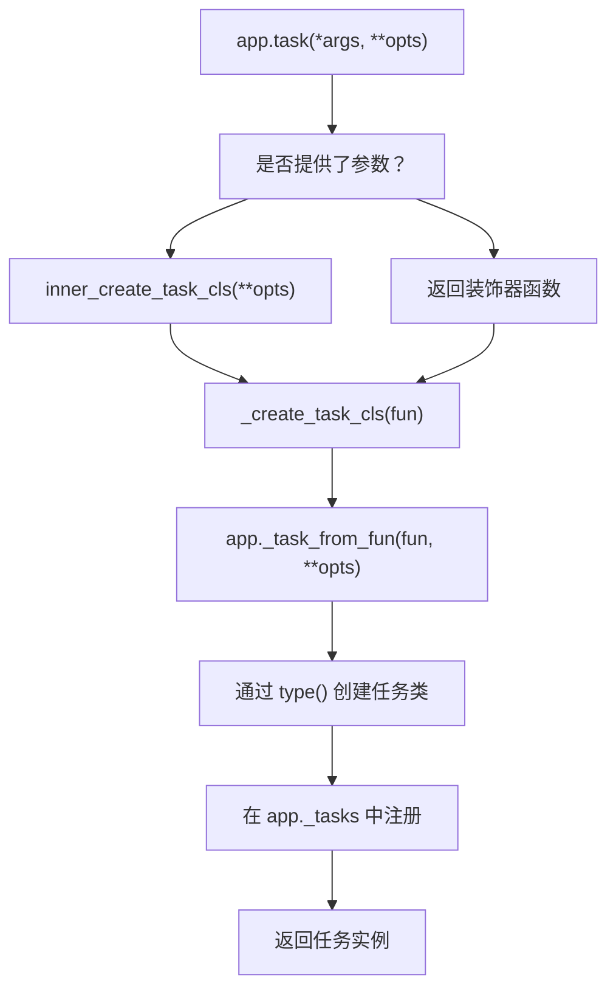
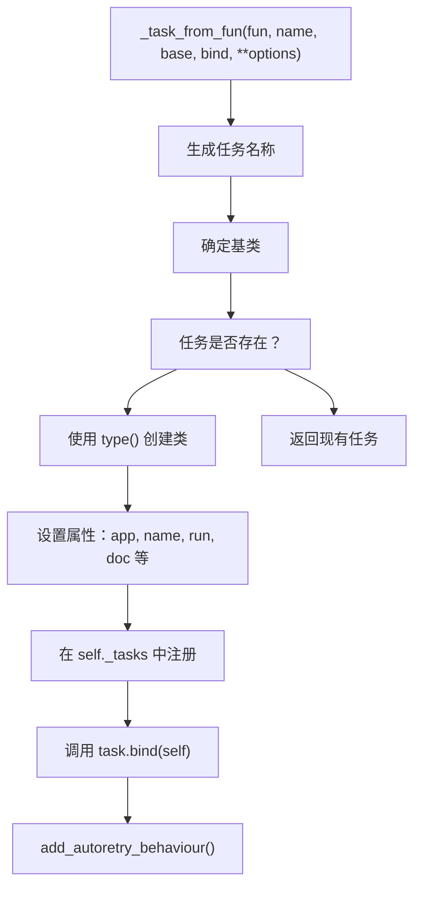
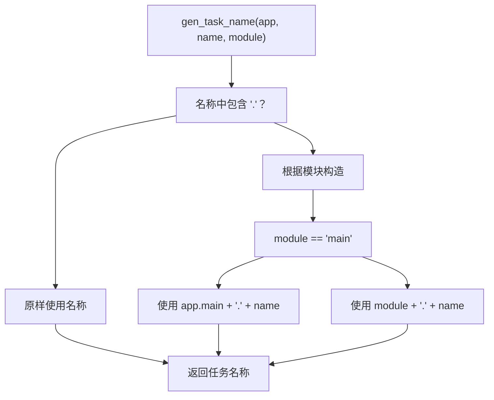
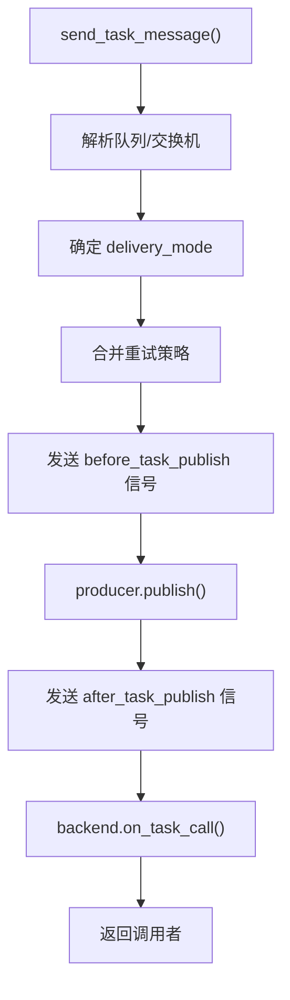
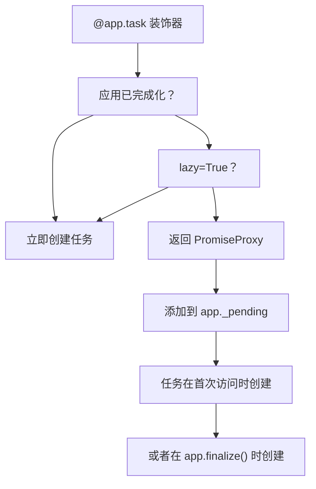
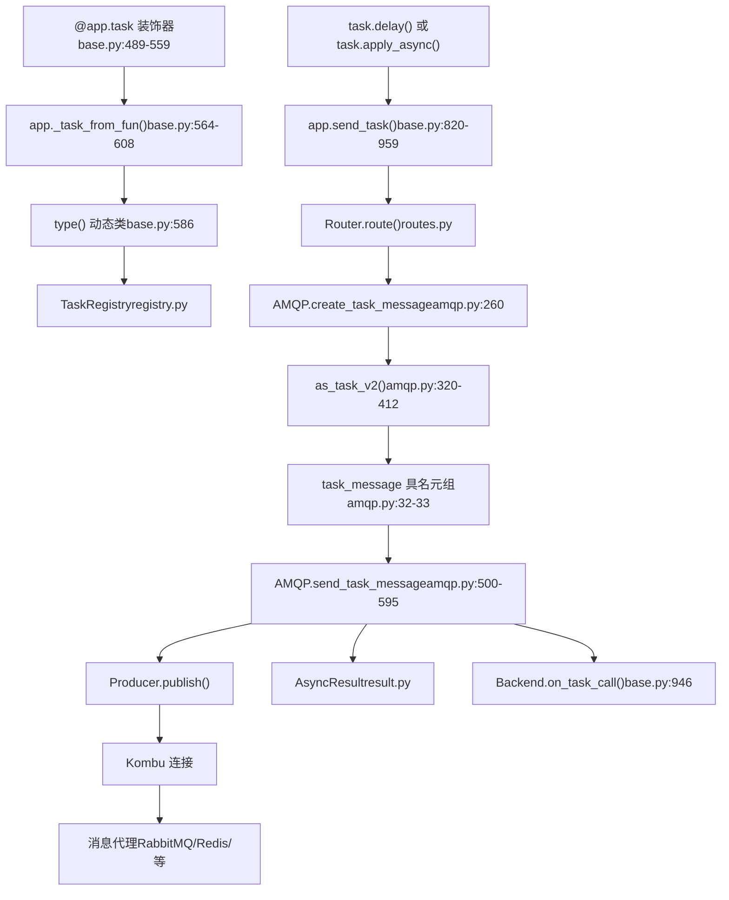

# 任务定义与调用

相关源文件

-   [celery/app/amqp.py](https://github.com/celery/celery/blob/4d068b56/celery/app/amqp.py)
-   [celery/app/base.py](https://github.com/celery/celery/blob/4d068b56/celery/app/base.py)
-   [celery/app/defaults.py](https://github.com/celery/celery/blob/4d068b56/celery/app/defaults.py)
-   [celery/app/task.py](https://github.com/celery/celery/blob/4d068b56/celery/app/task.py)
-   [celery/canvas.py](https://github.com/celery/celery/blob/4d068b56/celery/canvas.py)
-   [celery/utils/\_\_init\_\_.py](https://github.com/celery/celery/blob/4d068b56/celery/utils/__init__.py)
-   [docs/faq.rst](https://github.com/celery/celery/blob/4d068b56/docs/faq.rst)
-   [docs/getting-started/first-steps-with-celery.rst](https://github.com/celery/celery/blob/4d068b56/docs/getting-started/first-steps-with-celery.rst)
-   [docs/getting-started/next-steps.rst](https://github.com/celery/celery/blob/4d068b56/docs/getting-started/next-steps.rst)
-   [docs/userguide/calling.rst](https://github.com/celery/celery/blob/4d068b56/docs/userguide/calling.rst)
-   [docs/userguide/canvas.rst](https://github.com/celery/celery/blob/4d068b56/docs/userguide/canvas.rst)
-   [docs/userguide/monitoring.rst](https://github.com/celery/celery/blob/4d068b56/docs/userguide/monitoring.rst)
-   [docs/userguide/periodic-tasks.rst](https://github.com/celery/celery/blob/4d068b56/docs/userguide/periodic-tasks.rst)
-   [docs/userguide/routing.rst](https://github.com/celery/celery/blob/4d068b56/docs/userguide/routing.rst)
-   [docs/userguide/tasks.rst](https://github.com/celery/celery/blob/4d068b56/docs/userguide/tasks.rst)
-   [docs/userguide/workers.rst](https://github.com/celery/celery/blob/4d068b56/docs/userguide/workers.rst)
-   [t/integration/conftest.py](https://github.com/celery/celery/blob/4d068b56/t/integration/conftest.py)
-   [t/integration/tasks.py](https://github.com/celery/celery/blob/4d068b56/t/integration/tasks.py)
-   [t/integration/test\_canvas.py](https://github.com/celery/celery/blob/4d068b56/t/integration/test_canvas.py)
-   [t/integration/test\_quorum\_queue\_qos\_cluster\_simulation.py](https://github.com/celery/celery/blob/4d068b56/t/integration/test_quorum_queue_qos_cluster_simulation.py)
-   [t/integration/test\_security.py](https://github.com/celery/celery/blob/4d068b56/t/integration/test_security.py)
-   [t/integration/test\_tasks.py](https://github.com/celery/celery/blob/4d068b56/t/integration/test_tasks.py)
-   [t/smoke/tests/test\_canvas.py](https://github.com/celery/celery/blob/4d068b56/t/smoke/tests/test_canvas.py)
-   [t/unit/app/test\_app.py](https://github.com/celery/celery/blob/4d068b56/t/unit/app/test_app.py)
-   [t/unit/tasks/test\_canvas.py](https://github.com/celery/celery/blob/4d068b56/t/unit/tasks/test_canvas.py)
-   [t/unit/tasks/test\_tasks.py](https://github.com/celery/celery/blob/4d068b56/t/unit/tasks/test_tasks.py)

本文档涵盖了如何使用 `@app.task` 装饰器定义任务，以及如何使用 `delay()` 和 `apply_async()` 等方法调用任务。它专注于任务创建、注册和消息发布的机制。

有关任务执行和状态管理的信息，请参阅[任务生命周期与状态](/celery/celery/3.2-task-lifecycle-and-states)。有关错误处理和重试机制，请参阅[错误处理与重试](/celery/celery/3.3-error-handling-and-retry)。有关使用任务进行工作流编排的信息，请参阅[Canvas 工作流](/celery/celery/4-canvas-workflows)。

---

## 任务定义 (Task Definition)

### @app.task 装饰器

任务是通过使用 `@app.task` 装饰一个可调用对象来创建的。该装饰器将一个普通的 Python 函数转换为一个可以由工作者异步执行的任务类（task class）。

**基本示例：**

```
@app.task
def add(x, y):
    return x + y
```
定义在 [celery/app/base.py489-559](https://github.com/celery/celery/blob/4d068b56/celery/app/base.py#L489-L559) 中的 `app.task()` 方法是创建任务的入口点。它返回一个装饰器函数，用于处理该可调用对象并创建一个任务类。

**装饰器流程：**


来源：[celery/app/base.py489-559](https://github.com/celery/celery/blob/4d068b56/celery/app/base.py#L489-L559) [celery/app/base.py564-608](https://github.com/celery/celery/blob/4d068b56/celery/app/base.py#L564-L608)

### 通过 \_task\_from\_fun 进行任务注册

`_task_from_fun()` 方法 [celery/app/base.py564-608](https://github.com/celery/celery/blob/4d068b56/celery/app/base.py#L564-L608) 是将函数转换为任务类的核心机制：


**关键步骤：**

1.  **名称生成**：如果未提供显式名称，`gen_task_name()` 会根据函数的模块和名称创建一个名称 [celery/app/base.py578](https://github.com/celery/celery/blob/4d068b56/celery/app/base.py#L578-L578)
2.  **基类**：使用 `self.Task` 或提供的 `base` 参数 [celery/app/base.py579](https://github.com/celery/celery/blob/4d068b56/celery/app/base.py#L579-L579)
3.  **类创建**：使用 Python 的 `type()` 动态创建一个新类 [celery/app/base.py586-595](https://github.com/celery/celery/blob/4d068b56/celery/app/base.py#L586-L595)
4.  **注册**：将任务存储在 `app._tasks` 字典中 [celery/app/base.py602](https://github.com/celery/celery/blob/4d068b56/celery/app/base.py#L602-L602)

来源：[celery/app/base.py564-608](https://github.com/celery/celery/blob/4d068b56/celery/app/base.py#L564-L608) [celery/utils/imports.py](https://github.com/celery/celery/blob/4d068b56/celery/utils/imports.py)

### 任务选项 (Task Options)

`@task` 装饰器接受众多控制任务行为的选项：

| 选项 | 类型 | 描述 |
| --- | --- | --- |
| `name` | str | 显式任务名称（覆盖自动生成） |
| `bind` | bool | 使任务实例 (`self`) 成为第一个参数 |
| `base` | class | 要继承的基础任务类 |
| `serializer` | str | 序列化格式 (json, pickle, yaml, msgpack) |
| `queue` | str | 用于路由的默认队列 |
| `exchange` | str | 用于路由的默认交换机 |
| `routing_key` | str | 默认路由键 (routing key) |
| `ignore_result` | bool | 不存储任务结果 |
| `time_limit` | float | 硬性时间限制（秒） |
| `soft_time_limit` | float | 软性时间限制（秒） |
| `rate_limit` | str | 速率限制（例如 '10/m', '100/h'） |
| `max_retries` | int | 最大重试次数 |
| `autoretry_for` | tuple | 触发自动重试的异常类 |
| `retry_backoff` | bool/int | 启用指数退避（exponential backoff） |
| `typing` | bool | 启用参数校验 |
| `pydantic` | bool | 启用 Pydantic 校验 |

来源：[docs/userguide/tasks.rst106-114](https://github.com/celery/celery/blob/4d068b56/docs/userguide/tasks.rst#L106-L114) [celery/app/defaults.py259-312](https://github.com/celery/celery/blob/4d068b56/celery/app/defaults.py#L259-L312)

### 绑定任务 (Bound Tasks)

设置 `bind=True` 会使该任务成为一个绑定方法，其中第一个参数是任务实例本身：

```
@app.task(bind=True)
def retry_task(self, x, y):
    try:
        return do_something(x, y)
    except SomeError as exc:
        raise self.retry(exc=exc, countdown=60)
```
绑定任务在以下情况是必要的：

-   访问 `self.request`（任务上下文信息）
-   调用 `self.retry()` 进行手动重试
-   具有额外方法的自定义任务基类

来源：[docs/userguide/tasks.rst149-165](https://github.com/celery/celery/blob/4d068b56/docs/userguide/tasks.rst#L149-L165)

### 任务命名

每个任务都有一个唯一的名称。如果未显式提供，名称将自动生成为 `module_name.function_name`：

**命名逻辑：**


可以通过在自定义 Celery 子类中重写 `gen_task_name()` 来实现自定义命名行为 [docs/userguide/tasks.rst250-296](https://github.com/celery/celery/blob/4d068b56/docs/userguide/tasks.rst#L250-L296)

来源：[celery/utils/imports.py](https://github.com/celery/celery/blob/4d068b56/celery/utils/imports.py) [docs/userguide/tasks.rst186-247](https://github.com/celery/celery/blob/4d068b56/docs/userguide/tasks.rst#L186-L247) [celery/app/base.py628-629](https://github.com/celery/celery/blob/4d068b56/celery/app/base.py#L628-L629)

### Pydantic 集成

当 `pydantic=True` 时，任务可以使用 Pydantic 模型进行参数校验：

```
@app.task(pydantic=True)
def process_data(arg: MyModel) -> ResultModel:
    # arg 会被自动校验并转换为 MyModel
    return ResultModel(value=arg.value)
```
位于 [celery/app/base.py105-183](https://github.com/celery/celery/blob/4d068b56/celery/app/base.py#L105-L183) 的 `pydantic_wrapper()` 函数封装了任务函数，以便：

1.  根据 Pydantic 模型验证参数
2.  如果返回值与返回类型提示匹配，则将其转换为字典

来源：[celery/app/base.py105-183](https://github.com/celery/celery/blob/4d068b56/celery/app/base.py#L105-L183) [celery/app/base.py582-583](https://github.com/celery/celery/blob/4d068b56/celery/app/base.py#L582-L583) [docs/userguide/tasks.rst798-909](https://github.com/celery/celery/blob/4d068b56/docs/userguide/tasks.rst#L798-L909)

---

## 任务调用 (Task Invocation)

### 调用方法

任务暴露了三种执行方法：

| 方法 | 签名 | 描述 |
| --- | --- | --- |
| `delay(*args, **kwargs)` | 快捷方式 | 便捷方法，调用 `apply_async(args, kwargs)` |
| `apply_async(args, kwargs, **options)` | 全权控制 | 发送带有执行选项的任务 |
| `__call__(*args, **kwargs)` | 直接调用 | 在当前进程中同步执行任务 |

### delay() 方法

`delay()` 是一个便捷的快捷方式，看起来像普通的函数调用：

```
result = add.delay(4, 4)
```
它等同于：

```
result = add.apply_async(args=(4, 4))
```
来源：[docs/userguide/calling.rst22-76](https://github.com/celery/celery/blob/4d068b56/docs/userguide/calling.rst#L22-L76)

### apply\_async() 方法

`apply_async()` 提供了对带有选项的任务执行的全权控制：

```
result = add.apply_async(
    args=(4, 4),
    kwargs={'extra': 'value'},
    countdown=60,
    expires=120,
    queue='high-priority',
    routing_key='priority.high',
    priority=10,
    link=other_task.s(),
    link_error=error_handler.s()
)
```
**执行选项：**

| 选项 | 类型 | 描述 |
| --- | --- | --- |
| `countdown` | int/float | 将任务执行延迟 N 秒 |
| `eta` | datetime | 在特定时间执行 |
| `expires` | datetime/int | 任务过期时间/秒数 |
| `queue` | str | 目标队列名称 |
| `routing_key` | str | AMQP 路由键 |
| `priority` | int | 任务优先级 (0-9) |
| `serializer` | str | 覆盖默认序列化器 |
| `compression` | str | 压缩方法 |
| `link` | Signature | 成功回调 |
| `link_error` | Signature | 失败回调 |
| `task_id` | str | 显式任务 ID |
| `root_id` | str | 工作流根 ID |
| `parent_id` | str | 父任务 ID |
| `group_id` | str | 分组任务的组 ID |

来源：[docs/userguide/calling.rst37-76](https://github.com/celery/celery/blob/4d068b56/docs/userguide/calling.rst#L37-L76) [celery/app/base.py820-959](https://github.com/celery/celery/blob/4d068b56/celery/app/base.py#L820-L959)

### send\_task 方法

`send_task()` 方法允许按名称调用任务而无需导入它们：

```
result = app.send_task('tasks.add', args=(4, 4))
```
这对于以下情况很有用：

-   从外部应用程序调用任务
-   跨语言任务调用
-   动态任务名称解析

来源：[celery/app/base.py820-959](https://github.com/celery/celery/blob/4d068b56/celery/app/base.py#L820-L959)

---

## 消息创建与发布

### 任务消息创建流

当一个任务被调用时，Celery 会创建一条消息并将其发布到代理：

> **[Mermaid sequence]**
> *(图表结构无法解析)*

来源：[celery/app/base.py820-959](https://github.com/celery/celery/blob/4d068b56/celery/app/base.py#L820-L959) [celery/app/amqp.py260-266](https://github.com/celery/celery/blob/4d068b56/celery/app/amqp.py#L260-L266) [celery/app/amqp.py479-595](https://github.com/celery/celery/blob/4d068b56/celery/app/amqp.py#L479-L595)

### AMQP 处理器与消息协议

AMQP 处理器提供两种消息协议（v1 和 v2）。自 Celery 4.0 以来，协议 v2 是默认协议：

**任务消息结构（协议 v2）：**

```mermaid
flowchart TD
    A["task_message"]
    B["headers"]
    C["properties"]
    D["body"]
    E["sent_event"]
    B1["id: task_id"]
    B2["task: task_name"]
    B3["eta: ISO8601 string"]
    B4["expires: ISO8601 string"]
    B5["root_id, parent_id"]
    B6["argsrepr, kwargsrepr"]
    B7["timelimit: [hard, soft]"]
    B8["group, group_index"]
    B9["retries, origin"]
    B10["stamps: custom headers"]
    C1["correlation_id: task_id"]
    C2["reply_to: result queue"]
    D1["args: tuple"]
    D2["kwargs: dict"]
    D3["callbacks: list"]
    D4["errbacks: list"]
    D5["chain: list"]
    D6["chord: dict"]

    A --> B
    A --> C
    A --> D
    A --> E
    B --> B1
    B --> B2
    B --> B3
    B --> B4
    B --> B5
    B --> B6
    B --> B7
    B --> B8
    B --> B9
    B --> B10
    C --> C1
    C --> C2
    D --> D1
    D --> D2
    D --> D3
    D --> D4
    D --> D5
    D --> D6
```


`as_task_v2()` 方法 [celery/app/amqp.py320-412](https://github.com/celery/celery/blob/4d068b56/celery/app/amqp.py#L320-L412) 构建消息：

1.  **Headers**：任务元数据（id, name, eta, timelimit, root\_id 等）
2.  **Properties**：AMQP 属性 (correlation\_id, reply\_to)
3.  **Body**：(args, kwargs, embed\_dict) 的元组
4.  **Sent Event**：用于监控的可选事件数据

来源：[celery/app/amqp.py320-412](https://github.com/celery/celery/blob/4d068b56/celery/app/amqp.py#L320-L412) [celery/app/amqp.py32-33](https://github.com/celery/celery/blob/4d068b56/celery/app/amqp.py#L32-L33)

### 路由与队列选择 (Routing and Queue Selection)

路由器决定使用哪个队列和交换机：

```mermaid
flowchart TD
    A["Router.route(opts, name, args, kwargs)"]
    B["opts 中有 queue？"]
    C["使用显式队列"]
    D["是否设置了 Task.queue？"]
    E["使用 Task.queue"]
    F["是否有 task_routes 配置？"]
    G["应用路由规则"]
    H["使用 task_default_queue"]
    I["解析 Queue 对象"]
    J["提取 exchange, routing_key"]
    K["返回路由选项"]

    A --> B
    B --> C
    B --> D
    D --> E
    D --> F
    F --> G
    F --> H
    C --> I
    E --> I
    G --> I
    H --> I
    I --> J
    J --> K
```


**优先级顺序：**

1.  `apply_async()` 中的显式 `queue` 参数
2.  任务的 `queue` 属性
3.  匹配任务名称的 `task_routes` 配置
4.  `task_default_queue` 配置

来源：[celery/app/amqp.py302-306](https://github.com/celery/celery/blob/4d068b56/celery/app/amqp.py#L302-L306) [celery/app/base.py849-850](https://github.com/celery/celery/blob/4d068b56/celery/app/base.py#L849-L850)

### 消息发布

`send_task_message()` 函数 [celery/app/amqp.py500-595](https://github.com/celery/celery/blob/4d068b56/celery/app/amqp.py#L500-L595) 处理实际的发布操作：

**发布步骤：**


1.  **队列解析**：如果需要，将队列名称转换为 Queue 对象 [celery/app/amqp.py515-522](https://github.com/celery/celery/blob/4d068b56/celery/app/amqp.py#L515-L522)
2.  **交换机处理**：使用默认交换机或队列的交换机 [celery/app/amqp.py531-543](https://github.com/celery/celery/blob/4d068b56/celery/app/amqp.py#L531-L543)
3.  **重试策略**：合并默认和自定义重试策略 [celery/app/amqp.py548-550](https://github.com/celery/celery/blob/4d068b56/celery/app/amqp.py#L548-L550)
4.  **信号**：触发 `before_task_publish` 和 `after_task_publish` 信号 [celery/app/amqp.py552-573](https://github.com/celery/celery/blob/4d068b56/celery/app/amqp.py#L552-L573)
5.  **后端通知**：调用 `backend.on_task_call()` 进行结果追踪 [celery/app/amqp.py945-946](https://github.com/celery/celery/blob/4d068b56/celery/app/amqp.py#L945-L946)

来源：[celery/app/amqp.py479-595](https://github.com/celery/celery/blob/4d068b56/celery/app/amqp.py#L479-L595) [celery/app/base.py943-947](https://github.com/celery/celery/blob/4d068b56/celery/app/base.py#L943-L947)

---

## 任务注册与发现

### 任务注册表 (Task Registry)

所有任务都存储在 `app._tasks` 中，这是一个 `TaskRegistry` 字典：

```
app._tasks = {
    'tasks.add': <Task: tasks.add>,
    'tasks.multiply': <Task: tasks.multiply>,
    ...
}
```
注册发生在以下期间：

1.  `@app.task` 装饰（立即或延迟）
2.  `app.finalize()`（评估待处理的装饰器）
3.  `app.autodiscover_tasks()`（导入任务模块）

来源：[celery/app/base.py357-359](https://github.com/celery/celery/blob/4d068b56/celery/app/base.py#L357-L359) [celery/app/base.py602](https://github.com/celery/celery/blob/4d068b56/celery/app/base.py#L602-L602)

### 延迟注册与 PromiseProxy

当 `autofinalize=True`（默认值）但应用尚未完成化时，装饰器会返回一个 `PromiseProxy` [celery/app/base.py542-544](https://github.com/celery/celery/blob/4d068b56/celery/app/base.py#L542-L544)：


该代理确保了可以在配置应用之前定义任务，这在模块化应用中很常见。

来源：[celery/app/base.py538-544](https://github.com/celery/celery/blob/4d068b56/celery/app/base.py#L538-L544) [celery/app/base.py631-651](https://github.com/celery/celery/blob/4d068b56/celery/app/base.py#L631-L651)

### 自动发现 (Autodiscovery)

`autodiscover_tasks()` 方法扫描包以查找任务模块：

```
app.autodiscover_tasks(['myapp', 'otherapp'], related_name='tasks')
```
它会为每个包导入 `<package>.tasks`，注册通过 `@app.task` 或 `@shared_task` 找到的所有任务。

来源：[celery/app/base.py756-818](https://github.com/celery/celery/blob/4d068b56/celery/app/base.py#L756-L818) [celery/loaders/base.py218-221](https://github.com/celery/celery/blob/4d068b56/celery/loaders/base.py#L218-L221) [celery/loaders/base.py239-262](https://github.com/celery/celery/blob/4d068b56/celery/loaders/base.py#L239-L262)

---

## 共享任务 (Shared Tasks)

`@shared_task` 装饰器创建可与任何应用协同工作的任务：

```
from celery import shared_task

@shared_task
def add(x, y):
    return x + y
```
这对于以下情况很有用：

-   可复用的任务库
-   Django 应用程序（在应用完全配置之前）
-   在多个 Celery 应用之间共享的任务模块

共享任务在首次访问时会注册到当前的默认应用。

来源：[celery/app/task.py](https://github.com/celery/celery/blob/4d068b56/celery/app/task.py) [docs/userguide/tasks.rst122-131](https://github.com/celery/celery/blob/4d068b56/docs/userguide/tasks.rst#L122-L131)

---

## 完整任务调用实体映射 (Complete Task Invocation Entity Map)

该图映射了从任务定义到消息代理交付的完整流程：


来源：[celery/app/base.py489-608](https://github.com/celery/celery/blob/4d068b56/celery/app/base.py#L489-L608) [celery/app/base.py820-959](https://github.com/celery/celery/blob/4d068b56/celery/app/base.py#L820-L959) [celery/app/amqp.py320-595](https://github.com/celery/celery/blob/4d068b56/celery/app/amqp.py#L320-L595)
