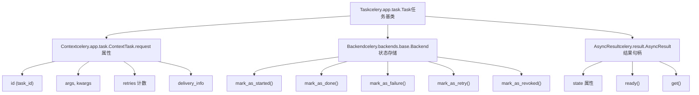
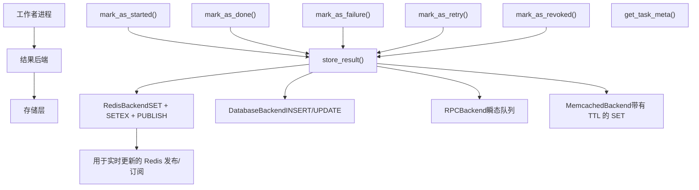
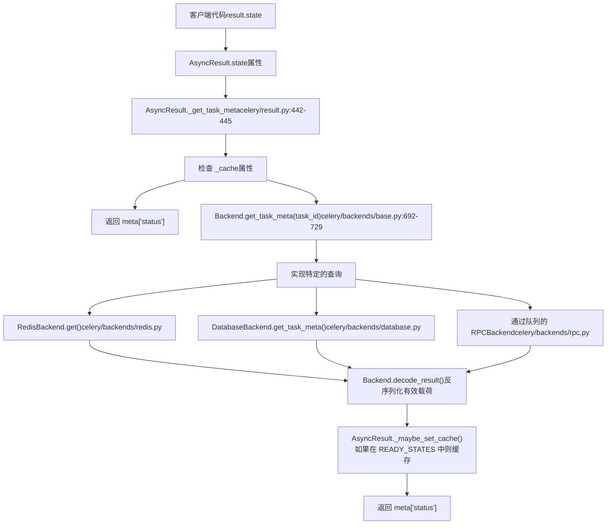
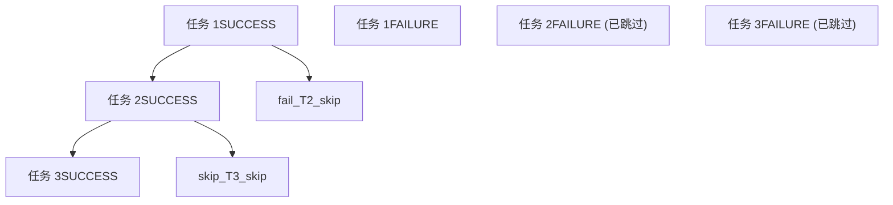

# 任务生命周期与状态

相关源文件

-   [celery/app/amqp.py](https://github.com/celery/celery/blob/4d068b56/celery/app/amqp.py)
-   [celery/app/base.py](https://github.com/celery/celery/blob/4d068b56/celery/app/base.py)
-   [celery/app/defaults.py](https://github.com/celery/celery/blob/4d068b56/celery/app/defaults.py)
-   [celery/app/task.py](https://github.com/celery/celery/blob/4d068b56/celery/app/task.py)
-   [celery/canvas.py](https://github.com/celery/celery/blob/4d068b56/celery/canvas.py)
-   [celery/utils/\_\_init\_\_.py](https://github.com/celery/celery/blob/4d068b56/celery/utils/__init__.py)
-   [docs/faq.rst](https://github.com/celery/celery/blob/4d068b56/docs/faq.rst)
-   [docs/getting-started/first-steps-with-celery.rst](https://github.com/celery/celery/blob/4d068b56/docs/getting-started/first-steps-with-celery.rst)
-   [docs/getting-started/next-steps.rst](https://github.com/celery/celery/blob/4d068b56/docs/getting-started/next-steps.rst)
-   [docs/userguide/calling.rst](https://github.com/celery/celery/blob/4d068b56/docs/userguide/calling.rst)
-   [docs/userguide/canvas.rst](https://github.com/celery/celery/blob/4d068b56/docs/userguide/canvas.rst)
-   [docs/userguide/monitoring.rst](https://github.com/celery/celery/blob/4d068b56/docs/userguide/monitoring.rst)
-   [docs/userguide/periodic-tasks.rst](https://github.com/celery/celery/blob/4d068b56/docs/userguide/periodic-tasks.rst)
-   [docs/userguide/routing.rst](https://github.com/celery/celery/blob/4d068b56/docs/userguide/routing.rst)
-   [docs/userguide/tasks.rst](https://github.com/celery/celery/blob/4d068b56/docs/userguide/tasks.rst)
-   [docs/userguide/workers.rst](https://github.com/celery/celery/blob/4d068b56/docs/userguide/workers.rst)
-   [t/integration/conftest.py](https://github.com/celery/celery/blob/4d068b56/t/integration/conftest.py)
-   [t/integration/tasks.py](https://github.com/celery/celery/blob/4d068b56/t/integration/tasks.py)
-   [t/integration/test\_canvas.py](https://github.com/celery/celery/blob/4d068b56/t/integration/test_canvas.py)
-   [t/integration/test\_quorum\_queue\_qos\_cluster\_simulation.py](https://github.com/celery/celery/blob/4d068b56/t/integration/test_quorum_queue_qos_cluster_simulation.py)
-   [t/integration/test\_security.py](https://github.com/celery/celery/blob/4d068b56/t/integration/test_security.py)
-   [t/integration/test\_tasks.py](https://github.com/celery/celery/blob/4d068b56/t/integration/test_tasks.py)
-   [t/smoke/tests/test\_canvas.py](https://github.com/celery/celery/blob/4d068b56/t/smoke/tests/test_canvas.py)
-   [t/unit/app/test\_app.py](https://github.com/celery/celery/blob/4d068b56/t/unit/app/test_app.py)
-   [t/unit/tasks/test\_canvas.py](https://github.com/celery/celery/blob/4d068b56/t/unit/tasks/test_canvas.py)
-   [t/unit/tasks/test\_tasks.py](https://github.com/celery/celery/blob/4d068b56/t/unit/tasks/test_tasks.py)

本页面记录了 Celery 任务从创建到完成的生命周期，包括任务可能经历的所有状态，以及状态信息如何在结果后端（result backends）中被跟踪和存储。

有关调用任务的信息，请参阅[任务定义与调用](/celery/celery/3.1-task-definition-and-invocation)。有关错误处理和重试机制，请参阅[错误处理与重试](/celery/celery/3.3-error-handling-and-retry)。

---

## 任务状态概览 (Task States Overview)

Celery 中的任务在生命周期中会经历各种状态。状态代表了任务执行的当前状况，并存储在结果后端中（如果已配置）。

### 状态定义

Celery 在 `celery.states` 模块中定义了任务状态，后端类将其组织为以下类别：

| 状态 | 类别 | 描述 | 是否存储在后端 |
| --- | --- | --- | --- |
| `PENDING` | 未就绪 | 任务正在等待执行或未知。任何尚未注册的任务 ID 的默认状态 | 否 (隐式) |
| `STARTED` | 未就绪 | 任务已由工作者开始执行 | 是 (如果 `task_track_started=True`) |
| `RETRY` | 未就绪 | 任务在失败后正在重试 | 是 |
| `FAILURE` | 就绪、异常 | 任务执行失败并抛出异常 | 是 |
| `SUCCESS` | 就绪 | 任务执行成功 | 是 |
| `REVOKED` | 就绪、异常 | 任务已被撤销/取消 | 是 |

**来源：** [celery/backends/base.py109-112](https://github.com/celery/celery/blob/4d068b56/celery/backends/base.py#L109-L112) [celery/result.py193-194](https://github.com/celery/celery/blob/4d068b56/celery/result.py#L193-L194) [celery/app/task.py9](https://github.com/celery/celery/blob/4d068b56/celery/app/task.py#L9-L9)

### 状态类别

`celery.backends.base` 中的 `Backend` 类为了辅助决策将状态分为以下几类：

```
# 来自 celery.backends.base.Backend
READY_STATES = states.READY_STATES        # {SUCCESS, FAILURE, REVOKED}
UNREADY_STATES = states.UNREADY_STATES    # {PENDING, STARTED, RETRY}
EXCEPTION_STATES = states.EXCEPTION_STATES # {FAILURE, RETRY, REVOKED}
```
额外的状态分组：

-   **READY\_STATES**：任务已完成执行（无论成功与否），且不会再次执行。
-   **UNREADY\_STATES**：任务尚未完成执行。
-   **EXCEPTION\_STATES**：任务状态指示存在错误情况。
-   **PROPAGATE\_STATES**：当任务失败时应在链式调用（chains）中传播的状态（用于链式错误处理）。

**来源：** [celery/backends/base.py109-112](https://github.com/celery/celery/blob/4d068b56/celery/backends/base.py#L109-L112) [celery/result.py193-194](https://github.com/celery/celery/blob/4d068b56/celery/result.py#L193-L194)

---

## 任务生命周期流

### 任务生命周期组件

标题：**任务生命周期组件架构**


**来源：** [celery/app/task.py60-161](https://github.com/celery/celery/blob/4d068b56/celery/app/task.py#L60-L161) [celery/app/task.py164-627](https://github.com/celery/celery/blob/4d068b56/celery/app/task.py#L164-L627) [celery/backends/base.py108-421](https://github.com/celery/celery/blob/4d068b56/celery/backends/base.py#L108-L421) [celery/result.py69-461](https://github.com/celery/celery/blob/4d068b56/celery/result.py#L69-L461)

### 完整生命周期状态图

> **[Mermaid stateDiagram]**
> *(图表结构无法解析)*

**来源：** [celery/backends/base.py176-307](https://github.com/celery/celery/blob/4d068b56/celery/backends/base.py#L176-L307) [celery/result.py343-357](https://github.com/celery/celery/blob/4d068b56/celery/result.py#L343-L357) [celery/app/task.py661-695](https://github.com/celery/celery/blob/4d068b56/celery/app/task.py#L661-L695)

### 状态转换细节

#### 1. 任务创建 (PENDING)

当通过 `Task.delay()` 或 `Task.apply_async()` 调用任务时，它进入 `PENDING` 状态：

-   调用 `Task.apply_async()` 方法 [celery/app/task.py446-613](https://github.com/celery/celery/blob/4d068b56/celery/app/task.py#L446-L613)
-   如果未通过 `task_id` 选项提供，则生成唯一的任务 ID (UUID)
-   任务消息通过 `app.send_task()` 发送到代理 [celery/app/base.py820-959](https://github.com/celery/celery/blob/4d068b56/celery/app/base.py#L820-L959)
-   向调用者返回一个 `AsyncResult` 实例 [celery/result.py88-100](https://github.com/celery/celery/blob/4d068b56/celery/result.py#L88-L100)
-   **没有状态被写入后端** - 对于未知的任务 ID，PENDING 是隐式的

当 `Backend.get_task_meta()` 未发现任务 ID 的存储状态时，会返回 `PENDING` 状态。

**来源：** [celery/app/task.py446-613](https://github.com/celery/celery/blob/4d068b56/celery/app/task.py#L446-L613) [celery/result.py88-100](https://github.com/celery/celery/blob/4d068b56/celery/result.py#L88-L100) [celery/backends/base.py692-729](https://github.com/celery/celery/blob/4d068b56/celery/backends/base.py#L692-L729)

#### 2. 任务已开始 (STARTED)

当工作者拾取并开始执行任务时：

-   如果 `Task.track_started` 为 `True`，则工作者的任务执行策略调用 `Backend.mark_as_started()`
-   状态元数据包括：任务 ID、参数、工作者主机名
-   `Task.request` 中的 `Context` 对象被填充以执行细节 [celery/app/task.py60-161](https://github.com/celery/celery/blob/4d068b56/celery/app/task.py#L60-L161)

```
# Backend.mark_as_started() 签名位于 celery/backends/base.py:176-178
def mark_as_started(self, task_id, **meta):
    """将任务标记为已开始。"""
    return self.store_result(task_id, meta, states.STARTED)
```
**注意：** 为了性能，默认情况下 `task_track_started` 为 `False`。`Task.track_started` 属性控制此行为 [celery/app/task.py258](https://github.com/celery/celery/blob/4d068b56/celery/app/task.py#L258-L258)

**何时启用：**

-   对于区分“已开始”与“待处理”很重要的长时间运行的任务
-   进度追踪 UI
-   调试任务执行问题

**来源：** [celery/backends/base.py176-178](https://github.com/celery/celery/blob/4d068b56/celery/backends/base.py#L176-L178) [celery/app/task.py258](https://github.com/celery/celery/blob/4d068b56/celery/app/task.py#L258-L258) [celery/app/task.py60-161](https://github.com/celery/celery/blob/4d068b56/celery/app/task.py#L60-L161)

#### 3. 任务成功 (SUCCESS)

当任务完成且未抛出异常时：

-   `Task.run()` 方法正常返回
-   工作者调用带有结果值的 `Backend.mark_as_done()` [celery/backends/base.py180-186](https://github.com/celery/celery/blob/4d068b56/celery/backends/base.py#L180-L186)
-   状态元数据包括：结果值、`date_done` 时间戳、`children` 列表（针对 canvas 工作流）
-   消息被确认 (acknowledged) 给代理（具体时机取决于 `Task.acks_late` 设置 [celery/app/task.py269](https://github.com/celery/celery/blob/4d068b56/celery/app/task.py#L269-L269)）

```
# Backend.mark_as_done() 位于 celery/backends/base.py:180-186
def mark_as_done(self, task_id, result,
                 request=None, store_result=True, state=states.SUCCESS):
    """将任务标记为成功执行。"""
    if (store_result and not _is_request_ignore_result(request)):
        self.store_result(task_id, result, state, request=request)
    if request and request.chord:
        self.on_chord_part_return(request, state, result)
```
`store_result()` 方法 [celery/backends/base.py612-644](https://github.com/celery/celery/blob/4d068b56/celery/backends/base.py#L612-L644) 处理向后端的实际持久化。

**来源：** [celery/backends/base.py180-186](https://github.com/celery/celery/blob/4d068b56/celery/backends/base.py#L180-L186) [celery/backends/base.py612-644](https://github.com/celery/celery/blob/4d068b56/celery/backends/base.py#L612-L644) [celery/app/task.py269](https://github.com/celery/celery/blob/4d068b56/celery/app/task.py#L269-L269)

#### 4. 任务失败 (FAILURE)

当任务抛出未重试的异常时：

-   工作者捕获异常并调用 `Backend.mark_as_failure()` [celery/backends/base.py188-242](https://github.com/celery/celery/blob/4d068b56/celery/backends/base.py#L188-L242)
-   状态元数据包括：序列化的异常、回溯 (traceback) 字符串、`date_done` 时间戳
-   如果定义了 `Context.errbacks` 中的错误回调，则执行它们 [celery/app/task.py72](https://github.com/celery/celery/blob/4d068b56/celery/app/task.py#L72-L72)
-   对于链式任务，异常通过 `Context.chain` 传播到后续任务 [celery/app/task.py68](https://github.com/celery/celery/blob/4d068b56/celery/app/task.py#L68-L68)

```
# Backend.mark_as_failure() 位于 celery/backends/base.py:188-242
def mark_as_failure(self, task_id, exc,
                    traceback=None, request=None,
                    store_result=True, call_errbacks=True,
                    state=states.FAILURE):
    """将任务标记为执行失败。"""
    if store_result:
        self.store_result(task_id, exc, state,
                          traceback=traceback, request=request)
    if request:
        if request.chord:
            self.on_chord_part_return(request, state, exc)
        # 206-239 行的链传播逻辑
        # 241-242 行的错误回调 (errback) 执行
        if call_errbacks and request.errbacks:
            self._call_task_errbacks(request, exc, traceback)
```
`Backend.prepare_exception()` 方法 [celery/backends/base.py424-432](https://github.com/celery/celery/blob/4d068b56/celery/backends/base.py#L424-L432) 将异常序列化以便存储。

**来源：** [celery/backends/base.py188-242](https://github.com/celery/celery/blob/4d068b56/celery/backends/base.py#L188-L242) [celery/backends/base.py424-432](https://github.com/celery/celery/blob/4d068b56/celery/backends/base.py#L424-L432) [celery/app/task.py68](https://github.com/celery/celery/blob/4d068b56/celery/app/task.py#L68-L68) [celery/app/task.py72](https://github.com/celery/celery/blob/4d068b56/celery/app/task.py#L72-L72)

#### 5. 任务重试 (RETRY)

当任务调用 `Task.retry()` [celery/app/task.py661-695](https://github.com/celery/celery/blob/4d068b56/celery/app/task.py#L661-L695) 或触发自动重试时：

-   `Task.retry()` 抛出一个 `Retry` 异常 [celery/exceptions.py](https://github.com/celery/celery/blob/4d068b56/celery/exceptions.py)
-   工作者捕获 `Retry` 并调用 `Backend.mark_as_retry()` [celery/backends/base.py299-307](https://github.com/celery/celery/blob/4d068b56/celery/backends/base.py#L299-L307)
-   状态元数据包括：异常、回溯、`Context.retries` 计数 [celery/app/task.py88](https://github.com/celery/celery/blob/4d068b56/celery/app/task.py#L88-L88)
-   发布一条带有 `countdown` 或 `eta` 选项的新任务消息
-   原始消息被确认

```
# Backend.mark_as_retry() 位于 celery/backends/base.py:299-307
def mark_as_retry(self, task_id, exc, traceback=None,
                  request=None, store_result=True, state=states.RETRY):
    """将任务标记为正在重试。

    注意：
        存储当前异常（如果有）。
    """
    return self.store_result(task_id, exc, state,
                             traceback=traceback, request=request)
```
`Task.max_retries` 属性 [celery/app/task.py199](https://github.com/celery/celery/blob/4d068b56/celery/app/task.py#L199-L199) 限制了重试尝试次数。

**来源：** [celery/backends/base.py299-307](https://github.com/celery/celery/blob/4d068b56/celery/backends/base.py#L299-L307) [celery/app/task.py661-695](https://github.com/celery/celery/blob/4d068b56/celery/app/task.py#L661-L695) [celery/app/task.py88](https://github.com/celery/celery/blob/4d068b56/celery/app/task.py#L88-L88) [celery/app/task.py199](https://github.com/celery/celery/blob/4d068b56/celery/app/task.py#L199-L199)

#### 6. 任务已撤销 (REVOKED)

当任务通过 `AsyncResult.revoke()` [celery/result.py144-164](https://github.com/celery/celery/blob/4d068b56/celery/result.py#L144-L164) 或控制命令被取消时：

-   撤销请求通过 `app.control.revoke()` 广播到所有工作者 [celery/result.py162-164](https://github.com/celery/celery/blob/4d068b56/celery/result.py#L162-L164)
-   工作者使用 `Backend.mark_as_revoked()` 标记任务 [celery/backends/base.py290-297](https://github.com/celery/celery/blob/4d068b56/celery/backends/base.py#L290-L297)
-   状态元数据包括：带有原因字符串的 `TaskRevokedError`
-   工作者行为取决于选项：
    -   `terminate=True`：发送信号以终止正在运行的任务进程
    -   默认：如果任务尚未开始，则跳过任务执行

```
# Backend.mark_as_revoked() 位于 celery/backends/base.py:290-297
def mark_as_revoked(self, task_id, reason='',
                    request=None, store_result=True, state=states.REVOKED):
    exc = TaskRevokedError(reason)
    if store_result:
        self.store_result(task_id, exc, state,
                          traceback=None, request=request)
    if request and request.chord:
        self.on_chord_part_return(request, state, exc)
```
**来源：** [celery/backends/base.py290-297](https://github.com/celery/celery/blob/4d068b56/celery/backends/base.py#L290-L297) [celery/result.py144-164](https://github.com/celery/celery/blob/4d068b56/celery/result.py#L144-L164)

---

## 后端状态存储

### 存储架构


**来源：** [celery/backends/base.py612-644](https://github.com/celery/celery/blob/4d068b56/celery/backends/base.py#L612-L644) [celery/backends/redis.py440-453](https://github.com/celery/celery/blob/4d068b56/celery/backends/redis.py#L440-L453)

### 结果元数据结构

当通过 `Backend.store_result()` 存储任务状态时，后端使用 `Backend._get_result_meta()` 构造元数据：

```
# 核心元数据结构位于 celery/backends/base.py:558-607
meta = {
    'status': state,                    # 状态常量 (SUCCESS, FAILURE 等)
    'result': result,                   # 返回值或异常对象
    'traceback': traceback,             # 回溯字符串 (如果是异常)
    'children': [...],                  # 子 AsyncResult 对象 (针对 canvas)
    'date_done': date_done,             # ISO 8601 时间戳字符串
    'task_id': task_id,                 # 任务 UUID
}

# 如果配置中 result_extended=True，则包含扩展元数据：
meta.update({
    'name': request.task,               # 来自 Context 的任务名称
    'args': request.args,               # 来自 Context 的位置参数
    'kwargs': request.kwargs,           # 来自 Context 的关键字参数
    'worker': request.hostname,         # 来自 Context 的工作者主机名
    'retries': request.retries,         # 来自 Context 的重试计数
    'queue': request.delivery_info.get('routing_key'),  # 来自 Context 的队列名称
})
```
`Context` 对象（任务请求上下文）提供了执行元数据 [celery/app/task.py60-161](https://github.com/celery/celery/blob/4d068b56/celery/app/task.py#L60-L161)

**来源：** [celery/backends/base.py558-607](https://github.com/celery/celery/blob/4d068b56/celery/backends/base.py#L558-L607) [celery/app/task.py60-161](https://github.com/celery/celery/blob/4d068b56/celery/app/task.py#L60-L161)

### 键命名规范

后端通过 `Backend.get_key_for_task()` 使用一致的键命名：

| 后端类型 | 键模式 | 示例 |
| --- | --- | --- |
| Redis/Memcached | `celery-task-meta-{task_id}` | `celery-task-meta-abc123...` |
| Redis (带有前缀) | `{key_prefix}celery-task-meta-{task_id}` | `myapp:celery-task-meta-abc123...` |
| 数据库 | 以 `task_id` 为主键的表行 | `celery_taskmeta.task_id = 'abc123...'` |
| RPC | AMQP reply 队列 | 任务特定的临时队列 |

`Backend.get_key_for_task()` 方法 [celery/backends/base.py911-914](https://github.com/celery/celery/blob/4d068b56/celery/backends/base.py#L911-L914) 生成键，`KeyValueStoreBackend` 子类会一致地使用它。

**来源：** [celery/backends/base.py911-914](https://github.com/celery/celery/blob/4d068b56/celery/backends/base.py#L911-L914) [celery/backends/redis.py367-370](https://github.com/celery/celery/blob/4d068b56/celery/backends/redis.py#L367-L370)

### 状态持久化与过期

任务状态可以配置为自动过期：

-   **result\_expires**：默认过期时间（timedelta 或秒）
-   **自动过期的后端**：Redis、Memcached 会自动移除过期的键
-   **非自动过期的后端**：需要定期执行清理任务 `celery.backend_cleanup`

```
# 配置示例
app.conf.result_expires = 3600  # 1 小时，以秒为单位

# 或者使用 timedelta
from datetime import timedelta
app.conf.result_expires = timedelta(hours=1)
```
**来源：** [celery/backends/base.py535-542](https://github.com/celery/celery/blob/4d068b56/celery/backends/base.py#L535-L542) [celery/app/builtins.py13-23](https://github.com/celery/celery/blob/4d068b56/celery/app/builtins.py#L13-L23)

---

## 查询任务状态

### 使用 AsyncResult

`AsyncResult` 类 [celery/result.py69-461](https://github.com/celery/celery/blob/4d068b56/celery/result.py#L69-L461) 提供了查询任务状态的方法：

```
# 创建结果对象
from celery.result import AsyncResult
result = AsyncResult(task_id, app=app)

# 通过属性查询状态 (调用 Backend.get_task_meta())
result.state           # 返回: 'PENDING', 'STARTED', 'SUCCESS' 等
result.status          # state 的别名 (为了后向兼容)

# 检查就绪状态 (343-357 行)
result.ready()         # 如果状态在 Backend.READY_STATES 中则为 True
result.successful()    # 如果状态 == states.SUCCESS 则为 True
result.failed()        # 如果状态 == states.FAILURE 则为 True

# 获取结果 (阻塞直到就绪, 190-261 行)
result.get(timeout=10, propagate=True)  # 返回结果或抛出异常
```
`AsyncResult.state` 属性调用 `AsyncResult._get_task_meta()`，后者会查询 `Backend.get_task_meta()` [celery/result.py442-445](https://github.com/celery/celery/blob/4d068b56/celery/result.py#L442-L445)

**来源：** [celery/result.py69-461](https://github.com/celery/celery/blob/4d068b56/celery/result.py#L69-L461) [celery/result.py442-445](https://github.com/celery/celery/blob/4d068b56/celery/result.py#L442-L445) [celery/result.py190-261](https://github.com/celery/celery/blob/4d068b56/celery/result.py#L190-L261) [celery/result.py343-357](https://github.com/celery/celery/blob/4d068b56/celery/result.py#L343-L357)

### 状态属性实现

标题：**AsyncResult 状态查询流**


**来源：** [celery/result.py442-445](https://github.com/celery/celery/blob/4d068b56/celery/result.py#L442-L445) [celery/backends/base.py692-729](https://github.com/celery/celery/blob/4d068b56/celery/backends/base.py#L692-L729) [celery/result.py433-440](https://github.com/celery/celery/blob/4d068b56/celery/result.py#L433-L440)

### 状态缓存

后端在 `Backend.__init__()` 中实现了一个 LRU 缓存以提高性能：

```
# 后端初始化位于 celery/backends/base.py:147-148
cmax = max_cached_results or conf.result_cache_max
self._cache = _nulldict() if cmax == -1 else LRUCache(limit=cmax)
```
缓存行为：

-   当状态处于 `READY_STATES` 时，`AsyncResult` 将状态缓存在 `_cache` 属性中 [celery/result.py433-440](https://github.com/celery/celery/blob/4d068b56/celery/result.py#L433-L440)
-   `Backend.get_task_meta()` 为处于 SUCCESS 状态的任务缓存结果 [celery/backends/base.py727-729](https://github.com/celery/celery/blob/4d068b56/celery/backends/base.py#L727-L729)
-   缓存大小由 `result_cache_max` 配置项控制
-   设置 `result_cache_max=-1` 可完全禁用缓存
-   失败/重试状态不会被后端缓存，以便轮询状态变化

**来源：** [celery/backends/base.py147-148](https://github.com/celery/celery/blob/4d068b56/celery/backends/base.py#L147-L148) [celery/backends/base.py727-729](https://github.com/celery/celery/blob/4d068b56/celery/backends/base.py#L727-L729) [celery/result.py433-440](https://github.com/celery/celery/blob/4d068b56/celery/result.py#L433-L440)

---

## Canvas 工作流中的状态转换

### 链式状态传播 (Chain State Propagation)

当任务被链式连接在一起时，异常状态会通过链条传播：


当链条中的某个任务失败时：

1.  后端的 `mark_as_failure()` 方法处理链条元素
2.  链条中的每个后续任务都被标记为 FAILURE（如果 `store_result=True`）
3.  异常被传播，而不执行后续任务

**来源：** [celery/backends/base.py206-239](https://github.com/celery/celery/blob/4d068b56/celery/backends/base.py#L206-L239)

### Chord 状态协调

Chord 需要特殊的状态追踪来同步 header 的完成情况：

> **[Mermaid sequence]**
> *(图表结构无法解析)*

当每个 header 任务完成时，都会调用 `on_chord_part_return()` 方法：

-   Redis 后端：递增有序集合 (sorted set) 中的计数器
-   其他后端：使用备用的 `chord_unlock` 轮询任务

**来源：** [celery/backends/base.py185-186](https://github.com/celery/celery/blob/4d068b56/celery/backends/base.py#L185-L186) [celery/backends/base.py778-779](https://github.com/celery/celery/blob/4d068b56/celery/backends/base.py#L778-L779) [celery/backends/redis.py468-523](https://github.com/celery/celery/blob/4d068b56/celery/backends/redis.py#L468-L523) [celery/app/builtins.py37-98](https://github.com/celery/celery/blob/4d068b56/celery/app/builtins.py#L37-L98)

### 组状态追踪 (Group State Tracking)

组结果汇总了多个并行任务的状态：

```
# GroupResult 状态方法
group_result.ready()        # 如果所有任务都就绪，则为 True
group_result.successful()   # 如果所有任务都成功，则为 True
group_result.failed()       # 如果有任何任务失败，则为 True
group_result.waiting()      # 如果有任何任务尚未就绪，则为 True
```
**来源：** [celery/result.py616-654](https://github.com/celery/celery/blob/4d068b56/celery/result.py#L616-L654)

---

## 特殊状态行为

### PENDING 状态

`PENDING` 的独特之处在于它是唯一不显式存储在后端的状态：

-   它是任何未知任务 ID 的默认状态
-   对于未知 ID，`Backend.get_task_meta()` 返回 `{'status': 'PENDING', 'result': None}` [celery/backends/base.py692-729](https://github.com/celery/celery/blob/4d068b56/celery/backends/base.py#L692-L729)
-   这允许在不出错的情况下查询任意任务 ID
-   **局限性**：无法区分“任务未开始”与“任务 ID 不存在”

PENDING 任务的默认元数据结构：

```
# 位于 celery/backends/base.py:692-729
return {
    'status': states.PENDING,
    'result': None,
    'traceback': None,
    'children': None,
    'date_done': None,
    'task_id': task_id,
}
```
**来源：** [celery/backends/base.py692-729](https://github.com/celery/celery/blob/4d068b56/celery/backends/base.py#L692-L729)

### STARTED 状态追踪

`STARTED` 状态是可选的，默认通过 `Task.track_started` 禁用：

```
# 任务属性位于 celery/app/task.py:258
track_started = None  # 默认为 app.conf.task_track_started

# 在配置中全局启用
app.conf.task_track_started = True

# 或针对每个任务启用
@app.task(track_started=True)
def my_task():
    pass
```
**默认禁用的理由：**

-   需要为每个任务额外调用一次 `Backend.mark_as_started()`
-   在大规模运行时会显著增加后端的写入负载
-   大多数应用只关心 PENDING 与 READY 状态

**何时启用：**

-   进度可见性很重要长时间运行的任务
-   显示实时任务执行情况的 UI/监控面板
-   调试以区分卡住的任务与待处理的任务

**来源：** [celery/app/task.py258](https://github.com/celery/celery/blob/4d068b56/celery/app/task.py#L258-L258) [celery/app/defaults.py310](https://github.com/celery/celery/blob/4d068b56/celery/app/defaults.py#L310-L310)

### 带有 ignore\_result 的状态存储

任务可以通过 `Task.ignore_result` 禁用结果存储：

```
# 任务属性位于 celery/app/task.py:213
@app.task(ignore_result=True)
def fire_and_forget():
    # 没有状态存储在后端
    pass
```
`ignore_result=True` 时的行为：

-   `Backend.mark_as_done()` 通过 `_is_request_ignore_result()` 检查跳过存储 SUCCESS 状态 [celery/backends/base.py102-105](https://github.com/celery/celery/blob/4d068b56/celery/backends/base.py#L102-L105)
-   如果 `Task.store_errors_even_if_ignored=True`，FAILURE 状态**会**被存储 [celery/app/task.py230](https://github.com/celery/celery/blob/4d068b56/celery/app/task.py#L230-L230)
-   这允许在不存储所有成功结果的情况下进行错误追踪

存储错误的配置：

```
# 全局设置位于 celery/app/defaults.py:309
app.conf.task_store_errors_even_if_ignored = True
```
**来源：** [celery/backends/base.py102-105](https://github.com/celery/celery/blob/4d068b56/celery/backends/base.py#L102-L105) [celery/app/task.py213](https://github.com/celery/celery/blob/4d068b56/celery/app/task.py#L213-L213) [celery/app/task.py230](https://github.com/celery/celery/blob/4d068b56/celery/app/task.py#L230-L230) [celery/app/defaults.py309](https://github.com/celery/celery/blob/4d068b56/celery/app/defaults.py#L309-L309)

### 结果后端重试逻辑

状态存储操作可以通过 `Backend.ensure()` 包装器自动重试：

```
# 配置位于 celery/app/defaults.py:224-228
app.conf.result_backend_always_retry = False  # 默认禁用
app.conf.result_backend_max_retries = float("inf")  # 默认无限制
app.conf.result_backend_base_sleep_between_retries_ms = 10
app.conf.result_backend_max_sleep_between_retries_ms = 10000
```
`Backend.store_result()` 方法 [celery/backends/base.py612-644](https://github.com/celery/celery/blob/4d068b56/celery/backends/base.py#L612-L644) 实现了重试逻辑：

1.  尝试通过实现特定的方法存储状态
2.  如果后端抛出可恢复的异常，则使用指数退避进行重试 [celery/utils/time.py](https://github.com/celery/celery/blob/4d068b56/celery/utils/time.py)
3.  继续直到成功或达到 `max_retries`
4.  使用 `Backend.ensure()` 方法作为重试包装器 [celery/backends/base.py157-161](https://github.com/celery/celery/blob/4d068b56/celery/backends/base.py#L157-L161)

**来源：** [celery/backends/base.py612-644](https://github.com/celery/celery/blob/4d068b56/celery/backends/base.py#L612-L644) [celery/backends/base.py157-161](https://github.com/celery/celery/blob/4d068b56/celery/backends/base.py#L157-L161) [celery/app/defaults.py224-228](https://github.com/celery/celery/blob/4d068b56/celery/app/defaults.py#L224-L228)

---

## 状态查询性能考虑因素

### 原生 Join 支持 (Native Join Support)

后端实现在等待结果的方式上有所不同：

标题：**后端原生 Join 能力**

| 后端 | supports\_native\_join | 机制 | 文件引用 |
| --- | --- | --- | --- |
| RedisBackend | `True` | 针对任务键的 Redis 发布/订阅 | [celery/backends/redis.py206-207](https://github.com/celery/celery/blob/4d068b56/celery/backends/redis.py#L206-L207) |
| RPCBackend | `True` | AMQP reply-to 队列 | [celery/backends/rpc.py](https://github.com/celery/celery/blob/4d068b56/celery/backends/rpc.py) |
| DatabaseBackend | `False` | 通过 `get_task_meta()` 轮询 | [celery/backends/database.py](https://github.com/celery/celery/blob/4d068b56/celery/backends/database.py) |
| 其他 | `False` | 通过 `get_task_meta()` 轮询 | 各式各样 |

在客户端代码中的用法：

```
# 通过 AsyncResult 属性检查后端能力
if result.supports_native_join:
    # 高效：使用发布/订阅或 AMQP 推送通知
    result.get()  # 没有轮询开销
else:
    # 轮询：配置合理的间隔
    result.get(interval=0.5)  # 每 0.5 秒轮询一次
```
`AsyncResult.get()` 方法 [celery/result.py190-261](https://github.com/celery/celery/blob/4d068b56/celery/result.py#L190-L261) 使用了 `Backend.wait_for_pending()`，后者在可用时会利用原生 join。

**来源：** [celery/backends/base.py120-121](https://github.com/celery/celery/blob/4d068b56/celery/backends/base.py#L120-L121) [celery/backends/redis.py206-207](https://github.com/celery/celery/blob/4d068b56/celery/backends/redis.py#L206-L207) [celery/result.py190-261](https://github.com/celery/celery/blob/4d068b56/celery/result.py#L190-L261) [celery/result.py426-428](https://github.com/celery/celery/blob/4d068b56/celery/result.py#L426-L428)

### 缓存策略

后端的 LRU 缓存减少了数据库/Redis 查询：

```
# 首次调用：查询后端
state1 = result.state  # 后端查询

# 第二次调用：使用缓存 (如果为 SUCCESS)
state2 = result.state  # 来自缓存

# 显式从后端重新加载
result.reload_task_result(task_id)
```
**来源：** [celery/backends/base.py731-733](https://github.com/celery/celery/blob/4d068b56/celery/backends/base.py#L731-L733) [celery/result.py442-445](https://github.com/celery/celery/blob/4d068b56/celery/result.py#L442-L445)

---

## 状态相关异常

`celery.exceptions` 中的几个异常与任务状态有关：

| 异常 | 抛出时机 | 相关状态 | 文件引用 |
| --- | --- | --- | --- |
| `TimeoutError` | `AsyncResult.get(timeout=...)` 过期 | 任何 UNREADY\_STATES | [celery/result.py80](https://github.com/celery/celery/blob/4d068b56/celery/result.py#L80-L80) |
| `TaskRevokedError` | 任务已被取消 | REVOKED | [celery/backends/base.py292](https://github.com/celery/celery/blob/4d068b56/celery/backends/base.py#L292-L292) |
| `Retry` | 调用 Task.retry() (内部信号) | RETRY | [celery/app/task.py661-695](https://github.com/celery/celery/blob/4d068b56/celery/app/task.py#L661-L695) |
| `MaxRetriesExceededError` | Task.retry() 中超过重试限制 | FAILURE | [celery/app/task.py12](https://github.com/celery/celery/blob/4d068b56/celery/app/task.py#L12-L12) |

`AsyncResult.get()` 中的异常处理：

-   存储在后端中的异常通过 `Backend.exception_to_python()` 重构 [celery/backends/base.py434-503](https://github.com/celery/celery/blob/4d068b56/celery/backends/base.py#L434-L503)
-   `propagate=True` (默认) 会重新抛出存储的异常
-   `propagate=False` 返回异常对象而不抛出

**来源：** [celery/exceptions.py](https://github.com/celery/celery/blob/4d068b56/celery/exceptions.py) [celery/backends/base.py290-297](https://github.com/celery/celery/blob/4d068b56/celery/backends/base.py#L290-L297) [celery/result.py190-261](https://github.com/celery/celery/blob/4d068b56/celery/result.py#L190-L261) [celery/backends/base.py434-503](https://github.com/celery/celery/blob/4d068b56/celery/backends/base.py#L434-L503)

---

## 总结

Celery 中的任务生命周期遵循定义明确的状态机：

1.  **PENDING** (隐式) → 任务已创建，尚未开始
2.  **STARTED** (可选) → 工作者开始执行
3.  **SUCCESS** / **FAILURE** / **RETRY** / **REVOKED** → 终端状态或过渡状态
4.  **状态存储** → 后端持久化带有过期时间的元数据
5.  **状态查询** → AsyncResult 提供带有缓存功能的 API
6.  **工作流协调** → 针对 chains、chords、groups 的特殊处理

理解这些状态和转换对于以下方面至关重要：

-   监控任务进度
-   调试失败情况
-   实现重试逻辑
-   协调复杂的工作流
-   优化后端性能
