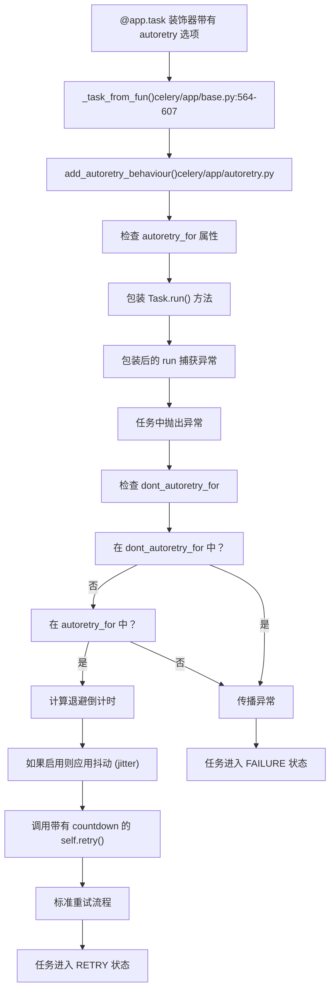
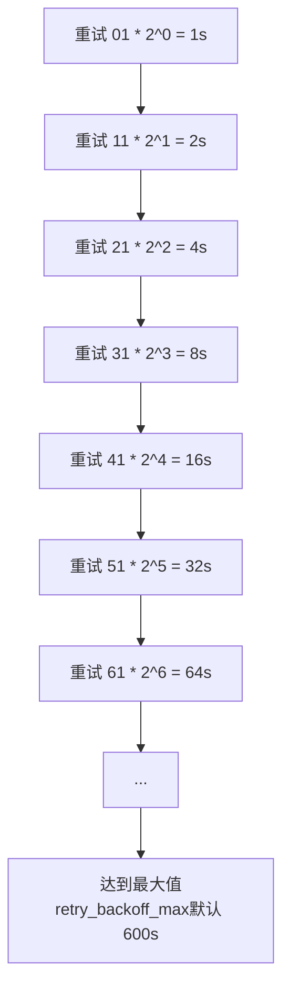
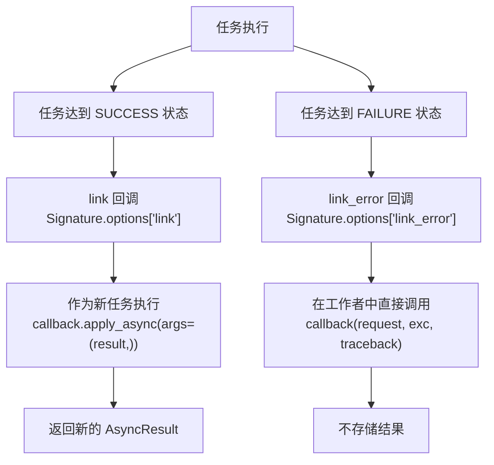
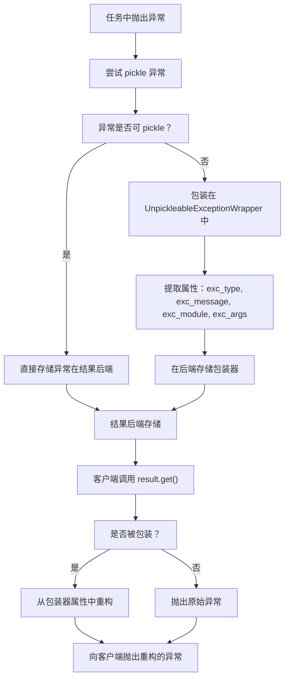
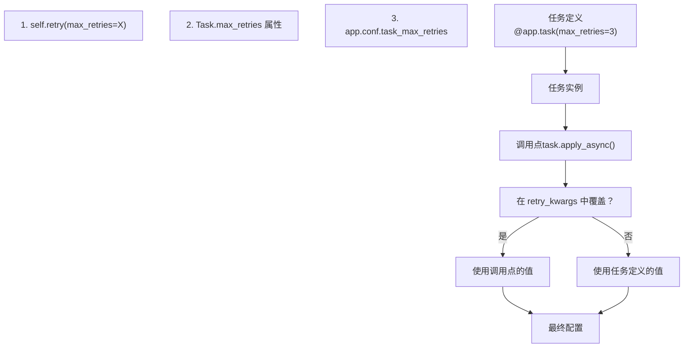
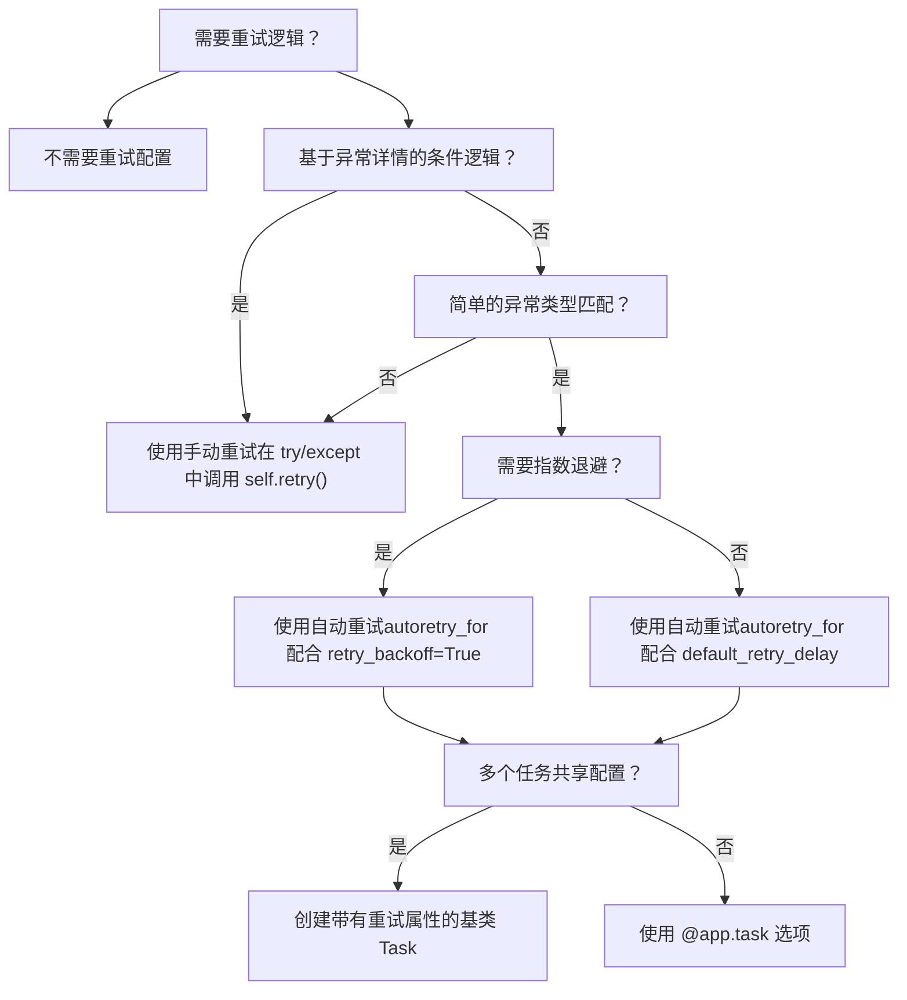
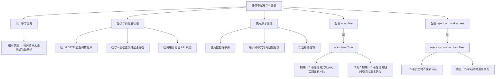

# 错误处理与重试

相关源文件

-   [celery/app/amqp.py](https://github.com/celery/celery/blob/4d068b56/celery/app/amqp.py)
-   [celery/app/base.py](https://github.com/celery/celery/blob/4d068b56/celery/app/base.py)
-   [celery/app/defaults.py](https://github.com/celery/celery/blob/4d068b56/celery/app/defaults.py)
-   [celery/app/task.py](https://github.com/celery/celery/blob/4d068b56/celery/app/task.py)
-   [celery/canvas.py](https://github.com/celery/celery/blob/4d068b56/celery/canvas.py)
-   [celery/utils/__init__.py](https://github.com/celery/celery/blob/4d068b56/celery/utils/__init__.py)
-   [docs/faq.rst](https://github.com/celery/celery/blob/4d068b56/docs/faq.rst)
-   [docs/getting-started/first-steps-with-celery.rst](https://github.com/celery/celery/blob/4d068b56/docs/getting-started/first-steps-with-celery.rst)
-   [docs/getting-started/next-steps.rst](https://github.com/celery/celery/blob/4d068b56/docs/getting-started/next-steps.rst)
-   [docs/userguide/calling.rst](https://github.com/celery/celery/blob/4d068b56/docs/userguide/calling.rst)
-   [docs/userguide/canvas.rst](https://github.com/celery/celery/blob/4d068b56/docs/userguide/canvas.rst)
-   [docs/userguide/monitoring.rst](https://github.com/celery/celery/blob/4d068b56/docs/userguide/monitoring.rst)
-   [docs/userguide/periodic-tasks.rst](https://github.com/celery/celery/blob/4d068b56/docs/userguide/periodic-tasks.rst)
-   [docs/userguide/routing.rst](https://github.com/celery/celery/blob/4d068b56/docs/userguide/routing.rst)
-   [docs/userguide/tasks.rst](https://github.com/celery/celery/blob/4d068b56/docs/userguide/tasks.rst)
-   [docs/userguide/workers.rst](https://github.com/celery/celery/blob/4d068b56/docs/userguide/workers.rst)
-   [t/integration/conftest.py](https://github.com/celery/celery/blob/4d068b56/t/integration/conftest.py)
-   [t/integration/tasks.py](https://github.com/celery/celery/blob/4d068b56/t/integration/tasks.py)
-   [t/integration/test_canvas.py](https://github.com/celery/celery/blob/4d068b56/t/integration/test_canvas.py)
-   [t/integration/test_quorum_queue_qos_cluster_simulation.py](https://github.com/celery/celery/blob/4d068b56/t/integration/test_quorum_queue_qos_cluster_simulation.py)
-   [t/integration/test_security.py](https://github.com/celery/celery/blob/4d068b56/t/integration/test_security.py)
-   [t/integration/test_tasks.py](https://github.com/celery/celery/blob/4d068b56/t/integration/test_tasks.py)
-   [t/smoke/tests/test_canvas.py](https://github.com/celery/celery/blob/4d068b56/t/smoke/tests/test_canvas.py)
-   [t/unit/app/test_app.py](https://github.com/celery/celery/blob/4d068b56/t/unit/app/test_app.py)
-   [t/unit/tasks/test_canvas.py](https://github.com/celery/celery/blob/4d068b56/t/unit/tasks/test_canvas.py)
-   [t/unit/tasks/test_tasks.py](https://github.com/celery/celery/blob/4d068b56/t/unit/tasks/test_tasks.py)

本页面涵盖了 Celery 的任务错误处理和重试机制。当任务由于异常失败时，Celery 提供了手动和自动重试功能，并具有可配置的退避（backoff）策略。有关执行期间的任务状态信息，请参阅第 3.2 页。有关基于时间的执行约束，请参阅第 3.4 页。

## 手动重试

任务可以通过调用 `self.retry()` 方法显式地重试自身。这要求任务在 `@app.task` 装饰器中使用 `bind=True` 进行绑定。

### 基本重试流程

Task.retry() 方法执行流

**来源：** [celery/app/task.py661-772](https://github.com/celery/celery/blob/4d068b56/celery/app/task.py#L661-L772) [celery/app/task.py88](https://github.com/celery/celery/blob/4d068b56/celery/app/task.py#L88-L88) [docs/userguide/tasks.rst574-640](https://github.com/celery/celery/blob/4d068b56/docs/userguide/tasks.rst#L574-L640)

### Task.retry() 方法

位于 [celery/app/task.py661-772](https://github.com/celery/celery/blob/4d068b56/celery/app/task.py#L661-L772) 的 `Task.retry()` 方法是手动重试的核心机制。它使用 `signature_from_request()` 创建一个新的任务签名（signature），并以递增的重试计数重新发布任务消息。

Task.retry() 参数

| 参数 | 类型 | 描述 |
| --- | --- | --- |
| `args` | `Tuple` | 覆盖重试时的位置参数 |
| `kwargs` | `Dict` | 覆盖重试时的关键字参数 |
| `exc` | `Exception` | 超过最大重试次数时要报告的异常 |
| `throw` | `bool` | 是否抛出 `Retry` 异常（默认值：`True`） |
| `eta` | `datetime` | 执行重试的绝对时间 |
| `countdown` | `float` | 重试前的延迟秒数 |
| `max_retries` | `int` | 覆盖本次执行的默认 `max_retries` |

**关键实现步骤：**

1.  **检索重试次数**：从 `Context` 对象中访问 `self.request.retries` [celery/app/task.py88](https://github.com/celery/celery/blob/4d068b56/celery/app/task.py#L88-L88)
2.  **递增计数器**：`retries = self.request.retries + 1`
3.  **应用默认延迟**：如果没有 `eta` 或 `countdown`，则使用 `self.default_retry_delay`（默认值：180 秒） [celery/app/task.py203](https://github.com/celery/celery/blob/4d068b56/celery/app/task.py#L203-L203)
4.  **检查最大重试次数**：将 `retries` 与 `self.max_retries`（默认值：3）进行比较 [celery/app/task.py199](https://github.com/celery/celery/blob/4d068b56/celery/app/task.py#L199-L199)
5.  **重构签名**：调用 `self.signature_from_request(args, kwargs, countdown, eta, ...)` [celery/app/task.py636-658](https://github.com/celery/celery/blob/4d068b56/celery/app/task.py#L636-L658)
6.  **重新发布任务**：执行 `S.apply_async()`，其中 `S` 是签名
7.  **抛出异常**：抛出 `Retry(exc=exc, when=eta, sig=S)` 以向工作者发出信号 [celery/exceptions.py12](https://github.com/celery/celery/blob/4d068b56/celery/exceptions.py#L12-L12)

如果 `retries >= max_retries`，则重新抛出原始 `exc` 或抛出 `MaxRetriesExceededError`。

**来源：** [celery/app/task.py661-772](https://github.com/celery/celery/blob/4d068b56/celery/app/task.py#L661-L772) [celery/app/task.py199](https://github.com/celery/celery/blob/4d068b56/celery/app/task.py#L199-L199) [celery/app/task.py203](https://github.com/celery/celery/blob/4d068b56/celery/app/task.py#L203-L203) [celery/app/task.py636-658](https://github.com/celery/celery/blob/4d068b56/celery/app/task.py#L636-L658) [celery/exceptions.py12](https://github.com/celery/celery/blob/4d068b56/celery/exceptions.py#L12-L12)

### 示例：手动重试

```
# 来自文档示例
@app.task(bind=True, default_retry_delay=30 * 60)
def send_twitter_status(self, oauth, tweet):
    try:
        twitter = Twitter(oauth)
        twitter.update_status(tweet)
    except (Twitter.FailWhaleError, Twitter.LoginError) as exc:
        # 在 5 分钟后重试，而不是默认的 30 分钟
        raise self.retry(exc=exc, countdown=60 * 5)
```
**重要提示**：`retry()` 方法会抛出一个 `Retry` 异常来向工作者发出信号。除非指定了 `throw=False`，否则 `self.retry()` 之后的代码不会被执行。

**来源：** [docs/userguide/tasks.rst590-640](https://github.com/celery/celery/blob/4d068b56/docs/userguide/tasks.rst#L590-L640)

## 自动重试 (Automatic Retry)

Celery 通过在任务注册期间 [celery/app/base.py604](https://github.com/celery/celery/blob/4d068b56/celery/app/base.py#L604-L604) 调用的 `add_autoretry_behaviour()` 函数 [celery/app/autoretry.py](https://github.com/celery/celery/blob/4d068b56/celery/app/autoretry.py) 支持针对指定异常类型的自动重试。

### 自动重试配置属性

自动重试任务属性与处理


**来源：** [celery/app/autoretry.py](https://github.com/celery/celery/blob/4d068b56/celery/app/autoretry.py) [celery/app/base.py604](https://github.com/celery/celery/blob/4d068b56/celery/app/base.py#L604-L604) [celery/app/base.py564-607](https://github.com/celery/celery/blob/4d068b56/celery/app/base.py#L564-L607) [docs/userguide/tasks.rst667-797](https://github.com/celery/celery/blob/4d068b56/docs/userguide/tasks.rst#L667-L797)

### 任务属性参考

自动重试任务属性

| 属性 | 类型 | 默认值 | 描述 |
| --- | --- | --- | --- |
| `autoretry_for` | `Tuple[Exception]` | `()` | 触发自动重试的异常（通过 `isinstance()` 检查） |
| `dont_autoretry_for` | `Tuple[Exception]` | `()` | 即使在 `autoretry_for` 中也要排除在自动重试之外的异常 |
| `max_retries` | `int` 或 `None` | `3` | 最大重试尝试次数；`None` = 无限重试 [celery/app/task.py199](https://github.com/celery/celery/blob/4d068b56/celery/app/task.py#L199-L199) |
| `retry_kwargs` | `Dict` | `{}` | 传递给 `self.retry()` 的额外关键字参数 |
| `retry_backoff` | `bool` 或 `int` | `False` | 启用指数退避；如果是 `int`，则用作基础乘数 |
| `retry_backoff_max` | `int` | `600` | 以秒为单位的最大延迟（10 分钟），用于限制退避 |
| `retry_jitter` | `bool` | `True` | 在 0 和计算出的延迟之间向倒计时添加随机抖动 |

**来源：** [docs/userguide/tasks.rst667-797](https://github.com/celery/celery/blob/4d068b56/docs/userguide/tasks.rst#L667-L797) [t/unit/tasks/test_tasks.py44-59](https://github.com/celery/celery/blob/4d068b56/t/unit/tasks/test_tasks.py#L44-L59)

### 自动重试执行流

自动重试异常处理序列

> **[Mermaid sequence]**
> *(图表结构无法解析)*

**来源：** [celery/app/autoretry.py](https://github.com/celery/celery/blob/4d068b56/celery/app/autoretry.py) [celery/app/base.py604](https://github.com/celery/celery/blob/4d068b56/celery/app/base.py#L604-L604) [docs/userguide/tasks.rst667-716](https://github.com/celery/celery/blob/4d068b56/docs/userguide/tasks.rst#L667-L716)

### 示例：自动重试配置

```
from twitter.exceptions import FailWhaleError

# 基础自动重试
@app.task(autoretry_for=(FailWhaleError,))
def refresh_timeline(user):
    return twitter.refresh_timeline(user)

# 带有自定义重试参数
@app.task(
    autoretry_for=(FailWhaleError,),
    retry_kwargs={'max_retries': 5}
)
def refresh_timeline_limited(user):
    return twitter.refresh_timeline(user)

# 基于类的配置
class BaseTaskWithRetry(Task):
    autoretry_for = (TypeError,)
    max_retries = 5
    retry_backoff = True
    retry_backoff_max = 700
    retry_jitter = False
```
**来源：** [docs/userguide/tasks.rst678-748](https://github.com/celery/celery/blob/4d068b56/docs/userguide/tasks.rst#L678-L748) [t/unit/tasks/test_tasks.py44-59](https://github.com/celery/celery/blob/4d068b56/t/unit/tasks/test_tasks.py#L44-L59)

## 指数退避 (Exponential Backoff)

指数退避以指数级增加重试延迟，以避免压垮发生故障的服务。计算由自动重试包装器在调用 `self.retry()` 之前执行。

### 退避计算算法

倒计时延迟按以下步骤计算：

1.  **基础乘数**：`retry_backoff` 的值（如果是 `True` 则为 1，如果是 `int` 则为自定义值）
2.  **指数组件**：`base * (2 ** self.request.retries)`
3.  **限制 (Clamping)**：`min(calculated_delay, retry_backoff_max)`（默认最大值：600 秒）
4.  **抖动 (Jitter)**（如果 `retry_jitter=True`）：`random.uniform(0, clamped_delay)`

指数退避进展


### 退避配置矩阵

| `retry_backoff` | `retry_jitter` | `retries=0` | `retries=1` | `retries=2` | `retries=3` |
| --- | --- | --- | --- | --- | --- |
| `True` (=1) | `False` | 1s | 2s | 4s | 8s |
| `True` (=1) | `True` | 0-1s | 0-2s | 0-4s | 0-8s |
| `3` | `False` | 3s | 6s | 12s | 24s |
| `3` | `True` | 0-3s | 0-6s | 0-12s | 0-24s |

**来源：** [docs/userguide/tasks.rst717-789](https://github.com/celery/celery/blob/4d068b56/docs/userguide/tasks.rst#L717-L789)

### 示例：API 速率限制

```
from requests.exceptions import RequestException

@app.task(
    autoretry_for=(RequestException,),
    retry_backoff=True,           # 启用指数退避
    retry_backoff_max=600,        # 最大 10 分钟
    retry_jitter=True,            # 添加随机化
    max_retries=5                 # 5 次尝试后放弃
)
def fetch_external_api(url):
    response = requests.get(url)
    response.raise_for_status()
    return response.json()
```
此配置产生的延迟大约为：1s, 2s, 4s, 8s, 16s（带有抖动）。

**来源：** [docs/userguide/tasks.rst717-730](https://github.com/celery/celery/blob/4d068b56/docs/userguide/tasks.rst#L717-L730)

## 错误回调 (Error Callbacks)

任务可以使用 `link_error` 参数或 `.link_error()` / `.on_error()` 签名方法注册错误回调 [celery/canvas.py725-745](https://github.com/celery/celery/blob/4d068b56/celery/canvas.py#L725-L745)

### 链接错误与链接回调对比 (Link Error vs Link Callback)

链接错误执行模型


**来源：** [docs/userguide/canvas.rst538-569](https://github.com/celery/celery/blob/4d068b56/docs/userguide/canvas.rst#L538-L569) [celery/canvas.py716-745](https://github.com/celery/celery/blob/4d068b56/celery/canvas.py#L716-L745)

### 错误回调 API

错误回调通过以下方式注册：

1.  **签名方法**：`signature.link_error(callback)` [celery/canvas.py725-732](https://github.com/celery/celery/blob/4d068b56/celery/canvas.py#L725-L732)
2.  **链式方法**：`signature.on_error(callback)` [celery/canvas.py734-745](https://github.com/celery/celery/blob/4d068b56/celery/canvas.py#L734-L745)
3.  **apply_async 参数**：`task.apply_async(link_error=callback)` [celery/app/task.py518](https://github.com/celery/celery/blob/4d068b56/celery/app/task.py#L518-L518)

错误回调与成功回调对比

| 维度 | 成功回调 (`link`) | 错误回调 (`link_error`) |
| --- | --- | --- |
| 执行 | 通过 `apply_async()` 作为新任务执行 | 在工作者进程中直接调用（不是任务） |
| 参数 | `(result,)` - 预置到签名参数中 | `(request, exc, traceback)` |
| 返回值 | 在后端存储为 `AsyncResult` | 返回值被忽略 |
| 任务上下文 | 具有自身 `request` 上下文的新任务 | 访问失败任务的 `request` 上下文 |
| 使用场景 | 工作流延续、链式调用 | 日志记录、清理、告警、监控 |

**来源：** [celery/canvas.py716-745](https://github.com/celery/celery/blob/4d068b56/celery/canvas.py#L716-L745) [celery/app/task.py446-613](https://github.com/celery/celery/blob/4d068b56/celery/app/task.py#L446-L613)

### 示例：错误日志记录

```
import os
from proj.celery import app

@app.task
def log_error(request, exc, traceback):
    """用于记录失败情况的错误回调"""
    with open(os.path.join('/var/errors', request.id), 'a') as fh:
        print('--\n\n{0} {1} {2}'.format(
            request.id, exc, traceback), file=fh)

# 用法
from tasks import process_data
result = process_data.apply_async(
    args=(data,),
    link_error=log_error.s()
)

# 或者使用签名链式调用
sig = process_data.s(data).on_error(log_error.s())
result = sig.delay()
```
**来源：** [docs/userguide/canvas.rst556-568](https://github.com/celery/celery/blob/4d068b56/docs/userguide/canvas.rst#L556-L568) [t/integration/test_canvas.py132-184](https://github.com/celery/celery/blob/4d068b56/t/integration/test_canvas.py#L132-L184)

## 异常类型与处理

### Retry 异常

`celery.exceptions.Retry` 异常 [celery/exceptions.py12](https://github.com/celery/celery/blob/4d068b56/celery/exceptions.py#L12-L12) 向工作者发出任务应重试的信号。除非 `throw=False` [celery/app/task.py757-760](https://github.com/celery/celery/blob/4d068b56/celery/app/task.py#L757-L760)，否则它由 `self.retry()` 抛出。

**Retry 异常属性：**

-   `exc`：触发重试的原始异常（或为 `None`）
-   `when`：重试的 ETA 或倒计时值
-   `is_eager`：指示任务是否在即时模式下运行的布尔值
-   `sig`：包含重试参数的 `Signature` 对象

**抛出机制** [celery/app/task.py757-760](https://github.com/celery/celery/blob/4d068b56/celery/app/task.py#L757-L760)：

```python
ret = Retry(exc=exc, when=eta or countdown, is_eager=is_eager, sig=S)
if throw:
    raise ret
return ret
```
`Retry` 异常被工作者的任务执行层 [celery/worker/request.py](https://github.com/celery/celery/blob/4d068b56/celery/worker/request.py) 捕获，并触发任务消息的重新发布。

**来源：** [celery/app/task.py757-760](https://github.com/celery/celery/blob/4d068b56/celery/app/task.py#L757-L760) [celery/exceptions.py12](https://github.com/celery/celery/blob/4d068b56/celery/exceptions.py#L12-L12)

### MaxRetriesExceededError

当重试次数超过 `max_retries` [celery/app/task.py751-755](https://github.com/celery/celery/blob/4d068b56/celery/app/task.py#L751-L755) 时，会抛出 `MaxRetriesExceededError` [celery/exceptions.py176](https://github.com/celery/celery/blob/4d068b56/celery/exceptions.py#L176-L176)。

**异常构造：**

```python
raise self.MaxRetriesExceededError(
    "Can't retry {}[{}] args:{} kwargs:{}".format(
        self.name, request.id, S.args, S.kwargs
    ), task_args=S.args, task_kwargs=S.kwargs
)
```
**用于调试的属性：**

-   `task_args`：来自失败任务签名的位置参数
-   `task_kwargs`：来自失败任务签名的关键字参数

此异常会以 `FAILURE` 状态及其异常详情进入任务结果后端。

**来源：** [celery/app/task.py751-755](https://github.com/celery/celery/blob/4d068b56/celery/app/task.py#L751-L755) [celery/exceptions.py176](https://github.com/celery/celery/blob/4d068b56/celery/exceptions.py#L176-L176)

### Ignore 异常

`celery.exceptions.Ignore` 异常 [celery/exceptions.py12](https://github.com/celery/celery/blob/4d068b56/celery/exceptions.py#L12-L12) 允许任务在不记录失败的情况下退出。抛出时，任务转换为 `SUCCESS` 状态，且不存储结果值。

**使用场景：**

-   根据运行时条件确定应跳过执行的任务
-   任务已被处理过的重复检测
-   防止不必要工作的守卫语句 (Guard clauses)

工作者会对 `Ignore` 进行特殊处理，且不会将其记录为错误。

**来源：** [celery/exceptions.py12](https://github.com/celery/celery/blob/4d068b56/celery/exceptions.py#L12-L12)

### Reject 异常

`celery.exceptions.Reject` 异常 [celery/exceptions.py12](https://github.com/celery/celery/blob/4d068b56/celery/exceptions.py#L12-L12) 会导致任务消息被拒绝，并可选择是否在不增加重试计数器的情况下重新入队。

**属性：**

-   `requeue`：指示是否将消息重新入队的布尔值（默认值：`True`）

当任务当前无法处理但应由另一个工作者重试且不计入 `max_retries` 时使用。

**来源：** [celery/exceptions.py12](https://github.com/celery/celery/blob/4d068b56/celery/exceptions.py#L12-L12)

### 异常序列化

当任务执行期间发生异常时，Celery 会将其序列化以便存储在结果后端中。不可 pickle 的异常会被包装在 `UnpickleableExceptionWrapper` [celery/utils/serialization.py19](https://github.com/celery/celery/blob/4d068b56/celery/utils/serialization.py#L19-L19) 中。

异常序列化与存储流


**包装器属性** [celery/utils/serialization.py19](https://github.com/celery/celery/blob/4d068b56/celery/utils/serialization.py#L19-L19)：

-   `exc_type`：异常类名
-   `exc_message`：异常的字符串表示
-   `exc_module`：定义异常类的模块
-   `exc_args`：异常构造函数参数

**来源：** [celery/utils/serialization.py19](https://github.com/celery/celery/blob/4d068b56/celery/utils/serialization.py#L19-L19) [t/integration/test_tasks.py207-234](https://github.com/celery/celery/blob/4d068b56/t/integration/test_tasks.py#L207-L234)

## 重试状态与追踪

### 重试期间的请求上下文 (Request Context)

`self.request` 上下文对象追踪重试信息：

| 属性 | 类型 | 描述 |
| --- | --- | --- |
| `request.retries` | `int` | 当前重试次数（从 0 开始） |
| `request.id` | `str` | 任务 UUID（跨重试保持不变） |
| `request.root_id` | `str` | 工作流中的根任务 UUID |
| `request.parent_id` | `str` | 父任务 UUID |
| `request.origin` | `str` | 原始客户端主机名 |

**重试工作流：**

1.  首次执行：`request.retries = 0`
2.  第一次重试：`request.retries = 1`
3.  第二次重试：`request.retries = 2`
4.  最大重试检查：`request.retries >= max_retries`

**来源：** [celery/app/task.py60-161](https://github.com/celery/celery/blob/4d068b56/celery/app/task.py#L60-L161) [celery/app/task.py724](https://github.com/celery/celery/blob/4d068b56/celery/app/task.py#L724-L724)

### 结果后端中的重试状态

当任务重试时，结果后端存储 `RETRY` 状态：

```
# 状态演进
PENDING -> RECEIVED -> STARTED -> RETRY -> STARTED -> SUCCESS/FAILURE
```
`RETRY` 状态包括：

-   异常信息
-   重试次数
-   下次执行时间 (ETA)

**来源：** [celery/states.py](https://github.com/celery/celery/blob/4d068b56/celery/states.py) [docs/userguide/tasks.rst586-608](https://github.com/celery/celery/blob/4d068b56/docs/userguide/tasks.rst#L586-L608)

## 任务级配置与调用级配置 (Task-Level vs Call-Level Configuration)

### 配置优先级


### 示例：动态重试配置

```python
@app.task(bind=True, max_retries=3)
def flexible_task(self, data):
    try:
        process(data)
    except TemporaryError as exc:
        # 为本次特定的重试覆盖 max_retries
        raise self.retry(exc=exc, max_retries=10, countdown=60)
    except PermanentError:
        # 不重试永久性错误
        raise
```
传递给 `self.retry()` 的 `max_retries` 参数会覆盖该次特定重试尝试的任务级默认值。

**来源：** [celery/app/task.py725-727](https://github.com/celery/celery/blob/4d068b56/celery/app/task.py#L725-L727) [docs/userguide/tasks.rst699-707](https://github.com/celery/celery/blob/4d068b56/docs/userguide/tasks.rst#L699-L707)

## 与 Canvas 工作流的集成

### 链式调用 (Chains) 中的重试

当链中的一个任务重试时，该链会暂停直到重试完成：

```python
# 带有重试的链
result = (
    step1.s() |
    step2_with_retry.s() |  # 可能重试多次
    step3.s()
).delay()
```
直到 `step2_with_retry` 成功或耗尽重试次数，`step3` 任务才会执行。

**来源：** [celery/canvas.py931-950](https://github.com/celery/celery/blob/4d068b56/celery/canvas.py#L931-L950) [t/integration/test_canvas.py187-253](https://github.com/chesszyh/celery/blob/4d068b56/t/integration/test_canvas.py#L187-L253)

### 链中的错误回调

```python
from celery import chain
from tasks import process, cleanup

c = chain(
    process.s(data),
    finalize.s()
).on_error(cleanup.s())

result = c.delay()
```
如果链中的任何任务抛出异常（且未重试），错误回调将带上异常详情执行。

**来源：** [celery/canvas.py734-745](https://github.com/celery/celery/blob/4d068b56/celery/canvas.py#L734-L745) [t/integration/test_canvas.py228-244](https://github.com/chesszyh/celery/blob/4d068b56/t/integration/test_canvas.py#L228-L244)

### 组 (Groups) 与 Chords 中的重试

组中的单个任务可以独立重试：

```python
from celery import group, chord

# 带有独立重试的组
g = group(
    fetch_data.s(url) for url in urls
)
result = g.delay()

# 在 header 中带有重试的 Chord
c = chord(
    [fetch.s(url) for url in urls],
    aggregate.s()
)
result = c.delay()
```
对于 chords，回调会等待所有 header 任务完成（包括重试）后才执行。

**来源：** [celery/canvas.py1477-1584](https://github.com/celery/celery/blob/4d068b56/celery/canvas.py#L1477-L1584) [t/integration/test_canvas.py343-361](https://github.com/chesszyh/celery/blob/4d068b56/t/integration/test_canvas.py#L343-L361)

## 最佳实践

### 何时使用手动重试与自动重试

手动重试 vs 自动重试决策树


**在以下情况使用手动重试 (`self.retry()`)：**

-   基于异常属性或状态的条件重试逻辑
-   在重试尝试之间修改任务参数
-   根据错误详情计算动态重试延迟
-   在重试前执行清理或记录日志
-   需要在任务代码中访问异常详情

**在以下情况使用自动重试 (`autoretry_for`)：**

-   简单的异常类型匹配已足够
-   标准指数退避符合要求
-   希望任务代码更简洁，没有显式的 try/except
-   多个任务共享相同的重试配置（使用基类 `Task`）
-   不需要在重试前检查异常详情

**来源：** [docs/userguide/tasks.rst667-797](https://github.com/celery/celery/blob/4d068b56/docs/userguide/tasks.rst#L667-L797) [celery/app/autoretry.py](https://github.com/celery/celery/blob/4d068b56/celery/app/autoretry.py)

### 重试安全性考虑

任务重试安全性设计模式


**关键安全性属性** [celery/app/task.py269-292](https://github.com/celery/celery/blob/4d068b56/celery/app/task.py#L269-L292)：

| 属性 | 效果 | 权衡 |
| --- | --- | --- |
| `acks_late=False` | 执行前确认（默认） | 如果工作者在执行期间崩溃，任务将丢失 |
| `acks_late=True` | 执行后确认 | 如果工作者崩溃，存在重复执行的风险 |
| `reject_on_worker_lost=False` | 工作者死亡时消息重新入队（`acks_late` 时的默认行为） | 可能导致重复执行 |
| `reject_on_worker_lost=True` | 工作者死亡时拒绝消息 | 如果工作者崩溃，任务将丢失 |

**推荐模式：**

1.  **幂等设计**：确保无论重试多少次，任务都产生相同的结果
2.  **状态验证**：在执行操作前检查当前状态（数据库查询、文件存在性）
3.  **原子操作**：使用数据库事务、文件锁或分布式锁
4.  **关键任务**：使用 `acks_late=True` 配合幂等设计以确保完成
5.  **非幂等任务**：使用 `reject_on_worker_lost=True` 以防止重复执行

**来源：** [docs/userguide/tasks.rst21-47](https://github.com/celery/celery/blob/4d068b56/docs/userguide/tasks.rst#L21-L47) [celery/app/task.py269-292](https://github.com/celery/celery/blob/4d068b56/celery/app/task.py#L269-L292)

### 监控与调试重试

使用以下方式追踪重试行为：

1.  **任务请求上下文**：在任务代码中访问 `self.request.retries`
2.  **结果状态**：检查 `result.state == 'RETRY'`
3.  **异常信息**：通过 `result.info` 从结果后端检索
4.  **工作者日志**：启用日志以查看重试事件
5.  **事件**：使用 Celery 事件系统监控重试模式

```python
@app.task(bind=True, max_retries=3)
def monitored_task(self):
    logger.info(f"第 {self.request.retries + 1} 次尝试，共 {self.max_retries + 1} 次")
    try:
        risky_operation()
    except TemporaryError as exc:
        logger.warning(f"重试尝试 {self.request.retries}: {exc}")
        raise self.retry(exc=exc)
```
**来源：** [docs/userguide/tasks.rst409-432](https://github.com/celery/celery/blob/4d068b56/docs/userguide/tasks.rst#L409-L432) [celery/app/task.py60-161](https://github.com/celery/celery/blob/4d068b56/celery/app/task.py#L60-L161)
