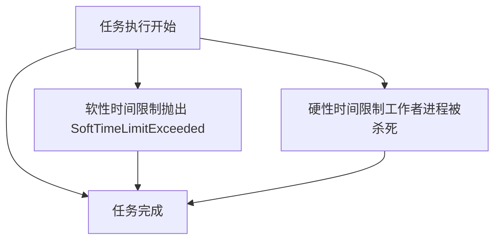
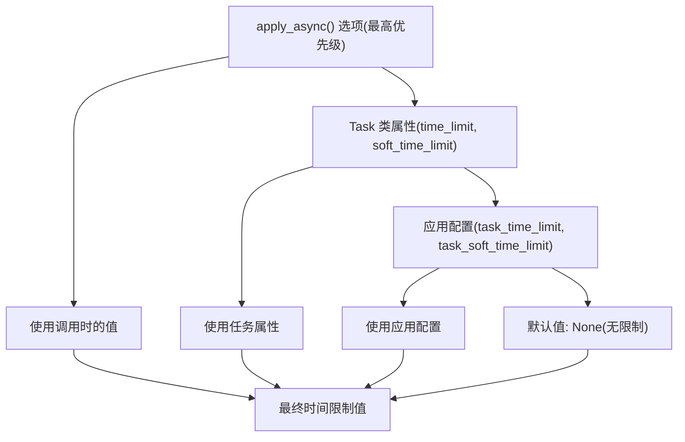
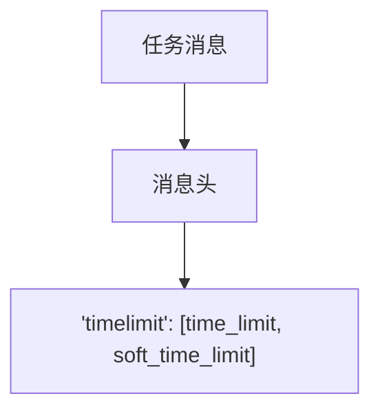
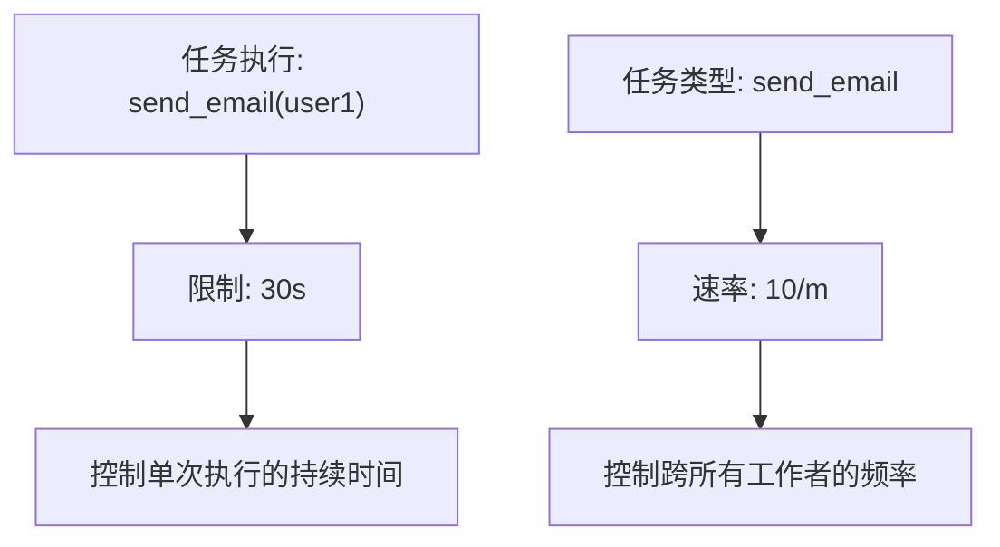

# 时间限制与速率限制

相关源文件

-   [celery/app/defaults.py](https://github.com/celery/celery/blob/4d068b56/celery/app/defaults.py)
-   [docs/faq.rst](https://github.com/celery/celery/blob/4d068b56/docs/faq.rst)
-   [docs/getting-started/first-steps-with-celery.rst](https://github.com/celery/celery/blob/4d068b56/docs/getting-started/first-steps-with-celery.rst)
-   [docs/getting-started/next-steps.rst](https://github.com/celery/celery/blob/4d068b56/docs/getting-started/next-steps.rst)
-   [docs/userguide/calling.rst](https://github.com/celery/celery/blob/4d068b56/docs/userguide/calling.rst)
-   [docs/userguide/monitoring.rst](https://github.com/celery/celery/blob/4d068b56/docs/userguide/monitoring.rst)
-   [docs/userguide/periodic-tasks.rst](https://github.com/celery/celery/blob/4d068b56/docs/userguide/periodic-tasks.rst)
-   [docs/userguide/routing.rst](https://github.com/celery/celery/blob/4d068b56/docs/userguide/routing.rst)
-   [docs/userguide/tasks.rst](https://github.com/celery/celery/blob/4d068b56/docs/userguide/tasks.rst)
-   [docs/userguide/workers.rst](https://github.com/celery/celery/blob/4d068b56/docs/userguide/workers.rst)

## 目的与范围

本页面描述了 Celery 控制任务执行时间和吞吐量的机制。时间限制（Time limits）防止任务无限期运行，而速率限制（rate limits）控制任务执行的频率。有关任务重试和错误处理的信息，请参阅[错误处理与重试](/celery/celery/3.3-error-handling-and-retry)。

## 概览

Celery 提供了两种互补的控制机制：

| 机制 | 目的 | 作用域 |
| --- | --- | --- |
| **时间限制 (Time Limits)** | 单次任务调用的最大执行持续时间 | 针对单次任务执行 |
| **速率限制 (Rate Limits)** | 最大任务执行频率 | 针对任务类型 |

这两种机制都可以在任务定义层级进行配置，或者在每次调用时进行覆盖。

**来源：** [celery/app/task.py236-242](https://github.com/celery/celery/blob/4d068b56/celery/app/task.py#L236-L242) [celery/app/task.py208](https://github.com/celery/celery/blob/4d068b56/celery/app/task.py#L208-L208)

## 时间限制 (Time Limits)

### 硬性时间限制与软性时间限制

Celery 支持两种类型的时间限制：


**软性时间限制 (Soft Time Limit)** (`soft_time_limit`)：

-   在任务中抛出 `SoftTimeLimitExceeded` 异常
-   任务可以捕获该异常并执行清理操作
-   允许优雅地处理超时情况
-   以秒为单位配置

**硬性时间限制 (Hard Time Limit)** (`time_limit`)：

-   强制终止执行该任务的工作者进程
-   任务无法捕获
-   当软性限制不足以解决问题时，作为最后手段使用
-   以秒为单位配置

**来源：** [celery/app/task.py236-242](https://github.com/celery/celery/blob/4d068b56/celery/app/task.py#L236-L242) [docs/userguide/tasks.rst62-65](https://github.com/celery/celery/blob/4d068b56/docs/userguide/tasks.rst#L62-L65)

### 任务级配置

时间限制被定义为 `Task` 类的类属性：

```
class Task:
    #: 硬性时间限制。
    #: 默认为 :setting:`task_time_limit` 设置。
    time_limit = None

    #: 软性时间限制。
    #: 默认为 :setting:`task_soft_time_limit` 设置。
    soft_time_limit = None
```
任务定义示例：

```
@app.task(time_limit=60, soft_time_limit=50)
def process_document(document_id):
    # 任务将在 50 秒后收到 SoftTimeLimitExceeded
    # 任务将在 60 秒后被杀死
    pass
```
**来源：** [celery/app/task.py236-242](https://github.com/celery/celery/blob/4d068b56/celery/app/task.py#L236-L242)

### 按调用配置 (Per-Invocation Configuration)

调用任务时可以覆盖时间限制：

```
# 在调用时覆盖
result = process_document.apply_async(
    args=(doc_id,),
    time_limit=120,
    soft_time_limit=100
)
```
`apply_async` 方法接受 `time_limit` 和 `soft_time_limit` 作为执行选项，与 `countdown`、`eta` 和 `queue` 等其他参数并列。

**来源：** [celery/app/task.py446-613](https://github.com/celery/celery/blob/4d068b56/celery/app/task.py#L446-L613) [celery/app/base.py826-828](https://github.com/celery/celery/blob/4d068b56/celery/app/base.py#L826-L828)

### 配置层级


解析顺序确保了最大的灵活性：

1.  调用时选项（通过 `apply_async`）
2.  Task 类属性
3.  应用范围的配置设置
4.  无限制 (None)

**来源：** [celery/app/task.py325-336](https://github.com/celery/celery/blob/4d068b56/celery/app/task.py#L325-L336) [celery/app/task.py580-581](https://github.com/celery/celery/blob/4d068b56/celery/app/task.py#L580-L581)

### 时间限制校验

Celery 会验证软性时间限制不超过硬性时间限制：

```
if self.soft_time_limit and self.time_limit and self.soft_time_limit > self.time_limit:
    raise ValueError('soft_time_limit 必须小于或等于 time_limit')
```
此校验发生在 `apply_async` 期间，以便在配置错误时尽早失败。

**来源：** [celery/app/task.py564-565](https://github.com/celery/celery/blob/4d068b56/celery/app/task.py#L564-L565)

### 任务消息中的时间限制

时间限制被编码在任务消息协议中：

#### 协议版本 2 (默认)


在协议 v2 中，时间限制作为双元素列表存储在消息头中：

```
headers = {
    'timelimit': [time_limit, soft_time_limit],
    # ... 其他头信息
}
```
`AMQP.as_task_v2` 方法构建了此结构：

```
def as_task_v2(self, task_id, name, args=None, kwargs=None,
               countdown=None, eta=None, ...,
               time_limit=None, soft_time_limit=None,
               ...):
    headers = {
        ...
        'timelimit': [time_limit, soft_time_limit],
        ...
    }
```
**来源：** [celery/app/amqp.py320-328](https://github.com/celery/celery/blob/4d068b56/celery/app/amqp.py#L320-L328) [celery/app/amqp.py375](https://github.com/celery/celery/blob/4d068b56/celery/app/amqp.py#L375-L375)

### 任务请求上下文 (Task Request Context)

执行期间，工作者会使用时间限制信息填充任务的请求上下文：

```
class Context:
    timelimit = None  # 元组: (hard_limit, soft_limit)
```
`as_execution_options` 方法会解包该元组：

```
def as_execution_options(self):
    limit_hard, limit_soft = self.timelimit or (None, None)
    execution_options = {
        ...
        'soft_time_limit': limit_soft,
        'time_limit': limit_hard,
        ...
    }
```
**来源：** [celery/app/task.py94](https://github.com/celery/celery/blob/4d068b56/celery/app/task.py#L94-L94) [celery/app/task.py126-153](https://github.com/celery/celery/blob/4d068b56/celery/app/task.py#L126-L153)

### 处理软性时间限制

任务可以捕获 `SoftTimeLimitExceeded` 以执行清理：

```
from celery.exceptions import SoftTimeLimitExceeded

@app.task(soft_time_limit=30)
def long_running_task():
    try:
        # 执行工作
        process_large_dataset()
    except SoftTimeLimitExceeded:
        # 清理并保存部分进度
        save_checkpoint()
        raise  # 重新抛出以将任务标记为失败
```
集成测试中的示例展示了软性时间限制的处理：

**来源：** [t/integration/test_canvas.py346-361](https://github.com/celery/celery/blob/4d068b56/t/integration/test_canvas.py#L346-L361) [t/integration/tasks.py1-27](https://github.com/celery/celery/blob/4d068b56/t/integration/tasks.py#L1-L27)

## 速率限制 (Rate Limits)

### 概念与格式

速率限制控制特定类型的任务执行的频率。与应用于单个任务执行的时间限制不同，速率限制应用于跨所有工作者的该任务类型。

`rate_limit` 属性接受以下格式的字符串值：

| 格式 | 含义 | 示例 |
| --- | --- | --- |
| `'N/s'` | 每秒 N 个任务 | `'100/s'` = 每秒 100 个任务 |
| `'N/m'` | 每分钟 N 个任务 | `'60/m'` = 每秒 1 个任务 |
| `'N/h'` | 每小时 N 个任务 | `'3600/h'` = 每秒 1 个任务 |
| `None` | 无速率限制 | 无限制 |

**来源：** [celery/app/task.py207-208](https://github.com/celery/celery/blob/4d068b56/celery/app/task.py#L207-L208)

### 任务级配置

```
@app.task(rate_limit='10/m')
def send_email(to, subject, body):
    # 跨所有工作者，
    # 此任务每分钟最多执行 10 次
    pass
```
速率限制被定义为类属性：

```
class Task:
    #: 该任务类型的速率限制。示例：:const:`None` (无速率限制),
    #: `'100/s'` (每秒一百个任务), `'100/m'` (每分钟一百个任务),
    #: `'100/h'` (每小时一百个任务)
    rate_limit = None
```
**来源：** [celery/app/task.py207-208](https://github.com/celery/celery/blob/4d068b56/celery/app/task.py#L207-L208)

### 速率限制 vs 时间限制


**关键区别：**

-   **速率限制 (Rate Limit)**：全局限制任务的**调用频率**
-   **时间限制 (Time Limit)**：约束每个工作者的**单次执行持续时间**

### 工作者级强制执行

速率限制由从队列消费任务的工作者强制执行。工作者追踪执行时间并延迟任务处理，以维持指定的速率。

配置层级：

1.  Task 类属性：`rate_limit`
2.  应用默认值：`task_default_rate_limit` 设置

**来源：** [celery/app/task.py325-336](https://github.com/celery/celery/blob/4d068b56/celery/app/task.py#L325-L336)

## 执行选项提取

`extract_exec_options` 工具提取用于任务发布的时间和速率限制信息：

```
extract_exec_options = mattrgetter(
    'queue', 'routing_key', 'exchange', 'priority', 'expires',
    'serializer', 'delivery_mode', 'compression', 'time_limit',
    'soft_time_limit', 'immediate', 'mandatory',
)
```
任务绑定系统在准备发布消息时，使用此函数从任务实例中提取执行选项。

**来源：** [celery/app/task.py28-32](https://github.com/celery/celery/blob/4d068b56/celery/app/task.py#L28-L32)

## 配置流 (Configuration Flow)

> **[Mermaid sequence]**
> *(图表结构无法解析)*

**来源：** [celery/app/task.py446-613](https://github.com/celery/celery/blob/4d068b56/celery/app/task.py#L446-L613) [celery/app/amqp.py320-412](https://github.com/celery/celery/blob/4d068b56/celery/app/amqp.py#L320-L412)

## 最佳实践

### 时间限制

1.  **始终为具有外部 I/O 的任务设置时间限制**：

    ```
    @app.task(time_limit=300, soft_time_limit=270)
    def fetch_external_data(url):
        # 具有挂起风险的网络 I/O
        pass
    ```

2.  **使用软性限制进行优雅清理**：

    -   将 `soft_time_limit` 设置为 `time_limit` 的 80-90%
    -   处理 `SoftTimeLimitExceeded` 以保存部分进度
3.  **考虑工作者池的影响**：

    -   硬性时间限制会杀死工作者进程 (prefork 池)
    -   可能会影响同一工作者进程中的其他任务

### 速率限制

1.  **为资源受限的操作使用速率限制**：

    ```
    @app.task(rate_limit='100/m')
    def call_rate_limited_api():
        # 带有速率限制的外部 API
        pass
    ```

2.  **平衡速率限制与并发性**：

    -   速率限制适用于所有工作者
    -   设置速率时请考虑总的工作者并发数
3.  **监控并调整**：

    -   开始时保守一些，根据监控情况增加
    -   不同类型的任务可能需要不同的限制

**来源：** [docs/userguide/tasks.rst62-77](https://github.com/celery/celery/blob/4d068b56/docs/userguide/tasks.rst#L62-L77)

## 总结

时间限制和速率限制为任务控制提供了互补的机制：

| 特性 | 作用域 | 粒度 | 强制执行方式 |
| --- | --- | --- | --- |
| **硬性时间限制** | 单次执行 | 针对每个任务 | 工作者杀死进程 |
| **软性时间限制** | 单次执行 | 针对每个任务 | 工作者抛出异常 |
| **速率限制** | 任务类型 | 全局 | 工作者延迟消费 |

两者都通过任务属性或单次调用选项进行配置，并通过校验确保一致性，同时进行正确的消息编码以便工作者强制执行。

**来源：** [celery/app/task.py164-336](https://github.com/celery/celery/blob/4d068b56/celery/app/task.py#L164-L336) [celery/app/amqp.py320-412](https://github.com/celery/celery/blob/4d068b56/celery/app/amqp.py#L320-L412)
