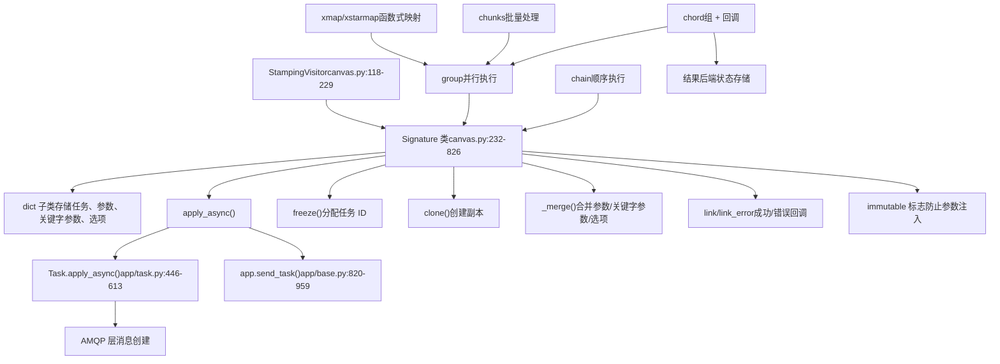
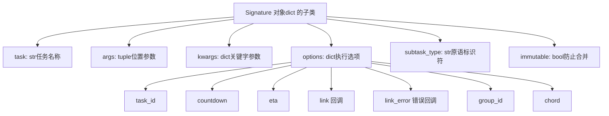
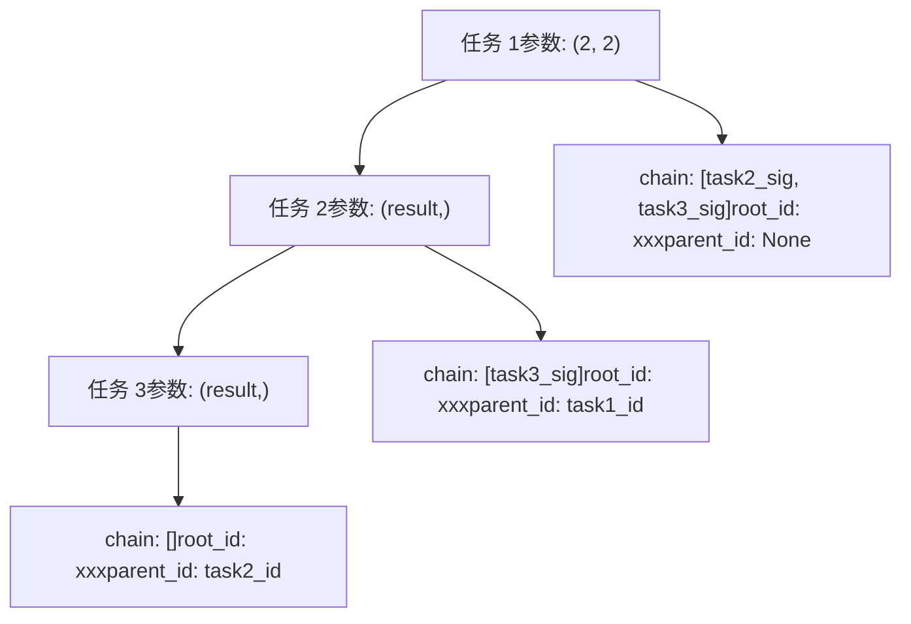
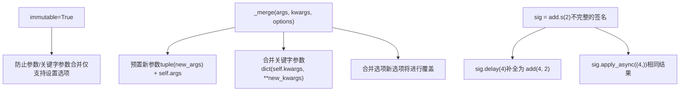
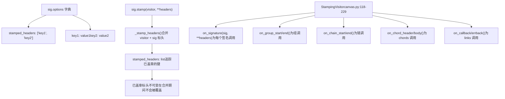
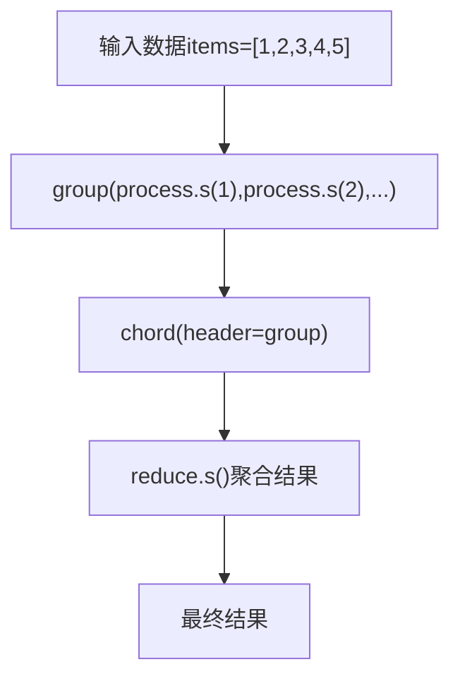
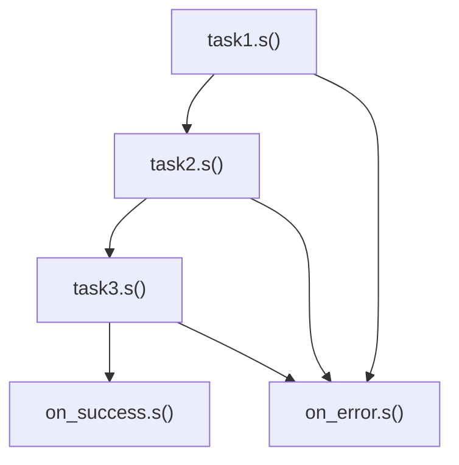
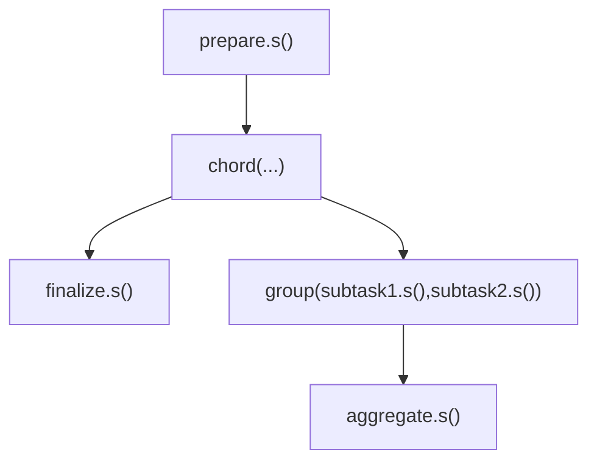
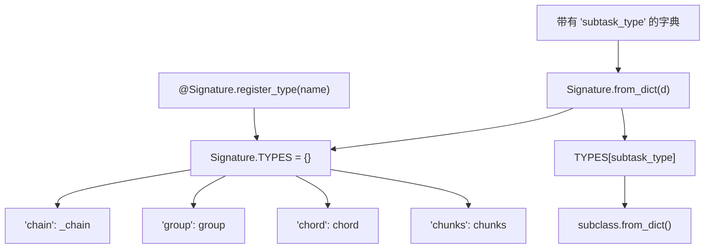

# Canvas 工作流

相关源文件

-   [celery/app/amqp.py](https://github.com/celery/celery/blob/4d068b56/celery/app/amqp.py)
-   [celery/app/base.py](https://github.com/celery/celery/blob/4d068b56/celery/app/base.py)
-   [celery/app/task.py](https://github.com/celery/celery/blob/4d068b56/celery/app/task.py)
-   [celery/canvas.py](https://github.com/celery/celery/blob/4d068b56/celery/canvas.py)
-   [celery/utils/\_\_init\_\_.py](https://github.com/celery/celery/blob/4d068b56/celery/utils/__init__.py)
-   [docs/userguide/canvas.rst](https://github.com/celery/celery/blob/4d068b56/docs/userguide/canvas.rst)
-   [t/integration/conftest.py](https://github.com/celery/celery/blob/4d068b56/t/integration/conftest.py)
-   [t/integration/tasks.py](https://github.com/celery/celery/blob/4d068b56/t/integration/tasks.py)
-   [t/integration/test\_canvas.py](https://github.com/celery/celery/blob/4d068b56/t/integration/test_canvas.py)
-   [t/integration/test\_quorum\_queue\_qos\_cluster\_simulation.py](https://github.com/celery/celery/blob/4d068b56/t/integration/test_quorum_queue_qos_cluster_simulation.py)
-   [t/integration/test\_security.py](https://github.com/celery/celery/blob/4d068b56/t/integration/test_security.py)
-   [t/integration/test\_tasks.py](https://github.com/celery/celery/blob/4d068b56/t/integration/test_tasks.py)
-   [t/smoke/tests/test\_canvas.py](https://github.com/celery/celery/blob/4d068b56/t/smoke/tests/test_canvas.py)
-   [t/unit/app/test\_app.py](https://github.com/celery/celery/blob/4d068b56/t/unit/app/test_app.py)
-   [t/unit/tasks/test\_canvas.py](https://github.com/celery/celery/blob/4d068b56/t/unit/tasks/test_canvas.py)
-   [t/unit/tasks/test\_tasks.py](https://github.com/celery/celery/blob/4d068b56/t/unit/tasks/test_tasks.py)

**目的**：记录 Celery 的 Canvas 系统，该系统用于从简单的任务原语中构建复杂的分布式工作流（distributed workflows）。Canvas 提供了签名（signature）对象和工作流原语（chain, group, chord, chunks），支持声明式的工作流构建、并行执行和结果协调。

**范围**：本页面涵盖了 Canvas 的整体架构、核心概念以及工作流执行模型。有关特定主题的详细信息，请参阅：

-   签名对象与构建模式：[4.1](/celery/celery/4.1-signatures)
-   各个工作流原语及其用法：[4.2](/celery/celery/4.2-workflow-primitives)
-   高级特性，如盖章（stamping）和回调：[4.3](/celery/celery/4.3-advanced-canvas-features)
-   Chord 执行与后端协调：[4.4](/celery/celery/4.4-chord-execution)

有关定义单个任务（不涉及编排）的信息，请参阅 [3](/celery/celery/3-tasks)。有关存储工作流状态的结果后端的信息，请参阅 [6](/celery/celery/6-result-backends)。

## 概览 (Overview)

Canvas 是 Celery 的工作流编排系统，它允许您通过组合简单的构建块来构建复杂的任务执行模式。该系统基于**签名 (Signatures)** —— 它是任务调用的可序列化表现形式，可以被链接、分组以及串联在一起。

Canvas 系统支持：

-   带有结果传递的顺序任务执行（链/chains）
-   并行任务执行（组/groups）
-   带有回调的同步屏障（chords）
-   工作流盖章与追踪
-   偏函数应用 (Partial application) 与不可变 (immutability) 模式

### Canvas 架构

**来源**：[celery/canvas.py1-2000](https://github.com/celery/celery/blob/4d068b56/celery/canvas.py#L1-L2000) [celery/app/base.py820-959](https://github.com/celery/celery/blob/4d068b56/celery/app/base.py#L820-L959) [celery/app/task.py446-613](https://github.com/celery/celery/blob/4d068b56/celery/app/task.py#L446-L613)

## 签名对象 (Signature Objects)

一个 `Signature` 是任务调用的一个可序列化表现形式。它将任务名称、位置参数、关键字参数和执行选项封装进一个单一的对象中，该对象可以被传递、序列化并与其他签名组合。

### 签名结构

**来源**：[celery/canvas.py232-344](https://github.com/celery/celery/blob/4d068b56/celery/canvas.py#L232-L344) [celery/canvas.py289-294](https://github.com/celery/celery/blob/4d068b56/celery/canvas.py#L289-L294)

### 创建签名

签名可以通过多种方式创建：

| 方法 | 语法 | 描述 |
| --- | --- | --- |
| 任务方法 | `task.s(args)` | 使用任务的 `.s()` 方法的快捷方式 |
| 任务签名 | `task.signature((args,), kwargs)` | 带有选项的完整签名 |
| 签名函数 | `signature('task.name', args, kwargs)` | 通过任务名称字符串创建 |
| 不可变快捷方式 | `task.si(args)` | 创建不可变 (immutable) 签名 |

**来源**：[celery/canvas.py232-344](https://github.com/celery/celery/blob/4d068b56/celery/canvas.py#L232-L344) [docs/userguide/canvas.rst16-203](https://github.com/celery/celery/blob/4d068b56/docs/userguide/canvas.rst#L16-L203)

## 工作流原语 (Workflow Primitives)

Canvas 提供了五个用于工作流编排的核心原语。每个原语本身都是 `Signature` 的子类，从而实现了递归组合。

### 原语类型

```mermaid
flowchart TD
    MapDef["task.map/starmap(items)对每个条目应用任务"]
    MapImpl["xmap/xstarmapcanvas.py:2700-2900"]
    ChunksDef["task.chunks(items, n)将工作拆分为批次"]
    ChunksSize["每个批次 n 个条目"]
    ChunksImpl["chunks 类canvas.py:2500-2700"]
    ChordDef["chord(header, body)同步屏障"]
    ChordHeader["Header: 任务组"]
    ChordBody["Body: 单个回调任务"]
    ChordImpl["chord 类canvas.py:2000-2500"]
    ChordBackend["需要：结果后端"]
    GroupDef["group(s1, s2, s3)并行执行任务"]
    GroupResult["返回：GroupResult"]
    GroupImpl["group 类canvas.py:1500-2000"]
    ChainDef["chain(s1, s2, s3)任务间的结果传递"]
    ChainOp["操作符：s1 | s2 | s3"]
    ChainImpl["_chain 类canvas.py:1000-1500"]

    MapDef --> MapImpl
    ChunksDef --> ChunksSize
    ChunksDef --> ChunksImpl
    ChordDef --> ChordHeader
    ChordDef --> ChordBody
    ChordDef --> ChordImpl
    ChordDef --> ChordBackend
    GroupDef --> GroupResult
    GroupDef --> GroupImpl
    ChainDef --> ChainOp
    ChainDef --> ChainImpl
```

**来源**：[celery/canvas.py1000-2900](https://github.com/celery/celery/blob/4d068b56/celery/canvas.py#L1000-L2900) [docs/userguide/canvas.rst250-306](https://github.com/celery/celery/blob/4d068b56/docs/userguide/canvas.rst#L250-L306)

### 原语对比

| 原语 | 执行模式 | 结果类型 | 是否需要后端 | 使用场景 |
| --- | --- | --- | --- | --- |
| `chain` | 顺序执行 | AsyncResult (最后一个任务) | 否 | 流水线处理 |
| `group` | 并行执行 | GroupResult | 否 | 扇出 (Fan-out) 操作 |
| `chord` | 并行 + 回调 | AsyncResult (body) | 是 | Map-reduce 模式 |
| `chunks` | 并行批处理 | group | 否 | 海量数据处理 |
| `map`/`starmap` | 并行执行 | group | 否 | 函数式映射 |

**来源**：[celery/canvas.py1-2900](https://github.com/celery/celery/blob/4d068b56/celery/canvas.py#L1-L2900) [docs/userguide/canvas.rst250-306](https://github.com/celery/celery/blob/4d068b56/docs/userguide/canvas.rst#L250-L306)

## 工作流执行模型

Canvas 工作流通过一个多阶段过程执行：构建 (composition)、冻结 (freezing)、消息创建以及执行。

### 执行流 (Execution Flow)

> **[Mermaid sequence]**
> *(图表结构无法解析)*

**来源**：[celery/canvas.py369-519](https://github.com/celery/celery/blob/4d068b56/celery/canvas.py#L369-L519) [celery/app/base.py820-959](https://github.com/celery/celery/blob/4d068b56/celery/app/base.py#L820-L959) [celery/canvas.py472-519](https://github.com/celery/celery/blob/4d068b56/celery/canvas.py#L472-L519)

### Chain 执行细节

链 (Chains) 顺序执行任务，并将一个任务的结果传递给下一个任务。链机制使用任务标头中的 `chain` 选项来追踪剩余的任务。

**来源**：[celery/canvas.py758-786](https://github.com/celery/celery/blob/4d068b56/celery/canvas.py#L758-L786) [celery/canvas.py1000-1500](https://github.com/celery/celery/blob/4d068b56/celery/canvas.py#L1000-L1500)

## 签名构建 (Signature Composition)

签名支持通过各种操作符和方法进行构建，从而实现灵活的工作流构造。

### 构建操作符

| 操作符 | 语法 | 结果 | 描述 |
| --- | --- | --- | --- |
| 管道符 `|` | `s1 | s2` | `chain` | 链接两个签名 |
| 管道连接至组 | `s1 | group(...)` | `chain` | 将签名链接至组 |
| `clone()` | `s.clone(args, kwargs)` | `Signature` | 创建修改后的副本 |
| `set()` | `s.set(countdown=10)` | `Signature` | 设置执行选项 |
| `link()` | `s.link(callback)` | `Signature` | 添加成功回调 |
| `link_error()` | `s.link_error(errback)` | `Signature` | 添加错误回调 |

**来源**：[celery/canvas.py758-786](https://github.com/celery/celery/blob/4d068b56/celery/canvas.py#L758-L786) [celery/canvas.py444-469](https://github.com/celery/celery/blob/4d068b56/celery/canvas.py#L444-L469) [celery/canvas.py716-745](https://github.com/celery/celery/blob/4d068b56/celery/canvas.py#L716-L745)

### 偏函数应用 (Partial Application)

签名支持偏函数应用，可以在执行期间预置额外的参数：

**来源**：[celery/canvas.py402-442](https://github.com/celery/celery/blob/4d068b56/celery/canvas.py#L402-L442) [celery/canvas.py538-551](https://github.com/celery/celery/blob/4d068b56/celery/canvas.py#L538-L551) [docs/userguide/canvas.rst167-189](https://github.com/celery/celery/blob/4d068b56/docs/userguide/canvas.rst#L167-L189)

## 工作流盖章 (Workflow Stamping)

盖章系统允许使用 `StampingVisitor` 模式在工作流中传播自定义元数据。这实现了追踪、调试和自定义工作流协调。

### 盖章架构

**来源**：[celery/canvas.py118-229](https://github.com/celery/celery/blob/4d068b56/celery/canvas.py#L118-L229) [celery/canvas.py553-633](https://github.com/celery/celery/blob/4d068b56/celery/canvas.py#L553-L633) [celery/canvas.py635-682](https://github.com/celery/celery/blob/4d068b56/celery/canvas.py#L635-L682)

### 盖章过程

当一个工作流被盖章时，标头按层级进行合并：

1.  **Visitor 标头**：由 visitor 方法（`on_signature()` 等）返回。
2.  **提供的标头**：传递给 `.stamp()` 方法。
3.  **现有标头**：已存在于签名的 `options` 中。

`_IMMUTABLE_OPTIONS` 集合 (`{"group_id", "stamped_headers"}`) 防止某些标头在合并期间被覆盖，以确保工作流协调保持一致。

**来源**：[celery/canvas.py291-294](https://github.com/celery/celery/blob/4d068b56/celery/canvas.py#L291-L294) [celery/canvas.py553-611](https://github.com/celery/celery/blob/4d068b56/celery/canvas.py#L553-L611)

## 常见工作流模式

Canvas 原语可以组合创建复杂的工作流模式：

### 模式：Map-Reduce

### 模式：带有错误处理的流水线

### 模式：嵌套工作流

**来源**：[docs/userguide/canvas.rst310-500](https://github.com/celery/celery/blob/4d068b56/docs/userguide/canvas.rst#L310-L500) [t/integration/test\_canvas.py1-600](https://github.com/celery/celery/blob/4d068b56/t/integration/test_canvas.py#L1-L600)

## 与任务执行的集成

Canvas 工作流通过特定的标头和协调机制与核心任务执行系统集成。

### 任务消息标头 (Task Message Headers)

任务消息中与 Canvas 相关的标头：

| 标头 | 类型 | 描述 |
| --- | --- | --- |
| `chain` | list | 链中剩余的任务 |
| `chord` | Signature | Chord 回调信息 |
| `group` | str | 组任务的组 ID |
| `group_index` | int | 任务在组内的位置 |
| `root_id` | str | 工作流中第一个任务的 ID |
| `parent_id` | str | 调用任务的 ID |
| `stamped_headers` | list | 已盖章标头的键 |
| `stamps` | dict | 已盖章标头的值 |

**来源**：[celery/app/amqp.py320-404](https://github.com/celery/celery/blob/4d068b56/celery/app/amqp.py#L320-L404) [celery/app/task.py60-161](https://github.com/celery/celery/blob/4d068b56/celery/app/task.py#L60-L161)

### 结果协调 (Result Coordination)

不同的原语使用不同的结果协调机制：

-   **chain**：无特殊协调；任务按顺序发送下一个任务。
-   **group**：返回追踪多个 `AsyncResult` 对象的 `GroupResult`。
-   **chord**：使用后端通过 `on_chord_part_return()` 追踪完成情况。
-   **chunks**：以组的形式实现，返回 `GroupResult`。

**来源**：[celery/canvas.py1000-2900](https://github.com/celery/celery/blob/4d068b56/celery/canvas.py#L1000-L2900) [celery/result.py1-500](https://github.com/celery/celery/blob/4d068b56/celery/result.py#L1-L500)

## 类型注册系统 (Type Registration System)

Canvas 通过注册系统支持自定义原语类型，从而实现了可扩展性：

**来源**：[celery/canvas.py295-320](https://github.com/celery/celery/blob/4d068b56/celery/canvas.py#L295-L320) [celery/canvas.py289-294](https://github.com/celery/celery/blob/4d068b56/celery/canvas.py#L289-L294)

## 总结

Canvas 为 Celery 中的工作流编排提供了一个强大的抽象：

-   **签名 (Signatures)** 将任务调用封装为可序列化、可组合的对象。
-   **原语 (Primitives)** (chain, group, chord, chunks, map) 为复杂模式提供了构建块。
-   **盖章 (Stamping)** 支持元数据传播和工作流追踪。
-   通过标头和结果后端与核心任务系统**集成**。
-   通过类型注册和 visitor 模式提供**可扩展性**。

有关特定方面的详细信息，请参阅相关页面：[4.1](/celery/celery/4.1-signatures) 签名，[4.2](/celery/celery/4.2-workflow-primitives) 原语，[4.3](/celery/celery/4.3-advanced-canvas-features) 高级特性，以及 [4.4](/celery/celery/4.4-chord-execution) chord 执行。

**来源**：[celery/canvas.py1-2900](https://github.com/celery/celery/blob/4d068b56/celery/canvas.py#L1-L2900) [docs/userguide/canvas.rst1-1000](https://github.com/celery/celery/blob/4d068b56/docs/userguide/canvas.rst#L1-L1000) [celery/app/base.py820-959](https://github.com/celery/celery/blob/4d068b56/celery/app/base.py#L820-L959) [celery/app/task.py1-700](https://github.com/celery/celery/blob/4d068b56/celery/app/task.py#L1-L700)
