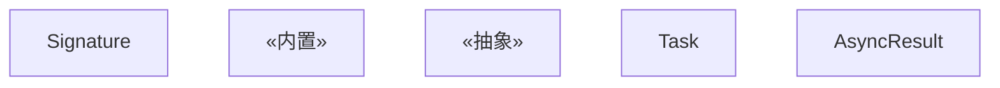
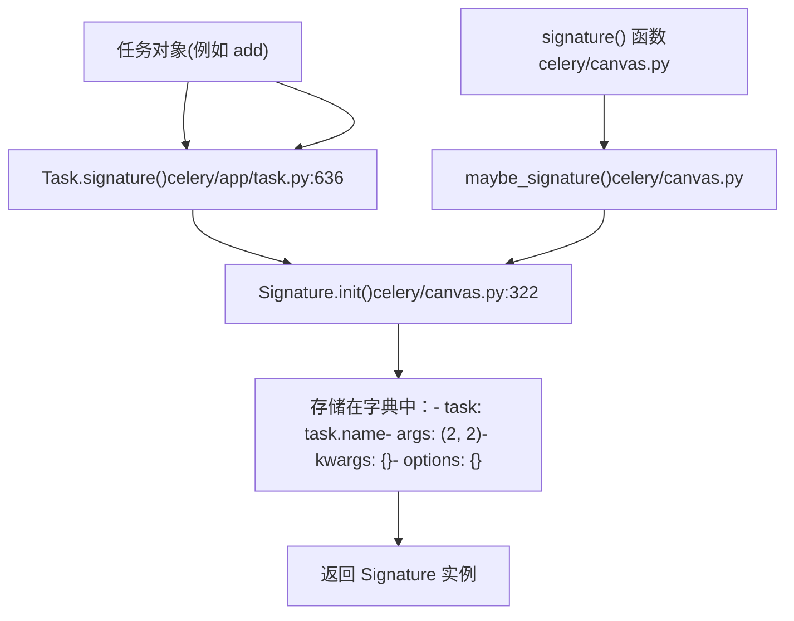
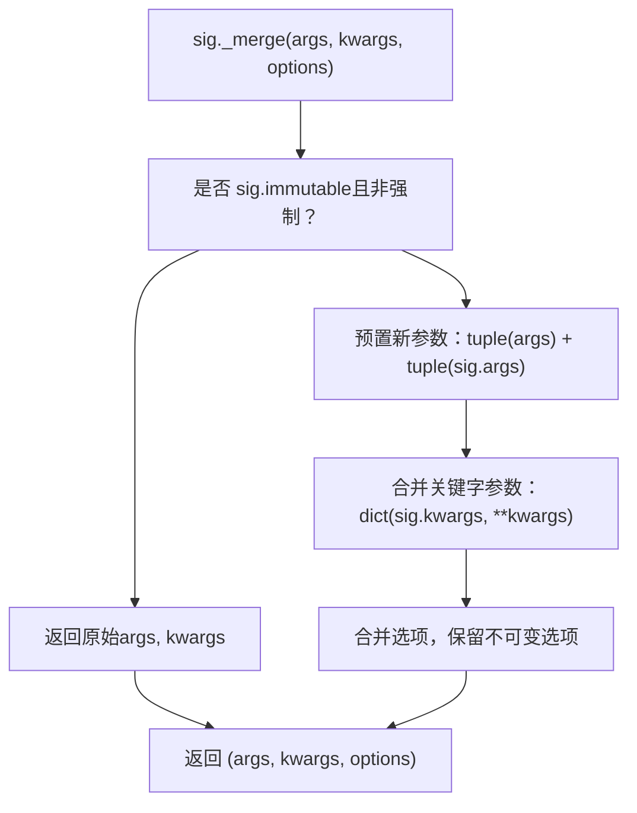
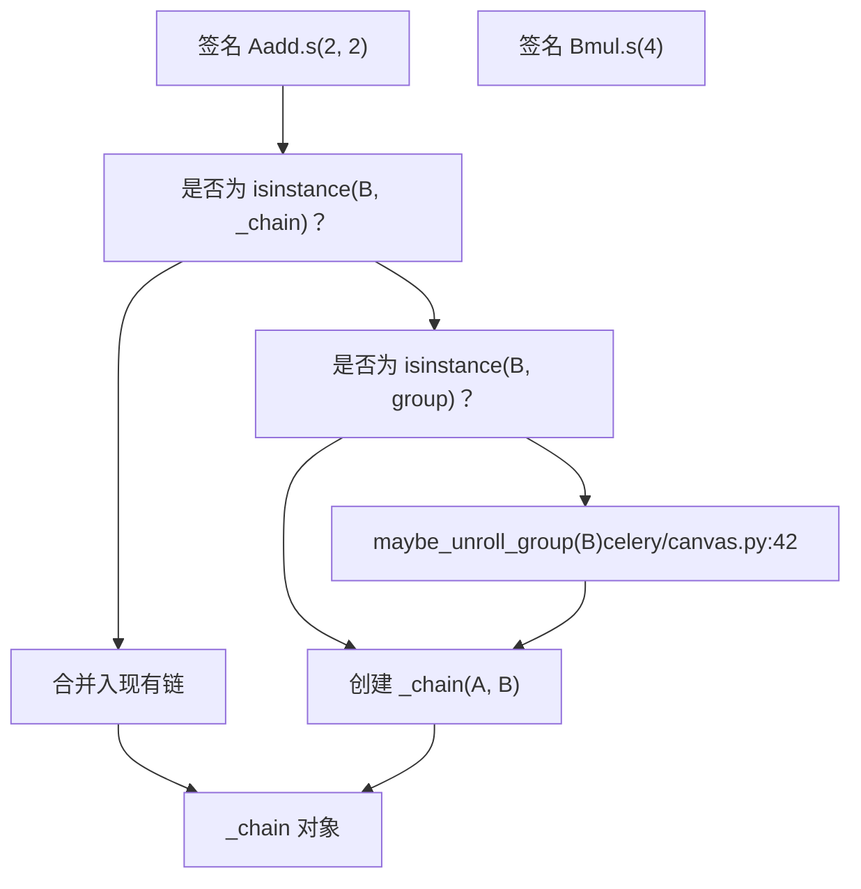
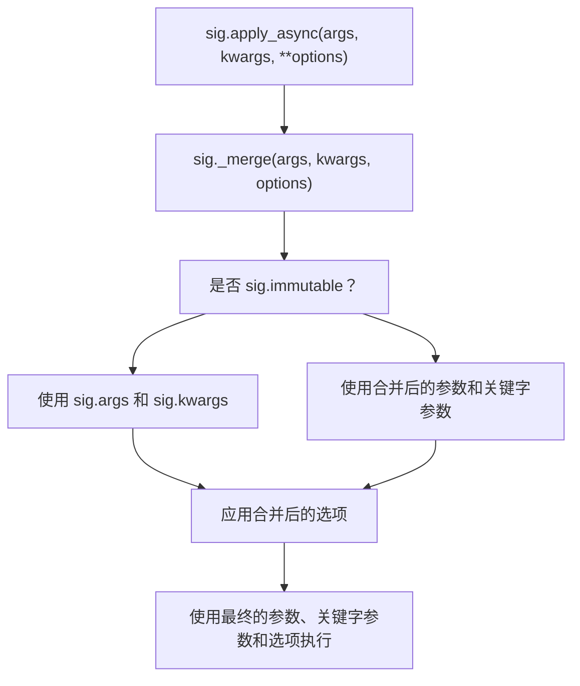
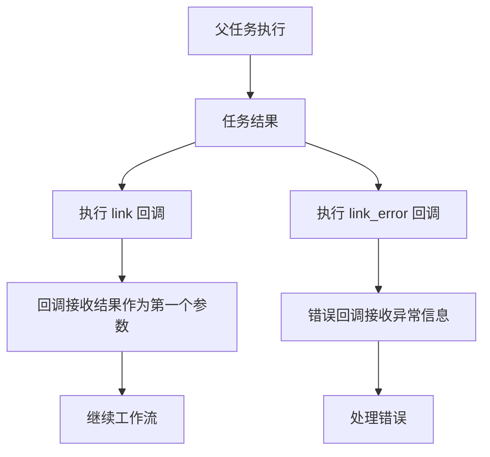
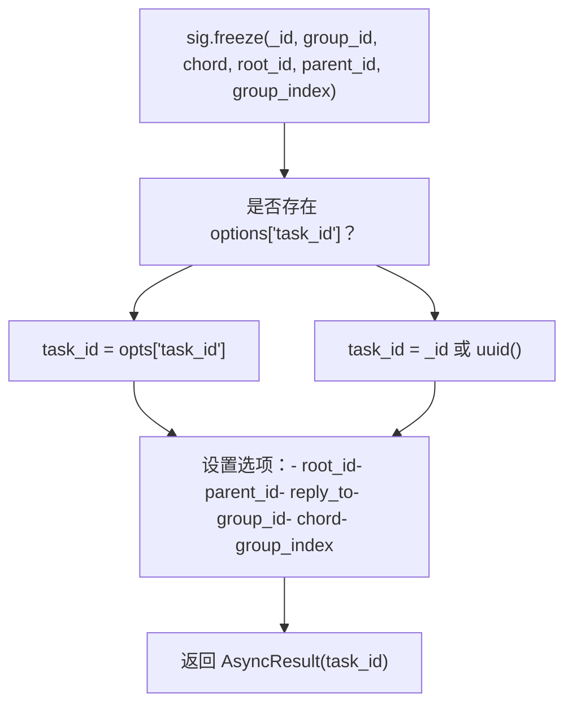

# 签名与构建 (Signature and Composition)

相关源文件

-   [celery/app/amqp.py](https://github.com/celery/celery/blob/4d068b56/celery/app/amqp.py)
-   [celery/app/base.py](https://github.com/celery/celery/blob/4d068b56/celery/app/base.py)
-   [celery/app/task.py](https://github.com/celery/celery/blob/4d068b56/celery/app/task.py)
-   [celery/canvas.py](https://github.com/celery/celery/blob/4d068b56/celery/canvas.py)
-   [celery/utils/\_\_init\_\_.py](https://github.com/celery/celery/blob/4d068b56/celery/utils/__init__.py)
-   [docs/userguide/canvas.rst](https://github.com/celery/celery/blob/4d068b56/docs/userguide/canvas.rst)
-   [t/integration/conftest.py](https://github.com/celery/celery/blob/4d068b56/t/integration/conftest.py)
-   [t/integration/tasks.py](https://github.com/celery/celery/blob/4d068b56/t/integration/tasks.py)
-   [t/integration/test\_canvas.py](https://github.com/celery/celery/blob/4d068b56/t/integration/test_canvas.py)
-   [t/integration/test\_quorum\_queue\_qos\_cluster\_simulation.py](https://github.com/celery/celery/blob/4d068b56/t/integration/test_quorum_queue_qos_cluster_simulation.py)
-   [t/integration/test\_security.py](https://github.com/celery/celery/blob/4d068b56/t/integration/test_security.py)
-   [t/integration/test\_tasks.py](https://github.com/celery/celery/blob/4d068b56/t/integration/test_tasks.py)
-   [t/smoke/tests/test\_canvas.py](https://github.com/celery/celery/blob/4d068b56/t/smoke/tests/test_canvas.py)
-   [t/unit/app/test\_app.py](https://github.com/celery/celery/blob/4d068b56/t/unit/app/test_app.py)
-   [t/unit/tasks/test\_canvas.py](https://github.com/celery/celery/blob/4d068b56/t/unit/tasks/test_canvas.py)
-   [t/unit/tasks/test\_tasks.py](https://github.com/celery/celery/blob/4d068b56/t/unit/tasks/test_tasks.py)

本文档解释了作为 Celery Canvas 工作流系统基础的 `Signature` 对象。它涵盖了签名如何封装任务调用、支持偏函数应用 (partial application)，以及如何使用操作符组合在一起形成复杂的工作流。

有关特定 Canvas 原语（如 `chain`、`group` 和 `chord`）的信息，请参阅[工作流原语](/celery/celery/4.2-workflow-primitives)。有关盖章（stamping）和不可变性（immutability）等高级 Canvas 特性的信息，请参阅[高级 Canvas 特性](/celery/celery/4.3-advanced-canvas-features)。

---

## 概览 (Overview)

`Signature` 是一个不可变的数据结构，它封装了单个任务调用的参数 (args)、关键字参数 (kwargs) 和执行选项。签名使任务调用能够作为一等对象（first-class objects）进行传递、跨网络序列化，并被构建进复杂的工作流中。

签名是可调用对象，可以：

-   使用 `.s()` 或 `.signature()` 方法从任务对象中创建
-   直接在当前进程中通过 `()` 调用
-   使用 `.delay()` 或 `.apply_async()` 发送给工作者
-   使用管道操作符 `|` 组合形成链 (chains)
-   为消息传递进行序列化和反序列化

**来源：** [celery/canvas.py232-287](https://github.com/celery/celery/blob/4d068b56/celery/canvas.py#L232-L287) [docs/userguide/canvas.rst15-203](https://github.com/celery/celery/blob/4d068b56/docs/userguide/canvas.rst#L15-L203)

---

## Signature 类

`Signature` 类被定义为 `dict` 的子类，实现了 `CallableSignature` 抽象接口。它以结构化格式存储任务元数据，便于序列化。

### Signature 类结构


**关键字段：**

-   `task`：作为字符串的任务名称（例如 `"tasks.add"`）
-   `args`：位置参数元组
-   `kwargs`：关键字参数字典
-   `options`：执行选项字典（例如 `countdown`, `eta`, `queue`）
-   `subtask_type`：Canvas 原语的类型标识符（基本签名为字符串空）
-   `immutable`：防止在构建期间修改参数的布尔标志

**来源：** [celery/canvas.py232-344](https://github.com/celery/celery/blob/4d068b56/celery/canvas.py#L232-L344) [celery/app/task.py163-395](https://github.com/celery/celery/blob/4d068b56/celery/app/task.py#L163-L395)

---

## 创建签名 (Creating Signatures)

签名可以通过多种方式创建，每种方式都有不同的使用场景。

### 创建方法

| 方法 | 示例 | 使用场景 |
| --- | --- | --- |
| `signature()` 函数 | `signature('tasks.add', args=(2, 2))` | 从任务名称字符串创建 |
| `.signature()` 方法 | `add.signature((2, 2), countdown=10)` | 从任务实例创建 |
| `.s()` 快捷方式 | `add.s(2, 2)` | 快速创建部分参数的签名 |
| `.si()` 快捷方式 | `add.si(2, 2)` | 创建不可变 (immutable) 签名 |
| 从字典创建 | `Signature.from_dict(d, app=app)` | 从消息中反序列化 |

### 创建流程图


**来源：** [celery/canvas.py322-344](https://github.com/celery/celery/blob/4d068b56/celery/canvas.py#L322-L344) [celery/app/task.py636-658](https://github.com/celery/celery/blob/4d068b56/celery/app/task.py#L636-L658) [docs/userguide/canvas.rst29-72](https://github.com/celery/celery/blob/4d068b56/docs/userguide/canvas.rst#L29-L72)

---

## 偏函数应用 (Partial Application)

签名支持偏函数应用，即在调用签名时可以预置额外的参数并合并选项。这是 Canvas 构建的基础。

### `_merge()` 方法

`_merge()` 方法实现了偏函数应用逻辑：


**不可变选项 (Immutable Options)：** 某些选项（如 `group_id` 和 `stamped_headers`）在合并期间绝不会被覆盖，以防止干扰父任务的完成 [celery/canvas.py293](https://github.com/celery/celery/blob/4d068b56/celery/canvas.py#L293-L293)

**示例：**

-   `add.s(2).delay(4)` → 调用 `add(4, 2)`（参数被预置）
-   `add.s(2, 2).delay(debug=True)` → 调用 `add(2, 2, debug=True)`（关键字参数被合并）
-   `add.si(2, 2).delay(4)` → 调用 `add(2, 2)`（不可变，参数被忽略）

**来源：** [celery/canvas.py402-442](https://github.com/celery/celery/blob/4d068b56/celery/canvas.py#L402-L442) [docs/userguide/canvas.rst129-156](https://github.com/celery/celery/blob/4d068b56/docs/userguide/canvas.rst#L129-L156)

---

## 使用管道操作符进行构建

管道操作符 `|` 支持将签名构建进顺序工作流（链/chains）中。当签名被管道连接在一起时，它们会形成一个 `_chain` 对象。

### 管道操作符实现


`__or__` 方法实现在 [celery/canvas.py758-779](https://github.com/celery/celery/blob/4d068b56/celery/canvas.py#L758-L779) 中：

-   **签名 | 签名** → 创建一个新的 `_chain`
-   **签名 | \_chain** → 将签名预置到链的任务中
-   **签名 | 组 (group)** → 创建一个类 chord 的结构

**Python 3.9+ 兼容性：** `__ior__` 方法委托给 `__or__`，以防止字典合并行为覆盖 Canvas 构建 [celery/canvas.py781-785](https://github.com/celery/celery/blob/4d068b56/celery/canvas.py#L781-L785)

**来源：** [celery/canvas.py758-785](https://github.com/celery/celery/blob/4d068b56/celery/canvas.py#L758-L785) [docs/userguide/canvas.rst327-333](https://github.com/celery/celery/blob/4d068b56/docs/userguide/canvas.rst#L327-L333)

---

## 不可变性 (Immutability)

不可变签名可防止其参数在构建过程中被修改。这对于不应接收父任务返回值的回调（callbacks）至关重要。

### 设置不可变性

| 方法 | 示例 | 描述 |
| --- | --- | --- |
| `.si()` 快捷方式 | `reset.si()` | 创建不可变签名 |
| `.signature(immutable=True)` | `reset.signature(immutable=True)` | 在创建时设置 |
| `.set(immutable=True)` | `sig.set(immutable=True)` | 在现有签名上设置 |

### 不可变行为

当签名是不可变的：

-   传递给 `.delay()` 或 `.apply_async()` 的参数将被忽略
-   始终使用签名的原始位置参数 (args) 和关键字参数 (kwargs)
-   执行选项仍可以设置并合并


**使用场景：**

-   忽略父结果的回调：`task.apply_async(link=notify.si())`
-   链中的独立任务：`add.si(2, 2) | add.si(4, 4)`
-   忽略 header 结果的 Chord body：`chord(header, body.si())`

**来源：** [celery/canvas.py438-442](https://github.com/celery/celery/blob/4d068b56/celery/canvas.py#L438-L442) [celery/canvas.py550-551](https://github.com/celery/celery/blob/4d068b56/celery/canvas.py#L550-L551) [docs/userguide/canvas.rst168-190](https://github.com/celery/celery/blob/4d068b56/docs/userguide/canvas.rst#L168-L190)

---

## 克隆与替换 (Cloning and Replacing)

可以克隆签名以创建修改后的副本，而无需修改原始签名。

### 克隆方法 (Clone Method)

`clone()` 方法创建一个带有可选修改的深拷贝 (deep copy)：

```
new_sig = sig.clone(args=(new_args,), kwargs={'new_kw': 'val'}, task_id='123')
```
**实现：** [celery/canvas.py444-468](https://github.com/celery/celery/blob/4d068b56/celery/canvas.py#L444-L468)

-   执行 `_merge()` 以合并参数
-   深拷贝选项字典以防止共享可变状态
-   通过 `Signature.from_dict()` 创建一个新的 `Signature` 实例
-   保留对任务类的 `_type` 引用

### 替换方法 (Replace Method)

`replace()` 方法创建一个对指定字段进行完整替换（而非合并）的克隆：

```
new_sig = sig.replace(args=(1, 2), kwargs={'x': 1}, options={'queue': 'fast'})
```
**实现：** [celery/canvas.py523-536](https://github.com/celery/celery/blob/4d068b56/celery/canvas.py#L523-L536)

-   创建签名的克隆
-   如果 `args` 不为 None，则完全替换 `signature.args`
-   如果 `kwargs` 不为 None，则完全替换 `signature.kwargs`
-   如果 `options` 不为 None，则完全替换 `signature.options`

**来源：** [celery/canvas.py444-536](https://github.com/celery/celery/blob/4d068b56/celery/canvas.py#L444-L536) [t/unit/tasks/test\_canvas.py164-172](https://github.com/celery/celery/blob/4d068b56/t/unit/tasks/test_canvas.py#L164-L172)

---

## 回调与错误回调

签名支持附加在成功或失败后执行的回调任务。

### 回调类型 (Callback Types)


### 回调方法

| 方法 | 行为 | 返回值 |
| --- | --- | --- |
| `.link(callback)` | 添加成功回调 | 该回调签名（以便链接） |
| `.link_error(errback)` | 添加错误回调 | 该错误回调签名（以便链接） |
| `.on_error(errback)` | 可链接的错误回调 | 原始签名（而非错误回调） |

**关键区别：** `.on_error()` 返回父签名以便链接，而 `.link_error()` 返回错误回调签名 [celery/canvas.py734-745](https://github.com/celery/celery/blob/4d068b56/celery/canvas.py#L734-L745)。

### 链接存储 (Link Storage)

回调作为列表存储在签名的 `options` 字典中：

-   `options['link']`：成功回调列表
-   `options['link_error']`：错误回调列表

`_with_list_option()` 辅助函数确保这些始终是列表 [celery/canvas.py684-699](https://github.com/celery/celery/blob/4d068b56/celery/canvas.py#L684-L699)。

**来源：** [celery/canvas.py716-745](https://github.com/celery/celery/blob/4d068b56/celery/canvas.py#L716-L745) [docs/userguide/canvas.rst205-243](https://github.com/celery/celery/blob/4d068b56/docs/userguide/canvas.rst#L205-L243) [docs/userguide/canvas.rst538-556](https://github.com/celery/celery/blob/4d068b56/docs/userguide/canvas.rst#L538-L556)

---

## 冻结签名 (Freezing Signatures)

冻结签名通过分配具体的任务 ID 并设置工作流元数据使其最终化。这为签名的执行做好了准备。

### 冻结方法 (Freeze Method)


**实现细节：** [celery/canvas.py472-519](https://github.com/celery/celery/blob/4d068b56/celery/canvas.py#L472-L519)

**参数：**

-   `_id`：要使用的任务 ID（如果未提供则生成 UUID）
-   `group_id`：组/chord 任务的组标识符
-   `chord`：针对 chord header 任务的 chord body 签名
-   `root_id`：工作流的根任务 ID
-   `parent_id`：链中的父任务 ID
-   `group_index`：组内的任务索引

**何时发生冻结：**

-   在复杂的 Canvas 结构上调用 `apply_async()` 之前
-   当链/组/chord 需要建立父子关系时
-   在工作流序列化和消息创建期间

**返回值：** 一个 `AsyncResult` 实例，可用于追踪任务的执行。

**来源：** [celery/canvas.py472-519](https://github.com/celery/celery/blob/4d068b56/celery/canvas.py#L472-L519) [celery/app/amqp.py925-933](https://github.com/celery/celery/blob/4d068b56/celery/app/amqp.py#L925-L933)

---

## 签名调用流 (Signature Invocation Flow)

签名从创建到执行的完整生命周期：

> **[Mermaid sequence]**
> *(图表结构无法解析)*

**来源：** [celery/canvas.py346-400](https://github.com/celery/celery/blob/4d068b56/celery/canvas.py#L346-L400) [celery/app/task.py446-613](https://github.com/celery/celery/blob/4d068b56/celery/app/task.py#L446-L613) [celery/app/base.py820-959](https://github.com/celery/celery/blob/4d068b56/celery/app/base.py#L820-L959)

---

## 签名序列化 (Signature Serialization)

签名被序列化为字典，以便进行消息传递和结果存储。

### 序列化格式

签名被序列化为具有以下字段的字典：

```
{
    'task': 'tasks.add',
    'args': (2, 2),
    'kwargs': {'debug': True},
    'options': {'countdown': 10, 'task_id': 'abc123'},
    'subtask_type': '',
    'immutable': False
}
```
### 序列化方法

| 方法 | 目的 | 位置 |
| --- | --- | --- |
| `__reduce__()` | Pickle 序列化 | [celery/canvas.py820-823](https://github.com/celery/celery/blob/4d068b56/celery/canvas.py#L820-L823) |
| `__json__()` | JSON 序列化 | [celery/canvas.py825-826](https://github.com/celery/celery/blob/4d068b56/celery/canvas.py#L825-L826) |
| `dict(sig)` | 转换为字典 | 继承自 `dict` |
| `.from_dict(d, app)` | 反序列化 | [celery/canvas.py310-320](https://github.com/celery/celery/blob/4d068b56/celery/canvas.py#L310-L320) |

### 类型注册 (Type Registration)

Canvas 原语类型（chain, group, chord）向 `Signature.TYPES` 注册自身，以便进行正确的反序列化：

```
@Signature.register_type()
class _chain(Signature):
    def __init__(self, *tasks, **options):
        self.subtask_type = 'chain'
        # ...
```
在反序列化时，`from_dict()` 检查 `subtask_type` 字段并实例化正确的类 [celery/canvas.py315-319](https://github.com/celery/celery/blob/4d068b56/celery/canvas.py#L315-L319)。

**来源：** [celery/canvas.py295-320](https://github.com/celery/celery/blob/4d068b56/celery/canvas.py#L295-L320) [celery/canvas.py820-826](https://github.com/celery/celery/blob/4d068b56/celery/canvas.py#L820-L826) [t/unit/tasks/test\_canvas.py154-162](https://github.com/celery/celery/blob/4d068b56/t/unit/tasks/test_canvas.py#L154-L162)

---

## 常用模式与示例

### 模式：链中的偏函数应用 (Partial Application in Chains)

```
# 创建一个带有部分参数的签名
partial = add.s(2)  # 不完整：缺少一个参数

# 带有偏函数应用的链
result = (add.s(1, 1) | partial).delay()
# 结果：add(1, 1) = 2, 然后 add(2, 2) = 4
```
### 模式：不可变回调 (Immutable Callbacks)

```
# 忽略父结果的回调
task.apply_async((2, 2), link=notify.si('任务已完成'))

# 包含独立任务的链
workflow = add.si(2, 2) | add.si(4, 4) | add.si(8, 8)
```
### 模式：错误处理

```
# 添加错误回调
sig = process_data.s(data).on_error(log_error.s())

# 多个错误回调
sig.link_error(retry_task.s())
sig.link_error(send_alert.s())
```
### 模式：动态构建工作流

```
# 克隆并修改
base_sig = process.s(data).set(queue='high')
modified = base_sig.clone(kwargs={'priority': 10})

# 带有元数据的冻结
sig.freeze(root_id='workflow-123', parent_id='parent-456')
result = sig.apply_async()
```
**来源：** [docs/userguide/canvas.rst129-203](https://github.com/celery/celery/blob/4d068b56/docs/userguide/canvas.rst#L129-L203) [t/integration/test\_canvas.py188-252](https://github.com/celery/celery/blob/4d068b56/t/integration/test_canvas.py#L188-L252)
