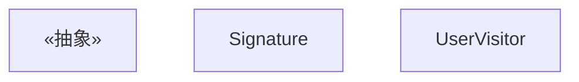
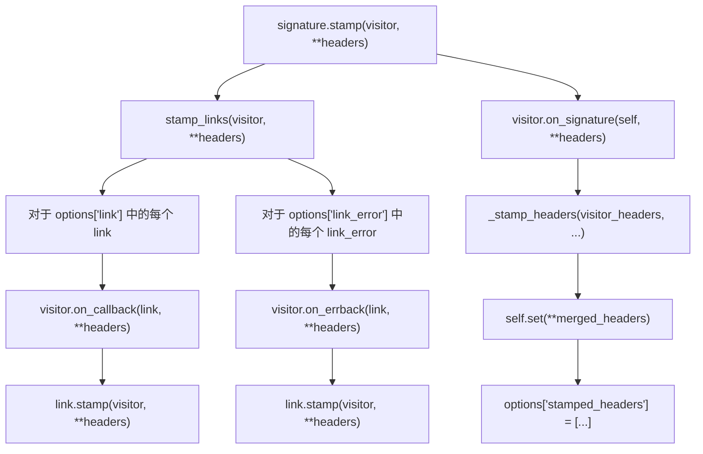
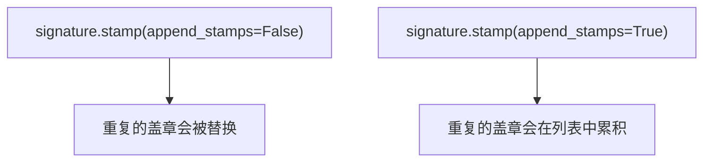
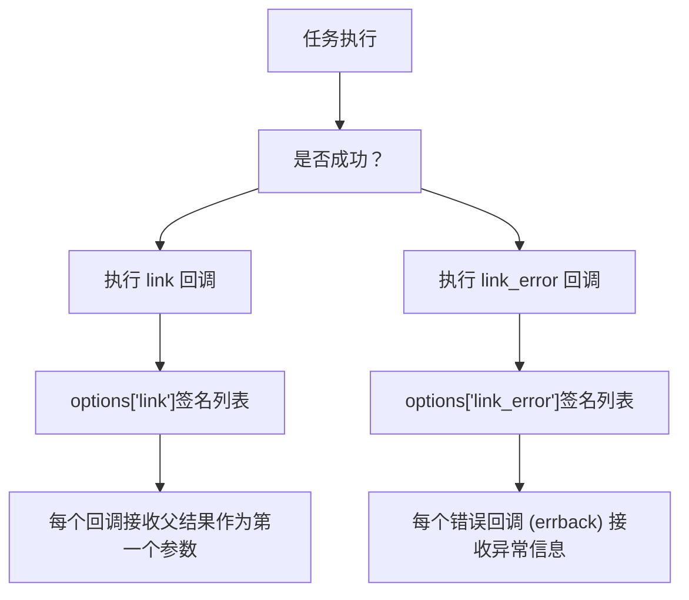
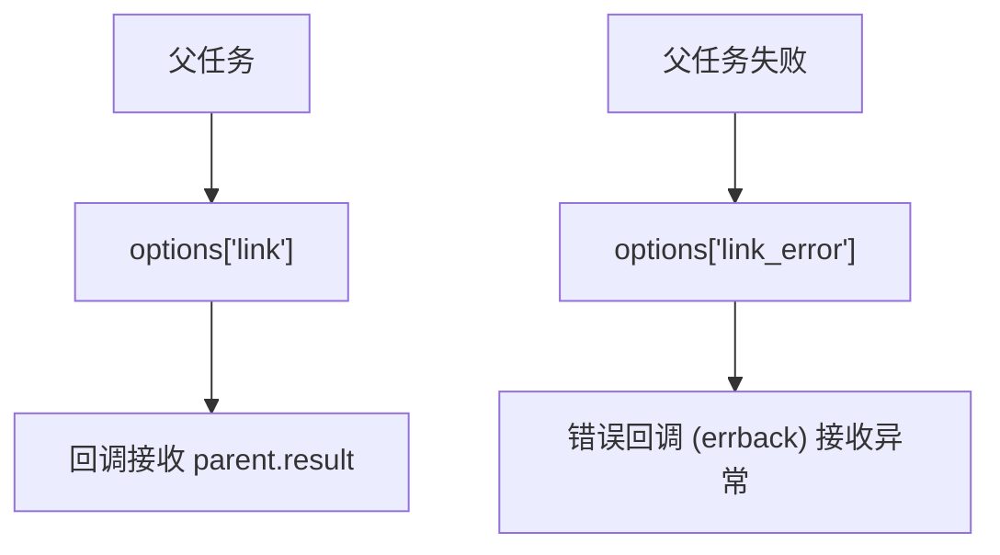
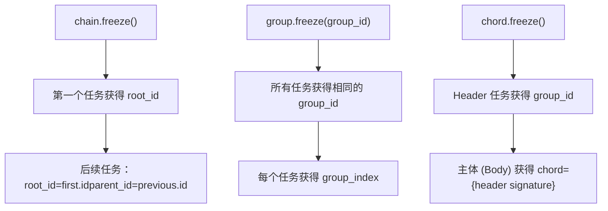
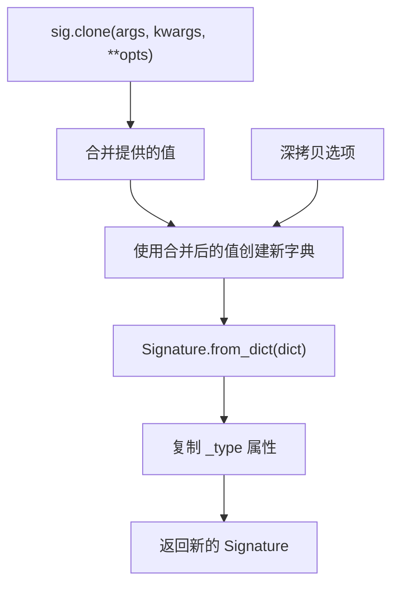
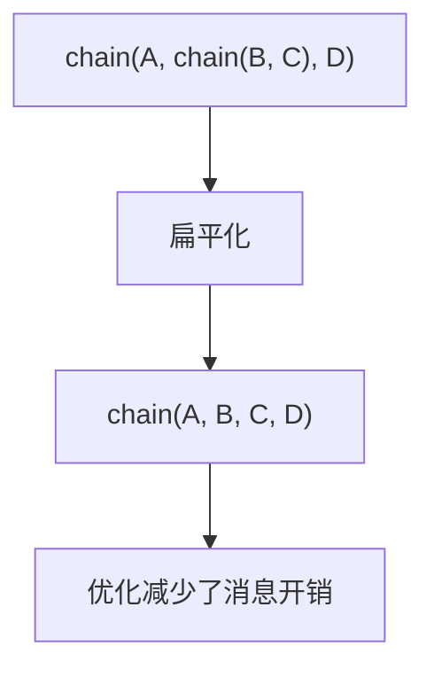
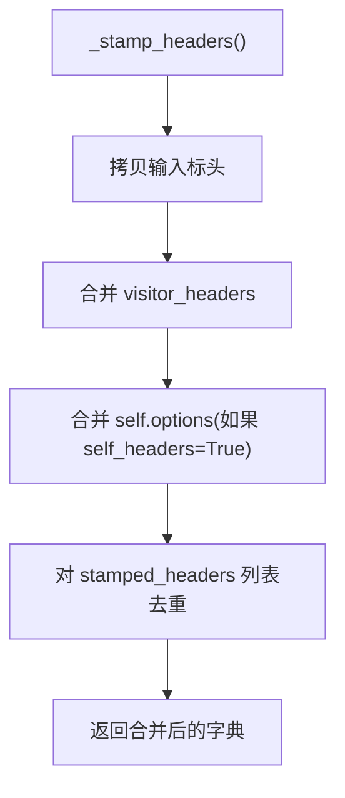
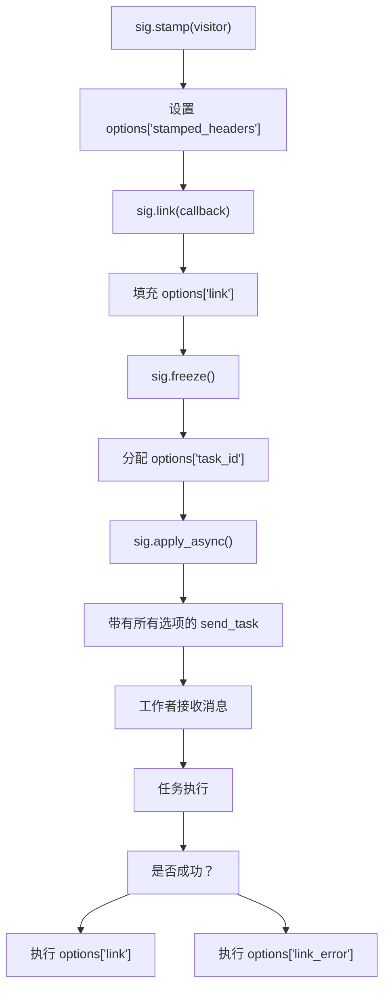

# 高级 Canvas 特性

相关源文件

-   [celery/app/amqp.py](https://github.com/celery/celery/blob/4d068b56/celery/app/amqp.py)
-   [celery/app/base.py](https://github.com/celery/celery/blob/4d068b56/celery/app/base.py)
-   [celery/app/task.py](https://github.com/celery/celery/blob/4d068b56/celery/app/task.py)
-   [celery/canvas.py](https://github.com/celery/celery/blob/4d068b56/celery/canvas.py)
-   [celery/utils/\_\_init\_\_.py](https://github.com/celery/celery/blob/4d068b56/celery/utils/__init__.py)
-   [docs/userguide/canvas.rst](https://github.com/celery/celery/blob/4d068b56/docs/userguide/canvas.rst)
-   [t/integration/conftest.py](https://github.com/celery/celery/blob/4d068b56/t/integration/conftest.py)
-   [t/integration/tasks.py](https://github.com/celery/celery/blob/4d068b56/t/integration/tasks.py)
-   [t/integration/test\_canvas.py](https://github.com/celery/celery/blob/4d068b56/t/integration/test_canvas.py)
-   [t/integration/test\_quorum\_queue\_qos\_cluster\_simulation.py](https://github.com/celery/celery/blob/4d068b56/t/integration/test_quorum_queue_qos_cluster_simulation.py)
-   [t/integration/test\_security.py](https://github.com/celery/celery/blob/4d068b56/t/integration/test_security.py)
-   [t/integration/test\_tasks.py](https://github.com/celery/celery/blob/4d068b56/t/integration/test_tasks.py)
-   [t/smoke/tests/test\_canvas.py](https://github.com/celery/celery/blob/4d068b56/t/smoke/tests/test_canvas.py)
-   [t/unit/app/test\_app.py](https://github.com/celery/celery/blob/4d068b56/t/unit/app/test_app.py)
-   [t/unit/tasks/test\_canvas.py](https://github.com/celery/celery/blob/4d068b56/t/unit/tasks/test_canvas.py)
-   [t/unit/tasks/test\_tasks.py](https://github.com/celery/celery/blob/4d068b56/t/unit/tasks/test_tasks.py)

本页面记录了用于自定义和控制任务工作流执行的高级 Canvas 特性。有关 `chain`、`group` 和 `chord` 等基础 Canvas 原语，请参阅[工作流原语](/celery/celery/4.2-workflow-primitives)。有关底层的 `Signature` 对象模型，请参阅[签名与构建](/celery/celery/4.1-signatures)。

本页面涵盖：

-   **盖章 (Stamping)** —— 添加自定义标头以追踪工作流
-   **回调 (Callbacks)** —— 附加成功和错误处理器
-   **冻结 (Freeze)** —— 使用具体任务 ID 最终化签名
-   **不可变性 (Immutability)** —— 防止参数修改
-   **克隆 (Cloning)** —— 创建签名的修改副本

## 盖章 (Stamping)

盖章允许向任务签名及其回调中添加自定义标头，从而实现工作流追踪和自定义元数据传播。盖章系统使用 Visitor 模式递归地遍历并注解 Canvas 原语。

### StampingVisitor 接口

`StampingVisitor` 抽象基类定义了用于为不同 Canvas 类型盖章的钩子：


**来源**：[celery/canvas.py118-229](https://github.com/celery/celery/blob/4d068b56/celery/canvas.py#L118-L229)

### 盖章机制

`Signature.stamp()` 方法将一个 visitor 应用于签名以及所有链接的回调/错误回调：

**图表：盖章流程**


**来源**：[celery/canvas.py613-633](https://github.com/celery/celery/blob/4d068b56/celery/canvas.py#L613-L633) [celery/canvas.py635-682](https://github.com/celery/celery/blob/4d068b56/celery/canvas.py#L635-L682)

### 盖章标头管理 (Stamped Headers Management)

盖章标头在 `options['stamped_headers']` 中进行追踪，以防止在签名合并期间被修改：

| 标头类型 | 行为 |
| --- | --- |
| 普通选项 | 可以在 `_merge()` 期间被覆盖 |
| 盖章标头 | 受保护，无法覆盖 (不可变) |
| `group_id` | 始终不可变 |

`_IMMUTABLE_OPTIONS` 集合定义了无法修改的标头：

```
_IMMUTABLE_OPTIONS = {"group_id", "stamped_headers"}
```
**来源**：[celery/canvas.py293](https://github.com/celery/celery/blob/4d068b56/celery/canvas.py#L293-L293) [celery/canvas.py402-442](https://github.com/celery/celery/blob/4d068b56/celery/canvas.py#L402-L442)

### 示例：监控 ID Visitor (Monitoring ID Visitor)

```
class MonitoringVisitor(StampingVisitor):
    def on_signature(self, sig, **headers):
        return {'monitoring_id': uuid4().hex}

    def on_callback(self, callback, **headers):
        # 回调继承 monitoring_id
        return headers

# 用法
sig = add.s(1, 2)
sig.stamp(visitor=MonitoringVisitor())
# options 现在包含了已盖章的 monitoring_id
```
**来源**：[t/integration/test\_tasks.py255-277](https://github.com/celery/celery/blob/4d068b56/t/integration/test_tasks.py#L255-L277)

### 盖章聚合

`append_stamps` 参数控制重复盖章的处理方式：


`_stamp_headers()` 方法使用 `_merge_dictionaries()` 合并盖章：

**来源**：[celery/canvas.py553-611](https://github.com/celery/celery/blob/4d068b56/celery/canvas.py#L553-L611) [celery/canvas.py73-116](https://github.com/celery/celery/blob/4d068b56/celery/canvas.py#L73-L116)

## 回调与错误处理器 (Callbacks and Error Handlers)

回调（Callbacks）附加在签名完成后执行的后续任务。错误处理器 (`errbacks`) 仅在失败时执行。

### 链接 (Link) 与链接错误 (Link Error)

**图表：回调类型**


**来源**：[celery/canvas.py716-746](https://github.com/celery/celery/blob/4d068b56/celery/canvas.py#L716-L746)

### 回调管理方法

| 方法 | 用途 | 返回值 |
| --- | --- | --- |
| `link(callback)` | 添加成功回调 | 回调签名 |
| `link_error(errback)` | 添加错误回调 | 错误回调 (errback) 签名 |
| `on_error(errback)` | 可链接的错误处理器 | 自身 (用于链接) |
| `flatten_links()` | 获取递归链接列表 | 所有链接签名的列表 |

**关键实现细节：**

-   回调作为列表存储在 `options['link']` 和 `options['link_error']` 中
-   `_with_list_option()` 确保这些始终是列表
-   通过在追加前检查成员身份来防止重复回调
-   `on_error()` 方法支持链式调用：`sig.on_error(handler).delay()`

**来源**：[celery/canvas.py684-757](https://github.com/celery/celery/blob/4d068b56/celery/canvas.py#L684-L757)

### 回调执行上下文

当具有回调的签名被冻结时，回调会继承上下文信息：


**来源**：[celery/app/task.py126-153](https://github.com/celery/celery/blob/4d068b56/celery/app/task.py#L126-L153)

## 冻结 (Freeze)

`freeze()` 方法通过分配具体的任务 ID 并传播工作流上下文（root\_id, parent\_id, group\_id）来最终化签名。

### 冻结签名

```
result = signature.freeze(
    _id=None,           # 任务 ID (如果为 None 则生成)
    group_id=None,      # 组成员身份
    chord=None,         # Chord 回调
    root_id=None,       # 工作流根节点
    parent_id=None,     # 父任务 ID
    group_index=None    # 在组中的位置
)
```
**冻结行为：**

1.  如果 `task_id` 已存在于选项中，则返回现有的 AsyncResult
2.  否则，生成新的 UUID 并赋值给 `options['task_id']`
3.  如果提供了 `root_id`、`parent_id`、`group_id`、`chord`、`group_index`，则设置它们
4.  如果不存在 `reply_to`，则将其设置为 `app.thread_oid`
5.  返回 `AsyncResult(task_id)`

**来源**：[celery/canvas.py472-520](https://github.com/celery/celery/blob/4d068b56/celery/canvas.py#L472-L520)

### 冻结工作流上下文

**图表：冻结上下文传播**


**来源**：[celery/canvas.py472-520](https://github.com/celery/celery/blob/4d068b56/celery/canvas.py#L472-L520)

## 克隆与偏函数应用 (Clone and Partial Application)

`clone()` 方法创建一个签名的修改后副本，而不会改变原始签名。

### 克隆 (Clone) vs 部分 (Partial)

```
sig = add.s(2, 2)

# clone() 是完整的方法
cloned = sig.clone(args=(3,), kwargs={'z': 1})

# partial() 是一个别名
partial = sig.partial(args=(3,))

assert cloned is not sig
assert cloned.args == (3, 2, 2)  # 已预置
```
**来源**：[celery/canvas.py444-469](https://github.com/celery/celery/blob/4d068b56/celery/canvas.py#L444-L469)

### 克隆实现

**图表：克隆过程**


**关键细节：**

-   选项经过深拷贝，以避免共享可变状态
-   保留了 `_type` 属性（缓存的任务类）
-   合并过程遵循不可变性（除非 `force=True`）

**来源**：[celery/canvas.py444-469](https://github.com/celery/celery/blob/4d068b56/celery/canvas.py#L444-L469)

## 不可变性 (Immutability)

不可变签名防止在构建过程中修改参数。通过 `.si()`（签名不可变/signature immutable）或 `.set(immutable=True)` 创建。

### 不可变签名行为

| 操作 | 可变 | 不可变 |
| --- | --- | --- |
| `sig.apply_async(args=(1,))` | 预置参数 | 忽略参数 |
| `sig.clone(args=(1,))` | 预置参数 | 忽略参数（除非 `force=True`） |
| `chain(sig, ...)` | 参数传递给 sig | 参数被忽略 |
| 选项合并 | 始终合并 | 始终合并 |

**来源**：[celery/canvas.py402-442](https://github.com/celery/celery/blob/4d068b56/celery/canvas.py#L402-L442)

### 带有不可变性的合并逻辑

`_merge()` 方法处理不可变性：

```
def _merge(self, args=None, kwargs=None, options=None, force=False):
    if self.immutable and not force:
        return (self.args, self.kwargs, merged_options)
    return (
        tuple(args) + tuple(self.args),
        dict(self.kwargs, **kwargs),
        merged_options
    )
```
**不可变选项：**

-   `group_id` —— 一旦设置绝不覆盖
-   `stamped_headers` —— 一旦设置绝不覆盖
-   `stamped_headers` 列表中的标头 —— 防止修改

**来源**：[celery/canvas.py402-442](https://github.com/celery/celery/blob/4d068b56/celery/canvas.py#L402-L442) [celery/canvas.py428-435](https://github.com/celery/celery/blob/4d068b56/celery/canvas.py#L428-L435)

### 创建不可变签名

```
# 不可变快捷方式
sig = add.si(2, 2)
assert sig.immutable == True

# 显式设置
sig = add.s(2, 2).set(immutable=True)

# 或在创建时设置
sig = Signature('add', args=(2, 2), immutable=True)
```
**来源**：[celery/canvas.py550-552](https://github.com/celery/celery/blob/4d068b56/celery/canvas.py#L550-L552)

## 工作流优化

Canvas 提供了用于高效执行工作流的内部优化机制。

### 准备步骤 (Prepare Steps)

复杂工作流在执行前会通过 `_frozen` 缓存进行优化。当一个链被冻结时，它会扁平化嵌套链并准备一个优化后的任务列表。

**图表：链扁平化 (Chain Flattening)**


**来源**：[celery/canvas.py427-436](https://github.com/celery/celery/blob/4d068b56/celery/canvas.py#L427-L436) 位于 `test_splices_chains` 中

### 盖章性能 (Stamping Performance)

盖章会遍历整个工作流树。对于大型工作流，请考虑：

1.  **尽早盖章** —— 在展开生成器之前
2.  **精简 visitor 逻辑** —— 保持 `on_signature()` 快速执行
3.  **避免重复盖章** —— 尽可能使用 `append_stamps=False`

**来源**：[celery/canvas.py64-71](https://github.com/celery/celery/blob/4d068b56/celery/canvas.py#L64-L71)（用于生成器处理的 \_stamp\_regen\_task）

### 选项合并优化

`_stamp_headers()` 方法优化了标头合并：


**来源**：[celery/canvas.py553-611](https://github.com/celery/celery/blob/4d068b56/celery/canvas.py#L553-L611)

## 高级模式

### 用于请求追踪的自定义 Visitor

```
class RequestTracingVisitor(StampingVisitor):
    def __init__(self, request_id):
        self.request_id = request_id

    def on_signature(self, sig, **headers):
        return {
            'request_id': self.request_id,
            'trace_depth': headers.get('trace_depth', 0)
        }

    def on_callback(self, callback, **headers):
        return {
            'request_id': self.request_id,
            'trace_depth': headers.get('trace_depth', 0) + 1
        }
```
**来源**：[celery/canvas.py118-229](https://github.com/celery/celery/blob/4d068b56/celery/canvas.py#L118-L229) [t/integration/test\_tasks.py255-277](https://github.com/celery/celery/blob/4d068b56/t/integration/test_tasks.py#L255-L277)

### 条件回调 (Conditional Callbacks)

```
def success_callback(result):
    if result > 100:
        return log_high_value.s(result)
    return log_normal_value.s(result)

sig = process_data.s(data)
sig.link(success_callback)
```
**来源**：[celery/canvas.py716-723](https://github.com/celery/celery/blob/4d068b56/celery/canvas.py#L716-L723)

### 工作流上下文保留

当使用 `.replace()` 替换任务时，已盖章的标头会被保留：

```
@app.task(bind=True)
def replace_with_stamped_task(self):
    new_task = add.s(1, 2)
    # 来自原始任务的盖章将被保留
    raise self.replace(new_task)
```
**来源**：[t/integration/tasks.py350-358](https://github.com/celery/celery/blob/4d068b56/t/integration/tasks.py#L350-L358)

## 实现细节

### 关键类与方法

| 类/方法 | 位置 | 目的 |
| --- | --- | --- |
| `StampingVisitor` | [celery/canvas.py118-229](https://github.com/celery/celery/blob/4d068b56/celery/canvas.py#L118-L229) | 抽象 visitor 接口 |
| `Signature.stamp()` | [celery/canvas.py613-633](https://github.com/celery/celery/blob/4d068b56/celery/canvas.py#L613-L633) | 将 visitor 应用于签名 |
| `Signature.stamp_links()` | [celery/canvas.py635-682](https://github.com/celery/celery/blob/4d068b56/celery/canvas.py#L635-L682) | 为回调/错误回调盖章 |
| `Signature._stamp_headers()` | [celery/canvas.py553-611](https://github.com/celery/celery/blob/4d068b56/celery/canvas.py#L553-L611) | 合并盖章标头 |
| `Signature.freeze()` | [celery/canvas.py472-520](https://github.com/celery/celery/blob/4d068b56/celery/canvas.py#L472-L520) | 使用任务 ID 完成化 |
| `Signature.clone()` | [celery/canvas.py444-469](https://github.com/celery/celery/blob/4d068b56/celery/canvas.py#L444-L469) | 创建修改后的副本 |
| `Signature._merge()` | [celery/canvas.py402-442](https://github.com/celery/celery/blob/4d068b56/celery/canvas.py#L402-L442) | 合并参数/关键字参数/选项 |
| `Signature.link()` | [celery/canvas.py716-723](https://github.com/celery/celery/blob/4d068b56/celery/canvas.py#L716-L723) | 添加成功回调 |
| `Signature.link_error()` | [celery/canvas.py725-732](https://github.com/celery/celery/blob/4d068b56/celery/canvas.py#L725-L732) | 添加错误回调 |

### 带有高级特性的消息流 (Message Flow)

**图表：完整消息流**


**来源**：[celery/canvas.py613-757](https://github.com/celery/celery/blob/4d068b56/celery/canvas.py#L613-L757) [celery/app/base.py820-959](https://github.com/celery/celery/blob/4d068b56/celery/app/base.py#L820-L959)
