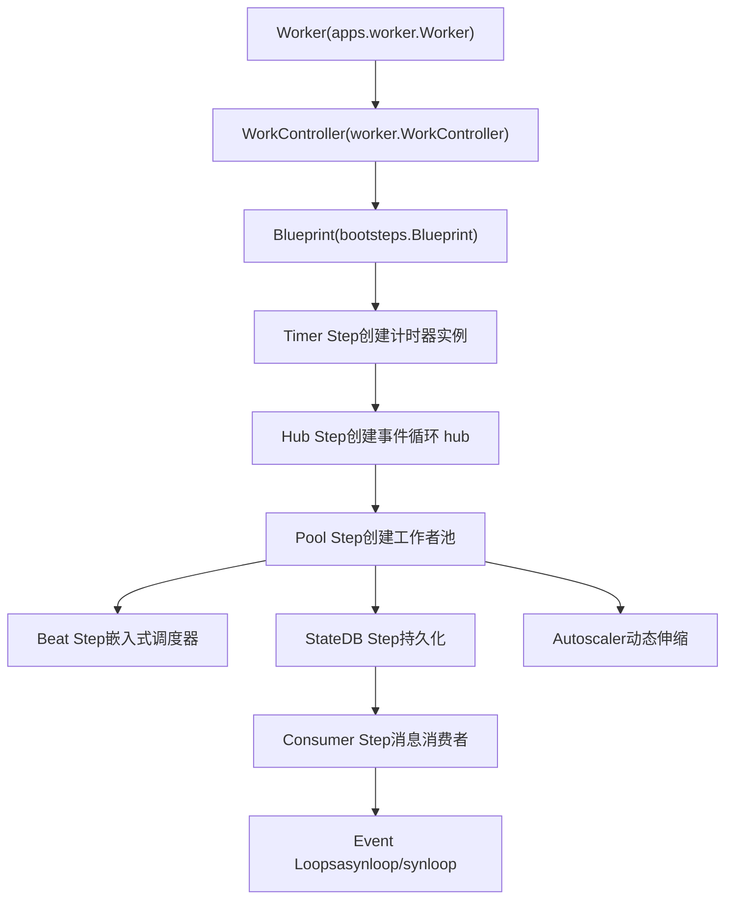
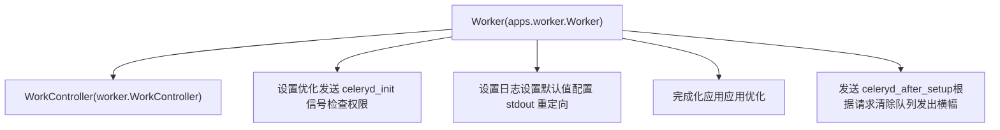
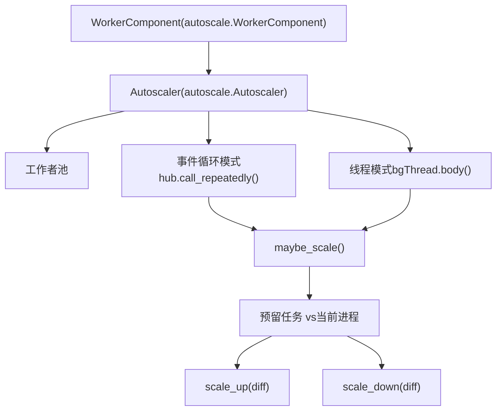

# 工作者 (Workers)

相关源文件

-   [celery/apps/beat.py](https://github.com/celery/celery/blob/4d068b56/celery/apps/beat.py)
-   [celery/apps/worker.py](https://github.com/celery/celery/blob/4d068b56/celery/apps/worker.py)
-   [celery/bootsteps.py](https://github.com/celery/celery/blob/4d068b56/celery/bootsteps.py)
-   [celery/worker/\_\_init\_\_.py](https://github.com/celery/celery/blob/4d068b56/celery/worker/__init__.py)
-   [celery/worker/autoscale.py](https://github.com/celery/celery/blob/4d068b56/celery/worker/autoscale.py)
-   [celery/worker/components.py](https://github.com/celery/celery/blob/4d068b56/celery/worker/components.py)
-   [celery/worker/loops.py](https://github.com/celery/celery/blob/4d068b56/celery/worker/loops.py)

工作者（Workers）是 Celery 的核心执行引擎，负责从消息队列中消费任务并执行它们。本页面记录了工作者系统的架构、生命周期管理、并发模型以及运行时行为。

有关调度周期性任务的信息，请参阅[周期性任务 (Beat)](/celery/celery/7-periodic-tasks-(beat))。有关启动工作者的 CLI 命令详情，请参阅[Worker 与 Beat 命令](/celery/celery/9.2-worker-and-beat-commands)。有关任务执行和状态管理的信息，请参阅[任务 (Tasks)](/celery/celery/3-tasks)。

---

## 概览 (Overview)

Celery 工作者系统围绕一套复杂的 **Bootsteps 框架** 构建，该框架通过有向无环图 (DAG) 管理组件的生命周期。主要组件包括：

-   **工作者应用 (Worker Application)** (`Worker` 类) —— 高层工作者程序接口
-   **WorkController** —— 核心工作者编排与生命周期管理
-   **Blueprint** —— 组件初始化与依赖解析系统
-   **消费者 (Consumer)** —— 消息消费与任务分发
-   **池 (Pool)** —— 任务执行后端 (prefork/eventlet/gevent/solo/threads)
-   **事件循环 (Event Loop)** —— 消息轮询与事件处理 (asynloop/synloop)
-   **自动伸缩器 (Autoscaler)** —— 动态并发调整

来源：[celery/apps/worker.py1-518](https://github.com/celery/celery/blob/4d068b56/celery/apps/worker.py#L1-L518) [celery/worker/\_\_init\_\_.py1-5](https://github.com/celery/celery/blob/4d068b56/celery/worker/__init__.py#L1-L5)

---

## 工作者架构

工作者采用分层架构，其中 Bootsteps 按依赖顺序编排组件初始化：


**图表：工作者组件层级**

依赖链确保了正确的初始化顺序。例如，`Pool` 要求先初始化 `Hub`（而 `Hub` 要求先初始化 `Timer`），而 `Consumer` 总是最后初始化，因为它依赖于所有其他组件。

来源：[celery/worker/components.py1-247](https://github.com/celery/celery/blob/4d068b56/celery/worker/components.py#L1-L247) [celery/bootsteps.py74-263](https://github.com/celery/celery/blob/4d068b56/celery/bootsteps.py#L74-L263)

---

## Bootsteps 框架

Bootsteps 框架通过 `Blueprint` 类实现生命周期管理，负责解析依赖关系并编排组件的初始化、启动和关闭。

### Blueprint 生命周期

> **[Mermaid sequence]**
> *(图表结构无法解析)*

**图表：Blueprint 生命周期阶段**

生命周期由三个阶段组成：

1.  **应用阶段 (Apply Phase)** —— 创建步骤实例，通过拓扑排序解析依赖关系，调用 `include()` 将步骤添加到 `parent.steps`
2.  **启动阶段 (Start Phase)** —— 按依赖顺序对每个步骤调用 `start()`
3.  **停止阶段 (Stop Phase)** —— 按相反顺序对每个步骤调用 `stop()`

来源：[celery/bootsteps.py186-212](https://github.com/celery/celery/blob/4d068b56/celery/bootsteps.py#L186-L212) [celery/bootsteps.py109-117](https://github.com/celery/celery/blob/4d068b56/celery/bootsteps.py#L109-L117) [celery/bootsteps.py155-176](https://github.com/celery/celery/blob/4d068b56/celery/bootsteps.py#L155-L176)

### 步骤类型

| 步骤类型 | 用途 | 方法 |
| --- | --- | --- |
| `Step` | 非服务步骤的基类 | `__init__`, `create`, `include`, `include_if` |
| `StartStopStep` | 需要启动/停止生命周期的步骤 | `start`, `stop`, `close`, `terminate` |
| `ConsumerStep` | 消息消费者 Bootsteps | `get_consumers`, `start`, `stop`, `shutdown` |

`conditional` 标志允许仅在满足特定条件时包含步骤。例如，只有在传递了 `--beat` 参数时才会启用 `Beat` 步骤：

```
class Beat(bootsteps.StartStopStep):
    conditional = True

    def __init__(self, w, beat=False, **kwargs):
        self.enabled = w.beat = beat
```
来源：[celery/bootsteps.py288-353](https://github.com/celery/celery/blob/4d068b56/celery/bootsteps.py#L288-L353) [celery/bootsteps.py355-384](https://github.com/celery/celery/blob/4d068b56/celery/bootsteps.py#L355-L384) [celery/bootsteps.py386-416](https://github.com/celery/celery/blob/4d068b56/celery/bootsteps.py#L386-L416)

---

## 工作者初始化

### 工作者类层级


**图表：工作者初始化钩子**

`Worker` 类（位于 `celery/apps/worker.py`）扩展了 `WorkController`，并为程序级设置提供钩子：

-   **`on_before_init`** —— 在 blueprint 初始化之前调用。设置追踪优化并发送 `celeryd_init` 信号。
-   **`on_after_init`** —— 配置日志记录、stdout 重定向和工作者默认值。
-   **`on_init_blueprint`** —— 完成化应用并应用任务执行优化。
-   **`on_start`** —— 发送 `celeryd_after_setup` 信号，如果请求则清除队列，并发出启动横幅。

来源：[celery/apps/worker.py88-99](https://github.com/celery/celery/blob/4d068b56/celery/apps/worker.py#L88-L99) [celery/apps/worker.py100-114](https://github.com/celery/celery/blob/4d068b56/celery/apps/worker.py#L100-L114) [celery/apps/worker.py116-121](https://github.com/celery/celery/blob/4d068b56/celery/apps/worker.py#L116-L121) [celery/apps/worker.py122-161](https://github.com/celery/celery/blob/4d068b56/celery/apps/worker.py#L122-L161)

### 启动横幅 (Startup Banner)

工作者在启动时会发出详细的横幅，显示其配置：

```
 -------------- celery@hostname v5.x.x
--- ***** -----
-- ******* ---- [config]
- *** --- * --- .> app:         __main__:0x...
- ** ---------- .> transport:   amqp://guest:**@localhost:5672//
- ** ---------- .> results:     redis://localhost:6379/0
- ** ---------- .> concurrency: 4 (prefork)
- ** ---------- .> task events: OFF
- *** --- * ---
-- ******* ---- [queues]
--- ***** ----- .> celery           exchange=celery(direct) key=celery
 --------------
```
该横幅由 `startup_info()` 和 `emit_banner()` 生成：

来源：[celery/apps/worker.py162-173](https://github.com/celery/celery/blob/4d068b56/celery/apps/worker.py#L162-L173) [celery/apps/worker.py206-246](https://github.com/celery/celery/blob/4d068b56/celery/apps/worker.py#L206-L246)

---

## 工作者组件

### Timer 组件

`Timer` bootstep 创建用于调度延迟回调的计时器实例：

```
class Timer(bootsteps.Step):
    def create(self, w):
        if w.use_eventloop:
            # 用于异步事件循环的非阻塞计时器
            w.timer = _Timer(max_interval=10.0)
        else:
            # 池特定的计时器 (例如 eventlet 需要自定义计时器)
            w.timer = self.instantiate(w.timer_cls,
                                       max_interval=w.timer_precision,
                                       on_error=self.on_timer_error,
                                       on_tick=self.on_timer_tick)
```
来源：[celery/worker/components.py32-53](https://github.com/celery/celery/blob/4d068b56/celery/worker/components.py#L32-L53)

### Hub 组件

`Hub` bootstep 初始化异步传输（transports）的事件循环 hub：

```
class Hub(bootsteps.StartStopStep):
    requires = (Timer,)

    def include_if(self, w):
        return w.use_eventloop

    def create(self, w):
        w.hub = get_event_loop()
        if w.hub is None:
            required_hub = getattr(w._conninfo, 'requires_hub', None)
            w.hub = set_event_loop((required_hub if required_hub else _Hub)(w.timer))
        self._patch_thread_primitives(w)
```
只有在启用异步传输（AMQP, Redis）时才会创建 hub。由于事件循环是单线程的，它会使用伪锁（dummy locks）修补线程原语。

来源：[celery/worker/components.py56-99](https://github.com/celery/celery/blob/4d068b56/celery/worker/components.py#L56-L99)

### Pool 组件

`Pool` bootstep 创建用于任务执行的工作者池：

| 配置 | 目的 |
| --- | --- |
| `w.pool_cls` | 池实现 (prefork/eventlet/gevent/solo/threads) |
| `w.min_concurrency` | 工作者进程/线程的数量 |
| `w.max_tasks_per_child` | 每个工作者重启前的任务数（防止内存泄漏） |
| `w.time_limit` | 硬性任务时间限制 |
| `w.soft_time_limit` | 软性任务时间限制（抛出异常） |
| `w.pool_putlocks` | 启用用于线程安全的锁 |

池创建逻辑处理了线程和非线程执行两种情况：

```
threaded = not w.use_eventloop or IS_WINDOWS
if not threaded:
    semaphore = w.semaphore = LaxBoundedSemaphore(procs)
    w._quick_acquire = w.semaphore.acquire
    w._quick_release = w.semaphore.release
```
来源：[celery/worker/components.py101-179](https://github.com/celery/celery/blob/4d068b56/celery/worker/components.py#L101-L179)

### Consumer 组件

`Consumer` bootstep 被标记为 `last = True` 并开始消息消费：

```
class Consumer(bootsteps.StartStopStep):
    last = True

    def create(self, w):
        if w.max_concurrency:
            prefetch_count = max(w.max_concurrency, 1) * w.prefetch_multiplier
        else:
            prefetch_count = w.concurrency * w.prefetch_multiplier
        c = w.consumer = self.instantiate(
            w.consumer_cls, w.process_task,
            hostname=w.hostname,
            task_events=w.task_events,
            initial_prefetch_count=prefetch_count,
            pool=w.pool,
            timer=w.timer,
            app=w.app,
            controller=w,
            hub=w.hub,
            worker_options=w.options,
            disable_rate_limits=w.disable_rate_limits,
            prefetch_multiplier=w.prefetch_multiplier,
        )
```
预取计数 (prefetch count) 控制了从代理中一次获取的消息数量，计算方式为 `concurrency * prefetch_multiplier`。

来源：[celery/worker/components.py221-246](https://github.com/celery/celery/blob/4d068b56/celery/worker/components.py#L221-L246)

---

## 事件循环 (Event Loops)

根据代理传输（broker transport）的能力，工作者会使用两种不同的事件循环实现：

### asynloop (非阻塞)

用于支持异步的传输（AMQP, Redis）。与 Kombu 的事件循环 hub 集成：

```
def asynloop(obj, connection, consumer, blueprint, hub, qos,
             heartbeat, clock, hbrate=2.0):
    """非阻塞事件循环。"""
    on_task_received = obj.create_task_handler()
    heartbeat_error = _enable_amqheartbeats(hub.timer, connection, rate=hbrate)

    consumer.on_message = on_task_received
    obj.controller.register_with_event_loop(hub)
    obj.register_with_event_loop(hub)
    consumer.consume()
    obj.on_ready()

    hub.propagate_errors = errors
    loop = hub.create_loop()

    while blueprint.state == RUN and obj.connection:
        state.maybe_shutdown()
        if heartbeat_error[0] is not None:
            raise heartbeat_error[0]
        if qos.prev != qos.value:
            update_qos()
        try:
            next(loop)
        except StopIteration:
            loop = hub.create_loop()
```
关键特性：

-   使用 `hub.create_loop()` 进行非阻塞事件轮询
-   通过 `_enable_amqheartbeats()` 启用代理心跳 (heartbeats)
-   仅在 QoS 改变时才更新 QoS（预取）
-   通过 `state.maybe_shutdown()` 检查停机信号

来源：[celery/worker/loops.py50-99](https://github.com/celery/celery/blob/4d068b56/celery/worker/loops.py#L50-L99)

### synloop (阻塞)

针对不支持异步 I/O 的阻塞式传输的回退方案：

```
def synloop(obj, connection, consumer, blueprint, hub, qos,
            heartbeat, clock, hbrate=2.0, **kwargs):
    """针对不支持 AIO 的传输的回退阻塞式事件循环。"""
    on_task_received = obj.create_task_handler()
    perform_pending_operations = obj.perform_pending_operations
    heartbeat_error = [None]
    if getattr(obj.pool, 'is_green', False):
        heartbeat_error = _enable_amqheartbeats(obj.timer, connection, rate=hbrate)
    consumer.on_message = on_task_received
    consumer.consume()
    obj.on_ready()

    def _loop_cycle():
        if heartbeat_error[0] is not None:
            raise heartbeat_error[0]
        if qos.prev != qos.value:
            qos.update()
        try:
            perform_pending_operations()
            connection.drain_events(timeout=2.0)
        except socket.timeout:
            pass
        except OSError:
            if blueprint.state == RUN:
                raise

    while blueprint.state == RUN and obj.connection:
        try:
            state.maybe_shutdown()
        finally:
            _loop_cycle()
```
与 asynloop 的主要区别：

-   使用阻塞式的 `connection.drain_events(timeout=2.0)`
-   显式处理套接字超时
-   心跳仅针对绿池（green pools，如 eventlet/gevent）启用

来源：[celery/worker/loops.py101-137](https://github.com/celery/celery/blob/4d068b56/celery/worker/loops.py#L101-L137)

---

## 信号处理与停机

工作者通过信号处理器实现了精密的三级停机系统：

> **[Mermaid stateDiagram]**
> *(图表结构无法解析)*

**图表：工作者停机状态机**

### 信号处理器

| 信号 | 处理器 | 行为 |
| --- | --- | --- |
| `SIGTERM` | `install_worker_term_handler` | 热停机 (Warm shutdown)（等待任务完成） |
| `SIGQUIT` | `install_worker_term_hard_handler` | 冷停机 (Cold shutdown)（在软超时后取消任务） |
| `SIGINT` | `install_worker_int_handler` | 第一次：警告并替换处理器；第二次：冷停机 |
| `SIGHUP` | `install_worker_restart_handler` | 重启工作者（非 macOS 系统） |
| `SIGUSR1` | `install_cry_handler` | 转储堆栈回溯 (stack traces) |
| `SIGUSR2` | `install_rdb_handler` | 远程调试器断点 |

来源：[celery/apps/worker.py282-311](https://github.com/celery/celery/blob/4d068b56/celery/apps/worker.py#L282-L311) [celery/apps/worker.py427-461](https://github.com/celery/celery/blob/4d068b56/celery/apps/worker.py#L427-L461)

### 停机阶段

**1. 热停机 (Warm Shutdown - SIGTERM)**

```
def _shutdown_handler(worker, sig='SIGTERM', how='Warm', ...):
    def _handle_request(*args):
        with in_sighandler():
            if current_process()._name == 'MainProcess':
                if callback:
                    callback(worker)
                safe_say(f'worker: {how} shutdown (MainProcess)')
                signals.worker_shutting_down.send(
                    sender=worker.hostname, sig=sig, how=how, exitcode=exitcode,
                )
            setattr(state, 'should_stop', exitcode)
    platforms.signals[sig] = _handle_request
```
设置 `state.should_stop`，允许当前正在执行的任务完成。

来源：[celery/apps/worker.py282-311](https://github.com/celery/celery/blob/4d068b56/celery/apps/worker.py#L282-L311)

**2. 冷停机 (Cold Shutdown - SIGQUIT)**

```
def on_cold_shutdown(worker):
    # 将 SIGINT/SIGQUIT 处理器替换为 during_soft_shutdown
    install_worker_term_hard_handler(worker, sig='SIGINT', callback=during_soft_shutdown)
    install_worker_term_hard_handler(worker, sig='SIGQUIT', callback=during_soft_shutdown)

    # 等待软停机超时（如果已启用）
    worker.wait_for_soft_shutdown()

    # 停止消费新任务
    if worker.consumer.task_consumer:
        worker.consumer.task_consumer.cancel()

    # 取消所有未确认 (unacked) 的请求
    worker.consumer.cancel_active_requests()

    state.should_terminate = True

    # 停止池以允许成功的任务调用 on_success()
    if worker.consumer.pool:
        worker.consumer.pool.stop()
```
启动软停机超时，然后取消所有活跃任务。设置 `state.should_terminate = True`。

来源：[celery/apps/worker.py363-425](https://github.com/celery/celery/blob/4d068b56/celery/apps/worker.py#L363-L425)

**3. 硬停机 (Hard Shutdown - 多次 SIGQUIT/SIGINT)**

```
def on_hard_shutdown(worker):
    """使用退出码 EX_FAILURE 强制立即终止工作者。"""
    from celery.exceptions import WorkerTerminate
    raise WorkerTerminate(EX_FAILURE)
```
抛出 `WorkerTerminate` 异常以强制立即退出。

来源：[celery/apps/worker.py313-329](https://github.com/celery/celery/blob/4d068b56/celery/apps/worker.py#L313-L329)

### 软停机 (Soft Shutdown)

在冷停机期间，如果配置了软停机，工作者会在取消任务之前等待任务完成：

```
def during_soft_shutdown(worker):
    # 在下次信号时将处理器替换为硬停机
    install_worker_term_hard_handler(worker, sig='SIGINT', callback=on_hard_shutdown, verbose=False)
    install_worker_term_hard_handler(worker, sig='SIGQUIT', callback=on_hard_shutdown)

    # 取消所有未确认的请求
    worker.consumer.cancel_active_requests()

    safe_say('Waiting gracefully for cold shutdown to complete...')
```
来源：[celery/apps/worker.py332-361](https://github.com/celery/celery/blob/4d068b56/celery/apps/worker.py#L332-L361)

---

## 自动伸缩 (Autoscaling)

自动伸缩系统根据负载动态调整工作者池的大小。通过 `--autoscale=MAX,MIN` 启用：


**图表：自动伸缩器架构**

### 自动伸缩器实现

```
class Autoscaler(bgThread):
    def __init__(self, pool, max_concurrency, min_concurrency=0,
                 worker=None, keepalive=AUTOSCALE_KEEPALIVE, mutex=None):
        self.pool = pool
        self.max_concurrency = max_concurrency
        self.min_concurrency = min_concurrency
        self.keepalive = keepalive  # 默认 30 秒
        self._last_scale_up = None

    def maybe_scale(self, req=None):
        if self._maybe_scale(req):
            self.pool.maintain_pool()

    def _maybe_scale(self, req=None):
        procs = self.processes
        cur = min(self.qty, self.max_concurrency)
        if cur > procs:
            self.scale_up(cur - procs)
            return True
        cur = max(self.qty, self.min_concurrency)
        if cur < procs:
            self.scale_down(procs - cur)
            return True
```
关键属性：

-   `qty` —— 预留任务的数量 (`len(state.reserved_requests)`)
-   `processes` —— 当前池大小 (`self.pool.num_processes`)
-   `keepalive` —— 缩减操作之间的最小时间间隔（默认 30 秒）

来源：[celery/worker/autoscale.py61-155](https://github.com/celery/celery/blob/4d068b56/celery/worker/autoscale.py#L61-L155)

### 集成模式

**事件循环集成**（异步池）：

```
class WorkerComponent(bootsteps.StartStopStep):
    def register_with_event_loop(self, w, hub):
        w.consumer.on_task_message.add(w.autoscaler.maybe_scale)
        hub.call_repeatedly(
            w.autoscaler.keepalive, w.autoscaler.maybe_scale,
        )
```
由每个任务消息触发 + 定期 keepalive 检查。

来源：[celery/worker/autoscale.py50-54](https://github.com/celery/celery/blob/4d068b56/celery/worker/autoscale.py#L50-L54)

**后台线程**（阻塞池）：

```
def body(self):
    with self.mutex:
        self.maybe_scale()
    sleep(1.0)
```
在专门的线程中运行，每秒检查一次。

来源：[celery/worker/autoscale.py78-81](https://github.com/celery/celery/blob/4d068b56/celery/worker/autoscale.py#L78-L81)

### 扩容与缩减逻辑

```
def scale_up(self, n):
    self._last_scale_up = monotonic()
    return self._grow(n)

def scale_down(self, n):
    # 仅在上次扩容后经过了 keepalive 周期时才缩减
    if self._last_scale_up and (monotonic() - self._last_scale_up > self.keepalive):
        return self._shrink(n)

def _grow(self, n):
    info('Scaling up %s processes.', n)
    self.pool.grow(n)

def _shrink(self, n):
    info('Scaling down %s processes.', n)
    try:
        self.pool.shrink(n)
    except ValueError:
        debug("Autoscaler won't scale down: all processes busy.")
```
`keepalive` 周期防止了扩容后立即缩减，从而避免了系统抖动。

来源：[celery/worker/autoscale.py111-132](https://github.com/celery/celery/blob/4d068b56/celery/worker/autoscale.py#L111-L132)

---

## 工作者状态管理

工作者在 `celery.worker.state` 中维护全局状态：

| 状态变量 | 用途 |
| --- | --- |
| `should_stop` | 由热停机 (SIGTERM) 设置 |
| `should_terminate` | 由冷停机 (SIGQUIT) 设置 |
| `reserved_requests` | 当前预留/执行中的任务集合 |
| `active_requests` | `reserved_requests` 的已弃用别名 |
| `total_count` | 此工作者执行的任务总数 |

事件循环会检查这些标志：

```
while blueprint.state == RUN and obj.connection:
    state.maybe_shutdown()  # 检查 should_stop/should_terminate
    # ... 处理事件
```
来源：[celery/worker/loops.py84-85](https://github.com/celery/celery/blob/4d068b56/celery/worker/loops.py#L84-L85) [celery/worker/loops.py132-134](https://github.com/celery/celery/blob/4d068b56/celery/worker/loops.py#L132-L134)

---

## 工作者配置摘要

| 配置项 | 默认值 | 目的 |
| --- | --- | --- |
| `worker_concurrency` | CPU 核心数 | 工作者进程/线程的数量 |
| `worker_prefetch_multiplier` | 4 | 预取的消息数 (concurrency \* multiplier) |
| `worker_max_tasks_per_child` | None | 重启前每个工作者的任务数 |
| `worker_max_memory_per_child` | None | 重启前工作者的内存限制 (KB) |
| `worker_lost_wait` | 10.0 | 等待丢失工作者的秒数 |
| `worker_disable_rate_limits` | False | 禁用任务速率限制 |
| `worker_pool` | 'prefork' | 池实现 (prefork/eventlet/gevent/solo/threads) |
| `worker_pool_putlocks` | True | 启用池 putlocks |
| `worker_pool_restarts` | True | 失败时启用池重启 |
| `worker_autoscaler` | 'celery.worker.autoscale:Autoscaler' | 自动伸缩器类 |
| `worker_timer_precision` | 1.0 | 计时器刻度精度（秒） |
| `worker_redirect_stdouts` | True | 将 stdout/stderr 重定向到日志 |
| `worker_redirect_stdouts_level` | 'WARNING' | 重定向输出的日志级别 |

来源：[celery/worker/components.py101-179](https://github.com/celery/celery/blob/4d068b56/celery/worker/components.py#L101-L179) [celery/worker/components.py221-246](https://github.com/celery/celery/blob/4d068b56/celery/worker/components.py#L221-L246)

---

## 平台调整 (Platform Tweaks)

工作者会安装特定于平台的处理器和权宜之计：

```
def install_platform_tweaks(self, worker):
    if self.app.IS_macOS:
        self.macOS_proxy_detection_workaround()

    if not self._isatty:
        if self.app.IS_macOS:
            # macOS 无法从使用线程的进程执行 exec
            install_HUP_not_supported_handler(worker)
        else:
            install_worker_restart_handler(worker)

    install_worker_term_handler(worker)
    install_worker_term_hard_handler(worker)
    install_worker_int_handler(worker)
    install_cry_handler()  # SIGUSR1 - 转储堆栈回溯
    install_rdb_handler()  # SIGUSR2 - 远程调试器
```
**macOS 代理检测权宜之计**：

```
def macOS_proxy_detection_workaround(self):
    os.environ.setdefault('celery_dummy_proxy', 'set_by_celeryd')
```
此方法解决了 macOS 代理检测的问题。

来源：[celery/apps/worker.py248-268](https://github.com/celery/celery/blob/4d068b56/celery/apps/worker.py#L248-L268) [celery/apps/worker.py270-272](https://github.com/celery/celery/blob/4d068b56/celery/apps/worker.py#L270-L272)

---

## 工作者进程标题

工作者设置进程标题，以便在进程列表中轻松识别：

```
def set_process_status(self, info):
    return platforms.set_mp_process_title(
        'celeryd',
        info=f'{info} ({platforms.strargv(sys.argv)})',
        hostname=self.hostname,
    )
```
进程标题格式：`celeryd: <hostname> <info> (args)`

示例：`celeryd: celery@worker1 -active- (celery worker -l info)`

来源：[celery/apps/worker.py274-279](https://github.com/celery/celery/blob/4d068b56/celery/apps/worker.py#L274-L279)
