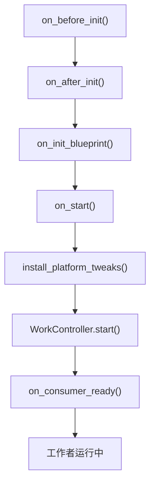
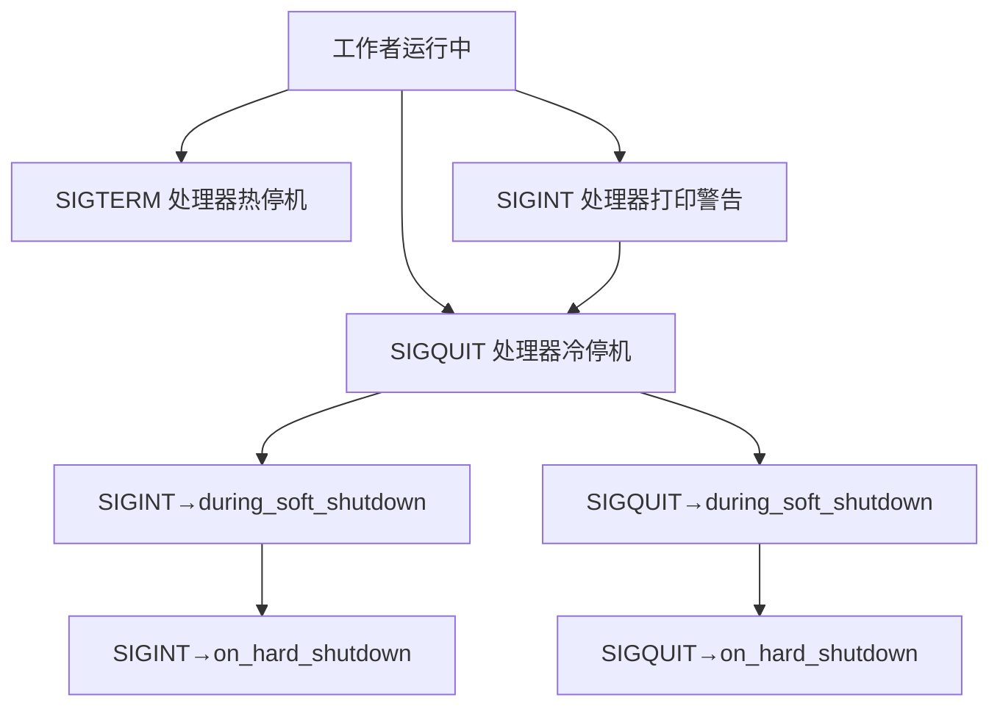

# 工作者生命周期与停机

相关源文件

-   [celery/apps/beat.py](https://github.com/celery/celery/blob/4d068b56/celery/apps/beat.py)
-   [celery/apps/worker.py](https://github.com/celery/celery/blob/4d068b56/celery/apps/worker.py)
-   [celery/bootsteps.py](https://github.com/celery/celery/blob/4d068b56/celery/bootsteps.py)
-   [celery/worker/__init__.py](https://github.com/celery/celery/blob/4d068b56/celery/worker/__init__.py)
-   [celery/worker/autoscale.py](https://github.com/celery/celery/blob/4d068b56/celery/worker/autoscale.py)
-   [celery/worker/components.py](https://github.com/celery/celery/blob/4d068b56/celery/worker/components.py)
-   [celery/worker/loops.py](https://github.com/celery/celery/blob/4d068b56/celery/worker/loops.py)

本文件描述了 Celery 工作者进程从启动到停机的生命周期，包括初始化序列、信号处理机制以及各种停机模式。有关内部工作者架构和组件系统的信息，请参阅[工作者架构与 Bootsteps](/celery/celery/5.1-worker-architecture-and-bootsteps)。有关并发模型的详细信息，请参阅[并发模型](/celery/celery/5.3-concurrency-models)。有关工作者配置，请参阅[工作者配置与控制](/celery/celery/5.4-worker-configuration-and-control)。

## 概览 (Overview)

Celery 工作者 (`Worker` 类) 是一个长期运行的进程，负责接收并执行来自消息代理（message broker）的任务。工作者生命周期由三个主要阶段组成：

1.  **启动 (Startup)**：通过 bootstep 系统初始化组件
2.  **运行 (Operation)**：持续的消息消费与任务执行
3.  **停机 (Shutdown)**：带有多种模式的优雅或强制终止

工作者支持多种停机模式，以处理不同的运维需求，从优雅完成正在运行的任务到立即终止。

来源：[celery/apps/worker.py1-518](https://github.com/celery/celery/blob/4d068b56/celery/apps/worker.py#L1-L518)

## 工作者启动生命周期

### 初始化序列

工作者启动遵循由 `Worker` 类（扩展自 `WorkController`）管理的结构化序列：

> **[Mermaid sequence]**
> *(图表结构无法解析)*

来源：[celery/apps/worker.py85-191](https://github.com/celery/celery/blob/4d068b56/celery/apps/worker.py#L85-L191)

### 信号处理器安装

在 `install_platform_tweaks()` 期间，工作者安装特定平台的信号处理器：

| 信号 | 处理器函数 | 目的 |
| --- | --- | --- |
| SIGTERM | `install_worker_term_handler` | 热停机或冷停机（可配置） |
| SIGINT | `install_worker_int_handler` | 初始处理器，转换为冷停机 |
| SIGQUIT | `install_worker_term_hard_handler` | 冷停机 |
| SIGHUP | `install_worker_restart_handler` | 工作者重启（非 macOS） |
| SIGUSR1 | `install_cry_handler` | 堆栈回溯转储 |
| SIGUSR2 | `install_rdb_handler` | 远程调试器断点 |

来源：[celery/apps/worker.py248-268](https://github.com/celery/celery/blob/4d068b56/celery/apps/worker.py#L248-L268) [celery/apps/worker.py428-518](https://github.com/celery/celery/blob/4d068b56/celery/apps/worker.py#L428-L518)

### 启动钩子 (Startup Hooks)

工作者提供了几个在特定点执行的初始化钩子：


来源：[celery/apps/worker.py88-176](https://github.com/celery/celery/blob/4d068b56/celery/apps/worker.py#L88-L176)

## 停机模式 (Shutdown Modes)

工作者支持四种不同的停机模式，每种模式在任务完成方面的行为各不相同：

### 停机模式对比

| 模式 | 信号 | 任务完成情况 | 重新入队行为 | 使用场景 |
| --- | --- | --- | --- | --- |
| **热停机 (Warm)** | SIGTERM | 等待所有任务完成 | 不重新入队 | 优雅的部署更新 |
| **软停机 (Soft)** | N/A (自动) | 带有超时的等待 | 超时后重新入队 | 具有可见性超时的代理 |
| **冷停机 (Cold)** | SIGQUIT | 取消所有任务 | 立即重新入队 | 带有清理的强制停止 |
| **硬停机 (Hard)** | 多次 SIGINT/SIGQUIT | 立即杀死 | 无清理 | 紧急终止 |

来源：[celery/apps/worker.py282-444](https://github.com/celery/celery/blob/4d068b56/celery/apps/worker.py#L282-L444)

### 热停机 (Warm Shutdown)

热停机允许所有当前正在执行的任务在工作者终止前完成。工作者停止接受新任务，但会无限期等待正在运行的任务完成。

**触发方式**：SIGTERM（默认行为）

**行为**：

1.  设置 `state.should_stop = True`
2.  停止从代理接受新任务
3.  等待所有运行中的任务完成
4.  以状态码 `EX_OK` 干净退出

> **[Mermaid stateDiagram]**
> *(图表结构无法解析)*

来源：[celery/apps/worker.py282-310](https://github.com/celery/celery/blob/4d068b56/celery/apps/worker.py#L282-L310) [celery/apps/worker.py428-436](https://github.com/celery/celery/blob/4d068b56/celery/apps/worker.py#L428-L436)

### 冷停机 (Cold Shutdown)

冷停机会立即取消所有运行中的任务并终止工作者。任务将被重新入队到代理，以便由其他工作者重试。

**触发方式**：SIGQUIT 或 SIGINT（在第一次 SIGINT 之后）

**行为**：

1.  等待软停机超时（如果已启用）
2.  取消所有未确认的请求
3.  设置 `state.should_terminate = True`
4.  停止池
5.  以状态码 `EX_FAILURE` 退出

> **[Mermaid stateDiagram]**
> *(图表结构无法解析)*

来源：[celery/apps/worker.py363-425](https://github.com/celery/celery/blob/4d068b56/celery/apps/worker.py#L363-L425) [celery/apps/worker.py438-444](https://github.com/celery/celery/blob/4d068b56/celery/apps/worker.py#L438-L444)

### 软停机 (Soft Shutdown)

软停机是在冷停机之前自动发生的限时热停机。它在强制取消之前为任务完成提供了一个缓冲期。

**配置**：

-   `worker_soft_shutdown_timeout`：持续时间（秒，默认值：`0.0`，已禁用）
-   `worker_enable_soft_shutdown_on_idle`：在空闲时也启用（默认值：`False`）

**行为**：

1.  在冷停机之前自动启动
2.  等待最多 `worker_soft_shutdown_timeout` 秒
3.  如果超时已过，继续执行冷停机
4.  如果所有任务在超时内完成，则干净退出

该机制对于具有可见性超时 (visibility timeouts) 的代理（Redis, SQS）特别有用，可以使任务在可见性超时到期之前被正确重新入队。

来源：[celery/apps/worker.py409-410](https://github.com/celery/celery/blob/4d068b56/celery/apps/worker.py#L409-L410) [Changelog.rst414-439](https://github.com/celery/celery/blob/4d068b56/Changelog.rst#L414-L439)

### 硬停机 (Hard Shutdown)

硬停机会立即强制终止工作者，而不进行任何清理。这是针对卡住的工作者的最后手段。

**触发方式**：停机期间多次发送 SIGINT 或 SIGQUIT 信号

**行为**：

1.  抛出带有 `EX_FAILURE` 的 `WorkerTerminate` 异常
2.  立即终止进程
3.  不进行任务清理或重新入队
4.  可能会使任务处于不一致状态

> **[Mermaid stateDiagram]**
> *(图表结构无法解析)*

来源：[celery/apps/worker.py313-329](https://github.com/celery/celery/blob/4d068b56/celery/apps/worker.py#L313-L329) [celery/apps/worker.py349-350](https://github.com/celery/celery/blob/4d068b56/celery/apps/worker.py#L349-L350)

## 信号处理实现

### 信号处理器架构

信号处理系统使用状态机模式来处理多个信号并在停机模式之间转换：


来源：[celery/apps/worker.py282-461](https://github.com/celery/celery/blob/4d068b56/celery/apps/worker.py#L282-L461)

### SIGINT 递进过程

SIGINT (Ctrl+C) 处理器实现了三阶段递进：

**阶段 1 —— 第一次 SIGINT (`on_SIGINT`)**：

-   打印警告："再次按下 Ctrl+C 将启动冷停机"
-   将 SIGINT 处理器替换为冷停机处理器
-   继续运行

**阶段 2 —— 第二次 SIGINT (`on_cold_shutdown`)**：

-   打印警告："再次按下 Ctrl+C 将终止所有运行中的任务"
-   将 SIGINT/SIGQUIT 处理器替换为 `during_soft_shutdown`
-   启动软停机（如果已启用）
-   在超时后取消所有任务
-   将处理器替换为 `on_hard_shutdown`

**阶段 3 —— 第三次 SIGINT (`on_hard_shutdown`)**：

-   抛出 `WorkerTerminate` 异常
-   立即终止进程

来源：[celery/apps/worker.py447-461](https://github.com/celery/celery/blob/4d068b56/celery/apps/worker.py#L447-L461) [celery/apps/worker.py363-425](https://github.com/celery/celery/blob/4d068b56/celery/apps/worker.py#L363-L425) [celery/apps/worker.py313-329](https://github.com/celery/celery/blob/4d068b56/celery/apps/worker.py#L313-L329)

### REMAP_SIGTERM 特性

`REMAP_SIGTERM` 环境变量允许将 SIGTERM 重新映射为表现得像 SIGQUIT，从而通过 SIGTERM 启用冷停机而不是热停机。

**配置**：

```
export REMAP_SIGTERM="SIGQUIT"
```
**效果**：

-   SIGTERM 触发冷停机而不是热停机
-   在 SIGTERM 是标准信号的容器化环境中非常有用
-   允许通过容器编排器使用软停机机制

**实现**：

```
# 当 REMAP_SIGTERM="SIGQUIT" 时
install_worker_term_handler = partial(
    _shutdown_handler, sig='SIGTERM', how='Cold',
    callback=on_cold_shutdown, exitcode=EX_FAILURE,
)
```
来源：[celery/apps/worker.py428-436](https://github.com/celery/celery/blob/4d068b56/celery/apps/worker.py#L428-L436) [docs/history/changelog-5.5.rst251-271](https://github.com/celery/celery/blob/4d068b56/docs/history/changelog-5.5.rst#L251-L271)

## 停机流细节

### 热停机处理器 (Warm Shutdown Handler)

`_shutdown_handler` 函数是热停机的基础实现：

> **[Mermaid sequence]**
> *(图表结构无法解析)*

来源：[celery/apps/worker.py282-310](https://github.com/celery/celery/blob/4d068b56/celery/apps/worker.py#L282-L310)

### 冷停机处理器 (Cold Shutdown Handler)

`on_cold_shutdown` 函数实现了完整的冷停机序列：

> **[Mermaid sequence]**
> *(图表结构无法解析)*

来源：[celery/apps/worker.py363-425](https://github.com/celery/celery/blob/4d068b56/celery/apps/worker.py#L363-L425)

### 冷停机期间的软停机

`during_soft_shutdown` 处理器管理过渡期：

> **[Mermaid stateDiagram]**
> *(图表结构无法解析)*

`during_soft_shutdown` 函数：

1.  将 SIGINT/SIGQUIT 处理器替换为 `on_hard_shutdown`
2.  取消所有未确认的请求
3.  打印消息："正在优雅等待冷停机完成"
4.  返回以允许软停机超时继续

来源：[celery/apps/worker.py332-361](https://github.com/celery/celery/blob/4d068b56/celery/apps/worker.py#L332-L361)

## 特定平台的行为

### macOS 处理

在 macOS 上，由于线程限制，不支持通过 SIGHUP 重启工作者：

```
if self.app.IS_macOS:
    # macOS 无法从使用线程的进程执行 exec
    install_HUP_not_supported_handler(worker)
else:
    install_worker_restart_handler(worker)
```
`install_HUP_not_supported_handler` 会显示警告而不是重启。

来源：[celery/apps/worker.py258-263](https://github.com/celery/celery/blob/4d068b56/celery/apps/worker.py#L258-L263)

### Jython 处理

在 Jython 上，禁用了 SIGQUIT 和 SIGINT 处理器：

```
if not is_jython:
    install_worker_term_hard_handler = partial(
        _shutdown_handler, sig='SIGQUIT', how='Cold',
        callback=on_cold_shutdown, exitcode=EX_FAILURE,
    )
else:
    install_worker_term_handler = \
        install_worker_term_hard_handler = lambda *a, **kw: None
```
来源：[celery/apps/worker.py438-444](https://github.com/celery/celery/blob/4d068b56/celery/apps/worker.py#L438-L444)

## 状态管理

### 工作者状态模块

工作者在 `celery.worker.state` 中维护全局状态标志：

| 状态变量 | 类型 | 目的 |
| --- | --- | --- |
| `should_stop` | int/None | 热停机信号，包含退出码 |
| `should_terminate` | int/None | 冷停机信号，包含退出码 |

工作者的主循环和组件生命周期方法会检查这些标志，以确定何时以及如何停机。

来源：[celery/apps/worker.py307-308](https://github.com/celery/celery/blob/4d068b56/celery/apps/worker.py#L307-L308) [celery/apps/worker.py420](https://github.com/celery/celery/blob/4d068b56/celery/apps/worker.py#L420-L420)

### 信号处理器上下文 (Signal Handler Context)

所有信号处理器都在 `in_sighandler()` 上下文管理器内执行，以设置正确的状态：

```
def _handle_request(*args):
    with in_sighandler():
        # 处理器实现
        ...
```
这确保了在信号处理期间正确的日志记录和状态追踪。

来源：[celery/apps/worker.py296](https://github.com/celery/celery/blob/4d068b56/celery/apps/worker.py#L296-L296)

## 配置选项

### 软停机配置

| 设置项 | 类型 | 默认值 | 描述 |
| --- | --- | --- | --- |
| `worker_soft_shutdown_timeout` | float | 0.0 | 冷停机前等待的秒数 |
| `worker_enable_soft_shutdown_on_idle` | bool | False | 在空闲时也启用软停机 |

配置示例：

```
app.conf.worker_soft_shutdown_timeout = 30.0
app.conf.worker_enable_soft_shutdown_on_idle = True
```
来源：[Changelog.rst414-439](https://github.com/celery/celery/blob/4d068b56/Changelog.rst#L414-L439)

### 停机相关设置

| 设置项 | 类型 | 默认值 | 描述 |
| --- | --- | --- | --- |
| `worker_redirect_stdouts` | bool | True | 重定向 stdout/stderr |
| `worker_redirect_stdouts_level` | str | 'WARNING' | 重定向输出的日志级别 |

来源：[celery/apps/worker.py103-106](https://github.com/celery/celery/blob/4d068b56/celery/apps/worker.py#L103-L106)

## 最佳实践

### 部署考量

1.  **使用 SIGTERM 进行优雅的部署更新**：允许任务自然完成。
2.  **为具有可见性超时的代理配置软停机**：防止在 Redis/SQS 中丢失任务。
3.  **设置合适的软停机超时**：应小于可见性超时。
4.  **在容器中使用 REMAP_SIGTERM**：符合容器编排器的预期。
5.  **避免使用 SIGKILL**：始终允许至少完成冷停机，以便进行适当的清理。

### 信号流示例 (Signal Flow Example)

**带有软停机的容器化部署**：

```
# 配置容器
export REMAP_SIGTERM="SIGQUIT"

# 在应用配置中
app.conf.worker_soft_shutdown_timeout = 25.0  # 小于 30 秒的可见性超时
app.conf.broker_transport_options = {'visibility_timeout': 30}
```
**停机序列**：

1.  容器发送 SIGTERM（被映射为 SIGQUIT）
2.  工作者进入冷停机模式
3.  软停机等待最多 25 秒
4.  任务完成或被取消
5.  任务以 30 秒的可见性超时重新入队
6.  工作者干净退出

来源：[docs/history/changelog-5.5.rst142-168](https://github.com/celery/celery/blob/4d068b56/docs/history/changelog-5.5.rst#L142-L168)

## 故障排除

### 工作者无法停机

**症状**：工作者忽略停机信号

**常见原因**：

1.  任务包含无限循环或阻塞 I/O
2.  信号处理器未安装（罕见）
3.  池工作者 (pool worker) 卡住

**解决方案**：发送 SIGQUIT 进行冷停机，如果需要则再次发送 SIGQUIT 进行硬停机。

### 停机期间丢失任务

**症状**：任务在工作者重启期间消失

**常见原因**：

1.  在没有可见性超时的情况下使用冷停机
2.  软停机超时太短
3.  在具有可见性超时的代理上使用热停机

**解决方案**：为具有可见性超时的代理配置带有合适超时的软停机。

### 任务清理不完整

**症状**：工作者停机后任务仍处于 "started" 状态

**常见原因**：

1.  使用了硬停机（多次发送信号）
2.  停机期间未更新结果后端

**解决方案**：避免使用硬停机；应改用冷停机。

来源：[celery/apps/worker.py282-518](https://github.com/celery/celery/blob/4d068b56/celery/apps/worker.py#L282-L518)
