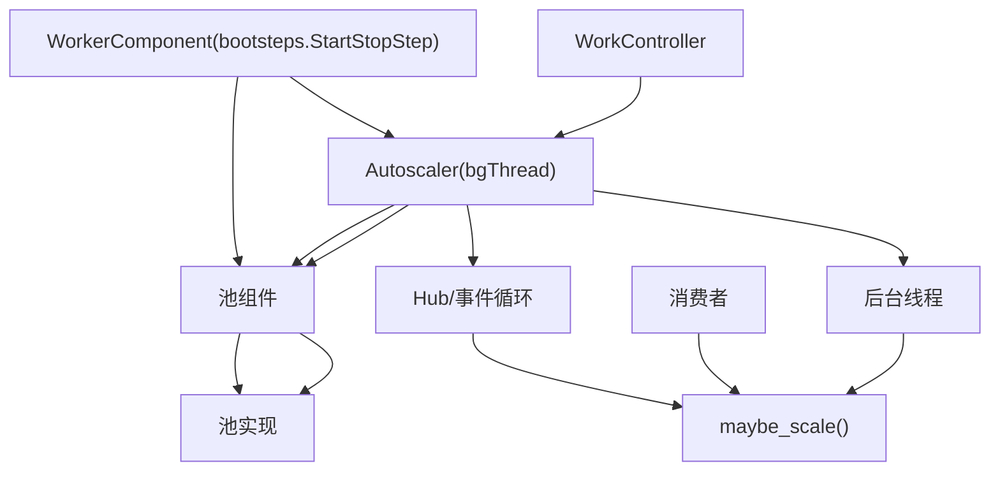
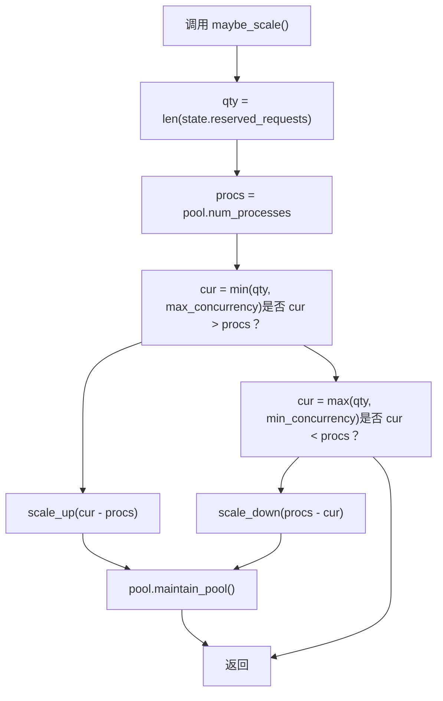
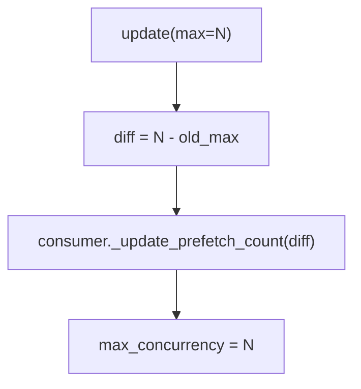

# 自动伸缩 (Autoscaling)

相关源文件

-   [celery/bootsteps.py](https://github.com/celery/celery/blob/4d068b56/celery/bootsteps.py)
-   [celery/worker/autoscale.py](https://github.com/celery/celery/blob/4d068b56/celery/worker/autoscale.py)
-   [celery/worker/components.py](https://github.com/celery/celery/blob/4d068b56/celery/worker/components.py)
-   [celery/worker/loops.py](https://github.com/celery/celery/blob/4d068b56/celery/worker/loops.py)

## 目的与范围

本文件描述了 Celery 的自动伸缩系统，该系统根据需求动态调整工作者池（worker pool）的大小。自动伸缩器监控预留任务的数量，并在配置的范围内扩容或缩减池规模，以优化资源利用率。

有关通用工作者架构和 bootsteps 系统，请参阅[工作者架构与 Bootsteps](/celery/celery/5.1-worker-architecture-and-bootsteps)。有关池实现和并发模型，请参阅[并发模型](/celery/celery/5.3-concurrency-models)。有关消费者行为和预取管理，请参阅[消费者行为](/celery/celery/5.5-consumer-and-event-loops)。

## 概览 (Overview)

自动伸缩器是一个工作者组件，负责监控任务需求并自动增加或缩小执行池以匹配工作负载。它在用户定义的 `min_concurrency`（最小并发数）和 `max_concurrency`（最大并发数）范围内运行，当有任务等待时扩容，当池未被充分利用时缩减。

自动伸缩器根据工作者的并发模型，作为后台线程运行或与事件循环集成。它包含一个 keepalive 周期，以防止可能导致不稳定的频繁缩减操作。

**关键特性：**

-   根据预留任务计数动态调整池大小
-   可配置的最小/最大并发范围
-   keepalive 延迟以防止系统抖动
-   自动调整预取计数 (prefetch count)
-   集成了线程化和异步两种工作者模式

来源：[celery/worker/autoscale.py1-10](https://github.com/celery/celery/blob/4d068b56/celery/worker/autoscale.py#L1-L10)

## 架构

### 组件层级


来源：[celery/worker/autoscale.py31-59](https://github.com/celery/celery/blob/4d068b56/celery/worker/autoscale.py#L31-L59) [celery/worker/components.py98-126](https://github.com/celery/celery/blob/4d068b56/celery/worker/components.py#L98-L126)

### 类结构


`WorkerComponent` 是一个 bootstep，负责将自动伸缩器集成到工作者生命周期中。它是有条件的，即仅在通过 `--autoscale` 选项启用自动伸缩时才运行。该组件创建一个 `Autoscaler` 实例并将其注册到事件循环中，或者将其作为后台线程运行。

`Autoscaler` 类扩展了 `bgThread` 并实现了实际的伸缩逻辑。它维护对池、伸缩范围以及时间信息的引用。

来源：[celery/worker/autoscale.py31-59](https://github.com/celery/celery/blob/4d068b56/celery/worker/autoscale.py#L31-L59) [celery/worker/autoscale.py61-155](https://github.com/celery/celery/blob/4d068b56/celery/worker/autoscale.py#L61-L155)

## 伸缩算法

### 需求计算

自动伸缩器通过检查 `state.reserved_requests` 来确定需求，该属性追踪已接收但尚未开始的任务。伸缩决策基于将此需求与当前池大小进行比较：


**扩容逻辑：**

1.  计算目标值：`cur = min(qty, max_concurrency)`
2.  如果 `cur > procs`，则增加 `cur - procs` 个进程
3.  在 `_last_scale_up` 中记录时间戳

**缩减逻辑：**

1.  计算目标值：`cur = max(qty, min_concurrency)`
2.  如果 `cur < procs` 且 keepalive 周期已过，则缩减 `procs - cur` 个进程
3.  Keepalive 检查：`monotonic() - _last_scale_up > keepalive`

来源：[celery/worker/autoscale.py83-96](https://github.com/celery/celery/blob/4d068b56/celery/worker/autoscale.py#L83-L96) [celery/worker/autoscale.py111-131](https://github.com/celery/celery/blob/4d068b56/celery/worker/autoscale.py#L111-L131)

### Keepalive 保护

keepalive 机制防止了可能导致不稳定的快速缩减循环。默认 keepalive 为 30 秒，可通过 `AUTOSCALE_KEEPALIVE` 环境变量进行配置。

> **[Mermaid sequence]**
> *(图表结构无法解析)*

这确保了在扩容后，自动伸缩器会在 keepalive 期间内等待，然后再进行缩减，从而给系统留出稳定并利用额外容量的时间。

来源：[celery/worker/autoscale.py28](https://github.com/celery/celery/blob/4d068b56/celery/worker/autoscale.py#L28-L28) [celery/worker/autoscale.py115-118](https://github.com/celery/celery/blob/4d068b56/celery/worker/autoscale.py#L115-L118)

## 配置与用法

### 启用自动伸缩

在启动工作者时通过 `--autoscale` 命令行选项启用自动伸缩：

```
celery worker --autoscale=MAX,MIN
```
其中：

-   `MAX`：池进程的最大数量
-   `MIN`：池进程的最小数量（可选，默认为 0）

示例：

```
# 在 10 到 3 个进程之间伸缩
celery worker --autoscale=10,3

# 最高扩容至 10 个，最低缩减至 0 个
celery worker --autoscale=10
```
autoscale 参数在 `Pool` 组件的 `__init__` 方法中进行解析：

来源：[celery/worker/components.py114-125](https://github.com/celery/celery/blob/4d068b56/celery/worker/components.py#L114-L125)

### 配置参数

| 参数 | 类型 | 默认值 | 描述 |
| --- | --- | --- | --- |
| `max_concurrency` | int | 必需 | 最大池大小 |
| `min_concurrency` | int | 0 | 最小池大小 |
| `keepalive` | float | 30.0 | 缩减前的等待秒数 |
| `prefetch_multiplier` | int | 4 | 每个工作者预取的任务数 |

`AUTOSCALE_KEEPALIVE` 环境变量会覆盖默认的 keepalive 持续时间：

```
AUTOSCALE_KEEPALIVE = float(os.environ.get('AUTOSCALE_KEEPALIVE', 30))
```
来源：[celery/worker/autoscale.py28](https://github.com/celery/celery/blob/4d068b56/celery/worker/autoscale.py#L28-L28) [celery/worker/autoscale.py64-76](https://github.com/celery/celery/blob/4d068b56/celery/worker/autoscale.py#L64-L76)

### 运行时更新

自动伸缩器支持通过 `update()` 方法在运行时更新伸缩范围：

```
# 将 max_concurrency 更新为 20
autoscaler.update(max=20)

# 将 min_concurrency 更新为 5
autoscaler.update(min=5)

# 同时更新两者
autoscaler.update(max=20, min=5)
```
当范围更新时：

1.  如果新的最大值 < 当前进程数，立即进行缩减。
2.  如果新的最小值 > 当前进程数，立即进行扩容。
3.  消费者预取计数被更新以匹配新的最大值。

来源：[celery/worker/autoscale.py98-109](https://github.com/celery/celery/blob/4d068b56/celery/worker/autoscale.py#L98-L109)

## 与工作者生命周期集成

### 初始化序列

> **[Mermaid sequence]**
> *(图表结构无法解析)*

自动伸缩器根据 `w.autoscale` 属性条件性地启用，该属性由 `Pool` 组件在工作者初始化期间设置。

来源：[celery/worker/components.py114-125](https://github.com/celery/celery/blob/4d068b56/celery/worker/components.py#L114-L125) [celery/worker/autoscale.py38-48](https://github.com/celery/celery/blob/4d068b56/celery/worker/autoscale.py#L38-L48)

### 事件循环模式 vs 线程模式

自动伸缩器根据工作者的配置以两种模式运行：

**事件循环模式 (Event Loop Mode)**（当 `w.use_eventloop == True` 时）：

-   不创建后台线程。
-   `hub.call_repeatedly()` 每隔 `keepalive` 秒调用一次 `maybe_scale()`。
-   `consumer.on_task_message` 信号在收到任务时触发 `maybe_scale()`。
-   互斥锁使用 `DummyLock`（无需真正的锁定）。

**线程模式 (Threaded Mode)**（当 `w.use_eventloop == False` 时）：

-   创建后台线程，继承自 `bgThread`。
-   `body()` 方法在循环中运行：获取互斥锁，调用 `maybe_scale()`，休眠 1 秒。
-   互斥锁使用真正的 `threading.Lock`。
-   线程在工作者停机期间停止。

来源：[celery/worker/autoscale.py42-48](https://github.com/celery/celery/blob/4d068b56/celery/worker/autoscale.py#L42-L48) [celery/worker/autoscale.py50-54](https://github.com/celery/celery/blob/4d068b56/celery/worker/autoscale.py#L50-L54) [celery/worker/autoscale.py78-81](https://github.com/celery/celery/blob/4d068b56/celery/worker/autoscale.py#L78-L81)

### 预取计数协调

当自动伸缩器更改 `max_concurrency` 时，它必须更新消费者的预取计数以确保正确的消息流：


预取计数计算如下：

```
prefetch_count = max_concurrency * prefetch_multiplier
```
当最大并发数改变时，增量值被应用于消费者的当前预取计数，从而确保代理交付合适数量的消息。

来源：[celery/worker/autoscale.py133-138](https://github.com/celery/celery/blob/4d068b56/celery/worker/autoscale.py#L133-L138) [celery/worker/components.py221-224](https://github.com/celery/celery/blob/4d068b56/celery/worker/components.py#L221-L224)

## 错误处理

自动伸缩器包含了针对池操作的防御性错误处理：

### 缩减失败

当调用 `pool.shrink(n)` 时，会捕获两类错误：

1.  **ValueError**：当所有进程都繁忙且无法终止时抛出。

    -   记录为调试消息："Autoscaler won't scale down: all processes busy."
    -   跳过缩减操作。
2.  **通用异常 (General Exception)**：缩减期间的任何其他错误。

    -   记录为带有完整回溯的错误。
    -   继续运行而不传播错误。

```
try:
    self.pool.shrink(n)
except ValueError:
    debug("Autoscaler won't scale down: all processes busy.")
except Exception as exc:
    error('Autoscaler: scale_down: %r', exc, exc_info=True)
```
来源：[celery/worker/autoscale.py124-131](https://github.com/celery/celery/blob/4d068b56/celery/worker/autoscale.py#L124-L131)

### 状态访问

自动伸缩器访问 `state.reserved_requests` 以确定当前需求。这是由工作者维护的模块级数据结构，用于追踪已预留但尚未执行的任务。

来源：[celery/worker/autoscale.py20](https://github.com/celery/celery/blob/4d068b56/celery/worker/autoscale.py#L20-L20) [celery/worker/autoscale.py149-150](https://github.com/celery/celery/blob/4d068b56/celery/worker/autoscale.py#L149-L150)

## 监控与内省

自动伸缩器通过 `info()` 方法暴露当前状态，该方法返回一个包含以下字段的字典：

| 字段 | 描述 |
| --- | --- |
| `max` | 当前 max\_concurrency 设置 |
| `min` | 当前 min\_concurrency 设置 |
| `current` | 实际的池进程数量 |
| `qty` | 预留任务的数量（需求） |

通过远程控制命令或检查工具查询时，此信息包含在工作者的组件信息中。

来源：[celery/worker/autoscale.py140-146](https://github.com/celery/celery/blob/4d068b56/celery/worker/autoscale.py#L140-L146) [celery/worker/autoscale.py56-58](https://github.com/celery/celery/blob/4d068b56/celery/worker/autoscale.py#L56-L58)

## 实现细节

### 后台线程执行

在以线程模式运行时，`body()` 方法实现了主循环：

```
def body(self):
    with self.mutex:
        self.maybe_scale()
    sleep(1.0)
```
该方法：

1.  获取互斥锁。
2.  检查是否需要伸缩。
3.  释放锁。
4.  在重复前休眠 1 秒。

互斥锁防止了可能损坏池状态的并发伸缩操作。

来源：[celery/worker/autoscale.py78-81](https://github.com/celery/celery/blob/4d068b56/celery/worker/autoscale.py#L78-L81)

### 池接口 (Pool Interface)

自动伸缩器通过一个最小化接口与池进行交互：

-   `pool.num_processes`：返回当前进程计数的属性
-   `pool.grow(n)`：向池中添加 n 个进程
-   `pool.shrink(n)`：从池中移除 n 个进程
-   `pool.maintain_pool()`：在伸缩后确保池状态的一致性

来源：[celery/worker/autoscale.py96](https://github.com/celery/celery/blob/4d068b56/celery/worker/autoscale.py#L96-L96) [celery/worker/autoscale.py122](https://github.com/celery/celery/blob/4d068b56/celery/worker/autoscale.py#L122-L122) [celery/worker/autoscale.py127](https://github.com/celery/celery/blob/4d068b56/celery/worker/autoscale.py#L127-L127) [celery/worker/autoscale.py153-154](https://github.com/celery/celery/blob/4d068b56/celery/worker/autoscale.py#L153-L154)

### 互斥锁策略 (Mutex Strategy)

互斥锁根据执行模式有条件地进行配置：

```
mutex=DummyLock() if w.use_eventloop else None
```
当传递 `None` 时，`Autoscaler.__init__` 会回退到使用 `threading.Lock()`。在事件循环模式下使用 `DummyLock` 是因为所有操作都发生在单个线程上，从而消除了对真实锁的需求。

来源：[celery/worker/autoscale.py46](https://github.com/celery/celery/blob/4d068b56/celery/worker/autoscale.py#L46-L46) [celery/worker/autoscale.py69](https://github.com/celery/celery/blob/4d068b56/celery/worker/autoscale.py#L69-L69)
